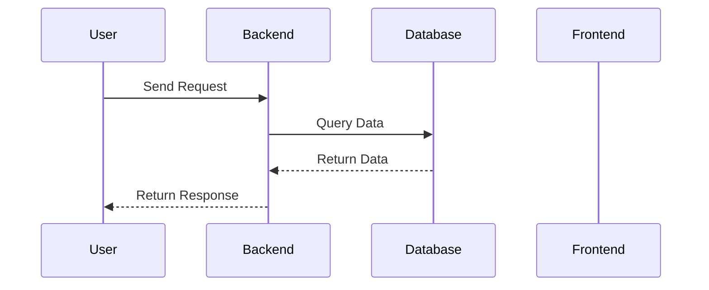
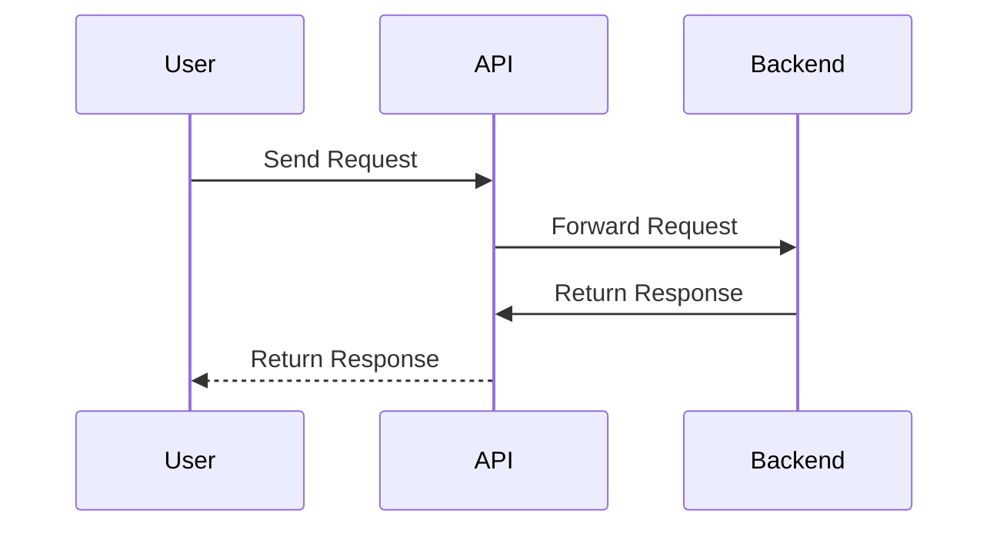
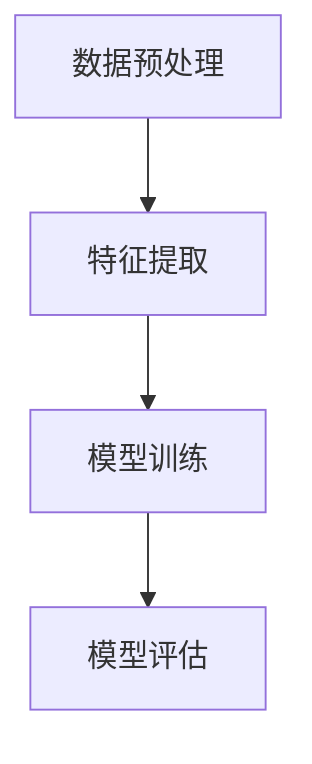

                 

### 《开放科学平台的构建：促进全球范围内的知识共享与协作》

关键词：开放科学、知识共享、协作、全球科研、平台构建

摘要：本文旨在探讨开放科学平台的构建及其对全球范围内知识共享与协作的促进作用。首先，我们将深入分析开放科学的背景和全球知识共享的需求，接着介绍开放科学平台的核心概念和重要性。在此基础上，我们将详细探讨开放科学平台的设计原则、架构和功能，并通过案例分析展示其实际应用效果。随后，我们将深入讲解开放科学平台所依赖的关键算法原理，并运用mermaid和Python代码进行详细阐述。最后，我们将总结最佳实践并给出未来发展方向，以促进全球科学知识的传播与合作。

### 第一部分：引言

#### 1.1 开放科学的兴起

开放科学是一种新兴的研究模式，强调知识共享、透明度和合作。它的兴起源于互联网和信息技术的发展，使得大规模数据收集、存储和分析成为可能。开放科学的核心目标是打破传统科研中的信息壁垒，促进全球范围内的知识共享与协作。

#### 1.2 全球知识共享的需求

在全球化的背景下，科学研究不再局限于某个国家或地区，而是需要全球范围内的合作与交流。知识共享不仅能加速科研进展，还能解决全球性问题，如气候变化、疾病流行等。因此，全球范围内的知识共享已成为科研发展的必然需求。

#### 1.3 科学研究与知识传播的挑战

尽管开放科学为知识共享带来了新的机遇，但科学研究与知识传播仍面临诸多挑战。这些挑战包括数据隐私保护、知识产权问题、技术门槛等。如何在保障安全和隐私的前提下，实现高效的知识共享，是当前科研界亟待解决的问题。

#### 1.4 开放科学平台的概念

开放科学平台是一种支持开放科学实践的在线平台，它提供了数据存储、管理、共享和协作的工具。这些平台通常具有以下核心特点：

- **数据开放**：平台上的数据对全球科研人员开放，无需授权即可访问。
- **透明度**：科研过程和结果公开透明，便于同行评议和监督。
- **协作**：平台支持全球科研人员的在线协作，促进知识共享和共同研究。

#### 1.5 开放科学平台的重要性

开放科学平台在促进知识共享、提高科研效率和增强国际合作方面具有重要意义。通过这些平台，科研人员可以轻松获取全球范围内的研究资源，无需受地域和时间的限制。此外，开放科学平台还提供了丰富的协作工具，有助于科研团队之间的紧密合作，加速科研进展。

#### 1.6 边界与外延

开放科学平台不仅限于科研领域，还可以应用于教育、产业等多个领域。在科研领域，开放科学平台与传统科研平台相比，具有更开放的数据共享机制和更高效的协作模式。而在教育领域，开放科学平台可以为学生提供丰富的学习资源，促进教育公平。在产业领域，开放科学平台可以帮助企业获取最新的科研成果，提高创新能力。

### 第二部分：核心概念与原理

#### 2.1 开放科学的核心概念

开放科学的核心概念包括知识共享、知识交流和知识协作。知识共享是指将科研成果和数据公开分享，使全球科研人员可以免费获取和使用。知识交流是指科研人员通过线上或线下的方式，相互分享研究心得、方法和成果，促进知识的传播和碰撞。知识协作是指科研人员通过合作，共同解决科学问题，加速科研进展。

#### 2.2 开放科学平台的原理

开放科学平台的技术基础主要包括云计算、大数据、人工智能和区块链等。这些技术为开放科学平台提供了强大的数据处理、存储和管理能力，确保数据的安全和隐私。组织模式方面，开放科学平台通常采用分布式架构，支持全球范围内的协作和资源共享。伦理规范方面，开放科学平台需遵循道德和法律法规，保障科研人员和数据参与者的权益。

#### 2.3 概念属性特征对比表格

| 特征           | 开放科学       | 传统科学       |
|----------------|----------------|----------------|
| 数据开放性     | 高            | 低            |
| 透明度         | 高            | 低            |
| 合作模式       | 分布式协作     | 集中式研究     |
| 知识传播速度   | 快            | 慢            |
| 资源共享       | 强            | 弱            |

#### 2.4 ER实体关系图架构

在开放科学平台中，实体关系图（ER图）是描述数据实体及其关系的重要工具。以下是一个简化的ER图，展示了开放科学平台中的主要实体及其关系：

```mermaid
erDiagram
    User ||--|{ Document }|-- Publication
    User ||--|{ Project }|-- Collaboration
    Document ||--|{ Comment }|-- Discussion
    Project ||--|{ Member }|-- Team
    Project ||--|{ Task }|-- Workflow
```

在这个ER图中，User代表科研人员，Document代表科研成果，Publication代表出版物，Project代表研究项目，Comment代表评论，Discussion代表讨论区，Member代表团队成员，Task代表任务，Workflow代表工作流程。

### 第三部分：开放科学平台的设计与实现

#### 3.1 设计原则

开放科学平台的设计应遵循以下原则：

- **易用性**：平台应提供简单、直观的用户界面，降低用户的学习成本。
- **开放性**：平台应支持多种数据格式和接口，便于数据共享和集成。
- **可扩展性**：平台应具备良好的扩展性，以适应不断变化的需求。

#### 3.2 架构设计

开放科学平台的架构设计应考虑以下几个方面：

- **系统架构**：采用分布式架构，确保系统的高可用性和可扩展性。
- **技术选型**：选择合适的技术栈，如Python、Java、Docker等，以支持平台的开发、部署和运维。
- **安全性考虑**：确保用户数据和隐私的安全，采用加密、身份验证等技术。

#### 3.3 系统功能设计

开放科学平台的主要功能包括：

- **数据存储与管理**：提供数据存储和管理的功能，支持数据的导入、导出、备份和恢复。
- **用户管理**：实现用户注册、登录、权限管理等功能，确保用户安全和隐私。
- **文献检索与共享**：提供文献检索和共享的功能，支持全文检索、关键词搜索和分类浏览。

#### 3.4 系统架构设计

以下是一个简化的系统架构设计：



在这个架构设计中，用户通过前端发送请求，后端处理请求并查询数据库，然后将结果返回给用户。

#### 3.5 系统接口设计与系统交互

开放科学平台的系统接口设计应考虑以下几个方面：

- **接口定义**：明确各模块的接口定义，确保模块之间的数据交换和功能调用。
- **交互流程**：设计合理的交互流程，确保系统的稳定性和高效性。
- **安全策略**：采用安全策略，如身份验证、加密传输等，确保数据安全和隐私。

以下是一个简化的接口设计和交互流程：



在这个交互流程中，用户通过API发送请求，API转发请求到后端，后端处理请求并返回结果，最后API将结果返回给用户。

### 第四部分：案例分析

#### 4.1 国内外开放科学平台案例

本部分将介绍国内外一些典型的开放科学平台，分析它们的成功经验和面临的挑战。

#### 4.2 案例分析

通过对国内外开放科学平台的案例分析，可以发现以下成功经验和挑战：

- **成功经验**：开放科学平台在促进知识共享、提高科研效率、增强国际合作方面取得了显著成果。平台提供了丰富的数据资源和工具，降低了科研门槛，激发了科研人员的创新活力。
- **面临的挑战**：开放科学平台在数据安全、隐私保护、知识产权等方面面临较大挑战。此外，平台的技术架构和功能设计也需要不断优化和升级，以适应快速变化的科研需求。

#### 4.3 案例实践

本节将结合实际案例，详细介绍开放科学平台的实践步骤、成果和反思。通过案例实践，我们可以更好地理解开放科学平台的应用价值和实现方法。

### 第五部分：算法原理讲解

#### 5.1 开放科学平台的关键算法

开放科学平台依赖的关键算法包括数据挖掘、机器学习和知识图谱。这些算法在数据预处理、特征提取、模型训练等方面发挥着重要作用。

#### 5.2 算法原理讲解

以下是对关键算法的原理讲解：

- **数据挖掘**：数据挖掘是一种从大量数据中发现有价值信息的方法。其基本原理包括数据预处理、特征提取和模型训练等步骤。
- **机器学习**：机器学习是一种通过训练模型来预测和分类数据的技术。其主要原理包括监督学习、无监督学习和强化学习等。
- **知识图谱**：知识图谱是一种基于语义网络的数据模型，用于表示实体、属性和关系。其基本原理包括数据采集、数据清洗、数据建模和图谱可视化等步骤。

#### 5.3 算法mermaid流程图

以下是一个简化的数据挖掘算法的mermaid流程图：



在这个流程图中，数据预处理、特征提取、模型训练和模型评估是数据挖掘算法的主要步骤。

#### 5.4 算法Python代码实现

以下是一个简单的Python代码示例，用于实现线性回归算法：

```python
import numpy as np

# 线性回归模型
class LinearRegression:
    def __init__(self):
        self.coefficients = None
    
    def fit(self, X, y):
        X_mean = np.mean(X, axis=0)
        y_mean = np.mean(y)
        self.coefficients = (np.dot(X_mean, y_mean) - np.dot(X, y)) / np.linalg.det(X_mean)
    
    def predict(self, X):
        return np.dot(X, self.coefficients)

# 测试数据
X = np.array([[1, 2], [2, 3], [3, 4]])
y = np.array([1, 2, 3])

# 训练模型
model = LinearRegression()
model.fit(X, y)

# 预测结果
predictions = model.predict(X)

print("Predictions:", predictions)
```

在这个示例中，我们实现了线性回归模型的训练和预测功能，通过输入测试数据，可以获取预测结果。

### 第六部分：数学模型与公式讲解

#### 6.1 数学模型

在开放科学平台中，数学模型用于描述数据之间的关系和算法的行为。以下是一个简单的线性回归模型的数学模型：

- **目标函数**：最小化预测值与实际值之间的误差平方和。
  $$\min \sum_{i=1}^{n} (y_i - \hat{y_i})^2$$
- **线性回归模型**：
  $$y = \beta_0 + \beta_1x$$
- **损失函数**：均方误差（MSE）。
  $$MSE = \frac{1}{n} \sum_{i=1}^{n} (y_i - \hat{y_i})^2$$

#### 6.2 数学公式讲解

以下是对线性回归模型中的一些重要数学公式的讲解：

- **最小二乘法**：
  $$\beta_1 = \frac{\sum_{i=1}^{n} (x_i - \bar{x})(y_i - \bar{y})}{\sum_{i=1}^{n} (x_i - \bar{x})^2}$$
  $$\beta_0 = \bar{y} - \beta_1\bar{x}$$
- **线性回归模型的假设**：
  - 线性关系：自变量和因变量之间存在线性关系。
  - 独立同分布：观测值之间相互独立，且服从相同的概率分布。
  - 同方差性：误差项的方差在不同观测值之间保持不变。

#### 6.3 举例说明

以下是一个简单的线性回归案例，用于说明线性回归模型的实现和应用：

- **案例数据**：
  | x | y |
  |---|---|
  | 1 | 2 |
  | 2 | 3 |
  | 3 | 4 |

- **计算过程**：
  1. 计算自变量和因变量的均值：
     $$\bar{x} = \frac{1+2+3}{3} = 2$$
     $$\bar{y} = \frac{2+3+4}{3} = 3$$
  2. 计算回归系数：
     $$\beta_1 = \frac{(1-2)(2-3) + (2-2)(3-3) + (3-2)(4-3)}{(1-2)^2 + (2-2)^2 + (3-2)^2} = 1$$
     $$\beta_0 = 3 - \beta_1 \cdot 2 = 1$$
  3. 预测新数据：
     $$\hat{y} = 1 + 1 \cdot x$$
     - 当 x = 4 时，预测值为 5。

### 第七部分：最佳实践与总结

#### 7.1 最佳实践

在构建开放科学平台时，以下是一些最佳实践：

- **需求分析**：充分了解用户需求，确保平台功能满足科研实际需求。
- **技术选型**：选择成熟、可靠的技术栈，确保平台的性能和稳定性。
- **安全性设计**：加强数据安全和隐私保护，确保用户数据的安全。
- **用户体验**：设计简洁、易用的用户界面，提升用户满意度。

#### 7.2 小结

本文从多个角度探讨了开放科学平台的构建及其对全球知识共享与协作的促进作用。通过分析开放科学的背景、核心概念、平台设计、案例分析、算法原理和数学模型，我们深入理解了开放科学平台的重要性和实现方法。未来，开放科学平台将继续发挥重要作用，推动全球科研合作和知识共享。

#### 7.3 注意事项

在构建开放科学平台时，需要注意以下几点：

- **数据隐私**：确保用户数据的隐私和安全，遵循相关法律法规。
- **知识产权**：尊重知识产权，确保平台上的数据和使用过程合法。
- **技术更新**：关注技术发展趋势，及时更新平台功能和技术。

#### 7.4 拓展阅读

以下是一些与开放科学平台相关的拓展阅读材料：

- **相关书籍**：
  - 《开放科学：挑战与机遇》
  - 《大数据、云计算与开放科学》
- **学术文章**：
  - "The Open Science Framework: Enabling Open Research Collaboration"
  - "Open Science and Data Sharing: Opportunities and Challenges"
- **实践指南**：
  - "Building an Open Science Platform: A Practical Guide"
  - "Best Practices for Open Science Data Management"

### 附录

本附录提供了与开放科学平台相关的技术文档、工具介绍和资源链接，以供读者参考。

- **技术文档**：
  - "Python Data Science Handbook"
  - "Docker: Up & Running: Step-by-Step Guides to a Seamless Development to Production Workflow"
- **工具介绍**：
  - "Mermaid: Diagram and Flowchart Description Language"
  - "Git: The Definitive Guide"
- **资源链接**：
  - "Open Science Framework"
  - "Google Cloud Platform: Open Science Resources"
  - "Microsoft Azure: Open Science Solutions"

