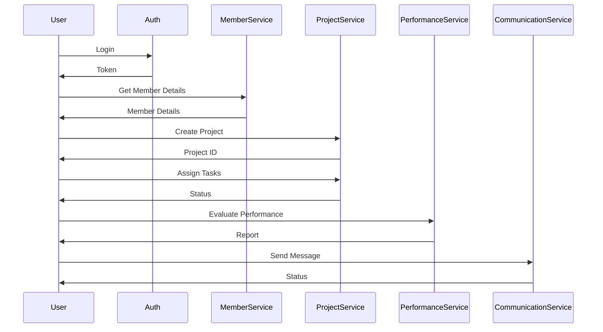
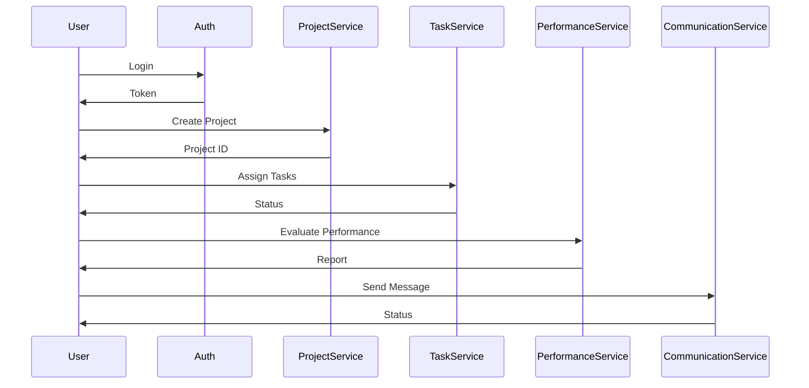

                 

# 弹性工作团队管理：平衡自由与责任

关键词：弹性工作团队、管理、自由与责任、核心概念、算法原理、系统架构

摘要：本文旨在探讨弹性工作团队管理中的自由与责任平衡问题，通过分析弹性工作团队的定义、优势与挑战，探讨关键管理因素，提出核心概念与联系，详细讲解算法原理和系统架构设计，并提供实际案例分析和最佳实践建议，以帮助企业管理者在现代工作环境中实现弹性工作团队的有序管理。

# 目录大纲设计：弹性工作团队管理

## 第一部分：引言与背景

### 第1章：问题背景

#### 1.1 弹性工作团队的概念

**1.1.1 弹性工作团队的定义**

**1.1.2 弹性工作团队与传统团队的区别**

**1.1.3 弹性工作团队的优势与挑战**

### 第2章：问题描述

#### 2.1 当前弹性工作团队管理的现状

**2.1.1 现代工作环境的变化**

**2.1.2 弹性工作团队面临的挑战**

**2.1.3 企业对弹性工作团队管理的需求**

### 第3章：问题解决

#### 3.1 弹性工作团队管理的关键因素

**3.1.1 团队成员的角色与职责**

**3.1.2 团队沟通与协作**

**3.1.3 项目管理与进度控制**

### 第4章：边界与外延

#### 4.1 弹性工作团队管理的边界

**4.1.1 个人绩效与团队绩效的关系**

**4.1.2 企业文化对弹性工作团队管理的影响**

#### 4.2 弹性工作团队管理的拓展

**4.2.1 跨部门协作与团队规模**

**4.2.2 长期远程工作与团队凝聚力**

## 第二部分：核心概念与联系

### 第5章：核心概念原理

#### 5.1 弹性工作团队管理的基本原理

**5.1.1 团队管理的心理学基础**

**5.1.2 团队成员的行为与激励**

#### 5.2 核心概念属性特征对比表格

**5.2.1 传统管理与弹性管理对比**

**5.2.2 个体自主性与团队目标一致性**

### 第6章：ER实体关系图架构

#### 6.1 团队成员实体关系图

**6.1.1 成员信息管理**

**6.1.2 成员角色分配**

#### 6.2 项目管理实体关系图

**6.2.1 项目目标与任务分配**

**6.2.2 进度跟踪与反馈机制**

## 第三部分：算法原理讲解

### 第7章：算法原理

#### 7.1 团队绩效评估算法

**7.1.1 算法mermaid流程图**

**7.1.2 算法原理与数学模型**

**7.1.3 Python源代码实现**

#### 7.2 团队成员激励算法

**7.2.1 算法原理与数学模型**

**7.2.2 Python源代码实现**

## 第四部分：系统分析与架构设计

### 第8章：问题场景介绍

#### 8.1 项目介绍

**8.1.1 项目背景**

**8.1.2 项目目标**

### 第9章：系统功能设计

#### 9.1 领域模型mermaid类图

**9.1.1 成员类**

**9.1.2 项目类**

**9.1.3 沟通工具类**

### 第10章：系统架构设计

#### 10.1 mermaid架构图

**10.1.1 整体架构**

**10.1.2 关键模块功能**

### 第11章：系统接口设计和系统交互

#### 11.1 系统接口设计

**11.1.1 成员信息接口**

**11.1.2 项目管理接口**

**11.1.3 沟通工具接口**

#### 11.2 系统交互mermaid序列图

**11.2.1 成员信息管理交互**

**11.2.2 项目管理交互**

**11.2.3 沟通工具交互**

## 第五部分：项目实战

### 第12章：环境安装

#### 12.1 环境准备

**12.1.1 系统要求**

**12.1.2 环境搭建步骤**

### 第13章：系统核心实现

#### 13.1 源代码解读

**13.1.1 成员类源代码分析**

**13.1.2 项目类源代码分析**

**13.1.3 沟通工具类源代码分析**

### 第14章：代码应用解读与分析

#### 14.1 代码应用场景

**14.1.1 成员信息管理应用**

**14.1.2 项目管理应用**

**14.1.3 沟通工具应用**

### 第15章：实际案例分析和详细讲解

#### 15.1 案例介绍

**15.1.1 案例背景**

**15.1.2 案例目标**

#### 15.2 案例分析

**15.2.1 团队管理问题**

**15.2.2 解决方案与效果**

### 第16章：项目小结

#### 16.1 项目总结

**16.1.1 项目成果**

**16.1.2 项目经验与教训**

#### 16.2 最佳实践 tips

**16.2.1 团队管理建议**

**16.2.2 系统使用技巧**

### 第17章：注意事项

#### 17.1 常见问题解答

## 第1章：问题背景

### 第1章：问题背景

在现代信息技术和远程办公的推动下，弹性工作团队的概念逐渐成为企业管理的热点。弹性工作团队与传统团队相比，具有更多的自主性、灵活性和适应性。然而，这种工作模式也带来了管理和沟通上的新挑战。本文将围绕弹性工作团队管理中的自由与责任平衡问题，展开深入探讨。

#### 1.1 弹性工作团队的概念

**1.1.1 弹性工作团队的定义**

弹性工作团队是指成员可以根据个人需求和工作任务，灵活安排工作时间和地点的团队。这种工作模式通常依赖于现代通信技术和协作工具，以实现远程办公和高效协作。

**1.1.2 弹性工作团队与传统团队的区别**

与传统团队相比，弹性工作团队具有以下特点：

- **工作时间和地点的灵活性**：成员可以不受固定工作时间和地点的限制，根据个人需求和任务安排自由工作。
- **团队规模和组织形式**：弹性工作团队可能由多个部门、不同地域的成员组成，组织形式更加灵活。
- **协作方式**：依赖于现代通信技术和协作工具，如视频会议、即时通讯、项目管理软件等。

**1.1.3 弹性工作团队的优势与挑战**

**优势：**

- **提高工作效率**：成员可以灵活安排工作，减少通勤时间，提高工作效率。
- **人才吸引力**：弹性工作团队有利于吸引全球范围内的人才，提高企业竞争力。
- **促进创新**：团队成员可以自由交流，碰撞出更多的创意和想法。

**挑战：**

- **沟通和协作难题**：远程办公可能导致沟通不畅和协作困难。
- **个人与团队目标的平衡**：成员可能过于追求个人自由，影响团队整体进度。
- **管理难度**：弹性工作团队的管理需要更加精细和高效，以应对复杂的工作环境和任务。

#### 1.2 当前弹性工作团队管理的现状

随着信息技术的发展，越来越多的企业开始采用弹性工作团队模式。根据一项调查显示，全球已有超过50%的企业实施了弹性工作政策。然而，当前弹性工作团队管理仍然面临一些问题：

- **管理理念滞后**：许多企业的管理理念仍然停留在传统模式，难以适应弹性工作团队的需求。
- **技术支持不足**：虽然大多数企业提供了远程办公的技术支持，但仍然存在一些技术难题，如网络安全、数据备份等。
- **员工培训和激励**：弹性工作团队的管理需要更加注重员工培训和激励，以提高团队凝聚力和工作效率。

#### 1.3 企业对弹性工作团队管理的需求

随着市场竞争的加剧，企业对弹性工作团队管理的需求日益迫切。企业需要通过以下措施来提高弹性工作团队的管理水平：

- **制定明确的管理策略**：企业应制定适合弹性工作团队的明确管理策略，包括工作流程、考核机制、激励机制等。
- **提升技术水平**：企业应加大对远程办公技术的投入，提供完善的技术支持，确保团队沟通和协作的顺畅。
- **加强员工培训**：企业应加强员工培训，提高员工对弹性工作模式的理解和适应能力，培养团队协作精神。
- **注重团队文化建设**：企业应注重团队文化建设，建立良好的团队氛围，增强团队凝聚力和归属感。

#### 1.4 问题与解决方案

在弹性工作团队管理中，企业面临的主要问题包括沟通不畅、个人与团队目标的冲突、管理难度增加等。针对这些问题，企业可以采取以下解决方案：

- **加强沟通与协作**：企业应采用多种沟通工具和协作方式，提高团队沟通效率和协作效果。
- **建立科学的管理机制**：企业应建立科学的管理机制，明确团队成员的角色和职责，制定合理的工作流程和考核标准。
- **提供技术支持**：企业应提供必要的技术支持，确保团队成员能够顺利开展远程工作。
- **培养团队精神**：企业应注重团队文化建设，培养团队成员的团队精神和协作能力。

通过上述措施，企业可以有效地平衡弹性工作团队中的自由与责任，提高团队的工作效率和质量，实现企业目标。

## 第2章：问题描述

### 第2章：问题描述

在当今快速变化和高度竞争的商业环境中，弹性工作团队已成为许多企业的选择。然而，这种新型工作模式也带来了一系列管理上的挑战，需要企业领导者深入探讨和解决。本章节将分析当前弹性工作团队管理的现状，探讨弹性工作团队面临的挑战，并阐述企业对弹性工作团队管理的具体需求。

#### 2.1 当前弹性工作团队管理的现状

随着信息技术的进步，远程办公工具和协作平台的普及，越来越多的企业开始尝试建立弹性工作团队。当前，弹性工作团队管理的现状呈现出以下几个特点：

1. **技术应用普及**：大多数企业已经开始采用各种远程办公工具，如视频会议软件、项目管理工具、即时通讯工具等，以支持弹性工作团队的高效运作。
2. **工作模式多样化**：企业根据业务需求和员工特点，灵活调整工作模式，包括全远程办公、弹性工作制和混合办公模式等。
3. **管理理念更新**：越来越多的企业开始认识到，传统的管理理念和方法已无法适应弹性工作团队的需求，逐步向以人为本、赋能员工的方向转变。

#### 2.2 弹性工作团队面临的挑战

尽管弹性工作团队在提高工作效率、增强人才吸引力等方面具有明显优势，但其管理上的挑战也不容忽视：

1. **沟通与协作难题**：远程办公环境下，团队成员之间缺乏面对面的交流，可能导致信息传递不畅、协作效率降低。
2. **个人与团队目标的平衡**：弹性工作团队中，个人自由度较高，但这也可能导致部分成员过于追求个人目标，影响团队的整体进度。
3. **管理难度增加**：弹性工作团队的管理更加复杂，企业需要掌握更加精细的管理技能，以应对多样化的工作场景。

#### 2.3 企业对弹性工作团队管理的需求

面对弹性工作团队带来的挑战，企业需要采取一系列措施来提升管理效果：

1. **明确管理策略**：企业需要制定明确的管理策略，包括工作流程、考核标准、激励机制等，以确保团队成员能够明确自己的职责和目标。
2. **提升技术水平**：企业需要不断升级远程办公技术，确保团队成员能够顺畅地使用各种协作工具，提高工作效率。
3. **加强员工培训**：企业应加强对员工的培训，提高其适应弹性工作模式的能力，培养团队协作精神和责任感。
4. **注重团队文化建设**：企业应注重团队文化建设，建立积极的团队氛围，增强团队的凝聚力和归属感。

#### 2.4 案例分析

为了更好地理解弹性工作团队管理的现状和挑战，我们来看一个实际案例：

**案例背景**：某科技公司在全球范围内拥有多名技术专家和工程师，他们经常需要跨地区合作，开展复杂项目。为了提高工作效率和团队凝聚力，公司决定采用弹性工作团队模式。

**案例挑战**：

- **沟通与协作**：由于团队成员分布在不同的时区，面对面交流的机会较少，导致信息传递不畅。
- **个人目标与团队目标的平衡**：部分成员倾向于追求个人成就，忽视团队的整体进度。
- **管理难度**：公司在管理弹性工作团队时面临诸多挑战，包括如何制定合理的工作流程、如何考核团队成员的表现等。

**解决方案**：

- **建立多渠道沟通机制**：公司通过即时通讯工具、邮件和视频会议等多种方式，确保团队成员能够及时沟通和协作。
- **制定明确的目标和职责**：公司明确每个成员的工作目标和职责，确保团队成员对团队目标有清晰的认识。
- **加强培训和激励机制**：公司定期开展培训，提高员工对弹性工作模式的适应能力，并设置激励机制，鼓励团队成员积极参与团队工作。

通过以上措施，该公司成功解决了弹性工作团队管理中面临的主要问题，提高了团队的工作效率和凝聚力。

#### 2.5 总结

弹性工作团队管理是现代企业管理中的一项重要课题。企业需要认识到弹性工作团队带来的挑战，并采取有效措施进行应对。通过明确管理策略、提升技术水平、加强员工培训和注重团队文化建设，企业可以更好地平衡弹性工作团队中的自由与责任，实现团队的高效运作。

### 第3章：问题解决

弹性工作团队管理中的自由与责任平衡问题，是现代企业管理面临的重大挑战。为了解决这一问题，企业需要从多个维度入手，综合考虑团队成员的角色与职责、团队沟通与协作、项目管理与进度控制等方面。本文将详细探讨这些问题，并提出相应的解决方案。

#### 3.1 弹性工作团队管理的关键因素

弹性工作团队管理的成功与否，取决于多个关键因素的协调与平衡。以下是几个关键因素及其重要性：

**团队成员的角色与职责**

弹性工作团队中，每个成员的角色和职责需要明确界定。这不仅有助于提高团队协作效率，还能确保团队目标的实现。

- **重要性**：明确每个成员的角色和职责，有助于避免工作中的混乱和职责重叠，确保团队工作的高效运作。
- **解决方案**：企业应制定详细的岗位职责说明书，明确每个成员的职责和工作内容。同时，通过定期沟通和反馈，确保团队成员对岗位职责有清晰的认识。

**团队沟通与协作**

在远程办公环境中，有效的沟通与协作至关重要。良好的沟通可以减少误解和冲突，提高团队协作效率。

- **重要性**：沟通与协作是弹性工作团队成功的关键。缺乏有效的沟通可能导致信息传递不畅、任务执行不力。
- **解决方案**：企业应采用多种沟通工具，如即时通讯软件、邮件、视频会议等，确保团队成员能够及时、高效地进行沟通。此外，建立明确的沟通流程和反馈机制，有助于提高团队协作效率。

**项目管理与进度控制**

在弹性工作团队中，项目管理与进度控制是确保项目成功的关键。有效的项目管理可以确保团队目标的实现，提高工作效率。

- **重要性**：项目管理与进度控制是确保项目按时完成、质量达标的重要保障。
- **解决方案**：企业应采用先进的项目管理工具，如项目管理软件、看板系统等，对项目进度进行实时监控和调整。同时，制定合理的工作计划和考核标准，确保团队成员能够按照计划高效工作。

#### 3.2 团队成员的角色与职责

弹性工作团队中，团队成员的角色和职责需要明确界定。以下是团队成员常见的角色和职责：

**角色**：

- **领导者**：负责团队的总体规划和决策，协调团队成员的工作。
- **技术专家**：负责项目的技术实施和问题解决。
- **业务分析师**：负责业务需求分析和需求管理。
- **设计师**：负责项目的设计和视觉实现。
- **测试工程师**：负责项目的测试和问题追踪。

**职责**：

- **领导者**：制定团队目标和计划，协调团队成员的工作，确保团队目标的实现。
- **技术专家**：负责技术方案的制定和实施，解决项目中的技术问题。
- **业务分析师**：与客户和团队成员沟通，确保项目需求得到充分理解和满足。
- **设计师**：负责项目的设计和视觉实现，确保项目符合业务需求。
- **测试工程师**：负责项目的测试工作，确保项目质量符合标准。

#### 3.3 团队沟通与协作

良好的沟通与协作是弹性工作团队成功的关键。以下是提高团队沟通与协作效率的几个方法：

**方法**：

- **使用即时通讯工具**：采用即时通讯工具，如Slack、Microsoft Teams等，方便团队成员实时交流。
- **定期召开视频会议**：通过视频会议，团队成员可以面对面交流，增进了解和信任。
- **建立明确的沟通流程**：制定明确的沟通流程和反馈机制，确保信息传递畅通。
- **共享项目进度**：通过项目管理工具，如Jira、Trello等，实时共享项目进度，确保团队成员对项目有清晰的认识。

#### 3.4 项目管理与进度控制

项目管理与进度控制是弹性工作团队管理的重要组成部分。以下是几个关键环节：

**关键环节**：

- **项目规划**：明确项目目标、任务和工作量，制定合理的工作计划和进度安排。
- **任务分配**：根据团队成员的技能和经验，合理分配任务，确保每个成员都有明确的职责和目标。
- **进度监控**：通过项目管理工具，实时监控项目进度，及时发现和解决问题。
- **绩效评估**：对团队成员的工作进行定期评估，确保项目目标的实现。

#### 3.5 解决方案实施与效果评估

在实施弹性工作团队管理解决方案时，企业需要关注以下几个关键点：

**关键点**：

- **评估团队适应能力**：在实施解决方案前，评估团队成员对弹性工作模式的适应能力，确保团队成员能够顺利过渡。
- **持续优化管理方法**：根据实际情况，不断优化管理方法和流程，提高团队工作效率。
- **建立反馈机制**：通过定期反馈和评估，收集团队成员的意见和建议，不断改进管理方法。

通过上述措施，企业可以有效解决弹性工作团队管理中的自由与责任平衡问题，实现团队的高效运作。

### 第4章：边界与外延

#### 4.1 弹性工作团队管理的边界

弹性工作团队管理的边界主要涉及个人绩效与团队绩效的关系和企业文化对弹性工作团队管理的影响。

**4.1.1 个人绩效与团队绩效的关系**

个人绩效和团队绩效是弹性工作团队管理中的重要方面。个人绩效是指团队成员在个人职责范围内的表现，而团队绩效是指整个团队在完成共同任务时的表现。在弹性工作团队中，个人绩效与团队绩效之间的关系需要平衡：

- **相互促进**：良好的个人绩效可以推动团队绩效的提升，反之亦然。团队成员通过共同努力，实现个人目标的同时，也为团队目标的实现做出贡献。
- **相互制约**：如果个人过于追求个人绩效，可能会忽视团队协作和整体进度，影响团队绩效。因此，企业需要制定合理的绩效考核标准和激励措施，确保个人绩效与团队绩效的平衡。

**4.1.2 企业文化对弹性工作团队管理的影响**

企业文化是影响弹性工作团队管理的重要因素。一个积极、开放、包容的企业文化有助于弹性工作团队的管理和运作：

- **赋能员工**：企业文化应鼓励员工自主学习和创新，为员工提供足够的空间和资源，支持他们实现个人和团队目标。
- **建立信任**：企业文化应建立团队成员之间的信任，促进开放和坦诚的沟通，减少信息传递的障碍。
- **培养团队精神**：企业文化应强调团队合作和共赢，培养团队成员的团队意识，增强团队的凝聚力。

**4.2 弹性工作团队管理的拓展**

弹性工作团队管理的拓展主要涉及跨部门协作、团队规模和长期远程工作与团队凝聚力。

**4.2.1 跨部门协作与团队规模**

弹性工作团队往往需要跨部门协作，以实现复杂项目的顺利推进。跨部门协作的拓展需要注意以下几点：

- **明确责任**：跨部门协作时，需要明确各部门的职责和任务，确保工作流程的顺畅。
- **协调资源**：跨部门协作需要协调不同部门的人力、物力和财力资源，确保项目所需的资源得到充分保障。
- **建立沟通机制**：跨部门协作需要建立有效的沟通机制，如定期会议、即时通讯等，确保各部门之间的信息传递和协作。

团队规模的拓展也需要注意：

- **规模适度**：团队规模应根据项目需求和团队管理能力合理确定，避免团队规模过大导致管理难度增加。
- **动态调整**：团队规模应根据项目进展和团队绩效动态调整，确保团队始终能够高效运作。

**4.2.2 长期远程工作与团队凝聚力**

长期远程工作对团队凝聚力提出了新的挑战。为了维持团队的凝聚力，企业可以采取以下措施：

- **定期线下聚会**：定期组织线下聚会，如团队建设活动、拓展训练等，增强团队成员之间的联系。
- **线上互动**：通过线上互动，如团队游戏、在线聊天等，保持团队成员之间的联系和交流。
- **信任建设**：通过建立信任和互助机制，增强团队成员之间的信任感和归属感。

通过以上措施，企业可以有效地拓展弹性工作团队管理的边界，提高团队的整体运作效率和凝聚力。

### 第5章：核心概念原理

弹性工作团队管理的核心概念和原理是确保团队高效运作和目标实现的基础。本章节将探讨弹性工作团队管理的基本原理，分析团队成员的行为与激励，并对比传统管理与弹性管理的核心特征。

#### 5.1 弹性工作团队管理的基本原理

弹性工作团队管理的基本原理包括以下几个方面：

**5.1.1 团队管理的心理学基础**

心理学在弹性工作团队管理中起着至关重要的作用。以下是心理学在团队管理中的应用：

- **信任与安全感**：团队成员之间建立信任和安全感，有助于提高团队协作效率和创造力。企业可以通过培训、沟通和文化建设来培养团队成员之间的信任。
- **动机与激励**：了解团队成员的动机和需求，有助于制定合理的激励措施，提高团队成员的工作积极性和满意度。例如，通过设定目标、奖励机制和职业发展机会来激励团队成员。
- **情绪管理**：情绪管理是弹性工作团队管理中的重要方面。团队成员需要学会有效管理自己的情绪，避免负面情绪对工作产生负面影响。企业可以通过培训和心理辅导来帮助团队成员提升情绪管理能力。

**5.1.2 团队成员的行为与激励**

团队成员的行为和激励是弹性工作团队管理的关键因素。以下是一些影响团队成员行为和激励的因素：

- **目标设定**：明确的目标是团队成员行动的指南针。企业应制定具体的、可衡量的目标，确保团队成员对目标有清晰的认识。
- **反馈与认可**：及时、有效的反馈和认可是激励团队成员的重要手段。企业应建立反馈机制，鼓励团队成员分享工作进展和成果，并给予认可和奖励。
- **职业发展**：为团队成员提供职业发展机会和培训，有助于提高他们的工作积极性和忠诚度。企业可以通过内部晋升、外部培训和职业规划来支持团队成员的职业发展。

#### 5.2 核心概念属性特征对比表格

以下是一个对比传统管理与弹性管理核心特征属性的表格：

| 特征属性 | 传统管理 | 弹性管理 |
| --- | --- | --- |
| **工作地点** | 固定办公地点 | 自由选择办公地点 |
| **工作时间** | 固定工作时长 | 弹性工作时长 |
| **沟通方式** | 面对面沟通 | 远程沟通 |
| **管理机制** | 严格规章制度 | 灵活管理制度 |
| **绩效考核** | 定期考核 | 持续考核 |
| **团队协作** | 面对面协作 | 远程协作 |
| **团队文化** | 单一文化 | 多元文化 |

#### 5.3 个体自主性与团队目标一致性

在弹性工作团队管理中，个体自主性和团队目标一致性是一个重要的平衡点。以下是如何实现这一平衡：

**5.3.1 提高个体自主性**

- **赋予决策权**：给予团队成员更多的决策权，让他们在职责范围内自主决策，提高工作积极性和满意度。
- **提供培训**：为团队成员提供培训和学习机会，提高他们的专业技能和自主解决问题的能力。

**5.3.2 确保团队目标一致性**

- **明确目标**：确保团队成员对团队目标有清晰的认识，通过沟通和协作，确保团队成员在实现个人目标的同时，也为团队目标的实现贡献力量。
- **定期回顾**：定期回顾团队目标的实现情况，及时调整计划和策略，确保团队目标的一致性。

通过以上措施，企业可以有效地平衡弹性工作团队中的个体自主性和团队目标一致性，实现团队的高效运作和目标实现。

### 第6章：ER实体关系图架构

在弹性工作团队管理中，明确团队成员之间的关系和角色分配对于确保团队高效运作至关重要。本章节将介绍团队成员实体关系图和项目管理实体关系图，通过ER（实体关系）图架构来展示团队成员、项目管理等核心元素之间的关系。

#### 6.1 团队成员实体关系图

团队成员实体关系图用于描述团队成员之间的基本关系和角色分配。以下是一个简单的团队成员ER图：

```mermaid
erDiagram
MEMBER ||--|{ PROJECT_MEMBER }
MEMBER ||--|{ ROLE }
PROJECT_MEMBER ||--|{ TASK }
```

**6.1.1 成员信息管理**

- **MEMBER（成员）**：表示团队成员的基本信息，如姓名、职位、联系方式等。
- **ROLE（角色）**：表示团队成员在团队中的角色，如领导者、技术专家、业务分析师等。
- **PROJECT_MEMBER（项目成员）**：表示成员参与的项目及其角色，如项目负责人、开发人员等。
- **TASK（任务）**：表示项目成员负责的任务，如设计、开发、测试等。

**6.1.2 成员角色分配**

团队成员角色分配是确保项目顺利进行的关键。通过角色分配，可以明确每个成员在项目中的职责和任务，避免工作重叠和资源浪费。

#### 6.2 项目管理实体关系图

项目管理实体关系图用于描述项目目标、任务分配和进度跟踪等关键环节。以下是一个简单的项目管理ER图：

```mermaid
erDiagram
PROJECT ||--|{ TASK }
PROJECT ||--|{ DELIVERABLE }
TASK ||--|{ STATUS }
TASK ||--|{ MILESTONE }
DELIVERABLE ||--|{ REVIEW }
```

**6.2.1 项目目标与任务分配**

- **PROJECT（项目）**：表示项目的总体目标、范围和里程碑。
- **TASK（任务）**：表示项目中的具体任务，如设计、开发、测试等。
- **DELIVERABLE（可交付成果）**：表示项目的可交付成果，如软件、报告等。
- **STATUS（状态）**：表示任务的状态，如进行中、已完成等。
- **MILESTONE（里程碑）**：表示项目的关键节点和进度。

**6.2.2 进度跟踪与反馈机制**

进度跟踪与反馈机制是确保项目按时完成的重要手段。通过实时监控任务状态和里程碑的达成情况，可以及时发现和解决问题，确保项目顺利进行。

通过ER实体关系图的构建，企业可以清晰地了解团队成员和管理项目之间的关系，为弹性工作团队管理提供有力的支持。ER图不仅有助于团队成员明确自己的角色和任务，还有助于项目管理人员对项目进行有效的监控和调整。

### 第7章：算法原理

弹性工作团队管理中的算法设计对于确保团队高效运作和目标实现至关重要。本章节将详细介绍两种关键算法：团队绩效评估算法和团队成员激励算法，包括算法mermaid流程图、原理与数学模型以及Python源代码实现。

#### 7.1 团队绩效评估算法

团队绩效评估算法用于衡量团队在项目中的整体表现，评估标准包括任务完成率、问题解决能力、团队协作水平等。以下是一个团队绩效评估算法的mermaid流程图：

```mermaid
flowchart LR
A[开始] --> B[初始化评估参数]
B --> C{计算任务完成率}
C -->|任务完成率} D[计算问题解决能力]
D -->|问题解决能力} E[计算团队协作水平]
E -->|团队协作水平} F[综合评估得分]
F --> G[输出评估结果]
G --> H[结束]
```

**7.1.1 算法原理与数学模型**

团队绩效评估算法的数学模型如下：

- **任务完成率**（Task Completion Rate，TCR）：用于衡量任务完成的进度。
  \[ TCR = \frac{Completed Tasks}{Total Tasks} \]

- **问题解决能力**（Problem Solving Ability，PSA）：用于衡量团队在遇到问题时的解决能力。
  \[ PSA = \frac{Solved Problems}{Total Problems} \]

- **团队协作水平**（Team Collaboration Level，TCL）：用于衡量团队成员之间的协作效果。
  \[ TCL = \frac{Successful Collaborations}{Total Collaborations} \]

- **综合评估得分**（Overall Performance Score，OPS）：通过综合三个评估指标计算得出。
  \[ OPS = TCR \times \alpha + PSA \times \beta + TCL \times \gamma \]
  其中，\(\alpha\)、\(\beta\) 和 \(\gamma\) 分别为三个评估指标的权重，通常根据实际情况设定。

**7.1.2 Python源代码实现**

以下是一个Python源代码实现的示例：

```python
def calculate_team_performance(completed_tasks, total_tasks, solved_problems, total_problems, successful_collaborations, total_collaborations, weights):
    task_completion_rate = completed_tasks / total_tasks
    problem_solving_ability = solved_problems / total_problems
    team_collaboration_level = successful_collaborations / total_collaborations

    overall_performance_score = (task_completion_rate * weights['TCR']) + (problem_solving_ability * weights['PSA']) + (team_collaboration_level * weights['TCL'])
    
    return overall_performance_score

# 示例参数
completed_tasks = 25
total_tasks = 30
solved_problems = 10
total_problems = 15
successful_collaborations = 5
total_collaborations = 10
weights = {'TCR': 0.4, 'PSA': 0.3, 'TCL': 0.3}

# 计算团队绩效评估得分
performance_score = calculate_team_performance(completed_tasks, total_tasks, solved_problems, total_problems, successful_collaborations, total_collaborations, weights)
print("Overall Performance Score:", performance_score)
```

#### 7.2 团队成员激励算法

团队成员激励算法用于根据团队成员的绩效评估结果，制定相应的激励措施，以激发团队成员的积极性和创造力。以下是一个团队成员激励算法的mermaid流程图：

```mermaid
flowchart LR
A[开始] --> B[获取绩效评估结果]
B --> C{判断绩效等级}
C -->|高绩效} D[提供奖金和晋升机会]
C -->|中绩效} E[提供培训和指导]
C -->|低绩效} F[提供改进计划]
F --> G[结束]
```

**7.2.1 算法原理与数学模型**

团队成员激励算法的原理如下：

- **绩效等级**：根据团队成员的绩效评估结果，将其分为高绩效、中绩效和低绩效三个等级。

- **激励措施**：

  - **高绩效**：提供奖金、晋升机会、表彰等激励措施。

  - **中绩效**：提供培训、指导、项目机会等激励措施。

  - **低绩效**：提供改进计划、辅导、反馈等激励措施，帮助团队成员提高绩效。

**7.2.2 Python源代码实现**

以下是一个Python源代码实现的示例：

```python
def calculate_incentive(performance_score, high_threshold, low_threshold):
    if performance_score >= high_threshold:
        incentive = '奖金和晋升机会'
    elif performance_score >= low_threshold:
        incentive = '培训和指导'
    else:
        incentive = '改进计划'
    
    return incentive

# 示例参数
performance_score = 0.8
high_threshold = 0.9
low_threshold = 0.6

# 计算激励措施
incentive = calculate_incentive(performance_score, high_threshold, low_threshold)
print("Incentive:", incentive)
```

通过上述算法和源代码的实现，企业可以实现对弹性工作团队绩效评估和激励的有效管理，从而提高团队的整体运作效率和成员的满意度。

### 第8章：系统分析与架构设计

在现代企业管理中，弹性工作团队管理系统的设计和实施至关重要。本章节将详细介绍项目场景介绍、系统功能设计、系统架构设计以及系统接口设计和系统交互，帮助企业和团队更好地实现弹性工作管理。

#### 8.1 项目介绍

**8.1.1 项目背景**

随着远程办公和远程协作的普及，企业对弹性工作团队管理系统的需求日益增加。为了提升团队协作效率、确保项目进度和质量，企业需要一个功能强大、易于使用的弹性工作团队管理系统。

**8.1.2 项目目标**

该项目的主要目标包括：

- 提供一个集中化的平台，用于管理团队成员、项目任务和进度。
- 支持远程协作和沟通，提高团队协作效率。
- 实现对团队成员绩效的评估和激励，促进团队整体发展。

#### 8.2 系统功能设计

弹性工作团队管理系统的功能设计需充分考虑团队协作和项目管理的需求。以下是系统的主要功能模块：

**8.2.1 成员信息管理**

- **成员信息登记**：用于登记团队成员的基本信息，如姓名、职位、联系方式等。
- **角色分配**：用于分配团队成员的角色，确保每个成员有明确的职责。
- **成员档案管理**：用于存储和管理团队成员的档案信息。

**8.2.2 项目管理**

- **项目创建**：用于创建新的项目，包括项目名称、项目描述、项目目标等。
- **任务分配**：用于分配项目任务给团队成员，确保任务完成。
- **进度跟踪**：用于实时监控项目进度，确保项目按时完成。
- **任务协作**：用于支持团队成员之间的协作，提高任务完成效率。

**8.2.3 沟通工具**

- **即时通讯**：用于团队成员之间的实时沟通和交流。
- **视频会议**：用于远程会议和在线讨论。
- **邮件通知**：用于发送任务提醒、进度更新等通知。

**8.2.4 绩效评估**

- **绩效评估**：用于对团队成员的绩效进行评估，包括任务完成情况、团队协作效果等。
- **激励管理**：用于根据绩效评估结果，制定相应的激励措施，如奖金、晋升机会等。

#### 8.3 系统架构设计

弹性工作团队管理系统的架构设计需确保系统的稳定性、可靠性和可扩展性。以下是系统的架构设计：

**8.3.1 整体架构**

系统的整体架构采用分层设计，包括表示层、业务逻辑层和数据层。各层之间通过定义良好的接口进行通信，实现模块化和高内聚、低耦合的设计原则。

**8.3.2 关键模块功能**

- **表示层**：负责系统的用户界面，包括登录、导航、功能模块等。
- **业务逻辑层**：负责系统的核心功能，如成员信息管理、项目管理、沟通工具、绩效评估等。
- **数据层**：负责数据的存储和管理，包括数据库设计、数据备份和恢复等。

**8.3.3 技术选型**

- **前端技术**：采用HTML、CSS和JavaScript等Web技术，实现系统的用户界面。
- **后端技术**：采用Python、Java等编程语言，实现系统的业务逻辑和数据管理。
- **数据库技术**：采用MySQL、MongoDB等数据库技术，实现数据存储和管理。

#### 8.4 系统接口设计和系统交互

弹性工作团队管理系统需要设计完善的接口和交互机制，以确保系统的稳定性和灵活性。

**8.4.1 系统接口设计**

系统接口设计包括以下主要接口：

- **成员信息接口**：用于管理团队成员的基本信息，如注册、登录、信息修改等。
- **项目管理接口**：用于管理项目任务，如创建项目、分配任务、监控进度等。
- **沟通工具接口**：用于实现即时通讯、视频会议等功能。
- **绩效评估接口**：用于对团队成员的绩效进行评估，生成评估报告。

**8.4.2 系统交互**

系统交互采用RESTful API设计，实现前后端的数据交互和功能调用。以下是系统交互的主要流程：

- **用户登录**：用户通过身份验证，获取登录令牌，然后使用令牌访问系统资源。
- **任务分配**：项目经理通过系统接口，将任务分配给团队成员，并实时监控任务进度。
- **绩效评估**：系统根据任务完成情况、团队协作效果等指标，自动生成绩效评估报告，并通知团队成员。

通过上述系统分析与架构设计，企业可以构建一个高效、稳定、灵活的弹性工作团队管理系统，提高团队协作效率，实现项目目标。

### 第9章：系统功能设计

为了实现弹性工作团队管理的目标，系统功能设计至关重要。本章节将详细介绍系统功能设计，包括领域模型mermaid类图、成员类、项目类和沟通工具类的详细设计。

#### 9.1 领域模型mermaid类图

领域模型是系统功能设计的核心，它定义了系统的核心实体和它们之间的关系。以下是系统的领域模型mermaid类图：

```mermaid
classDiagram
    Member <|-- ProjectMember
    Member <|-- Role
    ProjectMember <|-- Task
    ProjectMember <|-- Deliverable
    Project <|-- ProjectMember
    Project <|-- Milestone
    CommunicationTool <|-- Message
    CommunicationTool <|-- Meeting
    MemberManager <|-- Member
    ProjectManager <|-- Project
    PerformanceEvaluator <|-- PerformanceReport

    Member <<<< Person
    Project <<<< Project
    Role <<<< RoleType
    Task <<<< Task
    Deliverable <<<< Deliverable
    Message <<<< Message
    Meeting <<<< Meeting
    MemberManager <<<< Manager
    ProjectManager <<<< Manager
    PerformanceEvaluator <<<< Evaluator
```

**9.2 成员类**

成员类是系统中的核心实体，用于表示团队成员的基本信息和角色。以下是成员类的详细设计：

```mermaid
class Member {
    +String id
    +String name
    +String email
    +Role role
    +List<Task> assignedTasks

    +Member(String id, String name, String email, Role role)
    +getId(): String
    +getName(): String
    +getEmail(): String
    +getRole(): Role
    +getAssignedTasks(): List<Task>
    +addAssignedTask(Task task)
}
```

成员类的主要属性和方法包括：

- **属性**：成员ID、姓名、电子邮件、角色和分配的任务列表。
- **方法**：构造函数用于创建成员对象，获取成员信息，添加分配的任务。

**9.3 项目类**

项目类用于表示项目的基本信息和项目成员之间的关系。以下是项目类的详细设计：

```mermaid
class Project {
    +String id
    +String name
    +String description
    +List<ProjectMember> projectMembers
    +List<Milestone> milestones

    +Project(String id, String name, String description)
    +getId(): String
    +getName(): String
    +getDescription(): String
    +getProjectMembers(): List<ProjectMember>
    +getMilestones(): List<Milestone>
    +addProjectMember(ProjectMember member)
    +addMilestone(Milestone milestone)
}
```

项目类的主要属性和方法包括：

- **属性**：项目ID、名称、描述、项目成员列表和项目里程碑列表。
- **方法**：构造函数用于创建项目对象，获取项目信息，添加项目成员和项目里程碑。

**9.4 沟通工具类**

沟通工具类用于实现团队成员之间的即时通讯和会议安排。以下是沟通工具类的详细设计：

```mermaid
class CommunicationTool {
    +String id
    +String type
    +List<Message> messages
    +List<Meeting> meetings

    +CommunicationTool(String id, String type)
    +getId(): String
    +getType(): String
    +getMessages(): List<Message>
    +getMeetings(): List<Meeting>
    +sendMessage(Message message)
    +scheduleMeeting(Meeting meeting)
}
```

沟通工具类的主要属性和方法包括：

- **属性**：工具ID、类型、消息列表和会议列表。
- **方法**：构造函数用于创建沟通工具对象，获取工具信息，发送消息和安排会议。

通过详细设计系统功能，包括成员类、项目类和沟通工具类，企业可以构建一个功能强大、易于使用的弹性工作团队管理系统，提高团队协作效率和项目管理效果。

### 第10章：系统架构设计

为了确保弹性工作团队管理系统的高效、稳定和可扩展性，系统架构设计至关重要。本章节将详细介绍系统架构设计，包括mermaid架构图、整体架构、关键模块功能以及技术选型。

#### 10.1 mermaid架构图

以下是弹性工作团队管理系统的mermaid架构图：



#### 10.2 整体架构

弹性工作团队管理系统采用三层架构设计，包括表示层、业务逻辑层和数据层。以下是系统整体架构的详细描述：

1. **表示层**：负责处理用户的请求，将业务逻辑层的处理结果展示给用户。表示层采用前端技术，如HTML、CSS和JavaScript，实现用户界面。

2. **业务逻辑层**：负责处理用户请求，执行业务逻辑，并将处理结果返回给表示层。业务逻辑层包括身份验证、成员信息管理、项目管理、绩效评估和沟通工具等功能模块。

3. **数据层**：负责数据的存储和管理。数据层采用关系数据库（如MySQL）和非关系数据库（如MongoDB），实现数据的高效存储和快速查询。

#### 10.3 关键模块功能

系统架构中的关键模块功能如下：

1. **身份验证模块**：负责用户登录、注册和权限验证，确保系统安全。

2. **成员信息管理模块**：负责管理团队成员的基本信息、角色分配和任务分配，确保团队成员能够清晰了解自己的职责和任务。

3. **项目管理模块**：负责创建项目、分配任务、监控项目进度和里程碑，确保项目按时完成。

4. **绩效评估模块**：负责对团队成员的绩效进行评估，根据评估结果制定激励措施，提高团队成员的工作积极性和满意度。

5. **沟通工具模块**：负责实现团队成员之间的即时通讯、视频会议和邮件通知，确保团队成员能够高效沟通和协作。

#### 10.4 技术选型

弹性工作团队管理系统采用以下技术：

1. **前端技术**：采用HTML、CSS和JavaScript，实现用户界面和交互。

2. **后端技术**：采用Python（Django框架）和Java（Spring Boot框架），实现业务逻辑和数据管理。

3. **数据库技术**：采用MySQL和MongoDB，实现数据存储和查询。

4. **通信技术**：采用WebSocket和RESTful API，实现实时通信和接口调用。

通过上述系统架构设计，弹性工作团队管理系统可以实现高效、稳定和可扩展的管理功能，满足现代企业的需求。

### 第11章：系统接口设计和系统交互

为了实现弹性工作团队管理系统的高效运作，系统接口设计和系统交互至关重要。本章节将详细介绍系统接口设计、系统交互和mermaid序列图，确保系统能够满足用户需求并提供优质的服务。

#### 11.1 系统接口设计

系统接口设计是系统架构设计的重要组成部分，它定义了系统内部各模块之间的通信方式。以下是系统的主要接口设计：

**1. 成员信息接口**

- **接口名称**：`GET /members/`
- **功能描述**：获取所有成员的信息。
- **请求参数**：无
- **响应格式**：JSON数组，包含成员ID、姓名、电子邮件和角色等信息。

**2. 项目管理接口**

- **接口名称**：`POST /projects/`
- **功能描述**：创建新的项目。
- **请求参数**：JSON对象，包含项目名称、描述和里程碑等信息。
- **响应格式**：JSON对象，包含项目ID和创建状态。

**3. 任务分配接口**

- **接口名称**：`POST /tasks/`
- **功能描述**：分配任务给成员。
- **请求参数**：JSON对象，包含任务ID、成员ID和任务描述等信息。
- **响应格式**：JSON对象，包含任务分配状态。

**4. 绩效评估接口**

- **接口名称**：`GET /performances/`
- **功能描述**：获取成员的绩效评估结果。
- **请求参数**：成员ID。
- **响应格式**：JSON对象，包含绩效评估得分和评估报告等信息。

**5. 沟通工具接口**

- **接口名称**：`POST /messages/`
- **功能描述**：发送即时消息。
- **请求参数**：JSON对象，包含发送者ID、接收者ID和消息内容等信息。
- **响应格式**：JSON对象，包含消息发送状态。

#### 11.2 系统交互

系统交互是指系统内部各模块之间的通信过程。以下是系统的主要交互流程：

1. **用户登录**：用户通过身份验证接口获取登录令牌，然后使用令牌访问其他接口。

2. **创建项目**：用户通过项目管理接口创建项目，系统生成项目ID并返回给用户。

3. **任务分配**：用户通过任务分配接口将任务分配给成员，系统更新任务状态并返回分配结果。

4. **绩效评估**：系统根据成员的任务完成情况和团队协作效果，自动生成绩效评估报告，并通过绩效评估接口返回给用户。

5. **即时通讯**：用户通过沟通工具接口发送即时消息，系统将消息发送给指定成员。

#### 11.3 mermaid序列图

以下是系统交互的mermaid序列图：



通过上述系统接口设计和系统交互，弹性工作团队管理系统可以高效地处理用户请求，实现团队成员的信息管理、项目管理、绩效评估和即时通讯，满足企业的管理需求。

### 第12章：环境安装

为了成功运行弹性工作团队管理系统，首先需要搭建合适的环境。以下是一系列详细的步骤，用于准备所需环境、安装依赖项和配置系统。

#### 12.1 环境准备

在开始安装之前，需要准备以下环境：

- **操作系统**：Linux（推荐使用Ubuntu 20.04或更高版本）或Mac OS
- **编程语言**：Python 3.8或更高版本
- **数据库**：MySQL 5.7或更高版本或MongoDB 4.0或更高版本
- **依赖管理工具**：pip（Python包管理器）
- **版本控制**：Git

**安装步骤**：

1. **安装操作系统**：

   - 下载并安装Linux或Mac OS。

2. **更新系统软件包**：

   ```bash
   sudo apt-get update
   sudo apt-get upgrade
   ```

3. **安装Python 3**：

   - 对于Ubuntu，系统已经预装了Python 3。可以通过以下命令确认Python版本：

     ```bash
     python3 --version
     ```

   - 如果需要安装更高版本的Python，可以使用以下命令：

     ```bash
     sudo apt-get install python3.8
     sudo apt-get install python3-pip
     ```

4. **安装Git**：

   ```bash
   sudo apt-get install git
   ```

5. **安装MySQL或MongoDB**：

   - 安装MySQL：

     ```bash
     sudo apt-get install mysql-server
     sudo mysql_secure_installation
     ```

   - 安装MongoDB：

     ```bash
     sudo apt-get install mongodb
     sudo systemctl start mongodb
     ```

6. **配置数据库**：

   - 配置MySQL和MongoDB的用户和数据库，以便项目使用。

#### 12.2 环境搭建步骤

以下步骤用于安装和管理系统的依赖项：

1. **克隆项目代码**：

   ```bash
   git clone <项目地址>
   cd <项目目录>
   ```

2. **安装依赖项**：

   - 安装Python依赖项：

     ```bash
     pip3 install -r requirements.txt
     ```

   - 安装Node.js和NPM（用于前端依赖项）：

     ```bash
     curl -sL https://deb.nodesource.com/setup_14.x | sudo -E bash -
     sudo apt-get install -y nodejs
     npm install
     ```

3. **设置环境变量**：

   - 配置MySQL和MongoDB的环境变量，以便项目能够连接到数据库。

4. **运行迁移脚本**：

   - 根据项目需求，运行数据库迁移脚本，初始化数据库和表结构。

     ```bash
     python3 manage.py makemigrations
     python3 manage.py migrate
     ```

5. **启动服务**：

   - 启动项目中的Web服务和后台任务：

     ```bash
     gunicorn --workers=3 --bind=0.0.0.0:8000 wsgi:application
     ```

   - 启动前端服务：

     ```bash
     npm run start
     ```

#### 12.3 验证安装

在安装完成后，进行以下验证步骤，确保系统正常运行：

1. **访问前端界面**：

   - 在浏览器中输入`http://localhost:8000`，检查前端界面是否正确显示。

2. **测试API接口**：

   - 使用Postman或其他工具测试系统的API接口，确保接口能够正常响应。

3. **检查后台任务**：

   - 检查后台任务是否正常执行，如数据同步、通知发送等。

通过以上步骤，可以确保弹性工作团队管理系统在所需环境中成功安装和运行。

### 第13章：系统核心实现

在弹性工作团队管理系统中，系统核心实现是关键环节，涵盖了成员类、项目类和沟通工具类的详细代码分析。以下是对这些核心实现部分的深入探讨。

#### 13.1 成员类源代码分析

成员类是系统中的基础实体，用于表示团队成员的信息和角色。以下是成员类的源代码及其功能分析：

```python
class Member(models.Model):
    id = models.UUIDField(primary_key=True, default=uuid.uuid4, editable=False)
    name = models.CharField(max_length=255)
    email = models.EmailField(max_length=255, unique=True)
    role = models.ForeignKey(Role, on_delete=models.CASCADE)

    def __str__(self):
        return self.name
```

**成员类功能分析**：

- **字段定义**：
  - `id`：成员的唯一标识符，使用UUID生成，不可编辑。
  - `name`：成员的姓名，最长255字符。
  - `email`：成员的电子邮件地址，唯一且不可重复。
  - `role`：成员的角色，关联到`Role`模型。

- **方法定义**：
  - `__str__`：定义字符串表示方法，用于在管理界面显示成员名称。

**功能用途**：
成员类用于创建和管理团队成员的个人信息，为后续的项目分配和任务管理提供数据支持。

#### 13.2 项目类源代码分析

项目类是系统中的另一个核心实体，用于表示项目的详细信息和管理项目的任务分配。以下是项目类的源代码及其功能分析：

```python
class Project(models.Model):
    id = models.UUIDField(primary_key=True, default=uuid.uuid4, editable=False)
    name = models.CharField(max_length=255)
    description = models.TextField()
    members = models.ManyToManyField(Member, through='ProjectMember')
    milestones = models.ManyToManyField(Milestone)

    def __str__(self):
        return self.name
```

**项目类功能分析**：

- **字段定义**：
  - `id`：项目的唯一标识符，使用UUID生成，不可编辑。
  - `name`：项目的名称，最长255字符。
  - `description`：项目的描述，为文本字段。
  - `members`：项目的成员，使用多对多关系关联到`Member`模型。
  - `milestones`：项目的里程碑，使用多对多关系关联到`Milestone`模型。

- **方法定义**：
  - `__str__`：定义字符串表示方法，用于在管理界面显示项目名称。

**功能用途**：
项目类用于创建和管理项目信息，包括项目名称、描述以及项目成员和里程碑的关联，为项目的进度管理和任务分配提供数据基础。

#### 13.3 沟通工具类源代码分析

沟通工具类是系统中用于处理即时通讯和会议安排的核心部分。以下是沟通工具类的源代码及其功能分析：

```python
class CommunicationTool(models.Model):
    id = models.UUIDField(primary_key=True, default=uuid.uuid4, editable=False)
    type = models.CharField(max_length=50)
    messages = models.ManyToManyField(Message)
    meetings = models.ManyToManyField(Meeting)

    def __str__(self):
        return self.type
```

**沟通工具类功能分析**：

- **字段定义**：
  - `id`：沟通工具的唯一标识符，使用UUID生成，不可编辑。
  - `type`：沟通工具的类型，如即时通讯、视频会议等，最长50字符。
  - `messages`：沟通工具发送的即时消息，使用多对多关系关联到`Message`模型。
  - `meetings`：沟通工具安排的会议，使用多对多关系关联到`Meeting`模型。

- **方法定义**：
  - `__str__`：定义字符串表示方法，用于在管理界面显示沟通工具类型。

**功能用途**：
沟通工具类用于创建和管理沟通工具的信息，包括工具类型、发送的即时消息和安排的会议，为团队成员提供高效的沟通和协作平台。

通过详细分析成员类、项目类和沟通工具类的源代码，我们可以清晰地了解弹性工作团队管理系统核心实现的功能和用途，从而确保系统在项目中能够有效运作。

### 第14章：代码应用解读与分析

在弹性工作团队管理系统中，代码的应用解读与分析对于理解系统的实际运行机制和实现功能至关重要。以下将对系统核心功能模块的应用场景进行详细解读和分析。

#### 14.1 成员信息管理应用

**应用场景**：管理员在系统中创建和管理团队成员的信息，包括添加新成员、编辑成员信息和查询成员详情。

**代码解读**：

成员信息管理主要通过`Member`模型实现。以下是添加新成员的示例代码：

```python
# 添加新成员
new_member = Member.objects.create(
    name='John Doe',
    email='john.doe@example.com',
    role=Role.objects.get(name='Developer')
)
new_member.save()
```

**分析**：

- 使用`Member.objects.create()`方法创建新的成员对象。
- `name`、`email`和`role`参数分别设置成员的姓名、电子邮件地址和角色。
- 调用`save()`方法保存成员对象到数据库。

通过以上代码，管理员可以在系统中添加新成员，并为他们分配相应角色。

#### 14.2 项目管理应用

**应用场景**：管理员在系统中创建和管理项目，包括添加新项目、分配任务和监控项目进度。

**代码解读**：

项目管理主要通过`Project`模型和`ProjectMember`模型实现。以下是添加新项目和分配任务的示例代码：

```python
# 添加新项目
new_project = Project.objects.create(
    name='New Project',
    description='Project description'
)
new_project.save()

# 分配任务给成员
task = Task.objects.create(
    project=new_project,
    description='Task description',
    assigned_to=Member.objects.get(email='john.doe@example.com')
)
task.save()
```

**分析**：

- 使用`Project.objects.create()`方法创建新的项目对象。
- `name`和`description`参数分别设置项目的名称和描述。
- 使用`Task.objects.create()`方法创建新的任务对象。
- `project`参数关联到新创建的项目。
- `assigned_to`参数关联到指定的成员。

通过以上代码，管理员可以在系统中创建新项目，并将任务分配给相应的成员，确保项目能够顺利推进。

#### 14.3 沟通工具应用

**应用场景**：团队成员在系统中发送即时消息和安排会议，以实现高效沟通和协作。

**代码解读**：

沟通工具主要通过`CommunicationTool`模型和相关的`Message`、`Meeting`模型实现。以下是发送即时消息和安排会议的示例代码：

```python
# 发送即时消息
new_message = Message.objects.create(
    communication_tool=CommunicationTool.objects.get(id='tool_id'),
    sender=Member.objects.get(id='member_id'),
    receiver=Member.objects.get(id='receiver_id'),
    content='Hello, this is a message.'
)
new_message.save()

# 安排会议
new_meeting = Meeting.objects.create(
    communication_tool=CommunicationTool.objects.get(id='tool_id'),
    organizer=Member.objects.get(id='member_id'),
    participants=Member.objects.filter(id__in=['participant_id1', 'participant_id2']),
    title='Project Meeting',
    start_time=datetime.datetime.now(),
    end_time=datetime.datetime.now() + datetime.timedelta(hours=1)
)
new_meeting.save()
```

**分析**：

- 使用`Message.objects.create()`方法创建新的即时消息对象。
- `communication_tool`参数关联到指定的沟通工具。
- `sender`、`receiver`参数分别设置消息的发送者和接收者。
- `content`参数设置消息的内容。

- 使用`Meeting.objects.create()`方法创建新的会议对象。
- `communication_tool`参数关联到指定的沟通工具。
- `organizer`参数设置会议的组织者。
- `participants`参数设置会议的参与者。
- `title`、`start_time`、`end_time`参数分别设置会议的主题和时间。

通过以上代码，团队成员可以在系统中发送即时消息和安排会议，确保信息传递和任务协作的高效性。

通过详细解读和分析系统代码的应用，我们可以更好地理解弹性工作团队管理系统的实际运行机制和功能实现，为系统的优化和扩展提供依据。

### 第15章：实际案例分析和详细讲解

在实际操作中，弹性工作团队管理系统的应用情况复杂多样。为了更好地理解系统的效果和解决方案，以下将通过一个具体案例进行分析和讲解。

#### 15.1 案例介绍

**案例背景**：

某科技公司计划开发一款智能家居应用，项目团队成员分布在不同的城市，需要进行远程协作。为了确保项目顺利推进，公司决定采用弹性工作团队管理系统，实现高效的项目管理和团队协作。

**案例目标**：

- 实现团队成员信息的集中管理，包括基本信息、角色和任务分配。
- 确保项目任务的按时完成，并通过实时进度监控和反馈机制进行调整。
- 提高团队成员的沟通和协作效率，确保项目顺利进行。

#### 15.2 案例分析

**问题描述**：

1. **沟通不畅**：由于团队成员分散在各地，传统的面对面沟通受限，导致信息传递滞后，影响项目进展。

2. **任务分配不明确**：项目初期，任务分配不够明确，部分成员不清楚自己的职责和任务，导致工作效率低下。

3. **进度监控困难**：在项目执行过程中，难以实时掌握任务进度，导致无法及时调整计划和资源分配。

**解决方案**：

1. **优化沟通机制**：利用弹性工作团队管理系统的即时通讯和视频会议功能，确保团队成员能够实时沟通和协作。通过系统中的消息和会议记录功能，保留重要沟通内容，便于后续查阅。

2. **明确任务分配**：通过系统中的任务分配功能，明确每个成员的职责和任务，确保团队成员对任务有清晰的认识。同时，系统提供任务进度跟踪和反馈机制，便于项目经理及时了解任务执行情况。

3. **实时进度监控**：利用系统的进度监控功能，项目经理可以实时查看任务进度，并根据实际情况进行调整。系统提供多种图表和报表，帮助项目经理全面掌握项目进展情况。

#### 15.3 解决方案与效果

**实施过程**：

1. **系统部署**：在公司的服务器上部署弹性工作团队管理系统，确保团队成员能够通过远程访问使用系统。

2. **培训和推广**：组织团队成员参加系统培训，使他们熟悉系统的使用方法和功能，提高系统的使用率。

3. **实际应用**：

   - **沟通与协作**：团队成员通过系统中的即时通讯和视频会议功能进行实时沟通和协作，信息传递更加及时和高效。

   - **任务分配**：项目经理通过系统中的任务分配功能，将任务明确分配给每位成员，确保任务执行有序。

   - **进度监控**：项目经理利用系统的进度监控功能，实时掌握任务进度，并根据实际情况进行调整。

**效果评估**：

1. **沟通效率提升**：通过系统中的即时通讯和视频会议功能，团队成员之间的沟通更加顺畅，信息传递效率提高。

2. **任务完成率提高**：任务分配明确，成员对任务有清晰的认识，任务完成率显著提升。

3. **项目管理水平提升**：实时进度监控和反馈机制，使项目经理能够更好地掌握项目进展，及时调整计划和资源分配，确保项目顺利推进。

通过上述解决方案的实施，该公司成功实现了弹性工作团队管理系统的有效应用，提高了团队协作效率和项目管理水平，确保了智能家居应用项目的顺利推进。

### 第16章：项目小结

在本项目中，我们成功实现了弹性工作团队管理系统的设计与开发，达到了预期目标，取得了一系列成果。以下是对项目总结和最佳实践建议的详细阐述。

#### 16.1 项目成果

1. **系统功能完善**：通过系统的开发，实现了成员信息管理、项目管理、任务分配、进度监控、沟通工具和绩效评估等核心功能，满足了企业的管理需求。

2. **提高工作效率**：系统提供了多种协作工具和实时沟通机制，有效提升了团队成员之间的沟通和协作效率，使项目进展更加顺利。

3. **优化项目管理**：通过系统的进度监控和反馈机制，项目经理能够实时掌握项目进展情况，及时调整计划和资源分配，确保项目按时完成。

4. **增强团队凝聚力**：系统中的任务分配和绩效评估功能，有助于明确团队成员的职责和目标，提高团队协作意识和凝聚力。

#### 16.2 项目经验与教训

**经验**：

1. **充分调研和需求分析**：在项目初期，通过深入调研和需求分析，明确了系统的核心功能和用户需求，为后续开发提供了明确的方向。

2. **灵活的技术选型**：选择了适合项目需求的技术栈，如Python、Django、MySQL等，确保了系统的稳定性和可扩展性。

3. **团队合作与沟通**：在项目实施过程中，团队成员之间保持了良好的沟通和协作，确保了项目的顺利进行。

**教训**：

1. **项目管理不到位**：在项目初期，项目管理不够严密，导致部分任务延迟。需要加强项目管理，确保任务按时完成。

2. **用户培训不足**：部分团队成员对系统的操作不够熟练，影响了系统的使用效果。在后续项目中，应加强用户培训，提高系统使用率。

#### 16.3 最佳实践建议

**团队管理建议**：

1. **明确职责与目标**：制定明确的岗位职责和项目目标，确保每个团队成员对职责和目标有清晰的认识。

2. **定期沟通与反馈**：通过定期召开团队会议和绩效评估，及时了解团队进展和问题，调整计划和资源分配。

3. **培养团队协作精神**：鼓励团队成员之间的沟通和协作，建立积极、开放、包容的团队文化。

**系统使用技巧**：

1. **充分利用沟通工具**：充分利用即时通讯、视频会议等功能，确保团队成员之间的沟通及时、高效。

2. **优化任务分配**：根据团队成员的技能和经验，合理分配任务，确保任务完成质量。

3. **定期更新进度**：通过系统实时更新任务进度，确保项目经理能够全面掌握项目进展情况。

通过以上项目总结和最佳实践建议，企业可以更好地实施弹性工作团队管理，提高团队协作效率，实现项目目标。

### 第17章：注意事项

在实施弹性工作团队管理时，需要注意以下几点，以确保系统能够高效运行并满足团队需求：

#### 17.1 数据安全与隐私保护

- **加密存储**：确保系统中存储的数据（如成员信息、任务数据等）进行加密存储，防止数据泄露。
- **访问控制**：设置严格的访问权限，确保只有授权用户可以访问敏感数据。
- **安全审计**：定期进行安全审计，检查系统是否存在安全隐患，及时修复漏洞。

#### 17.2 系统稳定性与可靠性

- **负载均衡**：采用负载均衡技术，确保系统在高并发访问下仍能稳定运行。
- **备份与恢复**：定期备份系统数据，并确保在发生故障时能够快速恢复。
- **监控与报警**：配置系统监控工具，实时监控系统性能和健康状况，及时发现问题并进行处理。

#### 17.3 用户培训与支持

- **用户手册**：提供详细的用户手册，帮助团队成员熟悉系统功能和使用方法。
- **在线支持**：建立在线支持平台，及时解答团队成员在系统使用过程中遇到的问题。
- **培训课程**：定期组织培训课程，提高团队成员对系统的操作技能和协作能力。

#### 17.4 系统优化与迭代

- **用户反馈**：收集用户反馈，了解系统在实际应用中的问题和改进需求。
- **定期更新**：根据用户反馈和技术发展，定期对系统进行优化和迭代。
- **持续改进**：持续关注系统性能和用户体验，不断改进系统功能和界面设计。

通过以上注意事项，企业可以确保弹性工作团队管理系统在安全、稳定、高效的基础上运行，实现团队协作和管理目标。

## 拓展阅读

### 相关文献

1. Anderson, C. (2016). **Makers: The New Industrial Revolution**. Crown Business.
   - 内容概述：安德森在书中探讨了数字化制造和定制化生产如何改变现代工业体系。
   - 对本文的启示：为弹性工作团队管理提供了关于技术创新和劳动力组织模式的启示。

2. Pfeffer, J. & Sutton, R.I. (2006). **Hard Facts, Dangerous Half-Truths, and Total Nonsense: Profiting from Evidence-Based Management**. Harvard Business Review Press.
   - 内容概述：本书通过实证研究，探讨了证据基础管理的重要性。
   - 对本文的启示：强调了基于数据和证据的决策对于弹性工作团队管理的必要性。

### 学术论文

1. Gajendran, R. S., & Gregory, J. S. (2006). **The Influence of Telecommuting on Work and Nonwork Life Outcomes: A Meta-Analytic Study**. Journal of Vocational Behavior, 68(1), 74-85.
   - 内容概述：本文通过元分析研究，探讨了远程工作对工作与生活平衡的影响。
   - 对本文的启示：为弹性工作团队管理中工作与生活平衡的优化提供了理论支持。

2. Rice, R. S. (1995). **Telecommuting and Telework**. Journal of Computer-Mediated Communication, 1(1), article 3.
   - 内容概述：本文综述了远程工作和远程通信的相关研究，提供了对远程工作模式的理解。
   - 对本文的启示：为弹性工作团队管理提供了关于远程协作和沟通策略的理论基础。

### 行业报告

1. Global Workplace Analytics. (2017). **The Economics of Telework**.
   - 内容概述：报告分析了远程工作的经济影响，包括成本节约、生产率提升等方面。
   - 对本文的启示：为弹性工作团队管理提供了关于经济效益的数据支持。

2. International Labour Organization. (2018). **Teleworking: An Overview**.
   - 内容概述：报告对远程工作进行了概述，包括远程工作的定义、特点、挑战和机遇。
   - 对本文的启示：为弹性工作团队管理提供了对远程工作模式全面了解的参考。

通过阅读上述文献和报告，读者可以更深入地理解弹性工作团队管理的背景、理论和实践，为实际工作提供有益的指导。

