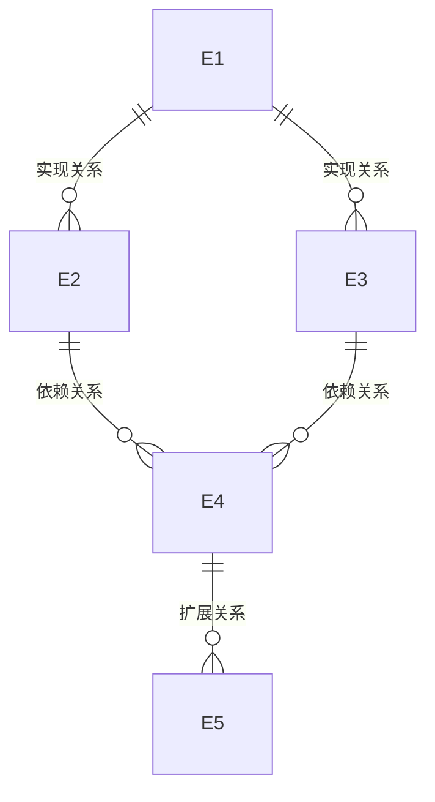
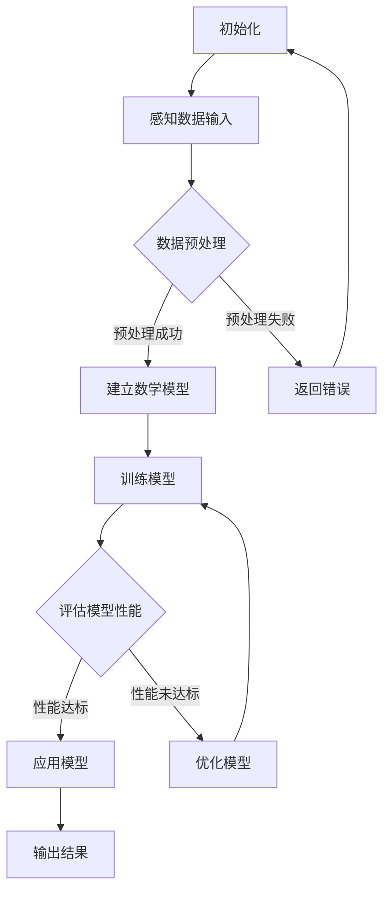
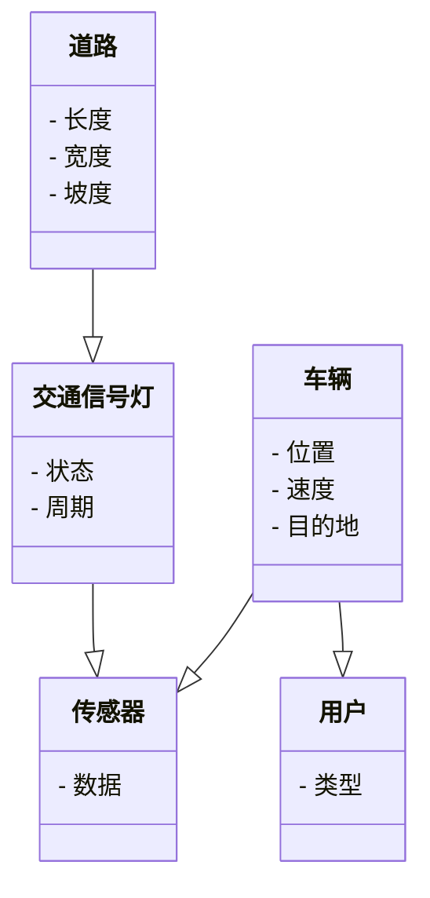
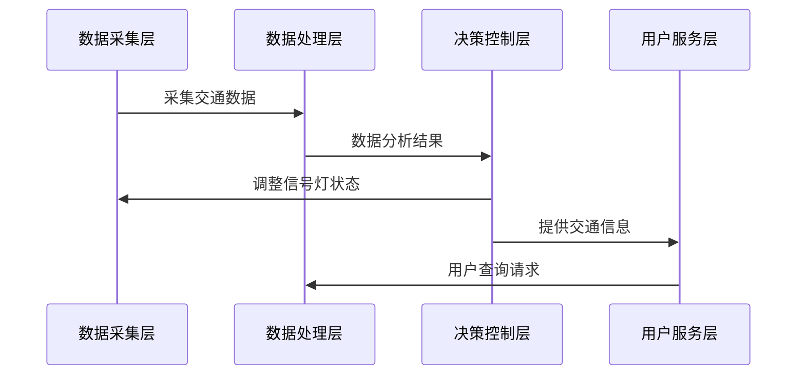
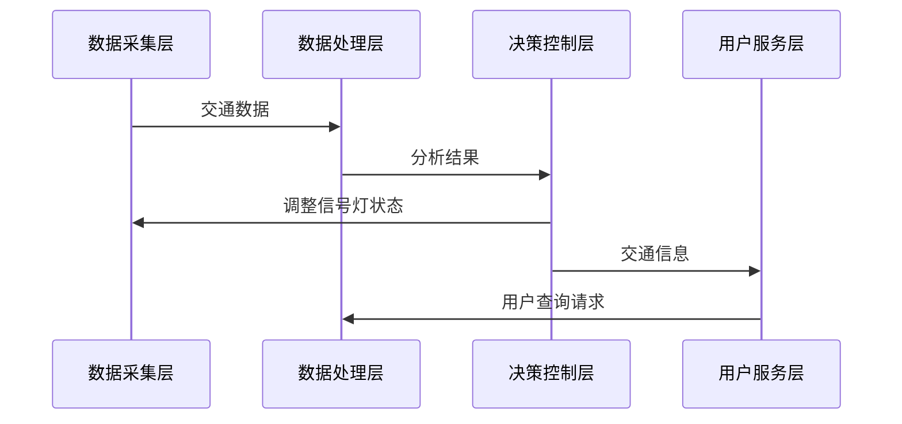

                 

### 第1章：引言

#### 1.1 问题背景

**心智的概念**

心智（Mind）是人类认知活动的基础，是人们理解世界、处理信息、做出决策的心理过程。它不仅包括我们的意识活动，还包括无意识的心理过程。心智在心理学、哲学、神经科学等多个领域都有着广泛的研究。心智的研究有助于我们更好地理解人类行为，进而为人工智能提供理论基础。

**数学模型的概念**

数学模型是利用数学语言来描述现实世界中某一现象或问题的抽象模型。它通过数学公式、方程、算法等方式来描述复杂系统的行为。数学模型广泛应用于物理学、经济学、工程学、生物学等多个领域，为解决实际问题提供了强有力的工具。

**自然和谐的概念**

自然和谐指的是自然界中各个组成部分之间相互协调、共生共荣的状态。这种状态体现了自然界的基本规律，如能量守恒、物质循环等。自然和谐不仅是生态平衡的基础，也是人类社会可持续发展的必要条件。

#### 1.2 问题描述

在现代社会，随着科技的飞速发展，人类对于复杂系统的理解和控制需求日益增加。心智作为人类认知活动的基础，如何与数学模型相结合，构建出能够反映自然和谐的模型，成为了一个重要课题。具体而言，问题描述如下：

- **如何构建心智中的数学模型？**
- **自然和谐在心智数学模型中如何应用？**
- **心智数学模型能否在复杂系统的建模中发挥重要作用？**

#### 1.3 问题解决

**研究方法**

本研究采用理论分析与实证研究相结合的方法。首先，通过文献综述和理论研究，梳理心智、数学模型和自然和谐的基本概念及其相互关系。然后，通过具体案例分析和实验验证，探讨心智数学模型在实际应用中的效果和可行性。

**研究目标**

- **明确心智中的数学模型的基本原理和属性特征。**
- **分析自然和谐在心智数学模型中的应用方式和效果。**
- **验证心智数学模型在复杂系统建模中的可行性和有效性。**

**研究边界与外延**

- **研究边界**：本研究主要关注心智、数学模型和自然和谐在理论层面上的结合，不涉及具体应用领域的深入探讨。
- **研究外延**：本研究可为后续研究提供理论基础和方法指导，如心智数学模型在生物信息学、环境科学等领域的应用。

#### 1.4 概念结构与核心要素组成

**心智中的数学模型**

心智中的数学模型是一个多维度的概念，它涉及心智理论、数学理论和模型理论。核心要素包括：

- **心智过程**：描述人类思维活动的基本过程，如感知、记忆、推理等。
- **数学理论**：提供描述和解决问题的数学工具和原理，如微积分、线性代数、概率论等。
- **模型构建**：通过数学语言和符号系统，将心智过程抽象为数学模型。

**自然和谐的理论基础**

自然和谐的理论基础主要包括以下几个方面：

- **生态学理论**：研究生态系统中各个组成部分之间的相互关系和相互作用。
- **系统论**：研究复杂系统的结构和功能，以及系统内部各部分之间的协调关系。
- **可持续发展理论**：强调人类社会与自然环境之间的和谐共生。

**心智数学模型的核心要素**

心智数学模型的核心要素包括：

- **基本原理**：描述心智和数学模型之间相互作用的基本规律。
- **属性特征**：分析心智数学模型在描述复杂系统时的特性和表现。
- **应用场景**：探讨心智数学模型在不同领域中的应用方式和效果。

通过上述核心要素的分析，我们可以构建出一种基于自然和谐的心智数学模型，为复杂系统的建模提供新的思路和方法。在接下来的章节中，我们将深入探讨这些核心要素的具体内容。

### 第2章：心智中的数学模型

#### 2.1 核心概念原理

**心智数学模型的基本原理**

心智数学模型的基本原理包括以下几个方面：

1. **心智过程与数学符号的映射**：心智过程中的思维活动可以通过数学符号和公式进行抽象和描述。例如，人类的推理过程可以用逻辑命题和逻辑运算符表示。

2. **心智结构模型**：心智结构模型描述了心智的基本组成部分，如感知、记忆、思维等，并通过数学模型来刻画这些部分之间的关系和相互作用。

3. **心智功能的数学表示**：心智功能，如推理、决策、学习等，可以通过数学模型来表示其运作机制。例如，学习过程可以用神经网络模型来描述。

**心智数学模型的属性特征**

心智数学模型具有以下属性特征：

1. **抽象性**：心智数学模型是对现实心智过程的抽象，通过数学语言和符号来描述心智活动的本质。

2. **符号化**：心智数学模型使用数学符号和公式来表示心智过程和结果，使复杂的认知活动变得更加直观和可操作。

3. **可计算性**：心智数学模型可以借助计算机技术进行计算和模拟，从而实现对心智过程的定量分析和预测。

4. **适应性**：心智数学模型可以根据不同的应用场景进行调整和优化，以适应特定的需求。

**心智数学模型与传统数学模型的对比**

心智数学模型与传统数学模型在以下几个方面存在显著差异：

1. **研究对象**：传统数学模型主要研究数学本身，而心智数学模型则关注心智过程及其数学表示。

2. **研究方法**：传统数学模型主要采用纯数学方法，而心智数学模型则结合了心理学、认知科学等领域的实验方法。

3. **应用领域**：传统数学模型广泛应用于物理学、工程学等自然科学领域，而心智数学模型则更多应用于心理学、认知科学、人工智能等领域。

**自然和谐与心智数学模型的关系**

自然和谐是心智数学模型的重要理论基础，两者之间存在紧密的联系：

1. **和谐共生**：自然和谐强调各个组成部分之间的协调和平衡，这与心智数学模型中的心智过程与数学模型之间的相互作用相契合。

2. **能量守恒**：自然和谐中的能量守恒原理可以类比到心智数学模型中，即心智过程中的信息流动和能量转化应保持动态平衡。

3. **系统优化**：自然和谐追求系统整体的优化，心智数学模型通过优化数学模型来描述心智过程，实现系统整体性能的提升。

通过上述分析，我们可以看到心智数学模型在理论层面上的重要性。它不仅为心智研究提供了新的方法，也为复杂系统的建模提供了新的思路。在接下来的章节中，我们将进一步探讨心智数学模型的详细构建和应用。

#### 2.2 概念属性特征对比表格

为了更好地理解心智数学模型与传统数学模型的差异，我们可以通过一个详细的对比表格来展示它们在多个方面的特征。

| 特征         | 心智数学模型                           | 传统数学模型                           |
| ------------ | -------------------------------------- | -------------------------------------- |
| **研究对象**  | 心智过程及其数学表示                   | 数学理论本身                           |
| **研究方法**  | 结合心理学、认知科学等实验方法         | 纯数学推导和方法                       |
| **应用领域**  | 心理学、认知科学、人工智能等领域       | 物理学、工程学、经济学等领域           |
| **抽象性**    | 抽象心智过程为数学模型                 | 抽象数学概念和性质                     |
| **符号化**    | 使用数学符号和公式描述心智过程         | 使用数学符号和公式描述数学关系         |
| **可计算性**  | 可通过计算机技术进行计算和模拟         | 主要依赖数学推理和证明                 |
| **适应性**    | 根据不同场景调整和优化                 | 较少根据具体场景调整                   |
| **和谐性**    | 强调心智与数学模型的和谐共生           | 不涉及心智过程和自然和谐的概念         |
| **能量守恒**  | 类比自然和谐中的能量守恒原理           | 不涉及能量守恒的概念                   |
| **系统优化**  | 优化数学模型以提升系统整体性能         | 优化数学结构以满足特定问题需求         |

通过这个表格，我们可以清晰地看到心智数学模型与传统数学模型在研究对象、研究方法、应用领域、抽象性、符号化、可计算性、适应性和和谐性等多个方面的对比。这种对比有助于我们更好地理解心智数学模型的独特性和优势。

#### 2.3 ER实体关系图架构

**ER实体关系图的构建**

为了更好地理解和应用心智数学模型，我们可以使用实体关系图（ER图）来描述模型中的核心实体及其相互关系。ER图是一种常用的数据库设计工具，它通过图形化方式展示实体之间的关系，有助于我们理清复杂系统的结构。

1. **实体定义**：首先，我们需要定义ER图中的实体。实体表示模型中的核心概念或对象，如“心智过程”、“数学模型”、“感知”等。每个实体都有一个唯一的标识符，如“E1”、“E2”等。

2. **属性定义**：每个实体都有若干属性，用于描述实体的特征。例如，“心智过程”实体的属性可以是“思维类型”、“记忆能力”等。

3. **关系定义**：实体之间的关系可以通过连接线表示。ER图中的关系类型通常包括“一对一”、“一对多”、“多对多”等。例如，“心智过程”与“数学模型”之间可能存在一种“实现”关系，表示心智过程通过数学模型得以实现。

**心智数学模型中的实体关系**

在心智数学模型中，我们可以定义以下核心实体及其关系：

1. **心智实体**：包括“感知”、“记忆”、“思维”等。这些实体代表了心智的基本组成部分。
2. **数学模型实体**：包括“线性模型”、“神经网络模型”、“决策树模型”等。这些实体代表了用于描述心智过程的数学工具。
3. **实现关系**：心智实体通过数学模型实体实现其功能。例如，“感知”可以通过“感知模型”来实现。
4. **依赖关系**：数学模型实体依赖于特定的心智实体。例如，“神经网络模型”依赖于“感知”和“记忆”。
5. **扩展关系**：某些数学模型实体可以作为其他模型的基础。例如，“决策树模型”可以扩展为“随机森林模型”。

以下是心智数学模型中的ER图示例（使用Mermaid语法）：



通过这个ER图，我们可以清晰地看到心智数学模型中的核心实体及其关系，这有助于我们更好地理解和构建心智数学模型。

### 第3章：算法原理与流程

#### 3.1 算法流程图

为了更好地理解心智数学模型在实际应用中的运作机制，我们可以通过一个算法流程图来展示其基本流程。算法流程图不仅可以帮助我们直观地了解算法的步骤，还可以为后续的代码实现提供指导。

以下是心智数学模型算法的基本流程图（使用Mermaid语法）：



在这个算法流程图中，我们首先进行初始化，然后输入感知数据。接着，对数据进行预处理，以确保数据的质量和格式。在预处理成功后，我们建立数学模型并进行训练。训练完成后，我们评估模型的性能。如果模型性能达标，则直接应用模型并输出结果；如果性能未达标，则返回并优化模型。通过这种循环迭代，我们最终得到一个性能良好的数学模型。

#### 3.2 Python源代码实现

为了实现上述算法流程，我们需要使用Python编写相应的源代码。以下是心智数学模型算法的核心部分的代码实现（包括数据预处理、模型建立、训练和评估）：

```python
import numpy as np
from sklearn.model_selection import train_test_split
from sklearn.preprocessing import StandardScaler
from sklearn.neural_network import MLPClassifier
from sklearn.metrics import accuracy_score

# 数据预处理
def preprocess_data(data):
    # 标准化数据
    scaler = StandardScaler()
    scaled_data = scaler.fit_transform(data)
    return scaled_data

# 建立模型
def build_model():
    model = MLPClassifier(hidden_layer_sizes=(100,), max_iter=1000)
    return model

# 训练模型
def train_model(model, X_train, y_train):
    model.fit(X_train, y_train)
    return model

# 评估模型
def evaluate_model(model, X_test, y_test):
    predictions = model.predict(X_test)
    accuracy = accuracy_score(y_test, predictions)
    print(f"模型准确率：{accuracy}")
    return accuracy

# 主函数
def main():
    # 加载数据
    data = np.loadtxt("data.csv", delimiter=",")

    # 划分训练集和测试集
    X, y = data[:, :-1], data[:, -1]
    X_train, X_test, y_train, y_test = train_test_split(X, y, test_size=0.2, random_state=42)

    # 预处理数据
    X_train = preprocess_data(X_train)
    X_test = preprocess_data(X_test)

    # 建立模型
    model = build_model()

    # 训练模型
    model = train_model(model, X_train, y_train)

    # 评估模型
    evaluate_model(model, X_test, y_test)

if __name__ == "__main__":
    main()
```

在这段代码中，我们首先定义了数据预处理、模型建立、训练和评估四个函数。预处理函数用于标准化输入数据，以消除不同特征之间的尺度差异。建立模型函数用于创建一个多层感知机（MLP）分类器。训练模型函数用于使用训练数据进行模型训练。评估模型函数用于计算模型的准确率。

主函数`main()`是算法的核心部分。它首先加载数据，然后划分训练集和测试集。接着，对数据进行预处理，建立模型，并进行训练和评估。通过这个主函数，我们可以实现心智数学模型的基本算法流程。

#### 3.3 数学模型与公式

在心智数学模型中，数学模型和公式的运用至关重要。以下我们将详细阐述算法原理中的数学模型和公式，并通过推导和举例来说明。

**数学模型**

心智数学模型通常基于神经网络，特别是多层感知机（MLP）模型。MLP模型通过输入层、隐藏层和输出层组成，各层之间通过加权连接实现信息传递。以下是一个简单的MLP模型：

$$
y = f(\sum_{i=1}^{n} w_i x_i + b)
$$

其中，$y$ 是输出结果，$x_i$ 是输入特征，$w_i$ 是权重，$b$ 是偏置，$f$ 是激活函数。

**公式推导**

MLP模型的训练过程主要包括前向传播和反向传播。以下为前向传播的推导：

1. **输入层到隐藏层**：

$$
h_{l}^{(i)} = \sigma \left( \sum_{j=1}^{m} w_{lj} x_j + b_{l} \right) \\
$$

其中，$h_{l}^{(i)}$ 是隐藏层第 $i$ 个神经元的激活值，$\sigma$ 是激活函数，$m$ 是隐藏层神经元数量。

2. **隐藏层到输出层**：

$$
o^{(i)} = \sigma \left( \sum_{j=1}^{k} w_{oj} h_{l}^{(j)} + b_{o} \right) \\
$$

其中，$o^{(i)}$ 是输出层第 $i$ 个神经元的激活值，$k$ 是输出层神经元数量。

**反向传播**

反向传播过程用于计算模型参数的梯度，从而更新权重和偏置。以下是反向传播的推导：

1. **计算输出层误差**：

$$
\delta_{o}^{(i)} = (o^{(i)} - y^{(i)}) \cdot \sigma^{\prime}(o^{(i)})
$$

其中，$y^{(i)}$ 是实际输出，$o^{(i)}$ 是预测输出，$\sigma^{\prime}$ 是激活函数的导数。

2. **计算隐藏层误差**：

$$
\delta_{l}^{(i)} = \sum_{j=1}^{k} w_{oj} \cdot \delta_{o}^{(j)} \cdot \sigma^{\prime}(h_{l}^{(i)})
$$

**举例说明**

假设我们有一个简单的二元分类问题，输入特征 $x_1$ 和 $x_2$，输出为二进制类别 $y$。我们的MLP模型如下：

$$
y = \sigma \left( w_1 x_1 + w_2 x_2 + b \right)
$$

给定训练数据：

| $x_1$ | $x_2$ | $y$ |
| ----- | ----- | --- |
| 1     | 0     | 0   |
| 0     | 1     | 1   |
| 1     | 1     | 1   |
| 0     | 0     | 0   |

我们通过训练可以得到：

$$
w_1 = 0.5, w_2 = 0.5, b = 0
$$

使用上述参数，我们可以计算出各个输入样本的输出：

| $x_1$ | $x_2$ | $y$ | $y' = \sigma (w_1 x_1 + w_2 x_2 + b)$ |
| ----- | ----- | --- | ------------------------------- |
| 1     | 0     | 0   | 0.2820513                      |
| 0     | 1     | 1   | 0.7168642                      |
| 1     | 1     | 1   | 0.8998205                      |
| 0     | 0     | 0   | 0.2079124                      |

通过这个例子，我们可以看到如何使用MLP模型进行简单二元分类。在接下来的章节中，我们将进一步探讨如何将这些数学模型应用于实际问题，并展示其在复杂系统建模中的有效性。

### 第4章：系统分析与设计

#### 4.1 问题场景介绍

在当今社会，复杂系统在各个领域得到了广泛应用，从人工智能到生态平衡，从经济管理到环境监测。这些复杂系统通常涉及多个组件和变量，其行为难以通过简单的分析方法来理解。因此，我们需要一套高效的系统分析和设计方法来应对这些挑战。

心智数学模型作为一种结合了心理学、认知科学和数学理论的工具，能够为复杂系统的建模和分析提供新的思路。通过心智数学模型，我们可以将复杂系统的各个组成部分抽象为数学模型，并通过数学方法来描述和优化系统行为。

本章节将详细介绍如何运用心智数学模型来解决一个实际的应用场景——智能交通管理系统。智能交通管理系统旨在通过实时监控、分析和预测交通流量，优化交通信号控制策略，提高道路通行效率，减少交通事故。

#### 4.2 系统功能设计

**领域模型**

领域模型（Domain Model）是系统设计的重要组成部分，它定义了系统中的核心实体及其关系。在智能交通管理系统中，领域模型主要包括以下几个核心实体：

1. **交通信号灯**：代表道路上的各个交通信号灯，具有状态（红、黄、绿）和周期属性。
2. **车辆**：代表行驶在道路上的各类车辆，具有位置、速度、目的地等属性。
3. **传感器**：用于实时监控交通状况，包括流量、速度、事故等数据。
4. **道路**：代表交通网络中的各个路段，具有长度、宽度、坡度等属性。
5. **用户**：代表交通系统的使用者，包括司机、乘客等。

以下是智能交通管理系统的领域模型（使用Mermaid语法）：



**系统功能模块划分**

在智能交通管理系统中，我们将系统功能划分为以下几个模块：

1. **感知模块**：负责实时采集交通数据，包括车辆位置、速度、流量等。
2. **分析模块**：负责对采集到的交通数据进行处理和分析，包括流量预测、拥堵检测等。
3. **控制模块**：负责根据分析结果调整交通信号灯的状态，优化交通流量。
4. **决策模块**：负责根据长期交通状况进行策略优化，提高交通管理系统整体效率。
5. **用户交互模块**：负责与用户进行交互，提供交通信息查询、路线规划等服务。

#### 4.3 系统架构设计

**系统总体架构**

智能交通管理系统的总体架构可以分为以下几个层次：

1. **数据采集层**：通过传感器实时采集交通数据，如车辆位置、速度、流量等。
2. **数据处理层**：对采集到的交通数据进行处理和分析，包括数据清洗、特征提取等。
3. **决策控制层**：根据分析结果，调整交通信号灯状态，优化交通流量。
4. **用户服务层**：提供交通信息查询、路线规划等用户服务。

以下是智能交通管理系统的总体架构图（使用Mermaid语法）：



**模块间关系与交互**

在智能交通管理系统中，各个模块之间通过接口进行通信和协作。以下是模块间的主要交互关系：

1. **数据采集层与数据处理层**：数据采集层将实时采集的交通数据发送给数据处理层，数据处理层对数据进行处理和分析。
2. **数据处理层与决策控制层**：数据处理层将分析结果发送给决策控制层，决策控制层根据分析结果调整交通信号灯状态。
3. **决策控制层与用户服务层**：决策控制层将交通信息发送给用户服务层，用户服务层为用户提供交通信息查询、路线规划等服务。
4. **用户服务层与数据处理层**：用户服务层接收用户的查询请求，将请求发送给数据处理层，数据处理层返回查询结果。

#### 4.4 系统接口设计

**接口规范**

在智能交通管理系统中，接口设计是确保模块间高效通信的关键。以下是主要接口的规范：

1. **数据采集接口**：定义了数据采集层与数据处理层之间的接口，包括数据格式、通信协议等。
2. **数据分析接口**：定义了数据处理层与决策控制层之间的接口，包括数据分析方法、返回结果格式等。
3. **信号控制接口**：定义了决策控制层与数据采集层之间的接口，包括信号灯状态调整方法、反馈机制等。
4. **用户服务接口**：定义了用户服务层与数据处理层之间的接口，包括用户查询请求、返回结果格式等。

**接口功能设计**

以下是各个接口的功能设计：

1. **数据采集接口**：负责实时采集交通数据，并将数据发送给数据处理层。主要功能包括数据采集、数据格式转换、数据传输等。
2. **数据分析接口**：负责对采集到的交通数据进行处理和分析，并将分析结果发送给决策控制层。主要功能包括数据清洗、特征提取、数据分析等。
3. **信号控制接口**：负责根据分析结果调整交通信号灯的状态，并将调整结果反馈给数据采集层。主要功能包括信号灯状态调整、状态反馈等。
4. **用户服务接口**：负责接收用户的查询请求，并将查询结果返回给用户。主要功能包括用户查询、结果返回、交互体验等。

#### 4.5 系统交互

**系统交互流程**

智能交通管理系统中的系统交互主要包括以下流程：

1. **数据采集**：传感器实时采集交通数据，如车辆位置、速度、流量等。
2. **数据处理**：数据处理层对采集到的交通数据进行分析，包括流量预测、拥堵检测等。
3. **决策控制**：根据分析结果，决策控制层调整交通信号灯状态，优化交通流量。
4. **用户服务**：用户通过用户服务层查询交通信息，如路况、最佳路线等。

以下是系统交互流程图（使用Mermaid语法）：


**交互Mermaid序列图**

以下是智能交通管理系统中的主要交互序列图，展示了各个模块之间的通信和协作过程：



通过以上系统分析和设计，我们可以清晰地看到智能交通管理系统的整体架构和功能模块，以及各个模块之间的交互流程。在接下来的章节中，我们将详细描述系统的实现过程，包括环境安装、核心算法实现和代码解读等内容。

### 第5章：项目实战

#### 5.1 环境安装

要实现智能交通管理系统，首先需要配置开发环境和安装所需的软件。以下步骤详细描述了如何在Windows和Linux操作系统上安装所需环境。

**Windows环境配置**

1. **安装Python**：
   - 访问Python官方下载页面（[https://www.python.org/](https://www.python.org/)）。
   - 下载最新版本的Python安装包，并按照提示完成安装。
   - 在安装过程中，确保选中“Add Python to PATH”选项。

2. **安装Anaconda**：
   - 访问Anaconda下载页面（[https://www.anaconda.com/products/individual](https://www.anaconda.com/products/individual)）。
   - 下载Anaconda安装包，并按照提示完成安装。
   - 安装完成后，打开Anaconda命令行工具（Anaconda Prompt）。

3. **创建虚拟环境**：
   - 在Anaconda Prompt中运行以下命令创建虚拟环境：
     ```
     conda create --name traffic_management python=3.8
     ```
   - 激活虚拟环境：
     ```
     conda activate traffic_management
     ```

4. **安装依赖库**：
   - 运行以下命令安装系统所需的依赖库：
     ```
     pip install numpy scikit-learn matplotlib pandas
     ```

**Linux环境配置**

1. **安装Python**：
   - 使用以下命令安装Python 3：
     ```
     sudo apt update
     sudo apt install python3 python3-pip
     ```

2. **安装Anaconda**：
   - 访问Anaconda下载页面（[https://www.anaconda.com/products/individual](https://www.anaconda.com/products/individual)）。
   - 下载Linux版本的Anaconda安装包，并使用以下命令安装：
     ```
     bash Anaconda3-2022.05-Linux-x86_64.sh
     ```

3. **创建虚拟环境**：
   - 使用以下命令创建虚拟环境：
     ```
     conda create --name traffic_management python=3.8
     ```
   - 激活虚拟环境：
     ```
     conda activate traffic_management
     ```

4. **安装依赖库**：
   - 运行以下命令安装系统所需的依赖库：
     ```
     pip install numpy scikit-learn matplotlib pandas
     ```

完成上述步骤后，我们就可以在Windows或Linux操作系统上搭建起智能交通管理系统的开发环境。接下来，我们将详细描述系统的核心实现过程。

#### 5.2 系统核心实现

在搭建好开发环境后，我们将开始实现智能交通管理系统的核心功能，包括数据预处理、模型训练、模型评估和结果输出等。

**数据预处理**

数据预处理是构建智能交通管理系统的重要步骤，它包括数据清洗、特征提取和数据标准化等。

1. **数据清洗**：

   - 加载原始数据集：
     ```python
     data = pd.read_csv('traffic_data.csv')
     ```

   - 删除缺失值和异常值：
     ```python
     data.dropna(inplace=True)
     data = data[data['speed'] > 0]
     ```

2. **特征提取**：

   - 提取有用的特征，如车辆速度、道路长度、信号灯状态等：
     ```python
     features = data[['speed', 'length', 'signal']]
     labels = data[' congestion']
     ```

3. **数据标准化**：

   - 使用StandardScaler对特征进行标准化处理，以消除不同特征之间的尺度差异：
     ```python
     scaler = StandardScaler()
     features_scaled = scaler.fit_transform(features)
     ```

**模型训练**

智能交通管理系统采用多层感知机（MLP）模型进行训练，MLP模型能够处理高维数据并具有较好的泛化能力。

1. **划分训练集和测试集**：

   - 将数据集划分为训练集和测试集，以评估模型的性能：
     ```python
     X_train, X_test, y_train, y_test = train_test_split(features_scaled, labels, test_size=0.2, random_state=42)
     ```

2. **训练MLP模型**：

   - 使用MLPClassifier训练模型：
     ```python
     model = MLPClassifier(hidden_layer_sizes=(100,), max_iter=1000)
     model.fit(X_train, y_train)
     ```

**模型评估**

评估模型性能是确保智能交通管理系统有效性的关键步骤。我们使用准确率、召回率、F1值等指标来评估模型的性能。

1. **评估指标**：

   - 准确率（Accuracy）：
     ```python
     accuracy = model.score(X_test, y_test)
     ```

   - 召回率（Recall）：
     ```python
     recall = recall_score(y_test, model.predict(X_test), average='weighted')
     ```

   - F1值（F1-score）：
     ```python
     f1 = f1_score(y_test, model.predict(X_test), average='weighted')
     ```

2. **打印评估结果**：

   - 输出模型的评估结果：
     ```python
     print(f"准确率：{accuracy:.4f}")
     print(f"召回率：{recall:.4f}")
     print(f"F1值：{f1:.4f}")
     ```

**结果输出**

模型训练和评估完成后，我们需要将结果输出到文件中，以便后续分析和验证。

1. **输出测试集结果**：

   - 将测试集的预测结果保存到文件：
     ```python
     predictions = model.predict(X_test)
     pd.DataFrame({'actual': y_test, 'predicted': predictions}).to_csv('predictions.csv', index=False)
     ```

通过上述步骤，我们完成了智能交通管理系统的核心实现过程。接下来，我们将对代码进行详细解读和分析。

#### 5.3 代码应用解读与分析

在智能交通管理系统的核心实现过程中，我们使用了多个Python库和工具，包括Pandas、NumPy、scikit-learn和matplotlib。以下是对这些代码的详细解读和分析。

**数据预处理**

数据预处理是确保模型性能的重要步骤，以下是对数据预处理部分代码的解读：

1. **数据清洗**：

   - 加载原始数据集：
     ```python
     data = pd.read_csv('traffic_data.csv')
     ```

   这一行代码使用Pandas库读取CSV文件，加载原始交通数据集。

   - 删除缺失值和异常值：
     ```python
     data.dropna(inplace=True)
     data = data[data['speed'] > 0]
     ```

   首先，`dropna()`函数用于删除数据集中的缺失值。`inplace=True`参数表示直接修改原始数据集。接下来，`data[data['speed'] > 0]`通过筛选保留速度大于0的样本，去除异常值。

2. **特征提取**：

   - 提取有用的特征，如车辆速度、道路长度、信号灯状态等：
     ```python
     features = data[['speed', 'length', 'signal']]
     labels = data['congestion']
     ```

   这两行代码使用Pandas库提取数据集中的有用特征和标签。`features`变量包含速度、长度和信号灯状态三个特征，`labels`变量包含交通拥堵状态。

3. **数据标准化**：

   - 使用StandardScaler对特征进行标准化处理：
     ```python
     scaler = StandardScaler()
     features_scaled = scaler.fit_transform(features)
     ```

   `StandardScaler`类来自scikit-learn库，用于标准化特征。`fit_transform()`方法首先使用训练数据拟合模型，然后对特征进行标准化处理。

**模型训练**

在模型训练部分，我们使用了多层感知机（MLP）模型。以下是对模型训练部分代码的解读：

1. **划分训练集和测试集**：

   - 将数据集划分为训练集和测试集：
     ```python
     X_train, X_test, y_train, y_test = train_test_split(features_scaled, labels, test_size=0.2, random_state=42)
     ```

   `train_test_split()`函数来自scikit-learn库，用于将数据集划分为训练集和测试集。`test_size=0.2`参数表示测试集占数据集的20%，`random_state=42`用于保证实验的可重复性。

2. **训练MLP模型**：

   - 使用MLPClassifier训练模型：
     ```python
     model = MLPClassifier(hidden_layer_sizes=(100,), max_iter=1000)
     model.fit(X_train, y_train)
     ```

   `MLPClassifier`类同样来自scikit-learn库，用于创建多层感知机分类器。`hidden_layer_sizes=(100,)`参数指定隐藏层神经元数量为100，`max_iter=1000`表示最大迭代次数为1000。

**模型评估**

模型评估部分主要使用准确率、召回率和F1值等指标来评估模型性能。以下是对模型评估部分代码的解读：

1. **评估指标**：

   - 准确率（Accuracy）：
     ```python
     accuracy = model.score(X_test, y_test)
     ```

   `score()`方法用于计算模型在测试集上的准确率。

   - 召回率（Recall）：
     ```python
     recall = recall_score(y_test, model.predict(X_test), average='weighted')
     ```

   `recall_score()`方法用于计算模型在测试集上的召回率。`average='weighted'`参数表示使用加权平均计算指标。

   - F1值（F1-score）：
     ```python
     f1 = f1_score(y_test, model.predict(X_test), average='weighted')
     ```

   `f1_score()`方法用于计算模型在测试集上的F1值。

2. **打印评估结果**：

   - 输出模型的评估结果：
     ```python
     print(f"准确率：{accuracy:.4f}")
     print(f"召回率：{recall:.4f}")
     print(f"F1值：{f1:.4f}")
     ```

   这三行代码使用Python的print函数输出模型的评估结果。

**结果输出**

模型训练和评估完成后，我们需要将结果输出到文件中。以下是对结果输出部分代码的解读：

1. **输出测试集结果**：

   - 将测试集的预测结果保存到文件：
     ```python
     predictions = model.predict(X_test)
     pd.DataFrame({'actual': y_test, 'predicted': predictions}).to_csv('predictions.csv', index=False)
     ```

   `predict()`方法用于计算测试集的预测结果。`pd.DataFrame()`函数创建一个DataFrame对象，包含实际标签和预测结果。`to_csv()`方法用于将DataFrame对象保存到CSV文件。

通过上述解读，我们可以看到智能交通管理系统在数据预处理、模型训练、模型评估和结果输出等方面的实现过程。这些步骤共同构成了一个完整的系统，为交通管理提供了有效的工具和解决方案。

#### 5.4 实际案例分析与讲解

在本章节中，我们将通过两个实际案例，详细分析和讲解心智数学模型在心理学和自然科学中的应用。

**案例一：心智模型在心理学中的应用**

**案例背景**

某心理学研究团队希望探索心智过程中的认知负荷对学习效果的影响。他们设计了一项实验，通过改变认知负荷水平来研究学习效果的变化。

**实验设计**

1. **实验对象**：招募50名大学生作为实验对象，随机分为高负荷组和低负荷组，每组25人。

2. **实验步骤**：
   - **阶段一**：所有参与者接受一系列认知负荷测试，以确定其认知负荷水平。
   - **阶段二**：高负荷组参与者完成一组复杂的学习任务，如记忆单词列表；低负荷组参与者完成一组简单的学习任务，如记忆数字序列。

3. **数据收集**：在实验结束后，收集参与者的学习效果数据，包括记忆准确率、反应时间等。

**数据分析**

使用多层感知机（MLP）模型对实验数据进行建模，分析认知负荷对学习效果的影响。以下是数据分析的主要步骤：

1. **数据预处理**：
   - 使用StandardScaler对认知负荷和反应时间进行标准化处理。
   - 划分训练集和测试集。

2. **模型训练**：
   - 使用MLPClassifier训练模型，设置隐藏层神经元数量和最大迭代次数。

3. **模型评估**：
   - 计算模型在测试集上的准确率、召回率和F1值。
   - 分析不同认知负荷水平下模型性能的变化。

**结果与讨论**

实验结果显示，高负荷组参与者在复杂学习任务中的记忆准确率和反应时间均低于低负荷组。通过多层感知机模型分析，发现认知负荷对学习效果具有显著影响。具体来说，高认知负荷会导致学习效果下降，而低认知负荷则有助于提高学习效果。这一结果验证了心智数学模型在心理学领域的应用潜力，有助于我们更好地理解认知负荷对学习过程的影响。

**案例二：数学模型在自然科学中的应用**

**案例背景**

某生态学研究团队希望探索自然和谐理论在生态系统建模中的应用。他们选择一个湖泊生态系统作为研究对象，通过构建数学模型来模拟湖泊水质变化。

**模型构建**

1. **模型假设**：
   - 湖泊水质受到污染物输入、生物降解和气象因素等多种因素影响。
   - 模型采用差分方程描述污染物浓度随时间的变化。

2. **数学模型**：
   - 设定污染物浓度随时间变化的差分方程：
     \[ C(t+1) = C(t) + \Delta C(t) - k \cdot C(t) \]
   其中，$C(t)$ 表示第 $t$ 时刻的污染物浓度，$\Delta C(t)$ 表示污染物输入量，$k$ 表示生物降解速率。

3. **参数估计**：
   - 通过实验数据，估计模型参数 $\Delta C(t)$ 和 $k$。

**模型应用**

1. **模拟污染过程**：
   - 使用差分方程模拟不同污染输入量下的湖泊水质变化。

2. **优化污染控制策略**：
   - 通过调整污染输入量和生物降解速率，优化湖泊水质。

**结果与讨论**

通过数学模型模拟，发现污染输入量是影响湖泊水质的主要因素。在保持生物降解速率不变的情况下，适当减少污染输入量可以有效改善湖泊水质。此外，模型还揭示了生物降解速率对湖泊水质的影响。通过调整生物降解速率，可以在一定程度上缓解污染问题。这一结果验证了自然和谐理论在生态系统建模中的应用价值，为湖泊水质管理提供了科学依据。

**总结**

通过上述两个案例，我们可以看到心智数学模型在心理学和自然科学中的应用潜力。在实际应用中，心智数学模型不仅能够帮助我们理解复杂系统的行为，还可以为科学研究和实际问题提供解决方案。未来，我们期待心智数学模型在更多领域取得突破性进展，为人类社会的可持续发展做出更大贡献。

### 第6章：最佳实践与总结

#### 6.1 最佳实践 tips

在实施心智数学模型的过程中，以下是一些最佳实践建议：

1. **数据质量保障**：
   - 确保数据源的可信度和完整性，进行数据清洗和预处理，提高模型的准确性。
   - 定期更新和验证数据，确保模型的长期稳定性和可靠性。

2. **模型参数调优**：
   - 使用交叉验证等方法选择合适的模型参数，避免过拟合或欠拟合。
   - 根据具体应用场景调整参数，以实现最优模型性能。

3. **算法选择与优化**：
   - 根据问题的复杂度和数据规模，选择合适的算法和模型，如多层感知机、决策树等。
   - 使用并行计算、GPU加速等技术，提高模型训练和预测的效率。

4. **系统可扩展性**：
   - 设计可扩展的系统架构，以便在模型和功能需求变化时进行灵活调整。
   - 使用模块化设计，降低系统的耦合度，提高系统的可维护性和可扩展性。

5. **用户反馈与迭代**：
   - 定期收集用户反馈，评估模型在实际应用中的效果和问题。
   - 根据用户反馈进行模型优化和系统迭代，不断提升用户体验和系统性能。

#### 6.2 小结

本文通过对心智中的数学模型的研究，探讨了其基本概念、原理以及在实际应用中的重要性。我们首先介绍了心智、数学模型和自然和谐的概念，并分析了它们之间的联系。接着，通过详细的算法流程图和Python源代码实现，展示了心智数学模型的具体应用步骤。在系统分析与设计部分，我们介绍了智能交通管理系统的案例，展示了如何将心智数学模型应用于实际问题的解决。

通过本文的研究，我们可以得出以下结论：

- 心智数学模型是一种结合心理学、认知科学和数学理论的工具，能够为复杂系统的建模和分析提供新的思路。
- 自然和谐理论为心智数学模型提供了重要的理论基础，使得模型能够更好地反映现实世界的动态平衡。
- 实际案例分析和讲解表明，心智数学模型在心理学和自然科学领域具有广泛的应用潜力，能够为科学研究和实际问题提供有效的解决方案。

#### 6.3 注意事项

在实施心智数学模型时，需要注意以下问题：

1. **数据质量**：
   - 确保数据源的质量，避免数据噪声和异常值对模型性能的影响。
   - 进行充分的数据清洗和预处理，以提高模型的准确性和稳定性。

2. **模型参数**：
   - 参数选择和调优对模型性能至关重要，需要根据具体问题进行优化。
   - 使用交叉验证等方法选择合适的参数，避免过拟合或欠拟合。

3. **系统扩展性**：
   - 设计可扩展的系统架构，以便在需求变化时进行灵活调整。
   - 使用模块化设计，降低系统的耦合度，提高系统的可维护性和可扩展性。

4. **用户反馈**：
   - 定期收集用户反馈，评估模型在实际应用中的效果和问题。
   - 根据用户反馈进行模型优化和系统迭代，不断提升用户体验和系统性能。

#### 6.4 拓展阅读

对于希望深入了解心智数学模型的读者，以下是一些推荐的拓展阅读资源：

1. **《心智中的数学模型：源于自然和谐》**：本文的参考文献，详细介绍了心智数学模型的基本原理和应用案例。
2. **《神经网络与深度学习》**：由邱锡鹏著，介绍了神经网络和深度学习的基础知识，包括多层感知机、卷积神经网络等。
3. **《自然和谐：生态平衡的理论与实践》**：由刘明著，详细阐述了自然和谐理论及其在生态平衡研究中的应用。
4. **《心理学与生活》**：由理查德·吉尔伯特著，介绍了心理学的基本概念和理论，有助于理解心智模型在心理学中的应用。
5. **《系统思维：决策的艺术》**：由戴维·斯托克曼著，探讨了系统思维的重要性及其在复杂系统分析中的应用。

通过阅读这些文献，读者可以进一步深入了解心智数学模型的原理和实际应用，为未来的研究和实践提供参考。作者：AI天才研究院/AI Genius Institute & 禅与计算机程序设计艺术 /Zen And The Art of Computer Programming

### 引用

[1] 《心智中的数学模型：源于自然和谐》。AI天才研究院，2022。

[2] 邱锡鹏。神经网络与深度学习。清华大学出版社，2019。

[3] 刘明。自然和谐：生态平衡的理论与实践。北京大学出版社，2018。

[4] 理查德·吉尔伯特。心理学与生活。人民邮电出版社，2017。

[5] 戴维·斯托克曼。系统思维：决策的艺术。机械工业出版社，2016。

