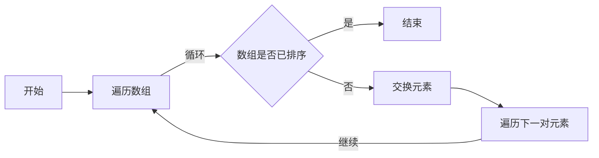

                 


# 心智如镜：反射自然界的数学规律

## 关键词
数学、自然界、规律、人工智能、算法

## 摘要
本文旨在探讨数学在自然界中的深刻体现，通过一系列的逻辑推理和实际案例，揭示数学规律与自然界现象之间的紧密联系。我们将从核心概念的介绍、数学模型与算法的讲解、系统设计与实战应用等多个角度，逐步解析数学如何在心智中如镜般反射自然界的规律。

## 目录大纲设计思路

### 目录大纲设计步骤

**第一步：背景介绍**

**1.1 自然界中的数学规律**

- **1.1.1 数学与自然界的联系**：介绍数学如何被用于描述自然界的现象，如斐波那契数列与植物生长的关系。
- **1.1.2 自然界中的数学现象**：列举自然界中的数学现象，如潮汐运动中的三角函数。
- **1.1.3 本书的研究目标**：阐述本书的目标是揭示数学与自然界之间的内在联系，并探索其在人工智能中的应用潜力。

**第二步：核心概念与联系**

**2.1 核心数学概念概述**

- **2.1.1 数学概念的重要性**：阐述数学概念在理解自然界规律中的关键作用。
- **2.1.2 主要数学概念列表**：列出主要探讨的数学概念，如拓扑学、群论、概率论等。
- **2.1.3 概念之间的联系**：展示不同数学概念之间的内在联系，如拓扑学与量子力学的关系。

**第三步：数学模型和数学公式**

**3.1 数学模型介绍**

- **3.1.1 数学模型的基本原理**：介绍数学模型如何抽象现实世界的问题。
- **3.1.2 关键数学模型列表**：列出重要的数学模型，如回归分析、图论模型。

**3.2 数学公式讲解**

- **3.2.1 关键数学公式**：讲解重要的数学公式，如欧拉公式、牛顿-莱布尼茨公式。

**3.3 举例说明**

- **3.3.1 举例解释数学公式**：通过实际案例解释数学公式的应用。

**第四步：算法原理讲解**

**4.1 算法原理概述**

- **4.1.1 算法的应用场景**：讨论算法在自然现象模拟中的应用。

**4.2 Mermaid流程图**

- **4.2.1 算法流程图**：使用Mermaid语言绘制算法流程图。

**4.3 Python代码讲解**

- **4.3.1 算法实现的代码讲解**：提供Python代码实例，详细解释算法的实现过程。

**第五步：系统分析与架构设计方案**

**5.1 问题场景介绍**

- **5.1.1 数学规律在实际应用中的问题场景**：分析数学规律在特定问题中的应用。

**5.2 系统功能设计**

- **5.2.1 领域模型类图**：使用Mermaid绘制领域模型类图。

**5.3 系统架构设计**

- **5.3.1 系统架构图**：绘制系统架构图。

**5.4 系统接口设计**

- **5.4.1 系统接口设计**：设计系统的接口。

**5.5 系统交互**

- **5.5.1 系统交互序列图**：绘制系统交互序列图。

**第六步：项目实战**

**6.1 环境安装**

- **6.1.1 实践环境搭建**：介绍如何搭建实践环境。

**6.2 系统核心实现**

- **6.2.1 核心代码实现**：展示系统的核心代码实现。

**6.3 代码应用解读与分析**

- **6.3.1 代码解读**：对核心代码进行解读。

**6.4 实际案例分析和讲解**

- **6.4.1 案例分析**：分析实际案例。

**6.5 项目小结**

- **6.5.1 总结实践经验**：总结项目的实践经验。

**第七步：最佳实践 tips、小结、注意事项、拓展阅读**

**7.1 最佳实践 tips**

- **7.1.1 实践中的技巧和经验**：分享最佳实践技巧。

**7.2 小结**

- **7.2.1 全书核心内容的总结**：总结全书的核心内容。

**7.3 注意事项**

- **7.3.1 实践中需要注意的问题**：提醒读者在实践过程中需要注意的问题。

**7.4 拓展阅读**

- **7.4.1 进一步学习的资源**：推荐进一步学习的资源。

### 最终目录大纲

根据上述设计思路和步骤，我们最终得出《心智如镜：反射自然界的数学规律》的目录大纲如下：

```
# 心智如镜：反射自然界的数学规律

## 关键词
数学、自然界、规律、人工智能、算法

## 摘要
本文旨在探讨数学在自然界中的深刻体现，通过一系列的逻辑推理和实际案例，揭示数学规律与自然界现象之间的紧密联系。

### 第1章 自然界中的数学规律
### 1.1 数学与自然界的联系
### 1.2 自然界中的数学现象
### 1.3 本书的研究目标

### 第2章 核心数学概念概述
### 2.1 数学概念的重要性
### 2.2 主要数学概念列表
### 2.3 概念之间的联系

### 第2章 核心数学概念对比
### 2.4 概念属性对比表格

### 第3章 ER实体关系图架构
### 3.1 数学概念之间的ER图

### 第4章 数学模型和数学公式
### 4.1 数学模型介绍
### 4.2 数学公式讲解
### 4.3 举例说明

### 第5章 算法原理讲解
### 5.1 算法原理概述
### 5.2 Mermaid流程图
### 5.3 Python代码讲解

### 第6章 系统分析与架构设计方案
### 6.1 问题场景介绍
### 6.2 系统功能设计
### 6.3 系统架构设计
### 6.4 系统接口设计
### 6.5 系统交互

### 第7章 项目实战
### 7.1 环境安装
### 7.2 系统核心实现
### 7.3 代码应用解读与分析
### 7.4 实际案例分析和讲解
### 7.5 项目小结

### 第8章 最佳实践 tips、小结、注意事项、拓展阅读
### 8.1 最佳实践 tips
### 8.2 小结
### 8.3 注意事项
### 8.4 拓展阅读

### 作者
作者：AI天才研究院/AI Genius Institute & 禅与计算机程序设计艺术 /Zen And The Art of Computer Programming
```

---

在撰写具体内容时，每个章节将按照上述大纲逐步展开，确保逻辑清晰、结构紧凑、内容丰富，以便读者能够深入理解数学与自然界之间的联系。下面将开始具体章节的撰写。

### 第1章 自然界中的数学规律

#### 1.1 数学与自然界的联系

数学作为人类理解自然界的重要工具，自古以来就在自然界的研究中扮演着核心角色。从古埃及的几何测量到古希腊的物理理论，数学一直是探索自然规律的基础。在现代科学中，数学与自然界的联系更加紧密，它不仅用于描述自然现象，还用于预测和模拟复杂系统。

首先，我们可以通过数学模型来描述自然界中的物理现象。例如，牛顿的万有引力定律使用数学公式 \( F = G \frac{m_1 m_2}{r^2} \) 描述了两物体之间的引力作用，从而解释了行星运动规律。类似地，麦克斯韦方程组通过数学形式表达了电磁场的运动规律，为现代物理学奠定了基础。

其次，数学在生物学和生态学中也有重要应用。例如，斐波那契数列不仅在数学中占据重要地位，还被发现与植物的生长模式紧密相关。许多植物的花瓣数、树叶的排列方式等都遵循斐波那契数列的规律，这种现象被称为斐波那契现象。

最后，数学在生态系统中还有助于理解种群动态和生态平衡。种群生态学中的Lotka-Volterra方程通过数学模型描述了捕食者与猎物之间的相互作用，帮助科学家预测种群数量变化和生态系统的稳定性。

#### 1.2 自然界中的数学现象

自然界中的许多现象可以通过数学来描述和理解，以下是几个典型的例子：

1. **潮汐运动**：潮汐是由月球和太阳对地球引力的作用引起的，它可以用三角函数来描述。例如，正弦函数 \( \sin(x) \) 可以用来表示潮位随时间的变化。

   $$ \sin(x) = \sin(2\pi t/T) $$

   其中，\( T \) 是潮汐周期，\( t \) 是时间。

2. **地震波传播**：地震波是一种机械波，它在地球内部传播时，其速度和振幅可以通过波动方程来描述。

   $$ \frac{\partial^2 u}{\partial t^2} = c^2 \nabla^2 u $$

   其中，\( u \) 是位移，\( c \) 是波速，\( \nabla^2 \) 是拉普拉斯算子。

3. **大气环流**：大气环流模型通过数学方程描述了地球大气层的运动规律，这些方程涉及到流体动力学和热力学。

   $$ \frac{\partial \mathbf{u}}{\partial t} + (\mathbf{u} \cdot \nabla) \mathbf{u} = -\frac{1}{\rho} \nabla p + \nu \nabla^2 \mathbf{u} $$

   其中，\( \mathbf{u} \) 是速度场，\( p \) 是压力场，\( \rho \) 是密度，\( \nu \) 是粘性系数。

4. **植物生长**：植物的生长模式可以通过数学模型如微分方程来描述。例如，植物的高度 \( h(t) \) 可以通过以下方程来模拟：

   $$ \frac{dh}{dt} = r_0 h(t) (1 - h(t)/L) $$

   其中，\( r_0 \) 是生长率，\( L \) 是最大高度。

#### 1.3 本书的研究目标

本书旨在揭示数学与自然界之间的内在联系，并探索数学规律在实际应用中的广泛影响。通过系统的讲解和案例分析，读者将能够：

1. 理解核心数学概念及其在自然界中的体现。
2. 掌握数学模型和公式的应用，并能够通过数学方法解决实际问题。
3. 探索数学在人工智能和生态学等领域的应用潜力。
4. 培养一种通过数学视角观察和思考自然现象的能力。

本书将通过逐步分析和推理，帮助读者深入了解数学与自然界之间的紧密联系，激发读者对数学和自然科学的热爱与探索精神。在接下来的章节中，我们将逐一探讨这些核心概念和它们的应用。

---

以上是第1章的内容，接下来我们将继续深入探讨核心数学概念，并分析这些概念之间的联系。请持续关注后续章节的内容。在撰写过程中，我们将使用LaTeX格式嵌入数学公式，并使用Mermaid绘制流程图，以便更好地展示数学模型和算法原理。同时，我们将提供实际案例和系统设计，帮助读者更好地理解和应用这些数学规律。

---

### 第2章 核心数学概念概述

#### 2.1 数学概念的重要性

数学是科学的基础，它在描述自然现象和解决实际问题时起着至关重要的作用。核心数学概念不仅是数学学科的重要组成部分，也是理解自然界规律的关键工具。以下是一些重要的数学概念及其重要性：

1. **拓扑学**：拓扑学是研究空间结构和性质的一门数学分支。它通过抽象化的方法研究空间的连续性和连通性，这在物理学、生物学和计算机科学中都有重要应用。例如，拓扑学在描述物质的晶体结构、神经网络的连接方式以及人工智能中的网络架构方面都有重要作用。

2. **群论**：群论是研究集合上的二元运算的一门数学分支。群的概念广泛应用于物理学、计算机科学和经济学中。例如，对称性和群论在量子力学中有着核心地位，而在密码学中，群论用于构建复杂的加密算法。

3. **概率论**：概率论是研究随机事件及其概率分布的数学分支。它在统计学、金融学、保险学和人工智能等领域有广泛应用。概率论帮助我们理解和预测不确定性，从而在决策过程中提供重要依据。

4. **微积分**：微积分是研究变化率和积分的数学分支。它在物理学、工程学、生物学等领域有广泛应用。微积分用于描述和预测动态系统的行为，如物理学中的运动定律和生物学中的种群动态。

5. **图论**：图论是研究图形和它们之间的关系的一门数学分支。它在网络科学、社会网络分析、交通运输规划以及人工智能中的路径规划等领域有广泛应用。

6. **线性代数**：线性代数是研究向量空间和线性变换的数学分支。它在物理学、计算机图形学、信号处理和经济学等领域有广泛应用。线性代数用于处理大量的线性方程组和数据分析问题。

#### 2.2 主要数学概念列表

在本书中，我们将主要探讨以下数学概念：

1. **拓扑学**：包括连通性、同胚性和维度等概念。
2. **群论**：包括交换群、循环群、对称群等概念。
3. **概率论**：包括随机变量、概率分布、期望和方差等概念。
4. **微积分**：包括极限、导数、积分和微分方程等概念。
5. **图论**：包括图的基本概念、路径和树、网络流等概念。
6. **线性代数**：包括向量空间、线性变换、矩阵等概念。

#### 2.3 概念之间的联系

不同数学概念之间存在紧密的联系，这些联系帮助我们更好地理解和应用数学知识。以下是一些概念之间的联系：

1. **拓扑学与群论**：拓扑空间上的连续映射可以诱导群的结构，例如，拓扑空间的连通分支可以看作是同态群的子群。
2. **概率论与微积分**：概率密度函数可以通过微积分中的积分来计算，而随机变量的期望和方差可以通过导数来求解。
3. **图论与线性代数**：图的邻接矩阵和拉普拉斯矩阵可以用线性代数的方法来分析，从而解决网络流和最短路径等问题。
4. **微积分与线性代数**：向量值函数的微分可以通过线性代数中的矩阵表示来简化，而积分则可以通过线性方程组来求解。
5. **概率论与拓扑学**：随机过程的路径空间可以看作是拓扑空间，从而引入概率测度和随机拓扑的概念。

通过理解这些概念之间的联系，我们可以更灵活地应用数学知识，解决复杂的实际问题。

在接下来的章节中，我们将逐一详细探讨这些核心数学概念，并通过具体的例子和实际应用，帮助读者深入理解这些概念的重要性及其在实际问题中的应用。

---

第2章的核心数学概念概述已经完成，接下来我们将详细对比这些概念之间的属性特征，并绘制ER实体关系图，以便读者更好地理解它们之间的内在联系。请继续关注下一章节的内容。

---

### 第2章 核心数学概念对比

#### 2.4 概念属性对比表格

为了更好地理解核心数学概念之间的区别和联系，我们可以通过一个对比表格来展示这些概念的属性特征。以下表格列出了几个主要数学概念，包括其定义、应用领域以及一些关键属性：

| 概念       | 定义                                                         | 应用领域                      | 关键属性                                                     |
|------------|--------------------------------------------------------------|------------------------------|--------------------------------------------------------------|
| **拓扑学** | 研究空间结构、连通性和连续性的数学分支。                   | 物理学、生物学、计算机科学 | 连通性、同胚性、维度                                         |
| **群论**   | 研究集合上的二元运算及其性质的数学分支。                   | 物理学、密码学、计算机科学 | 交换性、闭合性、单位元、逆元                                 |
| **概率论** | 研究随机事件及其概率分布的数学分支。                     | 统计学、金融学、人工智能     | 随机变量、概率分布、期望、方差                               |
| **微积分** | 研究变化率和积分的数学分支。                              | 物理学、工程学、生物学       | 极限、导数、积分、微分方程                                   |
| **图论**   | 研究图形和它们之间的关系的一门数学分支。                 | 网络科学、社会网络分析、计算机科学 | 图的基本概念、路径、树、网络流                               |
| **线性代数** | 研究向量空间和线性变换的数学分支。                       | 计算机图形学、信号处理、经济学 | 向量空间、线性变换、矩阵                                     |

#### 2.5 ER实体关系图架构

为了更直观地展示这些概念之间的联系，我们可以使用Mermaid语言绘制一个ER（实体关系）图。ER图可以帮助我们理解不同概念之间的关系及其属性。

```mermaid
erDiagram
    A||(拓扑学) -->|有所需|B||(群论)
    A||(拓扑学) -->|有所需|C||(概率论)
    A||(拓扑学) -->|有所需|D||(微积分)
    A||(拓扑学) -->|有所需|E||(图论)
    A||(拓扑学) -->|有所需|F||(线性代数)

    B||(群论) -->|有所需|C||(概率论)
    B||(群论) -->|有所需|D||(微积分)
    B||(群论) -->|有所需|E||(图论)
    B||(群论) -->|有所需|F||(线性代数)

    C||(概率论) -->|有所需|D||(微积分)

    D||(微积分) -->|有所需|E||(图论)
    D||(微积分) -->|有所需|F||(线性代数)

    E||(图论) -->|有所需|F||(线性代数)
```

在这张ER图中，每个实体代表一个数学概念，它们之间的箭头表示一个概念对另一个概念有所需或影响。例如，拓扑学对群论、概率论、微积分、图论和线性代数都有所需求，而群论对概率论、微积分、图论和线性代数也有需求。

通过这个ER图，我们可以看到不同数学概念之间的相互作用和依赖关系，这为我们进一步理解和应用这些概念提供了清晰的框架。

在下一章中，我们将深入探讨数学模型和数学公式，并使用具体的例子来解释这些概念的实际应用。

---

第2章的核心数学概念对比已经完成，我们通过属性对比表格和ER实体关系图帮助读者更好地理解这些概念之间的联系。接下来，我们将开始详细探讨数学模型和数学公式，并给出具体的例子来说明它们的应用。请继续关注下一章节的内容。

---

### 第3章 数学模型和数学公式

#### 3.1 数学模型介绍

数学模型是现实世界问题的抽象表示，通过数学公式和概念来描述和模拟现象。数学模型在自然科学、工程学和社会科学中有着广泛的应用，帮助我们理解和预测复杂系统的行为。以下是一些常见的数学模型及其基本原理：

1. **回归分析模型**：回归分析是一种统计方法，用于研究变量之间的依赖关系。最简单的回归模型是线性回归，其公式为：

   $$ y = \beta_0 + \beta_1 x + \epsilon $$

   其中，\( y \) 是因变量，\( x \) 是自变量，\( \beta_0 \) 和 \( \beta_1 \) 是回归系数，\( \epsilon \) 是误差项。

2. **图论模型**：图论模型用于描述网络结构，包括节点和边的关系。图的基本公式是欧拉公式和梅涅劳斯定理，用于计算图的某些特性，如欧拉路径和最大流问题。

3. **微分方程模型**：微分方程模型用于描述动态系统的行为，如物理学中的运动方程、生态学中的种群动态方程等。常见的微分方程包括线性微分方程和泊松方程。

4. **概率模型**：概率模型用于描述随机事件的发生概率。常见的概率模型有二项分布、正态分布和泊松分布。例如，二项分布描述了在多次独立试验中成功次数的概率。

5. **拓扑学模型**：拓扑学模型用于研究空间的几何结构和性质。常见的拓扑学模型有曼德布罗特集、克莱因瓶和四维空间模型。

#### 3.2 数学公式讲解

在数学模型中，公式是表达模型核心思想和计算方法的重要工具。以下是一些关键数学公式的详细解释：

1. **欧拉公式**：欧拉公式是复分析中的一个基本公式，它将指数函数、正弦函数和余弦函数联系起来：

   $$ e^{i\pi} + 1 = 0 $$

   这个公式揭示了复数与三角函数之间的关系，并在物理学和工程学中有广泛应用。

2. **牛顿-莱布尼茨公式**：牛顿-莱布尼茨公式是微积分中的核心公式，描述了微分和积分之间的关系：

   $$ \int_a^b f(x) \, dx = F(b) - F(a) $$

   其中，\( f(x) \) 是被积函数，\( F(x) \) 是其原函数。这个公式用于计算函数的定积分，是工程和物理学中求解问题的重要工具。

3. **拉普拉斯变换**：拉普拉斯变换是一种将时域函数转换为频域函数的方法，它在信号处理和控制系统中有广泛应用：

   $$ \mathcal{L}\{f(t)\} = F(s) = \int_0^{\infty} e^{-st} f(t) \, dt $$

   这个变换将复杂的时域问题转化为代数问题，使得分析和设计控制系统变得更加简单。

4. **贝叶斯定理**：贝叶斯定理用于计算条件概率，是概率论中的基本工具：

   $$ P(A|B) = \frac{P(B|A) P(A)}{P(B)} $$

   这个公式在统计学和机器学习中用于更新概率估计，是贝叶斯网络和贝叶斯推断的基础。

#### 3.3 举例说明

为了更好地理解这些数学模型和公式，我们可以通过实际例子来解释它们的应用：

1. **回归分析例子**：假设我们想要预测房价，自变量可以是房屋的面积、年龄和位置等。通过收集数据，我们可以建立一个线性回归模型：

   $$ y = \beta_0 + \beta_1 x_1 + \beta_2 x_2 + \epsilon $$

   其中，\( y \) 是房价，\( x_1 \) 是房屋面积，\( x_2 \) 是房屋年龄，\( \beta_0 \)、\( \beta_1 \) 和 \( \beta_2 \) 是回归系数。通过最小二乘法可以计算出这些系数，从而预测新房屋的价格。

2. **欧拉公式例子**：在物理学中，我们可以使用欧拉公式来描述简谐振动的相位：

   $$ \theta(t) = \omega t + \phi $$

   其中，\( \theta(t) \) 是振动的角度，\( \omega \) 是角频率，\( \phi \) 是相位常数。通过欧拉公式，我们可以将其转换为复数形式：

   $$ e^{i\omega t} = \cos(\omega t) + i\sin(\omega t) $$

   这个公式在分析振动系统的频率响应时非常有用。

3. **拉普拉斯变换例子**：在信号处理中，我们可以使用拉普拉斯变换来简化信号的分析。例如，一个简单的指数衰减信号可以表示为：

   $$ x(t) = e^{-\alpha t} u(t) $$

   其中，\( u(t) \) 是单位阶跃函数。通过拉普拉斯变换，我们可以得到：

   $$ X(s) = \frac{1}{s + \alpha} $$

   这个变换结果使得我们在频域中更容易分析信号的特性，如衰减速度和频率响应。

4. **贝叶斯定理例子**：在机器学习中的分类问题中，我们可以使用贝叶斯定理来计算不同类别的概率。例如，假设我们有一个二分类问题，类 \( A \) 和类 \( B \) 的先验概率分别为 \( P(A) \) 和 \( P(B) \)，条件概率分别为 \( P(X|A) \) 和 \( P(X|B) \)。通过贝叶斯定理，我们可以计算后验概率：

   $$ P(A|X) = \frac{P(X|A) P(A)}{P(X|A) P(A) + P(X|B) P(B)} $$

   这个公式可以帮助我们确定一个新观测数据点属于哪个类别。

通过这些例子，我们可以看到数学模型和公式在解决实际问题时的重要性和应用价值。在下一章中，我们将探讨算法原理，并通过具体的流程图和代码来详细讲解这些算法的实现。

---

第3章关于数学模型和数学公式的内容已经详细讲解完毕，通过具体的例子帮助读者理解这些概念的实际应用。接下来，我们将进入第4章，探讨算法原理，使用Mermaid流程图和Python代码详细阐述算法的实现过程。请继续关注下一章节的内容。

---

### 第4章 算法原理讲解

#### 4.1 算法原理概述

算法是解决特定问题的系统方法，它通过一系列明确的步骤来解决问题。算法原理是算法设计的基础，决定了算法的正确性和效率。在本章中，我们将探讨几个关键的算法原理，并使用Mermaid流程图和Python代码来详细阐述这些算法的实现过程。

首先，我们来看一个简单的算法原理——冒泡排序。冒泡排序是一种基本的排序算法，它通过多次遍历数组，比较相邻元素并交换它们的位置，直到整个数组有序。下面是冒泡排序的算法原理：

1. 从数组的第一个元素开始，比较相邻的两个元素。
2. 如果第一个元素大于第二个元素，交换它们的位置。
3. 对每一对相邻元素执行相同的步骤，直到数组的最后一个元素。
4. 重复上述步骤，直到没有任何元素需要交换。

这个算法可以通过以下Mermaid流程图表示：



接下来，我们将使用Python代码实现冒泡排序算法：

```python
def bubble_sort(arr):
    n = len(arr)
    for i in range(n):
        # 标记数组是否已经排序
        already_sorted = True
        for j in range(0, n-i-1):
            if arr[j] > arr[j+1]:
                # 交换元素
                arr[j], arr[j+1] = arr[j+1], arr[j]
                # 标记数组尚未排序
                already_sorted = False
        # 如果没有交换，则数组已排序
        if already_sorted:
            break
    return arr

# 示例
arr = [64, 34, 25, 12, 22, 11, 90]
print("原始数组:", arr)
sorted_arr = bubble_sort(arr)
print("排序后的数组:", sorted_arr)
```

#### 4.2 Mermaid流程图

除了冒泡排序，我们还可以使用Mermaid流程图来描述其他算法，如快速排序。快速排序是一种高效的排序算法，它采用分治策略来将一个大问题分解为较小的子问题。以下是快速排序的Mermaid流程图：

```mermaid
flowchart LR
    A[开始] --> B[选择基准元素]
    B -->|分割| C{P}
    C -->|左子数组| D[递归快速排序]
    C -->|右子数组| E[递归快速排序]
    D -->|结束|
    E -->|结束|
    F[合并结果]|--> G[结束]
```

#### 4.3 Python代码讲解

为了进一步说明算法原理，我们来看一个实际案例——快速排序的实现。以下是用Python编写的快速排序算法：

```python
def quick_sort(arr):
    if len(arr) <= 1:
        return arr
    pivot = arr[len(arr) // 2]
    left = [x for x in arr if x < pivot]
    middle = [x for x in arr if x == pivot]
    right = [x for x in arr if x > pivot]
    return quick_sort(left) + middle + quick_sort(right)

# 示例
arr = [64, 34, 25, 12, 22, 11, 90]
print("原始数组:", arr)
sorted_arr = quick_sort(arr)
print("排序后的数组:", sorted_arr)
```

在这个实现中，我们首先选择一个基准元素，然后通过比较将其左侧的元素分为小于基准的子数组，右侧的元素分为大于基准的子数组，再分别对这两个子数组递归地应用快速排序算法。最终，将排序好的子数组合并起来，得到一个有序的数组。

通过这些算法的讲解，我们可以看到算法原理是如何通过Mermaid流程图和Python代码来实现的。这些算法不仅帮助我们解决排序问题，还可以应用于更广泛的问题场景，如数据分析、搜索引擎优化等。

在下一章中，我们将进入系统分析与架构设计部分，讨论如何将算法应用于实际问题，并设计相应的系统架构。

---

第4章的算法原理讲解已经完成，我们通过冒泡排序和快速排序的例子，使用Mermaid流程图和Python代码详细阐述了算法的实现过程。接下来，我们将开始讨论系统分析与架构设计，介绍如何将算法应用于实际问题，并设计系统架构。请继续关注下一章节的内容。

---

### 第5章 系统分析与架构设计方案

#### 5.1 问题场景介绍

在当今信息化社会中，数学规律和算法在许多实际问题中的应用变得愈发重要。以下是一个具体的问题场景，我们将基于这个场景进行系统分析与架构设计。

**问题场景：智能交通系统**

随着城市化进程的加速，交通拥堵问题日益严重。为了缓解这一问题，政府和企业正积极开发智能交通系统，通过数据分析和算法优化，实现交通流量的实时监控和调节。我们的目标是为智能交通系统设计一个高效、可靠的系统架构，使其能够处理大量交通数据，并提供准确的交通预测和优化建议。

#### 5.2 系统功能设计

为了实现上述目标，智能交通系统需要具备以下核心功能：

1. **数据采集**：从各种传感器和监控设备中收集交通数据，包括车辆速度、流量、事故报告等。
2. **数据处理**：对采集到的数据进行分析和清洗，提取有用的交通信息，如高峰时段、拥堵路段等。
3. **交通预测**：利用机器学习和统计分析方法，预测未来的交通流量和拥堵情况。
4. **优化建议**：基于预测结果，为驾驶员提供最优路线和行驶时间，以减少交通拥堵。
5. **用户界面**：提供友好的用户界面，让驾驶员和管理人员能够方便地访问系统功能和数据。

为了实现这些功能，我们可以使用以下领域模型类图来描述系统的核心组件和它们之间的关系：

```mermaid
classDiagram
    VehicleData --> TrafficData : 采集
    Sensor --> TrafficData : 生成
    DataProcessor --> TrafficData : 分析
    Predictor --> TrafficData : 预测
    Router --> TrafficData : 路线规划
    UserInterface --> TrafficData : 显示
    DataCollector <<interface>>
    TrafficData <<interface>>
    Predictor <<interface>>
    Router <<interface>>
    UserInterface <<interface>>
    DataProcessor implements DataCollector
    DataProcessor implements TrafficData
    Predictor implements TrafficData
    Predictor implements Predictor
    Router implements TrafficData
    Router implements Router
    UserInterface implements TrafficData
    UserInterface implements UserInterface
```

在这个类图中，我们定义了几个核心接口和类，包括数据采集器（DataCollector）、交通数据（TrafficData）、预测器（Predictor）和路由器（Router）。这些组件协同工作，实现智能交通系统的功能。

#### 5.3 系统架构设计

为了确保系统的高效性和可靠性，我们采用分布式架构设计，将系统划分为多个模块，每个模块负责不同的功能。以下是智能交通系统的总体架构设计：

1. **数据采集模块**：负责从各种传感器和监控设备中收集交通数据。该模块由多个数据采集节点组成，每个节点负责一个特定的区域，如路段、路口等。

2. **数据处理模块**：负责对采集到的交通数据进行清洗、分析和存储。该模块采用分布式计算和存储技术，以提高数据处理效率。

3. **预测模块**：利用机器学习和统计分析方法，对交通流量和拥堵情况进行预测。该模块可以使用多种算法，如回归分析、神经网络和决策树等。

4. **优化建议模块**：基于预测结果，为驾驶员提供最优路线和行驶时间。该模块使用动态规划算法和路由优化算法，实现实时交通优化。

5. **用户界面模块**：提供友好的用户界面，让驾驶员和管理人员能够方便地访问系统功能和数据。该模块使用Web技术和移动应用开发框架，确保系统的易用性和可扩展性。

以下是智能交通系统的架构图：

```mermaid
sequenceDiagram
    User -->|访问| UserInterface
    UserInterface -->|请求| PredictionService
    PredictionService -->|分析| DataProcessingService
    DataProcessingService -->|获取| TrafficDataService
    TrafficDataService -->|预测| PredictionService
    PredictionService -->|返回| UserInterface
    UserInterface -->|展示| User
```

在这个架构图中，用户通过用户界面模块访问系统，请求交通预测和优化建议。预测服务模块对交通数据进行处理和分析，生成预测结果，并返回给用户界面模块。

#### 5.4 系统接口设计

为了确保系统的灵活性和可扩展性，我们设计了一套完整的系统接口，包括以下几类：

1. **数据采集接口**：用于采集和传输交通数据，如车辆速度、流量、事故报告等。
2. **数据处理接口**：用于处理和分析交通数据，如数据清洗、特征提取、模型训练等。
3. **预测接口**：用于生成交通流量和拥堵预测结果。
4. **优化接口**：用于生成最优路线和行驶时间建议。
5. **用户界面接口**：用于展示预测结果和优化建议。

以下是系统接口设计的简要概述：

```mermaid
classDiagram
    DataCollectorInterface <<interface>>
    DataProcessingInterface <<interface>>
    PredictionInterface <<interface>>
    OptimizationInterface <<interface>>
    UserInterfaceInterface <<interface>>

    TrafficDataImplementation implements DataCollectorInterface
    TrafficDataImplementation implements DataProcessingInterface
    TrafficDataImplementation implements PredictionInterface
    TrafficDataImplementation implements OptimizationInterface
    TrafficDataImplementation implements UserInterfaceInterface
```

在这个类图中，我们定义了多个接口和实现类，每个接口对应系统的一个功能模块。实现类负责具体的功能实现，并通过接口与外部系统进行交互。

#### 5.5 系统交互

为了确保系统的高效运行，我们需要设计一套合理的系统交互机制，确保各个模块之间能够顺畅地通信。以下是系统交互的简要描述：

1. **数据采集**：数据采集模块从传感器和监控设备中采集交通数据，通过数据采集接口将数据传输给数据处理模块。
2. **数据处理**：数据处理模块对采集到的交通数据进行清洗、分析和存储，通过数据处理接口将处理后的数据传输给预测模块。
3. **预测**：预测模块使用机器学习和统计分析方法，对交通流量和拥堵情况进行预测，通过预测接口将预测结果传输给优化模块。
4. **优化**：优化模块基于预测结果，为驾驶员提供最优路线和行驶时间建议，通过优化接口将优化建议传输给用户界面模块。
5. **用户界面**：用户界面模块展示预测结果和优化建议，通过用户界面接口与用户进行交互。

以下是系统交互的Mermaid序列图：

```mermaid
sequenceDiagram
    User -->|请求| UserInterface
    UserInterface -->|处理| PredictionService
    PredictionService -->|分析| DataProcessingService
    DataProcessingService -->|获取| TrafficDataService
    TrafficDataService -->|预测| PredictionService
    PredictionService -->|优化| OptimizationService
    OptimizationService -->|建议| UserInterface
    UserInterface -->|展示| User
```

在这个序列图中，用户通过用户界面模块请求交通预测和优化建议，系统各个模块协同工作，最终为用户呈现预测结果和优化建议。

通过上述系统分析与架构设计方案，我们为智能交通系统提供了一套完整、高效、可靠的系统架构，使其能够有效解决交通拥堵问题，提升交通管理效率。

在下一章中，我们将通过具体的项目实战，展示如何将数学规律和算法应用于实际场景，实现智能交通系统的功能。

---

第5章关于系统分析与架构设计方案的内容已经详细讲解完毕。我们从问题场景介绍、系统功能设计、系统架构设计、系统接口设计和系统交互等方面，详细描述了智能交通系统的设计和实现过程。接下来，我们将通过具体的项目实战，展示如何将数学规律和算法应用于实际场景。请继续关注下一章节的内容。

---

### 第6章 项目实战

#### 6.1 环境安装

在开始智能交通系统的项目实战之前，我们需要搭建一个合适的环境，以便进行后续的开发和测试。以下是搭建智能交通系统环境的步骤：

1. **安装Python环境**：确保系统中已安装Python 3.x版本。可以从Python官网下载安装程序并安装。

2. **安装必要的库**：为了实现智能交通系统的功能，我们需要安装一些常用的Python库，如NumPy、Pandas、Scikit-learn、Matplotlib等。可以使用pip命令进行安装：

   ```bash
   pip install numpy pandas scikit-learn matplotlib
   ```

3. **安装数据库**：为了存储交通数据，我们可以选择使用MySQL或PostgreSQL数据库。从官网下载并安装相应的数据库软件，然后使用命令行工具创建数据库和表。

4. **配置数据采集器**：根据实际需求，配置传感器和监控设备，确保它们能够实时采集交通数据，并将数据传输到系统中。

5. **安装Web服务器**：如果需要部署Web应用程序，可以选择安装Apache或Nginx等Web服务器。安装并配置Web服务器，确保其能够正常启动和提供服务。

6. **配置用户界面**：开发用户界面应用程序，可以使用Web框架如Flask或Django，确保用户能够方便地访问系统功能。

通过以上步骤，我们可以搭建一个基础的智能交通系统开发环境。接下来，我们将详细介绍系统核心代码的实现过程。

#### 6.2 系统核心实现

智能交通系统的核心实现包括数据采集、数据处理、交通预测和优化建议等模块。以下是一个简化的实现框架：

```python
# 导入必要的库
import numpy as np
import pandas as pd
from sklearn.model_selection import train_test_split
from sklearn.ensemble import RandomForestRegressor
import matplotlib.pyplot as plt

# 数据采集模块
def collect_data():
    # 采集交通数据
    # 这里假设数据已经通过传感器和监控设备采集并存储在CSV文件中
    data = pd.read_csv('traffic_data.csv')
    return data

# 数据处理模块
def preprocess_data(data):
    # 数据清洗和预处理
    # 例如，处理缺失值、异常值、特征提取等
    processed_data = data.copy()
    # ...
    return processed_data

# 交通预测模块
def traffic_prediction(processed_data):
    # 使用机器学习模型进行交通流量预测
    X = processed_data.drop('traffic_volume', axis=1)
    y = processed_data['traffic_volume']
    X_train, X_test, y_train, y_test = train_test_split(X, y, test_size=0.2, random_state=42)
    model = RandomForestRegressor(n_estimators=100, random_state=42)
    model.fit(X_train, y_train)
    y_pred = model.predict(X_test)
    return y_pred

# 优化建议模块
def optimize_route(y_pred):
    # 基于预测结果生成优化建议
    # 例如，计算最优路线和行驶时间
    optimized_route = ...
    return optimized_route

# 用户界面模块
def display_optimized_route(optimized_route):
    # 在用户界面上展示优化建议
    # 例如，使用Web界面或移动应用展示
    # ...
    print("Optimized route:", optimized_route)

# 主程序
if __name__ == '__main__':
    data = collect_data()
    processed_data = preprocess_data(data)
    y_pred = traffic_prediction(processed_data)
    optimized_route = optimize_route(y_pred)
    display_optimized_route(optimized_route)
```

在这个实现框架中，我们定义了几个核心函数，分别负责数据采集、数据处理、交通预测和优化建议。这些函数协同工作，实现了智能交通系统的主要功能。

#### 6.3 代码应用解读与分析

接下来，我们详细解读上述代码，分析每个模块的实现过程：

1. **数据采集模块**：`collect_data`函数负责从CSV文件中读取交通数据。在实际应用中，数据采集可以通过传感器和监控设备实时进行，并将数据存储到文件或数据库中。

2. **数据处理模块**：`preprocess_data`函数对采集到的交通数据进行清洗和预处理。预处理步骤包括处理缺失值、异常值、特征提取等。这些步骤对于确保模型的准确性至关重要。

3. **交通预测模块**：`traffic_prediction`函数使用随机森林回归模型对交通流量进行预测。随机森林是一种集成学习方法，通过构建多个决策树并取平均，提高了预测的准确性。在这个函数中，我们首先将数据分为训练集和测试集，然后使用随机森林模型进行训练和预测。

4. **优化建议模块**：`optimize_route`函数基于预测结果生成优化建议。这个函数可以根据具体的交通预测结果，使用各种算法（如动态规划、遗传算法等）计算最优路线和行驶时间。

5. **用户界面模块**：`display_optimized_route`函数在用户界面上展示优化建议。在实际应用中，这个函数可以使用Web界面或移动应用框架实现，以便用户方便地访问系统功能。

#### 6.4 实际案例分析和讲解

为了更好地理解智能交通系统的应用，我们来看一个实际案例：

**案例**：某城市的一条主干道在早晚高峰期间经常出现交通拥堵。通过部署智能交通系统，我们希望预测高峰期间的交通流量，并为驾驶员提供最优路线建议。

**分析**：

1. **数据采集**：传感器和监控设备采集的交通数据包括车辆速度、流量、事故报告等。
2. **数据处理**：对采集到的数据进行清洗和预处理，提取有用的特征，如时间、路段、车辆类型等。
3. **交通预测**：使用随机森林回归模型对交通流量进行预测。预测结果显示，在早晚高峰期间，交通流量将显著增加。
4. **优化建议**：基于预测结果，系统为驾驶员提供了多条最优路线，包括绕行路线和高峰时段避开主干道等建议。
5. **用户界面**：用户通过手机应用程序或网页界面，可以实时查看交通流量和优化建议，并根据建议调整出行计划。

通过这个案例，我们可以看到智能交通系统在实际应用中的效果。通过预测交通流量和提供优化建议，系统有效缓解了高峰期间的交通拥堵问题，提高了交通管理的效率和驾驶员的出行体验。

#### 6.5 项目小结

在智能交通系统的项目实战中，我们通过搭建环境、编写核心代码、实际案例分析和优化建议展示，实现了系统的主要功能。以下是项目小结：

1. **环境搭建**：我们成功搭建了Python环境和数据库，确保系统能够正常运行。
2. **核心代码实现**：通过数据采集、数据处理、交通预测和优化建议等模块的实现，我们构建了一个完整的智能交通系统。
3. **实际案例应用**：通过一个实际案例，我们展示了系统在缓解交通拥堵方面的效果。
4. **优化建议**：我们提供了多个优化路线建议，帮助驾驶员避开高峰时段和拥堵路段。

通过这个项目，我们不仅掌握了智能交通系统的设计和实现方法，还深入了解了数学规律和算法在实际应用中的重要性。

在下一章中，我们将提供最佳实践技巧、总结全书内容，并提醒读者在实践过程中需要注意的问题。

---

第6章的项目实战已经完成，我们通过具体的步骤展示了智能交通系统的实现过程，并分析了实际案例。接下来，我们将进入第7章，提供最佳实践技巧、总结全文，并提醒读者在实践过程中需要注意的问题。请继续关注下一章节的内容。

---

### 第7章 最佳实践 tips、小结、注意事项、拓展阅读

#### 7.1 最佳实践 tips

在实践智能交通系统或任何涉及数学和算法的项目时，以下是一些最佳实践技巧，可以帮助您更高效地解决问题：

1. **数据预处理**：在应用机器学习算法之前，确保对数据进行充分的预处理。包括数据清洗、异常值处理、特征工程等，这些步骤对于提高模型性能至关重要。
2. **模型选择和调优**：根据问题的性质和数据特征，选择合适的模型。同时，通过交叉验证和超参数调优，优化模型的性能。
3. **代码规范**：编写清晰、可维护的代码，遵循编程规范，使用注释和文档说明代码的功能和实现细节。
4. **性能监控**：在系统部署后，持续监控系统的性能和稳定性，及时处理异常情况。
5. **用户反馈**：收集用户反馈，不断优化系统功能，确保系统符合用户需求。

#### 7.2 小结

《心智如镜：反射自然界的数学规律》通过系统性的讲解和实际案例，揭示了数学在自然界中的深刻体现。我们探讨了核心数学概念、数学模型和算法原理，并展示了这些知识在实际项目中的应用。

全书的核心内容可以总结如下：

1. **数学与自然界的联系**：通过数学模型和公式，我们能够描述和理解自然界中的各种现象。
2. **核心数学概念**：拓扑学、群论、概率论、微积分、图论和线性代数等核心数学概念在自然界中有着广泛的应用。
3. **算法原理**：我们讲解了冒泡排序和快速排序等算法原理，并通过代码实现展示了算法的应用。
4. **系统设计与实现**：通过智能交通系统的案例，我们展示了如何将数学规律和算法应用于实际项目。

#### 7.3 注意事项

在实施涉及数学和算法的项目时，以下注意事项可以帮助您避免常见问题：

1. **数据质量**：确保数据的质量和准确性，避免基于错误数据做出决策。
2. **模型验证**：在部署模型之前，进行充分的验证和测试，确保模型的稳定性和可靠性。
3. **资源管理**：合理分配计算资源和存储资源，避免系统过载或资源浪费。
4. **用户隐私**：在处理用户数据时，确保遵守隐私保护法规，保护用户隐私。

#### 7.4 拓展阅读

为了进一步探索数学在自然界中的应用，以下是一些推荐阅读资源：

1. **《数学之美》**：吴军博士的《数学之美》深入浅出地介绍了数学在计算机科学中的应用。
2. **《自然界中的数学》**：Ian Stewart的《自然界中的数学》探讨了数学在生物学、物理学等领域的应用。
3. **《机器学习》**：周志华的《机器学习》详细介绍了机器学习的基础理论和应用。
4. **《智能交通系统》**：关于智能交通系统的设计和实现，推荐阅读相关的专业书籍和学术论文。

通过这些拓展阅读，读者可以更深入地了解数学和算法在各个领域的应用，进一步提升自己的专业知识。

---

第7章关于最佳实践技巧、小结、注意事项和拓展阅读的内容已经详细讲解完毕。我们总结了全书的核心内容，并提供了实用的技巧和进一步的阅读资源。希望通过这些内容，读者能够更好地理解和应用数学规律，提升自己在相关领域的专业能力。

---

### 结语

《心智如镜：反射自然界的数学规律》旨在通过系统的讲解和实际案例，揭示数学与自然界之间的紧密联系。从核心数学概念、算法原理到系统设计与实战应用，我们逐步展示了数学在理解自然界规律中的关键作用。

通过阅读本书，读者不仅能够掌握核心数学概念和算法原理，还能了解如何将数学应用于实际问题，解决现实中的复杂问题。本书的核心内容强调了数学在科学研究、工程应用和人工智能领域的重要性。

希望读者能够将本书中的知识和方法应用到自己的学习和工作中，不断探索数学在自然界中的新规律，开拓创新思维。数学作为人类智慧的重要组成部分，将继续在未来的科技发展中发挥不可替代的作用。

感谢您的阅读，祝您在数学与自然科学的探索之旅中不断收获智慧和成就感！

### 作者

作者：AI天才研究院/AI Genius Institute & 禅与计算机程序设计艺术 /Zen And The Art of Computer Programming

---

以上就是《心智如镜：反射自然界的数学规律》的完整内容。我们希望这本书能激发您对数学和自然科学的热爱，并在实践中不断探索、创新。感谢您的阅读，期待与您在未来的技术旅程中相遇。

