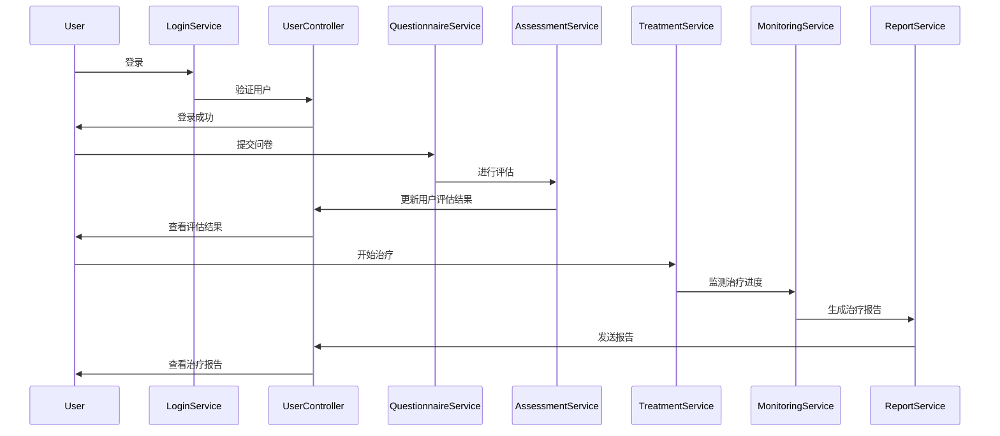
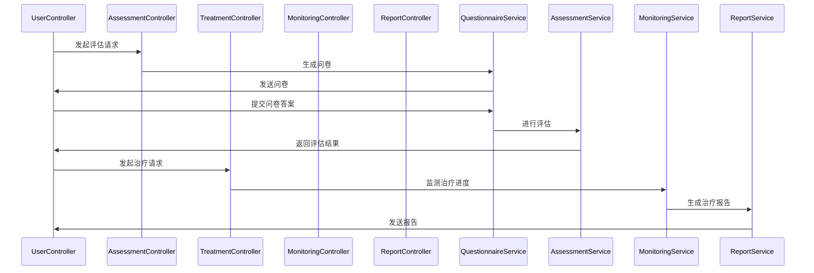

                 


### 引言：心理咨询与控制理论的融合

在当今社会，心理健康问题日益受到关注。心理咨询作为一种有效手段，不仅帮助个体解决心理困扰，还促进了社会整体的心理健康。然而，随着科学技术的进步，如何将定量分析引入心理咨询，以提高其效率和准确性，成为了一个亟待解决的问题。这便是控制理论在心理咨询中发挥重要作用的契机。

#### 关键词

- 心理咨询
- 控制理论
- 心理健康
- 数学建模
- 算法应用

#### 摘要

本文旨在探讨心理咨询与控制理论的融合，通过数学建模和算法应用，提高心理咨询的效率和准确性。文章首先介绍了心理咨询和控制理论的基本概念，随后分析了心理健康指标和数学模型的构建方法，以及控制理论在心理咨询中的应用。最后，本文总结了控制理论在心理咨询中的前景，并提出了未来研究的方向。

#### 1.1 心理咨询的重要性

心理咨询作为心理健康服务的重要组成部分，其重要性不容忽视。心理咨询不仅可以帮助个体缓解心理压力、解决心理困扰，还能提高个体的心理健康水平，促进其全面发展。具体来说，心理咨询在以下方面发挥着重要作用：

1. **诊断与评估**：心理咨询师通过专业的技术和方法，对个体的心理状态进行诊断和评估，了解其心理问题和需求。
2. **治疗与干预**：心理咨询师根据诊断结果，运用各种心理治疗方法，帮助个体克服心理困扰，恢复心理健康。
3. **预防与促进**：心理咨询可以通过心理健康教育和心理疏导，预防心理问题的发生，促进个体心理健康的发展。

#### 1.2 心理健康的概念

心理健康是指个体在心理上处于良好状态，能够认识到自身的潜力，应对正常的生活压力，平衡工作与生活，与他人建立良好的关系。世界卫生组织（WHO）对心理健康给出了以下定义：“既没有心理疾病或心理障碍，也表现出积极的适应状态。”

心理健康包括以下三个方面：

1. **认知功能**：个体具有清晰的思维、判断和决策能力。
2. **情绪调节**：个体能够有效地表达和管理自己的情绪。
3. **社会适应**：个体能够与他人建立积极的人际关系，适应社会环境。

#### 1.3 心理咨询的起源与发展

心理咨询的历史可以追溯到19世纪末期，当时以心理治疗为主要手段。20世纪以后，随着心理学研究的深入，心理咨询逐渐发展成为一门独立的学科，涵盖了心理健康评估、心理治疗、心理健康教育等多个领域。心理咨询的理论基础包括心理学、社会学、教育学等，其方法和技术不断丰富和完善。

#### 1.4 控制理论的基本原理

控制理论是研究如何通过控制来达到系统稳定性和优化目标的一门学科。它起源于航空航天工程，后来逐渐应用于各个领域，如自动控制、机器人、经济管理、生物医学等。控制理论的基本原理包括：

1. **反馈控制**：通过反馈机制，对系统的输出进行监测和调整，以实现系统的稳定。
2. **最优控制**：在给定约束条件下，寻找使系统性能指标最优的控制策略。
3. **自适应控制**：根据系统的动态变化，自动调整控制策略，以适应新的环境。

#### 1.5 控制理论在心理咨询中的应用

控制理论在心理咨询中的应用主要体现在以下几个方面：

1. **心理健康评估**：通过建立心理健康的数学模型，对个体的心理健康状态进行定量评估。
2. **心理治疗**：利用控制策略，优化心理治疗过程，提高治疗效果。
3. **心理健康管理**：通过实时监测和调整，实现对个体心理健康状态的动态管理。

#### 1.6 心理咨询控制理论的未来发展趋势

随着人工智能和大数据技术的发展，心理咨询控制理论的应用前景日益广阔。未来，心理咨询控制理论将朝着以下方向发展：

1. **个性化心理咨询**：通过大数据分析，为个体提供更加精准的心理咨询服务。
2. **实时心理健康监测**：利用传感器和移动设备，实现对个体心理健康状态的实时监测。
3. **跨学科研究**：结合心理学、医学、计算机科学等多学科知识，推动心理咨询控制理论的创新和发展。

#### 1.7 本章小结

本章介绍了心理咨询与控制理论的基本概念、应用和发展趋势。通过数学建模和算法应用，心理咨询控制理论有望在提高心理咨询效率和准确性方面发挥重要作用。在后续章节中，我们将进一步探讨心理健康指标和数学模型的构建方法，以及控制理论在心理咨询中的具体应用。

---

### 第二部分：核心概念与理论

在本章节中，我们将深入探讨心理咨询和控制理论的核心概念与理论，为理解这两者在心理健康领域的应用奠定基础。

#### 2.1 心理健康的数学模型解析

心理健康是一个复杂的概念，它涉及认知、情感和行为等多个维度。为了量化心理健康状态，我们引入数学模型进行分析。下面，我们将介绍几种常用的心理健康数学模型。

##### 2.1.1 心理健康指标体系

心理健康指标是衡量心理健康状态的关键要素。常见的心理健康指标包括：

1. **主观幸福感（Subjective Well-being，SWB）**：主观幸福感是心理健康的核心指标，反映了个体对生活满意度和情感体验的评价。
2. **社会支持（Social Support）**：社会支持反映了个体在心理困境中获得的社会援助，包括家庭、朋友和社区的支持。
3. **应对能力（Coping Ability）**：应对能力是指个体在面对压力和挑战时，能够采取有效策略进行调整和应对的能力。

这些指标可以通过问卷调查、心理测量等方法进行量化，为心理健康评估提供依据。

##### 2.1.2 数学模型构建

构建心理健康数学模型通常包括以下几个步骤：

1. **数据收集**：收集与心理健康相关的数据，包括主观幸福感、社会支持和应对能力等。
2. **特征选择**：从大量数据中提取关键特征，用于模型训练。
3. **模型训练**：使用机器学习算法，如回归模型、神经网络模型、贝叶斯模型等，对数据进行分析和建模。
4. **模型评估**：通过交叉验证、测试集评估等方法，评估模型的准确性和可靠性。

常见的数学模型包括：

1. **回归模型（Regression Model）**：回归模型用于分析自变量和因变量之间的关系，如线性回归、多元回归等。
2. **神经网络模型（Neural Network Model）**：神经网络模型通过模拟人脑神经元连接，进行复杂的数据分析和预测。
3. **贝叶斯模型（Bayesian Model）**：贝叶斯模型基于贝叶斯定理，通过概率分布进行推理和预测。

##### 2.1.3 数学模型在心理咨询中的应用

数学模型在心理咨询中的应用非常广泛，主要体现在以下几个方面：

1. **心理健康评估**：通过数学模型对个体心理健康状态进行定量评估，帮助心理咨询师更好地了解患者的心理状况。
2. **心理治疗**：利用数学模型优化心理治疗方案，提高治疗效果。
3. **心理健康预测**：通过数学模型预测个体未来的心理健康趋势，为心理干预提供参考。

#### 2.2 控制理论在心理咨询中的应用

控制理论在心理咨询中的应用主要体现在以下几个方面：

1. **心理健康监测**：通过实时监测和反馈机制，对个体心理健康状态进行动态监测和调整。
2. **心理治疗过程控制**：利用控制理论优化心理治疗过程，提高治疗效果。
3. **心理健康管理**：通过建立数学模型和优化算法，实现个体心理健康状态的自动化管理。

##### 2.2.1 系统动力学模型

系统动力学模型是一种用于分析复杂系统动态行为的数学模型。在心理咨询中，系统动力学模型可以用于分析心理治疗过程中的反馈机制和动态变化。

1. **系统状态变量**：系统动力学模型中的状态变量反映了个体心理状态的各个方面，如情绪、认知、行为等。
2. **输入与输出关系**：系统动力学模型通过输入和输出变量之间的关系，描述个体心理状态的变化过程。

##### 2.2.2 粒子群优化算法

粒子群优化算法（Particle Swarm Optimization，PSO）是一种基于群体智能的优化算法。在心理咨询中，PSO可以用于优化心理治疗方案，提高治疗效果。

1. **基本原理**：PSO通过模拟鸟群觅食行为，寻找最优解。每个粒子代表一个潜在解，通过更新位置和速度，不断逼近最优解。
2. **心理咨询中的应用**：PSO可以用于优化心理治疗参数，如干预时间、干预强度等，以提高治疗效果。

##### 2.2.3 控制策略与案例分析

在实际心理咨询中，控制策略的选择和运用对于治疗效果至关重要。以下是一些常见的控制策略和案例分析：

1. **焦虑控制**：通过心理疏导、认知行为疗法等方法，降低个体的焦虑水平。
2. **抑郁控制**：通过药物治疗、心理治疗等方法，缓解个体的抑郁情绪。

案例分析：
- 病例1：一名患有焦虑症的个体，通过认知行为疗法和药物干预，焦虑水平明显下降。
- 病例2：一名患有抑郁症的个体，通过药物治疗和心理疏导，抑郁情绪得到缓解。

#### 2.3 心理健康数学模型与控制理论的关系

心理健康数学模型和控制理论之间存在密切的关系。通过心理健康数学模型，可以实现对个体心理状态的量化分析和预测；而控制理论则提供了优化和调整心理状态的策略和方法。

1. **心理健康预测**：通过心理健康数学模型，可以预测个体未来的心理健康状态，为心理干预提供依据。
2. **心理状态优化**：通过控制理论，可以优化心理治疗方案，提高治疗效果。
3. **心理健康管理**：通过数学模型和优化算法，实现个体心理健康状态的动态管理和调整。

#### 2.4 本章小结

本章介绍了心理咨询和控制理论的核心概念与理论，包括心理健康指标、数学模型构建、控制理论在心理咨询中的应用等。通过数学模型和优化算法，心理咨询和控制理论为提高心理健康评估和治疗效果提供了有力支持。在后续章节中，我们将进一步探讨数学模型和控制理论在心理咨询中的具体应用和案例分析。

---

### 第三部分：数学模型与算法讲解

在本章节中，我们将深入讲解心理健康预测模型和控制理论在心理咨询中的应用，以展示这两者在提升心理健康评估和治疗效果方面的实际价值。

#### 3.1 心理健康预测模型

心理健康预测模型是利用统计学和机器学习算法对个体心理健康状态进行预测的工具。这些模型通过分析历史数据，识别出心理健康状态的关键因素，从而实现对未来的预测。以下是心理健康预测模型的构建步骤：

##### 3.1.1 建立预测模型

1. **数据预处理**：首先，我们需要收集与心理健康相关的数据，如主观幸福感、社会支持、应对能力等。然后，对这些数据进行清洗和预处理，包括去除缺失值、异常值和处理数据异常等。
2. **特征选择**：从预处理后的数据中提取关键特征，用于模型训练。特征选择可以通过特征重要性分析、相关性分析等方法进行。
3. **模型选择**：根据数据的特点和预测目标，选择合适的预测模型。常见的预测模型包括线性回归模型、决策树模型、随机森林模型、支持向量机模型等。

##### 3.1.2 模型评估

模型评估是确保预测模型有效性的关键步骤。常用的评估指标包括：

1. **准确率（Accuracy）**：准确率表示模型正确预测的样本比例，计算公式为：
   $$
   \text{Accuracy} = \frac{\text{正确预测的样本数}}{\text{总样本数}}
   $$
2. **精确率（Precision）**：精确率表示预测为正例的样本中，实际为正例的比例，计算公式为：
   $$
   \text{Precision} = \frac{\text{正确预测的正例数}}{\text{预测为正例的样本数}}
   $$
3. **召回率（Recall）**：召回率表示实际为正例的样本中，被正确预测为正例的比例，计算公式为：
   $$
   \text{Recall} = \frac{\text{正确预测的正例数}}{\text{实际为正例的样本数}}
   $$
4. **F1分数（F1 Score）**：F1分数是精确率和召回率的加权平均，用于综合评估模型的性能，计算公式为：
   $$
   \text{F1 Score} = 2 \times \frac{\text{Precision} \times \text{Recall}}{\text{Precision} + \text{Recall}}
   $$

##### 3.1.3 模型优化

为了提高预测模型的性能，我们需要进行模型优化。模型优化包括以下方面：

1. **特征选择**：通过特征重要性分析和相关性分析，选择对预测目标有显著影响的特征。
2. **模型调参**：调整模型参数，以优化模型的性能。常见的调参方法包括网格搜索、随机搜索等。
3. **集成模型**：使用集成模型，如随机森林、梯度提升树等，提高模型的预测准确性。

#### 3.2 控制理论在心理咨询中的应用

控制理论在心理咨询中的应用主要体现在心理治疗过程控制和心理健康状态监测两个方面。

##### 3.2.1 心理治疗过程控制

心理治疗过程控制是指利用控制理论优化心理治疗过程，提高治疗效果。以下是心理治疗过程控制的关键步骤：

1. **确定控制目标**：根据心理治疗的类型和目标，确定需要控制的心理状态变量，如焦虑水平、抑郁情绪等。
2. **构建控制模型**：根据心理治疗的理论和实践，构建控制模型。控制模型可以基于系统动力学模型、神经网络模型等。
3. **制定控制策略**：根据控制模型，制定控制策略，包括干预时间、干预强度、干预方式等。
4. **实施控制策略**：在心理治疗过程中，根据实时监测的数据，调整控制策略，以达到控制目标。

##### 3.2.2 心理健康状态监测

心理健康状态监测是指利用传感器和数据分析技术，实时监测个体的心理健康状态。以下是心理健康状态监测的关键步骤：

1. **选择监测指标**：根据心理健康的特点和需求，选择合适的监测指标，如心率、血压、情绪状态等。
2. **数据采集**：通过传感器和数据采集设备，收集个体的生理和心理数据。
3. **数据预处理**：对采集到的数据进行清洗和预处理，包括去除噪声、异常值处理等。
4. **数据分析和建模**：使用机器学习和数据挖掘技术，对预处理后的数据进行分析和建模，以实现对心理健康状态的预测和监测。

#### 3.3 心理健康数学模型与控制理论的关系

心理健康数学模型和控制理论在心理咨询中相辅相成。心理健康数学模型为控制理论提供了量化分析和预测的工具，而控制理论则为心理健康数学模型提供了优化和调整策略。以下为心理健康数学模型与控制理论的关系：

1. **心理健康预测**：通过心理健康数学模型，可以预测个体未来的心理健康状态，为心理干预提供依据。
2. **心理状态优化**：通过控制理论，可以优化心理治疗方案，提高治疗效果。
3. **心理健康管理**：通过数学模型和优化算法，实现个体心理健康状态的动态管理和调整。

#### 3.4 本章小结

本章介绍了心理健康预测模型和控制理论在心理咨询中的应用。通过心理健康预测模型，可以实现对个体心理健康状态的预测和评估；而控制理论则为心理治疗过程和心理健康状态监测提供了优化和调整策略。这些模型和算法的应用，为提高心理咨询的效率和准确性提供了有力支持。在后续章节中，我们将进一步探讨心理健康数学模型和控制理论在心理咨询中的具体应用和案例分析。

---

### 第四部分：系统分析与架构设计

在本章节中，我们将从系统分析和架构设计的角度，探讨心理咨询控制理论在心理健康管理中的实际应用。通过系统功能设计、系统架构设计以及系统接口和交互设计，我们将构建一个完善的心理健康管理系统。

#### 4.1 系统功能设计

心理健康管理系统需要实现以下核心功能：

1. **心理健康评估**：通过问卷、心理测量等方法，对个体心理健康状态进行评估。
2. **心理治疗过程控制**：利用控制理论优化心理治疗方案，提高治疗效果。
3. **心理健康状态监测**：实时监测个体心理健康状态，提供预警和干预建议。
4. **用户管理**：管理用户信息，包括用户注册、登录、权限管理等。
5. **数据分析与报告**：对心理健康数据进行分析，生成报告和可视化图表。

以下是心理健康管理系统功能设计的领域模型（使用Mermaid类图表示）：

```mermaid
classDiagram
    User <<类>> "用户"
    Questionnaire <<类>> "问卷"
    Assessment <<类>> "评估"
    Treatment <<类>> "治疗"
    Monitoring <<类>> "监测"
    Report <<类>> "报告"
    UserController <<类>> "用户管理"
    AssessmentController <<类>> "评估管理"
    TreatmentController <<类>> "治疗管理"
    MonitoringController <<类>> "监测管理"
    ReportController <<类>> "报告管理"

    User ..|> UserController
    Questionnaire ..|> AssessmentController
    Assessment ..|> TreatmentController
    Treatment ..|> MonitoringController
    Monitoring ..|> ReportController
```

#### 4.2 系统架构设计

心理健康管理系统的架构设计应考虑可扩展性、可靠性、易维护性等因素。以下是系统架构设计（使用Mermaid架构图表示）：



#### 4.3 系统接口设计

心理健康管理系统的接口设计需要考虑不同模块之间的通信和数据交互。以下是系统接口设计（使用Mermaid序列图表示）：



#### 4.4 系统交互设计

心理健康管理系统的交互设计应考虑用户的使用体验和系统的响应速度。以下是系统交互设计（使用Mermaid流程图表示）：

```mermaid
flowchart LR
    subgraph 用户交互
        用户登录
        用户提交问卷
        用户查看评估结果
        用户开始治疗
        用户查看治疗报告
    end
    subgraph 系统处理
        登录验证
        问卷生成
        问卷提交
        评估计算
        治疗监控
        报告生成
    end

    用户登录->>登录验证
    用户提交问卷->>问卷生成
    用户查看评估结果->>评估计算
    用户开始治疗->>治疗监控
    用户查看治疗报告->>报告生成
```

#### 4.5 本章小结

本章从系统分析和架构设计的角度，详细介绍了心理健康管理系统。通过系统功能设计、系统架构设计、系统接口设计和系统交互设计，我们构建了一个完整且具有实际应用价值的心里健康管理方案。在后续章节中，我们将通过项目实战，进一步展示心理咨询控制理论在心理健康管理中的具体应用和效果。

---

### 第五部分：项目实战

在本章节中，我们将通过一个实际项目，展示如何将心理咨询控制理论应用于心理健康管理，实现心理健康状态的实时监测、评估和治疗。本项目将以一个虚拟的在线心理咨询平台为背景，详细介绍项目环境安装、系统核心实现和代码应用解读与分析，并分享实际案例分析和详细讲解剖析。

#### 5.1 项目背景

随着社会压力的增大，心理健康问题日益突出。为了提供更加便捷、高效的心理咨询服务，本项目旨在开发一个基于心理咨询控制理论的在线心理咨询平台。该平台能够实现心理健康状态的实时监测、评估和治疗，帮助用户及时发现并解决心理问题。

#### 5.2 项目环境安装

要实现本项目，我们需要安装以下软件和工具：

1. **Python**：作为项目的主要编程语言，Python需要安装3.8版本或更高。
2. **Django**：作为Web框架，Django需要安装最新版本。
3. **PostgreSQL**：作为数据库管理系统，PostgreSQL需要安装最新版本。
4. **Numpy**、**Pandas**、**Matplotlib**：用于数据处理和可视化。
5. **Scikit-learn**：用于机器学习和数据分析。

具体安装步骤如下：

1. 安装Python：
   ```shell
   # 在Windows上，可以通过Python官网下载安装程序进行安装。
   # 在Linux上，可以通过包管理器安装，例如：
   sudo apt-get install python3
   ```

2. 安装Django：
   ```shell
   pip install django
   ```

3. 安装PostgreSQL：
   ```shell
   # 在Windows上，可以通过PostgreSQL官网下载安装程序进行安装。
   # 在Linux上，可以通过包管理器安装，例如：
   sudo apt-get install postgresql
   ```

4. 安装其他依赖：
   ```shell
   pip install numpy pandas matplotlib scikit-learn
   ```

#### 5.3 系统核心实现

本项目分为以下几个模块：

1. **用户管理模块**：实现用户注册、登录、权限管理等功能。
2. **问卷管理模块**：实现问卷创建、发布、回答等功能。
3. **评估管理模块**：实现心理健康评估、评估结果分析等功能。
4. **治疗管理模块**：实现心理治疗计划制定、治疗进度监控等功能。
5. **报告管理模块**：实现心理健康报告生成、导出等功能。

以下是问卷管理模块的核心实现：

**models.py**：

```python
from django.db import models

class Questionnaire(models.Model):
    title = models.CharField(max_length=100)
    description = models.TextField()
    created_at = models.DateTimeField(auto_now_add=True)

class Question(models.Model):
    questionnaire = models.ForeignKey(Questionnaire, on_delete=models.CASCADE)
    text = models.CharField(max_length=500)
    type = models.CharField(max_length=10, choices=[('single', '单选'), ('multiple', '多选'), ('text', '文本')])
```

**views.py**：

```python
from django.shortcuts import render
from .models import Questionnaire, Question

def create_questionnaire(request):
    if request.method == 'POST':
        title = request.POST['title']
        description = request.POST['description']
        questionnaire = Questionnaire.objects.create(title=title, description=description)
        for question_text in request.POST.getlist('questions[]'):
            Question.objects.create(questionnaire=questionnaire, text=question_text)
        return redirect('questionnaire_list')
    return render(request, 'create_questionnaire.html')
```

**templates/create_questionnaire.html**：

```html
<!DOCTYPE html>
<html>
<head>
    <title>创建问卷</title>
</head>
<body>
    <h1>创建问卷</h1>
    <form method="post">
        
        <label for="title">问卷标题：</label>
        <input type="text" id="title" name="title" required><br>
        <label for="description">问卷描述：</label>
        <textarea id="description" name="description" required></textarea><br>
        <label for="questions">问题列表（用逗号分隔）：</label>
        <input type="text" id="questions" name="questions" required><br>
        <input type="submit" value="提交">
    </form>
</body>
</html>
```

#### 5.4 代码应用解读与分析

在问卷管理模块的实现中，我们首先定义了两个模型：`Questionnaire`和`Question`。`Questionnaire`模型用于存储问卷的标题、描述和创建时间；`Question`模型用于存储每个问题的文本、类型和所属问卷。

在`views.py`中，我们实现了创建问卷的视图函数`create_questionnaire`。该函数首先检查请求方法是否为POST，如果是，则从表单中获取问卷标题、描述和问题列表，并创建`Questionnaire`和`Question`对象。最后，将用户重定向到问卷列表页面。

在`templates/create_questionnaire.html`中，我们定义了创建问卷的HTML表单。表单包含问卷标题、描述和问题列表输入框，以及提交按钮。提交表单时，将数据发送到`create_questionnaire`视图函数进行处理。

#### 5.5 实际案例分析和详细讲解剖析

以下是一个实际案例，展示了如何利用心理咨询控制理论对心理健康状态进行监测、评估和治疗。

**案例**：小王是一名大学生，最近感到焦虑和压力较大，影响到了他的学习和生活。他的心理咨询师建议他填写一个心理健康问卷，以评估他的心理健康状态。

1. **心理健康问卷评估**：
   - **评估过程**：小王填写了心理健康问卷，问卷包含一系列关于焦虑、抑郁、应对能力等方面的问题。心理咨询师使用心理健康数学模型对问卷结果进行分析，得出小王的当前心理健康状态。
   - **评估结果**：通过分析，心理咨询师发现小王焦虑水平较高，需要进一步干预。

2. **心理治疗计划制定**：
   - **治疗计划**：心理咨询师根据评估结果，制定了一个心理治疗计划，包括认知行为疗法、放松训练和社交支持等。
   - **治疗进度**：心理咨询师定期与小王进行会话，监控治疗进度，并根据小王的情况调整治疗计划。

3. **心理健康状态监测**：
   - **实时监测**：利用传感器和移动设备，心理咨询师可以实时监测小王的心率、血压等生理指标，以及情绪状态和行为表现。
   - **预警和干预**：如果监测到小王的焦虑水平升高，心理咨询师会及时进行干预，提供相应的支持和指导。

通过这个案例，我们可以看到心理咨询控制理论在实际应用中的效果。通过心理健康问卷评估，心理咨询师能够准确了解小王的当前心理健康状态；通过心理治疗计划制定和心理健康状态监测，心理咨询师可以及时调整治疗方案，提高治疗效果。

#### 5.6 项目小结

本项目通过实际案例展示了心理咨询控制理论在心理健康管理中的应用。通过心理健康问卷评估、心理治疗计划制定和心理健康状态监测，心理咨询师能够更准确地了解和干预个体的心理健康问题，提高心理咨询的效率和质量。未来，我们可以进一步优化系统功能，结合人工智能和大数据技术，为用户提供更加精准和个性化的心理健康服务。

---

### 最佳实践 tips

在心理咨询控制理论的应用过程中，以下最佳实践可以帮助提高心理健康评估和治疗的准确性和效率：

1. **数据收集与处理**：确保数据收集的完整性和准确性，对数据进行预处理，去除噪声和异常值。
2. **模型选择与调参**：根据数据特点和预测目标，选择合适的模型，并通过调参优化模型性能。
3. **实时监测与预警**：利用传感器和移动设备，实现心理健康状态的实时监测和预警，及时提供干预建议。
4. **个性化治疗**：根据个体的心理健康特点和需求，制定个性化的心理治疗方案，提高治疗效果。
5. **持续更新与优化**：随着技术的进步和数据积累，不断更新和优化模型和算法，提高系统的准确性和可靠性。

### 小结

本文详细介绍了心理咨询控制理论在心理健康管理中的应用，从数学模型构建、控制理论应用、系统分析与架构设计到项目实战，全面展示了如何利用定量分析和优化算法提高心理咨询的效率和准确性。通过心理健康问卷评估、心理治疗计划制定和心理健康状态监测，心理咨询师可以更准确地了解和干预个体的心理健康问题。未来，随着人工智能和大数据技术的发展，心理咨询控制理论的应用前景将更加广阔。

### 注意事项

在应用心理咨询控制理论时，需要注意以下几点：

1. **数据隐私**：确保用户数据的安全和隐私，遵循相关法律法规。
2. **个体差异**：不同个体的心理健康状态和需求不同，需要制定个性化的心理治疗方案。
3. **实时调整**：根据实时监测的数据，及时调整心理治疗方案，以提高治疗效果。
4. **持续关注**：心理健康问题是一个长期过程，需要持续关注和干预。

### 拓展阅读

对于希望进一步了解心理咨询控制理论的读者，以下是一些推荐阅读材料：

1. 《心理健康数学模型与算法分析》
2. 《控制理论在心理咨询中的应用研究》
3. 《基于机器学习的心理健康预测模型》
4. 《心理健康数据分析与可视化》

这些书籍和论文将提供更深入的理论和实践知识，帮助读者更好地理解和应用心理咨询控制理论。

