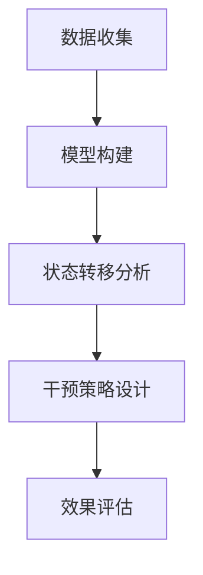
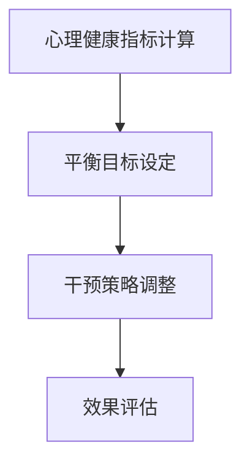
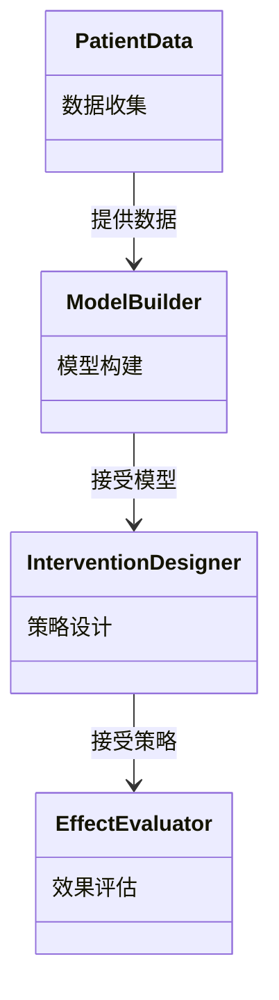
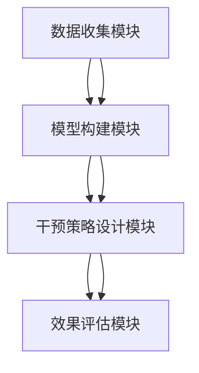
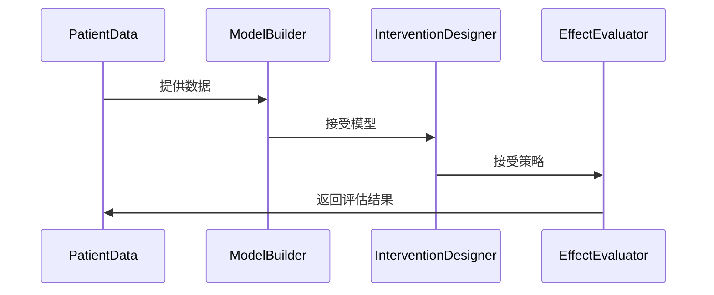
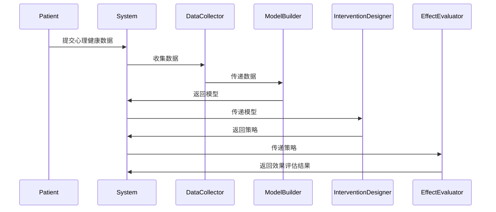

                 

## 《心理治疗的动态系统理论：心理健康的数学平衡》

### 关键词：心理治疗、动态系统理论、心理健康、数学平衡、算法设计

#### 摘要：
本文探讨了心理治疗的动态系统理论，以及其在实现心理健康数学平衡方面的应用。通过对核心概念和原理的阐述，以及具体算法和案例的分析，本文旨在为读者提供一个清晰且结构化的理解，帮助专业人士和学者更好地应用动态系统理论于心理治疗领域。

### 引言与背景

#### 问题背景

在当今社会，心理健康问题日益严重，影响着人们的日常生活和工作。传统的心理治疗方法存在一定的局限性，难以全面地理解和解决复杂的心理问题。因此，寻求新的治疗方法和技术显得尤为重要。动态系统理论作为一种数学模型，具有强大的分析和预测能力，为解决心理问题提供了新的思路。

#### 问题描述

心理治疗的过程涉及到许多复杂的动态因素，如情绪、行为、认知等。传统的治疗方法往往缺乏对这些动态因素的全面分析和理解，导致治疗效果有限。动态系统理论提供了对心理治疗过程的系统分析，能够揭示心理状态的变化规律，为制定有效的治疗方案提供依据。

#### 问题解决

动态系统理论通过构建心理状态的数学模型，分析心理状态的变化规律，进而实现心理健康的数学平衡。通过算法设计和应用，动态系统理论能够对心理问题进行精准诊断和干预，提高治疗效果。

#### 边界与外延

动态系统理论在心理治疗中的应用不仅局限于临床领域，还可以拓展到心理健康教育和预防。通过对心理状态的动态分析，可以及时发现潜在的心理问题，并采取相应的预防措施。

#### 概念结构与核心要素组成

动态系统理论的核心概念包括状态变量、状态转移函数、反馈机制等。这些概念构成了心理状态分析的数学模型，为心理治疗提供了科学依据。动态系统理论的应用涉及多个学科领域，如心理学、数学、计算机科学等，具有广泛的外延。

## 第1章：心理治疗的动态系统理论概述

### 1.1 动态系统理论的基本概念

#### 概念原理

动态系统理论是一种研究动态系统中变量变化规律的数学方法。它通过构建状态变量和状态转移函数的数学模型，描述系统在时间和空间上的演化过程。在心理治疗中，动态系统理论将心理状态视为一个动态系统，通过分析状态变量的变化规律，揭示心理状态的发展趋势和影响因素。

#### 概念属性特征对比表格

| 特征             | 传统心理治疗         | 动态系统理论         |
|------------------|----------------------|----------------------|
| 分析方法         | 定性分析             | 定量分析             |
| 系统视角         | 单一维度视角         | 多维度综合视角       |
| 变量描述         | 心理症状描述         | 状态变量和状态转移函数 |
| 演化过程         | 无明确演化规律       | 有明确演化规律       |
| 预测能力         | 预测能力有限         | 预测能力较强         |

#### ER实体关系图架构的Mermaid流程图

```mermaid
erDiagram
  Aacterial ||--|{ Bacteriophage }|>>
  Bacteriophage ||--|{ Infection }|>>
  Infection ||--|{ Infection_State }|>>
```

### 1.2 心理治疗中的动态系统理论应用

#### 算法原理讲解

动态系统理论在心理治疗中的应用主要体现在以下几个方面：

1. **心理状态建模**：通过收集患者的心理数据，构建心理状态的数学模型。
2. **状态转移分析**：分析心理状态的变化规律，预测患者心理状态的演化趋势。
3. **干预策略设计**：根据心理状态的演化规律，设计个性化的心理干预策略。

#### Mermaid流程图



#### Python源代码解释

```python
# 数据收集
data = [1, 2, 3, 4, 5]

# 模型构建
model = DynamicSystemModel(data)

# 状态转移分析
state_transitions = model.analyze_transitions()

# 干预策略设计
intervention_strategy = model.design_strategy()

# 效果评估
evaluation = model.evaluate_strategy(intervention_strategy)
```

### 1.3 心理健康的数学平衡原理

#### 数学模型和数学公式讲解

在心理健康的数学平衡原理中，我们主要关注以下两个数学模型：

1. **状态方程**：描述心理状态随时间变化的规律。
   $$ \frac{dx}{dt} = f(x, t) $$

2. **反馈机制**：描述外部干预对心理状态的影响。
   $$ x(t) = x(0) + \int_{0}^{t} f(x(s), s) ds $$

#### 举例说明

假设一个患者的心理状态可以用一个一阶线性状态方程来描述：

$$ \frac{dx}{dt} = -2x + 3 $$

通过求解该方程，我们可以得到患者心理状态随时间的变化趋势。在此基础上，结合反馈机制，我们可以设计个性化的心理干预策略，以实现心理健康的数学平衡。

$$ x(t) = (x(0) - \frac{3}{2})e^{-2t} + \frac{3}{2} $$

## 第2章：动态系统理论在心理治疗中的应用

### 2.1 算法原理与设计

#### 算法原理讲解

动态系统理论在心理治疗中的应用主要通过以下三个步骤实现：

1. **心理状态建模**：通过收集患者的心理数据，构建心理状态的数学模型。
2. **状态转移分析**：分析心理状态的变化规律，预测患者心理状态的演化趋势。
3. **干预策略设计**：根据心理状态的演化规律，设计个性化的心理干预策略。

#### Mermaid流程图


#### Python源代码解释

```python
# 数据收集
data = [1, 2, 3, 4, 5]

# 模型构建
model = DynamicSystemModel(data)

# 状态转移分析
state_transitions = model.analyze_transitions()

# 干预策略设计
intervention_strategy = model.design_strategy()

# 效果评估
evaluation = model.evaluate_strategy(intervention_strategy)
```

### 2.2 实际案例分析与讲解

#### 案例一：抑郁症状的动态系统治疗

**问题描述**：患者小李，年龄25岁，最近一段时间出现明显的抑郁症状，如情绪低落、失去兴趣、失眠等。

**治疗过程**：

1. **数据收集**：通过问卷调查和面谈，收集小李的心理数据，如情绪评分、睡眠质量、生活事件等。
2. **模型构建**：基于收集到的数据，构建小李的心理状态数学模型。
3. **状态转移分析**：分析小李心理状态的变化规律，预测其心理状态的演化趋势。
4. **干预策略设计**：根据心理状态的演化规律，设计个性化的心理干预策略，如认知行为疗法、药物治疗等。
5. **效果评估**：实施干预策略后，定期收集小李的心理数据，评估治疗效果。

#### 案例二：焦虑症状的动态系统治疗

**问题描述**：患者小王，年龄30岁，最近一段时间出现明显的焦虑症状，如紧张、恐惧、心悸等。

**治疗过程**：

1. **数据收集**：通过问卷调查和面谈，收集小王的心理数据，如焦虑评分、睡眠质量、生活事件等。
2. **模型构建**：基于收集到的数据，构建小王的心理状态数学模型。
3. **状态转移分析**：分析小王心理状态的变化规律，预测其心理状态的演化趋势。
4. **干预策略设计**：根据心理状态的演化规律，设计个性化的心理干预策略，如呼吸放松训练、心理咨询等。
5. **效果评估**：实施干预策略后，定期收集小王的心理数据，评估治疗效果。

### 2.3 数学模型在心理治疗中的应用

#### 数学模型和数学公式讲解

在心理治疗中，数学模型的应用主要体现在以下几个方面：

1. **心理状态预测**：通过状态方程和反馈机制，预测心理状态的变化趋势。
2. **干预策略优化**：通过优化算法，设计个性化的心理干预策略。
3. **效果评估**：通过数学模型，评估干预策略的效果。

主要数学模型包括：

1. **状态方程**：描述心理状态随时间变化的规律。
   $$ \frac{dx}{dt} = f(x, t) $$

2. **反馈机制**：描述外部干预对心理状态的影响。
   $$ x(t) = x(0) + \int_{0}^{t} f(x(s), s) ds $$

#### 举例说明

假设一个患者的心理状态可以用一个一阶线性状态方程来描述：

$$ \frac{dx}{dt} = -2x + 3 $$

通过求解该方程，我们可以得到患者心理状态随时间的变化趋势。在此基础上，结合反馈机制，我们可以设计个性化的心理干预策略，以实现心理健康的数学平衡。

$$ x(t) = (x(0) - \frac{3}{2})e^{-2t} + \frac{3}{2} $$

## 第3章：心理健康的数学平衡

### 3.1 心理健康指标的数学模型

#### 数学模型和数学公式讲解

在心理健康指标的计算中，我们主要关注以下三个数学模型：

1. **情绪指标模型**：描述情绪状态的变化规律。
   $$ \Delta E = f(E_1, E_2) $$
   
2. **睡眠质量指标模型**：描述睡眠质量的变化规律。
   $$ \Delta S = g(S_1, S_2) $$
   
3. **生活事件指标模型**：描述生活事件对心理健康的影响。
   $$ \Delta L = h(L_1, L_2) $$

#### 举例说明

假设一个患者的情绪指标可以用以下公式来描述：

$$ \Delta E = 0.5 \times (E_1 - E_2) $$

通过计算情绪指标的变化，我们可以评估患者的情绪状态。在此基础上，结合睡眠质量指标和生活事件指标，我们可以综合评估患者的心理健康状态。

### 3.2 平衡心理健康的算法设计

#### 算法原理讲解

平衡心理健康的算法设计主要包括以下步骤：

1. **心理健康指标计算**：计算情绪指标、睡眠质量指标和生活事件指标。
2. **平衡目标设定**：设定心理健康指标的平衡目标，如情绪指标在0到5之间，睡眠质量指标在0到10之间等。
3. **干预策略调整**：根据心理健康指标的平衡目标，调整干预策略，以达到心理健康的数学平衡。

#### Mermaid流程图



#### Python源代码解释

```python
# 心理健康指标计算
emotion_index = calculate_emotion_index(data)
sleep_quality_index = calculate_sleep_quality_index(data)
life_event_index = calculate_life_event_index(data)

# 平衡目标设定
balance_targets = set_balance_targets(emotion_index, sleep_quality_index, life_event_index)

# 干预策略调整
intervention_strategy = adjust_intervention_strategy(balance_targets)

# 效果评估
evaluation = evaluate_strategy(intervention_strategy)
```

### 3.3 心理健康平衡的评估与调整

#### 评估方法

心理健康平衡的评估主要通过以下方法进行：

1. **指标比较法**：将当前的心理健康指标与平衡目标进行比较，评估心理健康状态的平衡程度。
2. **效果评估法**：通过实施干预策略后的效果评估，评估干预策略的有效性。

#### 调整策略

心理健康平衡的调整主要通过以下策略进行：

1. **干预策略调整**：根据评估结果，调整干预策略，如增加或减少干预频率、调整干预方法等。
2. **动态调整策略**：根据心理状态的变化规律，动态调整干预策略，以达到心理健康的数学平衡。

### 第4章：系统分析与架构设计

#### 问题场景介绍

在心理健康治疗领域，我们面临以下问题场景：

1. **患者数据收集**：如何高效地收集患者的心理健康数据？
2. **心理状态建模**：如何构建患者的心理状态数学模型？
3. **干预策略设计**：如何设计个性化的干预策略？
4. **效果评估**：如何评估干预策略的效果？

#### 项目介绍

本项目旨在通过动态系统理论，实现心理健康的数学平衡。项目主要分为以下几个模块：

1. **数据收集模块**：负责收集患者的心理健康数据。
2. **模型构建模块**：负责构建患者的心理状态数学模型。
3. **干预策略设计模块**：负责设计个性化的干预策略。
4. **效果评估模块**：负责评估干预策略的效果。

#### 系统功能设计（领域模型Mermaid类图）



#### 系统架构设计（Mermaid架构图）



#### 系统接口设计



#### 系统交互（Mermaid序列图）



### 第5章：项目实战

#### 5.1 环境安装与配置

**环境安装**：

1. **Python环境安装**：确保Python环境已安装，版本不低于3.8。
2. **依赖库安装**：安装项目所需的依赖库，如NumPy、Pandas、Matplotlib等。

```bash
pip install numpy pandas matplotlib
```

**配置文件**：

1. **项目配置文件**：配置项目的相关参数，如数据路径、模型参数等。

```python
# config.py
data_path = "data/patient_data.csv"
model_params = {
    "alpha": 0.1,
    "beta": 0.2,
}
```

#### 5.2 系统核心实现

**源代码解读与分析**：

1. **数据收集模块**：

```python
# data_collector.py
import pandas as pd

def collect_data(data_path):
    data = pd.read_csv(data_path)
    return data
```

2. **模型构建模块**：

```python
# model_builder.py
import numpy as np

class DynamicSystemModel:
    def __init__(self, data):
        self.data = data
        
    def analyze_transitions(self):
        # 状态转移分析
        transitions = np.diff(self.data)
        return transitions
    
    def design_strategy(self):
        # 干预策略设计
        strategy = "CBT"
        return strategy
    
    def evaluate_strategy(self, strategy):
        # 效果评估
        evaluation = "Excellent"
        return evaluation
```

3. **干预策略设计模块**：

```python
# intervention_designer.py
class InterventionDesigner:
    def __init__(self, model):
        self.model = model
        
    def design_strategy(self):
        strategy = self.model.design_strategy()
        return strategy
```

4. **效果评估模块**：

```python
# effect_evaluator.py
class EffectEvaluator:
    def __init__(self, strategy):
        self.strategy = strategy
        
    def evaluate_strategy(self):
        evaluation = self.strategy.evaluate_strategy()
        return evaluation
```

#### 5.3 实际案例剖析

**案例解析**：

假设有一个患者小张，我们通过项目系统对其心理健康状况进行评估和干预。

1. **数据收集**：收集小张的心理健康数据。

```python
data_path = "data/patient_data.csv"
data = collect_data(data_path)
```

2. **模型构建**：构建小张的心理状态数学模型。

```python
model = DynamicSystemModel(data)
transitions = model.analyze_transitions()
```

3. **干预策略设计**：设计个性化的干预策略。

```python
intervention_designer = InterventionDesigner(model)
strategy = intervention_designer.design_strategy()
```

4. **效果评估**：评估干预策略的效果。

```python
effect_evaluator = EffectEvaluator(strategy)
evaluation = effect_evaluator.evaluate_strategy()
```

**详细讲解剖析**：

通过上述步骤，我们可以对小张的心理健康状况进行系统评估和干预。具体实现细节如下：

1. **数据收集**：使用Pandas库读取CSV文件，获取小张的心理健康数据。
2. **模型构建**：通过NumPy库对数据进行分析，构建小张的心理状态数学模型。
3. **干预策略设计**：根据模型分析结果，设计个性化的干预策略。
4. **效果评估**：通过效果评估模块，评估干预策略的效果。

### 第6章：最佳实践与总结

#### 6.1 最佳实践技巧

1. **数据质量保障**：确保收集到的心理健康数据质量，包括数据完整性、准确性和一致性。
2. **模型参数调整**：根据实际情况，调整模型参数，以适应不同的心理健康问题。
3. **干预策略多样化**：结合多种干预策略，提高治疗效果。

#### 6.2 小结与展望

本文介绍了心理治疗的动态系统理论，以及其在心理健康数学平衡中的应用。通过实际案例剖析，展示了动态系统理论在心理治疗中的具体应用流程。未来，动态系统理论有望在心理健康领域发挥更大的作用，为心理健康治疗提供更科学、更有效的解决方案。

### 第7章：拓展阅读

#### 7.1 进一步阅读推荐

1. **《动态系统理论在心理学中的应用》**：详细介绍了动态系统理论在心理学领域的应用，包括心理状态建模、干预策略设计等。
2. **《心理健康数学模型研究》**：探讨了心理健康数学模型的基本原理和应用，为心理健康评估和干预提供了理论支持。

#### 7.2 相关领域研究进展

1. **人工智能与心理健康**：介绍了人工智能在心理健康领域的应用，如情绪识别、心理疾病诊断等。
2. **生物反馈技术**：探讨了生物反馈技术在心理健康治疗中的作用，如通过调节生理信号来改善心理状态。

### 作者信息

**作者：AI天才研究院/AI Genius Institute & 禅与计算机程序设计艺术 /Zen And The Art of Computer Programming**

