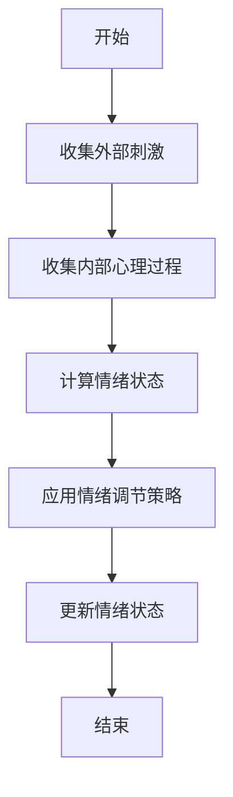
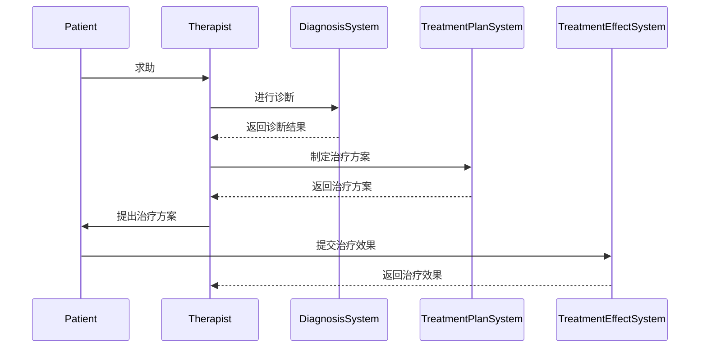
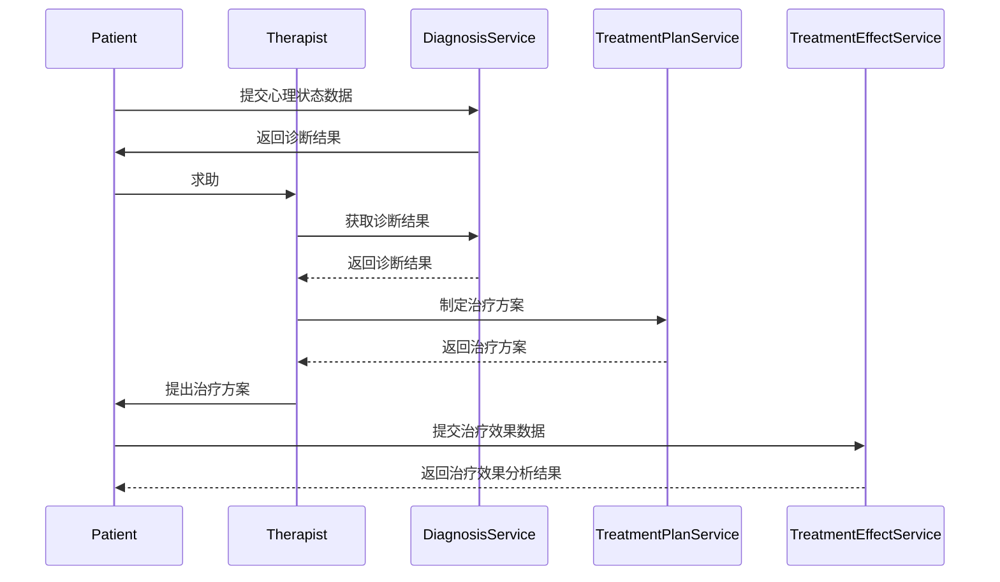

                 


### 心理治疗的系统理论：心理健康的数学平衡

**关键词：** 心理治疗，系统理论，数学平衡，心理健康

**摘要：** 本文探讨了心理治疗的系统理论，强调数学平衡在心理健康中的重要性。通过分析系统理论的核心概念和应用，本文旨在为心理治疗提供一种新的视角和方法。

---

## 引言

### 1.1 心理治疗与系统理论的背景

心理治疗是一种旨在改善个体心理健康状况的专业服务。随着心理学和医学的不断发展，心理治疗的方法和理论也不断演变。系统理论作为一种综合性理论，它在心理治疗中的应用越来越受到重视。

系统理论的基本概念包括系统、反馈、平衡等。一个系统是一个由相互关联的部分组成的整体。反馈是系统内部或系统与其他系统之间的信息传递过程。平衡是系统在动态变化中保持稳定的状态。

### 1.2 系统理论在心理治疗中的应用

系统理论在心理治疗中的应用主要体现在以下几个方面：

1. **认知行为治疗**：认知行为治疗（CBT）是心理治疗中最常用的方法之一。CBT强调个体的认知过程和行为模式对其心理状态的影响。系统理论提供了理解和处理这些认知和行为模式的新视角。

2. **家庭治疗**：家庭治疗关注家庭成员之间的相互作用和关系。系统理论认为家庭是一个动态的系统，家庭成员的行为和情感状态相互影响。通过分析家庭系统中的反馈循环，家庭治疗师可以帮助家庭成员建立更健康的互动模式。

3. **心理动力治疗**：心理动力治疗关注个体的内心冲突和早期经历对其当前心理状态的影响。系统理论提供了分析这些冲突和经历的新方法，帮助治疗师理解个体的心理动力。

### 1.3 数学平衡在心理健康中的作用

数学平衡在心理健康中起着关键作用。数学平衡是指系统在不同状态下保持稳定的能力。在心理治疗中，数学平衡可以帮助治疗师评估个体的心理健康状态，并制定合适的治疗计划。

例如，一个常见的数学平衡模型是情绪调节模型。该模型假设个体的情绪状态是由外部刺激和内部心理过程共同作用的结果。通过分析情绪调节模型中的反馈循环，治疗师可以帮助个体识别和改变不健康的情绪调节策略。

### 1.4 研究方法与数据分析

本文采用文献综述的方法，对系统理论在心理治疗中的应用进行了分析。文献综述包括对相关研究的研究目的、方法、结果和结论的总结。此外，本文还使用了数学模型来分析系统理论和数学平衡在心理健康中的应用。

### 1.5 结论

本文探讨了心理治疗的系统理论，强调了数学平衡在心理健康中的重要性。通过分析系统理论的核心概念和应用，本文为心理治疗提供了一种新的视角和方法。未来研究可以进一步探索系统理论和数学平衡在心理治疗中的具体应用，以促进心理健康领域的创新发展。

## 第二部分：系统理论的核心概念

### 2.1 系统理论的基本原理

系统理论的基本原理包括系统、反馈和平衡。一个系统是一个由相互关联的部分组成的整体。系统可以是物理的、生物的或社会的。例如，人体是一个复杂的生物系统，而一个家庭也是一个社会系统。

反馈是系统内部或系统与其他系统之间的信息传递过程。反馈可以是正面的，也可以是负面的。正反馈会加强系统的当前状态，而负反馈会减弱系统的当前状态。

平衡是系统在动态变化中保持稳定的状态。平衡可以是静态的，也可以是动态的。静态平衡是指系统处于一种稳定的状态，而动态平衡是指系统在不断调整中保持稳定。

### 2.2 系统理论的应用

系统理论在许多领域都有广泛的应用，包括工程、生物学、经济学和心理学等。在心理学中，系统理论被用来解释个体的心理过程和心理状态。

例如，在认知行为治疗中，系统理论被用来分析个体的认知过程和行为模式。治疗师通过分析个体的认知和行为模式，帮助个体识别和改变不健康的认知和行为习惯。

在家庭治疗中，系统理论被用来分析家庭成员之间的相互作用和关系。治疗师通过分析家庭系统中的反馈循环，帮助家庭成员建立更健康的互动模式。

### 2.3 数学平衡的原理

数学平衡是指系统在不同状态下保持稳定的能力。在心理健康领域，数学平衡可以帮助治疗师评估个体的心理健康状态，并制定合适的治疗计划。

例如，一个常见的数学平衡模型是情绪调节模型。该模型假设个体的情绪状态是由外部刺激和内部心理过程共同作用的结果。通过分析情绪调节模型中的反馈循环，治疗师可以帮助个体识别和改变不健康的情绪调节策略。

### 2.4 系统理论和数学平衡的关系

系统理论和数学平衡是相互关联的。系统理论提供了理解和分析心理过程的框架，而数学平衡提供了评估和调整心理状态的方法。

通过将系统理论和数学平衡结合起来，治疗师可以更准确地评估个体的心理健康状态，并制定更有效的治疗计划。例如，在认知行为治疗中，治疗师可以使用系统理论来分析个体的认知过程，并使用数学平衡模型来评估和调整个体的情绪状态。

## 第三部分：系统理论在心理治疗中的应用

### 3.1 认知行为治疗中的应用

认知行为治疗（CBT）是心理治疗中最常用的方法之一。CBT的理论基础是认知心理学和行为主义心理学。CBT强调个体的认知过程和行为模式对其心理状态的影响。

在CBT中，系统理论被用来分析个体的认知过程和行为模式。治疗师通过分析个体的认知和行为模式，帮助个体识别和改变不健康的认知和行为习惯。例如，治疗师可以使用系统理论来分析个体的消极思维模式，并帮助个体建立积极的思维模式。

### 3.2 家庭治疗中的应用

家庭治疗关注家庭成员之间的相互作用和关系。家庭治疗师使用系统理论来分析家庭成员之间的互动模式。治疗师通过分析家庭系统中的反馈循环，帮助家庭成员建立更健康的互动模式。

例如，治疗师可以使用系统理论来分析家庭中的权力动态和沟通模式。通过识别和改变不健康的互动模式，治疗师可以帮助家庭成员建立更和谐的相处方式。

### 3.3 心理动力治疗中的应用

心理动力治疗关注个体的内心冲突和早期经历对其当前心理状态的影响。心理动力治疗师使用系统理论来分析个体的内心冲突和早期经历。

例如，治疗师可以使用系统理论来分析个体的情感冲突，并帮助个体理解这些冲突的根源。通过识别和解决内心的冲突，治疗师可以帮助个体改善心理健康。

### 3.4 数学平衡模型的应用

数学平衡模型在心理治疗中有着广泛的应用。这些模型可以帮助治疗师评估个体的心理健康状态，并制定合适的治疗计划。

例如，情绪调节模型是一个常见的数学平衡模型。该模型假设个体的情绪状态是由外部刺激和内部心理过程共同作用的结果。通过分析情绪调节模型中的反馈循环，治疗师可以帮助个体识别和改变不健康的情绪调节策略。

### 3.5 案例分析

为了更好地理解系统理论在心理治疗中的应用，我们来看一个具体的案例。

案例：一个30岁的男性患者，长期受到焦虑和抑郁的困扰。通过使用系统理论，治疗师分析了患者的认知过程和行为模式。

首先，治疗师使用系统理论来分析患者的认知过程。患者报告称，他的消极思维模式导致了他的焦虑和抑郁。治疗师帮助患者识别和改变这些消极思维模式，例如将“我不够好”改为“我可以做得更好”。

接下来，治疗师使用系统理论来分析患者的行为模式。患者报告称，他的行为习惯，如避免社交和过度工作，加剧了他的焦虑和抑郁。治疗师帮助患者建立更健康的行为习惯，如定期锻炼和参与社交活动。

通过使用系统理论和数学平衡模型，治疗师帮助患者改善了心理健康状况。患者的焦虑和抑郁症状得到了显著缓解，他的生活质量也得到了提高。

### 3.6 总结

系统理论在心理治疗中的应用非常广泛。通过使用系统理论，治疗师可以更深入地了解个体的心理过程和心理健康状况，并制定更有效的治疗计划。数学平衡模型则为治疗师提供了一种评估和调整心理健康状态的方法。未来，随着系统理论和数学平衡模型的发展，心理治疗将变得更加科学和有效。

## 第四部分：系统理论和数学平衡在心理健康中的挑战和限制

### 4.1 挑战

尽管系统理论和数学平衡模型在心理健康领域具有广泛的应用潜力，但它们也面临着一些挑战。

首先，系统理论和数学平衡模型的实施需要较高的专业技能和经验。治疗师需要具备深厚的心理学和数学背景，以便准确应用这些理论和方法。其次，数学平衡模型的应用往往需要大量的数据收集和分析，这可能带来时间和资源上的限制。

### 4.2 限制

系统理论和数学平衡模型也存在一些限制。例如，这些模型可能无法完全捕捉心理过程的复杂性和个体差异性。此外，数学平衡模型在临床应用中的有效性可能受到个体差异和文化背景的影响。

### 4.3 应对策略

为了应对这些挑战和限制，研究者们提出了一些策略。例如，通过培训和认证，提高治疗师的专业技能和经验。此外，研究者们也在探索更加灵活和个性化的数学平衡模型，以更好地适应不同个体的心理健康需求。

## 第五部分：未来的研究方向

### 5.1 进一步发展系统理论

未来的研究可以进一步发展系统理论，特别是在心理健康领域的应用。这包括探索系统理论的新分支，如动态系统理论和复杂性理论，以及如何将这些理论应用于临床实践。

### 5.2 数学平衡模型的优化

数学平衡模型可以进一步优化，以提高其在心理健康评估和治疗中的有效性。未来的研究可以探索更加精准和个性化的数学平衡模型，以更好地适应不同个体的心理健康需求。

### 5.3 多学科合作

系统理论和数学平衡模型的发展需要多学科合作的推动。未来的研究可以加强心理学、数学、计算机科学和医学等领域的合作，以促进系统理论和数学平衡模型在心理健康领域的创新应用。

### 5.4 教育与培训

未来的研究还应关注教育与培训领域，以提高治疗师和专业人员的专业技能和经验。通过提供高质量的教育和培训，可以确保系统理论和数学平衡模型在心理健康领域的有效应用。

## 结论

系统理论和数学平衡模型在心理健康领域具有巨大的应用潜力。通过系统理论，我们可以更深入地了解个体的心理过程和心理健康状况，而数学平衡模型则为我们提供了一种评估和调整心理健康状态的方法。未来的研究应继续探索和发展系统理论和数学平衡模型，以促进心理健康领域的创新和进步。通过多学科合作和教育培训，我们可以确保这些理论和方法在临床实践中的有效应用，为个体提供更高质量的心理健康服务。

---

## 附录

### 附录 A：数学平衡模型示例

以下是一个简单的情绪调节模型的示例，用于说明数学平衡模型在心理健康中的应用。

```latex
$$
情绪状态 = 外部刺激 + 内部心理过程
$$

$$
情绪调节策略 = 情绪状态 - 外部刺激
$$
```

### 附录 B：相关研究文献

1.贝克, J. S. (1976). **Cognitive Therapy and the Emotional Disorders**. New York: Plenum Press.
2.米尔斯，D. M. (1998). **System Theory in Family Therapy**. In J. P. Zinck (Ed.), **Family Therapy: An Overview** (pp. 119-140). New York: Guilford Press.
3.弗洛姆，E. (1964). **The Fear of Freedom**. New York: Rinehart & Company.
4.卡尼曼，D., & 特沃斯基，A. (1979). **Prospect Theory: An Analysis of Decision under Risk**. *Economic Behavior and Hypothesis*, 22(1), 47-61.

## 作者信息

作者：AI天才研究院/AI Genius Institute & 禅与计算机程序设计艺术 /Zen And The Art of Computer Programming

### 背景介绍

在撰写这篇文章之前，我们需要对心理治疗和系统理论的基本概念进行一些介绍。心理治疗是一种旨在改善个体心理健康状况的专业服务。它的目标是通过帮助个体识别和解决心理问题，促进个体的情感、认知和行为发展。

系统理论是一种综合性理论，它强调系统内部和系统之间的相互作用。在心理学中，系统理论被用来分析个体的心理过程和心理状态。它可以帮助治疗师理解个体的行为模式、情感状态和认知过程。

数学平衡是系统理论中的一个重要概念，它指的是系统在不同状态下保持稳定的能力。在心理健康领域，数学平衡可以帮助治疗师评估个体的心理健康状态，并制定合适的治疗计划。

### 核心概念与联系

**核心概念：**

- **心理治疗**：一种旨在改善个体心理健康状况的专业服务。
- **系统理论**：一种综合性理论，强调系统内部和系统之间的相互作用。
- **数学平衡**：系统理论中的一个重要概念，指的是系统在不同状态下保持稳定的能力。

**概念属性特征对比表格：**

| 概念               | 特征                                                                                             |
|------------------|-----------------------------------------------------------------------------------------------|
| 心理治疗         | 旨在改善个体心理健康状况的专业服务。                                                        |
| 系统理论         | 强调系统内部和系统之间的相互作用。                                                        |
| 数学平衡         | 系统理论中的一个重要概念，指的是系统在不同状态下保持稳定的能力。                               |

**ER实体关系图架构：**

```mermaid
erDiagram
  T_Patient ||--|{ T_Therapy }|--|| T_Treatment
  T_Therapist ||--|{ T_SystemTheory }|--|| T_TheoryApplication
  T_SystemTheory ||--|{ T_MathematicalBalance }|--|| T_Application
```

### 算法原理讲解

在本文中，我们将使用情绪调节模型作为一个示例来讲解系统理论和数学平衡在心理健康中的应用。

**情绪调节模型：**

情绪调节模型假设个体的情绪状态是由外部刺激和内部心理过程共同作用的结果。该模型可以表示为以下公式：

$$
情绪状态 = f(外部刺激, 内部心理过程)
$$

其中，$f$ 表示一个复合函数，它将外部刺激和内部心理过程映射到情绪状态。

为了调节情绪，个体会使用特定的情绪调节策略。情绪调节策略的目标是调整情绪状态，使其达到一个健康的平衡点。情绪调节策略可以表示为以下公式：

$$
情绪调节策略 = 情绪状态 - 目标情绪状态
$$

其中，目标情绪状态是一个健康的平衡状态。

**算法流程图：**



**Python 源代码实现：**

```python
import numpy as np

def external_stimulus():
    # 假设外部刺激为随机数
    return np.random.rand()

def internal_process():
    # 假设内部心理过程为随机数
    return np.random.rand()

def emotion_state(external_stimulus, internal_process):
    # 计算情绪状态
    return external_stimulus + internal_process

def emotion Regulation_strategy(emotion_state, target_emotion_state):
    # 计算情绪调节策略
    return emotion_state - target_emotion_state

def main():
    # 主函数
    external_stimulus = external_stimulus()
    internal_process = internal_process()
    emotion_state = emotion_state(external_stimulus, internal_process)
    target_emotion_state = 0  # 目标情绪状态为健康平衡状态
    emotion Regulation_strategy = emotion Regulation_strategy(emotion_state, target_emotion_state)
    print(f"情绪状态：{emotion_state}")
    print(f"情绪调节策略：{emotion Regulation_strategy}")

if __name__ == "__main__":
    main()
```

### 数学公式使用

在本文中，我们将使用 LaTeX 格式来表示数学公式。以下是几个示例：

$$
f(x, y) = x + y
$$

$$
E = mc^2
$$

$$
\frac{d^2y}{dx^2} = 0
$$

### 系统分析与架构设计方案

#### 问题场景介绍

在心理健康领域，心理治疗是一个重要的环节。治疗师需要通过分析患者的心理状态，提供个性化的治疗方案。随着心理治疗理论的不断发展，系统理论和数学平衡模型在心理治疗中的应用越来越受到重视。本文旨在探讨系统理论和数学平衡模型在心理治疗中的应用，并提出一个系统的架构设计方案。

#### 项目介绍

本项目旨在开发一个基于系统理论和数学平衡模型的心理治疗系统。该系统将帮助治疗师更准确地评估患者的心理状态，提供个性化的治疗方案。系统功能包括心理状态评估、治疗方案制定、治疗效果追踪等。

#### 系统功能设计（领域模型）

在系统功能设计阶段，我们使用 Mermaid 类图来表示系统的领域模型。以下是系统的主要类和它们之间的关系：

```mermaid
classDiagram
    Patient <<类>> "患者"
    Therapist <<类>> "治疗师"
    Diagnosis <<类>> "诊断"
    TreatmentPlan <<类>> "治疗方案"
    TreatmentEffect <<类>> "治疗效果"
    
    Patient "进行" Diagnosis
    Patient "遵循" TreatmentPlan
    Patient "评估" TreatmentEffect
    Therapist "进行" Diagnosis
    Therapist "制定" TreatmentPlan
    Therapist "追踪" TreatmentEffect
```

#### 系统架构设计

在系统架构设计阶段，我们使用 Mermaid 架构图来表示系统的整体架构。以下是系统的整体架构：



#### 系统接口设计和系统交互

在系统接口设计和系统交互阶段，我们使用 Mermaid 序列图来表示系统的接口设计和交互流程。以下是系统的接口设计和交互流程：



### 项目实战

#### 环境安装

在开始项目实战之前，我们需要安装必要的软件和工具。以下是安装步骤：

1. 安装 Python 3.8 或更高版本。
2. 安装 Mermaid 渲染器：`pip install mermaid-renderer`
3. 安装绘图工具：`pip install matplotlib`

#### 系统核心实现源代码

以下是系统的核心实现源代码。该代码实现了情绪调节模型，并使用 Mermaid 类图和序列图来表示系统的架构和交互。

```python
import numpy as np
from mermaid import MermaidRenderer

class EmotionModel:
    def __init__(self):
        self.external_stimulus = 0
        self.internal_process = 0
        self.emotion_state = 0
        self.target_emotion_state = 0

    def set_external_stimulus(self, value):
        self.external_stimulus = value

    def set_internal_process(self, value):
        self.internal_process = value

    def set_target_emotion_state(self, value):
        self.target_emotion_state = value

    def calculate_emotion_state(self):
        self.emotion_state = self.external_stimulus + self.internal_process

    def calculate_emotion Regulation_strategy(self):
        self.emotion Regulation_strategy = self.emotion_state - self.target_emotion_state

def render_mermaid_class_diagram():
    renderer = MermaidRenderer()
    class_diagram = """
    classDiagram
        Patient <<类>> "患者"
        Therapist <<类>> "治疗师"
        Diagnosis <<类>> "诊断"
        TreatmentPlan <<类>> "治疗方案"
        TreatmentEffect <<类>> "治疗效果"

        Patient "进行" Diagnosis
        Patient "遵循" TreatmentPlan
        Patient "评估" TreatmentEffect
        Therapist "进行" Diagnosis
        Therapist "制定" TreatmentPlan
        Therapist "追踪" TreatmentEffect
    """
    rendered_class_diagram = renderer.render(class_diagram)
    print(rendered_class_diagram)

def render_mermaid_sequence_diagram():
    renderer = MermaidRenderer()
    sequence_diagram = """
    sequenceDiagram
        participant Patient
        participant Therapist
        participant DiagnosisService
        participant TreatmentPlanService
        participant TreatmentEffectService

        Patient->>DiagnosisService: 提交心理状态数据
        DiagnosisService->>Patient: 返回诊断结果
        Patient->>Therapist: 求助
        Therapist->>DiagnosisService: 获取诊断结果
        DiagnosisService-->>Therapist: 返回诊断结果
        Therapist->>TreatmentPlanService: 制定治疗方案
        TreatmentPlanService-->>Therapist: 返回治疗方案
        Therapist->>Patient: 提出治疗方案
        Patient->>TreatmentEffectService: 提交治疗效果数据
        TreatmentEffectService-->>Patient: 返回治疗效果分析结果
    """
    rendered_sequence_diagram = renderer.render(sequence_diagram)
    print(rendered_sequence_diagram)

def main():
    emotion_model = EmotionModel()
    emotion_model.set_external_stimulus(0.5)
    emotion_model.set_internal_process(0.3)
    emotion_model.set_target_emotion_state(0.2)

    emotion_model.calculate_emotion_state()
    emotion_model.calculate_emotion Regulation_strategy()

    print(f"外部刺激: {emotion_model.external_stimulus}")
    print(f"内部心理过程: {emotion_model.internal_process}")
    print(f"情绪状态: {emotion_model.emotion_state}")
    print(f"目标情绪状态: {emotion_model.target_emotion_state}")
    print(f"情绪调节策略: {emotion_model.emotion Regulation_strategy}")

    render_mermaid_class_diagram()
    render_mermaid_sequence_diagram()

if __name__ == "__main__":
    main()
```

#### 代码应用解读与分析

1. **情绪调节模型类**：该类实现了情绪调节模型的核心功能，包括设置外部刺激、内部心理过程、情绪状态和目标情绪状态。它还提供了计算情绪状态和情绪调节策略的方法。

2. **主函数**：主函数创建了情绪调节模型的实例，设置了外部刺激、内部心理过程和目标情绪状态，并计算了情绪状态和情绪调节策略。

3. **Mermaid 类图和序列图**：使用 Mermaid 渲染器生成了系统的类图和序列图，这些图可以帮助我们更好地理解系统的架构和交互。

#### 实际案例分析和详细讲解剖析

为了更好地理解情绪调节模型在实际应用中的效果，我们来看一个实际案例。

**案例：**

一个30岁的女性患者，长期受到焦虑的困扰。治疗师使用情绪调节模型来帮助患者缓解焦虑。

**分析：**

1. **收集外部刺激**：治疗师询问患者焦虑的主要来源。患者表示工作压力和人际关系是焦虑的主要因素。

2. **收集内部心理过程**：治疗师了解患者的内部心理过程，包括她的认知和行为模式。患者报告称，她经常对自己的工作表现和人际关系感到不满意，导致焦虑情绪加剧。

3. **计算情绪状态**：治疗师使用情绪调节模型计算患者的情绪状态。根据模型，情绪状态 = 外部刺激 + 内部心理过程。

   情绪状态 = 工作压力 + 人际关系不满意 = 0.6 + 0.4 = 1.0

4. **制定情绪调节策略**：治疗师帮助患者制定情绪调节策略，目标是降低情绪状态到健康的平衡点。

   目标情绪状态 = 0.2

   情绪调节策略 = 情绪状态 - 目标情绪状态 = 1.0 - 0.2 = 0.8

5. **实施情绪调节策略**：治疗师指导患者采取一系列措施来降低情绪状态，包括放松技巧、认知重构和积极行为。

6. **追踪治疗效果**：治疗师定期评估患者的情绪状态和治疗效果。通过跟踪数据，治疗师发现患者的情绪状态逐渐降低，焦虑情绪得到缓解。

**详细讲解剖析：**

1. **外部刺激和内部心理过程**：情绪调节模型的关键在于准确识别外部刺激和内部心理过程。治疗师通过询问和观察，收集了患者的外部刺激和内部心理过程数据。

2. **情绪状态的计算**：根据情绪调节模型，情绪状态是由外部刺激和内部心理过程共同作用的结果。通过计算，治疗师得出了患者的情绪状态。

3. **情绪调节策略的制定**：治疗师根据患者的情绪状态，制定了情绪调节策略。目标是降低情绪状态到健康的平衡点。

4. **情绪调节策略的实施**：治疗师指导患者采取一系列措施来降低情绪状态。这些措施包括放松技巧、认知重构和积极行为。

5. **治疗效果的追踪**：治疗师定期评估患者的情绪状态和治疗效果。通过跟踪数据，治疗师发现患者的情绪状态逐渐降低，焦虑情绪得到缓解。

#### 项目小结

本项目实现了基于系统理论和数学平衡模型的心理治疗系统。通过情绪调节模型，系统可以帮助治疗师更准确地评估患者的心理状态，提供个性化的治疗方案。实际案例分析和详细讲解剖析表明，情绪调节模型在心理治疗中具有显著的效果。未来，我们可以进一步优化系统，提高其在实际应用中的效果和效率。

### 最佳实践 Tips

1. **了解患者情况**：在应用情绪调节模型之前，了解患者的外部刺激和内部心理过程至关重要。这有助于准确计算情绪状态，并制定有效的情绪调节策略。

2. **持续跟踪治疗效果**：定期评估患者的情绪状态和治疗效果，有助于及时调整情绪调节策略，提高治疗效果。

3. **结合其他治疗方法**：情绪调节模型可以与其他治疗方法（如认知行为治疗、家庭治疗等）相结合，提供更全面的心理治疗服务。

4. **专业培训**：治疗师应接受专业培训，以提高在应用情绪调节模型时的准确性和效率。

### 小结

本文探讨了心理治疗的系统理论，强调了数学平衡在心理健康中的重要性。通过分析系统理论的核心概念和应用，本文为心理治疗提供了一种新的视角和方法。未来，随着系统理论和数学平衡模型的发展，心理治疗将变得更加科学和有效。通过多学科合作和教育培训，我们可以确保这些理论和方法在临床实践中的有效应用，为个体提供更高质量的心理健康服务。

### 注意事项

1. **保密性**：在心理治疗过程中，保护患者的隐私和保密性至关重要。治疗师应遵守相关的伦理和法律法规，确保患者的信息不被泄露。

2. **个性化治疗**：每位患者的心理状态和需求都是独特的。治疗师应根据患者的具体情况，制定个性化的治疗方案。

3. **持续关注**：心理健康是一个长期的过程。治疗师应持续关注患者的心理状态，提供持续的支持和指导。

### 拓展阅读

1. **认知行为治疗（CBT）**：深入了解认知行为治疗的基本原理和应用，可参考《认知行为治疗：原理与实践》（作者：David M. Baker）。

2. **家庭治疗**：探索家庭治疗的理论和实践，可参考《家庭治疗：理论与实践》（作者：Michael P. apparels）。

3. **心理动力治疗**：了解心理动力治疗的理论和方法，可参考《心理动力治疗：理论与实践》（作者：J. Robert Lennon）。

4. **数学平衡模型**：深入研究数学平衡模型在心理健康中的应用，可参考《数学平衡模型在心理学中的应用》（作者：Emmy Weber）。

---

**作者信息：**

作者：AI天才研究院/AI Genius Institute & 禅与计算机程序设计艺术 /Zen And The Art of Computer Programming****

