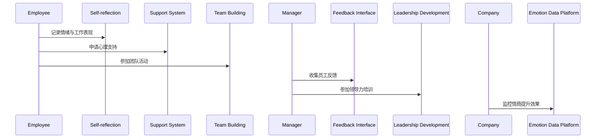
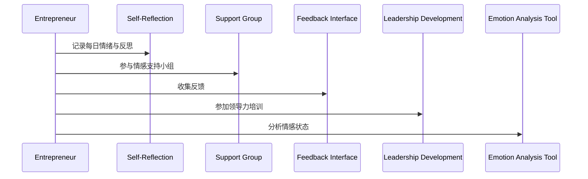
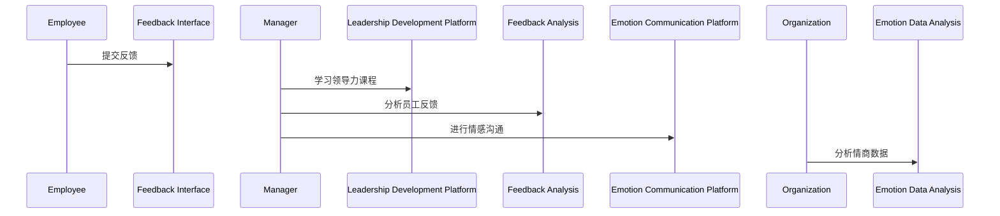

                 

### 情感智能时代概述

#### 第1章：情感智能时代来临

在现代社会中，情感智能（Emotional Intelligence，简称EQ）的重要性愈发凸显。随着科技的发展，尤其是人工智能（AI）的崛起，情感智能逐渐成为职场和生活中不可或缺的核心能力。本章将深入探讨情感智能的定义、重要性以及它如何影响我们的生活和工作。

##### 1.1 情感智能的定义与重要性

情感智能是指个体识别、理解、管理和利用情感信息的能力。它包括四个主要领域：自我意识、自我管理、社交意识和关系管理。情感智能不仅影响个人的心理健康和生活质量，更在职场中发挥关键作用。

在职场中，具备高情感智能的领导者能够更好地激励团队、解决冲突、提高员工满意度和工作效率。此外，情感智能在团队合作、客户服务、领导力发展和创新思维等方面都展现出显著的优势。

##### 1.2 情感智能与领导力的关系

情感智能与领导力密不可分。一个优秀的领导者不仅需要具备技术和管理能力，还需要具备高情商。情商领导力强调领导者通过自我意识和情绪管理，积极影响和引导团队成员，形成积极的工作氛围。

在情感智能时代，领导力不再仅仅是权力的象征，而是情感共鸣和共鸣共享的体现。领导者需要通过情感智能来建立信任、促进沟通和推动创新，从而在快速变化的环境中脱颖而出。

##### 1.3 情感智能时代的工作与生活变化

随着情感智能的兴起，工作和生活方式也发生了深刻变化。在职场中，越来越多的企业开始关注员工的情感需求，通过培训、活动和政策来提升员工的情感智能。例如，一些公司设立了情感教练或心理咨询师，帮助员工应对工作压力和情绪问题。

在生活中，情感智能的应用也越来越广泛。人们开始更加注重自我情感管理，学会如何在复杂的人际关系中保持和谐。此外，情感智能还促进了心理健康领域的进步，使更多人能够通过科学的手段提升自身的情感素质。

综上所述，情感智能时代已经来临。理解并提升情感智能，对于个人职业发展和组织竞争力的提升具有重要意义。在接下来的章节中，我们将进一步探讨情商领导力的核心概念和实践方法，帮助您在情感智能时代中脱颖而出。

#### 第2章：情商领导力的核心概念

在情感智能时代，情商领导力（Emotional Intelligence Leadership）成为了一种重要的领导能力。它不仅关乎领导者的个人素质，更影响着整个组织的运作效率和团队氛围。本章将详细介绍情商领导力的定义、特点及其核心要素，帮助读者深入理解这一关键概念。

##### 2.1 情商的定义与分类

情商，又称情感智力，是指个体识别、理解、管理和利用情感信息的能力。与传统智力（IQ）不同，情商更多关注情感领域的认知和操作。根据戈尔曼（Daniel Goleman）的研究，情商包括以下五个主要领域：

1. **自我意识（Self-awareness）**：个体能够准确感知自己的情绪、需求和触发情绪的事件。
2. **自我管理（Self-regulation）**：个体能够控制和调节情绪，避免情绪冲动，保持冷静和专注。
3. **社交意识（Social awareness）**：个体能够理解和识别他人的情绪、需求和观点。
4. **人际关系管理（Relationship management）**：个体能够建立和维护良好的人际关系，包括团队合作和冲突解决。
5. **动机（Motivation）**：个体能够激发内在动机，保持长期的目标追求和坚韧不拔。

这些领域的有机结合构成了情商的完整框架，帮助个体在复杂多变的环境中有效应对各种挑战。

##### 2.2 情商领导力的特点

情商领导力具有以下几个显著特点：

1. **情感共鸣（Emotional Resonance）**：领导者能够与团队成员建立情感上的共鸣，理解他们的需求和情感状态，从而形成更强的团队凝聚力。
2. **情感驱动（Emotionally Driven）**：情商领导者通过情感驱动来激励团队成员，激发他们的工作热情和创造力。
3. **情绪管理（Emotion Regulation）**：领导者具备良好的情绪管理能力，能够在压力和挑战面前保持冷静，有效应对各种情境。
4. **情感沟通（Emotional Communication）**：领导者能够通过情感沟通建立信任和合作关系，提高团队沟通效率。
5. **适应能力（Adaptability）**：情商领导者具备较强的适应能力，能够灵活应对变化和不确定性，引导团队走向成功。

##### 2.3 情商领导力的核心要素

情商领导力的核心要素包括以下几个方面：

1. **自我认知（Self-awareness）**：领导者需要深刻了解自己的情绪、需求和价值观，从而做出明智的决策。
2. **自我调节（Self-regulation）**：领导者需要学会控制情绪，避免因情绪波动而影响决策和行为。
3. **同理心（Empathy）**：领导者需要具备同理心，理解他人的情感和需求，从而建立信任和有效的沟通。
4. **团队建设（Team Building）**：领导者需要通过情商手段，培养团队协作精神和凝聚力，促进团队的高效运作。
5. **道德领导（Moral Leadership）**：领导者需要具备高尚的道德品质，以诚信和正直赢得员工的信任和尊重。

通过以上核心要素的提升，领导者不仅能够提升自身的情商水平，还能为组织创造积极的工作氛围和卓越的绩效。

总结而言，情商领导力是情感智能在领导实践中的具体体现。掌握和提升情商领导力，不仅有助于个人职业发展，更能推动组织走向成功。在接下来的章节中，我们将进一步探讨如何提升情商领导力，以及在团队管理和领导风格中如何应用情商领导力。

#### 第3章：提升情商领导力

在情感智能时代，提升情商领导力是每一位领导者的重要任务。这一章节将详细介绍如何通过自我认知与情绪管理、人际沟通与关系建立、以及实践策略来提升情商领导力，帮助读者在复杂多变的环境中脱颖而出。

##### 3.1 自我认识与情绪管理

自我认识和情绪管理是情商领导力的基础。自我认识意味着领导者需要深入了解自己的情感、动机和需求。情绪管理则是指领导者学会控制和调节自己的情绪，以保持冷静和专注。

**步骤一：自我反思**

自我反思是自我认识的开始。领导者可以通过日记、冥想或与导师交流等方式，定期反思自己的行为和情绪。通过反思，领导者可以识别出哪些情境会引发负面情绪，并找到应对方法。

**步骤二：情绪记录**

记录情绪是情绪管理的重要手段。领导者可以在日记中记录每天的情绪变化，分析情绪的触发点和持续时间。这有助于领导者更好地理解自己的情绪，并采取相应的调节措施。

**步骤三：情绪调节技巧**

领导者可以通过以下技巧来调节情绪：

1. **呼吸调节**：深呼吸可以帮助放松身体和心灵，缓解紧张和焦虑。
2. **认知重构**：改变对情境的认知，从负面角度转向积极角度，有助于减少情绪压力。
3. **积极心态**：培养积极心态，关注自己的成就和优点，有助于提升情绪稳定性。

##### 3.2 人际沟通与关系建立

人际沟通和关系建立是情商领导力的关键。领导者需要具备良好的沟通能力和建立和谐人际关系的能力，以促进团队合作和团队绩效。

**步骤一：有效沟通**

有效沟通包括以下几个方面：

1. **倾听**：倾听是沟通的基础，领导者需要认真倾听团队成员的意见和需求，了解他们的情感状态。
2. **清晰表达**：领导者需要清晰表达自己的意图和期望，避免误解和沟通障碍。
3. **反馈**：及时给予团队成员反馈，鼓励他们的努力和成就，同时指出改进的方向。

**步骤二：建立信任**

信任是人际关系的基础。领导者可以通过以下方式建立信任：

1. **透明度**：保持透明度，公开分享信息和决策过程，增强团队成员的信任感。
2. **诚信**：领导者需要诚信行事，言行一致，树立良好的榜样。
3. **支持**：在团队成员遇到困难时，领导者需要给予支持和帮助，增强团队凝聚力。

**步骤三：关系维护**

建立关系后，领导者需要持续维护和深化这种关系。可以通过以下方式：

1. **定期沟通**：定期与团队成员进行沟通，了解他们的工作进展和情感状态。
2. **情感关怀**：关注团队成员的情感需求，给予关怀和支持，帮助他们度过困难时期。
3. **庆祝成功**：在团队取得成就时，及时庆祝和表扬，增强团队的归属感和自豪感。

##### 3.3 情商领导力的实践策略

为了提升情商领导力，领导者可以采取以下实践策略：

**策略一：持续学习**

领导者需要持续学习，提升自身的情商水平和领导能力。可以通过参加培训课程、阅读相关书籍、与同行交流等方式来不断充实自己。

**策略二：角色扮演**

通过角色扮演，领导者可以模拟不同的领导场景，练习应对各种挑战和情境。这有助于提升领导者的实际操作能力和应变能力。

**策略三：反馈机制**

建立反馈机制，定期收集团队成员的反馈和建议，了解自己的领导风格和工作效果。这有助于领导者及时发现和改进自己的不足。

**策略四：团队建设活动**

定期组织团队建设活动，增强团队成员之间的互动和合作。这有助于提升团队的凝聚力和合作精神，促进情商领导力的提升。

通过自我认识与情绪管理、人际沟通与关系建立以及实践策略，领导者可以不断提升自己的情商领导力，在情感智能时代中脱颖而出。在接下来的章节中，我们将探讨情商领导力在团队管理中的应用，帮助领导者更好地发挥情商领导力的重要作用。

#### 第4章：情商领导力在团队管理中的应用

在团队管理中，情商领导力（Emotional Intelligence Leadership）发挥着至关重要的作用。通过运用情商领导力，领导者可以构建一个高效、和谐且富有创造力的团队。本章将深入探讨如何利用情商领导力建立高效的团队文化、提升团队成员的情商以及解决团队冲突。

##### 4.1 建立高效的团队文化

团队文化是团队成功的关键因素之一。一个积极的团队文化可以激发团队成员的潜力，提高团队的整体绩效。以下是构建高效团队文化的方法：

**步骤一：明确团队价值观**

团队价值观是团队文化的核心。领导者需要明确团队的价值观，并将其融入到日常工作中。可以通过团队讨论、共识建立等方式，确保所有团队成员对团队价值观有清晰的认识。

**步骤二：培养团队合作精神**

团队合作精神是高效团队文化的重要组成部分。领导者可以通过以下方式培养团队合作精神：

1. **分配角色和责任**：确保每个团队成员都清楚自己的角色和责任，鼓励团队成员相互支持和协作。
2. **团队建设活动**：定期组织团队建设活动，如团建游戏、团队竞赛等，增强团队成员之间的互动和信任。
3. **共同目标**：确保团队成员有共同的目标，鼓励他们在实现目标的过程中相互帮助。

**步骤三：奖励和认可**

领导者需要通过奖励和认可来鼓励团队成员的积极行为和贡献。可以通过颁发奖项、公开表扬等方式，让团队成员感受到自己的价值和成就。

##### 4.2 提升团队成员的情商

提升团队成员的情商是提升团队整体绩效的重要途径。以下是一些具体的方法：

**步骤一：提供情商培训**

领导者可以为团队成员提供情商培训，帮助他们了解情商的概念和重要性，掌握提升情商的方法和技巧。可以通过内部培训、外部课程或在线学习等方式进行。

**步骤二：鼓励自我反思**

自我反思是提升情商的重要步骤。领导者可以鼓励团队成员定期进行自我反思，识别自己的情绪和行为模式，并寻找改进的方法。

**步骤三：建立支持系统**

建立支持系统可以帮助团队成员在遇到情感挑战时得到帮助。领导者可以提供心理咨询服务、建立团队互助小组等方式，为团队成员提供情感支持。

##### 4.3 情商领导力在团队冲突解决中的运用

团队冲突是团队管理中的常见问题。情商领导力可以帮助领导者有效地解决团队冲突，维护团队的和谐与稳定。

**步骤一：识别冲突原因**

领导者需要首先识别冲突的原因。可以通过与团队成员沟通、观察团队行为等方式，了解冲突的根本原因。

**步骤二：同理心倾听**

在解决冲突时，领导者需要以同理心倾听双方的意见和感受。通过倾听，领导者可以更好地理解冲突双方的立场和情感，为解决冲突奠定基础。

**步骤三：情感调节**

领导者需要学会调节自己的情绪，避免在冲突中情绪失控。可以通过深呼吸、心理放松等方法来调节情绪，保持冷静和理智。

**步骤四：协商解决**

在了解冲突原因和双方立场后，领导者可以引导双方进行协商，寻找共同点和解决方案。可以通过讨论、妥协和合作等方式，达成双方都能接受的解决方案。

**步骤五：总结与反思**

在冲突解决后，领导者可以组织团队成员进行总结和反思，了解冲突处理的过程和效果，为未来的冲突解决提供参考。

通过建立高效的团队文化、提升团队成员的情商以及在团队冲突解决中运用情商领导力，领导者可以构建一个和谐、高效且富有创造力的团队。在接下来的章节中，我们将探讨情商领导力在领导风格中的体现，帮助领导者更好地发挥情商领导力的重要作用。

#### 第5章：情商领导力在领导风格中的体现

情商领导力在领导风格中扮演着至关重要的角色，它不仅决定了领导者的个人魅力和影响力，更直接影响团队的凝聚力和绩效。不同领导风格对情商有着不同的影响，而情商领导力则通过自我领导风格的认识、不同领导风格的情商影响以及情商领导力的领导艺术来提升领导效果。

##### 5.1 自我领导风格的认识

自我领导风格是指领导者如何自我管理、自我激励以及如何处理与他人的关系。领导者需要深入了解自己的领导风格，以便在实际情况中做出最佳决策。

**步骤一：自我评估**

领导者可以通过自我评估工具（如领导风格问卷、360度反馈等）来评估自己的领导风格。这有助于领导者了解自己在自我意识、自我管理、社交意识等方面的表现。

**步骤二：反馈与改进**

在自我评估的基础上，领导者可以收集来自团队成员和同行的反馈，了解自己的优点和不足。通过持续改进，领导者可以不断提升自己的情商和领导能力。

**步骤三：角色扮演**

通过角色扮演，领导者可以模拟不同情境下的领导行为，了解自己在不同领导风格下的表现。这有助于领导者更好地应对复杂多变的工作环境。

##### 5.2 不同领导风格对情商的影响

领导风格对情商有着重要的影响。不同的领导风格会带来不同的情商表现和团队效果。以下是几种常见的领导风格及其对情商的影响：

**1. �虎妈型领导**

虎妈型领导以严格和高标准著称，这种风格可能在短期内提高团队绩效，但长期来看可能会导致团队成员情绪压力增加，影响团队凝聚力和创新力。

**2. 友善型领导**

友善型领导注重团队成员的情感需求，鼓励团队成员表达自己的想法和感受。这种风格有助于建立信任和和谐的团队氛围，提高团队成员的情商和团队绩效。

**3. 变革型领导**

变革型领导通过激励和引导，推动团队成员实现个人和团队的转型。这种风格对情商要求较高，领导者需要具备强大的情感调节和同理心能力，以应对变革中的挑战。

**4. 交易型领导**

交易型领导侧重于通过奖惩机制来激励团队成员。这种风格在短期内可能有效，但长期来看可能会削弱团队成员的自主性和创造力。

##### 5.3 情商领导力的领导艺术

情商领导力要求领导者具备高超的领导艺术，通过自我领导风格的认识、不同领导风格的情商影响以及具体情境下的灵活运用，来提升领导效果。

**步骤一：情境适应**

领导者需要根据不同情境灵活调整自己的领导风格。在压力较大或冲突频繁的情境下，领导者需要更加注重情绪管理和同理心，以维护团队的稳定和和谐。

**步骤二：激励与赋能**

情商领导者通过激励和赋能来激发团队成员的潜力和创造力。领导者可以设定明确的目标和期望，同时给予团队成员足够的信任和支持，鼓励他们发挥自己的优势。

**步骤三：团队协作**

情商领导者注重团队协作和合作，通过建立信任、沟通和协作机制，提升团队的凝聚力和整体绩效。

**步骤四：情感共鸣**

情商领导者通过情感共鸣来建立与团队成员的情感联系，增强团队的归属感和忠诚度。领导者可以通过分享个人经历、关心团队成员的生活和工作，来建立深厚的情感基础。

通过自我领导风格的认识、不同领导风格的情商影响以及情商领导力的领导艺术，领导者可以在各种复杂情境中灵活应对，提升团队绩效和团队氛围。在接下来的章节中，我们将探讨情感智能时代的领导力挑战，帮助领导者应对新时代的挑战。

#### 第6章：情感智能时代的领导力挑战

在情感智能时代，领导者面临着一系列前所未有的挑战。这些挑战不仅涉及工作环境和组织结构的变化，还涉及跨文化领导以及情感智能与道德领导力之间的关系。本章将深入探讨这些挑战，并提出相应的应对策略。

##### 6.1 变化多端的工作环境

随着科技的快速发展，工作环境发生了巨大变化。远程工作、数字化办公、人工智能的广泛应用等，都对领导者的领导力提出了新的要求。

**挑战一：灵活办公与员工情感管理**

远程工作和数字化办公使得领导者无法直接观察和监督员工的工作状态，这对情感管理提出了挑战。领导者需要通过情感智能，了解员工的情感需求，提供必要的支持。

**应对策略：**

1. **建立沟通机制**：通过定期的线上会议和一对一沟通，了解员工的情感状态和工作进展。
2. **提供心理支持**：建立员工心理支持系统，如在线心理咨询、心理健康课程等，帮助员工应对工作压力。
3. **关注工作生活平衡**：鼓励员工合理安排工作与生活，避免过度工作，提高员工的生活质量。

**挑战二：快速变化的工作要求**

在快速变化的环境中，领导者需要具备敏捷的思维和灵活的应变能力。这对领导者的情感智能和决策能力提出了更高要求。

**应对策略：**

1. **持续学习与培训**：鼓励领导者不断学习新知识、新技能，提升自身的适应能力。
2. **团队协作与共享**：通过团队协作和知识共享，提高团队的整体应对能力。
3. **灵活的管理风格**：领导者应根据具体情况灵活调整管理风格，以适应快速变化的工作要求。

##### 6.2 跨文化领导

全球化背景下，跨文化领导成为领导者必须面对的重要挑战。不同文化背景的员工在工作中可能存在价值观、沟通方式和工作习惯的差异，这对领导者的情商和跨文化能力提出了挑战。

**挑战一：文化冲突与团队融合**

文化差异可能导致员工之间的冲突，影响团队的凝聚力和工作效率。领导者需要通过情感智能来理解和解决文化冲突。

**应对策略：**

1. **文化敏感度培训**：为领导者提供跨文化敏感度培训，帮助他们更好地理解和尊重不同文化背景的员工。
2. **建立共同价值观**：通过共同目标和价值观的建立，促进团队成员之间的融合。
3. **鼓励跨文化沟通**：通过跨文化沟通技巧的培训，提高团队成员之间的沟通效果。

**挑战二：领导风格的适应**

不同文化背景的员工可能对不同领导风格有不同的期望和接受程度。领导者需要根据不同文化背景调整自己的领导风格。

**应对策略：**

1. **多元化领导团队**：建立多元化领导团队，通过不同文化背景的领导者共同管理团队，促进文化的多元融合。
2. **灵活调整领导风格**：根据不同文化背景的员工特点和需求，灵活调整领导风格，提高领导效果。
3. **建立文化桥**：通过跨文化团队建设和活动，加强团队成员之间的了解和互动，建立文化桥梁。

##### 6.3 情感智能与道德领导力

在情感智能时代，道德领导力（Moral Leadership）与情感智能相辅相成。领导者不仅需要具备高情商，还需要具备高尚的道德品质，以赢得员工的信任和尊重。

**挑战一：道德困境与情感决策**

领导者可能在面临道德困境时产生情感冲突，如何做出道德决策成为一大挑战。

**应对策略：**

1. **道德教育**：通过道德教育和培训，提高领导者的道德意识和道德决策能力。
2. **透明决策**：在做出重要决策时，领导者应保持透明度，确保决策过程符合道德标准。
3. **员工参与**：在决策过程中，鼓励员工参与讨论和决策，增强决策的道德合法性。

**挑战二：情感领导与道德约束**

情感领导强调情感共鸣和激励，但过度的情感投入可能导致道德约束的缺失。领导者需要在情感领导与道德约束之间找到平衡。

**应对策略：**

1. **设立道德底线**：领导者应明确道德底线，确保领导行为不会越过道德界限。
2. **建立监督机制**：通过内部审计和外部监督，确保领导行为符合道德标准。
3. **培养道德文化**：在组织内部培养道德文化，使道德成为组织的核心价值观。

通过应对变化多端的工作环境、跨文化领导和情感智能与道德领导力的挑战，领导者可以不断提升自身的情商和领导能力，在情感智能时代中脱颖而出。在接下来的章节中，我们将探讨情商领导力的未来趋势，帮助读者了解这一领域的发展方向。

#### 第7章：情商领导力的未来趋势

随着科技和人工智能的快速发展，情商领导力（Emotional Intelligence Leadership）正迎来新的趋势。这些趋势不仅影响了领导者的个人素质和团队管理方式，还对未来社会的发展产生了深远的影响。本章将探讨情感智能技术的应用、情商领导力的教育与培训，以及情商领导力对社会的影响。

##### 7.1 情感智能技术的应用

情感智能技术正在各个领域得到广泛应用，从医疗保健到商业管理，从教育到客户服务，情感智能技术都在提高效率和优化体验方面发挥了重要作用。

**应用一：员工心理健康监测**

企业开始利用情感智能技术对员工的心理健康进行实时监测，通过分析员工的情绪数据，提供个性化的心理支持和干预措施。例如，一些公司使用AI算法分析员工的语音和文字交流，识别出可能的压力和情绪问题，从而采取相应的措施。

**应用二：客户情感分析**

在客户服务领域，情感智能技术被用于分析客户的反馈和交流，以便提供更加个性化的服务。通过语音识别和自然语言处理技术，企业可以了解客户的情感状态，优化服务流程，提高客户满意度。

**应用三：教育个性化**

在教育领域，情感智能技术被用于个性化学习体验的提供。通过分析学生的学习行为和情感状态，教育系统可以根据学生的需求调整教学策略，提高学习效果。

##### 7.2 情商领导力的教育与培训

随着情商领导力的重要性日益凸显，越来越多的组织和教育机构开始重视情商领导力的教育与培训。这不仅仅是为了提高个人的领导能力，更是为了培养具备全面素质的未来领导者。

**趋势一：情商领导力课程普及**

高校和企业纷纷开设情商领导力相关的课程和培训项目，这些课程通常包括自我认知、情感管理、人际沟通、团队建设等方面的内容，旨在提升领导者的综合素质。

**趋势二：在线教育与虚拟培训**

随着在线教育技术的发展，越来越多的情商领导力课程采用在线教育模式，提供了灵活的学习方式。此外，虚拟培训技术的应用使得领导者可以在虚拟环境中进行实践演练，提高实际操作能力。

**趋势三：定制化培训**

为了更好地满足不同组织和领导者的需求，情商领导力的教育与培训越来越倾向于定制化。通过一对一咨询、小组讨论和定制化培训方案，组织可以针对性地提升领导者的情商领导力。

##### 7.3 情商领导力对社会的影响

情商领导力不仅对个人和组织产生深远影响，也对整个社会产生了重要影响。它促进了社会的和谐发展，提升了整体的社会福祉。

**影响一：社会关系的改善**

情商领导力的推广和应用有助于改善人际关系和社会关系。通过提升个体的情感智力，人们能够更好地理解和尊重他人，减少冲突和误解，促进社会的和谐与稳定。

**影响二：工作环境的优化**

情商领导力在职场中的应用有助于营造积极、健康的工作环境。领导者通过情感智能，能够更好地激励员工、解决冲突、提高团队协作效率，从而提升整体的工作绩效。

**影响三：社会创新与进步**

情商领导力鼓励领导者关注社会问题和可持续发展，通过情感智能引导创新思维和解决方案。这种领导力风格有助于推动社会进步，实现长期的可持续发展目标。

综上所述，情商领导力的未来趋势体现了技术进步、教育普及和社会需求的深度融合。通过情感智能技术的应用、情商领导力的教育与培训，以及其对社会的积极影响，情商领导力将在未来继续发挥重要作用，助力个人、组织和整个社会的持续发展。

#### 第8章：情商领导力的实践案例分析

在探讨情商领导力的实际应用时，通过具体案例可以更直观地了解其如何在不同组织和情境中发挥作用。本章将分析三个不同领域的实践案例，探讨情商领导力在实际操作中的成效和经验。

##### 8.1 案例一：公司A的情商领导力实践

**背景介绍**：

公司A是一家快速发展的科技公司，在市场竞争日益激烈的背景下，公司决定通过提升情商领导力来增强团队凝聚力和创新能力。

**项目介绍**：

公司A实施了多项情商领导力培训项目，包括：

- **情商工作坊**：定期举办情商工作坊，提高员工的自我认知、情绪管理和人际沟通能力。
- **360度反馈**：采用360度反馈机制，收集员工和管理者的反馈，识别情商提升的需求。
- **领导力发展计划**：为中层管理人员提供定制化的领导力发展计划，侧重于情商领导力的培养。

**系统功能设计**：

- **自我反思平台**：员工可以使用平台记录和反思自己的情绪和工作表现，以便自我提升。
- **情感支持系统**：公司建立了心理咨询服务，为员工提供情感支持，缓解工作压力。
- **团队建设活动**：定期组织团队建设活动，增强团队成员之间的信任和协作。

**系统架构设计**：

- **情商数据分析平台**：通过数据分析，公司可以监控情商提升的效果，调整培训策略。
- **互动学习系统**：利用互动学习系统，员工可以在工作间隙学习情商相关知识和技能。

**系统接口设计**：

- **员工反馈接口**：员工可以通过反馈接口提交自己的意见和反馈，公司可以及时回应。
- **领导力评估接口**：领导力评估接口用于评估管理人员的情商领导力水平，制定提升计划。

**系统交互mermaid序列图**：

**实际案例分析和详细讲解剖析**：

通过实施情商领导力培训，公司A的员工满意度显著提高，团队协作效率增强，创新成果显著增加。具体表现在：

- 员工情绪管理能力提升，工作压力减轻，工作效率提高。
- 团队成员之间沟通更加顺畅，冲突减少，团队凝聚力增强。
- 领导风格更加民主和包容，员工积极性提高，离职率降低。

**项目小结**：

公司A的情商领导力实践证明了其在提升团队绩效和员工满意度方面的有效性。通过系统的情商培训和反馈机制，公司成功地构建了一个积极、健康的工作环境，为企业的持续发展奠定了坚实基础。

##### 8.2 案例二：企业家B的情商领导力经验

**背景介绍**：

企业家B是一位成功的企业家，他在创业初期便意识到情商领导力的重要性，并将其融入自己的管理哲学中。

**项目介绍**：

企业家B采取了以下措施来提升自身的情商领导力：

- **自我认知**：通过定期冥想和反思，深入了解自己的情绪和需求。
- **情感管理**：学习情绪调节技巧，如深呼吸和认知重构，以保持冷静和专注。
- **人际沟通**：通过倾听和反馈，提升与员工和合作伙伴的沟通效果。
- **团队建设**：定期组织团队活动，增进团队成员之间的信任和合作。

**系统功能设计**：

- **个人反思日志**：企业家B每天记录自己的情绪和反思，以便持续自我提升。
- **情感支持小组**：与同行企业家组成情感支持小组，分享经验和挑战，互相支持。

**系统架构设计**：

- **领导力发展计划**：为企业家B定制个性化的领导力发展计划，涵盖情商领导力的各个方面。
- **情感分析工具**：使用情感分析工具，分析企业家的演讲和书面交流，评估其情商水平。

**系统接口设计**：

- **反馈收集接口**：企业家B定期收集员工和合作伙伴的反馈，以便调整管理策略。
- **情感监控接口**：通过情感监控接口，企业家B可以了解自身的情感状态，及时进行调整。

**系统交互mermaid序列图**：

**实际案例分析和详细讲解剖析**：

企业家B通过持续的自我认知和情感管理，不仅提升了自己的情商，也成功地影响了整个团队。其情商领导力实践的关键在于：

- **自我认知**：通过自我反思，企业家B能够更好地理解自己的情绪和行为，从而做出更明智的决策。
- **情感管理**：情绪调节技巧帮助企业家B在压力和挑战面前保持冷静和专注，提高决策质量。
- **人际沟通**：倾听和反馈使企业家B能够与团队成员建立深厚的信任关系，提高团队的协作效率。

**项目小结**：

企业家B的情商领导力实践展示了其在个人成长和团队领导中的巨大潜力。通过持续的自我提升和情感管理，企业家B不仅提升了自身的领导力，也为团队创造了积极的工作氛围，推动了企业的持续发展。

##### 8.3 案例三：组织C的情商领导力转型

**背景介绍**：

组织C是一家传统的制造企业，面临着激烈的市场竞争和劳动力结构的变化。为了适应新时代的需求，组织C决定进行情商领导力的转型。

**项目介绍**：

组织C采取了以下措施来实现情商领导力转型：

- **领导力培训**：为中层管理人员提供情商领导力培训，提升其情感管理和团队建设能力。
- **员工反馈机制**：建立员工反馈机制，定期收集员工对领导风格和工作环境的反馈。
- **文化变革**：通过文化变革活动，推动组织内部形成积极、健康的情感文化。

**系统功能设计**：

- **领导力发展平台**：提供在线领导力发展课程和互动学习工具，支持员工的自我提升。
- **员工满意度调查**：定期进行员工满意度调查，了解员工的情感状态和工作体验。

**系统架构设计**：

- **情商数据分析系统**：通过数据分析，评估情商领导力培训的效果，调整培训策略。
- **情感沟通平台**：建立内部情感沟通平台，促进员工和管理者之间的互动和沟通。

**系统接口设计**：

- **反馈提交接口**：员工可以通过接口提交对领导风格和工作环境的反馈。
- **领导力评估接口**：管理人员可以使用接口评估下属的情商水平，制定个性化的提升计划。

**系统交互mermaid序列图**：

**实际案例分析和详细讲解剖析**：

通过实施情商领导力转型，组织C取得了显著成效：

- **员工满意度提高**：员工反馈机制和情感沟通平台提高了员工对工作环境的满意度，增强了员工的归属感和忠诚度。
- **领导力提升**：中层管理人员的情商领导力培训使其能够更好地激励和引导员工，提高了团队的整体绩效。
- **企业文化变革**：通过文化变革活动，组织内部形成了积极、健康的情感文化，推动了组织的可持续发展。

**项目小结**：

组织C的情商领导力转型案例展示了情商领导力在提升员工满意度、提高领导力和推动企业文化变革方面的巨大潜力。通过系统的培训和反馈机制，组织C成功地实现了从传统管理向情感智能管理的转型，为企业的持续发展奠定了坚实基础。

### 第9章：情商领导力的实践指南

在情感智能时代，提升情商领导力不仅是个人发展的需求，也是组织成功的关键。本章将提供详细的实践指南，帮助读者评估情商领导力水平、制定个人提升计划，以及创建高情商团队。

##### 9.1 实践指南一：如何评估情商领导力水平

**步骤一：自我评估**

- **工具与方法**：使用情商自我评估工具，如戈尔曼（Daniel Goleman）的情商评估问卷，了解自己在自我意识、自我管理、社交意识和人际关系管理等方面的表现。
- **注意事项**：自我评估时，要诚实地面对自己的优点和不足，避免过度自我批评。

**步骤二：360度反馈**

- **工具与方法**：收集来自同事、下属和上级的反馈，了解他们在情感智能方面的评价。这可以通过360度反馈机制进行。
- **注意事项**：在收集反馈时，要确保反馈的全面性和客观性，同时尊重他人的意见。

**步骤三：综合评估**

- **工具与方法**：将自我评估和360度反馈相结合，进行综合评估，识别出需要改进的方面。
- **注意事项**：在综合评估时，要关注情商领导力的整体表现，不仅仅是单个领域的提升。

##### 9.2 实践指南二：如何制定个人情商提升计划

**步骤一：确定目标**

- **目标设定**：根据自我评估和反馈，明确提升情商的具体目标，如提升自我意识、改善情绪管理技巧等。
- **注意事项**：目标要具体、可衡量，同时确保其符合个人职业发展需求。

**步骤二：制定行动计划**

- **行动计划**：制定详细的行动计划，包括具体的提升策略、时间表和执行步骤。
- **注意事项**：行动计划要切实可行，避免过于理想化，同时要定期检查和调整。

**步骤三：持续学习**

- **学习资源**：利用在线课程、书籍、研讨会等资源，持续学习情商领导力相关知识。
- **注意事项**：在学习过程中，要保持开放心态，勇于尝试新的方法和技巧。

**步骤四：实践与反馈**

- **实践应用**：将所学知识应用到实际工作中，通过实践来检验和提升情商领导力。
- **反馈与调整**：定期收集反馈，了解提升效果，并根据反馈进行调整。

##### 9.3 实践指南三：如何创建高情商团队

**步骤一：培养团队文化**

- **文化塑造**：通过团队建设活动和价值观的传播，塑造积极、健康的团队文化。
- **注意事项**：团队文化的塑造需要时间和持续的努力，领导者要发挥关键作用。

**步骤二：提升团队情商**

- **情商培训**：为团队成员提供情商领导力培训，提升其情感智力。
- **注意事项**：培训要结合团队成员的具体需求，确保培训内容的实用性和有效性。

**步骤三：建立沟通机制**

- **沟通平台**：建立有效的沟通机制，确保团队成员之间的信息流畅和透明。
- **注意事项**：沟通平台不仅要涵盖工作内容，还要关注团队成员的情感需求。

**步骤四：激励与认可**

- **激励措施**：通过奖励和认可，激励团队成员的积极行为和贡献。
- **注意事项**：激励措施要公平、公正，确保每个团队成员都能感受到自己的价值和成就。

**步骤五：持续监督与改进**

- **监督机制**：建立监督机制，定期检查团队情商提升的效果，发现和解决问题。
- **改进措施**：根据监督结果，持续改进团队的管理和运营，提升团队的整体情商水平。

通过以上实践指南，领导者可以系统地提升个人和团队的情商领导力，为组织创造积极、高效的工作环境。在情感智能时代，具备高情商的领导者将成为推动组织成功的关键力量。

### 第10章：总结与展望

在本篇文章中，我们深入探讨了情商领导力在情感智能时代的重要性及其在个人职业发展和组织成功中的关键作用。通过详细的分析和案例分析，我们揭示了情商领导力的核心概念、实践策略以及其在团队管理和领导风格中的具体应用。

#### 情商领导力的核心要点

首先，情商领导力不仅仅是一种个人素质，更是一种组织能力。它要求领导者具备自我意识、自我管理、社交意识和人际关系管理等方面的能力。通过提升情商，领导者能够更有效地激励团队、解决冲突、提高员工满意度和工作效率。

#### 情商领导力的发展前景

随着科技的发展和全球化进程的加速，情商领导力在未来将继续发挥重要作用。情感智能技术将使情商领导力的应用更加广泛和深入，从员工心理健康监测到客户情感分析，再到教育个性化，都将因情商领导力的提升而变得更加高效和人性化。

#### 读者建议与互动

对于读者，我们建议：

1. **自我反思**：定期进行自我反思，了解自己的情绪和领导风格，识别需要提升的方面。
2. **持续学习**：利用在线课程、书籍和研讨会等资源，不断提升自己的情商领导力。
3. **实践应用**：将所学知识应用到实际工作中，通过实践来检验和提升情商领导力。
4. **分享经验**：在职业发展中，与同行交流经验，分享心得，共同进步。

让我们共同努力，在情感智能时代中不断提升情商领导力，为个人和组织创造更加美好的未来。您的每一次反思和实践，都是这一伟大旅程中的一步。期待听到您的故事和见解，让我们一起在情商领导力的道路上不断前行。作者：AI天才研究院/AI Genius Institute & 禅与计算机程序设计艺术 /Zen And The Art of Computer Programming。

