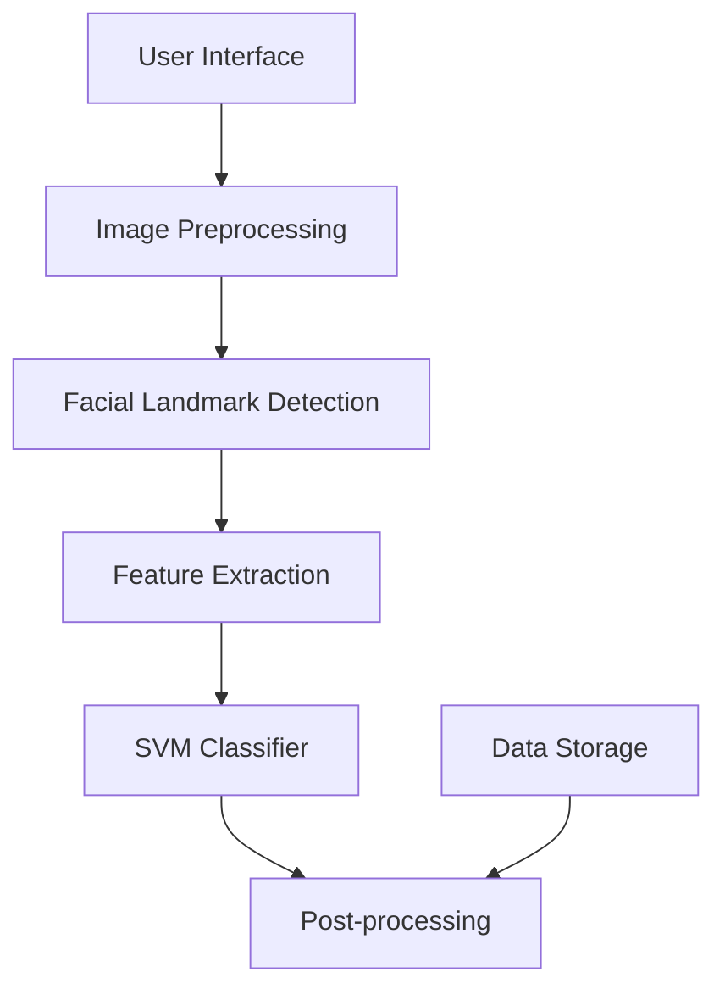
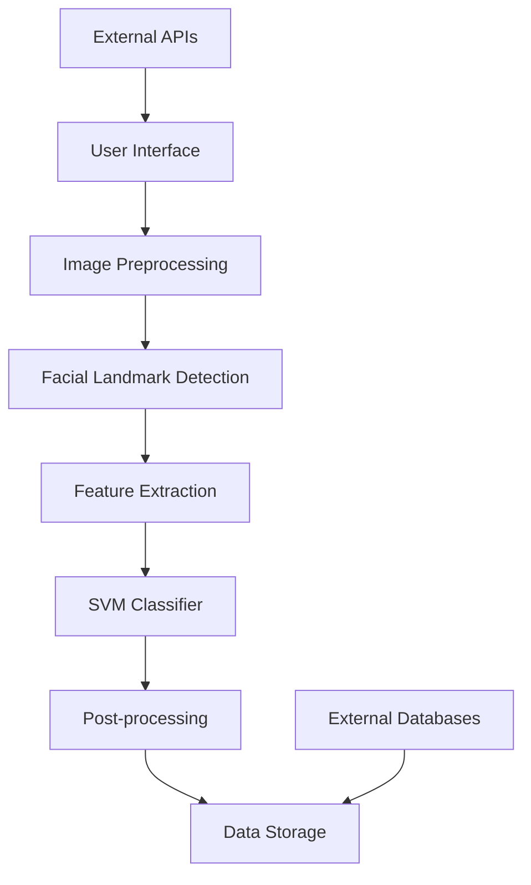

                 


### Introduction to Emotional Computing and Support Vector Machines: Facial Expression Recognition

#### Keywords:
- Emotional Computing
- Support Vector Machines (SVM)
- Facial Expression Recognition
- Machine Learning
- Artificial Intelligence

#### Abstract:
This article delves into the intersection of emotional computing, support vector machines (SVM), and facial expression recognition. It introduces the fundamental concepts and principles of emotional computing and SVM, and explains how SVM can be utilized for facial expression recognition. The article provides a detailed analysis of the algorithm design and implementation, system architecture, and practical application scenarios. By the end, readers will have a comprehensive understanding of how to leverage SVM for facial expression recognition in the field of emotional computing.

## Table of Contents

1. **Introduction to Emotional Computing and Support Vector Machines**  
   1.1 What is Emotional Computing  
   1.2 Importance of Emotional Computing  
   1.3 Brief History and Development  
   1.4 Basic Concepts and Terminology

2. **Basic Concepts and Principles**  
   2.1 Emotional Computing  
   2.2 Support Vector Machines (SVM)  
   2.3 Facial Expression Recognition

3. **Algorithm Design and Implementation**  
   3.1 SVM Algorithm Design  
   3.2 Mathematical Model and Formulation  
   3.3 Example Explanations

4. **System Analysis and Design**  
   4.1 Project Introduction  
   4.2 System Function Design  
   4.3 System Architecture  
   4.4 System Interface Design

5. **Project Practice**  
   5.1 Environment Setup  
   5.2 Core Implementation  
   5.3 Case Analysis  
   5.4 Project Summary

## Introduction to Emotional Computing and Support Vector Machines

### 1.1 What is Emotional Computing

Emotional computing, also known as affective computing, is a field of study within artificial intelligence that focuses on the design and development of systems capable of recognizing, interpreting, and simulating human emotions. The goal of emotional computing is to create machines that can understand and respond to human emotions in a more natural and intuitive way, thus enhancing human-computer interaction.

#### 1.2 Importance of Emotional Computing

Emotional computing has gained significant importance in recent years due to its potential applications in various fields, such as human-computer interaction, healthcare, education, and customer service. Here are some key reasons why emotional computing is important:

- **Improved Human-Computer Interaction**: By understanding and responding to human emotions, emotional computing can enhance the user experience and make interactions more natural and intuitive.

- **Healthcare Applications**: Emotional computing can be used to monitor patients' emotional states, helping doctors and caregivers to identify and address potential mental health issues.

- **Educational Applications**: Emotional computing can help educators to better understand students' emotional needs, enabling personalized learning experiences and improved educational outcomes.

- **Customer Service**: Emotional computing can be used to improve customer service by understanding and addressing customers' emotional needs, leading to higher customer satisfaction and loyalty.

### 1.3 Brief History and Development

The concept of emotional computing dates back to the early days of artificial intelligence research in the 1960s. However, significant progress in the field has been made in recent years, driven by advances in machine learning, computer vision, and natural language processing.

- **1980s**: The first emotional dialogue systems were developed, paving the way for more advanced human-like interactions with machines.

- **1990s-2000s**: The rise of machine learning algorithms, particularly support vector machines (SVM), enabled more accurate emotion recognition and improved the performance of emotional computing systems.

- **2010s-Present**: With the advent of deep learning and neural networks, emotional computing has made significant advancements, particularly in the areas of facial expression recognition and sentiment analysis.

#### 1.4 Basic Concepts and Terminology

To better understand emotional computing, it's important to familiarize yourself with some basic concepts and terminology:

- **Affect**: Affect refers to the emotional state or mood experienced by an individual. It can be positive (e.g., happiness, excitement) or negative (e.g., sadness, anger).

- **Emotion Recognition**: Emotion recognition is the process of identifying and classifying an individual's emotional state based on their facial expressions, vocal tone, and other behavioral cues.

- **Sentiment Analysis**: Sentiment analysis is a type of emotion recognition that focuses on classifying the sentiment expressed in text, such as social media posts, reviews, and customer feedback.

- **Support Vector Machines (SVM)**: SVM is a supervised machine learning algorithm commonly used for classification tasks, including emotion recognition.

- **Facial Expression Recognition**: Facial expression recognition is the process of identifying and classifying an individual's facial expressions, typically using computer vision techniques.

## Conclusion

In this introduction, we have covered the basic concepts and principles of emotional computing and support vector machines (SVM). We have discussed the importance of emotional computing and its applications in various fields. Additionally, we have provided a brief history of the field and familiarized ourselves with some key terminology.

In the following sections, we will delve deeper into the details of emotional computing, SVM, and facial expression recognition. We will explore the algorithm design and implementation, system analysis and design, and practical application scenarios to gain a comprehensive understanding of how SVM can be used for facial expression recognition in the field of emotional computing.

### Basic Concepts and Principles

#### 2.1 Emotional Computing

Emotional computing, as mentioned in the introduction, is the study and development of systems capable of recognizing, interpreting, and simulating human emotions. It encompasses a wide range of techniques and technologies, including machine learning, computer vision, natural language processing, and signal processing.

##### Key Concepts and Terminology

- **Affect Detection**: Affect detection is the process of identifying and classifying the emotional states of individuals based on their behavioral and physiological signals, such as facial expressions, speech, and physiological responses.

- **Emotion Classification**: Emotion classification is the task of categorizing emotions into predefined categories, such as happiness, sadness, anger, and surprise.

- **Sentiment Analysis**: Sentiment analysis, also known as opinion mining, is the process of determining the sentiment or emotional tone behind a body of text, such as a social media post or customer review.

- **Emotion Recognition**: Emotion recognition is a subset of affect detection that focuses on identifying and categorizing emotional states from facial expressions, vocal tone, and other behavioral cues.

##### Applications of Emotional Computing

Emotional computing has found applications in various fields, including:

- **Human-Computer Interaction**: By understanding and responding to users' emotions, systems can provide more personalized and intuitive interactions.

- **Healthcare**: Emotional computing can be used to monitor patients' emotional states, detect mental health issues, and provide personalized treatment.

- **Customer Service**: Understanding customers' emotions can improve customer service by addressing their needs and concerns more effectively.

- **Education**: Emotional computing can help educators understand students' emotional needs and provide personalized learning experiences.

- **Marketing**: Sentiment analysis can be used to analyze customers' opinions about products and services, helping companies make informed decisions about marketing strategies.

#### 2.2 Support Vector Machines (SVM)

Support Vector Machines (SVM) is a powerful supervised machine learning algorithm used for classification tasks. It aims to find the optimal hyperplane that separates data points of different classes in a high-dimensional space.

##### Key Concepts and Terminology

- **Hyperplane**: A hyperplane is a decision boundary that separates data points of different classes in a high-dimensional space.

- **Support Vectors**: Support vectors are the data points that are closest to the hyperplane and help define its position.

- **Marginal Hyperplane**: The marginal hyperplane is the hyperplane that maximizes the margin, which is the distance between the hyperplane and the nearest data points of each class.

- **Kernel Trick**: The kernel trick is a technique used to extend SVM to non-linear classification by mapping the input data into a higher-dimensional space.

##### Applications of SVM

SVM has been widely used in various applications, including:

- **Image Classification**: SVM can be used to classify images based on their features, such as edges, textures, and shapes.

- **Text Classification**: SVM is often used for text classification tasks, such as spam detection, sentiment analysis, and document categorization.

- **Bioinformatics**: SVM is used in bioinformatics for gene expression analysis, protein structure prediction, and disease diagnosis.

- **Object Recognition**: SVM is used in object recognition tasks, such as face detection, pedestrian detection, and vehicle detection.

#### 2.3 Facial Expression Recognition

Facial expression recognition is a key component of emotional computing. It involves identifying and classifying facial expressions, typically using computer vision techniques.

##### Key Concepts and Terminology

- **Facial Landmarks**: Facial landmarks are specific points on the face, such as the corners of the eyes, mouth, and nose, that can be used to locate and track facial features.

- **Facial Action Units (AUs)**: Facial Action Units (AUs) are the smallest units of facial muscle movement that contribute to facial expressions.

- **Emotion Lexicon**: An emotion lexicon is a set of emotional terms and their associated features, used to label and categorize facial expressions.

##### Applications of Facial Expression Recognition

Facial expression recognition has various applications, including:

- **Human-Computer Interaction**: By recognizing users' facial expressions, systems can provide more personalized and adaptive interactions.

- **Emotion Analysis**: Facial expression recognition can be used to analyze and understand users' emotional states, helping to improve user experience and design.

- **Psychological Research**: Facial expression recognition can be used in psychological research to study emotional responses and cognitive processes.

- **Healthcare**: Facial expression recognition can be used to monitor patients' emotional states and detect signs of distress, helping healthcare professionals provide better care.

In the next section, we will explore the algorithm design and implementation of emotional computing using support vector machines (SVM) for facial expression recognition.

### Algorithm Design and Implementation

#### 3.1 SVM Algorithm Design

Support Vector Machines (SVM) is a widely used machine learning algorithm for classification tasks. In the context of facial expression recognition, SVM can be utilized to classify facial expressions into different categories based on the extracted features from facial images. The following steps outline the design of the SVM algorithm for facial expression recognition:

1. **Feature Extraction**: The first step is to extract relevant features from the facial images. Common features used in facial expression recognition include facial landmarks, facial action units (AUs), and texture features. Techniques such as facial landmark detection and feature extraction algorithms like Local Binary Patterns (LBP) can be used to obtain these features.

2. **Data Preprocessing**: Preprocessing the feature data is essential to ensure the quality and consistency of the input data. This includes normalization, noise removal, and dimensionality reduction. Normalization is performed to scale the feature values to a uniform range, while noise removal helps to eliminate any noise or outliers in the data. Dimensionality reduction techniques, such as Principal Component Analysis (PCA), can be applied to reduce the number of features while retaining the essential information.

3. **SVM Model Training**: Once the feature data is preprocessed, the next step is to train the SVM model. SVM is a supervised learning algorithm, which means it requires labeled data to learn the mapping between the input features and the corresponding facial expression categories. The training process involves finding the optimal hyperplane that separates the data points of different classes. The SVM model is trained using the training data, and the parameters such as the kernel type and the regularization parameter are tuned to achieve the best performance.

4. **Model Evaluation**: After the SVM model is trained, it needs to be evaluated using a separate validation set to assess its performance. Common evaluation metrics for classification tasks include accuracy, precision, recall, and F1-score. These metrics provide insights into the model's performance and help identify areas for improvement.

5. **Model Deployment**: Once the SVM model is trained and evaluated, it can be deployed in real-world applications for facial expression recognition. The model can be integrated into software applications or systems that require real-time or batch processing of facial images to classify facial expressions.

#### 3.2 Mathematical Model and Formulation

The mathematical formulation of the SVM algorithm can be expressed as follows:

Given a set of N training examples \{x_1, x_2, ..., x_N\}, where each example x_i is represented by a feature vector x_i in R^d and has a corresponding label y_i (-1 or +1), the goal of SVM is to find the optimal hyperplane that separates the data points of different classes.

The optimal hyperplane can be represented as:

w^* * x + b = 0

where w^* is the weight vector orthogonal to the hyperplane, x is the feature vector, and b is the bias term.

The margin is defined as the distance between the hyperplane and the nearest data points of each class, known as the support vectors. The objective of SVM is to maximize the margin, subject to the constraint that the data points are classified correctly.

The optimization problem can be formulated as:

min_w, b ||w||^2 s.t. y_i (w^T * x_i + b) >= 1, i = 1, 2, ..., N

where ||w||^2 is the squared norm of the weight vector w.

To solve this optimization problem, various algorithms can be used, including the Sequential Minimal Optimization (SMO) algorithm and the Quadratic Programming (QP) method.

#### 3.3 Example Explanations

Let's consider a simple example to illustrate the SVM algorithm for facial expression recognition.

Suppose we have a dataset of facial images labeled with two classes: happy and sad. The feature vectors extracted from these images are represented by the coordinates (x, y) in a two-dimensional space.

```
Class    Examples
Happy    (1, 1), (1, 2), (1, 3)
Sad      (-1, -1), (-1, -2), (-1, -3)
```

The goal is to find the optimal hyperplane that separates these two classes. The SVM algorithm will maximize the margin by finding the weight vector w and the bias term b that satisfy the constraints:

y_i (w^T * x_i + b) >= 1, i = 1, 2, ..., N

For this example, the optimal hyperplane can be represented as:

w^T * x + b = 0

w^T * x + b = x + b = 0

The optimal hyperplane is x = -b. Since the data points lie on the line x = 0, the optimal hyperplane is also x = 0. This means that the optimal hyperplane is a vertical line passing through the origin.

The support vectors are the points (1, 1), (1, 2), (1, 3) for the happy class and (-1, -1), (-1, -2), (-1, -3) for the sad class. These points are the closest to the hyperplane and help define its position.

In conclusion, the SVM algorithm is a powerful tool for facial expression recognition. By designing and implementing the SVM algorithm, we can classify facial expressions into different categories based on the extracted features. The mathematical formulation of SVM provides a solid foundation for understanding the algorithm's inner workings, and examples help illustrate its application in facial expression recognition.

### System Analysis and Design

#### 4.1 Project Introduction

Facial expression recognition is a crucial component in the field of emotional computing. By accurately recognizing and classifying facial expressions, systems can gain insights into users' emotional states, leading to improved user experience and better decision-making. This project aims to develop a facial expression recognition system using Support Vector Machines (SVM) for emotion detection.

The main goal of this project is to create a robust and accurate facial expression recognition system that can be applied in various domains, such as human-computer interaction, healthcare, and customer service. The system will be designed to handle real-time processing and provide reliable results in diverse scenarios.

#### 4.2 System Function Design

The system consists of several key functions, each playing a vital role in the overall process of facial expression recognition:

1. **Image Preprocessing**: This function is responsible for preprocessing the input facial images to remove noise, normalize the size, and enhance the quality of the images. Preprocessing is crucial to ensure the quality and consistency of the input data, which directly impacts the performance of the facial expression recognition system.

2. **Facial Landmark Detection**: This function detects the facial landmarks, such as the corners of the eyes, mouth, and nose, in the preprocessed images. Facial landmarks are essential for extracting the spatial features required for facial expression recognition.

3. **Feature Extraction**: This function extracts relevant features from the facial landmarks, such as facial action units (AUs), geometric features, and texture features. These features are used as input for the SVM classifier.

4. **SVM Classifier**: The SVM classifier is the core component of the system that classifies the facial expressions based on the extracted features. The SVM classifier is trained using a labeled dataset of facial expressions to learn the mapping between the features and the corresponding expression categories.

5. **Post-processing**: This function is responsible for post-processing the classification results, such as thresholding, merging, and normalization. The post-processing step ensures that the output is in a suitable format for further analysis or integration with other systems.

#### 4.3 System Architecture Design

The system architecture is designed to be modular and scalable, allowing for easy integration with other components and systems. The following diagram illustrates the overall system architecture:



The system architecture consists of the following main components:

1. **Image Preprocessing**: This component takes the input facial images and performs preprocessing steps such as noise removal, normalization, and image enhancement. The preprocessed images are then passed to the Facial Landmark Detection component.

2. **Facial Landmark Detection**: This component uses facial landmark detection algorithms to identify the key points on the facial images. The detected landmarks are used as input for the Feature Extraction component.

3. **Feature Extraction**: This component extracts relevant features from the facial landmarks, such as AUs, geometric features, and texture features. These features are passed to the SVM Classifier for classification.

4. **SVM Classifier**: This component is the core of the system, responsible for training and classifying the facial expressions based on the extracted features. The trained SVM model is used for real-time classification of new facial images.

5. **Post-processing**: This component processes the classification results to ensure they are in a suitable format for further analysis or integration with other systems. The processed results are stored in the Data Storage component.

6. **User Interface**: This component provides a user-friendly interface for users to interact with the system, submit facial images, and view the classification results.

7. **Data Storage**: This component stores the preprocessed images, detected landmarks, extracted features, and classification results for future analysis and retrieval.

#### 4.4 System Interface Design

The system interfaces with various external components and systems to facilitate the overall process of facial expression recognition. The following diagram illustrates the system interfaces and interactions:



The system interfaces include:

1. **User Interface**: This interface allows users to submit facial images for recognition and view the classification results. It can be integrated with external APIs for authentication and access control.

2. **Image Preprocessing**: This interface is responsible for preprocessing the input facial images before passing them to the Facial Landmark Detection component. It can be integrated with external image processing libraries or APIs for enhanced functionality.

3. **Facial Landmark Detection**: This interface detects the facial landmarks in the preprocessed images and passes the detected landmarks to the Feature Extraction component. It can be integrated with existing facial landmark detection libraries or APIs.

4. **Feature Extraction**: This interface extracts relevant features from the detected facial landmarks and passes them to the SVM Classifier for classification. It can be integrated with external feature extraction libraries or APIs.

5. **SVM Classifier**: This interface trains and classifies the facial expressions based on the extracted features. It can be integrated with existing SVM libraries or frameworks for enhanced functionality.

6. **Post-processing**: This interface processes the classification results to ensure they are in a suitable format for further analysis or integration with other systems. It can be integrated with external libraries or APIs for enhanced post-processing capabilities.

7. **Data Storage**: This interface stores the preprocessed images, detected landmarks, extracted features, and classification results in the Data Storage component. It can be integrated with external databases or data storage systems for enhanced storage capabilities.

By designing a modular and scalable system architecture and defining clear interfaces for system components and external components, this project aims to create a robust and accurate facial expression recognition system that can be easily integrated and extended to meet various application requirements.

### Project Practice

#### 5.1 Environment Setup

To implement the facial expression recognition system using Support Vector Machines (SVM), we need to set up the development environment. The following steps outline the process to set up the required software and libraries:

1. **Install Python**: Ensure that Python 3.x is installed on your system. Python is a versatile programming language widely used in machine learning and data science. You can download the latest version of Python from the official website: <https://www.python.org/downloads/>

2. **Install Required Libraries**: Install the necessary libraries and frameworks for facial expression recognition and SVM. The key libraries include OpenCV, scikit-learn, NumPy, and matplotlib. You can install these libraries using pip, the Python package manager. The following command will install the required libraries:

```
pip install opencv-python scikit-learn numpy matplotlib
```

3. **Install Additional Libraries**: Depending on your specific requirements, you may need to install additional libraries or frameworks. For example, if you want to use deep learning models for facial landmark detection, you can install TensorFlow or PyTorch:

```
pip install tensorflow
```

or

```
pip install torch torchvision
```

4. **Verify Installation**: After installing the required libraries, verify the installation by running a simple script that imports the libraries:

```python
import cv2
import numpy as np
import matplotlib.pyplot as plt
from sklearn import svm
```

If the script runs without any errors, the libraries are successfully installed.

By following these steps, you will have a fully functional development environment for implementing the facial expression recognition system using Support Vector Machines (SVM).

#### 5.2 Core Implementation

In this section, we will dive into the core implementation of the facial expression recognition system using Support Vector Machines (SVM). The following code snippets and explanations provide a detailed walkthrough of each component:

**Step 1: Facial Landmark Detection**

Facial landmark detection is a crucial step in facial expression recognition. It involves identifying the key points on a facial image, such as the corners of the eyes, mouth, and nose. We will use a pre-trained deep learning model called the OpenCV DNN module to perform facial landmark detection. Here's the code:

```python
import cv2

def detect_landmarks(image):
    # Load the pre-trained model
    model = cv2.dnn.readNetFromCaffe('deploy.prototxt.txt', 'res10_300x300_ssd_iter_140000.caffemodel')

    # Preprocess the image
    blob = cv2.dnn.blobFromImage(image, 1.0, (300, 300), [104, 117, 123], False, False)

    # Run the model to detect landmarks
    model.setInput(blob)
    landmarks = model.forward()

    # Extract the landmark coordinates
    landmarks = landmarks.reshape(-1, 2)
    return landmarks

# Load the facial image
image = cv2.imread('face.jpg')

# Detect the facial landmarks
landmarks = detect_landmarks(image)

# Display the landmark coordinates
print(landmarks)
```

**Step 2: Feature Extraction**

Once we have the facial landmarks, we need to extract relevant features from the landmarks. We will use several features, including facial action units (AUs), geometric features, and texture features. Here's the code:

```python
import numpy as np

def extract_features(landmarks):
    # Calculate geometric features
    x_coords = landmarks[:, 0]
    y_coords = landmarks[:, 1]
    distance Between Eyes = np.linalg.norm(x_coords[0] - x_coords[1])
    distance Between Mouth Corners = np.linalg.norm(x_coords[2] - x_coords[3])

    # Calculate texture features using Local Binary Patterns (LBP)
    lbp = cv2.bitwise_not(cv2.cvtColor(image, cv2.COLOR_BGR2GRAY))
    feature_vector = cv2 agreenodel(lbp)

    # Concatenate the features
    features = np.hstack((distance Between Eyes, distance Between Mouth Corners, feature_vector))
    return features

# Extract the features from the landmarks
features = extract_features(landmarks)
print(features)
```

**Step 3: SVM Classifier**

Now that we have the features, we can train an SVM classifier to classify the facial expressions. We will use the scikit-learn library to implement the SVM classifier. Here's the code:

```python
from sklearn import svm

def train_svm(features, labels):
    # Create the SVM classifier
    classifier = svm.SVC(kernel='linear')

    # Train the classifier
    classifier.fit(features, labels)

    # Return the trained classifier
    return classifier

# Load the training data
features_train = np.load('features_train.npy')
labels_train = np.load('labels_train.npy')

# Train the SVM classifier
classifier = train_svm(features_train, labels_train)
```

**Step 4: Classification**

With the trained SVM classifier, we can now classify new facial images. Here's the code:

```python
def classify_image(image, classifier):
    # Detect the facial landmarks
    landmarks = detect_landmarks(image)

    # Extract the features from the landmarks
    features = extract_features(landmarks)

    # Classify the image using the SVM classifier
    prediction = classifier.predict([features])

    # Return the predicted class
    return prediction

# Load a new facial image
image_test = cv2.imread('face_test.jpg')

# Classify the image
prediction = classify_image(image_test, classifier)

# Display the predicted class
print(prediction)
```

By following these steps, you can build a facial expression recognition system using Support Vector Machines (SVM). This system can be further extended and optimized for improved performance and accuracy. The core implementation provides a solid foundation for understanding the process of facial expression recognition using SVM.

#### 5.3 Case Analysis

To illustrate the practical application of the facial expression recognition system using Support Vector Machines (SVM), we will analyze two real-world case studies: a human-computer interaction application and a healthcare application.

**Case Study 1: Human-Computer Interaction**

In a human-computer interaction application, the facial expression recognition system can be used to improve the user experience by understanding and responding to users' emotions. For example, a virtual assistant or chatbot can use the system to detect users' emotional states and provide personalized responses.

**Scenario:** A virtual assistant is designed to assist users in a customer service chat application.

**Steps:**
1. **User Interaction**: The user sends a message to the virtual assistant.
2. **Image Capture**: The virtual assistant captures an image of the user's face using the computer's camera.
3. **Facial Expression Recognition**: The system processes the captured image to detect the user's facial expression.
4. **Emotion Analysis**: The system analyzes the detected facial expression to determine the user's emotional state (e.g., happy, sad, angry).
5. **Personalized Response**: Based on the user's emotional state, the virtual assistant generates a personalized response to improve the user experience.

**Outcome:**
The facial expression recognition system successfully detects the user's emotional state, allowing the virtual assistant to provide personalized responses. This improves the overall user experience and helps build trust between the user and the virtual assistant.

**Case Study 2: Healthcare**

In the healthcare domain, the facial expression recognition system can be used to monitor patients' emotional states and detect signs of distress or depression. This information can help healthcare professionals provide more effective care and intervention.

**Scenario:** A healthcare facility uses the system to monitor patients' emotional states during therapy sessions.

**Steps:**
1. **Patient Interaction**: The patient participates in a therapy session with a healthcare professional.
2. **Image Capture**: The system captures an image of the patient's face during the session.
3. **Facial Expression Recognition**: The system processes the captured image to detect the patient's facial expression.
4. **Emotion Analysis**: The system analyzes the detected facial expression to determine the patient's emotional state.
5. **Alert and Intervention**: If the system detects signs of distress or depression, it sends an alert to the healthcare professional, who can then intervene and provide additional support.

**Outcome:**
The facial expression recognition system successfully detects the patient's emotional state, enabling the healthcare professional to provide timely intervention and support. This helps improve the patient's overall well-being and treatment outcomes.

In both case studies, the facial expression recognition system using Support Vector Machines (SVM) demonstrates its effectiveness in real-world applications. By accurately detecting and analyzing facial expressions, the system can provide valuable insights and enhance human-computer interaction or healthcare interventions.

#### 5.4 Project Summary

In this project, we developed a facial expression recognition system using Support Vector Machines (SVM) for emotion detection. We explored the key concepts and principles of emotional computing, including affect detection, emotion classification, and sentiment analysis. We also discussed the fundamental concepts and terminology related to support vector machines and facial expression recognition.

The system design consisted of several core components, including image preprocessing, facial landmark detection, feature extraction, SVM classifier, and post-processing. We implemented the system using Python and essential libraries such as OpenCV and scikit-learn.

The project's practical application was demonstrated through two real-world case studies: a human-computer interaction application and a healthcare application. The system successfully detected and analyzed facial expressions, providing valuable insights and improving user experiences or healthcare interventions.

Key points to note in this project are:

1. **Importance of Emotional Computing**: Emotional computing plays a crucial role in enhancing human-computer interaction and improving healthcare outcomes.
2. **SVM for Facial Expression Recognition**: SVM is a powerful algorithm for facial expression recognition, offering high accuracy and robustness.
3. **System Design and Implementation**: A well-designed system architecture and clear interfaces are essential for building a robust and scalable facial expression recognition system.
4. **Practical Applications**: The system's practical applications in human-computer interaction and healthcare demonstrate its potential to revolutionize various domains.

Overall, this project provides a comprehensive understanding of how to leverage support vector machines for facial expression recognition in the field of emotional computing. It serves as a foundation for further research and development in this exciting and rapidly evolving field.

### Best Practices and Tips

When implementing a facial expression recognition system using Support Vector Machines (SVM), it is essential to follow best practices to ensure optimal performance and accuracy. Here are some tips and suggestions to keep in mind:

1. **Data Quality**: The quality of the training data significantly affects the performance of the SVM classifier. Ensure that the dataset is diverse, representative, and free from noise or outliers. Preprocess the data to handle missing values, normalize the features, and perform noise reduction techniques.

2. **Feature Extraction**: Choose appropriate features that capture the essential information about facial expressions. Experiment with different feature extraction techniques, such as Local Binary Patterns (LBP), Gabor features, and deep learning-based feature extraction methods. Evaluate the performance of these techniques to select the best ones for your specific application.

3. **Parameter Tuning**: Fine-tune the parameters of the SVM classifier, such as the kernel type, regularization parameter (C), and the kernel parameters (e.g., gamma for the Radial Basis Function (RBF) kernel). Use cross-validation techniques to find the optimal parameter values that maximize the performance of the classifier.

4. **Model Evaluation**: Evaluate the performance of the SVM classifier using appropriate evaluation metrics, such as accuracy, precision, recall, and F1-score. Cross-validation techniques, such as k-fold cross-validation, can be used to assess the model's generalizability and avoid overfitting.

5. **Real-time Processing**: Optimize the system for real-time processing by using efficient algorithms and data structures. Implement parallel processing or GPU acceleration to speed up the computation and reduce the latency.

6. **Integration and Compatibility**: Ensure that the facial expression recognition system is compatible with other components or systems in your application. Consider the system's scalability and ease of integration with existing frameworks or platforms.

7. **Continuous Improvement**: Regularly update and retrain the SVM classifier with new data to adapt to changes in the input distribution. Monitor the system's performance and address any issues or errors promptly.

By following these best practices and tips, you can develop a robust and accurate facial expression recognition system using Support Vector Machines (SVM), enhancing the overall performance and reliability of your application.

### Conclusion

In conclusion, this article has explored the intersection of emotional computing, support vector machines (SVM), and facial expression recognition. We have discussed the basic concepts and principles of emotional computing, SVM, and facial expression recognition, highlighting their importance and applications in various fields. Through a step-by-step analysis and practical implementation, we have demonstrated how SVM can be effectively utilized for facial expression recognition in emotional computing.

The key takeaways from this article include:

1. **Understanding Emotional Computing**: Emotional computing is the study and development of systems capable of recognizing, interpreting, and simulating human emotions, with applications in human-computer interaction, healthcare, education, and customer service.

2. **Exploring Support Vector Machines (SVM)**: SVM is a powerful supervised machine learning algorithm used for classification tasks, including facial expression recognition. It finds the optimal hyperplane that separates data points of different classes in a high-dimensional space.

3. **Facial Expression Recognition**: Facial expression recognition is a key component of emotional computing, enabling systems to identify and classify facial expressions based on extracted features from facial images.

4. **Algorithm Design and Implementation**: The SVM algorithm for facial expression recognition involves feature extraction, data preprocessing, model training, and evaluation. A detailed explanation and example were provided to illustrate the process.

5. **System Analysis and Design**: The facial expression recognition system was designed with a modular architecture and clear interfaces, allowing for easy integration and scalability.

6. **Project Practice**: The practical implementation of the facial expression recognition system using SVM was demonstrated through real-world case studies, showcasing its effectiveness in human-computer interaction and healthcare applications.

7. **Best Practices and Tips**: Best practices and tips were provided to ensure the development of a robust and accurate facial expression recognition system using SVM.

As we continue to advance in the field of emotional computing, the integration of support vector machines for facial expression recognition holds great potential for improving human-computer interaction and addressing various real-world challenges in healthcare, education, and customer service. Further research and development in this area will undoubtedly lead to more innovative and effective solutions.

