                 

### 战略规划：制定并执行长期目标

> **关键词：战略规划、长期目标、执行、领导力、案例分析**

> **摘要：本文将深入探讨战略规划的重要性、理论基础、核心概念、方法与工具、企业不同阶段的特殊性、挑战与解决方案，以及实施与监控，旨在帮助读者理解并掌握如何制定和执行长期目标。**

---

#### 引言

战略规划是企业发展的核心，它决定了企业在长期竞争中能否持续成功。简单来说，战略规划是企业为实现其长期目标而制定的一系列计划和行动。其重要性在于，它不仅为企业的未来发展提供了方向，还帮助企业应对市场变化、竞争压力和内部挑战。

在当今快速变化的市场环境中，战略规划显得尤为关键。通过科学合理的战略规划，企业可以提前预见潜在风险，抓住市场机会，从而在竞争中占据有利地位。同时，战略规划也有助于企业内部资源的优化配置，提高运营效率和盈利能力。

本文将采用逻辑清晰、结构紧凑、简单易懂的专业技术语言，逐步分析战略规划的各个方面，帮助读者深入理解这一重要概念，并掌握其实施方法。

#### 战略规划的基础理论

战略规划并非凭空设想，而是建立在一系列理论基础之上的。理解这些理论基础有助于我们更全面地把握战略规划的本质。

##### 1. 战略规划的理论框架

战略规划的理论框架包括多个层次和维度，其主要组成部分如下：

- **愿景（Vision）**：描绘企业未来希望达到的理想状态，是战略规划的起点。
- **使命（Mission）**：定义企业的核心价值和存在的意义，是战略规划的指南针。
- **目标（Goals）**：具体化的、可衡量的短期和长期目标，是战略规划的核心。
- **战略（Strategy）**：为实现目标而制定的具体行动计划，包括市场定位、产品策略、人力资源策略等。
- **执行（Execution）**：战略的具体实施过程，包括组织结构、流程优化、资源配置等。

**Mermaid流程图：**

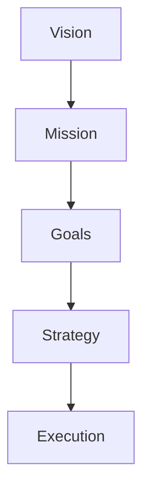

##### 2. 战略规划的过程模型

战略规划的过程模型通常包括以下步骤：

- **环境分析**：对企业内外部环境进行评估，以确定外部威胁和机会、内部优势和劣势。
- **战略选择**：根据环境分析结果，制定多个备选战略方案，并评估其优缺点。
- **战略决策**：选择最优战略方案，明确战略目标、策略和行动计划。
- **战略实施**：将战略决策转化为实际行动，包括组织结构调整、流程优化、资源调配等。
- **战略评估与调整**：定期评估战略实施效果，根据实际情况进行调整和优化。

**Mermaid流程图：**

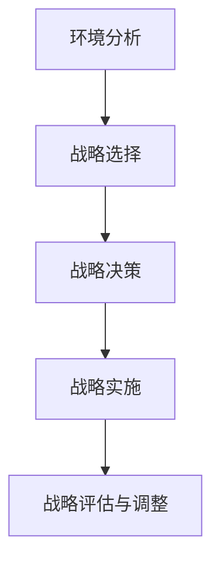

##### 3. 企业内外部环境分析

企业内外部环境分析是战略规划的重要基础。通过分析内外部环境，企业可以更好地了解自身所处位置和未来发展方向。

- **外部环境分析**：包括宏观经济环境、行业趋势、市场竞争状况等。常用的分析工具包括PESTLE分析和SWOT分析。

  **PESTLE分析：**

  ```mermaid
  graph TB
  A[Political] --> B[经济(Economic)]
  B --> C[社会(Social)]
  C --> D[技术(Technological)]
  D --> E[法律(Legal)]
  E --> F[环境(Environment)]
  ```

  **SWOT分析：**

  ```mermaid
  graph TB
  A[优势(Strengths)] --> B[劣势(Weaknesses)]
  B --> C[机会(Opportunities)]
  C --> D[威胁(Threats)]
  ```

- **内部环境分析**：包括企业资源、能力、企业文化等。内部环境分析有助于企业了解自身优势和不足，从而制定合适的战略。

**Mermaid ER实体关系图：**

```mermaid
erDiagram
  User ||--|{ Company : has }
  Company ||--|{ Product : has }
  Product ||--|{ Feature : has }
  Feature ||--|{ User : used by }
```

---

#### 核心概念与联系

战略规划涉及多个核心概念，理解这些概念及其相互联系对制定有效的战略规划至关重要。

##### 1. 战略目标、战略计划与战略执行

- **战略目标（Strategic Goals）**：战略目标是企业希望在未来某一时间内实现的长期目标，通常具有明确、可衡量、可达成、有时限等特点。

- **战略计划（Strategic Plan）**：战略计划是实现战略目标的详细行动计划，包括具体的目标、策略、措施和时间表。

- **战略执行（Strategic Execution）**：战略执行是将战略计划付诸实践的过程，涉及资源分配、任务分工、流程优化等。

**概念属性特征对比表格：**

| 特征             | 战略目标                  | 战略计划                  | 战略执行                  |
|------------------|--------------------------|--------------------------|--------------------------|
| 定义             | 长期、宏观、可衡量         | 具体行动、策略、措施       | 资源配置、任务分工、流程优化 |
| 时间跨度         | 中长期                   | 短期                     | 实施过程                   |
| 目的             | 实现企业愿景和使命         | 实现战略目标               | 确保战略计划有效执行       |
| 关系             | 战略目标是战略计划的基础   | 战略计划是战略执行的依据   | 战略目标是战略执行的导向   |

**Mermaid ER实体关系图：**

```mermaid
erDiagram
  Goal ||--|{ Plan : defines }
  Plan ||--|{ Execution : based on }
  Execution ||--|{ Goal : ensures }
```

---

#### 战略规划的方法与工具

制定有效的战略规划需要使用一系列方法和工具，这些方法和工具有助于企业分析环境、设定目标、选择战略和执行计划。

##### 1. 目标设定与优先级排序

目标设定是战略规划的核心环节，需要遵循以下原则：

- **SMART原则**：目标要具体（Specific）、可衡量（Measurable）、可达成（Achievable）、相关（Relevant）和有时限（Time-bound）。
- **SMART原则应用示例**：在2023年底，实现公司产品市场占有率达到15%。

优先级排序有助于企业聚焦关键目标，确保资源投入的有效性。常用的优先级排序方法包括：

- **优先级矩阵**：根据目标的重要性和紧迫性进行排序。
- **甘特图**：展示项目进度和任务优先级。

**Mermaid甘特图：**

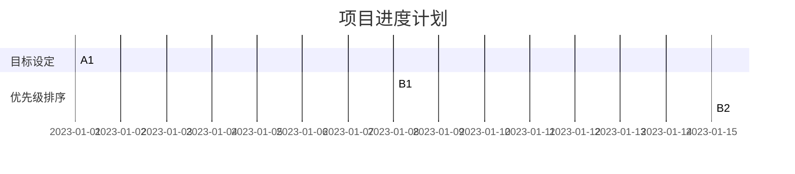

##### 2. 战略选择与评估

战略选择是战略规划的关键步骤，需要考虑以下因素：

- **市场定位**：确定企业在市场中的定位，如领导者、跟随者、挑战者等。
- **产品策略**：制定产品开发、推广和定价策略。
- **人力资源策略**：优化团队结构，提升员工能力。

战略评估是选择最佳战略的重要环节，需要使用以下方法：

- **成本效益分析**：评估战略的成本和效益，选择成本较低、效益较高的战略。
- **SWOT分析**：分析战略的优势、劣势、机会和威胁，选择具有优势、规避劣势、抓住机会、应对威胁的战略。

**案例研究：**

**成功案例**：苹果公司通过创新的产品设计和卓越的用户体验，成功定位为高端市场领导者，实现了长期的竞争优势。

**失败案例**：诺基亚在智能手机市场变革中未能及时调整战略，错失了市场机会，最终导致市场份额大幅下滑。

**Mermaid流程图：**

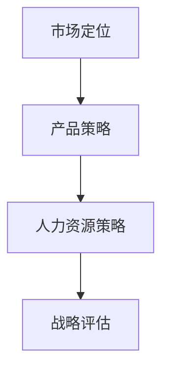

##### 3. 战略实施与监控

战略实施是将战略计划转化为实际行动的过程，需要以下步骤：

- **组织结构优化**：根据战略需求调整组织结构，确保战略目标的有效实现。
- **流程优化**：优化内部流程，提高运营效率。
- **资源配置**：合理配置资源，确保战略实施所需的资源得到充分保障。

战略监控是确保战略实施效果的重要手段，需要以下方法：

- **关键绩效指标（KPI）**：设定关键绩效指标，监控战略实施进度和效果。
- **定期评估**：定期评估战略实施效果，根据评估结果进行调整和优化。

**Mermaid甘特图：**

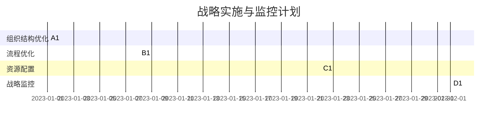

---

#### 战略执行与领导力

战略执行不仅需要有效的计划和监控，还需要强大的领导力。领导力在战略规划中发挥着至关重要的作用，它能够激发员工的潜力，推动战略目标的实现。

##### 1. 战略执行的组织架构

战略执行的组织架构应当能够支持战略的顺利实施。这包括：

- **清晰的职责分工**：确保每个部门和员工都清楚自己的职责和任务。
- **高效的管理流程**：优化管理流程，减少冗余和浪费。
- **灵活的响应机制**：建立快速响应机制，应对市场变化和内部问题。

**Mermaid组织架构图：**

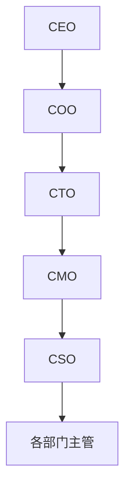

##### 2. 领导力在战略规划中的作用

领导力在战略规划中的作用体现在以下几个方面：

- **愿景和目标的传递**：领导者需要将企业的愿景和目标传递给员工，激发员工的积极性和使命感。
- **资源调配**：领导者需要合理调配资源，确保战略实施所需的资源得到充分保障。
- **沟通与协调**：领导者需要建立有效的沟通渠道，协调各部门的工作，确保战略的顺利实施。
- **激励和培养**：领导者需要激励员工，培养员工的技能和能力，提升整体执行力。

**Mermaid领导力模型：**

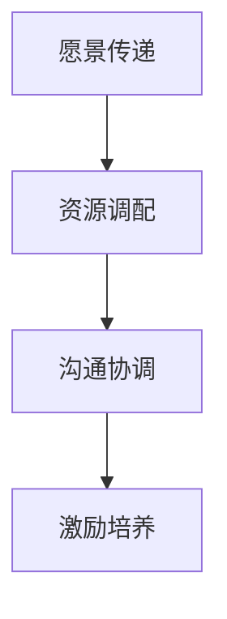

##### 3. 文化变革与战略规划

文化变革是战略规划成功的关键因素之一。一个健康的企业文化能够支持战略的实施，促进企业的长期发展。文化变革需要以下步骤：

- **领导层的示范作用**：领导者需要以身作则，树立榜样，推动文化变革。
- **员工参与**：鼓励员工参与文化变革，提高员工的认同感和积极性。
- **制度保障**：建立制度保障，确保文化变革的持续性和有效性。

**Mermaid文化变革模型：**

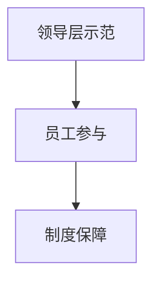

---

#### 战略规划在企业不同阶段的特殊性

战略规划并非一成不变，而是需要根据企业所处的不同阶段进行调整。以下分别讨论成长期、成熟期和衰退期企业的战略规划特点。

##### 1. 成长期企业的战略规划

成长期企业通常面临快速扩张和市场开拓的压力，其战略规划应注重以下方面：

- **市场拓展**：通过市场调研，识别新的市场机会，扩大市场份额。
- **产品创新**：持续进行产品创新，满足市场需求，提升产品竞争力。
- **竞争策略**：制定有效的竞争策略，抢占市场份额。

**Mermaid成长期战略规划模型：**

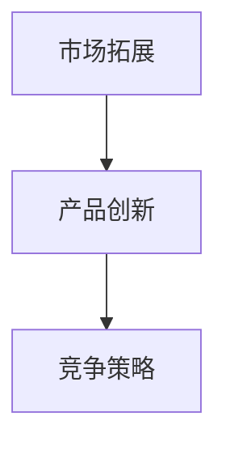

##### 2. 成熟期企业的战略规划

成熟期企业通常已经形成稳定的业务模式和市场地位，其战略规划应注重以下方面：

- **市场细分**：通过市场细分，发现新的市场需求，提高市场覆盖率。
- **成本控制**：通过优化流程和降低成本，提高盈利能力。
- **产业链整合**：整合上下游产业链，提升整体竞争力。

**Mermaid成熟期战略规划模型：**

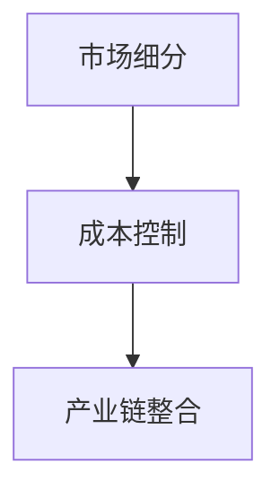

##### 3. 衰退期企业的战略规划

衰退期企业通常面临市场份额下降和业务萎缩的挑战，其战略规划应注重以下方面：

- **市场调整**：根据市场变化，调整业务方向和市场定位。
- **业务重构**：通过业务重构，提升业务效率和竞争力。
- **资产剥离**：对于无法盈利的业务，考虑资产剥离，减少损失。

**Mermaid衰退期战略规划模型：**

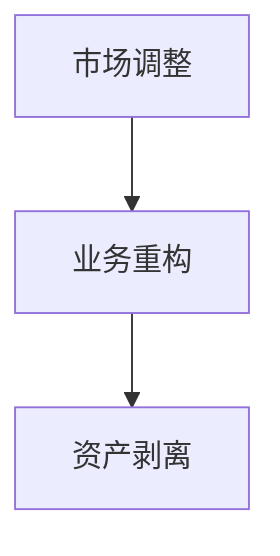

---

#### 战略规划中的挑战与解决方案

在实施战略规划的过程中，企业可能会面临各种挑战。以下是一些常见的挑战及其解决方案：

##### 1. 风险管理

风险管理是战略规划中至关重要的一环。企业应采取以下措施：

- **风险识别**：识别潜在的风险，包括市场风险、财务风险、运营风险等。
- **风险评估**：对识别出的风险进行评估，确定其严重程度和发生概率。
- **风险应对策略**：制定相应的风险应对策略，包括风险规避、风险减轻、风险接受等。

**Mermaid风险管理流程图：**

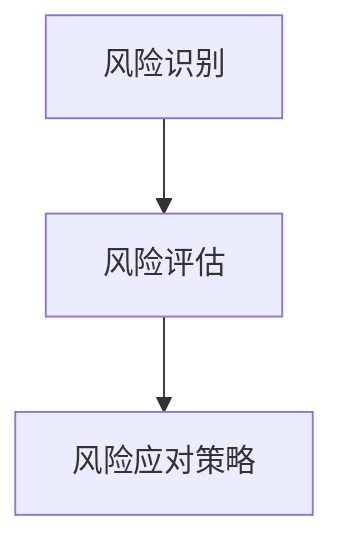

##### 2. 资源配置

资源配置是战略规划中的一大挑战。企业应采取以下措施：

- **资源评估**：评估企业现有资源，包括人力、财务、技术等。
- **资源配置原则**：根据战略目标，制定资源配置原则，确保资源优先用于关键领域。
- **资源配置方法**：采用科学的资源配置方法，如优先级排序、资源池管理等。

**Mermaid资源配置模型：**

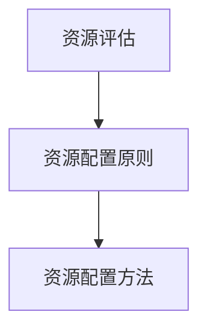

##### 3. 战略创新

战略创新是企业在竞争中保持优势的关键。企业应采取以下措施：

- **创新重要性**：认识到创新的重要性，将其作为战略规划的核心要素。
- **创新策略**：制定创新策略，如开放式创新、内部创业等。
- **创新实践**：通过创新实践，不断探索新的业务模式和增长点。

**Mermaid创新策略模型：**

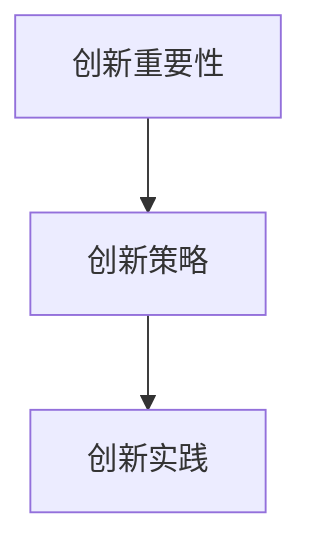

---

#### 战略规划的实施与监控

战略规划的实施与监控是确保战略目标实现的关键环节。以下是一些关键步骤和方法：

##### 1. 战略实施的关键绩效指标（KPI）

关键绩效指标（KPI）是衡量战略实施效果的重要工具。企业应设定以下关键绩效指标：

- **财务指标**：如收入增长率、净利润率、成本控制率等。
- **市场指标**：如市场份额、品牌知名度、客户满意度等。
- **运营指标**：如生产效率、交货准时率、员工满意度等。

**Mermaid KPI 设定模型：**

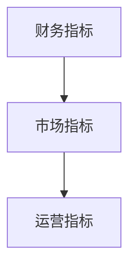

##### 2. 监控与评估

监控与评估是战略规划实施过程中不可或缺的环节。企业应采取以下方法：

- **定期评估**：定期对战略实施效果进行评估，分析实际情况与预期目标的差距。
- **反馈机制**：建立有效的反馈机制，收集员工和客户的意见和建议，及时调整战略。
- **数据分析**：运用数据分析工具，对战略实施过程中的数据进行分析，识别问题和机会。

**Mermaid监控与评估模型：**

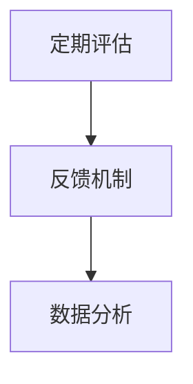

##### 3. 战略调整与优化

战略调整与优化是确保战略规划持续有效的重要手段。企业应采取以下方法：

- **实时调整**：根据市场变化和内部情况，及时调整战略目标和计划。
- **持续优化**：通过不断优化流程和资源配置，提高战略实施的效率和效果。
- **经验总结**：总结战略规划实施过程中的经验教训，为未来的战略规划提供参考。

**Mermaid战略调整与优化模型：**

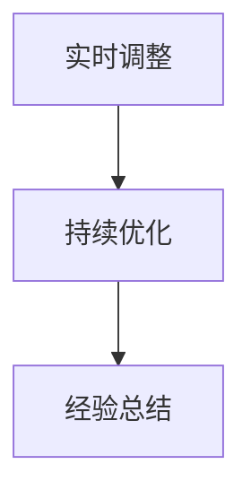

---

#### 结论与展望

战略规划是企业实现长期成功的关键。通过科学的战略规划，企业可以明确发展方向，优化资源配置，提高运营效率，增强市场竞争力。在未来，随着市场的不断变化和技术的快速发展，战略规划将面临更多的挑战和机遇。企业应持续关注市场动态，不断调整和优化战略规划，以适应新的环境和要求。

总之，战略规划不仅是企业发展的指南针，也是企业在激烈竞争中脱颖而出的关键。希望本文能帮助读者深入理解战略规划的重要性、理论基础、方法和工具，掌握战略规划的实施与监控，为企业的发展提供有力支持。

---

### 总结

本文从多个角度深入探讨了战略规划的重要性、理论基础、核心概念、方法与工具、企业不同阶段的特殊性、挑战与解决方案，以及实施与监控。通过逻辑清晰、结构紧凑、简单易懂的专业技术语言，本文旨在帮助读者全面掌握战略规划的理论和实践。

在战略规划中，企业需要明确愿景、使命和目标，制定详细的战略计划，并有效执行。领导力在战略规划中至关重要，企业应注重组织架构的优化和文化变革。此外，战略规划在不同阶段具有特殊性，企业应根据自身发展阶段制定相应策略。风险管理、资源配置和战略创新是战略规划中的关键挑战，需要采取有效的解决方案。

实施与监控是战略规划成功的关键环节，通过设定关键绩效指标、定期评估和战略调整，企业可以确保战略目标的实现。未来，企业应持续关注市场动态和技术发展，不断优化战略规划，以应对新的挑战和机遇。

最后，本文强调了战略规划在企业发展中的重要性，希望读者能够深入理解和掌握战略规划的理论和实践，为企业的发展提供有力支持。

### 作者信息

**作者：AI天才研究院/AI Genius Institute & 禅与计算机程序设计艺术 /Zen And The Art of Computer Programming**

