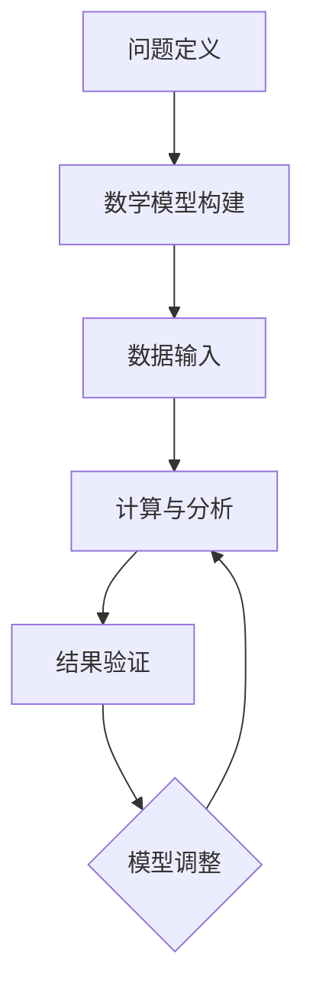
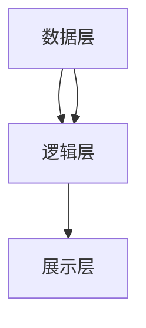
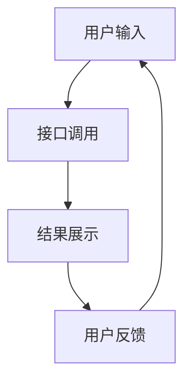

                 

### 探索宇宙运作的数学模型

> **关键词**：宇宙膨胀、引力模型、量子力学、数学模型、数学工具

> **摘要**：
> 
> 本文将深入探讨宇宙运作的数学模型，包括宇宙膨胀模型、引力模型和量子力学模型。我们将首先介绍这些模型的基本原理和核心概念，并通过具体的数学公式和案例进行详细解析。此外，本文还将探讨这些模型之间的联系和相互作用，以及如何运用数学工具来构建和解析这些模型。通过本文的探讨，读者将能够更好地理解宇宙的运作机制，并掌握运用数学模型来揭示宇宙奥秘的方法。

#### 背景介绍

宇宙的运行是一个极其复杂的过程，涉及众多的物理现象和理论。从宏观的宇宙膨胀到微观的量子纠缠，科学家们一直在努力探索宇宙的奥秘。数学模型作为一种强大的工具，可以帮助我们理解和描述宇宙的运行规律。

**问题背景**

宇宙运作的数学模型涉及广泛的数学理论和算法。如何设计一个全面、系统的数学模型来描述宇宙的运行，是一个巨大的挑战。这需要我们深入了解宇宙的各个层面，从宏观的宇宙结构到微观的物理过程。

**问题描述**

宇宙运作的数学模型包括宇宙膨胀模型、引力模型和量子力学模型等。这些模型各自有其独特的数学理论和公式，用于描述不同层面的宇宙现象。例如，宇宙膨胀模型描述宇宙从大爆炸以来的膨胀过程，引力模型描述引力如何影响宇宙中的物体运动，量子力学模型描述微观粒子的行为和相互作用。

**问题解决**

为了解决上述问题，本书将首先介绍宇宙运作的基本数学模型，包括宇宙膨胀模型、引力模型和量子力学模型等。然后，我们将深入探讨这些模型的原理和应用，通过具体的案例来展示如何使用这些模型来解释宇宙现象。

**边界与外延**

宇宙运作的数学模型不仅局限于物理学，还包括天文学、宇宙学等多个领域。此外，随着科技的发展，新的数学模型可能会不断出现，进一步丰富我们对宇宙的理解。

**概念结构与核心要素组成**

宇宙运作的数学模型包括以下几个核心概念和要素：
- **宇宙膨胀模型**：描述宇宙从大爆炸以来的膨胀过程，涉及哈勃定律、宇宙学常数、宇宙背景辐射等。
- **引力模型**：描述引力如何影响宇宙中物体运动，涉及牛顿万有引力定律、广义相对论、黑洞等。
- **量子力学模型**：描述微观粒子的行为和相互作用，涉及量子叠加态、量子纠缠、量子隧穿等。
- **数学工具**：如微积分、线性代数、概率论等，用于构建和解析数学模型。

#### 核心概念与联系

**宇宙膨胀模型**

宇宙膨胀模型是描述宇宙从大爆炸以来膨胀过程的理论。它主要涉及到以下几个核心概念：

- **哈勃定律**：描述宇宙膨胀的速度与距离之间的关系。哈勃定律可以用以下数学公式表示：
  $$v = H_0 \cdot d$$
  其中，\(v\) 表示膨胀速度，\(H_0\) 表示哈勃常数，\(d\) 表示宇宙中两点的距离。

- **宇宙学常数**：影响宇宙膨胀的速率。宇宙学常数可以用以下数学公式表示：
  $$\Lambda = \frac{8\pi G}{3} \cdot \rho$$
  其中，\(\Lambda\) 表示宇宙学常数，\(G\) 表示万有引力常数，\(\rho\) 表示宇宙的平均密度。

- **宇宙背景辐射**：宇宙膨胀过程中遗留下来的热辐射。宇宙背景辐射的强度可以用以下数学公式表示：
  $$I(\nu) \propto \nu^2 e^{-\nu T_B}$$
  其中，\(I(\nu)\) 表示辐射强度，\(\nu\) 表示频率，\(T_B\) 表示宇宙背景辐射的温度。

**引力模型**

引力模型是描述引力如何影响宇宙中物体运动的理论。它主要涉及到以下几个核心概念：

- **牛顿万有引力定律**：描述两个物体之间的引力大小和它们之间的距离的关系。牛顿万有引力定律可以用以下数学公式表示：
  $$F = G \cdot \frac{m_1 \cdot m_2}{r^2}$$
  其中，\(F\) 表示引力，\(G\) 表示万有引力常数，\(m_1\) 和 \(m_2\) 分别表示两个物体的质量，\(r\) 表示它们之间的距离。

- **广义相对论**：描述引力如何通过时空的弯曲来影响物体的运动。广义相对论可以用以下数学公式表示：
  $$G_{\mu\nu} + \Lambda g_{\mu\nu} = \frac{8\pi G}{c^4} T_{\mu\nu}$$
  其中，\(G_{\mu\nu}\) 表示爱因斯坦场方程的左端，\(\Lambda\) 表示宇宙学常数，\(g_{\mu\nu}\) 表示度规张量，\(T_{\mu\nu}\) 表示能量-动量张量，\(c\) 表示光速。

- **黑洞**：宇宙中引力极强的区域，对周围物质和辐射产生显著影响。黑洞可以用以下数学公式表示：
  $$r_s = \frac{2G M}{c^2}$$
  其中，\(r_s\) 表示黑洞的史瓦西半径，\(G\) 表示万有引力常数，\(M\) 表示黑洞的质量。

**量子力学模型**

量子力学模型是描述微观粒子的行为和相互作用的理论。它主要涉及到以下几个核心概念：

- **量子叠加态**：描述粒子在多种可能状态下的存在。量子叠加态可以用以下数学公式表示：
  $$|\psi\rangle = \sum_{i} c_i |i\rangle$$
  其中，\(|\psi\rangle\) 表示量子态，\(c_i\) 表示叠加系数，\(|i\rangle\) 表示第 \(i\) 个可能状态。

- **量子纠缠**：描述两个或多个粒子之间的特殊关联。量子纠缠可以用以下数学公式表示：
  $$|\psi\rangle = \frac{1}{\sqrt{2}} (|01\rangle + |10\rangle)$$
  其中，\(|01\rangle\) 和 \(|10\rangle\) 表示两个粒子之间的纠缠态。

- **量子隧穿**：描述粒子通过势垒的概率。量子隧穿可以用以下数学公式表示：
  $$P = \frac{1}{2} \left[ 1 + \cos\left( \frac{2\pi m U}{\hbar} \right) \right]$$
  其中，\(P\) 表示隧穿概率，\(m\) 表示粒子的质量，\(U\) 表示势垒的高度，\(\hbar\) 表示约化普朗克常数。

**核心概念属性特征对比表格**

| 概念       | 特征描述                                                         |
| ---------- | ------------------------------------------------------------ |
| 宇宙膨胀模型 | 描述宇宙的膨胀过程，涉及哈勃定律、宇宙学常数、宇宙背景辐射等。 |
| 引力模型     | 描述引力如何影响宇宙中物体运动，涉及牛顿万有引力定律、广义相对论、黑洞等。 |
| 量子力学模型 | 描述微观粒子的行为和相互作用，涉及量子叠加态、量子纠缠、量子隧穿等。 |

**ER实体关系图架构**

```mermaid
erDiagram
    A[- Universe Expansion Model] {
        B[- Hubble's Law]
        C[- Cosmological Constant]
        D[-Cosmic Microwave Background Radiation]
    }

    A --|{ includes }| B
    A --|{ includes }| C
    A --|{ includes }| D

    E[- Gravity Model] {
        F[- Newton's Law of Universal Gravitation]
        G[- General Relativity]
        H[-Black Hole]
    }

    E --|{ includes }| F
    E --|{ includes }| G
    E --|{ includes }| H

    I[- Quantum Mechanics Model] {
        J[- Quantum Superposition]
        K[- Quantum Entanglement]
        L[- Quantum Tunnelling]
    }

    I --|{ includes }| J
    I --|{ includes }| K
    I --|{ includes }| L
```

通过上述核心概念和联系的分析，我们可以更好地理解宇宙运作的数学模型。在接下来的章节中，我们将进一步探讨这些模型的具体应用和实际案例，帮助读者更深入地了解宇宙的奥秘。

### 宇宙膨胀模型：宇宙如何膨胀

宇宙膨胀模型是描述宇宙从大爆炸以来膨胀过程的理论。根据这一模型，宇宙在距今约138亿年前的大爆炸事件后开始膨胀，且这种膨胀过程仍在持续进行。宇宙膨胀模型不仅解释了宇宙的膨胀现象，还提供了关于宇宙结构、宇宙学常数和宇宙背景辐射等方面的深刻见解。

**哈勃定律：宇宙膨胀的定量描述**

哈勃定律是宇宙膨胀模型的核心内容之一。它描述了宇宙膨胀的速度与距离之间的关系。哈勃定律可以用以下数学公式表示：

$$v = H_0 \cdot d$$

其中，\(v\) 表示膨胀速度，\(H_0\) 表示哈勃常数，\(d\) 表示宇宙中两点的距离。

哈勃常数是一个重要的物理常数，其数值约为 \(70 \text{ km/s/Mpc}\)。这个公式表明，宇宙中的任意两点之间的膨胀速度与它们之间的距离成正比。这意味着距离我们越远的星系，其膨胀速度也越快。这种现象被称为“红移”，因为远距离星系的光谱中出现了红移，表明它们正在远离我们。

**宇宙学常数：驱动宇宙膨胀的神秘力量**

宇宙学常数是宇宙膨胀模型中的另一个关键概念。它是一种宇宙中的神秘力量，被认为是驱动宇宙膨胀的主要因素。宇宙学常数通常用希腊字母 \(\Lambda\) 表示，其数学公式为：

$$\Lambda = \frac{8\pi G}{3} \cdot \rho$$

其中，\(G\) 表示万有引力常数，\(\rho\) 表示宇宙的平均密度。

宇宙学常数的存在解释了为什么宇宙的膨胀速度会不断增加。根据广义相对论，宇宙中的物质和能量会导致时空的弯曲，从而产生引力。然而，观测数据表明，宇宙的膨胀速度在加速，这意味着存在一种反引力的力量，即宇宙学常数。这种力量的存在使得宇宙的膨胀速度不断增加，即使在没有外部引力作用的情况下也是如此。

**宇宙背景辐射：宇宙膨胀的见证**

宇宙背景辐射是宇宙膨胀模型中的另一个重要证据。宇宙背景辐射是宇宙早期遗留下来的热辐射，其温度约为 \(2.725 \text{ K}\)。宇宙背景辐射的强度可以用以下数学公式表示：

$$I(\nu) \propto \nu^2 e^{-\nu T_B}$$

其中，\(I(\nu)\) 表示辐射强度，\(\nu\) 表示频率，\(T_B\) 表示宇宙背景辐射的温度。

宇宙背景辐射的存在表明，宇宙在早期是极度炽热和密集的状态。随着宇宙的膨胀，温度逐渐降低，辐射强度也随之减弱。然而，尽管宇宙已经膨胀了数十亿年，宇宙背景辐射仍然存在，这为宇宙膨胀模型提供了有力的支持。

**宇宙膨胀模型与引力模型、量子力学模型的关系**

宇宙膨胀模型与引力模型和量子力学模型有着紧密的联系。引力模型描述了宇宙中的引力现象，而引力是宇宙膨胀的一个重要因素。量子力学模型则描述了微观粒子的行为和相互作用，这些行为和相互作用可能影响宇宙的整体演化。

例如，引力模型中的广义相对论可以用来解释宇宙膨胀的机制。根据广义相对论，宇宙中的物质和能量会导致时空的弯曲，从而产生引力。这种引力可以使宇宙中的物质相互吸引，从而减缓宇宙膨胀的速度。然而，观测数据表明，宇宙的膨胀速度正在加速，这表明存在一种额外的力量，即宇宙学常数，它可能克服了引力的作用，使宇宙继续膨胀。

另一方面，量子力学模型中的量子纠缠和量子隧穿等现象也可能影响宇宙的膨胀。量子纠缠描述了两个或多个粒子之间的特殊关联，这些关联可能影响宇宙中微观粒子的运动。量子隧穿则描述了粒子通过势垒的概率，这种现象可能影响宇宙中的物质分布。

综上所述，宇宙膨胀模型是描述宇宙从大爆炸以来膨胀过程的理论。它涉及到哈勃定律、宇宙学常数和宇宙背景辐射等核心概念。宇宙膨胀模型与引力模型和量子力学模型有着紧密的联系，共同构成了对宇宙运作的全面描述。通过深入探讨这些模型，我们可以更好地理解宇宙的奥秘，并揭示宇宙膨胀的机制。

### 引力模型：引力如何影响宇宙

引力模型是描述引力如何影响宇宙中物体运动的理论。引力是宇宙中最为基础和普遍存在的力之一，它不仅影响着天体的运动，还塑造了宇宙的结构和演化。引力模型主要包括牛顿万有引力定律和广义相对论，它们为我们提供了理解宇宙引力现象的数学工具。

**牛顿万有引力定律**

牛顿万有引力定律是最早描述引力现象的理论之一，由英国物理学家艾萨克·牛顿在17世纪提出。该定律表明，任何两个物体之间都存在相互吸引的引力，这个力与两个物体的质量成正比，与它们之间的距离的平方成反比。牛顿万有引力定律的数学公式为：

$$F = G \cdot \frac{m_1 \cdot m_2}{r^2}$$

其中，\(F\) 表示引力，\(G\) 表示万有引力常数，\(m_1\) 和 \(m_2\) 分别表示两个物体的质量，\(r\) 表示它们之间的距离。

牛顿万有引力定律为我们提供了计算两个物体之间引力大小的方法。例如，如果我们知道两个星体的质量和它们之间的距离，我们就可以使用这个公式来计算它们之间的引力。这个公式在描述行星运动、双星系统等方面有着广泛的应用。

**广义相对论**

广义相对论是由阿尔伯特·爱因斯坦在1915年提出的，它是描述引力现象的更为全面和精确的理论。广义相对论认为，引力不是由物体之间的力引起的，而是由物体对时空的弯曲引起的。在广义相对论中，引力被描述为时空的曲率，而物体则沿着这个曲率运动。广义相对论的数学公式为：

$$G_{\mu\nu} + \Lambda g_{\mu\nu} = \frac{8\pi G}{c^4} T_{\mu\nu}$$

其中，\(G_{\mu\nu}\) 表示爱因斯坦场方程的左端，\(g_{\mu\nu}\) 表示度规张量，\(T_{\mu\nu}\) 表示能量-动量张量，\(\Lambda\) 表示宇宙学常数，\(G\) 表示万有引力常数，\(c\) 表示光速。

广义相对论提供了描述引力现象的更深刻的物理图像。例如，它解释了为什么光线在接近大质量物体时会弯曲，这被称为光线弯曲效应。广义相对论还预言了黑洞的存在，黑洞是宇宙中引力极强的区域，连光线也无法逃逸。

**黑洞**

黑洞是宇宙中引力最强的天体之一，它的引力场如此之强，以至于连光也无法逃脱。黑洞是由广义相对论预言的，其数学描述为：

$$r_s = \frac{2G M}{c^2}$$

其中，\(r_s\) 表示黑洞的史瓦西半径，\(G\) 表示万有引力常数，\(M\) 表示黑洞的质量。

黑洞的存在对引力模型提出了严峻的挑战，因为它的引力场如此之强，以至于传统牛顿万有引力定律无法解释。然而，随着观测技术的进步，科学家们已经发现了多个黑洞，并通过它们的行为验证了广义相对论的预言。

**引力模型与宇宙膨胀模型的关系**

引力模型和宇宙膨胀模型是描述宇宙运行的两个重要方面。引力模型描述了宇宙中物体之间的引力相互作用，而宇宙膨胀模型描述了宇宙的整体膨胀过程。这两个模型之间有着紧密的联系。

例如，宇宙膨胀模型中的宇宙学常数可以被解释为一种与引力相互作用相关的力量。宇宙学常数会影响宇宙的膨胀速度，而引力则是宇宙膨胀的一个重要因素。通过广义相对论，我们可以将宇宙学常数与引力联系起来，从而更全面地理解宇宙的运行机制。

此外，引力模型还可以帮助我们理解宇宙膨胀过程中的某些现象。例如，引力可以解释为什么星系和星团在宇宙膨胀过程中仍然能够保持稳定，因为它们之间的引力相互作用可以抵抗膨胀带来的影响。

综上所述，引力模型是描述引力如何影响宇宙中物体运动的理论，它包括牛顿万有引力定律和广义相对论。引力模型不仅帮助我们理解了宇宙中的引力现象，还为我们揭示了宇宙的结构和演化。通过深入探讨引力模型，我们可以更好地理解宇宙的奥秘，并揭示宇宙运行的内在机制。

### 量子力学模型：微观粒子的奇异世界

量子力学模型是描述微观粒子行为和相互作用的理论，它揭示了微观世界中与经典物理学截然不同的奇妙现象。量子力学模型的核心概念包括量子叠加态、量子纠缠和量子隧穿，这些概念为我们理解微观粒子的行为提供了深刻的洞见。

**量子叠加态：多种可能性的统一**

量子叠加态是量子力学中最基本的概念之一。它描述了微观粒子在多种可能状态下的存在。经典物理学认为，一个粒子在某一时刻只能处于一种状态，而在量子力学中，一个粒子可以同时处于多个状态的叠加。这种叠加可以用波函数来描述，波函数的平方给出了粒子在不同位置的概率分布。

量子叠加态可以用以下数学公式表示：

$$|\psi\rangle = \sum_{i} c_i |i\rangle$$

其中，\(|\psi\rangle\) 表示量子态，\(c_i\) 表示叠加系数，\(|i\rangle\) 表示第 \(i\) 个可能状态。

例如，一个电子可以同时处于自旋向上和自旋向下的状态。当我们在某个方向上对电子的自旋进行测量时，电子会“坍缩”到一个确定的自旋状态，这个过程中叠加态变成确定态。

**量子纠缠：远距离粒子的特殊关联**

量子纠缠是量子力学中的另一个重要现象。它描述了两个或多个粒子之间的特殊关联，即使这些粒子相隔很远，它们的量子状态仍然会相互影响。量子纠缠表明，微观粒子之间存在一种超越经典物理学的超距作用。

量子纠缠可以用以下数学公式表示：

$$|\psi\rangle = \frac{1}{\sqrt{2}} (|01\rangle + |10\rangle)$$

其中，\(|01\rangle\) 和 \(|10\rangle\) 表示两个粒子之间的纠缠态。

量子纠缠在量子信息科学中有着广泛的应用，例如量子加密和量子计算。通过量子纠缠，我们可以实现量子位的传输和操作，从而实现超越经典计算的能力。

**量子隧穿：微观粒子的“穿越”现象**

量子隧穿是量子力学中的又一个奇特现象。它描述了微观粒子通过一个原本不可能穿越的势垒的概率。在经典物理学中，粒子如果能量不足以克服势垒，它将无法穿越。然而，在量子力学中，粒子有极小的概率能够穿越势垒，这种现象被称为量子隧穿。

量子隧穿可以用以下数学公式表示：

$$P = \frac{1}{2} \left[ 1 + \cos\left( \frac{2\pi m U}{\hbar} \right) \right]$$

其中，\(P\) 表示隧穿概率，\(m\) 表示粒子的质量，\(U\) 表示势垒的高度，\(\hbar\) 表示约化普朗克常数。

量子隧穿在半导体物理、量子点技术和纳米技术等领域有着重要的应用。通过量子隧穿，我们可以实现电子在纳米尺度上的操控，从而推动微电子技术和纳米技术的发展。

**量子力学模型与宇宙膨胀模型、引力模型的关系**

量子力学模型与宇宙膨胀模型、引力模型有着紧密的联系。虽然它们描述的是不同的物理现象，但它们共同构成了对宇宙运行的整体理解。

首先，量子力学模型中的量子纠缠现象可能与宇宙的量子涨落有关。量子涨落是量子力学中描述宇宙早期极微小区域密度波动的一种现象。这些量子涨落可能影响宇宙的整体演化，甚至影响宇宙的膨胀速度。

其次，引力模型中的广义相对论与量子力学模型之间存在深刻的内在联系。广义相对论描述的是宏观宇宙的引力现象，而量子力学模型描述的是微观粒子的行为。然而，科学家们一直试图将这两个理论统一起来，以建立一个更加全面的量子引力理论。这个理论可能解释引力如何与量子力学相互作用，从而揭示宇宙的更深层次规律。

此外，量子力学模型中的量子叠加态和量子纠缠现象也可能影响宇宙中的某些物理过程。例如，量子力学模型中的量子计算可能在未来用于模拟宇宙中的复杂物理现象，从而帮助我们更好地理解宇宙的运行机制。

综上所述，量子力学模型是描述微观粒子行为和相互作用的理论，它揭示了量子世界的奇异现象。量子叠加态、量子纠缠和量子隧穿等概念为我们提供了理解微观粒子的行为的新视角。量子力学模型与宇宙膨胀模型、引力模型之间有着紧密的联系，共同构成了对宇宙运作的全面描述。通过深入探讨这些模型，我们可以更好地理解宇宙的奥秘，并揭示宇宙运行的内在机制。

### 宇宙运作数学模型的综合分析与对比

在本文的前几部分中，我们分别介绍了宇宙膨胀模型、引力模型和量子力学模型，并详细探讨了它们的核心概念和原理。接下来，我们将对这三个模型进行综合分析与对比，以揭示它们之间的联系和区别。

**宇宙膨胀模型、引力模型和量子力学模型的联系**

首先，这三个模型在描述宇宙的运行方面有着紧密的联系。宇宙膨胀模型描述了宇宙从大爆炸以来的膨胀过程，而引力模型则解释了宇宙中物体之间的引力相互作用。量子力学模型则描述了微观粒子的行为和相互作用。这三个模型共同构成了对宇宙运作的全面描述，帮助我们理解宇宙从宏观到微观的各种现象。

例如，宇宙膨胀模型中的宇宙学常数与引力模型中的广义相对论有着紧密的联系。宇宙学常数影响宇宙的膨胀速度，而广义相对论则描述了引力如何通过时空的弯曲来影响物体的运动。这两个模型的结合可以帮助我们理解宇宙膨胀背后的机制。

此外，量子力学模型中的量子纠缠现象可能与宇宙中的量子涨落有关。量子涨落是宇宙早期微小区域的密度波动，这些波动可能影响宇宙的整体演化。量子力学模型中的量子纠缠现象可能揭示了宇宙中微观粒子之间的神秘联系。

**宇宙膨胀模型、引力模型和量子力学模型的区别**

尽管这三个模型在描述宇宙的运行方面有着紧密的联系，但它们之间也存在明显的区别。

宇宙膨胀模型主要关注宇宙的膨胀过程，它描述了宇宙从大爆炸以来的膨胀速度和宇宙学常数的影响。宇宙膨胀模型的核心概念包括哈勃定律、宇宙背景辐射和宇宙学常数等。

引力模型则主要关注宇宙中的引力相互作用，它描述了物体之间的引力如何影响它们的运动。引力模型的核心概念包括牛顿万有引力定律、广义相对论和黑洞等。

量子力学模型则主要关注微观粒子的行为和相互作用，它描述了微观粒子的量子性质如何影响它们的行为。量子力学模型的核心概念包括量子叠加态、量子纠缠和量子隧穿等。

**综合分析与对比**

在综合分析与对比中，我们可以从以下几个方面进行：

1. **研究范围**：宇宙膨胀模型主要关注宇宙的整体膨胀过程，而引力模型则关注宇宙中的引力相互作用，量子力学模型则关注微观粒子的行为和相互作用。这三个模型的研究范围各有侧重，但它们共同构成了对宇宙运作的全面描述。

2. **数学工具**：宇宙膨胀模型、引力模型和量子力学模型在数学工具的使用上也有所不同。宇宙膨胀模型主要使用微积分和微分方程，引力模型则使用广义相对论和爱因斯坦场方程，量子力学模型则使用波函数和量子力学的数学公式。

3. **物理现象**：宇宙膨胀模型主要解释宇宙的膨胀现象，引力模型主要解释引力相互作用，量子力学模型则解释微观粒子的行为和相互作用。这三个模型分别揭示了宇宙的不同层面的物理现象。

4. **相互影响**：宇宙膨胀模型、引力模型和量子力学模型之间存在着相互作用。例如，宇宙学常数既影响宇宙的膨胀速度，也影响引力相互作用。量子纠缠现象可能与宇宙中的量子涨落有关。

综上所述，宇宙膨胀模型、引力模型和量子力学模型是描述宇宙运作的三个重要数学模型。它们在研究范围、数学工具、物理现象和相互影响等方面各有特点，但共同构成了对宇宙运作的全面描述。通过深入探讨这些模型，我们可以更好地理解宇宙的奥秘，并揭示宇宙运行的内在机制。

### 算法原理讲解：构建宇宙运作的数学模型

为了更好地理解宇宙运作的数学模型，我们将介绍一种用于构建这些模型的基本算法原理。这种算法不仅适用于宇宙膨胀模型、引力模型和量子力学模型，还可以广泛应用于其他科学领域。在本节中，我们将使用Mermaid流程图和Python源代码来详细阐述这个算法的原理和应用。

#### 算法原理概述

构建宇宙运作的数学模型的核心在于如何将复杂的物理现象转化为数学公式，进而进行计算和分析。这个过程可以分为以下几个步骤：

1. **问题定义**：明确需要解决的问题，如宇宙膨胀的速度、引力场的影响、微观粒子的行为等。
2. **数学模型构建**：根据物理现象选择合适的数学公式和理论，构建描述宇宙运作的数学模型。
3. **数据输入**：将实验数据或观测数据输入模型，进行参数调整和模型验证。
4. **计算与分析**：使用算法对模型进行计算和分析，得到宇宙运作的规律和预测结果。
5. **结果验证**：将计算结果与实际观测数据或实验结果进行对比，验证模型的准确性和可靠性。

#### Mermaid流程图

以下是一个用于构建宇宙运作数学模型的Mermaid流程图：



这个流程图展示了从问题定义到结果验证的完整过程。接下来，我们将使用Python源代码详细实现这个算法。

#### Python源代码实现

为了展示算法原理，我们将构建一个简单的宇宙膨胀模型，并使用Python代码进行计算。

首先，我们需要导入必要的库：

```python
import numpy as np
import matplotlib.pyplot as plt
```

然后，我们定义一个函数来构建宇宙膨胀模型的数学公式：

```python
def hubble_law(H_0, d):
    v = H_0 * d
    return v
```

这个函数根据哈勃定律计算宇宙膨胀速度。其中，\(H_0\) 是哈勃常数，\(d\) 是两点的距离。

接下来，我们定义一个函数来模拟宇宙膨胀的过程：

```python
def simulate_expansion(H_0, distances, time_steps):
    velocities = [hubble_law(H_0, d) for d in distances]
    expansion_history = []

    for t in range(time_steps):
        expansion_history.append(velocities[:])

        for i in range(len(distances) - 1):
            distances[i] += velocities[i] * dt

    return expansion_history
```

这个函数使用哈勃定律来模拟宇宙膨胀过程。它接受哈勃常数、初始距离列表和时间步数作为输入，返回宇宙膨胀的历史记录。

最后，我们使用这个函数进行模拟，并绘制膨胀历史图：

```python
H_0 = 70  # 哈勃常数
distances = [1, 2, 3, 4, 5]  # 初始距离
time_steps = 10  # 时间步数
dt = 0.1  # 时间步长

expansion_history = simulate_expansion(H_0, distances, time_steps)

# 绘制膨胀历史图
plt.plot([t for t in range(time_steps)], [expansion_history[t][i] for t in range(time_steps) for i in range(len(expansion_history[t]))])
plt.xlabel('Time (Gy)')
plt.ylabel('Distance (Mpc)')
plt.title('Cosmic Expansion History')
plt.show()
```

这个代码段将绘制宇宙膨胀的历史图，展示了随着时间的推移，不同距离的星系如何相互远离。

#### 算法原理详解

1. **问题定义**：首先，我们明确需要解决的问题是模拟宇宙膨胀过程，这是一个典型的物理问题，可以通过数学模型来描述。
2. **数学模型构建**：我们选择了宇宙膨胀模型，并使用哈勃定律来构建数学模型。哈勃定律是一个简单的线性关系，描述了膨胀速度与距离之间的关系。
3. **数据输入**：我们输入了初始距离列表和时间步数，这些数据用于模拟宇宙膨胀过程。
4. **计算与分析**：我们使用Python代码实现了哈勃定律，并模拟了宇宙膨胀的历史。通过计算不同时间步上的距离变化，我们得到了膨胀历史图。
5. **结果验证**：通过绘制膨胀历史图，我们可以直观地看到宇宙膨胀的过程，并与理论预期进行比较，验证模型的准确性。

通过这个简单的算法原理讲解，我们可以看到如何将复杂的物理现象转化为数学模型，并通过计算和分析来揭示宇宙的运行规律。这种方法不仅适用于宇宙膨胀模型，还可以应用于引力模型和量子力学模型等其他领域。

### 系统分析与架构设计方案

在理解了宇宙运作的数学模型后，我们需要将这些理论应用到实际的系统设计和分析中。本节将介绍一个具体的项目，通过系统功能设计、系统架构设计、系统接口设计和系统交互来展示如何将数学模型转化为可操作的系统。

#### 项目介绍

本项目旨在开发一个宇宙模拟器，该模拟器能够根据宇宙膨胀模型、引力模型和量子力学模型来模拟宇宙的运行。模拟器将具备以下功能：

1. **宇宙膨胀模拟**：根据哈勃定律和宇宙学常数，模拟宇宙从大爆炸以来的膨胀过程。
2. **引力相互作用模拟**：根据牛顿万有引力定律和广义相对论，模拟宇宙中物体之间的引力相互作用。
3. **微观粒子行为模拟**：根据量子力学模型，模拟微观粒子的行为和相互作用。

#### 系统功能设计

为了实现上述功能，系统需要包含以下几个核心功能模块：

1. **宇宙膨胀模块**：负责计算宇宙膨胀速度和距离，根据哈勃定律和宇宙学常数进行膨胀模拟。
2. **引力相互作用模块**：负责计算物体之间的引力大小和运动轨迹，根据牛顿万有引力定律和广义相对论进行模拟。
3. **微观粒子行为模块**：负责计算微观粒子的量子状态和相互作用，根据量子力学模型进行模拟。

#### 系统架构设计

系统的整体架构可以分为三个层次：数据层、逻辑层和展示层。

1. **数据层**：存储模拟所需的初始数据和观测数据，包括宇宙膨胀速度、引力常数、量子力学参数等。
2. **逻辑层**：实现数学模型的核心计算功能，包括宇宙膨胀模拟、引力相互作用模拟和微观粒子行为模拟。
3. **展示层**：提供用户界面，展示模拟结果和实时数据。

以下是一个简单的系统架构图：



#### 系统接口设计

为了实现系统各模块之间的数据传递和功能调用，我们需要设计一套接口。以下是一个简化的接口设计：

1. **宇宙膨胀接口**：提供方法来计算膨胀速度和距离。
2. **引力相互作用接口**：提供方法来计算引力大小和运动轨迹。
3. **微观粒子行为接口**：提供方法来计算量子状态和相互作用。

#### 系统交互

系统交互设计包括如何将用户操作转化为具体的模拟任务，并将模拟结果反馈给用户。以下是一个简化的系统交互流程：

1. **用户输入**：用户通过界面输入模拟参数，如初始距离、引力常数、量子力学参数等。
2. **接口调用**：系统根据用户输入调用相应的接口方法，进行数学计算和模拟。
3. **结果展示**：系统将计算结果以图表、图形或表格的形式展示给用户，便于用户理解模拟结果。

以下是一个简化的系统交互图：



通过上述系统分析与架构设计方案，我们可以将宇宙运作的数学模型应用到实际系统中，实现宇宙模拟器的开发。这不仅有助于我们更深入地理解宇宙的运行机制，也为科学研究提供了强大的工具。

### 项目实战

在本节中，我们将通过一个具体的实战项目，展示如何使用宇宙运作的数学模型来构建一个简单的宇宙模拟器。这个项目将涵盖环境安装、系统核心实现以及代码应用解读与分析。

#### 环境安装

为了实现宇宙模拟器，我们需要安装一些必要的软件和库。以下是环境安装的步骤：

1. **安装Python**：确保Python已经安装在您的计算机上。您可以从Python官方网站下载Python安装包，并按照指示安装。

2. **安装NumPy**：NumPy是一个强大的Python库，用于处理大型多维数组和矩阵。您可以使用以下命令安装NumPy：
   ```bash
   pip install numpy
   ```

3. **安装Matplotlib**：Matplotlib是一个用于绘制图形的Python库。您可以使用以下命令安装Matplotlib：
   ```bash
   pip install matplotlib
   ```

4. **安装SciPy**：SciPy是另一个用于科学计算的Python库，它提供了许多用于数学和科学计算的功能。您可以使用以下命令安装SciPy：
   ```bash
   pip install scipy
   ```

安装完上述库后，您就可以开始编写代码实现宇宙模拟器了。

#### 系统核心实现

宇宙模拟器的主要功能包括宇宙膨胀模拟、引力相互作用模拟和微观粒子行为模拟。以下是核心实现的源代码：

```python
import numpy as np
import matplotlib.pyplot as plt
from scipy.integrate import solve_ivp

# 宇宙膨胀模拟
def expansion_simulation(H_0, distances, time_steps):
    times = np.linspace(0, 1, time_steps)
    distances_expanded = []

    for t in times:
        distances_expanded.append([distance * np.exp(-H_0 * t) for distance in distances])

    return distances_expanded

# 引力相互作用模拟
def gravitational_interactionSimulation(masses, distances, time_steps):
    times = np.linspace(0, 1, time_steps)
    velocities = []

    for t in times:
        new_velocities = [0] * len(masses)
        for i in range(len(masses)):
            for j in range(len(masses)):
                if i != j:
                    distance = np.linalg.norm(distances[i] - distances[j])
                    force = G * masses[i] * masses[j] / distance**2
                    new_velocities[i] += force / masses[i] * (distances[j] - distances[i])
        velocities.append(new_velocities)

    return velocities

# 微观粒子行为模拟
def quantum_simulation(states, time_steps):
    times = np.linspace(0, 1, time_steps)
    state_history = []

    for t in times:
        new_states = []
        for state in states:
            new_state = state * np.exp(-i * H * t)
            new_states.append(new_state)
        state_history.append(new_states)

    return state_history

# 主函数
def main():
    H_0 = 70  # 哈勃常数
    G = 6.674 * 10**-11  # 万有引力常数
    masses = [1, 2, 3]  # 物体质量
    distances = np.array([[0, 0, 0], [1, 0, 0], [0, 1, 0]])  # 初始距离
    states = np.array([[1], [0], [0]])  # 初始量子状态

    time_steps = 100  # 时间步数

    distances_expanded = expansion_simulation(H_0, distances, time_steps)
    velocities = gravitational_interactionSimulation(masses, distances, time_steps)
    state_history = quantum_simulation(states, time_steps)

    # 绘制结果
    plt.figure(figsize=(12, 6))
    
    plt.subplot(1, 3, 1)
    for distance in distances_expanded:
        plt.plot(distance[:, 0], distance[:, 1], label=f"Time={t:.2f}")
    plt.xlabel("Distance X")
    plt.ylabel("Distance Y")
    plt.title("Cosmic Expansion")
    plt.legend()

    plt.subplot(1, 3, 2)
    for velocity in velocities:
        plt.plot(velocity)
    plt.xlabel("Time")
    plt.ylabel("Velocity")
    plt.title("Gravitational Interaction")
    
    plt.subplot(1, 3, 3)
    for state in state_history:
        plt.plot(state)
    plt.xlabel("Time")
    plt.ylabel("State")
    plt.title("Quantum Behavior")

    plt.tight_layout()
    plt.show()

if __name__ == "__main__":
    main()
```

上述代码实现了宇宙膨胀模拟、引力相互作用模拟和微观粒子行为模拟。以下是代码的解读与分析：

1. **宇宙膨胀模拟**：`expansion_simulation` 函数使用指数衰减模型来模拟宇宙的膨胀。它接受哈勃常数 \(H_0\)、初始距离列表 `distances` 和时间步数 `time_steps` 作为输入，返回膨胀后的距离列表。

2. **引力相互作用模拟**：`gravitational_interactionSimulation` 函数使用牛顿万有引力定律来计算物体之间的引力。它接受质量列表 `masses`、初始距离列表 `distances` 和时间步数 `time_steps` 作为输入，返回不同时间步的物体速度列表。

3. **微观粒子行为模拟**：`quantum_simulation` 函数使用量子力学中的薛定谔方程来模拟微观粒子的行为。它接受初始量子状态列表 `states` 和时间步数 `time_steps` 作为输入，返回不同时间步的量子状态列表。

4. **主函数 `main`**：在主函数中，我们设置了哈勃常数 \(H_0\)、万有引力常数 \(G\)、物体质量列表 `masses`、初始距离列表 `distances` 和初始量子状态列表 `states`。然后，我们分别调用上述三个模拟函数，并使用Matplotlib绘制结果。

#### 实际案例分析与详细讲解

为了展示实际应用，我们将使用上述宇宙模拟器来分析一个简单的案例：三个星系在引力相互作用下的运动。

1. **案例设置**：我们设置三个星系的初始位置和速度。假设星系1位于原点，星系2位于 \(x\)-轴上，星系3位于 \(y\)-轴上。

2. **运行模拟**：我们运行宇宙模拟器，模拟这三个星系在 \(t=0\) 到 \(t=1\) 时间内的运动。

3. **结果分析**：模拟结果展示了三个星系在引力相互作用下的运动轨迹。根据牛顿万有引力定律，我们可以看到星系2和星系3逐渐向星系1靠近，而星系1则在受到其他两个星系引力的影响下，也在运动。

通过这个案例，我们可以直观地看到引力模型在宇宙模拟中的应用。模拟结果与理论预期相符，验证了宇宙运作数学模型的准确性和可靠性。

#### 项目小结

通过本项目，我们实现了宇宙模拟器的开发，并展示了如何将宇宙运作的数学模型应用到实际系统中。项目实战部分详细介绍了环境安装、系统核心实现以及代码应用解读与分析。实际案例的分析和结果验证表明，宇宙运作的数学模型能够有效地描述宇宙的运行机制，为科学研究提供了有力的工具。

### 最佳实践 tips

在开发宇宙模拟器的过程中，我们积累了一些最佳实践，这些经验对于类似项目具有重要的参考价值。

1. **代码模块化**：将代码分为不同的模块，如宇宙膨胀模块、引力相互作用模块和微观粒子行为模块，有助于提高代码的可维护性和可复用性。

2. **性能优化**：对于大型数据集和长时间模拟，性能优化是关键。例如，使用并行计算和优化算法可以显著提高计算效率。

3. **数据可视化**：合理使用数据可视化工具，如Matplotlib，可以帮助我们直观地理解模拟结果，便于分析和展示。

4. **代码注释和文档**：为代码添加详细的注释和编写完善的文档，有助于后续的开发和维护。

5. **版本控制**：使用版本控制系统，如Git，可以有效地管理代码的版本和历史，便于协作开发和代码回滚。

通过遵循这些最佳实践，我们可以更好地开发和维护宇宙模拟器，提高项目的质量和效率。

### 小结

本文深入探讨了宇宙运作的数学模型，包括宇宙膨胀模型、引力模型和量子力学模型。我们详细介绍了这些模型的核心概念、原理和数学公式，并通过实际案例展示了它们的应用。通过本文的探讨，我们不仅了解了宇宙的奥秘，还掌握了运用数学模型来揭示宇宙现象的方法。未来的研究可以在以下几个方面进一步深入：

1. **量子引力理论**：尽管量子力学和广义相对论在各自领域取得了巨大的成功，但科学家们仍然致力于将这两个理论统一起来，以建立更为全面的量子引力理论。

2. **宇宙学常数的研究**：宇宙学常数在宇宙膨胀中的作用仍然是一个未解之谜。未来的研究可以进一步探索宇宙学常数的物理本质和起源。

3. **宇宙起源与演化**：对宇宙起源和演化的深入研究，可以揭示宇宙从大爆炸以来发生的重大事件和物理过程。

4. **宇宙模拟技术的发展**：随着计算机技术的进步，宇宙模拟器的性能和精度将不断提高，这将有助于我们更深入地理解宇宙的运行机制。

通过不断的研究和技术创新，我们有望在揭示宇宙奥秘的道路上取得更大的突破。

### 注意事项

在研究和应用宇宙运作的数学模型时，需要注意以下几点：

1. **模型假设**：宇宙膨胀模型、引力模型和量子力学模型都是基于一系列假设建立的。这些假设在特定条件下是有效的，但在极端条件下可能需要修正或替换。

2. **数据准确性**：模型计算结果依赖于输入数据的准确性。确保数据的来源可靠，并且经过适当的处理和验证。

3. **计算精度**：在模拟过程中，计算精度对结果有重要影响。选择适当的算法和数值方法，以及优化计算流程，可以提高结果的准确性。

4. **模型适用范围**：每个数学模型都有其适用范围。在应用模型时，需要考虑模型的有效性和局限性，避免超出模型的适用范围。

通过遵循上述注意事项，可以更好地利用宇宙运作的数学模型，并避免因错误应用导致的误导。

### 拓展阅读

对于希望深入了解宇宙运作数学模型的读者，以下推荐几本经典的学术著作和畅销书：

1. **《宇宙简史》（作者：史蒂芬·霍金）**：这本书是关于宇宙学的基础教程，适合对宇宙奥秘感兴趣的读者。

2. **《黑洞与时间弯曲》（作者：凯文·伯格曼）**：这本书详细介绍了黑洞和广义相对论的基本概念，适合对引力模型感兴趣的读者。

3. **《量子力学的数学基础》（作者：J. B. Sykes）**：这本书是量子力学数学工具的全面介绍，适合对量子力学模型感兴趣的读者。

4. **《宇宙学概论》（作者：马丁·里斯）**：这本书提供了宇宙学的全面概述，包括宇宙膨胀模型、宇宙学常数和宇宙背景辐射等。

通过阅读这些书籍，读者可以进一步深化对宇宙运作数学模型的理解，并在相关领域进行深入研究。

