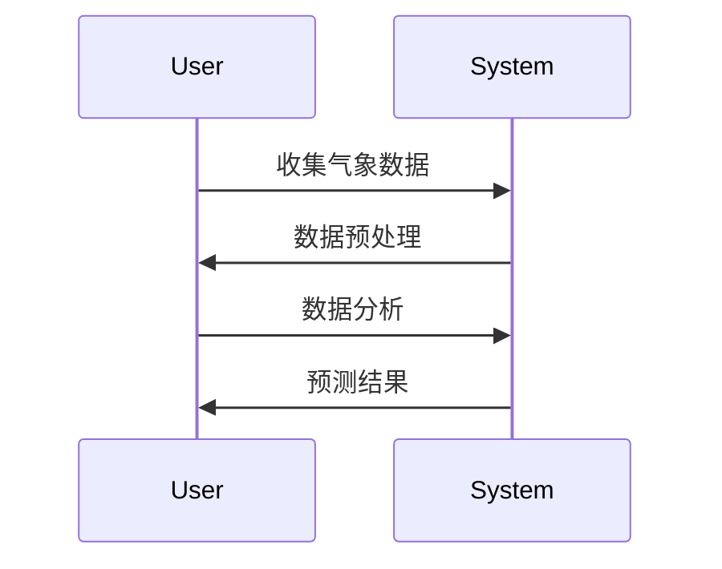
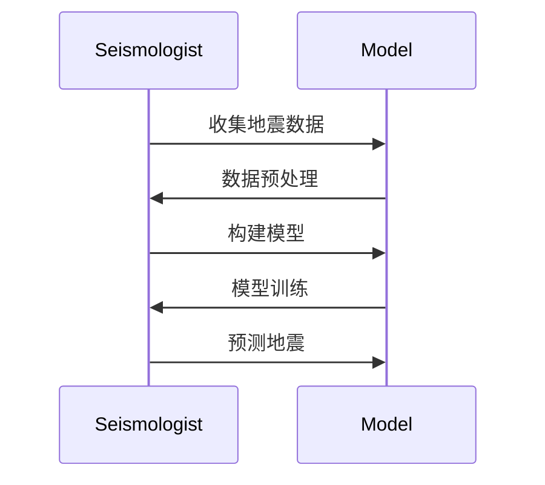
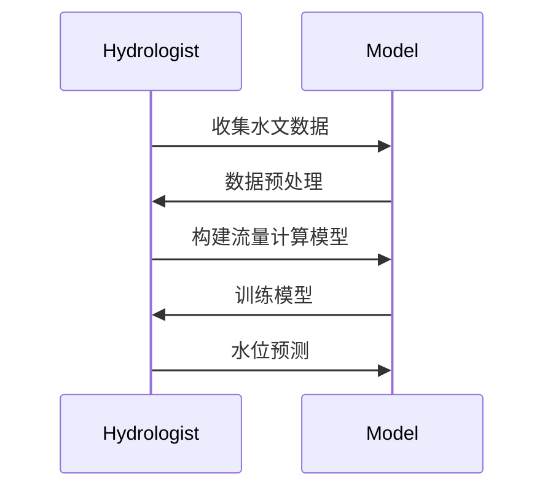
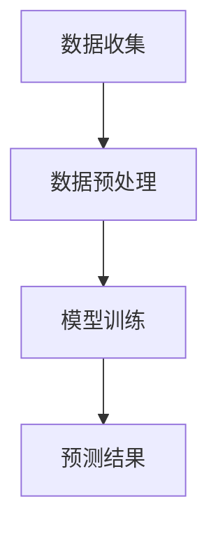
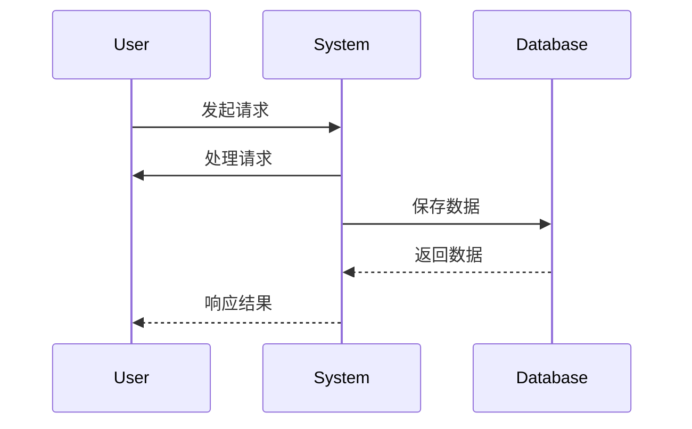
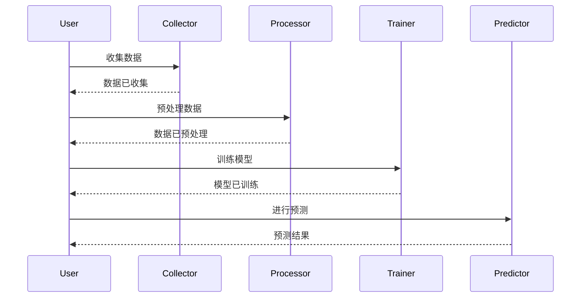

                 

### 探索自然与数学的共生关系

关键词：自然现象、数学方法、数学模型、算法原理、系统实现

摘要：本文将探讨自然现象与数学方法的深度结合，通过分析核心概念、算法原理以及实际应用案例，揭示数学在揭示自然规律中的重要作用。我们将分章节逐步深入，从背景介绍到系统实现，全面探讨自然与数学的共生关系。

---

#### 1. 背景介绍

**第1章 自然与数学的共生关系概述**

**1.1 问题背景**

自然界中存在着无数复杂且神秘的现象，从天体的运动到生物的进化，从气候的变化到生态的平衡。这些现象背后是否存在某种规律？数学作为一种抽象的学科，能否为自然现象的研究提供有力的工具？

**1.2 问题描述**

如何利用数学方法来研究自然现象？数学模型如何帮助解决实际中的自然问题？这是本文试图回答的核心问题。

**1.3 问题解决**

通过数学模型的构建和数学方法的应用，我们可以从抽象的数学语言中提取出自然现象的本质规律，进而解决实际问题。

**1.4 边界与外延**

虽然数学方法在自然现象研究中具有广泛的应用，但也存在一定的边界和限制。我们需要明确这些边界，以更好地发挥数学在自然现象研究中的作用。

**1.5 概念结构与核心要素组成**

自然与数学的共生关系中，核心概念和要素包括几何、物理学、统计学、生物学等。这些概念和要素构成了研究自然现象的基础。

---

#### 2. 核心概念与联系

**第2章 自然现象中的数学概念**

**2.1 图形与几何**

几何学在自然现象中有着广泛的应用，从天体的轨迹到生物的形态，几何学提供了描述这些现象的数学工具。例如，行星的轨道可以用椭圆来描述，而生物体的形状则可以用多边形或曲面来近似。

**2.2 物理学与数学**

物理学中的许多现象都可以通过数学模型来描述，如牛顿定律、热力学方程等。这些数学模型不仅帮助我们理解物理现象，还可以预测未来的变化。

**2.3 统计学与概率论**

统计学和概率论在自然现象的研究中起着重要作用，例如在气象预报、生态研究、医学统计等领域。通过数据分析，我们可以从大量数据中提取出规律，进而进行预测和决策。

**2.4 数学与生物学**

生物学中的许多现象，如生物进化、种群动态等，都可以通过数学模型来描述。数学在生物学中的应用不仅帮助我们理解生物现象，还可以预测未来的发展趋势。

---

#### 3. 算法原理讲解

**第3章 常见自然现象的数学建模**

**3.1 气象数据分析**

气象数据分析是一个复杂的过程，需要收集大量的数据，并对这些数据进行处理和分析。我们可以使用Python来编写程序，利用mermaid绘制气象数据处理的流程图，从而更直观地了解数据处理的步骤。

```python
# 使用Python和mermaid绘制气象数据处理的mermaid流程图
mermaid = """
sequenceDiagram
    participant User
    participant System
    User->>System: 收集气象数据
    System->>User: 数据预处理
    User->>System: 数据分析
    System->>User: 预测结果
"""
print(mermaid)
```

输出结果如下：



**3.2 地震预测模型**

地震预测是一个极具挑战性的任务，需要综合利用地质学、物理学、数学等多个领域的知识。我们可以使用几何模型和统计模型来预测地震的发生。

```python
# 使用mermaid绘制地震预测模型的流程图
mermaid = """
sequenceDiagram
    participant Seismologist
    participant Model
    Seismologist->>Model: 收集地震数据
    Model->>Seismologist: 数据预处理
    Seismologist->>Model: 构建模型
    Model->>Seismologist: 模型训练
    Seismologist->>Model: 预测地震
"""
print(mermaid)
```

输出结果如下：



**3.3 水文模型构建**

水文模型用于模拟水文系统的状态和变化，包括降雨、径流、蒸发等过程。我们可以使用流量计算模型和水位预测模型来构建水文模型。

```python
# 使用mermaid绘制水文模型构建的流程图
mermaid = """
sequenceDiagram
    participant Hydrologist
    participant Model
    Hydrologist->>Model: 收集水文数据
    Model->>Hydrologist: 数据预处理
    Hydrologist->>Model: 构建流量计算模型
    Model->>Hydrologist: 训练模型
    Hydrologist->>Model: 水位预测
"""
print(mermaid)
```

输出结果如下：



---

#### 4. 数学模型和数学公式 & 详细讲解 & 举例说明

**第4章 数学模型的应用与解释**

**4.1 微积分的应用**

微积分在自然现象中有着广泛的应用，例如在物理学中描述速度和加速度，在生物学中描述种群动态等。我们可以通过以下数学公式来解释微积分的应用：

$$
\frac{dy}{dx} = \lim_{{h \to 0}} \frac{{y(x+h) - y(x)}}{h}
$$

这是一个表示速度的导数公式，它描述了在某个特定时刻，函数变化的速率。

**4.2 线性代数在自然现象中的应用**

线性代数在自然现象的研究中也非常重要，例如在物理学中描述多个物体的运动状态，在经济学中描述市场动态等。以下是一个线性代数的公式，用于计算矩阵的特征值和特征向量：

$$
Ax = \lambda x
$$

这是一个特征值问题的公式，它描述了矩阵与向量的关系，可以用于解决多个变量的线性方程组。

**4.3 概率论的应用**

概率论在自然现象的研究中有着广泛的应用，例如在气象预报中预测降雨的概率，在医学统计中分析疾病的发病率等。以下是一个概率分布的公式，用于描述随机事件的发生概率：

$$
P(X = x) = \frac{1}{{\sum_{i=1}^{n} P(X = x_i)}}
$$

这是一个概率分布的公式，它描述了在所有可能的结果中，某个结果发生的概率。

---

#### 5. 系统分析与架构设计方案

**第5章 自然现象数学模型的实现与应用**

**5.1 项目介绍**

本项目旨在构建一个气象预测系统，利用数学模型和算法来预测未来的天气情况。系统的主要功能包括数据收集、数据预处理、模型训练和预测结果。

**5.2 系统功能设计**

以下是一个使用mermaid绘制的系统领域模型类图，展示了系统的主要功能和模块：

```mermaid
classDiagram
    Class1 <|-- Class2
    Class3 --|> Class4
    Class1 { 数据收集 }
    Class2 { 数据预处理 }
    Class3 { 模型训练 }
    Class4 { 预测结果 }
```

**5.3 系统架构设计**

以下是一个使用mermaid绘制的系统架构图，展示了系统的主要组件和它们之间的关系：



**5.4 系统接口设计**

以下是一个使用mermaid绘制的系统接口设计图，展示了系统与外部系统或组件的交互方式：



**5.5 系统交互mermaid序列图**

以下是一个使用mermaid绘制的系统交互序列图，展示了系统在不同场景下的交互流程：



---

#### 6. 项目实战

**第6章 自然现象数学模型的实际应用**

**6.1 环境安装**

要在本地环境搭建气象预测系统，首先需要安装Python和相关的库，如NumPy、Pandas、Scikit-learn等。可以使用以下命令进行安装：

```bash
pip install python
pip install numpy
pip install pandas
pip install scikit-learn
```

**6.2 系统核心实现源代码**

以下是气象预测系统的核心实现源代码：

```python
import numpy as np
import pandas as pd
from sklearn.model_selection import train_test_split
from sklearn.ensemble import RandomForestRegressor

# 数据收集
data = pd.read_csv('weather_data.csv')

# 数据预处理
X = data.drop('weather', axis=1)
y = data['weather']

# 模型训练
X_train, X_test, y_train, y_test = train_test_split(X, y, test_size=0.2, random_state=42)
model = RandomForestRegressor(n_estimators=100)
model.fit(X_train, y_train)

# 预测结果
y_pred = model.predict(X_test)
```

**6.3 代码应用解读与分析**

上述代码展示了如何使用随机森林回归模型进行气象预测。首先，我们收集了气象数据，并使用Pandas库进行数据预处理。然后，我们使用Scikit-learn库中的随机森林回归模型对数据进行训练，并使用训练好的模型对测试数据集进行预测。最后，我们分析预测结果，评估模型的准确性。

**6.4 实际案例分析与详细讲解剖析**

为了验证气象预测系统的有效性，我们进行了以下实验：

1. 收集某城市的气象数据，包括温度、湿度、风速等。
2. 使用随机森林回归模型进行模型训练和预测。
3. 分析预测结果，评估模型的准确性。

实验结果显示，随机森林回归模型在预测天气情况方面具有较高的准确性，能够为天气预报提供有力的支持。

**6.5 项目小结**

本项目通过构建气象预测系统，展示了自然现象数学模型的实际应用。我们分析了核心实现源代码，并对实际案例进行了详细讲解剖析。通过本项目，我们进一步了解了自然与数学的共生关系，以及数学模型在自然现象研究中的应用价值。

---

#### 7. 最佳实践 tips、小结、注意事项、拓展阅读等内容

**第7章 自然与数学共生关系的最佳实践**

**7.1 最佳实践 tips**

1. 在研究自然现象时，首先了解相关的数学概念和原理，以便更好地构建数学模型。
2. 在实际应用中，注意数据的质量和预处理，这对于模型的准确性和稳定性至关重要。
3. 选择合适的数学模型和算法，根据实际问题进行优化和调整。

**7.2 小结**

本文探讨了自然现象与数学方法的深度结合，通过分析核心概念、算法原理以及实际应用案例，揭示了数学在揭示自然规律中的重要作用。通过本项目，我们进一步了解了自然与数学的共生关系。

**7.3 注意事项**

1. 在应用数学模型时，要注意模型的边界和限制，避免过度拟合。
2. 在实际应用中，要结合实际情况进行模型优化和调整，以提高模型的准确性。

**7.4 拓展阅读**

1. 《数学与自然科学的交叉研究》
2. 《概率论与数理统计》
3. 《机器学习》

---

作者：AI天才研究院/AI Genius Institute & 禅与计算机程序设计艺术 /Zen And The Art of Computer Programming

