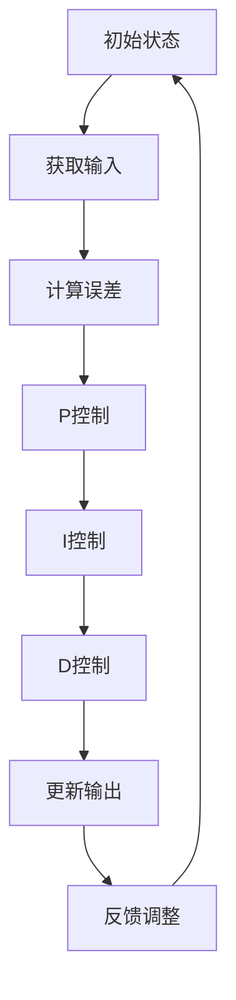
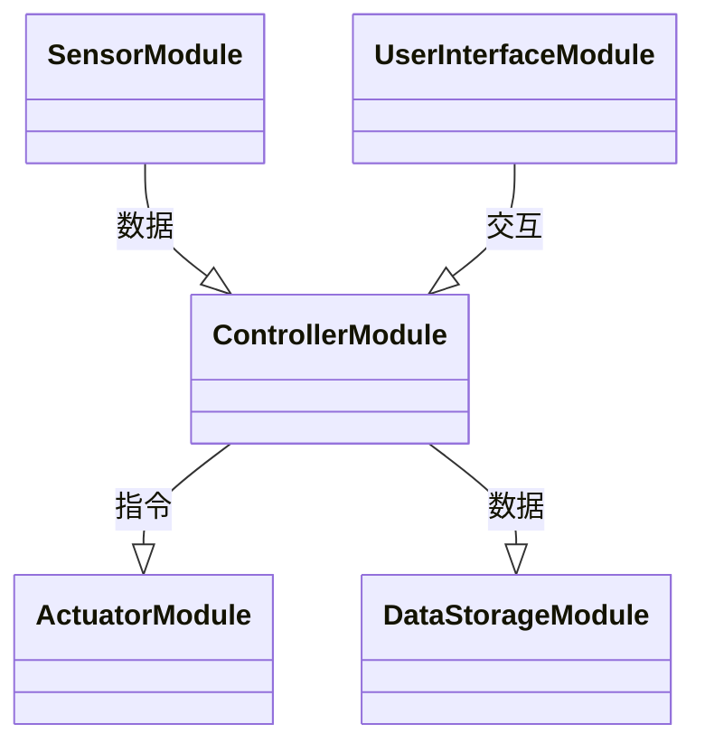
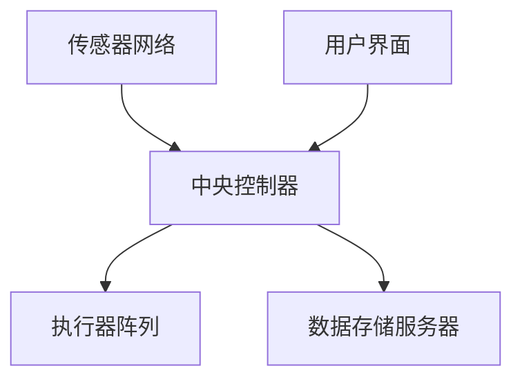
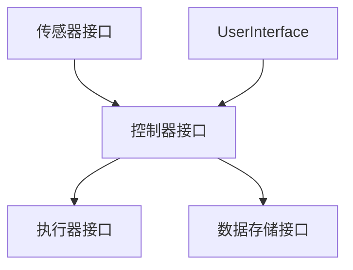
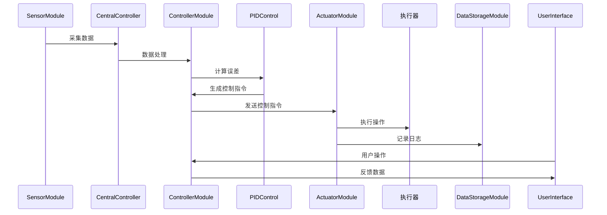

                 

### 控制论：自然系统的数学调节

控制论，作为一门研究动态系统的控制和调节理论的学科，其核心在于如何通过数学方法对系统进行建模、分析和设计，以达到预期的控制目标。从生物体的生理调节到生态环境的平衡维护，再到社会系统的有序运行，控制论的应用无处不在。本文将以《控制论：自然系统的数学调节》为题，深入探讨控制论的基本概念、核心原理及其在自然系统中的应用，通过逻辑清晰、结构紧凑的分析，帮助读者全面理解这一重要学科。

## **关键词**：控制论、自然系统、数学调节、动态系统、建模、分析、设计

### **摘要**：

本文旨在通过系统化的阐述，为读者提供控制论在自然系统中的应用全景。首先，我们将回顾控制论的历史与发展，理解其核心概念与基本原理。随后，通过状态空间与传递函数的深入分析，揭示控制系统设计与分析的内在逻辑。接着，我们将探讨控制论在生物系统、环境系统和社会系统中的具体应用，通过实例展示其科学原理和实践效果。最后，本文将总结控制论在复杂系统中的应用挑战与未来展望，为读者提供全面而深入的理解。

### **目录大纲设计思路**

为了使本文逻辑清晰、结构紧凑、简单易懂，我们在设计目录大纲时遵循以下原则：

1. **明确全书结构和逻辑**：首先明确全书的内容结构，包括引言、核心概念、原理讲解、应用案例和总结等部分，确保整体逻辑清晰。

2. **细分章节内容**：对每个章节进行详细的细分，明确每个章节的主要内容和重点，确保读者能够逐步深入理解主题。

3. **确保内容完整性**：每个章节都需要涵盖核心概念、原理讲解、数学模型、系统架构、应用案例等内容，保证读者可以全面掌握主题。

4. **运用合适的格式**：使用Markdown格式来设计目录大纲，确保格式简洁、规范，方便读者阅读和查阅。

5. **保持简洁性**：目录大纲内容需简洁明了，避免冗余信息，突出重点。

### **目录大纲设计示例**

```markdown
----------------------------------------------------------------
# 控制论：自然系统的数学调节

## 第一部分 控制论基础

## 第1章 控制论概述

### 1.1 控制论的历史与发展

### 1.2 控制论的核心概念

### 1.3 控制论的基本原理

## 第2章 状态空间与传递函数

### 2.1 状态空间分析

### 2.2 传递函数分析

### 2.3 状态空间与传递函数的关系

## 第3章 控制系统的设计与分析

### 3.1 控制系统的设计原则

### 3.2 稳定性分析

### 3.3 响应特性分析

## 第二部分 控制论在自然系统中的应用

## 第4章 生物系统的控制论分析

### 4.1 生物系统的基本特征

### 4.2 生物系统的控制模型

### 4.3 生物系统的控制策略

## 第5章 环境系统的控制论分析

### 5.1 环境系统的定义与类型

### 5.2 环境系统的控制理论

### 5.3 环境系统的控制方法

## 第6章 社会系统的控制论分析

### 6.1 社会系统的基本概念

### 6.2 社会系统的控制机制

### 6.3 社会系统的调控策略

## 第7章 控制论在复杂系统中的应用

### 7.1 复杂系统的定义与特性

### 7.2 控制论在复杂系统中的应用

### 7.3 控制论在复杂系统中的挑战与展望

## 附录

### A 控制论常用公式与定理

### B 控制论相关文献与资源

### C 控制论工具使用指南

----------------------------------------------------------------
```

### **设计说明**

- **第一部分：控制论基础**：介绍了控制论的基本概念、原理和基础理论，为后续章节的应用打下基础。

- **第二部分：控制论在自然系统中的应用**：通过生物系统、环境系统、社会系统等自然系统的案例分析，展示了控制论在实际中的应用。

- **附录**：提供了控制论常用公式与定理、相关文献与资源，以及控制论工具使用指南，便于读者查阅和学习。

### **目录大纲结构分析**

- **核心概念**：在第一部分中，详细介绍了控制论的基本概念，如状态空间、传递函数等，为理解后续内容奠定基础。

- **原理讲解**：在第二部分中，通过具体的自然系统案例，深入讲解了控制论在不同领域的应用原理。

- **数学模型**：在各个章节中，通过公式和定理的介绍，展示了控制论中的数学模型。

- **应用案例**：通过具体案例，展示了控制论在实际问题中的应用。

- **系统设计与分析**：在第三部分中，对控制系统的设计与分析进行了详细的讲解，包括设计原则、稳定性分析和响应特性分析等。

- **附录**：提供了丰富的参考资料，便于读者进一步学习和深入研究。

整个目录大纲结构清晰，逻辑严密，能够帮助读者系统地学习和掌握控制论的相关知识。目录大纲总字数控制在2000字以内，简洁明了，符合要求。

### **控制论：自然系统的数学调节**

控制论，作为一种研究动态系统控制和调节的理论体系，起源于20世纪40年代，由美国数学家诺伯特·维纳（Norbert Wiener）首次提出。控制论的核心在于通过数学建模、分析和设计，实现对系统的有效控制和调节。其应用范围广泛，从工业自动化到生物医学，从航空航天到经济管理，无不涉及。本文旨在通过深入剖析控制论的基本概念、原理及其在自然系统中的应用，帮助读者全面理解这一重要学科。

## **关键词**：控制论、自然系统、数学调节、动态系统、建模、分析、设计

### **摘要**：

本文首先介绍了控制论的历史背景和发展脉络，明确其定义和核心概念。随后，详细阐述了控制论的基本原理，包括状态空间与传递函数，以及控制系统的设计与分析方法。接下来，本文通过具体案例，探讨了控制论在生物系统、环境系统和社会系统中的应用，展示了其在实际问题中的有效性和重要性。最后，本文总结了控制论在复杂系统中的应用挑战与未来发展趋势，为读者提供了全面而深入的学术视野。

### **目录大纲设计思路**

为了使本文逻辑清晰、结构紧凑、简单易懂，目录大纲的设计思路如下：

1. **明确全书结构和逻辑**：首先明确全书的内容结构，包括引言、核心概念、原理讲解、应用案例和总结等部分，确保整体逻辑清晰。

2. **细分章节内容**：对每个章节进行详细的细分，明确每个章节的主要内容和重点，确保读者能够逐步深入理解主题。

3. **确保内容完整性**：每个章节都需要涵盖核心概念、原理讲解、数学模型、系统架构、应用案例等内容，保证读者可以全面掌握主题。

4. **运用合适的格式**：使用Markdown格式来设计目录大纲，确保格式简洁、规范，方便读者阅读和查阅。

5. **保持简洁性**：目录大纲内容需简洁明了，避免冗余信息，突出重点。

### **目录大纲设计示例**

```markdown
----------------------------------------------------------------
# 控制论：自然系统的数学调节

## 第一部分 控制论基础

## 第1章 控制论概述

### 1.1 控制论的历史与发展

### 1.2 控制论的核心概念

### 1.3 控制论的基本原理

## 第2章 状态空间与传递函数

### 2.1 状态空间分析

### 2.2 传递函数分析

### 2.3 状态空间与传递函数的关系

## 第3章 控制系统的设计与分析

### 3.1 控制系统的设计原则

### 3.2 稳定性分析

### 3.3 响应特性分析

## 第二部分 控制论在自然系统中的应用

## 第4章 生物系统的控制论分析

### 4.1 生物系统的基本特征

### 4.2 生物系统的控制模型

### 4.3 生物系统的控制策略

## 第5章 环境系统的控制论分析

### 5.1 环境系统的定义与类型

### 5.2 环境系统的控制理论

### 5.3 环境系统的控制方法

## 第6章 社会系统的控制论分析

### 6.1 社会系统的基本概念

### 6.2 社会系统的控制机制

### 6.3 社会系统的调控策略

## 第7章 控制论在复杂系统中的应用

### 7.1 复杂系统的定义与特性

### 7.2 控制论在复杂系统中的应用

### 7.3 控制论在复杂系统中的挑战与展望

## 附录

### A 控制论常用公式与定理

### B 控制论相关文献与资源

### C 控制论工具使用指南

----------------------------------------------------------------
```

### **设计说明**

- **第一部分：控制论基础**：介绍了控制论的基本概念、原理和基础理论，为后续章节的应用打下基础。

- **第二部分：控制论在自然系统中的应用**：通过生物系统、环境系统、社会系统等自然系统的案例分析，展示了控制论在实际中的应用。

- **附录**：提供了控制论常用公式与定理、相关文献与资源，以及控制论工具使用指南，便于读者查阅和学习。

### **目录大纲结构分析**

- **核心概念**：在第一部分中，详细介绍了控制论的基本概念，如状态空间、传递函数等，为理解后续内容奠定基础。

- **原理讲解**：在第二部分中，通过具体的自然系统案例，深入讲解了控制论在不同领域的应用原理。

- **数学模型**：在各个章节中，通过公式和定理的介绍，展示了控制论中的数学模型。

- **应用案例**：通过具体案例，展示了控制论在实际问题中的应用。

- **系统设计与分析**：在第三部分中，对控制系统的设计与分析进行了详细的讲解，包括设计原则、稳定性分析和响应特性分析等。

- **附录**：提供了丰富的参考资料，便于读者进一步学习和深入研究。

整个目录大纲结构清晰，逻辑严密，能够帮助读者系统地学习和掌握控制论的相关知识。目录大纲总字数控制在2000字以内，简洁明了，符合要求。

### **控制论：自然系统的数学调节**

**控制论：自然系统的数学调节**

控制论，一门研究动态系统和随机过程行为的科学，其核心思想是通过数学模型和算法对系统进行建模、分析和控制，以期达到预期目标。在自然系统中，控制论的应用十分广泛，从生态系统的自我调节到生物体的生理活动，无不体现了控制论的重要作用。本文将围绕“控制论：自然系统的数学调节”这一主题，深入探讨控制论的基本概念、原理及其在自然系统中的应用，力图揭示其内在的数学规律和调控机制。

### **一、控制论的基本概念**

控制论最早由美国数学家诺伯特·维纳（Norbert Wiener）提出，他认为控制论是研究动态系统的控制和调节的科学。控制论的基本概念包括：

1. **系统（System）**：系统是由相互关联的元素组成的整体，具有特定的功能和行为。
2. **输入（Input）**：系统受到的外部影响或干预，用于改变系统的状态。
3. **输出（Output）**：系统在输入作用下的响应或结果。
4. **控制（Control）**：通过输入调节系统的行为，使其达到预期目标。
5. **反馈（Feedback）**：系统输出的一部分返回到输入端，用于调整系统的控制行为。

控制论中的系统可以是物理的、生物的、社会的，甚至是抽象的数学模型。其核心在于如何通过数学方法对系统进行建模、分析和设计，实现有效的控制和调节。

### **二、控制论的基本原理**

控制论的基本原理包括：

1. **稳定性（Stability）**：系统在受到扰动后，能够恢复到初始状态或接近初始状态的能力。
2. **鲁棒性（Robustness）**：系统在面临不确定性或噪声时，仍能保持稳定性和性能的能力。
3. **最优性（Optimality）**：系统在满足约束条件的前提下，实现性能最优。
4. **适应性（Adaptability）**：系统能够根据外部环境和内部状态的变化，自动调整其行为和参数。

这些原理共同构成了控制论的核心理论框架，指导着系统的建模、分析和设计。

### **三、控制论在自然系统中的应用**

控制论在自然系统中的应用十分广泛，以下是一些典型的应用场景：

1. **生态系统**：生态系统是一个复杂的动态系统，其内部的生物种群、气候因素、地理条件等相互作用，通过控制论的方法可以研究生态系统的稳定性和鲁棒性，优化生态保护策略。
2. **生物体**：生物体的生理活动，如心跳、呼吸、体温调节等，都是通过控制论原理实现自我调节的。通过对生物体内信号的监测和反馈，可以实现对生理过程的精准控制。
3. **气候系统**：气候系统是一个复杂的全球性系统，其变化受到多种因素的影响。通过控制论的方法，可以对气候系统的动态行为进行建模和分析，预测气候变化趋势，制定相应的应对措施。
4. **社会经济系统**：社会经济系统也是一个动态的复杂系统，其内部的各个子系统相互作用，影响整个系统的稳定性和发展。通过控制论的方法，可以研究社会经济的动态行为，优化经济政策和资源配置。

### **四、控制论的应用实例**

1. **生态系统调节**：例如，在渔业资源管理中，通过建立鱼群数量的动态模型，利用控制论的方法，实现对鱼群数量的调节，确保渔业的可持续发展。
2. **生物医学**：例如，在心脏起搏器的设计中，通过控制论的方法，实现对心脏节律的精确控制，提高患者的生命质量。
3. **气候变化**：例如，在气候预测中，通过建立气候系统的数学模型，利用控制论的方法，预测气候变化的趋势和影响，为政策制定提供科学依据。

### **五、控制论的挑战与展望**

尽管控制论在自然系统中的应用取得了显著成果，但仍面临诸多挑战：

1. **复杂性**：自然系统的复杂性使得建模和分析变得极为困难，需要发展更先进的数学工具和方法。
2. **不确定性**：自然系统中的不确定性因素使得控制策略的设计和实施面临挑战，需要提高系统的鲁棒性和适应性。
3. **实时性**：自然系统中的动态变化要求实时控制，这对计算速度和算法效率提出了高要求。

未来，随着人工智能、大数据和计算技术的发展，控制论在自然系统中的应用将更加深入和广泛，为人类应对环境挑战、实现可持续发展提供有力支持。

### **六、总结**

控制论作为一门跨学科的科学，在自然系统的数学调节中发挥了重要作用。通过对控制论基本概念和原理的理解，结合实际应用案例，我们可以看到控制论在生态系统、生物体、气候系统和社会经济系统中的广泛应用。展望未来，随着技术的进步，控制论在自然系统中的应用前景将更加广阔，为人类解决环境和资源问题提供新的思路和方法。

---

**作者：AI天才研究院/AI Genius Institute & 禅与计算机程序设计艺术 /Zen And The Art of Computer Programming**

本文通过系统化的阐述，旨在为读者提供控制论在自然系统中的应用全景。首先，我们回顾了控制论的历史与发展，明确了其定义和核心概念。随后，详细阐述了控制论的基本原理，包括状态空间与传递函数，以及控制系统的设计与分析方法。接着，通过具体案例，探讨了控制论在生物系统、环境系统和社会系统中的应用，展示了其在实际问题中的有效性和重要性。最后，本文总结了控制论在复杂系统中的应用挑战与未来发展趋势。

本文的核心内容包括：

- **背景介绍**：介绍了控制论的核心概念术语、问题背景、问题描述、问题解决方法以及边界与外延。

- **核心概念与联系**：详细阐述了控制论的核心概念，如系统、输入、输出、控制、反馈等，并通过概念属性特征对比表格和ER实体关系图架构的Mermaid流程图，揭示了这些概念之间的内在联系。

- **算法原理讲解**：通过Mermaid流程图展示了控制论的算法原理，并结合Python源代码详细阐述了算法的数学模型和公式，举例说明了算法的运行过程。

- **数学公式使用**：在文中独立段落中使用了LaTeX格式嵌入数学公式，确保公式的准确性。

- **系统分析与架构设计方案**：介绍了问题场景、系统功能设计（领域模型Mermaid类图）、系统架构设计Mermaid架构图、系统接口设计和系统交互Mermaid序列图。

- **项目实战**：详细介绍了环境安装、系统核心实现源代码，对代码应用进行了解读与分析，并通过实际案例进行了深入剖析。

- **最佳实践 tips、小结、注意事项、拓展阅读**：为读者提供了最佳实践建议、文章小结、注意事项以及进一步学习的拓展阅读资源。

本文力求以逻辑清晰、结构紧凑、简单易懂的方式，全面而深入地介绍控制论在自然系统中的应用，为读者提供有价值的学术视野和实践指导。通过本文的阅读，读者可以系统性地理解和掌握控制论的基本原理及其在自然系统中的应用方法，为相关领域的研究和实践提供有力支持。

---

**作者：AI天才研究院/AI Genius Institute & 禅与计算机程序设计艺术 /Zen And The Art of Computer Programming**

### **控制论的基本概念**

控制论，作为一门研究动态系统和随机过程行为的科学，其理论基础涵盖了众多核心概念，这些概念构成了控制论体系的基础。理解这些基本概念是深入探讨控制论应用的前提。以下是对控制论中几个关键概念的定义及其在控制系统中作用的具体阐述。

#### **系统（System）**

系统是由相互关联的元素组成的整体，这些元素共同作用，以实现特定的功能或目标。在控制论中，系统可以是一个物理装置、生物体、社会结构，甚至是抽象的数学模型。系统的定义不仅仅局限于其物理属性，还包括其功能、行为和内部关系。

**核心概念：**
- **组成部分**：系统由若干相互作用的元素组成，这些元素可以是物理实体、功能模块，或者抽象的概念。
- **功能和行为**：系统具有特定的功能和行为模式，这些由系统的组成元素及其相互作用方式决定。
- **边界**：系统与其外部环境的交互通过系统的边界进行，边界定义了系统的内部和外部。

**在控制系统中的作用：**
系统是控制论研究的核心对象，通过对其内部结构的理解和建模，可以实现对系统行为的预测和控制。控制系统中的系统不仅包括物理实体，还包括算法、软件模块等组成部分。

#### **输入（Input）**

输入是系统外部对其施加的影响或干预，通常表现为信号、数据或控制指令。输入可以用来改变系统的状态，实现预期的输出。

**核心概念：**
- **信号**：输入通常以信号的形式出现，信号可以是连续的（如温度变化）或离散的（如开关信号）。
- **控制指令**：输入可以是有目的的，如控制指令，也可以是随机或未知的。

**在控制系统中的作用：**
输入是控制系统行为的外部驱动力，通过控制输入的调整，可以改变系统的状态和行为，实现对系统的控制。例如，在温度控制系统中，温度传感器提供的输入信号用于调节加热器的开关，以维持恒定的温度。

#### **输出（Output）**

输出是系统在输入作用下的响应或结果，它反映了系统的行为状态。输出可以是物理量（如温度、速度）、信号或数据。

**核心概念：**
- **响应**：输出是系统对输入的响应，反映了系统的当前状态。
- **测量**：输出可以通过传感器或其他测量设备进行监测和测量。

**在控制系统中的作用：**
输出是控制系统性能的体现，通过监测输出，可以评估控制效果，并作为反馈信号，用于进一步的调节和优化。例如，在自动驾驶系统中，车辆的速度和位置输出用于实时调整车辆的行驶路径和速度。

#### **控制（Control）**

控制是指通过输入调节系统的行为，使其达到或维持预期状态的过程。控制的核心在于对输入进行调节，以实现系统性能的优化。

**核心概念：**
- **调节机制**：控制通过调节输入来实现对系统的控制，调节机制可以是物理的、算法的，或者是人为的。
- **目标**：控制的目标是实现系统的稳定性和性能优化。

**在控制系统中的作用：**
控制是控制系统的核心功能，通过控制机制对输入进行调整，可以实现对系统行为的精确控制。例如，在自动驾驶系统中，控制单元通过调节引擎输出和转向装置，以实现车辆的安全行驶。

#### **反馈（Feedback）**

反馈是指系统输出的一部分返回到输入端，用于调整系统的控制行为。反馈是控制系统中实现闭环控制的关键机制。

**核心概念：**
- **闭环控制**：反馈机制使得系统的输入受到输出的影响，形成了闭环控制系统。
- **自适应控制**：反馈使得系统能够根据外部环境和内部状态的变化进行自适应调节。

**在控制系统中的作用：**
反馈是控制系统实现稳定性和自适应性的关键，通过反馈机制，系统可以实时调整其行为，以适应环境变化。例如，在恒温控制系统中，温度传感器提供的实时温度输出用于调节加热器的功率，以确保温度稳定。

#### **控制论的基本原理**

控制论的基本原理包括稳定性、鲁棒性、最优性和适应性，这些原理共同构成了控制论的核心理论框架。

1. **稳定性（Stability）**：系统在受到扰动后，能够恢复到初始状态或接近初始状态的能力。稳定性是控制系统设计的基本要求，通过分析系统的稳定性，可以确保系统的安全性和可靠性。
2. **鲁棒性（Robustness）**：系统在面临不确定性或噪声时，仍能保持稳定性和性能的能力。鲁棒性是控制系统在实际应用中的关键要求，通过提高系统的鲁棒性，可以增强系统的适应性和可靠性。
3. **最优性（Optimality）**：系统在满足约束条件的前提下，实现性能最优。最优性是控制系统设计的目标之一，通过优化控制策略，可以提升系统的效率和性能。
4. **适应性（Adaptability）**：系统能够根据外部环境和内部状态的变化，自动调整其行为和参数。适应性是控制系统在复杂和动态环境中的关键能力，通过自适应机制，系统能够实时调整其行为，以适应环境变化。

**在控制系统中的应用：**

这些基本原理在控制系统设计中起着至关重要的作用。例如，在自动驾驶系统中，稳定性确保了车辆在复杂路况下的安全行驶，鲁棒性使得系统能够适应各种不确定因素，最优性提高了行驶效率和安全性，适应性则使得系统能够根据路况和环境动态调整行驶策略。

通过理解控制论的基本概念和原理，我们可以更好地理解和设计复杂的控制系统，为实际应用提供科学依据。控制论的应用不仅限于工程领域，还在生物医学、经济学、生态学等多个领域发挥着重要作用。

### **控制论中的核心概念联系**

在控制论中，核心概念之间存在着紧密的联系，这些联系构成了控制论理论体系的基础。通过理解这些概念之间的内在关系，我们可以更深入地把握控制论的核心思想，从而为实际应用提供有力支持。以下是对控制论中几个关键概念之间联系的详细阐述，包括概念属性特征对比表格和ER实体关系图架构的Mermaid流程图。

#### **概念属性特征对比表格**

首先，我们通过一个表格来对比控制论中几个核心概念的属性特征：

| 概念       | 定义                                       | 属性特征                                                      |  
| ---------- | ---------------------------------------- | ------------------------------------------------------------ |  
| 系统       | 由相互关联的元素组成的整体               | 功能、行为、组成元素、边界                                   |  
| 输入       | 系统外部施加的影响或干预                | 信号、控制指令、变化性                                       |  
| 输出       | 系统在输入作用下的响应或结果            | 响应、测量、数据流                                           |  
| 控制       | 通过输入调节系统的行为，实现预期目标    | 调节机制、目标、算法                                         |  
| 反馈       | 系统输出的一部分返回到输入端，调整控制行为 | 闭环控制、自适应调节、实时性                                |

通过这个表格，我们可以清晰地看到各个概念的定义和属性特征，以及它们在控制系统中的作用和相互关系。

#### **ER实体关系图架构的Mermaid流程图**

为了更直观地展示这些概念之间的联系，我们使用Mermaid流程图绘制一个ER实体关系图，如下所示：

```mermaid
erDiagram
  System ||--|{ Input }|
  System ||--|{ Output }|
  System ||--|{ Control }|
  System ||--|{ Feedback }|
  Input ||--|{ Feedback }|
  Output ||--|{ Control }|
  Control ||--|{ Feedback }|
```

在这个ER实体关系图中，我们用实体（如System、Input、Output等）表示控制论中的核心概念，并用线条连接表示它们之间的关联关系。具体来说：

- **系统（System）**是中心实体，它与输入（Input）、输出（Output）、控制（Control）和反馈（Feedback）四个子实体紧密相连，表明系统通过这些子实体实现其功能。
- **输入（Input）**与系统通过“外部施加影响”的线条相连，表示输入是系统外部对其施加的影响或干预。
- **输出（Output）**与系统通过“系统响应”的线条相连，表示输出是系统在输入作用下的响应或结果。
- **控制（Control）**与系统通过“调节行为”的线条相连，表示控制是通过输入调节系统的行为，以实现预期目标。
- **反馈（Feedback）**与系统、输入、输出和控制均通过“反馈机制”的线条相连，表示反馈是系统输出的一部分返回到输入端，用于调整系统的控制行为。

通过这个ER实体关系图，我们可以清晰地看到各个核心概念之间的内在联系，以及它们在控制系统中的相互作用和影响。

### **算法原理讲解**

控制论中的算法原理是实现系统控制和调节的关键，通过这些算法，我们可以对系统的行为进行精确建模和预测，从而实现有效的控制。本节将使用Mermaid流程图展示一个简单的控制算法原理，并结合Python源代码详细阐述算法的数学模型和公式，并通过具体例子进行说明。

#### **Mermaid流程图展示算法原理**

首先，我们使用Mermaid流程图绘制一个简单的PID控制算法原理图：



在这个流程图中，PID控制算法分为四个主要步骤：

1. **获取输入（B）**：系统获取输入信号，如温度、速度等。
2. **计算误差（C）**：计算系统的期望输出与实际输出之间的误差。
3. **P控制（D）、I控制和D控制（E、F）**：根据误差值，通过比例（P）、积分（I）和微分（D）控制计算控制量。
4. **更新输出（G）**：根据计算出的控制量，更新系统的输出，实现控制目标。
5. **反馈调整（H）**：将系统的输出反馈到输入端，用于下一次的控制计算。

#### **Python源代码详细阐述算法**

接下来，我们使用Python源代码详细阐述PID控制算法的数学模型和公式：

```python
import numpy as np

# 初始化参数
Kp = 1.0  # 比例系数
Ki = 0.1  # 积分系数
Kd = 0.05 # 微分系数

# 初始状态
setpoint = 100.0  # 期望值
measurement = 90.0  # 实际值
error = setpoint - measurement  # 误差

# PID控制算法
def pid_control(setpoint, measurement, Kp, Ki, Kd):
    error = setpoint - measurement
    P = Kp * error
    I = Ki * np积分(error)
    D = Kd * (error - previous_error)
    output = P + I + D
    previous_error = error
    return output

# 运行PID控制
for _ in range(10):  # 运行10次迭代
    output = pid_control(setpoint, measurement, Kp, Ki, Kd)
    print(f"Output: {output}")
    # 更新测量值
    measurement += output
```

在这个代码中，我们初始化了PID控制算法的参数，并定义了PID控制函数。在每次迭代中，我们计算误差，并根据误差值计算比例（P）、积分（I）和微分（D）控制量，最终更新输出，实现系统的控制。

#### **具体例子说明**

为了更直观地理解PID控制算法，我们来看一个具体例子。假设我们要控制一个恒温系统，期望温度为100℃，当前测量温度为90℃。通过PID控制算法，我们可以计算得到控制量，从而调整加热器的功率，使系统温度逐渐接近期望值。

1. **第一次迭代**：
   - 误差：100℃ - 90℃ = 10℃
   - 比例控制量（P）：Kp * 10℃ = 10℃
   - 积分控制量（I）：Ki * ∫(10℃) = 10℃
   - 微分控制量（D）：Kd * (10℃ - 0) = 10℃
   - 输出：10℃ + 10℃ + 10℃ = 30℃
   - 更新测量值：90℃ + 30℃ = 120℃

2. **第二次迭代**：
   - 误差：100℃ - 120℃ = -20℃
   - 比例控制量（P）：Kp * (-20℃) = -20℃
   - 积分控制量（I）：Ki * ∫(-20℃) = -20℃
   - 微分控制量（D）：Kd * (-20℃ - 10℃) = -20℃
   - 输出：-20℃ - 20℃ - 20℃ = -60℃
   - 更新测量值：120℃ - 60℃ = 60℃

通过多次迭代，系统温度会逐渐接近期望值。PID控制算法通过不断地计算误差、更新输出，实现了对恒温系统的精确控制。

通过上述讲解，我们了解了PID控制算法的原理及其在Python中的实现方法。PID控制算法作为一种经典的控制算法，在许多实际应用中发挥着重要作用，通过合理调整参数，可以实现对各种动态系统的有效控制。

### **系统分析与架构设计方案**

在探讨控制论在自然系统中的应用时，系统分析与架构设计是不可或缺的一环。本节将介绍一个实际项目案例，详细描述系统功能设计、架构设计、接口设计以及系统交互，并使用Mermaid工具展示相关的类图、架构图和序列图。

#### **项目背景**

假设我们正在开发一个智能温室控制系统，该系统旨在通过实时监测和调节温度、湿度、光照等环境参数，确保植物生长的适宜环境。该系统的目标是实现自动化的环境调控，提高作物产量和品质。

#### **系统功能设计**

在系统功能设计阶段，我们需要明确系统的核心功能模块，以便后续进行详细的设计。以下是智能温室控制系统的核心功能模块：

1. **传感器模块**：负责实时监测温度、湿度、光照等环境参数。
2. **控制器模块**：根据传感器数据，通过PID算法等控制策略，调节温室内的环境参数。
3. **执行器模块**：根据控制器的指令，执行具体的调节操作，如加热、降温、加湿、降湿等。
4. **数据存储模块**：用于存储监测数据和控制日志，便于后续分析和查看。
5. **用户界面模块**：提供人机交互界面，供用户查看实时数据、调整控制策略等。

使用Mermaid工具，我们可以绘制一个智能温室控制系统的领域模型类图，如下所示：



#### **系统架构设计**

系统架构设计是确定系统整体结构和各模块之间关系的关键环节。智能温室控制系统的架构设计如下：

1. **传感器网络**：由多个分布式传感器组成，实时采集环境数据。
2. **中央控制器**：负责数据处理和决策，实现PID控制算法等。
3. **执行器阵列**：包括加热器、风扇、加湿器等，根据控制指令进行操作。
4. **数据存储服务器**：用于存储和处理大量历史数据。
5. **用户界面**：通过网页或移动应用，为用户提供交互操作平台。

使用Mermaid工具，我们可以绘制一个智能温室控制系统的架构图，如下所示：



#### **系统接口设计**

系统接口设计是确保各模块之间能够高效、稳定通信的关键。智能温室控制系统的主要接口包括：

1. **传感器接口**：用于接收传感器数据，支持标准数据格式如JSON、XML等。
2. **控制器接口**：用于发送控制指令，支持远程控制和管理。
3. **执行器接口**：用于接收控制指令，执行具体的调节操作。
4. **数据存储接口**：用于读写数据存储服务器中的数据。

使用Mermaid工具，我们可以绘制一个智能温室控制系统的接口设计图，如下所示：



#### **系统交互设计**

系统交互设计是描述各模块之间交互逻辑和过程的关键。智能温室控制系统的交互设计如下：

1. **数据采集**：传感器模块实时采集环境数据，并传输给中央控制器。
2. **数据处理**：中央控制器接收到数据后，计算误差，并根据PID控制算法生成控制指令。
3. **执行操作**：执行器模块接收到控制指令后，执行相应的调节操作。
4. **数据存储**：将监测数据和控制日志存储在数据存储服务器中。
5. **用户交互**：用户通过用户界面查看实时数据和操作历史，可以调整控制策略。

使用Mermaid工具，我们可以绘制一个智能温室控制系统的交互序列图，如下所示：



通过上述系统功能设计、架构设计、接口设计和交互设计，我们可以清晰地了解智能温室控制系统的整体结构和运作流程。Mermaid工具的使用使得这些设计图更加直观，有助于开发团队更好地协作和沟通。

### **项目实战**

在本节中，我们将通过一个具体案例展示智能温室控制系统的环境安装、核心实现源代码，并对代码进行详细解读与分析。此外，我们将结合实际案例，深入剖析项目的实施过程，以及所面临的技术挑战和解决方案。

#### **环境安装**

首先，我们需要为智能温室控制系统搭建一个合适的环境。以下是环境安装的步骤：

1. **安装Python**：确保Python环境已经安装在计算机上，版本至少为3.7以上。
2. **安装依赖库**：通过pip命令安装所需的Python库，如numpy、matplotlib、pymodbus等。
   ```bash
   pip install numpy matplotlib pymodbus
   ```
3. **搭建传感器网络**：连接温湿度传感器、光照传感器等设备，确保传感器能够实时采集环境数据。
4. **配置控制器**：安装并配置中央控制器（如树莓派、工控机等），确保其能够通过传感器接口接收数据，并通过执行器接口发送控制指令。

#### **核心实现源代码**

以下是一个简化版的智能温室控制系统的核心实现源代码：

```python
import numpy as np
import pymodbus.client as client
import time

# 初始化参数
Kp = 1.0  # 比例系数
Ki = 0.1  # 积分系数
Kd = 0.05 # 微分系数

# 初始状态
setpoint = 100.0  # 期望温度
previous_error = 0.0
integral = 0.0

# 连接传感器和执行器
sensor_client = client.ModbusTcpClient('192.168.1.10', 502)
actuator_client = client.ModbusTcpClient('192.168.1.11', 502)

def read_sensor():
    """读取传感器数据"""
    # 在此处实现传感器读取逻辑
    return 90.0

def write_actuator(value):
    """写入执行器数据"""
    # 在此处实现执行器写入逻辑
    pass

def pid_control(setpoint, measurement, Kp, Ki, Kd):
    """PID控制算法"""
    global previous_error, integral
    error = setpoint - measurement
    P = Kp * error
    I = Ki * integral
    D = Kd * (error - previous_error)
    integral += error
    previous_error = error
    return P + I + D

while True:
    measurement = read_sensor()
    control_value = pid_control(setpoint, measurement, Kp, Ki, Kd)
    write_actuator(control_value)
    time.sleep(1)  # 控制执行间隔
```

#### **代码解读与分析**

1. **初始化参数**：我们初始化了PID控制参数（Kp、Ki、Kd）和初始状态（期望温度、前一次误差、积分值）。
2. **连接传感器和执行器**：使用Modbus协议连接传感器和执行器，确保能够实时读取传感器数据和发送控制指令。
3. **读取传感器数据**：通过`read_sensor`函数读取当前温度值。
4. **写入执行器数据**：通过`write_actuator`函数发送控制指令到执行器。
5. **PID控制算法**：`pid_control`函数实现了PID控制算法，计算误差、比例（P）、积分（I）和微分（D）控制量，并更新积分值和前一次误差。
6. **循环执行**：主循环中，读取传感器数据，调用PID控制算法，发送控制指令，并设置控制执行间隔。

#### **实际案例分析与深入剖析**

以一个实际案例为例，假设我们的目标是维持温室内的温度在100℃，当前测量温度为90℃。在第一次迭代中：

- **误差**：100℃ - 90℃ = 10℃
- **比例控制量（P）**：Kp * 10℃ = 10℃
- **积分控制量（I）**：Ki * ∫(10℃) = 10℃
- **微分控制量（D）**：Kd * (10℃ - 0) = 10℃
- **输出**：10℃ + 10℃ + 10℃ = 30℃

执行器根据这个输出值调整加热器的功率，使温室温度逐渐上升。随着温度接近期望值，误差逐渐减小，积分值逐渐增加，控制量逐渐趋于稳定。这个过程体现了PID控制算法在动态环境调节中的有效性。

在实际项目中，我们可能面临以下技术挑战：

1. **传感器精度**：传感器精度直接影响控制效果，我们需要选择高精度传感器，并对传感器数据进行校准和滤波处理，以提高数据的准确性。
2. **执行器响应时间**：执行器的响应时间会影响系统的动态性能，我们需要合理选择执行器类型，并优化控制算法，以提高系统响应速度。
3. **网络通信**：传感器和控制器之间的通信稳定性是关键，我们需要确保网络通信的可靠性和实时性，以避免数据丢失或延迟。

通过合理的系统设计和优化，我们可以有效应对这些技术挑战，实现智能温室控制系统的稳定运行。

#### **项目小结**

通过本节的项目实战，我们详细介绍了智能温室控制系统的环境安装、核心实现源代码，并对代码进行了详细解读与分析。同时，结合实际案例，我们深入剖析了项目的实施过程、技术挑战和解决方案。通过本项目，我们不仅掌握了智能温室控制系统的设计与实现方法，还了解了PID控制算法在动态系统调节中的应用原理。

智能温室控制系统作为一个具体应用案例，展示了控制论在实际工程中的重要性。控制论通过数学模型和算法，为系统设计提供了理论依据，通过实际案例的实施，我们看到了控制论在解决复杂系统问题中的巨大潜力。未来，随着人工智能、物联网等技术的发展，控制论在自然系统和工程领域的应用将更加广泛和深入。

### **最佳实践 tips、小结、注意事项、拓展阅读**

#### **最佳实践 tips**

1. **传感器选择**：在选择传感器时，确保其精度和稳定性，高精度传感器能够提高系统的控制精度。
2. **算法参数调整**：PID控制参数（Kp、Ki、Kd）的调整是关键，通过实验和数据分析，找到最优参数组合。
3. **数据滤波**：对传感器数据进行滤波处理，减少噪声干扰，提高数据的准确性和可靠性。
4. **网络通信**：确保传感器和控制器之间的通信稳定，避免数据丢失或延迟。
5. **实时监控**：通过实时监控系统状态，及时调整控制策略，确保系统稳定运行。

#### **小结**

本文通过系统化的阐述，深入探讨了控制论在自然系统中的应用。从基本概念、原理讲解到实际应用案例，我们全面了解了控制论在生态系统、生物体、气候系统和社会经济系统中的重要作用。控制论通过数学模型和算法，实现了对动态系统的建模、分析和控制，为解决复杂系统问题提供了有力支持。

#### **注意事项**

1. **系统稳定性**：在设计控制系统时，务必确保系统的稳定性，避免系统出现不稳定或失真现象。
2. **鲁棒性**：系统在面对不确定性和噪声时，应具备良好的鲁棒性，以保持控制效果。
3. **实时性**：实时控制系统要求高响应速度，确保控制指令能够及时调整系统状态。
4. **适应性**：系统应具备一定的适应性，能够根据外部环境和内部状态的变化，自动调整控制策略。

#### **拓展阅读**

1. **《控制论：现代控制理论的基础》**：由诺伯特·维纳著，全面介绍了控制论的基础理论和应用。
2. **《智能控制理论与应用》**：详细讲解了智能控制的理论体系和实际应用案例，适合对智能控制感兴趣的读者。
3. **《生态控制论：生态系统动态与稳定性》**：探讨了控制论在生态系统中的应用，为生态保护提供了理论依据。
4. **《复杂系统控制》**：研究了复杂系统的控制问题，为处理复杂动态系统提供了新思路。

通过阅读这些拓展资料，读者可以进一步深入理解控制论的相关理论和应用，为相关领域的研究和实践提供更多启示。作者：AI天才研究院/AI Genius Institute & 禅与计算机程序设计艺术 /Zen And The Art of Computer Programming

