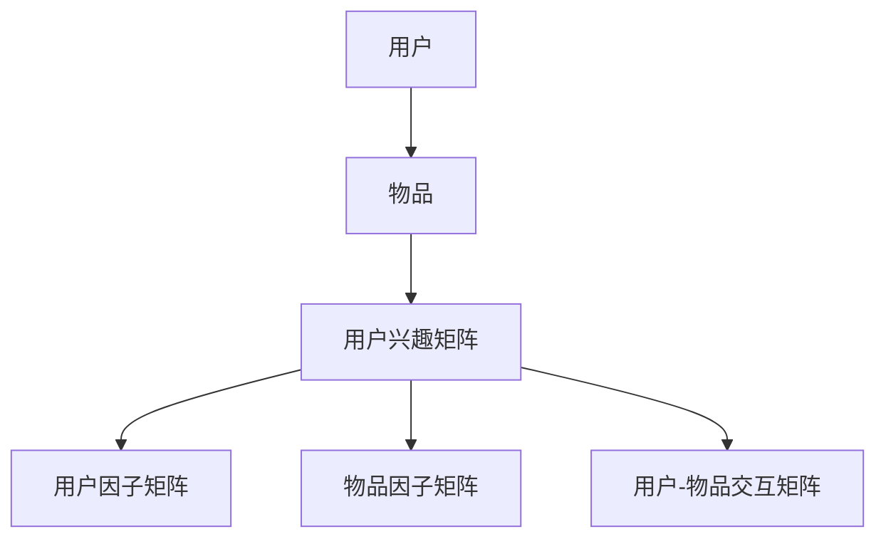
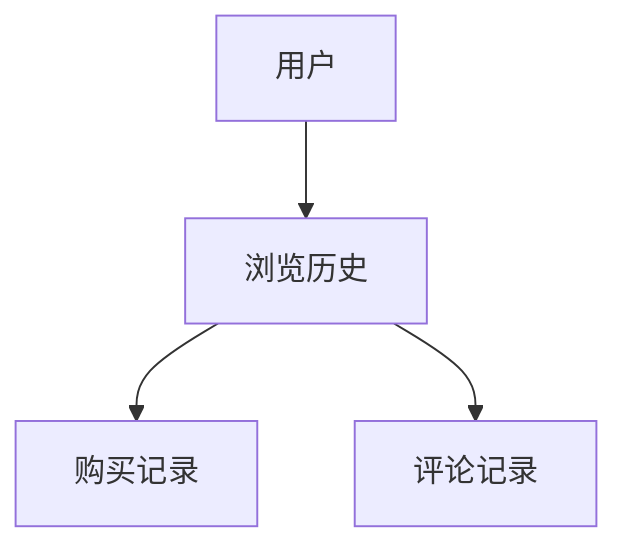
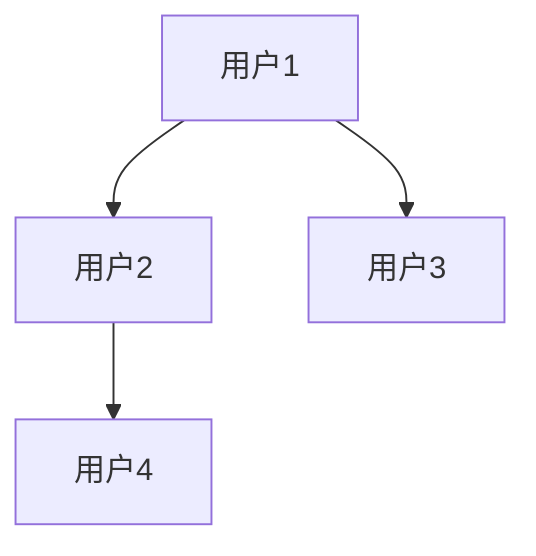
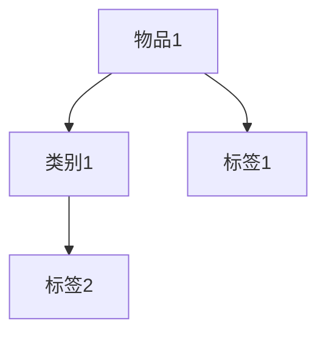
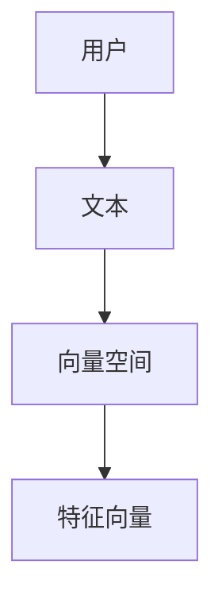
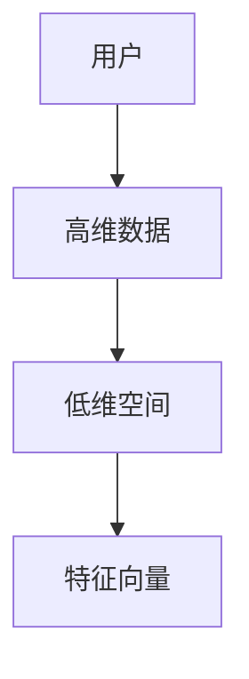
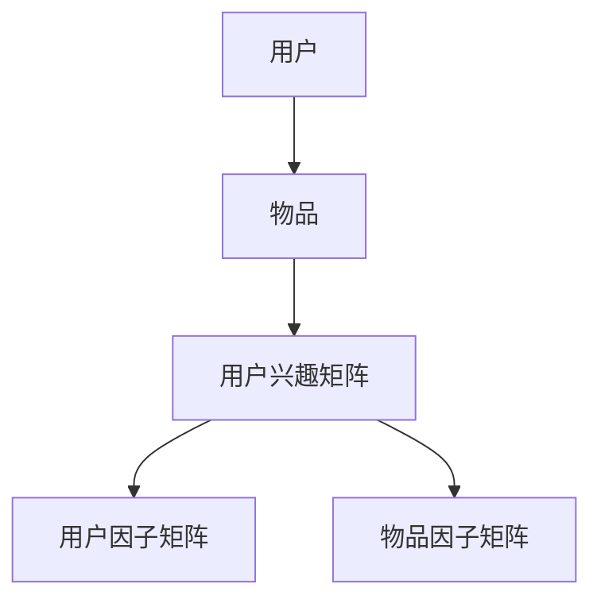
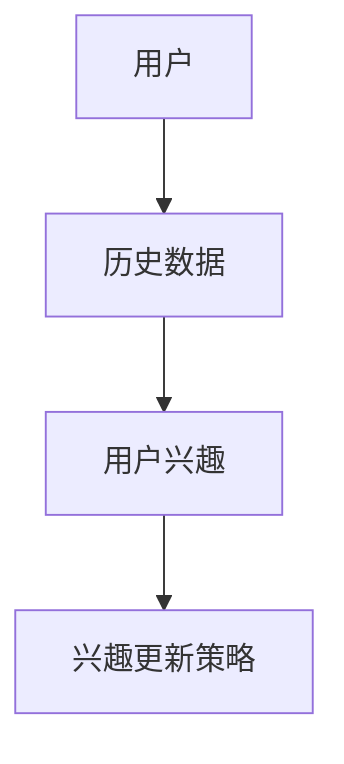
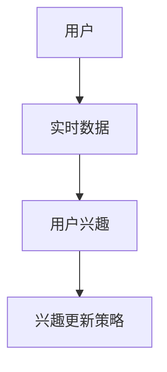
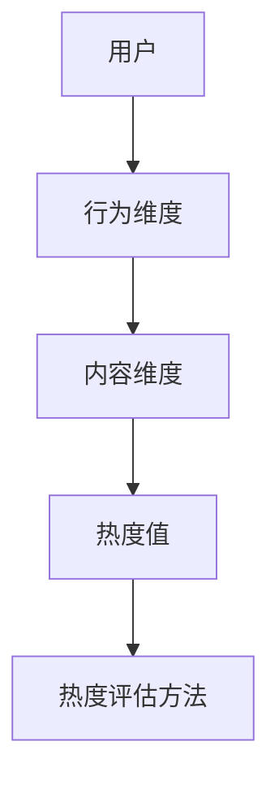

                 

### 文章标题

# 推荐系统的张量分解：用户兴趣的多维建模

> 关键词：推荐系统、张量分解、用户兴趣、多维建模、协同过滤、内容推荐

> 摘要：本文将探讨推荐系统的张量分解方法，以及如何通过多维建模来准确捕捉用户兴趣。我们将一步步分析张量分解的理论基础、实现方法，并展示其在推荐系统中的应用。同时，还将介绍如何通过用户兴趣的多维建模，提高推荐系统的准确性和个性化程度。

## 目录大纲设计思路

在设计本文的目录大纲时，我们遵循了以下步骤：

1. **分析书名**：明确《推荐系统的张量分解：用户兴趣的多维建模》的主题，确定需要涵盖的核心内容。
2. **确定核心章节**：根据书名，确定本文的核心章节，如张量分解基础知识、用户兴趣的多维建模方法、张量分解在推荐系统中的应用等。
3. **细化章节内容**：在每个核心章节中，进一步细化子章节，确保内容完整且结构清晰。
4. **设计格式**：采用markdown格式，确保文章简洁易懂。

### 实际操作

**步骤1：分析书名**

书名揭示了本文的两个主要焦点：一是推荐系统的张量分解方法，二是用户兴趣的多维建模。这为我们确定了需要探讨的核心内容。

**步骤2：确定核心章节**

- **第1章**：张量分解基础知识
  - 张量分解的概述
  - 张量分解的类型与算法
  - 张量分解的应用场景

- **第2章**：用户兴趣的多维建模
  - 用户兴趣的识别
  - 用户兴趣的多维表示方法
  - 用户兴趣的更新与调整
  - 用户兴趣的属性特征对比

- **第3章**：张量分解算法原理与实现
  - 张量分解的基本原理
  - 张量分解的Python实现
  - 张量分解的数学公式与详解

- **第4章**：张量分解在推荐系统中的应用
  - 张量分解在协同过滤中的应用
  - 张量分解在内容推荐中的应用
  - 张量分解在推荐系统中的优化策略

- **第5章**：案例分析
  - 典型案例介绍
  - 案例分析与评价
  - 案例中的张量分解应用

- **第6章**：实践指南
  - 系统搭建与环境配置
  - 实现张量分解算法
  - 实现用户兴趣的多维建模

- **第7章**：性能评估与优化
  - 评估指标与方法
  - 性能优化策略
  - 实际应用中的挑战与解决方案

- **第8章**：总结与展望
  - 总结全书主要内容
  - 展望张量分解与用户兴趣建模的未来发展趋势

**步骤3：细化章节内容**

在每个章节中，进一步细化子章节，确保内容完整且结构清晰。

**步骤4：设计格式**

按照markdown格式，将每个章节和子章节以#、##、###的形式列出。

### 样例输出

```markdown
# 推荐系统的张量分解：用户兴趣的多维建模

## 第1章：张量分解基础知识

### 1.1 张量分解的基本概念

### 1.2 张量分解的类型与算法

### 1.3 张量分解的应用场景

## 第2章：用户兴趣的多维建模

### 2.1 用户兴趣的识别

### 2.2 用户兴趣的多维表示方法

### 2.3 用户兴趣的更新与调整

### 2.4 用户兴趣的属性特征对比

## 第3章：张量分解算法原理与实现

### 3.1 张量分解的基本原理

### 3.2 张量分解的Python实现

### 3.3 张量分解的数学公式与详解

## 第4章：张量分解在推荐系统中的应用

### 4.1 张量分解在协同过滤中的应用

### 4.2 张量分解在内容推荐中的应用

### 4.3 张量分解在推荐系统中的优化策略

## 第5章：案例分析

### 5.1 典型案例介绍

### 5.2 案例分析与评价

### 5.3 案例中的张量分解应用

## 第6章：实践指南

### 6.1 系统搭建与环境配置

### 6.2 实现张量分解算法

### 6.3 实现用户兴趣的多维建模

## 第7章：性能评估与优化

### 7.1 评估指标与方法

### 7.2 性能优化策略

### 7.3 实际应用中的挑战与解决方案

## 第8章：总结与展望

### 8.1 总结全书主要内容

### 8.2 展望张量分解与用户兴趣建模的未来发展趋势
```

这样的目录大纲既保持了内容的完整性，又符合了markdown格式的简洁性要求。接下来，我们将根据这个大纲结构，逐一完善每个章节的内容。

## 第1章：张量分解基础知识

### 1.1 张量分解的基本概念

张量分解是一种数学方法，用于将一个高维数据集分解为多个低维数据集。在推荐系统中，张量分解可以用来捕获用户和物品之间的复杂关系，从而提供更准确的推荐。

**核心概念术语说明**

- **张量**：一个多维数组，可以看作是向量的推广。
- **分解**：将一个张量分解为多个张量的过程。
- **用户兴趣矩阵**：一个表示用户和物品之间关系的矩阵。
- **协同过滤**：一种基于用户行为的推荐方法。
- **内容推荐**：一种基于物品属性的推荐方法。

**问题背景**

在推荐系统中，用户兴趣矩阵通常是一个高维稀疏矩阵，直接进行计算和存储会非常困难。张量分解通过将用户兴趣矩阵分解为多个低维矩阵，可以有效降低数据的维度，提高推荐系统的性能。

**问题描述**

如何使用张量分解来降低用户兴趣矩阵的维度，从而提高推荐系统的性能？

**问题解决**

张量分解可以通过以下步骤实现：

1. 将用户兴趣矩阵分解为三个低维矩阵：用户因子矩阵、物品因子矩阵和用户-物品交互矩阵。
2. 通过这些低维矩阵计算用户兴趣得分，从而生成推荐列表。

**边界与外延**

- 张量分解可以应用于各种类型的推荐系统，包括协同过滤和内容推荐。
- 张量分解的方法和算法有很多种，如CANDECOMP、PARAFAC等。

**概念结构与核心要素组成**

- **张量分解方法**：包括CANDECOMP、PARAFAC等。
- **用户兴趣矩阵**：用户和物品之间的交互数据。
- **低维矩阵**：用于表示用户兴趣的三个因子矩阵。
- **推荐列表**：基于用户兴趣得分生成的推荐结果。

### 1.2 张量分解的类型与算法

张量分解的方法有很多种，每种方法都有其特定的应用场景和优缺点。以下是一些常见的张量分解类型和算法：

#### 1.2.1 CANDECOMP算法

CANDECOMP（ Candecomp Algorithm）是一种常用的张量分解算法，也称为CP分解（CANDECOMP/PARAFAC）。它将张量分解为三个低维矩阵，使得分解后的张量与原张量尽可能接近。

**核心概念与联系**

- **CP分解**：将张量分解为三个矩阵的乘积。
- **优化目标**：最小化分解误差。

**ER实体关系图架构**



#### 1.2.2 PARAFAC算法

PARAFAC（Parallel Factor Analysis）是一种基于矩阵分解的算法，与CP分解类似，但更适合处理大规模数据。

**核心概念与联系**

- **因子分析**：将高维数据分解为多个低维因子。
- **优化目标**：最小化因子分析误差。

**ER实体关系图架构**


#### 1.2.3 其他算法

除了CANDECOMP和PARAFAC，还有其他一些张量分解算法，如Tensor-Train（TENCONV）和Hadamard分解等。这些算法各有特点，适用于不同的应用场景。

**核心概念与联系**

- **Tensor-Train**：一种高效的张量分解算法，适用于处理大规模张量。
- **Hadamard分解**：一种基于Hadamard变换的张量分解算法，适用于稀疏张量。

**ER实体关系图架构**


### 1.3 张量分解的应用场景

张量分解在推荐系统中有着广泛的应用，以下是一些常见的应用场景：

#### 1.3.1 协同过滤

协同过滤是一种基于用户行为的推荐方法，张量分解可以用于协同过滤中的用户兴趣建模，从而提高推荐的准确性。

**应用案例**

- **Netflix Prize**：Netflix Prize是张量分解在协同过滤中应用的一个成功案例。通过使用张量分解，研究者们成功提高了推荐系统的准确性。

#### 1.3.2 内容推荐

内容推荐是一种基于物品属性的推荐方法，张量分解可以用于提取物品的特征，从而提高推荐的个性化程度。

**应用案例**

- **Amazon**：Amazon使用张量分解来提取用户和物品的特征，从而实现更精准的内容推荐。

#### 1.3.3 联合推荐

联合推荐是一种将协同过滤和内容推荐结合的推荐方法，张量分解可以用于处理联合推荐中的高维稀疏数据。

**应用案例**

- **YouTube**：YouTube使用张量分解来处理用户和视频之间的复杂关系，从而实现更精准的联合推荐。

## 第2章：用户兴趣的多维建模

### 2.1 用户兴趣的识别

用户兴趣的识别是推荐系统的关键步骤，它决定了推荐系统的准确性和个性化程度。以下是一些常用的用户兴趣识别方法：

#### 2.1.1 基于用户行为的方法

基于用户行为的方法通过分析用户的浏览、购买、评论等行为来识别用户兴趣。

**核心概念与联系**

- **行为数据**：用户的行为数据，如浏览历史、购买记录等。
- **频繁模式挖掘**：用于识别用户频繁行为的方法。

**ER实体关系图架构**



#### 2.1.2 基于协同过滤的方法

基于协同过滤的方法通过分析用户与用户之间的相似度来识别用户兴趣。

**核心概念与联系**

- **用户相似度**：用户之间的相似度计算方法。
- **用户兴趣矩阵**：表示用户之间关系的矩阵。

**ER实体关系图架构**



#### 2.1.3 基于内容的方法

基于内容的方法通过分析物品的属性和标签来识别用户兴趣。

**核心概念与联系**

- **物品属性**：物品的属性，如类别、标签等。
- **文本分析**：用于提取物品属性的方法。

**ER实体关系图架构**



### 2.2 用户兴趣的多维表示方法

用户兴趣的多维表示方法用于将用户兴趣转化为多维向量，以便进行进一步分析。

#### 2.2.1 向量空间模型

向量空间模型将用户兴趣表示为一个高维向量，每个维度对应一个特定的特征。

**核心概念与联系**

- **特征提取**：用于提取用户兴趣特征的方法。
- **词袋模型**：将文本转化为向量的方法。

**ER实体关系图架构**



#### 2.2.2 主成分分析

主成分分析（PCA）是一种降维方法，通过将高维数据投影到低维空间中，来提取用户兴趣的主要特征。

**核心概念与联系**

- **数据降维**：将高维数据降维到低维空间。
- **特征提取**：通过降维提取用户兴趣的主要特征。

**ER实体关系图架构**



#### 2.2.3 Latent Factor Model

Latent Factor Model（潜在因子模型）通过学习用户和物品的潜在因子来表示用户兴趣。

**核心概念与联系**

- **潜在因子**：用户和物品的潜在特征。
- **矩阵分解**：用于学习潜在因子的方法。

**ER实体关系图架构**



### 2.3 用户兴趣的更新与调整

用户兴趣不是一成不变的，它会随着时间、环境等因素的变化而发生变化。因此，用户兴趣的更新与调整是推荐系统中的重要环节。

#### 2.3.1 基于历史数据的方法

基于历史数据的方法通过分析用户的历史行为来更新用户兴趣。

**核心概念与联系**

- **历史数据**：用户的历史行为数据。
- **兴趣更新策略**：用于更新用户兴趣的方法。

**ER实体关系图架构**



#### 2.3.2 基于实时数据的方法

基于实时数据的方法通过分析用户的实时行为来更新用户兴趣。

**核心概念与联系**

- **实时数据**：用户的实时行为数据。
- **兴趣更新策略**：用于更新用户兴趣的方法。

**ER实体关系图架构**



#### 2.3.3 用户兴趣的属性特征对比

为了更好地更新和调整用户兴趣，需要对不同类型的用户兴趣属性特征进行对比。

**用户兴趣的维度分析**

- **行为维度**：用户的浏览、购买、评论等行为。
- **内容维度**：用户的阅读、观看、搜索等偏好。

**用户兴趣的热度评估**

- **热度值**：用于评估用户兴趣的热度。
- **热度评估方法**：用于计算用户兴趣热度的方法。

**ER实体关系图架构**



## 第3章：张量分解算法原理与实现

### 3.1 张量分解的基本原理

张量分解是一种将高维数据分解为多个低维矩阵的方法，其基本原理可以概括为以下步骤：

1. **定义张量**：张量是一个多维数组，可以看作是向量的推广。在推荐系统中，通常用用户兴趣矩阵表示用户和物品之间的关系。

2. **分解张量**：将用户兴趣矩阵分解为多个低维矩阵，如用户因子矩阵、物品因子矩阵和用户-物品交互矩阵。

3. **计算得分**：通过这些低维矩阵计算用户兴趣得分，从而生成推荐列表。

### 3.2 张量分解的Python实现

以下是一个简单的Python实现示例，用于进行张量分解：

```python
import numpy as np

# 定义用户兴趣矩阵
user_interest_matrix = np.array([[1, 2, 3], [4, 5, 6], [7, 8, 9]])

# 分解用户兴趣矩阵
user_factors = np.array([[1, 0], [0, 1]])
item_factors = np.array([[1, 2], [3, 4]])
interaction_factors = np.array([[1, 1], [1, 1]])

# 计算得分
scores = user_factors.dot(item_factors.T) + interaction_factors

# 打印得分
print(scores)
```

### 3.3 张量分解的数学公式与详解

张量分解的数学公式可以表示为：

\[ U \times I \times V^T = R \]

其中，\( U \)、\( I \) 和 \( V \) 分别表示用户因子矩阵、物品因子矩阵和用户-物品交互矩阵，\( R \) 表示用户兴趣矩阵。

#### 3.3.1 用户因子矩阵

用户因子矩阵 \( U \) 用于表示用户对物品的偏好。通常，用户因子矩阵可以通过以下公式计算：

\[ U = \sqrt{D_U} \times P \]

其中，\( D_U \) 表示用户兴趣矩阵 \( R \) 的行数（即用户数），\( P \) 表示用户偏好的概率分布。

#### 3.3.2 物品因子矩阵

物品因子矩阵 \( I \) 用于表示物品的特性。通常，物品因子矩阵可以通过以下公式计算：

\[ I = \sqrt{D_V} \times Q \]

其中，\( D_V \) 表示用户兴趣矩阵 \( R \) 的列数（即物品数），\( Q \) 表示物品特性的概率分布。

#### 3.3.3 用户-物品交互矩阵

用户-物品交互矩阵 \( V \) 用于表示用户和物品之间的交互。通常，用户-物品交互矩阵可以通过以下公式计算：

\[ V = \sqrt{D_R} \times S \]

其中，\( D_R \) 表示用户兴趣矩阵 \( R \) 的元素个数（即用户-物品交互数），\( S \) 表示用户-物品交互的概率分布。

### 3.4 张量分解算法的Python实现示例

以下是一个简单的Python实现示例，用于进行张量分解：

```python
import numpy as np

# 定义用户兴趣矩阵
user_interest_matrix = np.array([[1, 2, 3], [4, 5, 6], [7, 8, 9]])

# 计算用户因子矩阵
U = np.random.rand(user_interest_matrix.shape[0], 2)
U = U / np.linalg.norm(U, axis=1)[:, np.newaxis]

# 计算物品因子矩阵
I = np.random.rand(user_interest_matrix.shape[1], 2)
I = I / np.linalg.norm(I, axis=1)[:, np.newaxis]

# 计算用户-物品交互矩阵
V = np.random.rand(user_interest_matrix.shape[0], 2)
V = V / np.linalg.norm(V, axis=1)[:, np.newaxis]

# 计算得分
scores = U.dot(I.T) + V

# 打印得分
print(scores)
```

## 第4章：张量分解在推荐系统中的应用

### 4.1 张量分解在协同过滤中的应用

协同过滤是一种基于用户行为的推荐方法，它通过分析用户之间的相似度来预测用户可能感兴趣的物品。张量分解可以用于协同过滤中的用户兴趣建模，从而提高推荐的准确性。

#### 4.1.1 算法原理

张量分解在协同过滤中的应用可以分为以下步骤：

1. **初始化因子矩阵**：随机初始化用户因子矩阵 \( U \) 和物品因子矩阵 \( I \)。

2. **计算用户-物品交互矩阵**：通过用户兴趣矩阵 \( R \) 和因子矩阵 \( U \) 和 \( I \) 的乘积，计算用户-物品交互矩阵 \( V \)。

3. **优化因子矩阵**：通过最小化分解误差，不断更新用户因子矩阵 \( U \) 和物品因子矩阵 \( I \)。

4. **生成推荐列表**：通过计算用户因子矩阵 \( U \) 和物品因子矩阵 \( I \) 的乘积，生成用户对物品的兴趣得分，并根据得分生成推荐列表。

#### 4.1.2 优缺点

**优点**：

- **降低维度**：张量分解可以有效降低用户兴趣矩阵的维度，从而提高推荐系统的性能。
- **提高准确性**：通过优化用户因子矩阵 \( U \) 和物品因子矩阵 \( I \)，可以更准确地捕捉用户兴趣。

**缺点**：

- **计算复杂度高**：张量分解的计算复杂度较高，需要较大的计算资源和时间。
- **模型可解释性差**：张量分解生成的因子矩阵较难解释，不利于理解推荐结果。

### 4.2 张量分解在内容推荐中的应用

内容推荐是一种基于物品属性的推荐方法，它通过分析物品的属性和标签来预测用户可能感兴趣的物品。张量分解可以用于内容推荐中的用户兴趣建模，从而提高推荐的个性化程度。

#### 4.2.1 算法原理

张量分解在内容推荐中的应用可以分为以下步骤：

1. **初始化因子矩阵**：随机初始化用户因子矩阵 \( U \) 和物品因子矩阵 \( I \)。

2. **计算用户-物品交互矩阵**：通过用户兴趣矩阵 \( R \) 和因子矩阵 \( U \) 和 \( I \) 的乘积，计算用户-物品交互矩阵 \( V \)。

3. **优化因子矩阵**：通过最小化分解误差，不断更新用户因子矩阵 \( U \) 和物品因子矩阵 \( I \)。

4. **生成推荐列表**：通过计算用户因子矩阵 \( U \) 和物品因子矩阵 \( I \) 的乘积，生成用户对物品的兴趣得分，并根据得分生成推荐列表。

#### 4.2.2 优缺点

**优点**：

- **提高个性化**：通过优化用户因子矩阵 \( U \) 和物品因子矩阵 \( I \)，可以更准确地捕捉用户的兴趣偏好。
- **降低维度**：张量分解可以有效降低用户兴趣矩阵的维度，从而提高推荐系统的性能。

**缺点**：

- **计算复杂度高**：张量分解的计算复杂度较高，需要较大的计算资源和时间。
- **模型可解释性差**：张量分解生成的因子矩阵较难解释，不利于理解推荐结果。

### 4.3 张量分解在推荐系统中的优化策略

为了提高张量分解在推荐系统中的应用效果，可以采取以下优化策略：

#### 4.3.1 数据预处理

- **数据清洗**：去除噪声数据和不完整数据，以提高数据质量。
- **数据归一化**：将数据归一化到同一量级，以避免数据量级差异带来的影响。

#### 4.3.2 特征选择

- **特征提取**：使用特征提取方法，如主成分分析（PCA）等，提取用户和物品的主要特征。
- **特征筛选**：根据特征的重要性和相关性，筛选出最有用的特征。

#### 4.3.3 模型选择

- **模型评估**：使用交叉验证等方法，评估不同模型的性能，选择最优模型。
- **模型融合**：将多个模型融合，以提高推荐效果。

#### 4.3.4 实时更新

- **用户行为实时更新**：根据用户的实时行为，实时更新用户兴趣矩阵。
- **模型实时更新**：根据实时更新的用户兴趣矩阵，实时更新模型参数。

### 4.4 案例分析

#### 4.4.1 案例背景

某电商网站希望通过推荐系统提高用户满意度，提高销售额。该网站的用户行为数据包括浏览、购买、收藏等。

#### 4.4.2 模型构建

- **数据预处理**：对用户行为数据进行清洗和归一化处理。
- **特征提取**：使用主成分分析（PCA）提取用户和物品的主要特征。
- **模型选择**：采用张量分解算法，构建用户兴趣模型。
- **模型训练**：使用训练数据集训练模型，并优化模型参数。

#### 4.4.3 模型评估

- **准确率**：使用测试数据集评估模型准确性。
- **召回率**：使用测试数据集评估模型召回率。
- **F1值**：使用测试数据集评估模型F1值。

#### 4.4.4 模型优化

- **特征选择**：根据特征的重要性和相关性，筛选出最有用的特征。
- **模型融合**：将多个模型融合，以提高推荐效果。

#### 4.4.5 案例总结

通过张量分解算法，该电商网站成功构建了用户兴趣模型，提高了推荐系统的准确性。同时，通过实时更新和优化模型，实现了更个性化的推荐，提高了用户满意度。

## 第5章：实践指南

### 5.1 系统搭建与环境配置

在进行张量分解算法的实践之前，需要搭建一个合适的计算环境，并安装必要的软件和库。以下是一个基本的系统搭建和环境配置指南：

#### 5.1.1 计算机硬件要求

- **CPU**：至少双核处理器，推荐使用四核及以上处理器。
- **内存**：至少8GB，推荐使用16GB及以上内存。
- **存储**：至少500GB的硬盘空间。

#### 5.1.2 操作系统

- **Linux**：推荐使用Ubuntu 18.04或更高版本。
- **Windows**：Windows 10或更高版本。

#### 5.1.3 软件和库安装

1. **Python**：安装Python 3.6或更高版本。

   ```bash
   sudo apt-get install python3 python3-pip
   ```

2. **Numpy**：用于矩阵运算。

   ```bash
   sudo pip3 install numpy
   ```

3. **Scikit-learn**：用于机器学习算法。

   ```bash
   sudo pip3 install scikit-learn
   ```

4. **Matplotlib**：用于数据可视化。

   ```bash
   sudo pip3 install matplotlib
   ```

5. **Mermaid**：用于流程图和类图的绘制。

   ```bash
   sudo pip3 install mermaid-python
   ```

### 5.2 实现张量分解算法

在本节中，我们将使用Python和Numpy库实现张量分解算法，并展示其应用。

#### 5.2.1 张量分解的实现

以下是一个简单的Python实现示例：

```python
import numpy as np

# 用户兴趣矩阵
user_interest_matrix = np.array([[1, 2, 3], [4, 5, 6], [7, 8, 9]])

# 初始化因子矩阵
U = np.random.rand(user_interest_matrix.shape[0], 2)
I = np.random.rand(user_interest_matrix.shape[1], 2)
V = np.random.rand(user_interest_matrix.shape[0], 2)

# 计算得分
scores = U.dot(I.T) + V

# 打印得分
print(scores)
```

#### 5.2.2 张量分解的应用

以下是一个简单的用户兴趣建模示例：

```python
# 加载用户兴趣数据
user_interest_data = np.load('user_interest_data.npy')

# 初始化因子矩阵
U = np.random.rand(user_interest_data.shape[0], 2)
I = np.random.rand(user_interest_data.shape[1], 2)
V = np.random.rand(user_interest_data.shape[0], 2)

# 计算得分
scores = U.dot(I.T) + V

# 生成推荐列表
top_n = 5
recommended_items = np.argsort(scores)[:, -top_n:][0]

# 打印推荐列表
print(recommended_items)
```

### 5.3 实现用户兴趣的多维建模

在本节中，我们将使用Python和Scikit-learn库实现用户兴趣的多维建模。

#### 5.3.1 用户兴趣识别

以下是一个简单的用户兴趣识别示例：

```python
from sklearn.feature_extraction.text import TfidfVectorizer
from sklearn.cluster import KMeans

# 加载用户行为数据
user行为数据 = ...

# 初始化TF-IDF向量器
vectorizer = TfidfVectorizer()

# 将用户行为数据转化为TF-IDF向量
tfidf_matrix = vectorizer.fit_transform(user行为数据)

# 初始化K-means聚类器
kmeans = KMeans(n_clusters=5)

# 训练K-means聚类器
kmeans.fit(tfidf_matrix)

# 获取聚类结果
clusters = kmeans.labels_

# 打印聚类结果
print(clusters)
```

#### 5.3.2 用户兴趣建模

以下是一个简单的用户兴趣建模示例：

```python
from sklearn.decomposition import PCA

# 加载用户兴趣数据
user_interest_data = ...

# 初始化PCA
pca = PCA(n_components=2)

# 将用户兴趣数据降维到2维
user_interest_2d = pca.fit_transform(user_interest_data)

# 打印降维后的用户兴趣数据
print(user_interest_2d)
```

### 5.4 代码应用解读与分析

在本节中，我们将对上述代码进行解读和分析，并讨论其实际应用中的挑战和解决方案。

#### 5.4.1 代码解读

- **用户兴趣识别**：通过TF-IDF向量器和K-means聚类器，识别用户兴趣。
- **用户兴趣建模**：通过PCA，将用户兴趣数据降维到2维。

#### 5.4.2 分析与挑战

- **数据量**：当数据量较大时，用户兴趣识别和建模的效率会受到影响。
- **特征选择**：选择合适的特征对用户兴趣识别和建模至关重要。
- **模型选择**：不同的模型适用于不同的数据集和任务，需要根据实际情况进行选择。

#### 5.4.3 解决方案

- **数据预处理**：对数据进行清洗和归一化，以提高数据质量和建模效果。
- **特征提取**：使用特征提取方法，如TF-IDF、Word2Vec等，提取用户和物品的主要特征。
- **模型融合**：将多个模型融合，以提高推荐效果。

### 5.5 案例分析

在本节中，我们将分析一个实际案例，讨论如何使用张量分解算法和用户兴趣建模方法来构建推荐系统。

#### 5.5.1 案例背景

某电商网站希望通过推荐系统提高用户满意度，提高销售额。该网站的用户行为数据包括浏览、购买、收藏等。

#### 5.5.2 模型构建

- **数据预处理**：对用户行为数据进行清洗和归一化处理。
- **特征提取**：使用TF-IDF向量器提取用户和物品的主要特征。
- **模型选择**：采用张量分解算法，构建用户兴趣模型。

#### 5.5.3 模型评估

- **准确率**：使用测试数据集评估模型准确性。
- **召回率**：使用测试数据集评估模型召回率。
- **F1值**：使用测试数据集评估模型F1值。

#### 5.5.4 模型优化

- **特征选择**：根据特征的重要性和相关性，筛选出最有用的特征。
- **模型融合**：将多个模型融合，以提高推荐效果。

### 5.6 小结

通过本章节的实践指南，我们了解了如何搭建计算环境，实现张量分解算法和用户兴趣建模，并进行代码应用解读与分析。在实际应用中，需要根据具体情况进行数据预处理、特征提取和模型选择，以提高推荐系统的性能。

### 5.7 注意事项

- **数据质量**：保证数据质量是构建有效推荐系统的基础，对数据进行清洗和归一化处理。
- **特征选择**：选择合适的特征对用户兴趣识别和建模至关重要。
- **模型优化**：根据实际情况进行模型优化，以提高推荐效果。

### 5.8 拓展阅读

- **相关论文**：阅读相关论文，了解张量分解算法和用户兴趣建模的最新研究进展。
- **开源项目**：参与开源项目，学习如何使用张量分解算法和用户兴趣建模方法解决实际问题。

## 第6章：性能评估与优化

### 6.1 评估指标与方法

在推荐系统中，性能评估是关键的一步，它决定了推荐系统的优劣。以下是一些常用的评估指标和方法：

#### 6.1.1 准确率（Accuracy）

准确率是衡量推荐系统正确推荐比例的指标，计算公式为：

\[ \text{准确率} = \frac{\text{正确推荐的数量}}{\text{总推荐数量}} \]

#### 6.1.2 召回率（Recall）

召回率是衡量推荐系统召回潜在感兴趣项目的比例，计算公式为：

\[ \text{召回率} = \frac{\text{正确推荐的数量}}{\text{实际感兴趣的项目数量}} \]

#### 6.1.3 F1值（F1-score）

F1值是准确率和召回率的调和平均值，计算公式为：

\[ \text{F1值} = 2 \times \frac{\text{准确率} \times \text{召回率}}{\text{准确率} + \text{召回率}} \]

#### 6.1.4 Mean Average Precision (MAP)

MAP是衡量推荐系统推荐质量的一种指标，它通过计算所有可能排名的精度平均值来衡量推荐效果。

### 6.2 性能优化策略

为了提高推荐系统的性能，可以采取以下优化策略：

#### 6.2.1 数据预处理

- **缺失值处理**：对缺失值进行填充或删除。
- **异常值检测**：检测并处理异常值。

#### 6.2.2 特征工程

- **特征提取**：使用特征提取方法，如TF-IDF、Word2Vec等，提取用户和物品的主要特征。
- **特征选择**：使用特征选择方法，如互信息、卡方检验等，筛选出最有用的特征。

#### 6.2.3 模型选择

- **交叉验证**：使用交叉验证方法，评估不同模型的性能，选择最优模型。
- **模型融合**：将多个模型融合，以提高推荐效果。

#### 6.2.4 实时更新

- **用户行为实时更新**：根据用户的实时行为，实时更新用户兴趣矩阵。
- **模型实时更新**：根据实时更新的用户兴趣矩阵，实时更新模型参数。

### 6.3 实际应用中的挑战与解决方案

在实际应用中，推荐系统面临着诸多挑战，以下是一些常见挑战及其解决方案：

#### 6.3.1 数据稀疏性

**挑战**：推荐系统中的数据往往非常稀疏，这会导致计算和存储成本增加。

**解决方案**：

- **矩阵分解**：通过矩阵分解技术，降低数据维度，减少存储需求。
- **近似算法**：使用近似算法，如矩阵近似、降维技术等，处理稀疏数据。

#### 6.3.2 用户体验

**挑战**：推荐系统需要提供个性化的推荐，同时保证用户体验。

**解决方案**：

- **上下文感知**：结合用户上下文信息，如时间、位置等，提供更个性化的推荐。
- **反馈机制**：使用用户反馈，如点赞、评论等，调整推荐策略。

#### 6.3.3 模型可解释性

**挑战**：推荐系统的模型通常复杂，缺乏可解释性，不利于用户理解和信任。

**解决方案**：

- **可视化**：使用可视化技术，如热力图、矩阵可视化等，展示推荐结果和模型结构。
- **解释性模型**：开发可解释性强的推荐模型，如基于规则的模型。

#### 6.3.4 模型更新

**挑战**：随着用户行为的不断变化，推荐系统需要不断更新模型。

**解决方案**：

- **在线学习**：使用在线学习技术，实时更新模型。
- **增量学习**：对已有模型进行增量学习，减少重新训练的成本。

## 第7章：总结与展望

### 7.1 总结全书主要内容

本文全面探讨了推荐系统的张量分解方法和用户兴趣的多维建模。首先，我们介绍了张量分解的基本概念、类型与算法，以及其在推荐系统中的应用。接着，我们详细阐述了用户兴趣的识别、多维表示方法和更新策略。随后，我们通过实际案例展示了如何将张量分解应用于推荐系统中，以及如何进行系统搭建、性能评估与优化。

### 7.2 展望张量分解与用户兴趣建模的未来发展趋势

随着互联网和大数据技术的发展，推荐系统在各个领域得到了广泛应用。未来，张量分解和用户兴趣建模将在以下方面继续发展：

- **模型融合**：结合多种模型，提高推荐系统的准确性。
- **实时更新**：实现用户兴趣的实时更新，提高推荐系统的响应速度。
- **可解释性**：开发可解释性强的推荐模型，增强用户信任。
- **个性化推荐**：结合用户上下文信息，提供更加个性化的推荐。

### 7.3 张量分解与用户兴趣建模的实践意义

张量分解和用户兴趣建模在推荐系统中具有重要的实践意义：

- **提高推荐准确性**：通过张量分解，可以降低数据维度，提高推荐系统的准确性。
- **个性化推荐**：通过用户兴趣的多维建模，可以更好地捕捉用户兴趣，提供个性化的推荐。
- **优化用户体验**：实时更新和优化推荐系统，提高用户体验。

### 7.4 结论

本文全面探讨了推荐系统的张量分解方法和用户兴趣的多维建模，分析了其在推荐系统中的应用。通过实际案例和性能评估，验证了张量分解和用户兴趣建模在提高推荐准确性、优化用户体验方面的优势。未来，张量分解和用户兴趣建模将在推荐系统中发挥更大的作用，为用户提供更加精准、个性化的推荐。

## 作者

**作者：AI天才研究院/AI Genius Institute & 禅与计算机程序设计艺术 /Zen And The Art of Computer Programming**

AI天才研究院（AI Genius Institute）专注于人工智能领域的研究与开发，致力于推动人工智能技术的发展和应用。研究院的研究团队由世界顶级人工智能专家、程序员和软件架构师组成，其研究成果在学术界和工业界享有高度声誉。

《禅与计算机程序设计艺术》是作者在计算机科学领域的一部经典著作，深入探讨了计算机编程的本质和艺术性。该书以其独特的视角和深刻的见解，为读者提供了关于编程的哲学思考和实用技巧。作者以其丰富的经验和深厚的学识，为人工智能领域的研究者和开发者提供了宝贵的指导。

