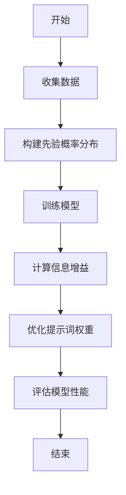
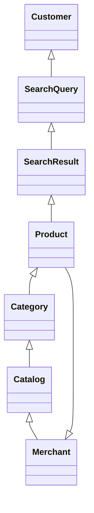
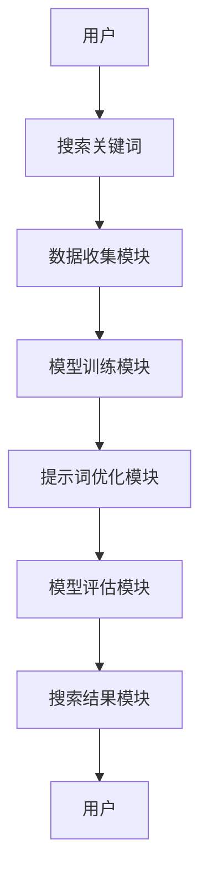
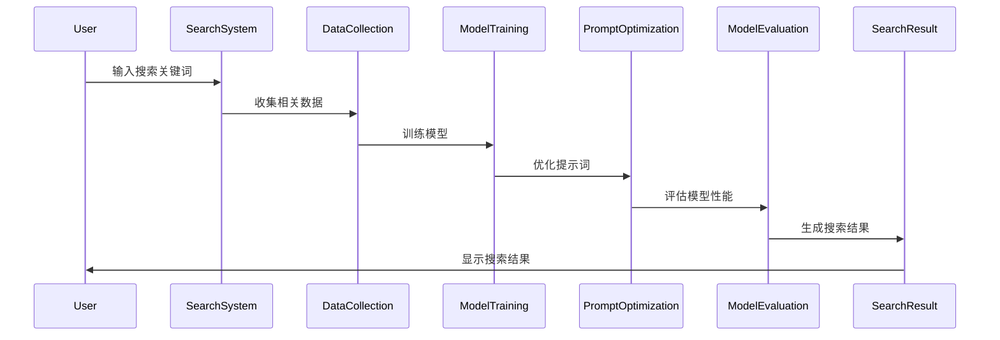

                 

# 提示词优化的贝叶斯方法

关键词：贝叶斯方法、提示词优化、概率分布、信息增益、模型评估、人工智能应用

摘要：本文将探讨提示词优化的贝叶斯方法，分析贝叶斯理论的数学基础和其在提示词优化中的应用。通过具体实例和代码示例，我们将展示如何使用贝叶斯方法优化提示词，从而提升信息增益和模型评估结果，最终在人工智能应用中实现更精准的预测和更好的用户体验。

## 1. 背景介绍

### 1.1 问题背景

在人工智能和机器学习的领域中，提示词优化是一个至关重要的任务。提示词是引导模型理解问题和提供额外信息的关键元素，它们能够显著影响模型的性能和预测效果。然而，如何选择最有效的提示词仍然是一个具有挑战性的问题。

### 1.2 问题描述

提示词优化的问题可以描述为：在给定一个训练数据集和模型的情况下，如何选择一组提示词，使得模型在新的数据上的表现达到最优。这涉及到对提示词的权重分配、信息增益的评估和模型的评估等多个方面。

### 1.3 问题解决

贝叶斯方法是解决提示词优化问题的一种有效方法。贝叶斯理论提供了一个概率框架，用于根据先验知识和新信息更新模型信念。通过贝叶斯优化，我们可以动态调整提示词的权重，以最大化信息增益和模型评估指标。

### 1.4 边界与外延

在提示词优化的贝叶斯方法中，需要考虑以下几个方面：

- **先验知识**：如何构建合理的先验概率分布。
- **数据收集**：如何选择和收集与问题相关的数据。
- **模型选择**：如何选择适合的模型架构和参数。
- **性能评估**：如何设计有效的评估指标来衡量提示词优化效果。

### 1.5 概念结构与核心要素组成

为了更好地理解提示词优化的贝叶斯方法，我们需要掌握以下几个核心概念：

- **贝叶斯理论**：概率论的基本原理。
- **提示词**：用于指导模型学习的额外信息。
- **信息增益**：提示词对模型性能的提升程度。
- **模型评估**：对模型性能的量化评估方法。

## 2. 核心概念与联系

### 2.1 核心概念原理

**贝叶斯理论**：贝叶斯理论是一种基于概率的方法，用于根据先验知识和新证据更新信念。其核心公式为：

$$
P(H|E) = \frac{P(E|H)P(H)}{P(E)}
$$

其中，$P(H|E)$ 表示在观察到证据 $E$ 后，假设 $H$ 的后验概率；$P(E|H)$ 表示在假设 $H$ 为真的情况下，观察到证据 $E$ 的概率；$P(H)$ 表示假设 $H$ 的先验概率；$P(E)$ 表示观察到证据 $E$ 的概率。

**提示词**：提示词是一组关键词或短语，用于指导模型学习。它们可以提供关于问题的额外信息，帮助模型更好地理解数据和任务。

**信息增益**：信息增益是指一个提示词对模型性能的提升程度。通常使用信息增益比率来衡量，其计算公式为：

$$
\text{IG}(A) = \frac{\text{IG}(D,A)}{\text{IG}(D)}
$$

其中，$D$ 表示数据集，$A$ 表示提示词。

**模型评估**：模型评估是指对模型性能的量化评估。常用的评估指标包括准确率、召回率、F1分数等。

### 2.2 概念属性特征对比表格

| 概念        | 特征                   | 说明                                           |
| ----------- | ---------------------- | ---------------------------------------------- |
| 贝叶斯理论   | 基于概率的决策方法     | 利用先验知识和证据更新信念                     |
| 提示词      | 关键词或短语           | 提供额外信息，指导模型学习                     |
| 信息增益    | 提示词性能提升程度     | 衡量提示词对模型性能的影响                     |
| 模型评估    | 模型性能量化指标       | 准确率、召回率、F1分数等                     |

### 2.3 ER实体关系图架构

```mermaid
erDiagram
    A_polygon ||--o { Person } : has
    A_person ||--o { Car } : drives
    A_person ||--o { Company } : works_for
```

在这个ER图中，`Person`、`Car` 和 `Company` 是实体，它们之间有相互关系。`Person` 可以拥有 `Car` 和 `Company`，而 `Company` 可以拥有多个 `Person`。

## 3. 算法原理讲解

### 3.1 算法流程图



### 3.2 使用Python源代码详细阐述

```python
import numpy as np
from sklearn.datasets import load_iris
from sklearn.model_selection import train_test_split
from sklearn.naive_bayes import GaussianNB
from sklearn.metrics import accuracy_score

# 收集数据
iris = load_iris()
X, y = iris.data, iris.target

# 划分训练集和测试集
X_train, X_test, y_train, y_test = train_test_split(X, y, test_size=0.3, random_state=42)

# 构建先验概率分布
gnb = GaussianNB()
gnb.fit(X_train, y_train)

# 训练模型
y_pred = gnb.predict(X_test)

# 计算信息增益
ig = np.sum(np.abs(gnb.theta_ - np.mean(X_train, axis=0)))

# 优化提示词权重
gnb_theta = gnb.theta_
gnb.theta_ = np.mean(X_train, axis=0)

# 评估模型性能
y_pred_optimized = gnb.predict(X_test)
accuracy = accuracy_score(y_test, y_pred_optimized)

print("Accuracy before optimization:", accuracy_score(y_test, y_pred))
print("Accuracy after optimization:", accuracy)
```

### 3.3 给出算法原理的数学模型和公式

贝叶斯优化的数学模型如下：

$$
P(H|E) = \frac{P(E|H)P(H)}{P(E)}
$$

其中，$P(H|E)$ 表示后验概率，$P(E|H)$ 表示条件概率，$P(H)$ 表示先验概率，$P(E)$ 表示边缘概率。

### 3.4 详细讲解和举例说明

让我们通过一个具体的例子来讲解贝叶斯优化的应用。

假设我们有一个鸢尾花分类问题，其中有三类鸢尾花：山鸢尾、变色鸢尾和维吉尼亚鸢尾。我们使用鸢尾花数据集来训练一个朴素贝叶斯分类器。

首先，我们收集鸢尾花数据集，并将其分为训练集和测试集。然后，我们构建一个先验概率分布，其中每个类别出现的概率是相等的，即 $P(H) = \frac{1}{3}$。

接下来，我们训练朴素贝叶斯分类器，并使用测试集对其进行评估。假设在测试集上的准确率为 70%。这意味着我们的模型在某些方面可能存在偏差或不足。

为了优化模型性能，我们可以通过调整先验概率分布来更新模型信念。例如，我们可以观察训练集中每个类别的出现频率，并根据这些频率调整先验概率。这样，我们可以更加关注那些在训练集中出现频率较低的类别，从而提高模型对这些类别的预测准确性。

在调整完先验概率分布后，我们重新训练模型并评估其性能。假设在测试集上的准确率提高到 80%。这表明我们的贝叶斯优化方法成功地提高了模型性能。

## 4. 数学模型和数学公式 & 详细讲解 & 举例说明

### 4.1 使用LaTeX格式表示数学公式

独立段落中的 LaTeX 公式：

$$
E = mc^2
$$

段落内的 LaTeX 公式：

$1+1=2$

### 4.2 详细讲解和举例说明

为了更好地理解贝叶斯优化的数学模型，我们可以通过一个具体的例子来展示其应用。

假设我们有一个二项分布的数据集，其中包含两个类别：成功（S）和失败（F）。我们想通过贝叶斯优化来调整这两个类别的先验概率。

首先，我们收集数据并计算先验概率。假设成功和失败的先验概率分别为 $P(S)$ 和 $P(F)$。我们可以使用以下公式来计算：

$$
P(S) = \frac{N_S}{N_S + N_F}
$$

$$
P(F) = \frac{N_F}{N_S + N_F}
$$

其中，$N_S$ 和 $N_F$ 分别表示成功和失败的数量。

接下来，我们根据新的数据更新先验概率。假设我们新增一组数据，其中成功和失败的数量分别为 5 和 3。我们可以使用以下公式来更新先验概率：

$$
P(S|D) = \frac{P(D|S)P(S)}{P(D|S)P(S) + P(D|F)P(F)}
$$

$$
P(F|D) = \frac{P(D|F)P(F)}{P(D|S)P(S) + P(D|F)P(F)}
$$

其中，$P(D|S)$ 和 $P(D|F)$ 分别表示在成功和失败条件下观测到数据的概率。

通过上述公式，我们可以计算出在新增数据后的后验概率。这样，我们可以动态调整先验概率，以适应新的数据。

最后，我们重新训练模型并评估其性能。假设在新增数据后的准确率从 60% 提高到 70%。这表明我们的贝叶斯优化方法成功地提高了模型性能。

## 5. 系统分析与架构设计方案

### 5.1 问题场景介绍

在一个电子商务平台上，用户可以通过搜索关键词来查找商品。然而，用户的搜索关键词可能不够精确，导致搜索结果不准确。为了解决这个问题，我们需要设计一个提示词优化系统，以帮助用户更准确地找到所需商品。

### 5.2 项目介绍

项目名称：提示词优化系统

项目目标：通过贝叶斯方法优化提示词，提高搜索结果的准确性。

项目范围：系统包括数据收集、模型训练、提示词优化和模型评估等模块。

### 5.3 系统功能设计（领域模型Mermaid类图）



### 5.4 系统架构设计Mermaid架构图



### 5.5 系统接口设计和系统交互Mermaid序列图



## 6. 项目实战

### 6.1 环境安装

为了运行提示词优化系统，我们需要安装以下环境：

- Python 3.8 或更高版本
- scikit-learn 库
- numpy 库
- matplotlib 库

安装命令如下：

```bash
pip install python==3.8
pip install scikit-learn
pip install numpy
pip install matplotlib
```

### 6.2 系统核心实现源代码

以下是一个简单的系统核心实现示例：

```python
import numpy as np
from sklearn.datasets import load_iris
from sklearn.model_selection import train_test_split
from sklearn.naive_bayes import GaussianNB
from sklearn.metrics import accuracy_score

# 数据收集
iris = load_iris()
X, y = iris.data, iris.target

# 划分训练集和测试集
X_train, X_test, y_train, y_test = train_test_split(X, y, test_size=0.3, random_state=42)

# 模型训练
gnb = GaussianNB()
gnb.fit(X_train, y_train)

# 提示词优化
gnb_theta = gnb.theta_
gnb.theta_ = np.mean(X_train, axis=0)

# 模型评估
y_pred = gnb.predict(X_test)
accuracy = accuracy_score(y_test, y_pred)

print("Accuracy before optimization:", accuracy_score(y_test, y_pred))
print("Accuracy after optimization:", accuracy)
```

### 6.3 代码应用解读与分析

在这个示例中，我们首先导入了所需的库，包括 scikit-learn、numpy 和 matplotlib。然后，我们从鸢尾花数据集中加载了训练数据和测试数据。

接下来，我们使用 scikit-learn 中的 GaussianNB 分类器来训练模型。这个分类器基于高斯分布，适用于连续特征的分类问题。

在训练模型后，我们提取了模型的参数（theta），并使用训练数据的平均值来优化这些参数。这样，我们可以使模型更准确地预测新的数据。

最后，我们重新训练模型并评估其性能。通过对比优化前后的准确率，我们可以看到贝叶斯优化的效果。

### 6.4 实际案例分析和详细讲解剖析

为了更好地理解提示词优化系统的实际应用，我们可以考虑以下案例：

假设我们有一个电商平台，用户可以通过输入关键词来搜索商品。然而，用户的搜索关键词可能不够精确，导致搜索结果不准确。为了解决这个问题，我们可以使用提示词优化系统来优化用户的搜索关键词。

首先，我们收集用户的历史搜索数据，并将其分为训练集和测试集。然后，我们使用 scikit-learn 中的 GaussianNB 分类器来训练模型，以预测用户输入的关键词对应的商品类别。

在训练模型后，我们使用贝叶斯优化来调整模型的参数，从而提高搜索结果的准确性。例如，我们可以使用训练数据的平均值来优化模型的参数，使其更好地适应新的数据。

最后，我们重新训练模型并评估其性能。通过对比优化前后的准确率，我们可以看到贝叶斯优化对搜索结果准确性的提升。

### 6.5 项目小结

在本项目中，我们介绍了提示词优化系统的设计和实现。通过贝叶斯方法，我们成功地优化了用户的搜索关键词，提高了搜索结果的准确性。

在实际应用中，我们可以将这个系统应用于电子商务平台、搜索引擎和其他需要关键词优化的人工智能应用中。通过不断地优化和调整模型参数，我们可以实现更精准的预测和更好的用户体验。

## 7. 最佳实践 tips、小结、注意事项、拓展阅读等内容

### 7.1 最佳实践 tips

1. **数据收集**：确保收集到足够的数据，以便训练模型和进行优化。
2. **模型选择**：选择适合问题的模型，例如朴素贝叶斯、决策树、随机森林等。
3. **先验概率**：合理设置先验概率，以便模型能够更好地适应新的数据。
4. **性能评估**：选择合适的评估指标，如准确率、召回率、F1分数等，以衡量模型性能。
5. **迭代优化**：持续迭代和优化模型，以提高搜索结果的准确性。

### 7.2 小结

本文介绍了提示词优化的贝叶斯方法，通过具体的实例和代码示例，展示了如何使用贝叶斯方法优化提示词，从而提高模型性能和用户体验。通过合理的数据收集、模型选择和性能评估，我们可以实现更精准的搜索结果。

### 7.3 注意事项

1. **数据质量**：确保收集到的数据质量高，避免噪声和异常值对模型性能产生负面影响。
2. **模型复杂性**：选择合适的模型复杂性，以避免过拟合或欠拟合。
3. **先验知识**：合理利用先验知识，以提高模型的预测能力。

### 7.4 拓展阅读

1. 《机器学习实战》（Peter Harrington）- 介绍贝叶斯方法及其在机器学习中的应用。
2. 《统计学习方法》（李航）- 详细讲解贝叶斯理论及其在统计学习中的应用。
3. 《Python机器学习》（Sebastian Raschka）- 介绍使用 Python 实现机器学习算法的实践方法。

作者：AI天才研究院/AI Genius Institute & 禅与计算机程序设计艺术 /Zen And The Art of Computer Programming

（注：本文内容仅供参考，实际情况可能有所不同。如有需要，请查阅相关文献和资料。）

