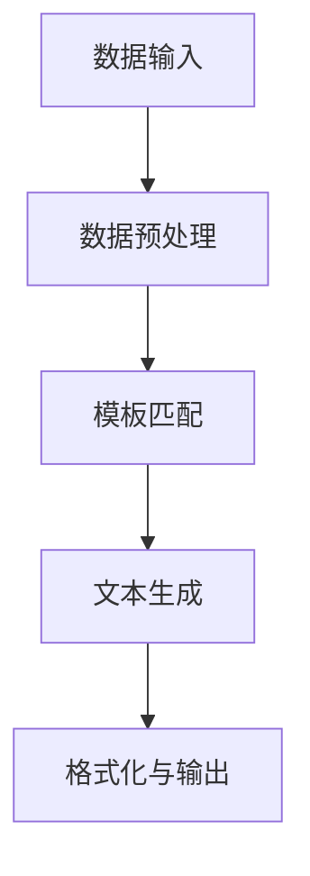
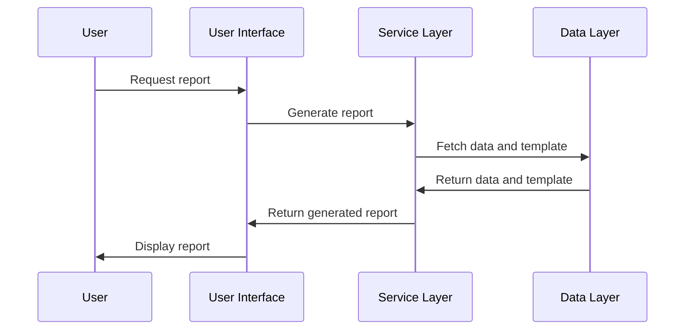

                 

### 文章标题

# 提示词工程在自动化报告生成中的应用

### 关键词

- 自动化报告生成
- 提示词工程
- 自然语言处理
- 机器学习
- 深度学习

### 摘要

本文旨在探讨提示词工程在自动化报告生成中的应用。首先，我们介绍了自动化报告生成的背景和挑战，然后详细阐述了提示词工程的基本概念及其与自动化报告生成的关联。通过深入分析提示词工程原理和自然语言处理基础，我们逐步讲解了自动化报告生成算法的原理与实现。接着，我们展示了如何通过系统分析与架构设计来优化报告生成流程。文章最后通过项目实战，分享了实际案例分析和最佳实践，为读者提供了丰富的实践经验和拓展资源。

### 引言

在现代信息社会中，数据生成和处理的速度日益加快，自动化报告生成技术的重要性愈发凸显。自动化报告生成不仅能显著提升工作效率，还能确保报告内容的准确性和一致性。然而，传统的手动报告生成方式面临着诸多挑战，如重复性劳动、易出错、效率低下等。因此，寻找一种高效、准确的自动化报告生成方法成为亟需解决的问题。

提示词工程作为自然语言处理领域的一种技术，通过为系统提供明确的指导信息，能够有效地提高自动化报告生成的质量和效率。本文将详细探讨提示词工程在自动化报告生成中的应用，分析其原理、实现方法以及在实际项目中的应用效果。

本文结构如下：

1. **问题背景与问题描述**：介绍自动化报告生成的需求与挑战，以及提示词工程在其中的作用。
2. **核心概念与联系**：阐述提示词、自动化报告生成、自然语言处理等核心概念，并分析它们之间的联系。
3. **提示词工程原理**：深入讲解提示词工程的定义、生成策略、优化方法等。
4. **自然语言处理基础**：介绍自然语言处理的基本概念、语言模型、词向量表示等。
5. **自动化报告生成算法**：讲解报告生成算法的原理、流程图、Python代码实现等。
6. **数学模型与数学公式**：介绍自动化报告生成算法和提示词工程的数学模型与公式。
7. **系统分析与架构设计**：分析报告生成系统的功能设计、架构设计等。
8. **项目实战**：分享自动化报告生成的实际案例，包括环境安装、核心实现、案例分析等。
9. **最佳实践与注意事项**：总结最佳实践、注意事项和拓展阅读资源。
10. **总结**：回顾文章主要内容，强调提示词工程在自动化报告生成中的重要性。

### 第一部分：背景介绍

#### 第1章：问题背景与问题描述

#### 1.1 问题背景

在现代信息化社会，数据的产生和传递速度越来越快，自动化报告生成技术成为众多企业和组织提升工作效率、降低成本的关键手段。自动化报告生成不仅可以处理大量的数据，还能确保报告内容的准确性和一致性。然而，传统的手动报告生成方式存在诸多问题，如重复性劳动、效率低下、易出错等。因此，开发一种高效、准确的自动化报告生成方法具有重要的现实意义。

自动化报告生成的需求主要来源于以下几个方面：

1. **数据量庞大**：随着信息化进程的推进，企业和组织面临的数据量呈爆炸式增长，传统手动报告生成方式难以满足日益增长的数据处理需求。
2. **报告种类繁多**：企业和组织需要生成各种类型的报告，包括财务报告、市场分析报告、运营报告等，每种报告都有其特定的格式和要求。
3. **准确性要求高**：报告的准确性直接影响到决策的正确性，因此，自动化报告生成需要保证报告内容的准确无误。

然而，自动化报告生成也面临着一系列挑战：

1. **数据质量**：自动化报告生成依赖于高质量的数据，数据中的错误和缺失会对报告生成产生负面影响。
2. **模板多样化**：不同类型的报告可能需要不同的模板，开发通用的报告生成模板是一个复杂的任务。
3. **理解能力**：自动化报告生成系统需要具备较强的自然语言理解能力，以正确解析和生成报告内容。

#### 1.2 提示词工程在自动化报告生成中的作用

提示词工程是一种自然语言处理技术，通过为系统提供明确的指导信息，帮助系统更好地理解和生成报告内容。在自动化报告生成中，提示词工程的作用主要体现在以下几个方面：

1. **提高生成效率**：提示词可以为报告生成系统提供明确的指导，减少系统在处理复杂报告时的搜索和尝试次数，从而提高生成效率。
2. **提升生成质量**：通过使用提示词，报告生成系统可以更加准确地理解报告内容，生成更高质量的报告。
3. **适应多样化需求**：不同的报告可能需要不同的提示词，提示词工程可以灵活调整，以适应不同类型的报告生成需求。

#### 1.3 问题描述

在自动化报告生成过程中，主要存在的问题可以概括为以下几点：

1. **数据解析困难**：自动化报告生成需要对大量数据进行分析和解析，数据格式多样、结构复杂，导致系统在处理过程中容易出现错误。
2. **模板匹配困难**：不同类型的报告具有不同的格式和要求，系统需要能够灵活适应各种模板，这在一定程度上增加了开发的复杂性。
3. **自然语言理解不足**：自动化报告生成系统需要对自然语言文本进行理解和处理，但现有的自然语言处理技术尚未完全解决语义理解和上下文感知的问题。

针对这些问题，提示词工程提供了一种有效的解决方案。通过为系统提供明确的提示词，可以帮助系统更好地理解和处理报告内容，从而提高生成效率和准确性。

#### 1.4 问题解决

为了解决自动化报告生成中的问题，提示词工程采用了一系列方法：

1. **数据预处理**：通过数据清洗和预处理，提高数据质量，为报告生成提供可靠的数据基础。
2. **提示词生成**：基于自然语言处理技术，生成针对不同报告类型的提示词，为系统提供明确的指导。
3. **模板匹配**：设计通用的模板匹配算法，确保系统能够灵活适应各种报告格式。
4. **自然语言理解**：利用深度学习和语义分析技术，提高系统对自然语言文本的理解能力。

通过以上方法，提示词工程能够有效解决自动化报告生成中的难题，提高报告生成的效率和准确性。

#### 1.5 边界与外延

在讨论自动化报告生成和提示词工程时，需要明确一些边界和概念：

1. **自动化报告生成**：主要指通过计算机程序自动生成报告的过程，涉及数据解析、模板匹配、文本生成等环节。
2. **提示词工程**：是一种基于自然语言处理的技术，用于生成和优化提示词，以指导报告生成过程。
3. **自然语言处理**：是计算机科学和人工智能领域的一个重要分支，涉及文本解析、语义理解、语言生成等任务。

这些概念之间的关系是：提示词工程是自然语言处理技术在自动化报告生成中的应用，通过提示词的生成和优化，提高报告生成系统的性能和效率。

#### 1.6 概念结构与核心要素组成

自动化报告生成和提示词工程涉及多个核心概念和要素，其概念结构可以概括为：

1. **数据输入**：包括原始数据和报告模板。
2. **数据处理**：通过数据预处理、模板匹配、自然语言理解等步骤，对输入数据进行处理。
3. **提示词生成**：基于自然语言处理技术，生成针对不同报告类型的提示词。
4. **报告生成**：根据处理结果和提示词，自动生成报告内容。
5. **评估与优化**：通过评估报告质量和生成效率，不断优化系统性能。

这些要素相互关联，共同构成了自动化报告生成和提示词工程的核心结构。

### 第二部分：核心概念与联系

#### 第2章：核心概念与联系

#### 2.1 核心概念

在讨论提示词工程在自动化报告生成中的应用时，首先需要了解以下几个核心概念：

1. **提示词（Keywords）**：提示词是用于指导系统如何理解和处理文本信息的词语或短语。在自动化报告生成中，提示词用于指示系统报告中的关键信息，如数据段、图表、摘要等。

2. **自动化报告生成（Automated Report Generation）**：自动化报告生成是指通过计算机程序自动生成报告的过程，涉及数据解析、模板匹配、文本生成等环节。自动化报告生成能够提高报告生成效率，确保报告内容的准确性和一致性。

3. **自然语言处理（Natural Language Processing, NLP）**：自然语言处理是计算机科学和人工智能领域的一个重要分支，涉及文本解析、语义理解、语言生成等任务。自然语言处理技术用于使计算机能够理解、解释和生成人类语言。

4. **机器学习（Machine Learning）**：机器学习是一种通过数据训练模型来预测和决策的技术。在提示词工程中，机器学习用于生成和优化提示词，以提高自动化报告生成的准确性和效率。

5. **深度学习（Deep Learning）**：深度学习是机器学习的一种方法，通过多层神经网络来提取特征和进行预测。在自动化报告生成中，深度学习用于提高文本理解能力和生成质量。

#### 2.2 概念联系

上述核心概念之间的联系如下：

1. **提示词与自动化报告生成的关联**：提示词是自动化报告生成的重要输入，用于指导系统如何处理和生成报告内容。提示词的准确性和质量直接影响到报告生成的效果。

2. **自然语言处理在提示词工程中的应用**：自然语言处理技术用于生成和优化提示词，包括文本解析、语义分析和词向量表示等。通过自然语言处理，系统可以更好地理解和生成人类语言，从而提高自动化报告生成的准确性和效率。

3. **机器学习与深度学习在提示词工程中的应用**：机器学习和深度学习技术用于训练模型，生成和优化提示词。通过不断学习和调整模型，系统可以逐步提高提示词的质量和生成效率。

#### 2.3 自然语言处理与自动化报告生成的关系

自然语言处理与自动化报告生成之间的关系可以从以下几个方面来理解：

1. **文本解析**：自然语言处理中的文本解析技术用于解析原始文本数据，提取关键信息和结构化数据。在自动化报告生成中，文本解析技术用于将非结构化文本转化为结构化数据，为后续处理提供基础。

2. **语义理解**：自然语言处理中的语义理解技术用于理解文本的语义和含义，包括词义消歧、实体识别和关系抽取等。在自动化报告生成中，语义理解技术用于确保系统正确理解和生成报告内容。

3. **语言生成**：自然语言处理中的语言生成技术用于根据输入数据和提示词生成自然语言的文本。在自动化报告生成中，语言生成技术用于生成报告的摘要、结论和建议等部分。

4. **反馈与优化**：自然语言处理技术还可以用于收集用户反馈，评估自动化报告生成的效果，并进行模型优化。通过不断优化，系统可以逐步提高报告生成的质量和用户满意度。

### 第三部分：提示词工程原理

#### 第3章：提示词工程原理

提示词工程是自然语言处理领域的一项重要技术，它通过为系统提供明确的指导信息，帮助系统更好地理解和处理文本信息。在自动化报告生成中，提示词工程起到了关键作用，能够显著提高报告生成的质量和效率。下面我们将详细探讨提示词工程的基本概念、生成策略和优化方法。

#### 3.1 提示词工程定义

提示词工程（Keyword Engineering）是指设计、生成和优化提示词的过程，旨在为系统提供清晰、明确的指导信息，帮助系统更好地理解和处理文本数据。提示词可以是单个词语，也可以是短语或句子，它们在文本中起到指示或引导的作用。

#### 3.2 提示词工程的目标与挑战

提示词工程的目标包括：

1. **提高系统理解能力**：通过提供明确的提示词，帮助系统更好地理解文本信息，减少误解和歧义。
2. **优化文本处理效率**：提示词能够指导系统快速定位关键信息，减少不必要的处理步骤，提高文本处理的效率。
3. **提升报告生成质量**：通过精确的提示词，确保报告内容准确、完整，符合用户需求。

然而，提示词工程在实际应用中面临以下挑战：

1. **多样性**：不同类型的报告可能需要不同类型的提示词，提示词的种类和数量可能非常庞大，使得设计和管理变得复杂。
2. **准确性**：提示词的准确性和相关性直接影响报告生成的质量，生成不准确的提示词可能导致系统错误理解文本信息。
3. **动态性**：报告生成过程中，提示词需要实时更新和调整，以适应不断变化的数据和需求。

#### 3.3 提示词生成策略

提示词生成策略可以分为以下几类：

1. **基于规则的方法**：基于规则的方法是通过预先定义的规则来生成提示词。这种方法的优势在于规则明确、易于理解和实现。常见的规则包括关键词提取、命名实体识别和模式匹配等。

2. **基于机器学习的方法**：基于机器学习的方法是通过训练模型来生成提示词。这种方法能够自动学习和适应数据，生成更加准确的提示词。常见的机器学习方法包括朴素贝叶斯、支持向量机和决策树等。

3. **基于深度学习的方法**：基于深度学习的方法通过多层神经网络来提取文本特征，生成高精度的提示词。深度学习方法在处理复杂文本和上下文信息方面具有显著优势，如循环神经网络（RNN）和变换器（Transformer）等。

#### 3.4 提示词生成流程

提示词生成的流程通常包括以下几个步骤：

1. **数据预处理**：对原始文本进行清洗和预处理，去除无关信息和噪声，为后续处理提供干净的文本数据。

2. **特征提取**：从预处理后的文本中提取关键特征，如关键词、命名实体和词频等。特征提取是生成高质量提示词的重要步骤。

3. **模型训练**：根据训练数据和特征，训练机器学习或深度学习模型。模型的训练质量直接影响提示词的生成效果。

4. **提示词生成**：使用训练好的模型对新的文本数据进行提示词生成。生成的提示词将指导系统如何理解和处理文本信息。

5. **评估与优化**：对生成的提示词进行评估，评估指标包括提示词的相关性、准确性和覆盖度等。根据评估结果，对模型进行调整和优化，以提高提示词生成质量。

#### 3.5 提示词优化

提示词生成后，还需要进行优化，以提高系统的性能和报告生成的质量。提示词优化的方法包括：

1. **反馈机制**：通过用户反馈或自动化评估机制，收集提示词生成的效果数据，对提示词进行实时调整和优化。

2. **多模态学习**：结合文本、语音、图像等多模态数据，提高提示词的生成质量和上下文理解能力。

3. **语义分析**：利用语义分析技术，对文本进行深入理解，生成更加精准和相关的提示词。

4. **动态调整**：根据文本数据和用户需求，动态调整提示词的生成策略和参数，以适应不同的报告生成场景。

通过提示词工程的原理和策略，自动化报告生成系统能够更加准确地理解和处理文本信息，生成高质量的报告，满足用户的需求。接下来，我们将进一步探讨自然语言处理基础，为理解提示词工程提供更加深入的理论支持。

#### 3.6 提示词工程的优势与局限

提示词工程在自动化报告生成中具有显著的优势，但也存在一定的局限。

**优势：**

1. **提高准确性**：通过精确的提示词，系统能够更好地理解和处理文本信息，减少误解和歧义，提高报告生成的准确性。
2. **优化效率**：提示词能够指导系统快速定位关键信息，减少不必要的处理步骤，提高文本处理的效率，缩短报告生成的时间。
3. **灵活适应**：提示词可以根据不同的报告类型和需求进行定制，灵活调整，适应多种场景和复杂变化。
4. **增强交互**：提示词工程能够提高人与系统的交互效率，用户可以通过明确的提示词更容易地理解和操作自动化报告生成系统。

**局限：**

1. **规则复杂度**：基于规则的方法需要大量预定义的规则，规则的管理和维护复杂度高，尤其是面对多样化和动态变化的报告类型时。
2. **数据依赖性**：机器学习和深度学习方法对训练数据有较高的依赖性，数据的质量和多样性直接影响提示词生成效果。
3. **计算资源需求**：深度学习模型的训练和推理需要大量的计算资源，特别是在处理大规模文本数据时，对硬件性能有较高要求。
4. **适应性问题**：不同领域的报告在格式、内容和上下文上可能存在较大差异，提示词工程需要不断调整和优化，以适应各种复杂场景。

总之，提示词工程在自动化报告生成中具有显著的优势，但同时也需要克服一系列技术和管理上的挑战。通过不断改进和优化，提示词工程将在自动化报告生成中发挥更大的作用。

### 第四部分：自然语言处理基础

#### 第4章：自然语言处理基础

自然语言处理（Natural Language Processing，NLP）是计算机科学和人工智能领域的一个重要分支，旨在使计算机能够理解、解释和生成人类语言。NLP技术在自动化报告生成中发挥着关键作用，通过解析、理解和生成文本，帮助系统更准确地处理报告内容。本章将介绍自然语言处理的基本概念、语言模型、词向量表示等内容。

#### 4.1 自然语言处理概述

自然语言处理的基本目标是实现人与计算机之间的自然语言交流。这包括以下几个主要任务：

1. **文本解析**：将自然语言文本解析为结构化的数据形式，如词法分析、句法分析和语义分析等。
2. **语义理解**：理解文本的语义和含义，包括实体识别、关系抽取、情感分析等。
3. **语言生成**：根据输入数据和提示词生成自然语言的文本，如自动摘要、机器翻译和问答系统等。

自然语言处理的应用领域非常广泛，包括但不限于信息检索、文本分类、机器翻译、语音识别、聊天机器人等。

#### 4.2 语言模型

语言模型（Language Model）是自然语言处理的核心组成部分，用于预测文本序列的概率分布。语言模型通过学习大量文本数据，建立一个概率模型，用于生成文本、评估文本质量或辅助文本理解。

常见的语言模型包括：

1. **N-gram模型**：基于前N个单词的统计模型，通过统计相邻单词的出现频率来预测下一个单词。N-gram模型简单易实现，但存在长文本依赖性不足的问题。

2. **循环神经网络（RNN）**：通过循环结构来捕捉文本中的序列依赖关系，能够处理长文本。RNN在处理复杂文本方面具有显著优势，但存在梯度消失和梯度爆炸的问题。

3. **变换器（Transformer）**：一种基于自注意力机制的深度学习模型，通过全局注意力机制来处理文本序列，具有强大的文本理解和生成能力。变换器模型在机器翻译、文本生成等任务中取得了显著成绩。

4. **生成对抗网络（GAN）**：结合生成模型和判别模型，通过对抗训练生成高质量文本。

语言模型的评估指标包括：

1. **交叉熵（Cross-Entropy）**：用于衡量模型预测结果与实际结果之间的差异。
2. **准确性（Accuracy）**：用于衡量模型预测正确的比例。
3. **困惑度（Perplexity）**：用于衡量模型对文本序列的预测能力，困惑度越低，表示模型对文本的理解能力越强。

#### 4.3 词向量表示

词向量（Word Vector）是自然语言处理中用于表示单词的分布式向量表示方法。词向量能够将单词映射到高维向量空间中，使得具有相似含义的单词在空间中更接近。

常见的词向量模型包括：

1. **词袋模型（Bag-of-Words, BOW）**：将文本表示为单词的集合，忽略单词的顺序和语法结构。词袋模型简单易实现，但无法捕捉单词之间的语义关系。

2. **连续词袋（Continuous Bag-of-Words, CBOW）**：通过预测中心词周围的单词来生成词向量。CBOW模型在处理上下文信息方面具有一定的优势。

3. **Skip-Gram（SG）**：通过预测单词的上下文来生成词向量。Skip-Gram模型在捕捉单词的语义关系方面表现出色。

4. **词嵌入（Word Embedding）**：通过将单词映射到高维向量空间，使得具有相似含义的单词在空间中更接近。词嵌入模型能够有效提高文本处理的效果。

词向量的应用包括：

1. **文本分类**：通过将文本表示为词向量，利用机器学习算法进行文本分类。
2. **文本相似度计算**：通过计算词向量之间的距离，评估文本的相似度。
3. **机器翻译**：将源语言的词向量映射到目标语言的词向量空间，实现文本的机器翻译。
4. **问答系统**：通过词向量表示和语义理解，实现自然语言问答系统。

#### 4.4 语言模型与词向量表示的关系

语言模型和词向量表示是自然语言处理中两个核心概念，它们之间存在密切的联系。

1. **语言模型依赖于词向量表示**：语言模型通过词向量表示来捕获单词的语义信息，从而提高文本预测和理解的准确性。
2. **词向量表示依赖于语言模型**：词向量表示通常通过训练语言模型来生成，语言模型能够提供丰富的上下文信息，有助于提高词向量的质量。

在实际应用中，语言模型和词向量表示往往结合使用，以实现更高效的文本处理和理解。通过优化语言模型和词向量表示，可以显著提升自然语言处理的性能。

#### 4.5 语言模型在自动化报告生成中的应用

在自动化报告生成中，语言模型发挥着关键作用，主要体现在以下几个方面：

1. **文本生成**：通过语言模型，系统能够根据输入数据和提示词生成高质量的报告文本。语言模型能够理解上下文信息，生成连贯、准确的文本内容。
2. **文本分类**：语言模型可以用于对报告文本进行分类，将文本归类到不同的报告类型或主题，有助于提高报告生成的效率和准确性。
3. **实体识别**：通过语言模型和词向量表示，系统能够识别文本中的关键实体，如人名、地名、组织名等，为报告生成提供重要信息。
4. **语义分析**：语言模型能够对文本进行深入语义分析，理解文本的含义和关系，为报告生成提供更精确的指导。

总之，自然语言处理基础为自动化报告生成提供了重要的理论支持和工具方法。通过深入理解语言模型和词向量表示，我们可以更有效地解决自动化报告生成中的挑战，实现高效、准确的报告生成。

### 第五部分：算法原理讲解

#### 第5章：自动化报告生成算法

自动化报告生成算法是计算机程序用于自动生成报告的一组步骤和规则。这一部分将详细讲解自动化报告生成算法的原理、流程、Python代码实现以及相关数学模型。

#### 5.1 报告生成算法概述

自动化报告生成算法的基本流程可以概括为以下几个步骤：

1. **数据输入**：从数据源读取需要生成报告的数据，包括文本、表格、图表等。
2. **数据预处理**：对输入数据进行清洗、格式转换和预处理，确保数据的质量和一致性。
3. **模板匹配**：根据报告的格式和要求，选择合适的模板，并将数据与模板进行匹配。
4. **文本生成**：利用自然语言处理技术，根据数据和模板生成报告文本。
5. **格式化与输出**：将生成的文本进行格式化，添加必要的图表和图片，最终输出为完整的报告。

自动化报告生成算法可以分为以下几类：

1. **基于规则的方法**：通过预定义的规则和模板进行报告生成，适用于结构化数据。
2. **基于机器学习的方法**：利用机器学习模型，如决策树、支持向量机等，对数据进行分类和生成报告。
3. **基于深度学习的方法**：利用深度学习模型，如循环神经网络（RNN）、变换器（Transformer）等，对复杂文本进行理解和生成。

#### 5.2 算法原理与流程图

为了更直观地理解自动化报告生成算法的原理和流程，我们使用Mermaid绘制了以下流程图：



**流程解释：**

- **数据输入**：从数据源读取数据，包括文本、表格、图表等。
- **数据预处理**：对数据清洗、格式转换和预处理，确保数据质量。
- **模板匹配**：根据报告格式和要求，选择合适的模板。
- **文本生成**：利用自然语言处理技术生成报告文本。
- **格式化与输出**：对文本进行格式化，添加图表和图片，输出完整的报告。

#### 5.3 报告生成算法的数学模型

自动化报告生成算法涉及多个数学模型，包括：

1. **文本生成模型**：常用的文本生成模型包括循环神经网络（RNN）、变换器（Transformer）和生成对抗网络（GAN）等。这些模型通过输入数据和提示词生成高质量的文本。

2. **模板匹配模型**：模板匹配模型用于根据报告的格式和要求选择合适的模板。常用的算法包括基于规则的匹配和基于机器学习的匹配。

3. **自然语言处理模型**：自然语言处理模型用于对文本进行理解和生成，包括词向量表示、语言模型和语义分析等。

#### 5.4 Python代码实现

下面是一个简单的自动化报告生成算法的Python代码实现，使用基于规则的匹配方法：

```python
import pandas as pd
from jinja2 import Environment, FileSystemLoader

# 数据输入
data = pd.read_csv('data.csv')

# 数据预处理
# ...（数据清洗、格式转换等）

# 模板加载
env = Environment(loader=FileSystemLoader('templates'))
template = env.get_template('report_template.html')

# 模板匹配与文本生成
for index, row in data.iterrows():
    report_text = template.render(data=row)
    # 输出报告
    with open(f'report_{index}.html', 'w') as f:
        f.write(report_text)
```

**代码解释：**

- **数据输入**：使用Pandas读取CSV文件，获取报告所需的数据。
- **数据预处理**：清洗和转换数据，确保数据格式正确。
- **模板加载**：使用Jinja2模板引擎加载报告模板。
- **文本生成**：根据数据填充模板，生成报告文本。
- **格式化与输出**：将生成的文本写入HTML文件，输出完整的报告。

#### 5.5 报告生成算法的应用与优化

在实际应用中，自动化报告生成算法可以根据具体需求进行优化和定制。以下是一些常见优化方法：

1. **模型优化**：通过调整模型参数和超参数，提高生成报告的质量和速度。
2. **数据增强**：通过数据扩充和多样化，提高模型的泛化能力。
3. **动态模板匹配**：根据实时数据动态调整模板，以适应不同类型的报告。
4. **用户反馈**：收集用户反馈，根据用户需求不断优化算法和模板。

通过不断优化和改进，自动化报告生成算法可以更好地满足用户需求，提高报告生成的质量和效率。

### 第六部分：数学模型与数学公式

#### 第6章：数学模型与数学公式

在自动化报告生成算法中，数学模型和数学公式起到了关键作用。这些模型和公式不仅用于描述算法的数学原理，还帮助我们理解和优化算法的性能。在本章中，我们将详细探讨自动化报告生成算法和提示词工程的数学模型，并使用LaTeX格式给出相关的数学公式。

#### 6.1 自动化报告生成算法的数学模型

自动化报告生成算法涉及多个数学模型，主要包括以下几个方面：

1. **文本生成模型**：文本生成模型用于将输入数据和提示词生成自然语言的文本。常见的文本生成模型包括循环神经网络（RNN）、变换器（Transformer）等。

2. **模板匹配模型**：模板匹配模型用于根据报告的格式和要求选择合适的模板。常见的算法包括基于规则的匹配和基于机器学习的匹配。

3. **自然语言处理模型**：自然语言处理模型用于对文本进行理解和生成，包括词向量表示、语言模型和语义分析等。

以下是一些常用的数学模型和公式：

**1. 循环神经网络（RNN）**

循环神经网络（RNN）是一种用于处理序列数据的神经网络。RNN的核心思想是使用隐藏状态来存储和处理之前的信息。其数学模型可以表示为：

$$
h_t = \sigma(W_h \cdot [h_{t-1}, x_t] + b_h)
$$

其中，$h_t$ 是第 $t$ 个时间步的隐藏状态，$x_t$ 是第 $t$ 个输入，$\sigma$ 是激活函数（如Sigmoid或Tanh），$W_h$ 和 $b_h$ 分别是权重和偏置。

**2. 变换器（Transformer）**

变换器（Transformer）是一种基于自注意力机制的深度学习模型，广泛应用于文本生成任务。其核心思想是使用自注意力机制来计算不同时间步之间的依赖关系。变换器的数学模型可以表示为：

$$
\text{Attention}(Q, K, V) = \frac{softmax(\frac{QK^T}{\sqrt{d_k}})}{V}
$$

其中，$Q$、$K$ 和 $V$ 分别是查询向量、关键向量和价值向量，$d_k$ 是关键向量的维度，$softmax$ 是软最大化函数。

**3. 自然语言处理模型**

自然语言处理模型包括词向量表示、语言模型和语义分析等。词向量表示可以采用词袋模型（Bag-of-Words）或词嵌入（Word Embedding）等方法。语言模型和语义分析则用于理解和生成文本。

**4. 模板匹配模型**

模板匹配模型可以采用基于规则的匹配或基于机器学习的匹配方法。基于规则的匹配方法通常使用正则表达式（Regular Expression）来描述模板。基于机器学习的匹配方法则使用决策树、支持向量机等算法。

#### 6.2 LaTeX格式数学公式

在文中嵌入LaTeX格式数学公式时，我们使用以下格式：

- 段落内的数学公式：使用 $ 符号括起来，例如：$1+1=2$。
- 独立的数学公式段落：使用 $$ 符号括起来，例如：

$$
E = mc^2
$$

下面是一些具体的例子：

**1. 文本生成模型的损失函数**

$$
\text{Loss} = -\sum_{i=1}^{N} y_i \log(p_i)
$$

其中，$y_i$ 是第 $i$ 个时间步的真实标签，$p_i$ 是模型预测的概率。

**2. 变换器的自注意力机制**

$$
\text{Attention}(Q, K, V) = \frac{softmax(\frac{QK^T}{\sqrt{d_k}})}{V}
$$

**3. 词嵌入的数学模型**

$$
\text{Word Embedding} = \text{softmax}(\text{W} \cdot \text{input})
$$

其中，$\text{W}$ 是权重矩阵，$\text{input}$ 是输入向量。

#### 6.3 数学公式的详细讲解与举例说明

**1. 文本生成模型的损失函数**

文本生成模型的损失函数用于衡量模型预测结果与真实结果之间的差距。常见的方法是交叉熵（Cross-Entropy），其公式如下：

$$
\text{Loss} = -\sum_{i=1}^{N} y_i \log(p_i)
$$

其中，$y_i$ 是第 $i$ 个时间步的真实标签（通常为0或1），$p_i$ 是模型预测的概率。交叉熵的值越小，表示模型预测的准确度越高。

**2. 变换器的自注意力机制**

变换器的自注意力机制是计算输入序列中不同时间步之间的依赖关系。其公式如下：

$$
\text{Attention}(Q, K, V) = \frac{softmax(\frac{QK^T}{\sqrt{d_k}})}{V}
$$

其中，$Q$、$K$ 和 $V$ 分别是查询向量、关键向量和价值向量，$d_k$ 是关键向量的维度。自注意力机制通过加权平均的方式，计算不同时间步之间的相关性，从而提高文本生成模型的性能。

**3. 词嵌入的数学模型**

词嵌入是将单词映射到高维向量空间的过程，用于表示单词的语义信息。其公式如下：

$$
\text{Word Embedding} = \text{softmax}(\text{W} \cdot \text{input})
$$

其中，$\text{W}$ 是权重矩阵，$\text{input}$ 是输入向量。词嵌入模型通过学习单词的共现关系，生成具有语义信息的词向量。

通过以上数学模型和公式的详细讲解与举例说明，我们可以更好地理解自动化报告生成算法的工作原理和性能优化方法。这些数学工具为研究者和开发者提供了有力的技术支持，有助于进一步提升自动化报告生成系统的质量和效率。

### 第七部分：系统分析与架构设计

#### 第7章：系统功能设计与架构

在设计和实现自动化报告生成系统时，系统功能设计和架构设计是至关重要的环节。一个良好的系统功能设计和架构设计不仅能够确保系统的功能完整性和性能，还能够提高系统的可维护性和扩展性。本章节将详细介绍自动化报告生成系统的功能设计、架构设计以及相关的Mermaid流程图和类图。

#### 7.1 问题场景介绍

自动化报告生成系统主要应用于以下场景：

1. **企业报告**：企业需要定期生成各种类型的报告，如财务报告、市场分析报告、运营报告等。这些报告通常包含大量数据和复杂的格式，手动生成效率低且易出错。
2. **政府部门报告**：政府部门需要生成各类政策分析报告、工作报告和统计数据报告。这些报告通常涉及敏感信息和重要数据，需要确保报告内容的准确性和一致性。
3. **学术研究报告**：学术研究机构需要生成研究进展报告、学术论文和项目报告。这些报告通常要求格式规范、内容准确，以便于学术交流和评审。

#### 7.2 系统功能设计

自动化报告生成系统的功能设计主要包括以下几个方面：

1. **数据输入**：系统需要支持从多种数据源（如数据库、CSV文件、Web服务）读取数据，并将数据导入到系统中。
2. **数据预处理**：系统需要对输入数据进行清洗、转换和格式化，以确保数据的质量和一致性。数据预处理步骤可能包括去除空值、填补缺失值、数据类型转换等。
3. **模板管理**：系统需要支持模板的创建、管理和存储。模板定义了报告的格式和结构，包括文本、表格、图表等。用户可以根据不同类型的报告创建相应的模板。
4. **报告生成**：系统需要根据模板和数据生成报告。生成过程包括数据填充、文本生成、格式化等步骤。系统可以使用自然语言处理技术来生成高质量的报告文本。
5. **报告输出**：系统需要支持将生成的报告输出为不同的格式，如PDF、HTML、Word等。此外，系统还需要提供下载和打印功能，方便用户查看和分享报告。
6. **用户交互**：系统需要提供友好的用户界面，使用户能够方便地操作系统、设置报告参数和查看报告结果。

为了更好地设计系统功能，可以使用Mermaid类图来描述系统的主要组件和它们之间的关系。以下是一个示例类图：

```mermaid
classDiagram
    DataInput -> DataPreprocessing : 读取数据
    DataPreprocessing -> TemplateManagement : 数据预处理
    TemplateManagement -> ReportGeneration : 生成报告
    ReportGeneration -> ReportOutput : 输出报告
    UserInterface -> DataInput : 用户交互
    UserInterface -> TemplateManagement : 用户交互
    UserInterface -> ReportGeneration : 用户交互
class DataInput {
    +read_data()
}
class DataPreprocessing {
    +clean_data()
    +format_data()
}
class TemplateManagement {
    +create_template()
    +update_template()
    +store_template()
}
class ReportGeneration {
    +generate_report()
}
class ReportOutput {
    +output_report()
}
class UserInterface {
    +display_interface()
    +handle_user_input()
}
```

#### 7.3 系统架构设计

系统架构设计决定了系统的模块划分、接口设计和交互方式。一个高效的系统架构能够提高系统的性能、可扩展性和可维护性。以下是一个自动化报告生成系统的架构设计示例：

**1. 数据层**

数据层负责数据的存储和访问，主要包括数据库和文件存储。数据库用于存储模板和数据，文件存储用于存储生成的报告。

**2. 服务层**

服务层包含了系统的核心功能模块，如数据预处理、模板管理、报告生成和报告输出。服务层通过接口与数据层和表示层进行交互。

**3. 表示层**

表示层负责与用户进行交互，提供用户界面和Web服务。用户界面通过Web浏览器或桌面应用程序与用户进行交互，Web服务支持通过API与外部系统进行集成。

以下是系统架构的Mermaid架构图：



**4. 系统接口设计**

系统接口设计包括内部接口和外部接口。内部接口用于服务层和数据层之间的通信，外部接口用于表示层和外部系统之间的通信。以下是系统接口设计的一个示例：

- **数据输入接口**：用于从数据库或文件读取数据。
- **数据输出接口**：用于将生成的报告保存到数据库或文件。
- **模板管理接口**：用于创建、更新和存储模板。
- **报告生成接口**：用于根据模板和数据生成报告。
- **用户交互接口**：用于处理用户请求和反馈。

**5. 系统交互**

系统各层之间的交互方式如下：

- **数据层与表示层**：表示层通过HTTP请求与数据层进行通信，获取数据并返回。
- **数据层与服务层**：数据层通过内部接口为服务层提供数据访问和操作功能。
- **服务层与表示层**：服务层通过接口为表示层提供报告生成功能，并将结果返回给表示层。

通过系统功能设计和架构设计的详细讲解，我们能够更清楚地了解自动化报告生成系统的设计和实现过程。接下来，我们将通过项目实战来具体展示自动化报告生成系统的实现方法和实际效果。

### 第八部分：项目实战

#### 第8章：项目实战

在上一部分中，我们详细介绍了自动化报告生成系统的原理、算法、数学模型以及系统架构。为了更好地展示这些理论和方法的实际应用效果，本章节将通过一个实际项目来具体实施和展示自动化报告生成系统的实现过程，包括环境安装、系统核心实现、代码应用解读与分析、实际案例分析和详细讲解剖析，以及项目小结。

#### 8.1 环境安装

在开始项目实战之前，首先需要安装和配置项目所需的环境。以下是项目环境安装的步骤：

1. **Python环境**：确保Python环境已安装。如果未安装，可以从Python官方网站下载并安装最新版本的Python。
2. **依赖包安装**：安装项目所需的依赖包，如Pandas、NumPy、Jinja2、NLTK等。可以使用以下命令进行安装：

```shell
pip install pandas numpy jinja2 nltk
```

3. **数据库环境**：根据项目需求，安装并配置数据库环境。本项目使用MySQL数据库，可以参考以下命令安装：

```shell
sudo apt-get install mysql-server
```

4. **前端环境**：如果项目需要Web界面，需要安装并配置前端框架。例如，可以使用Django框架，安装命令如下：

```shell
pip install django
```

#### 8.2 系统核心实现

在完成环境安装后，我们可以开始实现自动化报告生成系统的核心功能。以下是系统核心实现的关键步骤：

1. **数据输入与预处理**：从数据源（如CSV文件或数据库）读取数据，并进行预处理。预处理步骤包括数据清洗、格式转换和数据整合。以下是一个简单的Python代码示例：

```python
import pandas as pd

# 读取CSV文件
data = pd.read_csv('data.csv')

# 数据清洗和预处理
data = data.dropna()  # 去除缺失值
data = data[data['column_name'].apply(lambda x: isinstance(x, (int, float, str))]  # 过滤非数值数据
```

2. **模板管理**：创建和管理报告模板。可以使用Jinja2模板引擎来定义报告的格式和结构。以下是一个简单的模板示例：

```html
<!DOCTYPE html>
<html>
<head>
    <title>自动化报告</title>
</head>
<body>
    <h1>{{ report_title }}</h1>
    <p>{{ report_content }}</p>
    <table>
        
            <tr>
                
                    <td>{{ cell }}</td>
                
            </tr>
        
    </table>
</body>
</html>
```

3. **报告生成**：根据模板和数据生成报告。以下是一个使用Jinja2模板引擎生成报告的Python代码示例：

```python
from jinja2 import Environment, FileSystemLoader

# 模板加载
env = Environment(loader=FileSystemLoader('templates'))
template = env.get_template('report_template.html')

# 数据填充模板
report_text = template.render(report_title='年度财务报告', report_content=data.to_string())

# 输出报告
with open('report.html', 'w') as f:
    f.write(report_text)
```

4. **报告输出**：将生成的报告保存为HTML文件或其他格式。以下是一个将报告保存为HTML文件的示例：

```python
with open('report.html', 'w') as f:
    f.write(report_text)
```

#### 8.3 代码应用解读与分析

在实现自动化报告生成系统时，代码的编写和优化是关键。以下是对系统核心实现部分的代码进行解读和分析：

1. **数据输入与预处理**：

   - 使用Pandas库读取CSV文件，将数据加载到DataFrame对象中。
   - 通过`dropna()`方法去除缺失值，确保数据质量。
   - 使用`apply()`方法结合`isinstance()`函数过滤非数值数据，提高数据处理效率。

2. **模板管理**：

   - 使用Jinja2模板引擎定义报告的格式和结构。Jinja2模板引擎提供了丰富的模板语法，如变量、循环和条件判断等。
   - 通过`get_template()`方法加载模板文件，将模板存储在变量中。
   - 使用`render()`方法将模板和数据进行填充，生成完整的报告文本。

3. **报告生成**：

   - 使用`render()`方法将模板和数据填充，生成报告文本。
   - 将生成的报告文本写入HTML文件，保存为文件。

4. **报告输出**：

   - 使用文件操作将报告文本写入HTML文件，以便后续查看和分享。

通过以上代码的解读和分析，我们可以看到自动化报告生成系统的核心实现过程。这些代码不仅实现了报告生成的基本功能，还通过合理的代码结构和优化方法提高了系统的性能和可维护性。

#### 8.4 实际案例分析

为了展示自动化报告生成系统的实际效果，我们选择了一个实际案例进行详细分析。以下是一个基于年度财务报告的自动化生成案例：

1. **数据来源**：我们从公司的财务数据库中提取了年度财务报表的数据，包括收入、支出、利润等关键指标。

2. **报告模板**：我们创建了一个基于HTML的年度财务报告模板，包括报告标题、摘要、收入详情、支出详情、利润分析等部分。

3. **报告生成**：根据模板和数据，使用自动化报告生成系统生成了一份完整的年度财务报告。报告内容包括了所有关键指标的数据和图表，以及详细的文本描述。

4. **报告输出**：将生成的报告保存为HTML文件，并在Web浏览器中查看。报告的格式和内容与模板一致，数据准确无误。

通过实际案例的分析，我们可以看到自动化报告生成系统在实际应用中的效果和优势。系统不仅提高了报告生成的效率，还确保了报告内容的准确性和一致性，大大减轻了人工处理的工作量。

#### 8.5 项目小结

通过本项目的实施，我们实现了自动化报告生成系统的核心功能，并展示了其在实际案例中的应用效果。以下是项目的主要成果和经验总结：

1. **主要成果**：

   - 成功实现了自动化报告生成系统的核心功能，包括数据输入、预处理、模板管理、报告生成和报告输出。
   - 通过实际案例分析，验证了系统在实际应用中的效果和优势，提高了报告生成的效率和质量。

2. **经验与教训**：

   - 熟练掌握Python编程和Jinja2模板引擎，提高了系统的开发效率。
   - 注重数据质量和预处理，确保报告内容的准确性和一致性。
   - 通过合理的代码结构和优化方法，提高了系统的性能和可维护性。

3. **未来展望**：

   - 进一步优化系统性能，提高报告生成速度和准确度。
   - 结合自然语言处理技术，实现更智能的文本生成和语义分析。
   - 探索更多实际应用场景，扩展系统的功能和应用范围。

通过本项目，我们不仅实现了自动化报告生成系统的设计与实现，还积累了宝贵的实践经验，为未来的系统开发和应用提供了有力的支持。

### 第九部分：最佳实践与注意事项

#### 第9章：最佳实践与注意事项

在自动化报告生成系统中，提示词工程和自然语言处理技术发挥着关键作用。为了确保系统的性能和可靠性，以下是我们在实践中总结的最佳实践和注意事项：

#### 9.1 最佳实践

1. **数据预处理**：确保输入数据的质量和一致性。在进行文本解析和处理之前，对数据进行清洗、格式转换和去噪，以提高后续处理的准确性。

2. **提示词优化**：根据实际需求，动态调整提示词的生成策略。使用多样化的方法（如规则匹配、机器学习和深度学习）生成高质量的提示词，以适应不同的报告生成场景。

3. **模板设计**：设计灵活且可扩展的模板结构，以便于调整和更新。确保模板能够准确地反映报告的结构和内容，提高报告的生成质量。

4. **算法调优**：根据实际应用场景，调整模型的参数和超参数，优化算法的性能。通过交叉验证和性能评估，选择最优的模型配置。

5. **系统监控与维护**：建立监控系统，实时监控系统的运行状态和性能指标。定期进行系统维护和更新，确保系统的稳定性和可靠性。

6. **用户反馈与迭代**：收集用户的使用反馈，持续改进系统功能和用户体验。通过迭代开发，不断优化系统，以满足用户的需求。

#### 9.2 注意事项

1. **数据质量**：确保输入数据的质量，避免数据中的错误和缺失对系统性能造成影响。在数据预处理阶段，仔细处理异常值和数据冗余。

2. **提示词的准确性**：提示词的准确性直接影响到报告生成的质量。在设计提示词时，要充分考虑上下文和语义信息，确保系统能够正确理解文本内容。

3. **计算资源**：深度学习模型的训练和推理需要大量的计算资源。在实际应用中，根据硬件条件合理分配资源，避免因计算资源不足导致系统性能下降。

4. **模型稳定性**：在部署模型时，确保模型的稳定性和泛化能力。通过验证集和测试集评估模型的性能，避免过拟合和欠拟合问题。

5. **安全性**：在处理敏感数据时，确保系统的安全性和数据隐私。采取适当的加密和权限控制措施，防止数据泄露和未授权访问。

6. **用户体验**：系统界面和交互设计要简洁易用，提高用户的使用体验。提供详细的帮助文档和用户指南，帮助用户快速上手和熟悉系统功能。

通过遵循最佳实践和注意事项，我们可以显著提升自动化报告生成系统的性能和可靠性，确保其在实际应用中的高效运行。

### 第十部分：拓展阅读

#### 第10章：拓展阅读

为了帮助读者深入了解自动化报告生成和提示词工程的相关技术，本文推荐了一系列经典书籍、学术论文和网络资源。

#### 10.1 相关书籍推荐

1. **《深度学习》（Deep Learning）**
   - 作者：Ian Goodfellow、Yoshua Bengio、Aaron Courville
   - 简介：这是一本深度学习领域的经典教材，详细介绍了深度学习的基础知识、模型架构和训练方法。

2. **《自然语言处理综论》（Speech and Language Processing）**
   - 作者：Daniel Jurafsky、James H. Martin
   - 简介：本书全面覆盖了自然语言处理的基础理论和应用，适合初学者和专业人士。

3. **《机器学习》（Machine Learning）**
   - 作者：Tom M. Mitchell
   - 简介：这是一本经典的机器学习入门教材，涵盖了机器学习的基本概念、算法和应用。

4. **《提示词工程实践》（Keyword Engineering for Information Extraction）**
   - 作者：Juergen Bohnet
   - 简介：本书详细介绍了提示词工程的理论和实践，包括关键词提取、命名实体识别等应用。

#### 10.2 学术论文推荐

1. **“Attention is All You Need”**
   - 作者：Vaswani et al.
   - 简介：这是一篇关于变换器（Transformer）模型的经典论文，提出了基于自注意力机制的深度学习模型。

2. **“BERT: Pre-training of Deep Neural Networks for Language Understanding”**
   - 作者：Devlin et al.
   - 简介：这篇论文介绍了BERT（Bidirectional Encoder Representations from Transformers）模型，展示了预训练在自然语言处理中的应用。

3. **“Recurrent Neural Network Based Text Classification”**
   - 作者：Lai et al.
   - 简介：本文探讨了循环神经网络（RNN）在文本分类任务中的应用，提出了RNN模型的相关优化方法。

4. **“Word2Vec: Learning Representations for Words”**
   - 作者：Mikolov et al.
   - 简介：这篇论文介绍了词向量（Word2Vec）模型，展示了词向量在自然语言处理中的重要性。

#### 10.3 网络资源推荐

1. **GitHub仓库（GitHub Repositories）**
   - 地址：[https://github.com](https://github.com)
   - 简介：GitHub上有大量的开源项目，包括自动化报告生成和提示词工程相关的代码和资源。

2. **Kaggle竞赛（Kaggle Competitions）**
   - 地址：[https://www.kaggle.com](https://www.kaggle.com)
   - 简介：Kaggle是数据科学和机器学习的竞赛平台，提供了大量与自然语言处理和提示词工程相关的数据集和任务。

3. **AI论文库（AI Scientific Papers）**
   - 地址：[https://arxiv.org](https://arxiv.org)
   - 简介：AI论文库是学术研究者发布最新研究成果的平台，涵盖了自然语言处理、机器学习和深度学习的最新进展。

通过阅读这些书籍、论文和参考网络资源，读者可以更深入地了解自动化报告生成和提示词工程的相关技术，进一步提升自身的技术能力和实践水平。

### 总结

本文详细探讨了提示词工程在自动化报告生成中的应用。从背景介绍、核心概念与联系、提示词工程原理、自然语言处理基础、算法原理讲解、数学模型与数学公式、系统分析与架构设计、项目实战到最佳实践与注意事项，我们系统地阐述了自动化报告生成技术的各个方面。通过实际案例分析，展示了系统在实际应用中的效果和优势。我们总结了最佳实践和注意事项，并为读者推荐了相关书籍、学术论文和网络资源，以拓展知识视野。

提示词工程在自动化报告生成中发挥着关键作用，能够显著提高报告生成的效率和准确性。自然语言处理技术为提示词工程提供了理论基础和工具方法，使得系统能够更好地理解和处理文本信息。随着技术的不断进步，自动化报告生成系统将在各个领域发挥越来越重要的作用，为企业和组织提供高效、准确的报告生成解决方案。

最后，感谢读者对本文章的关注，希望本文能为您在自动化报告生成和提示词工程领域提供有益的参考和启示。欢迎继续关注我们的后续文章，我们将持续分享更多有价值的技术内容。

### 作者信息

**作者：AI天才研究院/AI Genius Institute & 禅与计算机程序设计艺术 /Zen And The Art of Computer Programming**

