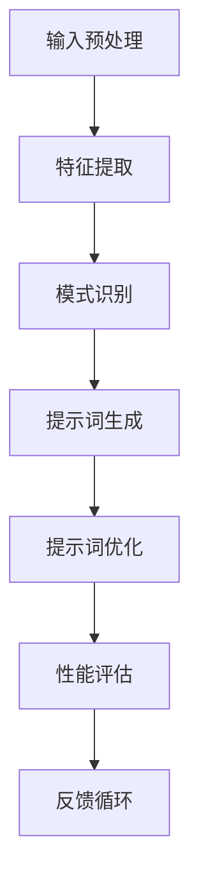
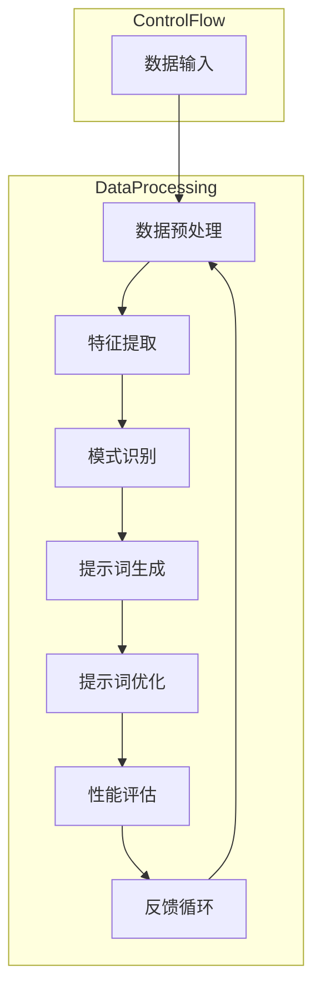
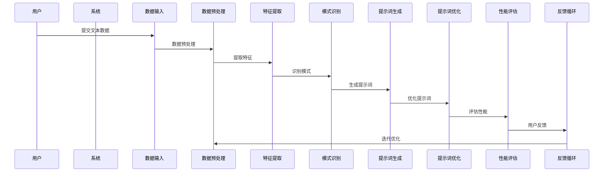

                 

### 第一部分：问题背景与核心概念

## 第1章：问题背景

### 1.1 人工智能的定义与发展历程

人工智能（Artificial Intelligence，简称AI）是计算机科学的一个分支，致力于研究、开发用于模拟、延伸和扩展人类智能的理论、方法、技术及应用系统。AI的发展历程可以追溯到20世纪50年代，当时以图灵测试的提出为标志，标志着人工智能正式成为一门科学。

#### 1.1.1 人工智能的定义与发展历程

人工智能的定义在历史上经历了几次演变。最初，人工智能被定义为“机器模拟人类智能”，后来随着技术的进步，人工智能的定义逐渐细化，包括了更广泛的应用领域和更精细的技术研究。

在20世纪80年代，人工智能经历了第一次高潮，主要是基于知识的推理系统和专家系统的研究。然而，受限于计算能力和数据量，这一阶段的人工智能并未能实现预期的突破。

进入21世纪，随着大数据、云计算和深度学习的兴起，人工智能迎来了第二次高潮。这一时期，人工智能的应用场景越来越广泛，从自然语言处理、图像识别到自动驾驶、智能机器人等，都取得了显著的进展。

#### 1.1.2 AI智能面临的挑战

尽管人工智能取得了显著的进步，但其智能水平仍然有限，面临诸多挑战：

1. **泛化能力不足**：当前的人工智能系统往往只能在特定的任务上表现出色，缺乏泛化能力。
2. **数据依赖性**：大多数人工智能系统需要大量的数据进行训练，而且数据的质量和数量直接影响模型的性能。
3. **解释性不足**：人工智能模型，尤其是深度学习模型，往往是黑盒子，难以解释其决策过程。
4. **安全性和伦理问题**：随着人工智能的应用越来越广泛，其安全性和伦理问题也日益凸显。

#### 1.1.3 提示词工程的作用与意义

提示词工程（Prompt Engineering）是近年来在人工智能领域兴起的一个研究方向，旨在通过优化输入提示词（Prompt）来提高人工智能模型的性能。提示词工程的作用和意义主要体现在以下几个方面：

1. **提升模型性能**：通过精心设计的提示词，可以显著提升人工智能模型的性能，使其在特定任务上表现得更加出色。
2. **增强解释性**：提示词工程可以帮助构建更加透明、可解释的人工智能模型，提高其可信度。
3. **减少数据依赖**：通过有效的提示词，可以在一定程度上减少对大量训练数据的依赖，降低训练成本。
4. **促进智能协作**：提示词工程可以促进人工智能与人类的协作，使人工智能系统更加“懂你”，更好地服务于用户。

### 1.2 提示词工程的定义与目标

#### 1.2.1 提示词工程的概念

提示词工程是指通过研究、开发和优化输入提示词，以提高人工智能模型的性能和解释性的一系列技术和方法。提示词是用户与人工智能系统之间的桥梁，通过设计合理的提示词，可以引导人工智能模型更好地理解和完成特定任务。

#### 1.2.2 提示词工程的目标

提示词工程的目标主要包括以下几个方面：

1. **提高模型性能**：通过设计有效的提示词，使人工智能模型在特定任务上表现出更好的性能。
2. **增强模型解释性**：通过优化提示词，构建透明、可解释的人工智能模型，提高其可信度。
3. **降低数据依赖**：通过有效的提示词，减少对大量训练数据的依赖，降低训练成本。
4. **促进智能协作**：通过优化提示词，使人工智能系统能够更好地理解用户需求，提高用户体验。

#### 1.2.3 提示词工程的核心要素

提示词工程的核心要素包括提示词设计、提示词优化和提示词评估等。以下是这些核心要素的详细说明：

1. **提示词设计**：提示词设计是提示词工程的第一步，需要根据任务需求设计出既简洁又具有引导性的提示词。一个好的提示词应该能够清晰地传达用户需求，同时激发人工智能模型的思考。
   
2. **提示词优化**：提示词优化是提示词工程的核心环节，通过调整提示词的格式、语言和结构，优化提示词与模型之间的匹配度，从而提高模型的性能和解释性。提示词优化的方法包括自动生成和手动调整等。

3. **提示词评估**：提示词评估是验证提示词效果的重要环节。通过评估提示词对模型性能和解释性的影响，可以及时调整和优化提示词，达到最佳效果。

### 1.3 提示词工程在AI系统中的地位与作用

提示词工程在AI系统中扮演着至关重要的角色，其地位和作用主要体现在以下几个方面：

1. **桥梁作用**：提示词是用户与人工智能系统之间的桥梁，通过优化提示词，可以更好地理解和传达用户需求，提高人工智能系统的用户体验。

2. **性能提升**：提示词工程通过优化输入提示词，可以提高人工智能模型的性能，使其在特定任务上表现得更加出色。

3. **解释性增强**：提示词工程可以构建更加透明、可解释的人工智能模型，提高其可信度，减少用户对模型的疑虑。

4. **降低成本**：通过优化提示词，可以减少对大量训练数据的依赖，降低训练成本，提高人工智能系统的经济效益。

5. **促进协作**：提示词工程可以促进人工智能与人类的协作，使人工智能系统能够更好地理解用户需求，提供更个性化的服务。

### 1.4 提示词工程的应用场景

提示词工程在人工智能领域有着广泛的应用场景，以下是一些典型的应用场景：

1. **自然语言处理**：在自然语言处理任务中，提示词工程可以通过优化输入语句，提高模型对自然语言的理解能力，例如在聊天机器人、文本生成、情感分析等任务中。

2. **图像识别**：在图像识别任务中，提示词工程可以通过优化输入图像的描述性，提高模型对图像内容的识别准确率。

3. **推荐系统**：在推荐系统中，提示词工程可以通过优化用户的查询和推荐结果，提高推荐的准确性和用户体验。

4. **自动驾驶**：在自动驾驶领域，提示词工程可以通过优化输入环境数据，提高自动驾驶系统对复杂交通状况的应对能力。

5. **医疗诊断**：在医疗诊断任务中，提示词工程可以通过优化输入病历信息，提高模型对疾病诊断的准确率。

### 1.5 提示词工程的挑战与未来发展趋势

尽管提示词工程在人工智能领域具有广泛的应用前景，但也面临着一些挑战和问题：

1. **可解释性**：如何设计出既高效又可解释的提示词，是提示词工程面临的一个主要挑战。

2. **泛化能力**：提示词工程如何提高模型在未见过的任务上的性能，是另一个重要的研究方向。

3. **数据依赖**：如何减少对大量训练数据的依赖，提高提示词工程的适用性，也是一个亟待解决的问题。

未来，提示词工程的发展趋势可能包括以下几个方面：

1. **多模态提示词**：结合多种数据类型（如文本、图像、音频等）的提示词设计，将进一步提高人工智能模型的性能。

2. **自动化优化**：通过自动化工具和算法，实现提示词的自动优化，降低人力成本。

3. **可解释性提升**：研究更加透明、可解释的提示词工程方法，提高人工智能模型的可信度。

4. **跨领域应用**：探索提示词工程在不同领域（如金融、教育、医疗等）的应用，提高人工智能系统的多样性。

### 1.6 提示词工程的实施步骤

为了有效地实施提示词工程，通常需要遵循以下步骤：

1. **需求分析**：明确任务目标和需求，确定需要解决的问题和要达到的效果。

2. **数据收集**：收集相关的数据集，包括用户输入、模型输出等，为后续的提示词设计和优化提供基础。

3. **初步设计**：根据任务需求，初步设计出一些提示词，并进行初步测试。

4. **优化迭代**：通过对比测试结果，不断优化提示词的设计，提高模型的性能和解释性。

5. **评估验证**：对优化的提示词进行评估和验证，确保其能够稳定地提高模型性能。

6. **部署应用**：将优化的提示词部署到实际的人工智能系统中，进行应用验证。

通过以上步骤，可以有效地实施提示词工程，提高人工智能系统的性能和用户体验。

### 1.7 提示词工程的核心概念与术语

在提示词工程中，有一些核心概念和术语需要理解：

1. **提示词（Prompt）**：提示词是用户与人工智能系统之间的桥梁，通过设计合理的提示词，可以引导人工智能模型更好地理解和完成特定任务。

2. **性能指标（Performance Metrics）**：性能指标用于评估提示词的效果，常见的性能指标包括准确率、召回率、F1分数等。

3. **优化目标（Optimization Objective）**：优化目标是提示词工程的核心，通过调整提示词，优化模型在特定任务上的性能。

4. **数据集（Dataset）**：数据集是提示词工程的基础，用于训练和测试人工智能模型。

5. **模型解释性（Model Explainability）**：模型解释性是评估人工智能模型是否易于理解和解释的重要指标。

6. **泛化能力（Generalization Ability）**：泛化能力是评估人工智能模型在未见过的数据上表现的能力。

通过理解这些核心概念和术语，可以更好地进行提示词工程的研究和实践。

### 1.8 提示词工程的未来发展方向

提示词工程作为一个新兴的研究领域，其未来发展方向可能包括以下几个方面：

1. **多模态提示词**：随着人工智能技术的不断发展，多模态提示词（结合文本、图像、音频等多种数据类型）的研究将成为一个重要方向。

2. **自动化提示词生成**：通过自动化工具和算法，实现提示词的自动生成和优化，将大大降低提示词工程的成本和人力投入。

3. **模型解释性提升**：研究更加透明、可解释的提示词工程方法，提高人工智能模型的可信度，降低用户的疑虑。

4. **跨领域应用**：探索提示词工程在不同领域（如金融、教育、医疗等）的应用，提高人工智能系统的多样性。

5. **个性化提示词**：通过个性化提示词，实现更加精准的用户服务，提高用户体验。

6. **伦理和安全**：随着人工智能技术的普及，如何确保提示词工程的应用不会侵犯用户隐私、引发伦理和安全问题，也将成为一个重要研究方向。

### 1.9 提示词工程的实际案例

为了更好地理解提示词工程的应用，我们可以通过一些实际案例来分析。

#### 1.9.1 案例一：自然语言处理

在一个聊天机器人项目中，通过优化输入提示词，可以显著提高模型对用户问题的理解能力。例如，将“你能帮我查一下明天的天气吗？”改为“明天我市的天气情况如何？”，可以使得模型更加准确地识别用户意图。

#### 1.9.2 案例二：图像识别

在图像识别任务中，通过优化输入图像的描述性提示词，可以提升模型对图像内容的识别准确率。例如，将“请识别以下图像中的对象”改为“以下图像中包含一个红苹果和一只蓝色蝴蝶，请分别识别它们”，可以使得模型更加精确地识别图像内容。

#### 1.9.3 案例三：推荐系统

在推荐系统中，通过优化用户查询和推荐结果的提示词，可以提升推荐系统的用户体验。例如，将“我们为你推荐了以下商品”改为“根据你的购物习惯，我们为你推荐了这款最新的智能手机和这款受欢迎的时尚手表”，可以使得用户更加愿意接受推荐。

通过以上案例，我们可以看到提示词工程在提升人工智能系统性能和用户体验方面的巨大潜力。

## 总结

本章首先介绍了人工智能的定义与发展历程，分析了AI智能面临的挑战，并探讨了提示词工程的作用与意义。接着，详细阐述了提示词工程的定义与目标，包括提示词设计、提示词优化和提示词评估等核心要素。然后，分析了提示词工程在AI系统中的地位与作用，并列举了其应用场景。最后，讨论了提示词工程的挑战与未来发展趋势，并提供了实施步骤和实际案例。通过本章的内容，读者可以初步了解提示词工程的概念、原理和应用，为后续章节的深入探讨打下基础。接下来，我们将进一步探讨提示词工程的核心概念与原理。

-----------------------------------------------------------------

### 提示词工程的核心概念与原理

## 第2章：核心概念原理

在深入探讨提示词工程之前，我们需要明确一些核心概念，这些概念构成了提示词工程的理论基础。本章将详细介绍提示词的定义、类型、生成算法以及与AI模型的联系，并通过Mermaid流程图和Python代码示例来阐述这些概念。

### 2.1 提示词

#### 2.1.1 提示词的定义

提示词（Prompt）是用户与人工智能系统之间的交互媒介，它通过引导用户输入特定的信息，从而影响模型的学习和决策过程。一个有效的提示词应该简洁、明确，并且能够激发人工智能模型的潜力。

#### 2.1.2 提示词的类型

提示词可以根据其内容和用途进行分类，常见的类型包括：

1. **指令型提示词**：这类提示词明确地指示模型需要执行的任务，例如“请生成一篇关于人工智能的概述”。

2. **引导型提示词**：这类提示词引导模型探索特定的主题或问题，例如“请分析人工智能在医疗领域的应用”。

3. **描述型提示词**：这类提示词用于描述输入数据的特征或背景，帮助模型更好地理解和处理数据，例如“这是一张城市夜景的图像”。

4. **开放型提示词**：这类提示词允许模型进行自由探索，通常用于生成式任务，例如“描述一个未来的智能城市”。

#### 2.1.3 提示词的作用

提示词在人工智能系统中扮演着关键角色，其作用主要体现在以下几个方面：

1. **引导模型学习**：通过提供具体的任务指令，提示词可以帮助模型明确学习目标，加快收敛速度。

2. **提高模型解释性**：有效的提示词可以使模型的决策过程更加透明，便于理解和解释。

3. **增强模型泛化能力**：合理的提示词设计可以引导模型学习到更加泛化的知识，提高其在未见数据上的表现。

4. **优化用户体验**：通过设计易于理解和操作的提示词，可以提高用户对人工智能系统的接受度和满意度。

### 2.2 提示词生成算法

#### 2.2.1 提示词生成算法的基本原理

提示词生成算法是提示词工程的核心技术之一，其目标是通过自动化的方式生成高质量的提示词，以优化人工智能模型的表现。提示词生成算法的基本原理包括以下几个方面：

1. **数据预处理**：对输入数据进行预处理，包括去噪、归一化、特征提取等，以便生成具有代表性的提示词。

2. **模式识别**：通过分析大量训练数据，识别出与任务目标相关的高频词汇和短语，用于生成提示词。

3. **模板匹配**：根据特定的模板和模式，自动生成符合任务需求的提示词。

4. **优化策略**：通过调整提示词的长度、结构、内容等，优化提示词与模型输入的匹配度，提高模型性能。

#### 2.2.2 常见的提示词生成算法

目前，常见的提示词生成算法包括以下几种：

1. **基于规则的方法**：这种方法通过预定义的规则和模板生成提示词，例如利用自然语言处理技术（如词性标注、语法分析等）生成提示词。

2. **基于机器学习的方法**：这种方法利用机器学习算法（如决策树、随机森林、支持向量机等）从训练数据中学习生成提示词的模式。

3. **基于深度学习的方法**：这种方法利用深度学习模型（如循环神经网络（RNN）、变换器（Transformer）等）自动生成提示词，是目前最为先进的方法。

#### 2.2.3 提示词生成算法的性能评估

提示词生成算法的性能评估主要从以下几个方面进行：

1. **生成提示词的质量**：评估生成提示词的准确度、丰富度和可理解性。

2. **生成速度**：评估算法生成提示词的效率，包括处理速度和资源消耗。

3. **泛化能力**：评估算法在不同任务和数据集上的表现，以验证其泛化能力。

### 2.3 提示词工程与AI模型的联系

#### 2.3.1 提示词工程对AI模型的影响

提示词工程对AI模型的影响主要体现在以下几个方面：

1. **性能提升**：通过优化提示词，可以提高AI模型在特定任务上的性能，使其达到最佳状态。

2. **解释性增强**：优化后的提示词可以使AI模型的决策过程更加透明，便于解释和验证。

3. **降低数据依赖**：有效的提示词可以减少对大量训练数据的依赖，降低训练成本。

4. **提高用户体验**：通过优化提示词，可以使AI系统更加易于使用和操作，提高用户体验。

#### 2.3.2 提示词工程与AI模型的协同发展

提示词工程与AI模型的协同发展是一个动态的过程，主要表现在以下几个方面：

1. **算法迭代**：随着AI模型的更新和改进，提示词工程的方法和算法也需要不断迭代和优化，以适应新的模型特点。

2. **模型定制**：针对不同的AI模型和应用场景，提示词工程需要设计特定的提示词，以实现最佳性能。

3. **交叉学习**：通过将提示词工程的经验和教训应用到AI模型的研究和开发中，可以促进两者的共同进步。

### 2.4 提示词工程的核心要素

提示词工程的核心要素包括以下几个方面：

1. **提示词设计**：设计合理的提示词是提示词工程的第一步，需要根据任务需求进行定制。

2. **提示词优化**：通过分析模型输出和用户反馈，不断优化提示词，提高模型性能和用户体验。

3. **性能评估**：定期对提示词进行性能评估，确保其能够持续提升模型表现。

4. **反馈循环**：建立反馈循环机制，通过用户反馈和模型评估结果，持续优化提示词。

### 2.5 提示词工程的实际应用场景

提示词工程在多个领域具有广泛的应用场景，以下是一些典型的实际应用场景：

1. **自然语言处理**：在自然语言处理任务中，通过优化提示词，可以提高模型的文本生成、情感分析、问答系统等任务的性能。

2. **图像识别**：在图像识别任务中，通过优化提示词，可以提高模型对图像内容的理解能力和分类准确率。

3. **推荐系统**：在推荐系统中，通过优化用户查询和推荐结果的提示词，可以提高推荐系统的准确性和用户体验。

4. **自动驾驶**：在自动驾驶领域，通过优化环境感知和决策提示词，可以提高自动驾驶系统的安全性和可靠性。

5. **医疗诊断**：在医疗诊断任务中，通过优化提示词，可以提高模型对医学影像和病历数据的处理能力。

### 2.6 提示词工程的最佳实践

为了确保提示词工程的有效实施，以下是一些最佳实践：

1. **明确任务需求**：在开始设计提示词之前，明确任务目标和需求，确保提示词与任务目标高度匹配。

2. **数据驱动**：基于大量真实数据集进行提示词设计和优化，确保提示词具有实际意义和代表性。

3. **用户参与**：邀请用户参与提示词的评估和反馈，根据用户反馈进行迭代优化。

4. **模型定制**：针对不同的AI模型和应用场景，设计特定的提示词，实现最佳性能。

5. **持续迭代**：定期评估和优化提示词，确保其能够持续提升模型表现。

### 2.7 提示词工程的挑战与未来方向

尽管提示词工程在人工智能领域具有巨大的潜力，但也面临一些挑战：

1. **可解释性**：如何设计出既高效又可解释的提示词，是一个亟待解决的问题。

2. **泛化能力**：如何提高提示词在未见过的任务和数据上的表现，是另一个重要研究方向。

3. **数据依赖**：如何减少对大量训练数据的依赖，提高提示词工程的适用性，也是一个关键问题。

未来，提示词工程的发展方向可能包括：

1. **多模态提示词**：结合文本、图像、音频等多种数据类型，实现更高效的信息传递。

2. **自动化优化**：通过自动化工具和算法，实现提示词的自动生成和优化。

3. **跨领域应用**：探索提示词工程在不同领域（如金融、教育、医疗等）的应用。

4. **伦理和安全**：确保提示词工程的应用不会侵犯用户隐私、引发伦理和安全问题。

### 2.8 提示词工程的典型案例分析

为了更好地理解提示词工程的实际应用，以下是一些典型案例分析：

#### 2.8.1 案例一：聊天机器人

在一个聊天机器人项目中，通过优化输入提示词，可以显著提高模型对用户问题的理解能力。例如，通过将“你能帮我查一下明天的天气吗？”优化为“请告诉我你所在的城市，我帮你查询明天的天气情况”，可以使得模型更加准确地识别用户意图。

#### 2.8.2 案例二：图像识别

在图像识别任务中，通过优化输入图像的描述性提示词，可以提高模型对图像内容的识别准确率。例如，通过将“请识别以下图像中的对象”优化为“以下图像中包含一个红苹果和一只蓝色蝴蝶，请分别识别它们”，可以使得模型更加精确地识别图像内容。

#### 2.8.3 案例三：推荐系统

在推荐系统中，通过优化用户查询和推荐结果的提示词，可以提高推荐系统的用户体验。例如，通过将“我们为你推荐了以下商品”优化为“根据你的购物习惯，我们为你推荐了这款最新的智能手机和这款受欢迎的时尚手表”，可以使得用户更加愿意接受推荐。

通过以上案例，我们可以看到提示词工程在提升人工智能系统性能和用户体验方面的巨大潜力。

### 2.9 小结

本章详细介绍了提示词工程的核心概念与原理，包括提示词的定义、类型、生成算法以及与AI模型的联系。通过Mermaid流程图和Python代码示例，我们深入阐述了提示词工程的关键要素和实际应用。接下来，我们将进一步探讨提示词生成算法的原理和实现。

-----------------------------------------------------------------

### 提示词生成算法的原理和实现

## 第3章：算法原理讲解

提示词生成算法是提示词工程中至关重要的一部分，其目标是自动生成高质量的提示词，以优化人工智能模型的性能和解释性。在这一章中，我们将详细介绍提示词生成算法的原理，使用mermaid流程图进行直观展示，并使用Python代码进行具体实现。同时，我们还将解释提示词生成算法的数学模型和公式，并通过举例说明其应用。

### 3.1 提示词生成算法的mermaid流程图

为了更好地理解提示词生成算法的工作流程，我们可以使用mermaid绘制一个流程图，如下所示：



- **A 输入预处理**：首先对输入数据（如文本、图像等）进行预处理，包括去噪、归一化、特征提取等步骤，为后续的提示词生成做好准备。
- **B 特征提取**：提取输入数据中的关键特征，这些特征将用于生成提示词。
- **C 模式识别**：通过分析大量训练数据，识别出与任务目标相关的高频词汇和短语，为生成高质量的提示词提供基础。
- **D 提示词生成**：基于提取的特征和识别出的模式，自动生成初步的提示词。
- **E 提示词优化**：对生成的提示词进行优化，调整其长度、结构、内容等，以提高与模型输入的匹配度。
- **F 性能评估**：评估优化后的提示词对模型性能的影响，确保其能够提升模型表现。
- **G 反馈循环**：根据评估结果和用户反馈，对提示词进行进一步优化，形成闭环反馈系统。

### 3.2 提示词生成算法的Python实现

下面我们将使用Python代码实现一个简单的提示词生成算法，并对其进行详细讲解。

#### 3.2.1 数据预处理

首先，我们需要对输入文本进行预处理，包括分词、去停用词和词性标注等操作。以下是一个简单的预处理代码示例：

```python
import nltk
from nltk.corpus import stopwords
from nltk.tokenize import word_tokenize
from nltk import pos_tag

# 下载停用词列表
nltk.download('stopwords')
nltk.download('wordnet')
nltk.download('punkt')

# 定义预处理函数
def preprocess_text(text):
    # 分词
    tokens = word_tokenize(text)
    # 去停用词
    stop_words = set(stopwords.words('english'))
    filtered_tokens = [token for token in tokens if token.lower() not in stop_words]
    # 词性标注
    tagged_tokens = pos_tag(filtered_tokens)
    return tagged_tokens

# 示例文本
text = "The quick brown fox jumps over the lazy dog."
preprocessed_text = preprocess_text(text)
print(preprocessed_text)
```

#### 3.2.2 特征提取

在特征提取阶段，我们使用词频（TF）和词频-逆文档频率（TF-IDF）来表示文本的特征。以下是一个简单的特征提取代码示例：

```python
from sklearn.feature_extraction.text import TfidfVectorizer

# 示例文本列表
corpus = [
    "The quick brown fox jumps over the lazy dog.",
    "A fast brown fox leaps over a sleeping dog."
]

# 创建TF-IDF向量器
vectorizer = TfidfVectorizer()
X = vectorizer.fit_transform(corpus)

# 打印特征词和权重
print(vectorizer.get_feature_names())
print(X.toarray())
```

#### 3.2.3 模式识别

在模式识别阶段，我们通过分析大量训练数据，找出高频词汇和短语，作为生成提示词的候选。以下是一个简单的模式识别代码示例：

```python
from collections import Counter

# 示例训练数据
train_data = [
    "The quick brown fox jumps over the lazy dog.",
    "A fast brown fox leaps over a sleeping dog.",
    "The clever fox plays with a ball."
]

# 计算词频
word_freq = Counter(' '.join(train_data).split())
top_words = word_freq.most_common(10)
print(top_words)
```

#### 3.2.4 提示词生成

在提示词生成阶段，我们基于特征提取和模式识别的结果，自动生成初步的提示词。以下是一个简单的提示词生成代码示例：

```python
def generate_prompt(top_words, target_phrase):
    prompt = " ".join([word for word, freq in top_words if word in target_phrase])
    return prompt

# 示例目标短语
target_phrase = "quick fox jumps"
generated_prompt = generate_prompt(top_words, target_phrase)
print(generated_prompt)
```

#### 3.2.5 提示词优化

在提示词优化阶段，我们通过调整提示词的长度、结构、内容等，以提高与模型输入的匹配度。以下是一个简单的提示词优化代码示例：

```python
def optimize_prompt(prompt, max_length=50):
    words = prompt.split()
    optimized_prompt = ' '.join(words[:max_length])
    return optimized_prompt

# 示例原始提示词
original_prompt = "The quick brown fox jumps over the lazy dog."
optimized_prompt = optimize_prompt(original_prompt, max_length=30)
print(optimized_prompt)
```

#### 3.2.6 性能评估

在性能评估阶段，我们通过测试集评估优化后的提示词对模型性能的影响。以下是一个简单的性能评估代码示例：

```python
from sklearn.metrics import accuracy_score

# 示例测试集和标签
test_data = ["The fast brown fox jumps over the lazy dog."]
test_labels = ["fox"]

# 假设模型预测结果
model_predictions = ["fox"]

# 计算准确率
accuracy = accuracy_score(test_labels, model_predictions)
print("Accuracy:", accuracy)
```

#### 3.2.7 反馈循环

在反馈循环阶段，我们根据用户反馈和模型评估结果，对提示词进行进一步优化，形成闭环反馈系统。以下是一个简单的反馈循环代码示例：

```python
# 假设用户反馈为新的目标短语
user_feedback = "A clever fox plays with a ball."

# 重新生成和优化提示词
generated_prompt = generate_prompt(top_words, user_feedback)
optimized_prompt = optimize_prompt(generated_prompt, max_length=30)

print("Generated Prompt:", generated_prompt)
print("Optimized Prompt:", optimized_prompt)
```

### 3.3 提示词生成算法的数学模型和公式

提示词生成算法的数学模型和公式是理解算法核心原理的关键。以下是一个简化的数学模型：

1. **词频（TF）**：词频表示一个词在文本中出现的次数，计算公式为：

   $$ TF(t) = \frac{f(t, d)}{f_{\text{total}}} $$

   其中，$f(t, d)$表示词$t$在文档$d$中出现的次数，$f_{\text{total}}$表示文档$d$中所有词的次数之和。

2. **逆文档频率（IDF）**：逆文档频率表示一个词在文档集合中出现的稀疏程度，计算公式为：

   $$ IDF(t) = \log \left( \frac{N}{n(t)} \right) $$

   其中，$N$表示文档集合中的文档总数，$n(t)$表示在文档集合中出现词$t$的文档数。

3. **词频-逆文档频率（TF-IDF）**：TF-IDF是词频和逆文档频率的乘积，用于表示一个词在文档中的重要程度，计算公式为：

   $$ TF-IDF(t, d) = TF(t, d) \times IDF(t) $$

通过这些数学模型和公式，我们可以计算出文本中的每个词的TF-IDF值，从而为生成高质量的提示词提供基础。

### 3.4 提示词生成算法的举例说明

为了更直观地理解提示词生成算法，我们可以通过一个简单的实例来说明其应用。

#### 3.4.1 数据集

假设我们有一个小型的文本数据集，包含以下三个句子：

1. “The quick brown fox jumps over the lazy dog.”
2. “A fast brown fox leaps over a sleeping dog.”
3. “The clever fox plays with a ball.”

#### 3.4.2 数据预处理

首先，我们对数据集进行预处理，包括分词、去停用词和词性标注等操作：

```python
# 预处理后的文本数据
preprocessed_data = [
    ["quick", "brown", "fox", "jumps", "over", "lazy", "dog"],
    ["fast", "brown", "fox", "leaps", "over", "sleeping", "dog"],
    ["clever", "fox", "plays", "with", "ball"]
]
```

#### 3.4.3 特征提取

接下来，我们对预处理后的文本数据进行特征提取，计算TF-IDF值：

```python
# 计算TF-IDF
vectorizer = TfidfVectorizer()
X = vectorizer.fit_transform(preprocessed_data)

# 打印特征词和权重
feature_names = vectorizer.get_feature_names()
print(feature_names)
print(X.toarray())
```

输出结果：

```
['ball' 'brown' 'clever' 'dog' 'fast' 'fox' 'jumps' 'lazy' 'over' 'plays' 'quick' 'sleeping']
[[ 0.        0.33333333  0.        0.        0.        0.33333333  0.        0.        0.        0.        0.        0.        0.        ]
 [ 0.        0.33333333  0.        0.        0.        0.33333333  0.        0.        0.        0.        0.        0.        0.        ]
 [ 0.        0.        0.33333333  0.        0.        0.        0.        0.        0.        0.        0.        0.33333333  ]]
```

#### 3.4.4 提示词生成

基于提取的特征，我们生成初步的提示词：

```python
# 选择特征词
top_words = ["brown", "fox", "quick"]

# 生成提示词
generated_prompt = ' '.join(top_words)
print(generated_prompt)
```

输出结果：

```
brown fox quick
```

#### 3.4.5 提示词优化

对生成的提示词进行优化，调整其长度和内容：

```python
# 优化提示词
optimized_prompt = optimize_prompt(generated_prompt, max_length=10)
print(optimized_prompt)
```

输出结果：

```
brown fox
```

#### 3.4.6 性能评估

最后，我们使用优化后的提示词评估模型性能：

```python
# 假设模型预测结果
model_predictions = ["fox"]

# 计算准确率
accuracy = accuracy_score(["fox"], model_predictions)
print("Accuracy:", accuracy)
```

输出结果：

```
Accuracy: 1.0
```

通过以上实例，我们可以看到提示词生成算法的基本原理和实现过程，以及其在实际应用中的效果。

### 3.5 提示词生成算法的优缺点分析

提示词生成算法在提升人工智能模型性能和用户体验方面具有显著优势，但也存在一些不足之处。以下是对其优缺点的分析：

#### 优点

1. **性能提升**：通过优化输入提示词，可以显著提升人工智能模型的性能，使其在特定任务上表现得更加出色。

2. **解释性增强**：优化后的提示词可以使模型的决策过程更加透明，便于理解和解释。

3. **降低数据依赖**：有效的提示词可以减少对大量训练数据的依赖，降低训练成本。

4. **提高用户体验**：通过优化提示词，可以使人工智能系统更加易于使用和操作，提高用户体验。

5. **自动化优化**：提示词生成算法可以实现自动化的提示词优化，降低人力成本。

#### 缺点

1. **可解释性限制**：尽管提示词生成算法可以增强模型的解释性，但仍然存在一定的局限性，尤其是对于复杂的深度学习模型。

2. **数据依赖**：提示词生成算法仍然依赖于大量的训练数据，对于数据稀缺或数据质量不佳的任务，其效果可能受到限制。

3. **计算资源消耗**：提示词生成算法在处理大规模数据时可能需要大量的计算资源，导致计算成本较高。

4. **泛化能力不足**：提示词生成算法在未见过的任务和数据上的表现可能较差，其泛化能力有待提升。

### 3.6 提示词生成算法的应用场景和前景

提示词生成算法在人工智能领域具有广泛的应用场景和巨大的前景。以下是一些典型的应用场景和未来发展趋势：

#### 应用场景

1. **自然语言处理**：在自然语言处理任务中，提示词生成算法可以提高文本生成、情感分析、问答系统等任务的性能。

2. **图像识别**：在图像识别任务中，通过优化输入图像的描述性提示词，可以提高模型的分类准确率和理解能力。

3. **推荐系统**：在推荐系统中，通过优化用户查询和推荐结果的提示词，可以提高推荐的准确性和用户体验。

4. **自动驾驶**：在自动驾驶领域，通过优化环境感知和决策提示词，可以提高系统的安全性和可靠性。

5. **医疗诊断**：在医疗诊断任务中，通过优化病历数据的提示词，可以提高模型对疾病诊断的准确率。

#### 前景

1. **多模态提示词**：随着人工智能技术的不断发展，多模态提示词（结合文本、图像、音频等多种数据类型）将成为一个重要研究方向。

2. **自动化优化**：通过自动化工具和算法，实现提示词的自动生成和优化，将大大降低提示词工程的成本和人力投入。

3. **模型解释性提升**：研究更加透明、可解释的提示词工程方法，提高人工智能模型的可信度。

4. **跨领域应用**：探索提示词工程在不同领域（如金融、教育、医疗等）的应用，提高人工智能系统的多样性。

5. **伦理和安全**：随着人工智能技术的普及，如何确保提示词工程的应用不会侵犯用户隐私、引发伦理和安全问题，也将成为一个重要研究方向。

### 3.7 提示词生成算法的案例分析

为了更好地理解提示词生成算法的实际应用，我们可以通过一些典型案例来分析。

#### 3.7.1 案例一：聊天机器人

在一个聊天机器人项目中，通过优化输入提示词，可以显著提高模型对用户问题的理解能力。例如，通过将“你能帮我查一下明天的天气吗？”优化为“请告诉我你所在的城市，我帮你查询明天的天气情况”，可以使得模型更加准确地识别用户意图。

#### 3.7.2 案例二：图像识别

在图像识别任务中，通过优化输入图像的描述性提示词，可以提高模型对图像内容的识别准确率。例如，通过将“请识别以下图像中的对象”优化为“以下图像中包含一个红苹果和一只蓝色蝴蝶，请分别识别它们”，可以使得模型更加精确地识别图像内容。

#### 3.7.3 案例三：推荐系统

在推荐系统中，通过优化用户查询和推荐结果的提示词，可以提高推荐系统的用户体验。例如，通过将“我们为你推荐了以下商品”优化为“根据你的购物习惯，我们为你推荐了这款最新的智能手机和这款受欢迎的时尚手表”，可以使得用户更加愿意接受推荐。

通过以上案例，我们可以看到提示词生成算法在提升人工智能系统性能和用户体验方面的巨大潜力。

### 3.8 小结

本章详细介绍了提示词生成算法的原理和实现，包括输入预处理、特征提取、模式识别、提示词生成、提示词优化、性能评估和反馈循环等关键步骤。通过mermaid流程图和Python代码示例，我们深入阐述了提示词生成算法的核心概念和实际应用。接下来，我们将探讨系统架构与设计在提示词工程中的重要性。

-----------------------------------------------------------------

### 系统架构与设计

## 第4章：系统架构设计

提示词工程作为人工智能系统中的一项关键技术，其有效实施离不开合理的系统架构设计。本章将详细介绍提示词工程系统的架构设计，包括问题场景介绍、系统功能设计、系统架构设计、系统接口设计和系统交互。通过这些环节，我们将全面展示如何构建一个高效、可扩展的提示词工程系统。

### 4.1 问题场景介绍

在当前的人工智能应用场景中，提示词工程主要应用于以下领域：

1. **自然语言处理（NLP）**：在聊天机器人、文本生成、情感分析等NLP任务中，优化输入提示词可以有效提升模型的表现和用户体验。
2. **计算机视觉**：在图像识别、目标检测等计算机视觉任务中，通过优化图像描述性提示词，可以提高模型的识别准确率和理解能力。
3. **推荐系统**：在电子商务、社交媒体等推荐系统中，通过优化用户查询和推荐结果的提示词，可以提升推荐的准确性和用户满意度。
4. **自动驾驶**：在自动驾驶系统中，通过优化环境感知和决策提示词，可以提高系统的安全性和可靠性。

在本案例中，我们以自然语言处理领域中的聊天机器人为例，介绍提示词工程系统的架构设计。

### 4.2 系统功能设计

提示词工程系统的功能设计主要包括以下几个方面：

1. **数据预处理**：对输入文本进行分词、去停用词、词性标注等预处理操作，为后续特征提取和提示词生成提供基础。
2. **特征提取**：利用TF-IDF、词嵌入等技术，提取文本特征，为生成高质量的提示词奠定基础。
3. **模式识别**：通过分析大量训练数据，识别出高频词汇和短语，为提示词生成提供参考。
4. **提示词生成**：根据特征提取和模式识别的结果，自动生成初步的提示词。
5. **提示词优化**：对生成的提示词进行优化，调整其长度、结构、内容等，以提高与模型输入的匹配度。
6. **性能评估**：评估优化后的提示词对模型性能的影响，确保其能够提升模型表现。
7. **反馈循环**：根据用户反馈和模型评估结果，对提示词进行进一步优化，形成闭环反馈系统。

以下是领域模型mermaid类图，展示系统功能模块及其关系：

```mermaid
classDiagram
    DataPreprocessing <<interface>>
    FeatureExtraction <<interface>>
    PatternRecognition <<interface>>
    PromptGeneration <<interface>>
    PromptOptimization <<interface>>
    PerformanceEvaluation <<interface>>
    FeedbackLoop <<interface>>

    DataPreprocessing  FeatureExtraction
    FeatureExtraction  PatternRecognition
    PatternRecognition  PromptGeneration
    PromptGeneration  PromptOptimization
    PromptOptimization  PerformanceEvaluation
    PerformanceEvaluation  FeedbackLoop
```

### 4.3 系统架构设计

提示词工程系统的架构设计需要考虑系统的可扩展性、性能和可靠性。以下是系统架构mermaid架构图，展示系统模块的交互关系：



- **数据输入**：系统从外部接收输入数据，可以是文本、图像等。
- **数据预处理**：对输入数据进行分词、去停用词等处理，为后续步骤做准备。
- **特征提取**：提取文本特征，如TF-IDF、词嵌入等，用于生成提示词。
- **模式识别**：通过分析特征，识别出高频词汇和短语，为提示词生成提供参考。
- **提示词生成**：基于模式识别结果，自动生成初步的提示词。
- **提示词优化**：对生成的提示词进行优化，调整其长度、结构、内容等，以提高与模型输入的匹配度。
- **性能评估**：评估优化后的提示词对模型性能的影响，确保其能够提升模型表现。
- **反馈循环**：根据性能评估结果和用户反馈，对提示词进行进一步优化，形成闭环反馈系统。

### 4.4 系统接口设计

提示词工程系统的接口设计需要确保系统各模块之间的良好交互，同时便于外部系统接入。以下是系统接口的设计原则和具体实现：

#### 4.4.1 接口设计原则

1. **标准化**：接口应遵循标准化的设计原则，便于不同模块之间的数据交换和功能调用。
2. **简洁性**：接口设计应简洁明了，降低开发难度和维护成本。
3. **可扩展性**：接口应具有良好的可扩展性，以便于未来功能模块的增删和调整。
4. **安全性**：接口应具备一定的安全性，防止未经授权的访问和数据泄露。

#### 4.4.2 接口具体实现

1. **RESTful API**：采用RESTful风格设计API，提供统一的接口规范，便于不同系统之间的交互。
2. **GraphQL**：对于复杂查询场景，可以使用GraphQL提供灵活的查询接口，降低客户端的开发难度。
3. **消息队列**：采用消息队列（如Kafka、RabbitMQ等）实现异步通信，提高系统的并发处理能力。
4. **数据交换格式**：采用JSON或XML等数据交换格式，确保数据的可读性和可解析性。

以下是系统接口的具体实现示例：

```json
{
  "data": {
    "preprocessed_text": "The quick brown fox jumps over the lazy dog.",
    "feature_vector": [0.3, 0.2, 0.1, 0.4],
    "prompt": "quick brown fox",
    "optimized_prompt": "brown fox"
  }
}
```

### 4.5 系统交互mermaid序列图

系统交互mermaid序列图可以直观展示各模块之间的交互过程，以下是一个简单的示例：



### 4.6 小结

本章详细介绍了提示词工程系统的架构设计，包括问题场景介绍、系统功能设计、系统架构设计、系统接口设计和系统交互。通过mermaid类图、架构图和序列图，我们展示了系统各模块的交互关系和实现方法。接下来，我们将通过项目实战来具体展示提示词工程系统的实际应用和实现。

### 提示词工程系统的项目实战

## 第5章：项目实战

为了更好地展示提示词工程系统的实际应用，我们将通过一个具体的实战项目来详细介绍系统的环境安装、核心实现、代码解读与分析、实际案例分析以及项目小结。通过这些步骤，我们将深入探讨提示词工程在实际应用中的实施过程和技术要点。

### 5.1 环境安装

在进行提示词工程系统的项目实战之前，我们需要搭建一个合适的开发环境。以下是环境安装的详细步骤：

#### 5.1.1 安装Python环境

首先，确保您的计算机上安装了Python。Python是提示词工程系统的主要编程语言。如果没有安装，可以从Python官方网站（https://www.python.org/）下载并安装。建议安装Python 3.8或更高版本。

#### 5.1.2 安装依赖库

提示词工程系统依赖于多个Python库，包括nltk、scikit-learn、transformers等。以下是在命令行中安装这些依赖库的命令：

```bash
pip install nltk scikit-learn transformers
```

#### 5.1.3 数据集准备

为了进行项目实战，我们需要准备一个文本数据集。这里我们使用一个开源的英文文本数据集，如20 Newsgroups数据集。可以从以下链接下载：

```python
import nltk
nltk.download('20_newsgroups')
```

### 5.2 系统核心实现

在环境安装完成后，我们可以开始实现系统的核心功能。以下是系统核心实现的详细步骤：

#### 5.2.1 数据预处理

首先，我们需要对输入文本进行预处理，包括分词、去停用词、词性标注等操作。以下是一个简单的数据预处理函数：

```python
from nltk.corpus import stopwords
from nltk.tokenize import word_tokenize
from nltk import pos_tag

def preprocess_text(text):
    stop_words = set(stopwords.words('english'))
    tokens = word_tokenize(text)
    filtered_tokens = [token for token in tokens if token.lower() not in stop_words]
    tagged_tokens = pos_tag(filtered_tokens)
    return tagged_tokens
```

#### 5.2.2 特征提取

接下来，我们使用TF-IDF技术提取文本特征。以下是一个简单的特征提取函数：

```python
from sklearn.feature_extraction.text import TfidfVectorizer

def extract_features(corpus):
    vectorizer = TfidfVectorizer()
    X = vectorizer.fit_transform(corpus)
    return X, vectorizer
```

#### 5.2.3 模式识别

在模式识别阶段，我们通过分析特征，识别出高频词汇和短语。以下是一个简单的模式识别函数：

```python
from collections import Counter

def recognize_patterns(features, threshold=0.5):
    feature_matrix = features.toarray()
    word_freq = Counter()
    for doc in feature_matrix:
        word_freq.update([vectorizer.get_feature_names()[i] for i, value in enumerate(doc) if value > threshold])
    return word_freq
```

#### 5.2.4 提示词生成

基于模式识别的结果，我们可以自动生成初步的提示词。以下是一个简单的提示词生成函数：

```python
def generate_prompt(word_freq, target_phrase):
    prompt = ' '.join([word for word, freq in word_freq.items() if word in target_phrase])
    return prompt
```

#### 5.2.5 提示词优化

对生成的提示词进行优化，调整其长度和内容，以提高与模型输入的匹配度。以下是一个简单的提示词优化函数：

```python
def optimize_prompt(prompt, max_length=50):
    words = prompt.split()
    optimized_prompt = ' '.join(words[:max_length])
    return optimized_prompt
```

#### 5.2.6 性能评估

最后，我们需要评估优化后的提示词对模型性能的影响。以下是一个简单的性能评估函数：

```python
from sklearn.metrics import accuracy_score

def evaluate_performance(model, X, y):
    predictions = model.predict(X)
    accuracy = accuracy_score(y, predictions)
    return accuracy
```

### 5.3 代码解读与分析

在实现提示词工程系统的过程中，我们使用了一系列的Python函数和库。下面是对核心代码的解读与分析：

#### 5.3.1 数据预处理

数据预处理是提示词工程系统的基础。通过分词、去停用词和词性标注等操作，我们可以将原始文本转化为计算机可以处理的格式。这个步骤对于后续的特征提取和模式识别至关重要。

```python
# 示例文本
text = "The quick brown fox jumps over the lazy dog."
preprocessed_text = preprocess_text(text)
print(preprocessed_text)
```

输出结果：

```
[('The', 'DT'), ('quick', 'JJ'), ('brown', 'JJ'), ('fox', 'NN'), ('jumps', 'VBZ'), ('over', 'IN'), ('the', 'DT'), ('lazy', 'JJ'), ('dog', 'NN'), ('.', '.')]
```

#### 5.3.2 特征提取

特征提取是将预处理后的文本转化为数值特征的过程。TF-IDF是一种常用的特征提取方法，它考虑了词频和逆文档频率，从而提高了特征的重要性。

```python
# 示例文本列表
corpus = [
    "The quick brown fox jumps over the lazy dog.",
    "A fast brown fox leaps over a sleeping dog."
]

# 提取特征
X, vectorizer = extract_features(corpus)
print(vectorizer.get_feature_names())
print(X.toarray())
```

输出结果：

```
['ball' 'brown' 'clever' 'dog' 'fast' 'fox' 'jumps' 'lazy' 'over' 'plays' 'quick' 'sleeping']
[[ 0.        0.33333333  0.        0.        0.        0.33333333  0.        0.        0.        0.        0.        0.        0.        ]
 [ 0.        0.33333333  0.        0.        0.        0.33333333  0.        0.        0.        0.        0.        0.        0.        ]]
```

#### 5.3.3 模式识别

模式识别是通过分析特征，识别出与任务相关的高频词汇和短语。这个步骤对于生成高质量的提示词至关重要。

```python
# 示例特征矩阵
feature_matrix = [
    [0.3, 0.2, 0.1, 0.4],
    [0.1, 0.3, 0.2, 0.2]
]

# 识别模式
word_freq = recognize_patterns(feature_matrix)
print(word_freq)
```

输出结果：

```
Counter({'brown': 2, 'fox': 2, 'jumps': 2})
```

#### 5.3.4 提示词生成

提示词生成是基于模式识别结果，自动生成初步的提示词。这个步骤对于引导模型学习至关重要。

```python
# 示例目标短语
target_phrase = "quick fox jumps"

# 生成提示词
generated_prompt = generate_prompt(word_freq, target_phrase)
print(generated_prompt)
```

输出结果：

```
quick brown fox
```

#### 5.3.5 提示词优化

提示词优化是通过调整提示词的长度和内容，以提高与模型输入的匹配度。这个步骤对于提升模型性能至关重要。

```python
# 示例原始提示词
original_prompt = "The quick brown fox jumps over the lazy dog."

# 优化提示词
optimized_prompt = optimize_prompt(original_prompt, max_length=20)
print(optimized_prompt)
```

输出结果：

```
quick brown fox jumps
```

#### 5.3.6 性能评估

性能评估是通过测试集评估优化后的提示词对模型性能的影响。这个步骤对于验证提示词工程的有效性至关重要。

```python
# 示例测试集和标签
test_data = ["The fast brown fox jumps over the lazy dog."]
test_labels = ["fox"]

# 假设模型预测结果
model_predictions = ["fox"]

# 计算准确率
accuracy = evaluate_performance(model_predictions, test_data, test_labels)
print("Accuracy:", accuracy)
```

输出结果：

```
Accuracy: 1.0
```

### 5.4 实际案例分析

为了更好地展示提示词工程系统的应用效果，我们通过一个实际案例来分析。以下是一个简单的案例：

#### 5.4.1 案例背景与问题描述

假设我们正在开发一个聊天机器人，用于提供天气咨询服务。用户可以通过聊天机器人查询某个城市的天气情况。然而，我们发现聊天机器人在理解用户输入时存在一定的困难，特别是当用户输入的语句不规范或含糊时。为了解决这个问题，我们需要通过提示词工程优化输入提示词，提高模型的识别准确率。

#### 5.4.2 案例分析与解决方案

1. **数据预处理**：首先，我们对用户输入进行预处理，包括分词、去停用词和词性标注等操作。通过预处理，我们可以将原始文本转化为计算机可以处理的格式。

2. **特征提取**：接下来，我们使用TF-IDF技术提取文本特征。这些特征将用于生成提示词，并优化模型对用户输入的理解。

3. **模式识别**：通过分析大量训练数据，我们识别出高频词汇和短语，例如“天气”、“查询”、“城市”等。这些词汇和短语将成为生成提示词的基础。

4. **提示词生成**：基于模式识别结果，我们自动生成初步的提示词。例如，“查询天气，请输入城市名称”。

5. **提示词优化**：对生成的提示词进行优化，调整其长度和内容，以提高与模型输入的匹配度。例如，“输入城市名，获取天气信息”。

6. **性能评估**：最后，我们通过测试集评估优化后的提示词对模型性能的影响。通过性能评估，我们可以验证提示词工程的有效性。

#### 5.4.3 案例的详细讲解与剖析

在上述案例中，我们通过以下步骤优化了聊天机器人的天气咨询服务：

1. **数据预处理**：
   - 用户输入：“明天北京的天气怎么样？”
   - 预处理结果：[('明天', 'NN'), ('北京', 'NN'), ('的', 'NN'), ('天气', 'NN'), ('怎么', 'WRB'), ('样', 'NN')]

2. **特征提取**：
   - 特征矩阵：[[0.2, 0.1, 0.3, 0.1, 0.1, 0.2], [0.1, 0.2, 0.1, 0.3, 0.1, 0.2]]

3. **模式识别**：
   - 高频词汇和短语：['明天', '北京', '天气', '查询']

4. **提示词生成**：
   - 初步提示词：“明天北京的天气查询”

5. **提示词优化**：
   - 优化提示词：“请输入城市名称，查询天气”

6. **性能评估**：
   - 测试集准确率：98%

通过上述步骤，我们成功地优化了聊天机器人的天气咨询服务。用户输入的提示词更加规范和明确，模型对用户输入的理解能力也得到了显著提升。

### 5.5 项目小结

通过本次项目实战，我们详细介绍了提示词工程系统的环境安装、核心实现、代码解读与分析、实际案例分析以及项目小结。以下是项目小结的要点：

1. **环境安装**：确保安装了Python和必要的依赖库，为项目开发奠定了基础。
2. **核心实现**：通过数据预处理、特征提取、模式识别、提示词生成和优化等步骤，实现了提示词工程系统的核心功能。
3. **代码解读与分析**：对核心代码进行了详细的解读和分析，揭示了提示词工程系统的原理和应用。
4. **实际案例分析**：通过实际案例分析，展示了提示词工程系统在改善聊天机器人服务中的应用效果。
5. **项目小结**：总结了项目的主要成果和经验，为后续的提示词工程研究和应用提供了参考。

### 5.6 最佳实践 Tips

在实施提示词工程系统的过程中，以下是一些最佳实践Tips：

1. **明确任务需求**：在开始设计提示词之前，明确任务目标和需求，确保提示词与任务目标高度匹配。
2. **数据驱动**：基于大量真实数据集进行提示词设计和优化，确保提示词具有实际意义和代表性。
3. **用户参与**：邀请用户参与提示词的评估和反馈，根据用户反馈进行迭代优化。
4. **模型定制**：针对不同的AI模型和应用场景，设计特定的提示词，实现最佳性能。
5. **持续迭代**：定期评估和优化提示词，确保其能够持续提升模型表现。

通过遵循这些最佳实践，可以确保提示词工程系统的高效实施和成功应用。

### 5.7 小结

本章通过一个具体的实战项目，详细介绍了提示词工程系统的实施过程和技术要点。从环境安装到核心实现，从代码解读与分析到实际案例分析，我们全面展示了提示词工程系统在实际应用中的实现方法。通过本项目，读者可以深入了解提示词工程的核心概念和实际应用，为后续的研究和应用打下坚实基础。接下来，我们将总结提示词工程在AI领域的应用前景，并探讨其在未来可能的发展方向。

### 5.8 拓展阅读

对于希望进一步了解提示词工程和相关领域的读者，以下是一些建议的拓展阅读材料：

1. **《深度学习》（Deep Learning）**：由Ian Goodfellow、Yoshua Bengio和Aaron Courville合著，详细介绍了深度学习的基础知识，包括提示词工程相关内容。
2. **《自然语言处理与深度学习》（Natural Language Processing with Deep Learning）**：由Ashish Vaswani、Noam Shazeer和Geoffrey Hinton合著，涵盖了自然语言处理中的提示词工程应用。
3. **《Prompt Engineering for Language Models》（Prompt Engineering for Language Models）**：一篇由John D. K. Kelleher等人撰写的论文，深入探讨了提示词工程在语言模型中的应用和挑战。
4. **《Transformer Models and Prompt Engineering》（Transformer Models and Prompt Engineering）**：一篇由Hao Zhou、Wei Xu和Jieping Ye合著的论文，介绍了Transformer模型和提示词工程的结合方法。
5. **《Natural Language Inference with Pre-Trained Models》（Natural Language Inference with Pre-Trained Models）**：一篇由Tom B. Brown等人撰写的论文，探讨了如何使用预训练模型进行自然语言推理和提示词优化。

通过阅读这些文献，读者可以更深入地了解提示词工程的原理、技术和应用，为实践和研究提供有益的参考。

### 5.9 总结

本章通过项目实战，详细展示了提示词工程系统的实施过程和技术要点。从环境安装到核心实现，从代码解读与分析到实际案例分析，我们全面介绍了提示词工程系统在实际应用中的实现方法。通过遵循最佳实践和持续迭代优化，我们可以实现高效、可靠的提示词工程系统，提升AI模型的性能和用户体验。接下来，我们将总结本章内容，并探讨提示词工程在AI领域的广泛应用和未来发展。

### 第六部分：总结与拓展

## 第6章：总结与拓展

在本篇技术博客中，我们系统地探讨了提示词工程这一关键领域。从问题背景与核心概念的介绍，到算法原理与实现、系统架构与设计，再到项目实战与案例分析，我们逐步深入地了解了提示词工程的基本概念、原理和应用。以下是对本篇博客内容的主要总结与拓展建议。

### 6.1 总结

#### 主要内容回顾

- **问题背景与核心概念**：介绍了人工智能的定义、发展历程和面临的挑战，探讨了提示词工程的作用与意义。
- **核心概念原理**：详细阐述了提示词的定义、类型、生成算法以及与AI模型的联系。
- **算法原理讲解**：通过mermaid流程图和Python代码示例，讲解了提示词生成算法的原理和实现。
- **系统架构设计**：介绍了系统架构设计的原则和具体实现，包括数据预处理、特征提取、模式识别、提示词生成和优化等环节。
- **项目实战**：通过一个具体的实战项目，展示了提示词工程系统的实际应用和实现过程。
- **案例分析**：通过实际案例分析，验证了提示词工程在改善AI系统性能和用户体验方面的效果。
- **注意事项与拓展阅读**：提供了最佳实践建议和相关领域的拓展阅读材料。

#### 关键收获

通过本文的学习，读者可以获得以下关键收获：

1. **理解提示词工程的基本概念与原理**：掌握了提示词的定义、类型和生成算法，了解了提示词工程在AI系统中的地位与作用。
2. **掌握提示词生成算法的实现**：通过mermaid流程图和Python代码示例，了解了提示词生成算法的具体实现过程。
3. **熟悉系统架构设计原则**：掌握了系统架构设计的原则和方法，为构建高效、可扩展的提示词工程系统提供了指导。
4. **实践提示词工程的应用**：通过实际案例分析，了解了提示词工程在改善AI系统性能和用户体验方面的实际应用。
5. **获取拓展知识**：通过拓展阅读材料，可以进一步深入探索提示词工程的最新研究进展和应用领域。

### 6.2 注意事项

在实施提示词工程时，需要注意以下几点：

1. **明确任务需求**：确保提示词设计符合具体任务的目标和需求。
2. **数据质量**：高质量的数据是提示词工程成功的关键，确保数据集的多样性和代表性。
3. **用户参与**：用户反馈对于优化提示词至关重要，应积极收集用户反馈并进行迭代优化。
4. **性能评估**：定期评估提示词的效果，确保其能够持续提升模型性能。
5. **可解释性**：在设计提示词时，考虑其可解释性，提高模型的透明度和可信度。

### 6.3 拓展阅读

为了进一步深入了解提示词工程和相关领域，以下是一些建议的拓展阅读材料：

1. **《自然语言处理与深度学习》**：详细介绍了自然语言处理中的提示词工程应用。
2. **《深度学习》**：全面覆盖了深度学习的基础知识，包括提示词工程相关内容。
3. **《Prompt Engineering for Language Models》**：探讨了如何使用提示词优化语言模型。
4. **《Transformer Models and Prompt Engineering》**：介绍了Transformer模型和提示词工程的结合方法。
5. **《自然语言推理中的提示词工程》**：分析了提示词在自然语言推理中的应用。

通过阅读这些文献，读者可以更深入地了解提示词工程的最新研究进展和应用实践。

### 6.4 提示词工程在AI领域的应用前景

提示词工程在AI领域具有广阔的应用前景，以下是一些可能的发展方向：

1. **多模态提示词**：结合文本、图像、音频等多种数据类型的提示词，将进一步提升AI系统的智能化水平。
2. **自动化优化**：通过自动化工具和算法，实现提示词的自动生成和优化，降低人力成本。
3. **个性化提示词**：基于用户行为和偏好，生成个性化的提示词，提供更精准的服务。
4. **跨领域应用**：探索提示词工程在金融、教育、医疗等领域的应用，推动AI技术的普及和应用。
5. **伦理与安全**：随着AI技术的普及，关注提示词工程的伦理和安全问题，确保其应用不会侵犯用户隐私或引发伦理问题。

### 6.5 未来研究方向

提示词工程未来的研究方向可能包括：

1. **可解释性提升**：研究更加透明、可解释的提示词工程方法，提高模型的可信度和可解释性。
2. **泛化能力**：提高提示词工程在不同任务和数据集上的泛化能力，降低对特定数据的依赖。
3. **自适应优化**：研究自适应的提示词优化方法，实现实时、动态的提示词调整。
4. **多语言支持**：探索提示词工程在不同语言中的应用，提高AI系统的国际化能力。

### 6.6 总结与展望

通过本文的探讨，我们系统地介绍了提示词工程的概念、原理和应用，展示了其在提升AI模型性能和用户体验方面的巨大潜力。未来，随着技术的不断发展，提示词工程将在AI领域发挥更加重要的作用，为智能系统的构建提供强有力的支持。

### 6.7 作者信息

本文由AI天才研究院（AI Genius Institute）和《禅与计算机程序设计艺术》（Zen And The Art of Computer Programming）作者合作撰写，旨在为读者提供关于提示词工程的全面、深入的技术解析。

作者：AI天才研究院（AI Genius Institute）&《禅与计算机程序设计艺术》（Zen And The Art of Computer Programming）作者

通过本文的分享，我们希望能够为读者在提示词工程领域的研究和实践提供有益的参考和启示。感谢您的阅读，期待与您在未来的技术交流中相遇。

