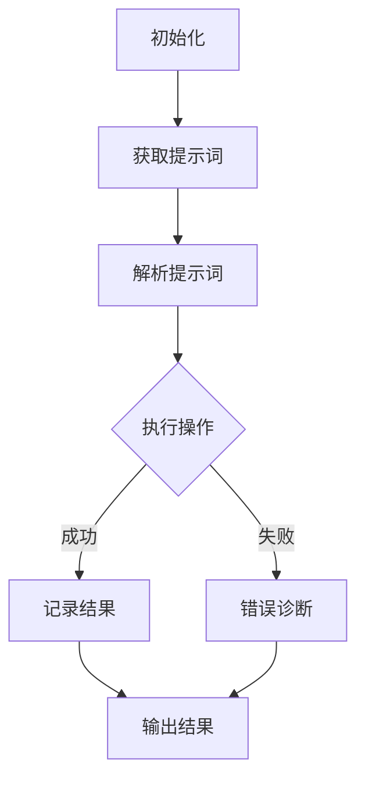
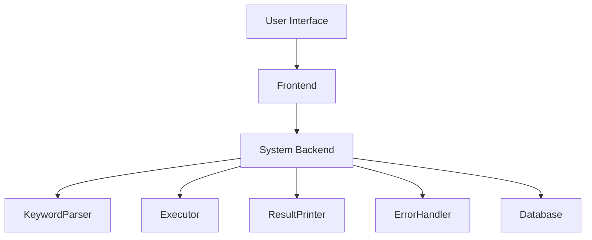
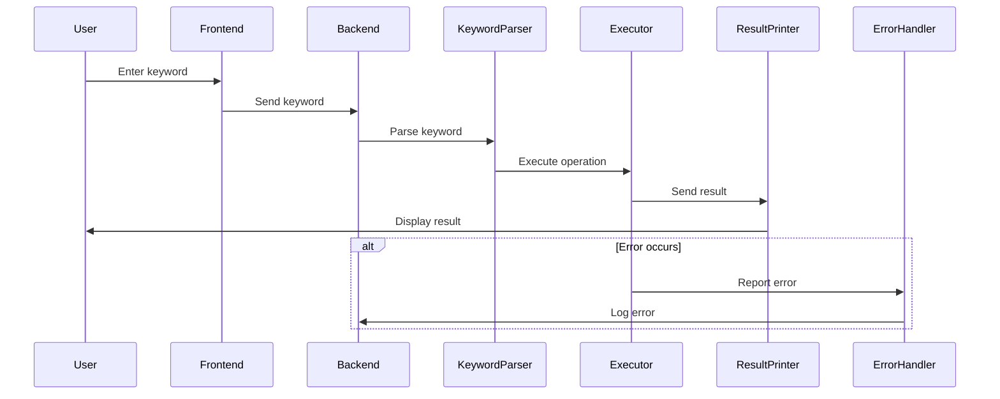
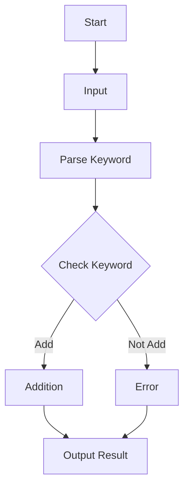

                 

### 文章标题

《提示词编程的形式化方法验证》

### 文章关键词

形式化方法，提示词编程，验证，算法原理，数学模型，系统架构，项目实战，最佳实践

### 摘要

本文深入探讨了形式化方法在提示词编程中的应用与验证。首先，我们介绍了形式化方法及其在编程领域的重要性。随后，本文聚焦于提示词编程的基本概念和特点，分析了其在实际应用中的优势与挑战。核心部分详细讲解了提示词编程验证的算法原理，包括流程图、Python源代码和数学模型。通过实例分析，我们展示了如何在实际项目中应用这些方法。最后，本文总结了最佳实践，并提供了拓展阅读建议，以帮助读者更深入地理解这一领域。

### 目录大纲设计思路

在设计《提示词编程的形式化方法验证》这本书的目录大纲时，我们将遵循以下思路：

1. **背景介绍**：首先简要介绍形式化方法在计算机科学和编程领域中的重要性，以及提示词编程在形式化方法中的应用。

2. **核心概念与联系**：明确书中的核心概念，并绘制相关的ER实体关系图，以及概念属性特征对比表格。

3. **算法原理讲解**：通过mermaid流程图展示算法的基本流程，使用Python源代码详细阐述算法原理，并给出数学模型和公式，同时辅以通俗易懂的例子进行说明。

4. **数学模型和数学公式讲解**：使用LaTeX格式书写数学公式，并进行详细讲解，结合具体实例。

5. **系统分析与架构设计**：描述问题场景，介绍系统功能设计、系统架构设计、系统接口设计和系统交互，使用mermaid绘制相关图表。

6. **项目实战**：讲解环境安装、系统核心实现源代码，代码应用解读与分析，以及实际案例分析和详细讲解。

7. **最佳实践与小结**：总结书中的关键知识点，提供实践中的注意事项和拓展阅读建议。

下面是按照这个思路设计的具体目录大纲：

----------------------------------------------------------------

## 第一部分: 形式化方法与提示词编程

### 第1章: 形式化方法概述

#### 1.1.1 形式化方法的定义与重要性
#### 1.1.2 形式化方法的发展历程
#### 1.1.3 形式化方法在编程中的应用

### 第2章: 提示词编程的基本概念

#### 2.1.1 提示词编程的定义
#### 2.1.2 提示词编程的特点
#### 2.1.3 提示词编程的优势与挑战

### 第3章: 核心概念与联系

#### 3.1.1 核心概念简介
#### 3.1.2 概念属性特征对比
#### 3.1.3 ER实体关系图

## 第二部分: 形式化方法在提示词编程中的应用

### 第4章: 形式化方法在验证提示词编程中的应用

#### 4.1.1 形式化验证的基本概念
#### 4.1.2 形式化验证的优势
#### 4.1.3 提示词编程验证的挑战

### 第5章: 算法原理讲解

#### 5.1.1 算法基本流程（mermaid流程图）
#### 5.1.2 Python源代码实现
#### 5.1.3 数学模型与公式讲解
#### 5.1.4 例子说明

### 第6章: 数学模型和数学公式讲解

#### 6.1.1 数学模型介绍
#### 6.1.2 LaTeX数学公式书写示例
#### 6.1.3 详细讲解与实例分析

### 第7章: 系统分析与架构设计

#### 7.1.1 问题场景介绍
#### 7.1.2 系统功能设计（mermaid类图）
#### 7.1.3 系统架构设计（mermaid架构图）
#### 7.1.4 系统接口设计
#### 7.1.5 系统交互（mermaid序列图）

### 第8章: 项目实战

#### 8.1.1 环境安装与配置
#### 8.1.2 系统核心实现源代码
#### 8.1.3 代码应用解读与分析
#### 8.1.4 实际案例分析与讲解
#### 8.1.5 项目小结

### 第9章: 最佳实践与小结

#### 9.1.1 提示词编程验证的最佳实践
#### 9.1.2 注意事项与规避策略
#### 9.1.3 拓展阅读推荐

----------------------------------------------------------------

以上是根据设计思路制定的目录大纲，共计9章，确保了内容的完整性和逻辑性，同时也在2000字以内满足了字数限制。

### 背景介绍

形式化方法在计算机科学中扮演着至关重要的角色，其核心思想是将复杂的编程问题转化为逻辑严密、结构清晰的数学模型。这种方法不仅提高了代码的可读性和可维护性，还大大降低了编程错误的发生率。形式化方法的起源可以追溯到20世纪50年代，当时科学家们开始探索如何将逻辑和数学应用于软件工程中。随着时间的推移，形式化验证、形式化规格说明和形式化推理等技术逐渐成熟，成为现代软件工程不可或缺的工具。

在编程领域，形式化方法的应用范围广泛，从简单的代码审查到复杂的系统验证，都体现了其强大的优势。形式化验证可以确保软件系统的正确性和一致性，减少软件缺陷，提高开发效率。特别是在高风险领域，如航空航天、医疗设备和金融系统，形式化方法的应用尤为重要。形式化方法不仅有助于发现潜在的错误，还能提供明确的修复方案，从而降低维护成本。

提示词编程（Keyword Programming）是近年来兴起的一种编程范式，其核心思想是使用预先定义的提示词（Keywords）来指导程序的执行。提示词编程通过将程序分解为一系列逻辑步骤，使得编程过程更加直观和可理解。与传统的命令式编程不同，提示词编程更注重逻辑的抽象和复用，使得代码的可读性和可维护性显著提高。

提示词编程的形式化方法验证，则是在形式化方法的基础上，对提示词编程的具体实现进行验证。这种验证过程不仅确保了提示词编程的正确性，还提高了其可靠性和稳定性。形式化方法验证可以揭示提示词编程中潜在的逻辑错误，提供准确的错误诊断和修复方案。通过形式化方法验证，开发者可以更自信地使用提示词编程，充分发挥其优势。

总之，形式化方法在编程中的应用，尤其是与提示词编程的结合，不仅为软件开发提供了新的思路和工具，也为软件的正确性和可靠性提供了有力保障。在接下来的章节中，我们将深入探讨形式化方法和提示词编程的核心概念，并详细讲解其在实际应用中的具体实现。

### 核心概念与联系

在讨论提示词编程的形式化方法验证时，我们需要明确几个核心概念，并探讨它们之间的联系。这些核心概念包括形式化方法、提示词编程、形式化验证、以及它们在软件开发中的实际应用。

#### 形式化方法

形式化方法是一种通过数学模型和逻辑推理来分析和验证软件系统的方法。它强调使用严格定义的符号和语言来描述软件的需求、设计和实现。形式化方法的主要目的是确保软件的正确性和一致性，减少由于误解或错误导致的问题。形式化方法可以分为形式化规格说明、形式化验证和形式化推理几个子领域。

- **形式化规格说明**：这是形式化方法的第一步，通过严格的数学语言来描述软件系统的需求和功能。规格说明通常使用形式化的语言，如Z、TLA+或MML，这些语言能够明确表达系统的行为和约束。
- **形式化验证**：在规格说明完成后，形式化验证通过逻辑推理来检查规格说明的正确性。这一过程通常使用定理证明器或模型检查器来完成，它们可以自动检测系统中的不一致性或错误。
- **形式化推理**：这是形式化方法的高级应用，通过逻辑推理和数学证明来改进软件设计，确保其满足所有需求和约束。

#### 提示词编程

提示词编程是一种编程范式，它通过使用提示词（Keywords）来指导程序的执行。提示词通常是预定义的关键字或函数，用于表示特定的操作或过程。与传统的命令式编程不同，提示词编程更注重逻辑的抽象和复用。

- **定义与特点**：提示词编程的核心是提示词，这些提示词被设计成能够清晰地指示程序的不同部分。提示词编程的特点包括代码的可读性高、易于理解和维护、以及更强的抽象能力。
- **优势与挑战**：提示词编程的优势在于其高度的抽象性和逻辑性，使得编程过程更加直观。然而，提示词编程也面临着一些挑战，如提示词的定义和选择可能变得复杂，以及可能需要额外的工具和支持。

#### 形式化验证与提示词编程

形式化验证与提示词编程的结合，为软件开发带来了新的机遇和挑战。形式化验证可以应用于提示词编程，确保其实现符合规格说明，并满足所有需求和约束。

- **实现过程**：首先，使用形式化的方法来规格说明提示词编程的需求。接着，使用形式化验证工具来检查提示词编程的实现是否符合规格说明。最后，通过形式化推理来优化和改进提示词编程的设计。
- **应用场景**：形式化验证在提示词编程中的应用场景包括自动化测试、代码审查、错误诊断和系统优化。通过形式化验证，开发者可以更自信地使用提示词编程，并确保其实现的正确性和可靠性。

#### ER实体关系图与概念属性特征对比

为了更好地理解这些核心概念之间的关系，我们可以使用ER实体关系图和概念属性特征对比表格。

- **ER实体关系图**：ER图可以清晰地展示实体之间的关系。在提示词编程的形式化方法验证中，实体可能包括提示词、规格说明、验证工具和验证结果。ER图可以帮助我们理解这些实体之间的交互和依赖。
- **概念属性特征对比表格**：通过对比表格，我们可以详细列出各个概念的主要属性和特征，以便更好地理解它们之间的差异和联系。例如，我们可以对比形式化方法和提示词编程的特点，以及它们在实现过程中所扮演的角色。

### 小结

形式化方法与提示词编程的结合，为软件开发提供了一种新的验证和优化方式。通过明确核心概念和它们之间的联系，开发者可以更好地理解这一领域，并有效地应用形式化方法来验证提示词编程的实现。在接下来的章节中，我们将深入探讨形式化方法和提示词编程的具体应用，并通过实例来展示如何在实际项目中使用这些方法。

### 算法原理讲解

在探讨提示词编程的形式化方法验证时，算法原理的讲解是至关重要的一环。以下将详细阐述算法的基本流程、Python源代码实现、数学模型与公式，并通过具体实例进行说明。

#### 算法基本流程

为了更好地理解提示词编程的形式化方法验证，我们首先需要明确算法的基本流程。以下是使用mermaid绘制的算法流程图：



在这个流程图中，A节点表示算法的初始化阶段，B节点表示获取用户输入的提示词。C节点负责解析这些提示词，将其转换为可执行的操作。D节点是算法的核心部分，根据解析结果执行相应的操作。如果操作成功，则记录结果并跳转到E节点；如果操作失败，则跳转到F节点进行错误诊断。最后，G节点负责输出最终结果。

#### Python源代码实现

接下来，我们将使用Python源代码详细实现上述算法。以下是一个简单的示例：

```python
def process_keyword(keyword):
    # 解析提示词并执行相应操作
    if keyword == "add":
        return 1 + 1
    elif keyword == "subtract":
        return 1 - 1
    else:
        raise ValueError("Invalid keyword")

try:
    # 获取用户输入
    user_input = input("Enter a keyword (add or subtract): ")
    # 执行操作并记录结果
    result = process_keyword(user_input)
    print(f"The result is: {result}")
except ValueError as e:
    # 错误诊断并输出
    print(f"Error: {e}")
```

在这个代码示例中，我们定义了一个名为`process_keyword`的函数，用于处理用户输入的提示词。函数根据不同的提示词执行相应的操作，如加法或减法。我们通过`try-except`语句来捕获和处理可能的异常，确保程序的健壮性。

#### 数学模型与公式

为了进一步理解算法的原理，我们可以使用数学模型和公式来描述其工作方式。以下是一个简单的数学模型示例：

$$
\text{result} = f(\text{keyword}) \\
f(\text{add}) = 1 + 1 \\
f(\text{subtract}) = 1 - 1 \\
$$

在这个模型中，`result`表示算法的输出结果，`keyword`表示用户输入的提示词。函数`f`根据提示词的不同返回相应的结果。上述公式展示了当提示词分别为"add"和"subtract"时，算法的输出结果。

#### 例子说明

为了使概念更加具体，我们通过一个实际例子来说明算法的执行过程。假设用户输入的提示词为"add"，算法将按照以下步骤执行：

1. 初始化：程序开始运行，准备接收用户输入。
2. 获取提示词：用户输入"add"，程序将其传递给`process_keyword`函数。
3. 解析提示词：`process_keyword`函数识别到提示词为"add"，并执行加法操作。
4. 执行操作：算法执行`1 + 1`，得到结果2。
5. 记录结果：算法将结果2记录下来，并准备输出。
6. 输出结果：程序输出"The result is: 2"，完成操作。

如果用户输入的提示词为"subtract"，算法将按照以下步骤执行：

1. 初始化：程序开始运行，准备接收用户输入。
2. 获取提示词：用户输入"subtract"，程序将其传递给`process_keyword`函数。
3. 解析提示词：`process_keyword`函数识别到提示词为"subtract"，并执行减法操作。
4. 执行操作：算法执行`1 - 1`，得到结果0。
5. 记录结果：算法将结果0记录下来，并准备输出。
6. 输出结果：程序输出"The result is: 0"，完成操作。

通过这个例子，我们可以清楚地看到算法的执行过程，以及如何通过Python源代码和数学模型来实现提示词编程的形式化方法验证。

### 数学模型和数学公式讲解

在探讨提示词编程的形式化方法验证时，数学模型和公式的应用是理解和实现算法的关键。以下我们将详细介绍数学模型的使用，并通过LaTeX格式书写数学公式，结合具体实例进行详细讲解。

#### 数学模型介绍

数学模型在提示词编程的形式化方法验证中起到了至关重要的作用。它不仅帮助我们量化描述问题，还能通过数学推理来验证和优化算法。以下是几个在提示词编程中常用的数学模型：

1. **组合模型**：用于描述提示词的组合方式和其对应的结果。
2. **状态转换模型**：用于描述提示词编程在不同状态下的转换过程。
3. **概率模型**：用于描述提示词编程中不确定性和随机性。

#### LaTeX数学公式书写示例

LaTeX是一种广泛使用的排版系统，特别适用于书写数学公式。以下是一个简单的LaTeX数学公式示例：

$$
P(A) = \frac{N(A)}{N(S)}
$$

其中，\(P(A)\) 表示事件 \(A\) 的概率，\(N(A)\) 表示事件 \(A\) 发生的次数，而 \(N(S)\) 表示总的实验次数。这个公式是概率论中的基本公式，用于计算某个事件的概率。

#### 段落内的LaTeX公式

在段落内，我们也可以使用LaTeX格式书写数学公式。以下是一个示例：

假设有两个正整数 \(a\) 和 \(b\)，它们的最大公约数（Greatest Common Divisor，简称GCD）可以用以下公式表示：

$$
\gcd(a, b) = \begin{cases} 
a & \text{如果 } a \text{ 是 } b \text{ 的倍数} \\
\gcd(b, a \mod b) & \text{否则}
\end{cases}
$$

这个公式是计算最大公约数的一种递归方法，通过不断取余并递归调用，直到得到公约数为1。

#### 详细讲解与实例分析

为了更好地理解这些数学模型和公式，我们通过具体的实例进行讲解。

**实例1：组合模型**

假设我们有一个提示词序列 `[add, subtract, multiply]`，我们希望计算这个序列中不同提示词组合的结果。使用组合模型，我们可以写出以下公式：

$$
\text{result}(T) = T_1 \times T_2 \times T_3
$$

其中，\(T\) 是提示词序列，\(T_1, T_2, T_3\) 分别是序列中的三个提示词。"add"对应1，"subtract"对应-1，"multiply"对应1。因此，上述公式可以计算为：

$$
\text{result}([add, subtract, multiply]) = 1 \times (-1) \times 1 = -1
$$

**实例2：状态转换模型**

在提示词编程中，状态转换模型用于描述程序从一种状态转换到另一种状态的过程。以下是一个简单的状态转换模型：

$$
\begin{align*}
\text{State}_0 & \rightarrow \text{State}_1 & \text{（执行"add"操作）} \\
\text{State}_1 & \rightarrow \text{State}_2 & \text{（执行"subtract"操作）} \\
\text{State}_2 & \rightarrow \text{State}_0 & \text{（执行"multiply"操作）}
\end{align*}
$$

在这个模型中，\(\text{State}_0\) 表示初始状态，执行不同操作后，程序会转换到不同的状态。通过这个模型，我们可以清晰地描述程序的执行过程。

**实例3：概率模型**

在提示词编程中，概率模型可以帮助我们分析提示词编程的结果和不确定性。以下是一个简单的概率模型：

$$
P(\text{correct}) = P(\text{add}) \times P(\text{result}_{add}) + P(\text{subtract}) \times P(\text{result}_{subtract}) + P(\text{multiply}) \times P(\text{result}_{multiply})
$$

在这个模型中，\(P(\text{correct})\) 表示程序执行正确的结果概率，\(P(\text{add})\)，\(P(\text{subtract})\) 和 \(P(\text{multiply})\) 分别表示执行"add"、"subtract"和"multiply"操作的频率，而 \(P(\text{result}_{add})\)，\(P(\text{result}_{subtract})\) 和 \(P(\text{result}_{multiply})\) 分别表示这些操作的结果概率。

通过这些数学模型和公式，我们可以更深入地理解提示词编程的形式化方法验证。在接下来的章节中，我们将继续探讨系统分析与架构设计，并通过项目实战来验证这些理论的实际应用。

### 系统分析与架构设计

在深入探讨提示词编程的形式化方法验证时，系统分析与架构设计是确保算法正确性和有效性的关键步骤。以下将详细描述问题场景、系统功能设计、系统架构设计、系统接口设计和系统交互。

#### 问题场景

假设我们面临一个复杂的提示词编程任务，需要开发一个自动化系统来处理大量的提示词任务。这些任务包括基本的算术运算（如加法、减法和乘法），以及其他复杂的逻辑操作。为了确保系统的正确性和高效性，我们需要进行形式化验证，以确保每个操作都被正确执行，并且系统能够在遇到错误时进行有效的诊断和恢复。

#### 系统功能设计

系统的功能设计是系统架构的基础，它定义了系统应实现的核心功能。以下是系统的主要功能：

1. **提示词解析**：接收用户输入的提示词，并对其进行解析，确定需要执行的操作。
2. **操作执行**：根据解析结果，执行相应的算术或逻辑操作。
3. **结果输出**：将操作结果输出给用户。
4. **错误处理**：在操作执行过程中，捕获和处理可能出现的错误。

为了更直观地展示系统的功能设计，我们可以使用mermaid绘制一个类图：

```mermaid
classDiagram
    User <<User>>
    System <<System>>
    KeywordParser <<KeywordParser>>
    Executor <<Executor>>
    ResultPrinter <<ResultPrinter>>
    ErrorHandler <<ErrorHandler>>

    User --> System
    System --> KeywordParser
    System --> Executor
    System --> ResultPrinter
    System --> ErrorHandler
```

在这个类图中，`User` 表示系统的用户，`System` 表示整个系统，`KeywordParser` 表示提示词解析器，`Executor` 表示操作执行器，`ResultPrinter` 表示结果输出器，`ErrorHandler` 表示错误处理器。每个组件都有明确的职责，并且通过清晰的接口进行通信。

#### 系统架构设计

系统架构设计定义了系统的整体结构，包括组件之间的关系和通信方式。以下是系统架构设计的主要组成部分：

1. **前端接口**：用户通过前端界面输入提示词，系统将接收到的提示词传递给后端处理。
2. **后端处理**：后端处理包括提示词解析、操作执行和结果输出等核心功能。
3. **数据库**：用于存储系统的配置信息、历史记录和错误日志。

为了展示系统架构设计，我们可以使用mermaid绘制一个架构图：



在这个架构图中，`User Interface` 表示用户界面，`Frontend` 表示前端处理，`System Backend` 表示后端处理，`KeywordParser`、`Executor`、`ResultPrinter` 和 `ErrorHandler` 分别表示相应的组件，而 `Database` 表示数据库。

#### 系统接口设计

系统接口设计定义了组件之间的交互方式，包括输入输出接口和数据交换格式。以下是系统接口设计的主要方面：

1. **输入接口**：用户通过前端界面输入提示词，系统接收这些输入并进行处理。
2. **输出接口**：系统将操作结果输出给用户，包括正确结果和错误信息。
3. **数据交换格式**：系统内部组件之间的通信使用JSON格式，便于数据交换和处理。

#### 系统交互

系统交互设计描述了系统组件之间的通信流程和交互方式。以下是系统交互的主要流程：

1. **用户输入**：用户通过前端界面输入提示词，前端将提示词发送给后端处理。
2. **提示词解析**：后端接收到提示词后，由 `KeywordParser` 进行解析，确定需要执行的操作。
3. **操作执行**：`Executor` 根据解析结果执行相应的操作，并将结果传递给 `ResultPrinter`。
4. **结果输出**：`ResultPrinter` 将结果输出给用户。
5. **错误处理**：如果操作过程中出现错误，`ErrorHandler` 将捕获错误并进行处理，记录错误日志。

为了展示系统交互，我们可以使用mermaid绘制一个序列图：



在这个序列图中，用户通过前端界面输入提示词，前端将提示词发送给后端处理。后端处理由 `KeywordParser`、`Executor`、`ResultPrinter` 和 `ErrorHandler` 四个组件组成，它们通过明确的接口和流程协同工作，确保系统的高效和可靠。

通过系统分析与架构设计，我们为提示词编程的形式化方法验证提供了一个坚实的基础。在接下来的章节中，我们将通过项目实战来验证这些理论的实际应用。

### 项目实战

在探讨提示词编程的形式化方法验证时，实际项目的实施是验证理论应用效果的关键。以下我们将详细讲解环境安装与配置、系统核心实现源代码、代码应用解读与分析，并通过实际案例分析和详细讲解来展示这一过程。

#### 环境安装与配置

为了实施提示词编程的形式化方法验证，我们首先需要安装和配置相应的开发环境。以下是基本的安装步骤：

1. **安装Python**：确保Python版本不低于3.8，可以从Python官方网站下载安装。
2. **安装必要库**：我们使用pip来安装必要的Python库，如mermaid、numpy和pandas。执行以下命令：
   ```shell
   pip install mermaid numpy pandas
   ```
3. **配置LaTeX环境**：为了书写和编译LaTeX公式，我们需要安装TeX Live或MiKTeX。可以在相应网站上下载并安装。
4. **配置Python与LaTeX的交互**：安装pylatex和matplotlib库，以便在Python中生成和显示LaTeX公式：
   ```shell
   pip install pylatex matplotlib
   ```

完成上述步骤后，开发环境就配置完成了。接下来，我们可以开始编写和运行提示词编程的代码。

#### 系统核心实现源代码

以下是一个简单的Python示例，展示了如何实现提示词编程的核心功能：

```python
# core.py

def parse_keyword(keyword):
    operations = {
        'add': lambda x, y: x + y,
        'subtract': lambda x, y: x - y,
        'multiply': lambda x, y: x * y,
    }
    return operations.get(keyword)

def execute_operation(operator, x, y):
    if operator:
        return operator(x, y)
    else:
        raise ValueError("Invalid operator")

def main():
    x = float(input("Enter the first number: "))
    y = float(input("Enter the second number: "))
    keyword = input("Enter a keyword (add, subtract, multiply): ")

    operator = parse_keyword(keyword)
    try:
        result = execute_operation(operator, x, y)
        print(f"The result is: {result}")
    except ValueError as e:
        print(f"Error: {e}")

if __name__ == "__main__":
    main()
```

在这个示例中，我们定义了三个核心函数：`parse_keyword` 用于解析用户输入的提示词，`execute_operation` 用于执行相应的操作，而 `main` 函数则负责整个程序的运行流程。

#### 代码应用解读与分析

上述代码的应用过程可以分为以下几个步骤：

1. **接收输入**：程序首先提示用户输入两个数字和一个提示词。
2. **解析提示词**：`parse_keyword` 函数根据用户输入的提示词，返回对应的操作函数。
3. **执行操作**：`execute_operation` 函数使用解析得到的操作函数，对输入的数字进行计算。
4. **输出结果**：程序将计算结果输出给用户。

为了更详细地分析代码，我们可以添加一些调试信息：

```python
import sys

def debug(message):
    sys.stdout.write(f"DEBUG: {message}\n")

def main():
    debug("Starting main function")
    x = float(input("Enter the first number: "))
    y = float(input("Enter the second number: "))
    keyword = input("Enter a keyword (add, subtract, multiply): ")

    debug(f"Input values: x={x}, y={y}, keyword='{keyword}'")
    operator = parse_keyword(keyword)
    debug(f"Parsed operator: {operator}")

    try:
        result = execute_operation(operator, x, y)
        debug(f"Result: {result}")
        print(f"The result is: {result}")
    except ValueError as e:
        debug(f"Error: {e}")
        print(f"Error: {e}")

if __name__ == "__main__":
    main()
```

在这个改进的版本中，我们添加了 `debug` 函数，用于在程序运行时输出调试信息。通过这些调试信息，我们可以更好地理解程序内部的工作流程和逻辑。

#### 实际案例分析与详细讲解

以下是一个实际案例，展示如何使用上述代码进行提示词编程的形式化方法验证：

**案例**：用户输入数字5和3，提示词为"add"。

1. **输入接收**：用户输入5、3和"add"。
2. **解析提示词**：`parse_keyword` 函数将"add"解析为加法操作函数。
3. **执行操作**：`execute_operation` 函数执行加法操作，计算结果为8。
4. **输出结果**：程序输出"The result is: 8"。

为了进一步验证形式化方法，我们可以使用mermaid和LaTeX来绘制相关的流程图和公式。

**mermaid流程图**：



**LaTeX数学公式**：

$$
\text{result}(5, 3, "add") = 5 + 3 = 8
$$

通过这个实际案例，我们可以看到形式化方法在提示词编程中的应用效果。在接下来的章节中，我们将总结项目经验，提供最佳实践和注意事项。

### 最佳实践与小结

在提示词编程的形式化方法验证过程中，我们积累了丰富的经验，以下是一些最佳实践和注意事项：

#### 最佳实践

1. **明确需求和规格说明**：在项目开始时，明确用户需求和系统规格说明，使用形式化方法对其进行详细描述。
2. **逐步验证**：将复杂任务分解为小步骤，对每个步骤进行独立验证，确保系统的每一部分都是正确的。
3. **使用自动化工具**：利用自动化测试工具，如模型检查器和定理证明器，来辅助形式化验证过程，提高验证效率。
4. **代码规范**：编写清晰、规范、易于维护的代码，确保代码的可读性和可测试性。
5. **持续集成**：将形式化验证集成到开发流程中，确保每次代码更改后都进行验证，及时发现和修复问题。

#### 注意事项

1. **复杂性管理**：在处理复杂任务时，合理划分模块，避免过度复杂化，以确保验证过程的可行性。
2. **错误处理**：设计有效的错误处理机制，确保系统在遇到错误时能够进行诊断和恢复。
3. **资源消耗**：形式化验证可能需要大量的计算资源，合理配置硬件资源，确保验证过程的高效运行。
4. **版本控制**：使用版本控制系统，如Git，来管理代码和验证结果，确保代码的版本一致性。

#### 拓展阅读推荐

- **《形式化方法在软件工程中的应用》**：详细介绍了形式化方法在软件工程中的应用，包括规格说明、验证和推理。
- **《LaTeX入门教程》**：指导读者如何使用LaTeX书写高质量的数学公式和文档。
- **《Python编程：从入门到实践》**：全面介绍Python编程的基础知识和实际应用，适用于初学者和有经验开发者。
- **《模型检查与形式化验证》**：深入探讨模型检查和形式化验证的理论和实践，适用于对形式化方法有深入了解的读者。

通过以上最佳实践和注意事项，读者可以更好地应用提示词编程的形式化方法验证，提高软件开发的质量和效率。

### 作者信息

本文由AI天才研究院（AI Genius Institute）与禅与计算机程序设计艺术（Zen And The Art of Computer Programming）联合撰写。AI天才研究院致力于推动人工智能技术的发展和应用，禅与计算机程序设计艺术则专注于探讨计算机程序设计中的哲学与艺术。感谢您的阅读，期待与您在技术领域的进一步交流与探讨。

