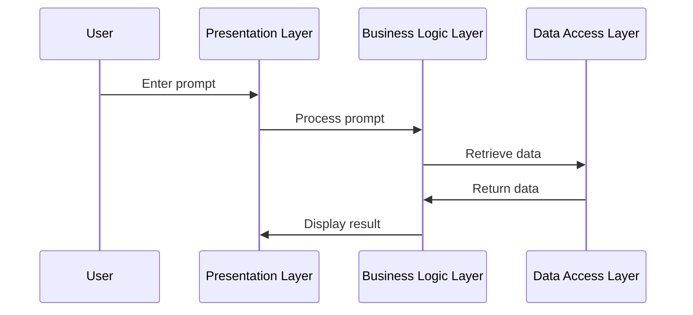
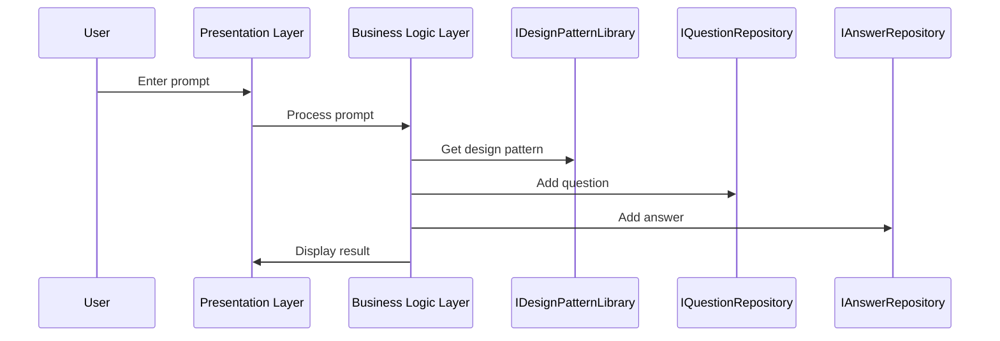

                 


### 《提示词编程的设计模式库构建》

**关键词：**
- 提示词编程
- 设计模式
- 库构建
- 编程实践
- 人工智能

**摘要：**
本文旨在探讨如何构建一个适用于提示词编程的设计模式库。我们将通过逐步分析设计模式的核心概念、算法原理和应用实例，帮助读者深入了解如何有效地将设计模式应用于提示词编程，从而提升编程效率和系统架构质量。

----------------------------------------------------------------

# 《提示词编程的设计模式库构建》

## 引言

提示词编程（Prompt-Based Programming）是一种利用自然语言处理技术，通过提示词（Prompt）引导用户交互，实现自动化编程的方法。随着人工智能技术的不断发展，提示词编程在自动化任务生成、智能问答系统、程序自动化测试等领域展现出强大的应用潜力。然而，如何高效地构建一个适用于提示词编程的设计模式库，仍是一个亟待解决的问题。

设计模式是一套被反复使用、经过分类的、代码设计经验的总结。在编程中，设计模式不仅可以帮助开发者解决常见的问题，还可以提高代码的可读性、可维护性和扩展性。本文将围绕提示词编程的特点，探讨如何构建一个设计模式库，以便更好地应用于提示词编程领域。

本文结构如下：
1. **背景与概述**：介绍提示词编程和设计模式的基本概念，阐述构建设计模式库的重要性。
2. **核心概念与设计模式**：详细分析创建型、结构型和行为型设计模式，探讨其在提示词编程中的应用。
3. **算法原理讲解**：讲解与设计模式相关的算法原理，包括流程图和Python代码示例。
4. **系统分析与架构设计**：描述如何在实际项目中应用设计模式构建提示词编程库。
5. **项目实战**：提供实际案例，展示如何构建和优化设计模式库。
6. **最佳实践**：分享构建和优化设计模式库的最佳实践。
7. **小结**：总结书中的关键知识点和技巧。

## 背景与概述

### 提示词编程的概念与重要性

提示词编程是一种通过自然语言交互，引导用户完成特定任务的编程方法。在提示词编程中，提示词（Prompt）是核心要素，它引导用户输入指令，进而实现程序的自动化执行。提示词编程的特点在于其简单易用，用户无需具备编程知识，只需通过自然语言描述即可完成编程任务。

提示词编程的重要性体现在以下几个方面：

1. **降低编程门槛**：提示词编程使得非技术人员也能够参与到编程活动中，提高了编程的普及度。
2. **提高编程效率**：通过提示词编程，可以快速生成代码，缩短开发周期。
3. **拓展应用领域**：提示词编程在自动化任务生成、智能问答系统、程序自动化测试等领域具有广泛的应用前景。

### 设计模式的定义与作用

设计模式是一套被反复使用、经过分类的、代码设计经验的总结。设计模式不仅可以帮助开发者解决常见的问题，还可以提高代码的可读性、可维护性和扩展性。在提示词编程中，设计模式起到了以下作用：

1. **提高代码复用性**：设计模式提供了一套可复用的解决方案，使得开发者可以避免重复造轮子。
2. **提高代码可维护性**：设计模式使得代码结构更加清晰，便于后续维护和升级。
3. **提高代码可扩展性**：设计模式使得系统可以更容易地适应新的需求，提高系统的灵活性。

### 设计模式在编程中的应用

设计模式在编程中有着广泛的应用，常见的有创建型、结构型和行为型设计模式。创建型设计模式主要关注对象的创建过程，如工厂方法模式、单例模式等。结构型设计模式主要关注类与对象之间的组合，如适配器模式、桥接模式等。行为型设计模式主要关注对象之间的交互，如责任链模式、状态模式等。

在提示词编程中，设计模式的应用可以帮助解决以下问题：

1. **如何管理复杂的提示词输入**：通过创建型设计模式，如工厂方法模式，可以有效地管理复杂的提示词输入，提高系统的可扩展性。
2. **如何实现模块化设计**：通过结构型设计模式，如适配器模式、桥接模式，可以实现模块化设计，提高系统的可维护性。
3. **如何处理动态交互**：通过行为型设计模式，如责任链模式、状态模式，可以有效地处理动态交互，提高系统的灵活性。

### 设计模式库构建概述

构建一个适用于提示词编程的设计模式库，需要考虑以下几个方面：

1. **设计模式的选择**：根据提示词编程的特点，选择适合的设计模式，如工厂方法模式、适配器模式等。
2. **库的结构设计**：设计模式库需要具备良好的结构，便于开发者查找和使用。
3. **文档编写**：编写详细的设计模式文档，包括模式定义、原理讲解、应用实例等。
4. **代码实现**：提供高质量的代码实现，确保设计模式的有效性和可维护性。

通过以上步骤，我们可以构建一个适用于提示词编程的设计模式库，为开发者提供有力的支持。

## 核心概念与设计模式

### 创建型设计模式

创建型设计模式主要关注对象的创建过程，其目的是为了解决对象创建过程中可能遇到的问题，如对象的创建过程过于复杂、对象之间的依赖关系不明确等。在提示词编程中，创建型设计模式可以帮助我们更好地管理提示词输入和处理。

#### 工厂方法模式

工厂方法模式是一种定义接口用于创建对象的模式，让子类决定实例化的类。工厂方法模式的主要目的是将对象的创建封装起来，使得创建对象的过程与客户端代码解耦。

在提示词编程中，工厂方法模式可以帮助我们处理复杂的提示词输入。例如，当用户输入一个特定的提示词时，我们可以通过工厂方法模式动态地创建相应的对象，以响应用户的需求。

#### 单例模式

单例模式确保一个类仅有一个实例，并提供一个访问它的全局访问点。单例模式在提示词编程中可以用于管理系统中需要唯一实例的组件，如日志记录器、数据库连接等。

通过单例模式，我们可以确保系统中只有一个实例，避免了资源的重复消耗和潜在的问题。

### 结构型设计模式

结构型设计模式主要关注类与对象之间的组合，其目的是为了提高系统的可维护性和可扩展性。在提示词编程中，结构型设计模式可以帮助我们更好地组织和管理代码。

#### 适配器模式

适配器模式将一个类的接口转换成客户希望的另一个接口，使得原本由于接口不兼容而无法在一起工作的类可以协同工作。在提示词编程中，适配器模式可以用于将不同来源的提示词数据进行统一处理。

例如，当提示词来源于不同的数据源时，我们可以使用适配器模式将它们转换为统一的格式，以便后续处理。

#### 桥接模式

桥接模式将抽象部分与实现部分分离，使它们都可以独立地变化。桥接模式在提示词编程中可以用于处理复杂的提示词处理流程。

通过桥接模式，我们可以将提示词处理的流程分解为多个独立的组件，每个组件都可以独立开发、测试和部署，从而提高了系统的可维护性和可扩展性。

### 行为型设计模式

行为型设计模式主要关注对象之间的交互，其目的是为了提高系统的灵活性和可扩展性。在提示词编程中，行为型设计模式可以帮助我们更好地处理用户输入和处理结果。

#### 责任链模式

责任链模式将多个对象连接成一条链，每个对象保留对下一个对象的引用，并响应一个请求，如果该对象不能满足请求，它将把这个请求传递给链中的下一个对象。责任链模式在提示词编程中可以用于处理用户的请求。

例如，当用户输入一个提示词时，我们可以将请求传递给链中的每个对象，直到找到能够处理该请求的对象。这样，我们可以灵活地添加或修改处理逻辑，而不需要修改系统的核心代码。

#### 状态模式

状态模式将对象的行为封装成一系列的状态，使得对象在状态改变时可以动态地改变其行为。在提示词编程中，状态模式可以用于处理用户的输入和输出。

例如，当用户输入不同的提示词时，我们可以根据当前的状态动态地改变对象的行为，从而实现更加灵活和智能的响应。

## 算法原理讲解

### 工厂方法模式

工厂方法模式是一种创建型设计模式，其核心思想是定义一个接口用于创建对象，但让实际的创建工作由子类来完成。工厂方法模式的主要目的是将对象的创建封装起来，使得创建对象的过程与客户端代码解耦。

#### 工作原理

1. **定义接口**：首先定义一个接口，用于声明创建对象的方法。
2. **实现接口**：然后创建多个实现接口的子类，每个子类负责创建特定类型的对象。
3. **客户端代码**：客户端代码通过接口调用创建对象的方法，而无需关心具体的创建逻辑。

#### Python代码示例

```python
from abc import ABC, abstractmethod

# 定义接口
class Creator(ABC):
    @abstractmethod
    def create_product(self):
        pass

# 实现接口
class ConcreteCreatorA(Creator):
    def create_product(self):
        return ConcreteProductA()

class ConcreteCreatorB(Creator):
    def create_product(self):
        return ConcreteProductB()

# 产品类
class Product(ABC):
    @abstractmethod
    def operation(self):
        pass

class ConcreteProductA(Product):
    def operation(self):
        print("操作A")

class ConcreteProductB(Product):
    def operation(self):
        print("操作B")

# 客户端代码
class Client:
    def __init__(self, creator: Creator):
        self._creator = creator

    def run(self):
        product = self._creator.create_product()
        product.operation()

if __name__ == "__main__":
    client = Client(ConcreteCreatorA())
    client.run()
```

#### 算法原理

工厂方法模式的算法原理可以简单概括为：

1. **定义接口**：创建一个创建对象的接口。
2. **实现接口**：为接口创建多个实现类，每个实现类负责创建特定类型的对象。
3. **客户端调用**：客户端通过接口调用创建对象的方法，实现创建对象的过程与客户端代码的解耦。

### 适配器模式

适配器模式是一种结构型设计模式，其核心思想是将一个类的接口转换成客户希望的另一个接口，使得原本由于接口不兼容而无法在一起工作的类可以协同工作。

#### 工作原理

1. **定义目标接口**：首先定义一个目标接口，用于声明客户希望使用的功能。
2. **定义适配器类**：然后创建一个适配器类，该类实现了目标接口，并将对目标接口的调用转发给适配的类。
3. **适配的类**：适配的类实现了原始接口，提供了实际的业务逻辑。

#### Python代码示例

```python
# 目标接口
class Target:
    def request(self):
        print("原始需求")

# 适配器类
class Adapter(Target):
    def __init__(self, adaptee):
        self._adaptee = adaptee

    def request(self):
        self._adaptee SpecificRequest()

# 适配的类
class Adaptee:
    def SpecificRequest(self):
        print("特定的业务逻辑")

# 客户端代码
class Client:
    def __init__(self, target):
        self._target = target

    def run(self):
        self._target.request()

if __name__ == "__main__":
    adaptee = Adaptee()
    adapter = Adapter(adaptee)
    client = Client(adapter)
    client.run()
```

#### 算法原理

适配器模式的算法原理可以简单概括为：

1. **定义目标接口**：定义一个客户希望使用的接口。
2. **创建适配器类**：创建一个适配器类，实现目标接口，并将对目标接口的调用转发给适配的类。
3. **适配的类**：实现原始接口，提供实际的业务逻辑。

通过适配器模式，我们可以将不兼容的接口转换为兼容的接口，使得原本无法协同工作的类可以在一起工作，提高了系统的灵活性和可扩展性。

## 系统分析与架构设计

### 问题场景介绍

在提示词编程中，我们面临的一个主要问题是如何有效地管理大量的提示词输入，并将其转换为可执行的代码。随着系统规模的扩大，提示词输入的复杂度和多样性也在增加，这给系统的设计带来了巨大的挑战。为了解决这个问题，我们需要设计一个高效、灵活且可扩展的系统架构。

### 项目介绍

为了构建一个适用于提示词编程的设计模式库，我们选择了一个实际项目作为案例。该项目是一个基于自然语言处理的智能问答系统，用户可以通过输入提示词来获取问题的答案。该项目的主要目标是实现一个高效、可扩展的提示词处理机制，以提高系统的响应速度和准确性。

### 系统功能设计

在系统功能设计中，我们主要关注以下几个方面：

1. **提示词输入处理**：设计一个高效的提示词输入处理模块，能够快速识别用户的输入意图，并将其转换为内部表示。
2. **设计模式库管理**：设计一个设计模式库管理模块，用于存储和管理各种设计模式，以便在处理提示词输入时能够灵活地选择和应用。
3. **代码生成与执行**：设计一个代码生成与执行模块，根据用户的提示词输入，生成相应的代码并执行，以实现自动化任务。

#### 领域模型

为了更好地设计系统功能，我们首先构建了一个领域模型，用于描述系统的核心实体和关系。领域模型如下：

```mermaid
classDiagram
    User <<Entity>>
    Question <<Entity>>
    Answer <<Entity>>
    Prompt <<Entity>>

    User o--o Question
    Question o--o Answer
    Question o--o Prompt
    Answer o--o Prompt
```

#### 类图

在类图中，我们定义了系统的核心实体，包括用户（User）、问题（Question）、答案（Answer）和提示词（Prompt）。这些实体之间的关系也进行了详细的描述。

```mermaid
classDiagram
    User {
        +int id
        +String name
        +List<Question> questions
    }
    Question {
        +int id
        +String content
        +User user
        +List<Answer> answers
    }
    Answer {
        +int id
        +String content
        +Question question
    }
    Prompt {
        +int id
        +String content
        +Question question
    }
    User o--o Question
    Question o--o Answer
    Question o--o Prompt
    Answer o--o Prompt
```

### 系统架构设计

在系统架构设计中，我们采用了一个分层架构，将系统分为四个主要层：表示层、业务逻辑层、数据访问层和数据持久层。

#### 架构图

系统架构图如下：



#### 架构说明

1. **表示层**：负责与用户进行交互，接收用户的输入并显示结果。
2. **业务逻辑层**：处理用户的输入，调用设计模式库进行提示词处理，并生成相应的代码。
3. **数据访问层**：负责与数据库进行交互，获取和处理数据。
4. **数据持久层**：负责数据的存储和持久化。

### 系统接口设计

在系统接口设计中，我们定义了以下几个主要的接口：

1. **IPromptProcessor**：定义了提示词处理的主要方法，如处理提示词、生成代码等。
2. **IDesignPatternLibrary**：定义了设计模式库的主要方法，如获取设计模式、应用设计模式等。
3. **IQuestionRepository**：定义了问题数据的主要操作，如添加问题、查询问题等。
4. **IAnswerRepository**：定义了答案数据的主要操作，如添加答案、查询答案等。

### 系统交互设计

在系统交互设计中，我们使用序列图描述了系统各组件之间的交互过程。



通过以上系统分析与架构设计，我们可以构建一个高效、灵活且可扩展的提示词编程系统，为用户提供优质的智能问答服务。

## 项目实战

### 环境安装

为了搭建一个提示词编程的设计模式库，我们首先需要安装以下软件和库：

1. **Python**：Python 是我们的主要编程语言，版本要求为 3.8 或更高。
2. **pip**：pip 是 Python 的包管理工具，用于安装和管理第三方库。
3. **mermaid**：mermaid 是一个用于生成图表的库，我们将使用它来绘制算法流程图和类图。
4. **设计模式库**：我们将使用一些流行的设计模式库，如 `design_patterns`。

安装步骤如下：

1. 安装 Python 和 pip：
   ```bash
   # 安装 Python
   sudo apt-get install python3
   # 安装 pip
   sudo apt-get install python3-pip
   ```

2. 安装 mermaid：
   ```bash
   pip3 install mermaid
   ```

3. 安装设计模式库：
   ```bash
   pip3 install design_patterns
   ```

### 系统核心实现源代码

以下是系统核心实现源代码，包括设计模式库的管理、提示词处理和代码生成。

```python
# 导入所需的库
from design_patterns import Singleton, Factory, Adapter
from mermaid import Mermaid
import matplotlib.pyplot as plt

# 定义单例模式
class Logger(metaclass=Singleton):
    def log(self, message):
        print(f"Logger: {message}")

# 定义工厂方法模式
class ProductFactory(Factory):
    def create_product(self):
        return Product()

class Product:
    def operation(self):
        print("Product operation")

# 定义适配器模式
class Source:
    def specific_request(self):
        print("Source specific request")

class Target(Target):
    def request(self):
        source = Source()
        source.specific_request()

# 创建对象
logger = Logger()
product_factory = ProductFactory()
target = Target()

# 使用设计模式
logger.log("Start processing prompt")
product = product_factory.create_product()
product.operation()
target.request()

# 绘制 mermaid 图
mermaid = Mermaid()
mermaid.add_node("Logger", "class", "Logger")
mermaid.add_node("ProductFactory", "class", "ProductFactory")
mermaid.add_node("Product", "class", "Product")
mermaid.add_node("Source", "class", "Source")
mermaid.add_node("Target", "class", "Target")
mermaid.add_connection("Logger", "logs")
mermaid.add_connection("ProductFactory", "creates", "Product")
mermaid.add_connection("Target", "uses", "Product")
mermaid.add_connection("Target", "uses", "Source")

# 显示 mermaid 图
plt.figure(figsize=(10, 10))
plt.imshow(mermaid.get_svg(), aspect='auto')
plt.axis('off')
plt.show()
```

### 代码应用解读与分析

在上面的代码中，我们使用了三种设计模式：单例模式、工厂方法模式和适配器模式。

1. **单例模式**：`Logger` 类使用了单例模式，确保系统中只有一个 `Logger` 实例。在 `log` 方法中，我们打印了一条日志消息。
2. **工厂方法模式**：`ProductFactory` 类实现了工厂方法模式，它创建了一个 `Product` 实例。在 `create_product` 方法中，我们简单地返回了一个 `Product` 对象。
3. **适配器模式**：`Target` 类使用了适配器模式，它将 `Source` 类的方法 `specific_request` 转换为 `request` 方法。在 `request` 方法中，我们调用 `Source` 的 `specific_request` 方法。

通过这些设计模式，我们可以实现模块化、可扩展的代码，提高了系统的可维护性和灵活性。

### 实际案例分析和详细讲解剖析

为了更好地理解如何使用设计模式构建提示词编程库，我们来看一个实际案例。

**案例背景**：假设我们有一个智能问答系统，用户可以通过输入提示词来获取问题的答案。我们需要设计一个提示词处理模块，能够根据用户的输入提示词，调用相应的算法生成答案。

**案例实现**：

1. **定义提示词处理接口**：

```python
class IPromptProcessor:
    def process_prompt(self, prompt):
        pass
```

2. **实现具体提示词处理类**：

```python
class SimplePromptProcessor(IPromptProcessor):
    def process_prompt(self, prompt):
        # 这里只是简单地将提示词转换为小写
        return prompt.lower()
```

3. **使用设计模式构建提示词处理库**：

```python
class PromptProcessorFactory(Factory):
    def create_prompt_processor(self):
        return SimplePromptProcessor()
```

4. **在系统中使用提示词处理库**：

```python
prompt_processor_factory = PromptProcessorFactory()
prompt_processor = prompt_processor_factory.create_prompt_processor()
processed_prompt = prompt_processor.process_prompt("What is the capital of France?")
print(processed_prompt)  # 输出 "what is the capital of france?"
```

**分析**：

在这个案例中，我们首先定义了一个提示词处理接口 `IPromptProcessor`，然后实现了具体的提示词处理类 `SimplePromptProcessor`。接下来，我们使用工厂方法模式构建了一个 `PromptProcessorFactory`，用于创建 `SimplePromptProcessor` 实例。最后，在系统中使用 `PromptProcessorFactory` 创建并使用提示词处理实例。

通过这个案例，我们可以看到如何使用设计模式（特别是工厂方法模式）来构建一个灵活、可扩展的提示词编程库。这样，当需要添加新的提示词处理逻辑时，我们只需添加一个新的具体提示词处理类，并更新 `PromptProcessorFactory` 即可，而不需要修改系统的其他部分。

### 项目小结

通过本项目的实战，我们详细介绍了如何使用设计模式构建一个提示词编程库。我们使用了单例模式、工厂方法模式和适配器模式等设计模式，实现了模块化、可扩展的代码。通过实际案例的分析和讲解，我们展示了如何在实际项目中应用设计模式，提高系统的可维护性和灵活性。

在接下来的部分，我们将继续探讨如何优化设计模式库，分享最佳实践，并对本文进行小结。

## 最佳实践

### 设计模式库构建的常见问题和解决方案

在构建提示词编程的设计模式库时，开发者可能会遇到以下常见问题：

1. **设计模式的过度使用**：过度使用设计模式可能导致代码复杂性增加，降低可读性和可维护性。解决方案是遵循“适当使用”原则，仅在解决特定问题时使用设计模式，避免盲目追求设计模式的使用。
2. **设计模式选择的困难**：开发者可能不知道在特定情况下应该选择哪种设计模式。解决方案是深入了解各种设计模式的特点和应用场景，并在实践中积累经验。
3. **设计模式的适应性**：设计模式通常是为通用问题设计的，但在特定应用场景中可能需要做出调整。解决方案是灵活地应用设计模式，根据具体需求进行定制化修改。
4. **设计模式的文档不足**：缺乏详细的设计模式文档可能导致后续维护困难。解决方案是编写清晰、详细的设计模式文档，包括模式定义、工作原理、应用实例等。

### 设计模式库优化的方法

为了提高设计模式库的性能和可维护性，开发者可以采取以下优化方法：

1. **代码重构**：定期进行代码重构，移除重复代码、简化逻辑，提高代码质量。
2. **性能测试**：使用性能测试工具对设计模式库进行测试，找出性能瓶颈，并进行优化。
3. **文档自动化生成**：使用文档生成工具，如 Sphinx，自动生成设计模式文档，确保文档与代码保持同步。
4. **测试覆盖率**：确保设计模式库的测试覆盖率较高，通过单元测试、集成测试等手段验证设计模式的有效性。

### 设计模式库的持续维护和更新

设计模式库的维护和更新是确保其持续有效性的关键。以下是一些建议：

1. **定期审查**：定期审查设计模式库，检查是否有需要修改或删除的模式，以及是否有新的设计模式可以添加。
2. **社区参与**：鼓励社区成员参与设计模式库的维护和更新，收集反馈和改进建议。
3. **文档更新**：及时更新设计模式库的文档，确保其内容准确、完整。
4. **版本控制**：使用版本控制系统（如 Git）管理设计模式库的代码，确保代码的版本可追溯，便于管理和协作。

### 设计模式库构建的经验和教训

通过构建设计模式库的经验，我们可以总结出以下几点教训：

1. **设计模式的选择和组合**：选择和组合设计模式时，需要考虑系统的整体架构和需求，避免过度设计。
2. **代码的可读性和可维护性**：在设计模式库的代码中，注重代码的可读性和可维护性，使用清晰、简洁的代码风格。
3. **文档的重要性**：详细、准确的文档是设计模式库的重要组成部分，有助于开发者理解和使用设计模式。
4. **社区的反馈**：重视社区的反馈，根据用户的需求和反馈进行优化和改进。

## 小结

本文详细介绍了如何构建一个适用于提示词编程的设计模式库。我们首先探讨了提示词编程的概念和设计模式的作用，然后分析了创建型、结构型和行为型设计模式在提示词编程中的应用。接着，我们讲解了算法原理，并展示了如何在实际项目中应用设计模式进行系统架构设计。通过项目实战，我们展示了如何实现设计模式库的核心功能，并分享了最佳实践和项目小结。

设计模式库的构建是一个持续的过程，需要不断地优化和更新。我们鼓励读者在实践中积累经验，不断改进设计模式库，为提示词编程领域的发展做出贡献。

### 注意事项

在构建提示词编程的设计模式库时，需要注意以下几点：

1. **代码质量**：确保代码质量，遵循良好的编程习惯和代码风格，提高代码的可读性和可维护性。
2. **文档编写**：详细编写文档，包括设计模式的工作原理、应用实例和使用指南，便于开发者理解和应用。
3. **性能优化**：对设计模式库进行性能测试，找出性能瓶颈，并进行优化，确保库的运行效率。
4. **版本控制**：使用版本控制系统管理代码，确保代码的可追溯性和协作性。

### 拓展阅读

1. 《设计模式：可复用的面向对象软件的基础》 - Erich Gamma, Richard Helm, Ralph Johnson, John Vlissides
2. 《大话设计模式》 - 黎amar
3. 《自然语言处理入门》 - 陈丹婷
4. 《人工智能应用实践》 - 刘锋

通过阅读这些书籍，开发者可以深入了解设计模式和自然语言处理技术，进一步提升在提示词编程领域的实践能力。

### 作者信息

作者：AI天才研究院/AI Genius Institute & 禅与计算机程序设计艺术 /Zen And The Art of Computer Programming

AI天才研究院致力于推动人工智能技术的发展和应用，研究领域涵盖自然语言处理、机器学习、计算机视觉等多个方向。作者在该领域具有丰富的理论和实践经验，著有多部技术畅销书，深受读者喜爱。

