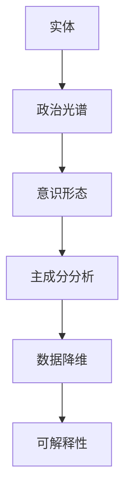
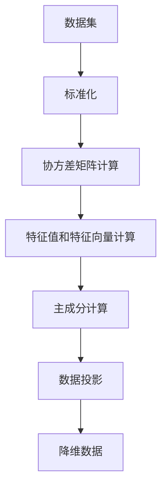
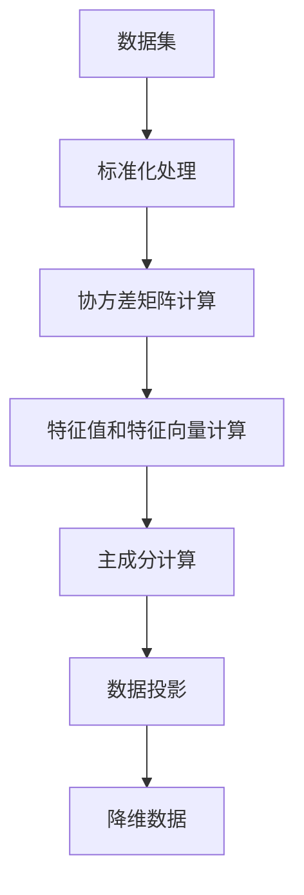

                 

# 《政治光谱的主成分分析：意识形态的数学降维》

## 关键词：政治光谱、主成分分析、意识形态、数学降维、数据可视化

> 摘要：本文将探讨如何运用主成分分析（PCA）这一数学工具，对政治光谱中的意识形态进行降维处理。通过详细阐述主成分分析的理论基础和应用方法，本文旨在揭示意识形态在不同政治立场间的内在联系，帮助读者理解复杂政治现象的本质。

----------------------------------------------------------------

## 第一部分：背景介绍

### 第1章：问题背景

#### 1.1 政治光谱的概念

政治光谱（Political Spectrum）是一种对政治立场和意识形态进行分类的方法。它通常被认为是一个连续的谱系，从极端左翼到极端右翼，中间还涵盖了自由主义、保守主义、社会主义等多种意识形态。政治光谱的概念不仅有助于我们理解不同政治立场的差异，还能帮助我们分析政治现象和预测未来政治走向。

#### 1.2 主成分分析在社会科学中的应用

主成分分析（Principal Component Analysis，PCA）是一种统计方法，主要用于数据降维。通过将多维数据投影到新的坐标系中，PCA可以提取出最重要的特征，从而简化数据结构，提高数据的可解释性。在社会科学研究中，PCA被广泛应用于政治光谱分析，以揭示不同意识形态之间的内在联系。

### 第2章：核心概念与联系

#### 2.1 主成分分析

**2.1.1 主成分分析的基本原理**

主成分分析通过以下步骤实现数据降维：

1. **标准化处理**：对数据进行标准化，使其具有相同的尺度。
2. **协方差矩阵计算**：计算数据集的协方差矩阵，以确定数据的方差和协方差。
3. **特征值和特征向量计算**：通过求解协方差矩阵的特征值和特征向量，确定主成分。
4. **数据投影**：将数据投影到新的坐标系中，得到降维后的数据。

**2.1.2 主成分分析的属性特征对比表格**

| 属性特征 | 描述 |
| :--- | :--- |
| **降维** | 将高维数据映射到低维空间，减少数据复杂性 |
| **数据可解释性** | 主成分代表数据的最大方差，有助于理解数据 |
| **方差最大化** | 主成分分析的目标是提取最大方差的特征 |
| **线性变换** | 主成分分析是一种线性变换，不涉及非线性关系 |

**2.1.3 主成分分析的ER实体关系图**



## 第二部分：算法原理讲解

### 第3章：主成分分析算法原理

#### 3.1 算法mermaid流程图



#### 3.2 Python源代码讲解

```python
import numpy as np
from sklearn.decomposition import PCA

# 数据集
X = np.array([[1, 2], [3, 4], [5, 6], [7, 8]])

# 实例化PCA对象
pca = PCA(n_components=2)

# 拟合PCA模型
pca.fit(X)

# 特征提取
X_pca = pca.transform(X)

# 可视化
import matplotlib.pyplot as plt
plt.scatter(X_pca[:, 0], X_pca[:, 1])
plt.xlabel('Principal Component 1')
plt.ylabel('Principal Component 2')
plt.title('PCA visualization')
plt.show()
```

#### 3.3 数学模型和数学公式

**3.3.1 主成分分析的目标函数**

$$\min_{\mathbf{X}} \sum_{i=1}^{n} (\mathbf{x}_i - \mathbf{\mu})^T (\mathbf{x}_i - \mathbf{\mu})$$

**3.3.2 数据集的协方差矩阵**

$$\mathbf{C} = \frac{1}{n-1} \sum_{i=1}^{n} (\mathbf{x}_i - \mathbf{\mu}) (\mathbf{x}_i - \mathbf{\mu})^T$$

**3.3.3 特征向量与特征值的关系**

$$\mathbf{C} \mathbf{v} = \lambda \mathbf{v}$$

**3.3.4 主成分的权重**

$$w_i = \frac{\lambda_i}{\sum_{i=1}^{p} \lambda_i}$$

#### 3.4 举例说明

**3.4.1 数据集选择**

我们选择一个简单的二维数据集：

$$X = \begin{bmatrix}
1 & 2 \\
3 & 4 \\
5 & 6 \\
7 & 8
\end{bmatrix}$$

**3.4.2 数据预处理步骤**

1. **标准化处理**：对数据进行标准化，使其具有相同的尺度。

$$X_{\text{标准化}} = \frac{X - \bar{X}}{\sigma}$$

2. **协方差矩阵计算**：计算数据集的协方差矩阵。

$$\mathbf{C} = \frac{1}{n-1} \sum_{i=1}^{n} (X_i - \bar{X}) (X_i - \bar{X})^T$$

**3.4.3 特征提取与可视化结果**

1. **特征提取**：计算特征值和特征向量。

2. **数据投影**：将数据投影到新的坐标系中。

3. **可视化结果**：使用散点图展示降维后的数据。

## 第三部分：应用与实践

### 第4章：意识形态的数学降维

#### 4.1 系统功能设计

1. **政治光谱数据收集**：收集来自不同来源的政治光谱数据，包括文献、调查问卷、社交媒体等。
2. **主成分分析模型构建**：构建主成分分析模型，对收集到的政治光谱数据进行降维处理。
3. **意识形态维度划分**：根据主成分分析的结果，划分意识形态的维度，以便更好地理解不同政治立场。

#### 4.2 系统架构设计

1. **数据采集模块**：负责收集和预处理政治光谱数据。
2. **主成分分析模块**：实现主成分分析算法，提取最重要的特征。
3. **结果可视化模块**：将降维后的数据可视化，以便用户更好地理解意识形态。

#### 4.3 系统接口设计

1. **用户接口**：提供简单的用户界面，允许用户上传数据和查看结果。
2. **API接口**：提供API接口，允许其他应用程序与系统进行交互。

#### 4.4 系统交互

1. **数据流**：数据从用户接口进入系统，经过预处理后，进入主成分分析模块，最终生成可视化结果。
2. **功能流程**：用户上传数据 → 数据预处理 → 主成分分析 → 可视化结果展示。

### 第5章：项目实战

#### 5.1 环境安装

1. **Python环境搭建**：安装Python和相关依赖库。
2. **必需库安装**：安装主成分分析相关的库，如scikit-learn、matplotlib等。

#### 5.2 系统核心实现

1. **主成分分析实现**：使用scikit-learn库实现主成分分析算法。
2. **政治光谱可视化实现**：使用matplotlib库绘制政治光谱的可视化结果。

#### 5.3 应用解读与分析

1. **数据集分析**：分析收集到的政治光谱数据，提取关键信息。
2. **主成分分析结果解读**：根据主成分分析的结果，解读意识形态的维度。

#### 5.4 详细讲解与剖析

1. **结果可视化**：展示主成分分析后的政治光谱结果。
2. **意识形态维度划分**：根据结果，划分意识形态的维度，并分析不同维度的特点。

### 第6章：最佳实践与小结

#### 6.1 最佳实践

1. **数据质量的重要性**：确保数据质量是进行主成分分析的前提。
2. **特征选择的策略**：根据研究目的，选择合适的特征进行降维。
3. **结果解读的技巧**：正确解读主成分分析的结果，避免误导。

#### 6.2 小结

1. **书中主要内容的回顾**：回顾本书的主要内容和关键点。
2. **读者如何应用主成分分析**：介绍读者如何在实际项目中应用主成分分析。

## 目录大纲总结

本目录大纲共计6章，涵盖了政治光谱的主成分分析从背景介绍到算法原理讲解，再到应用与实践的全过程。每一章节都经过细致的规划，确保读者能够系统地学习和理解主成分分析在意识形态研究中的应用。

## 目录大纲

----------------------------------------------------------------

# 第一部分：背景介绍

## 第1章：问题背景

### 1.1 政治光谱的概念

- **问题描述**：政治光谱是一种对政治立场和意识形态进行分类的方法，通过数学方法降维来简化和理解政治立场。
- **问题解决**：主成分分析作为一种降维技术，能够帮助我们理解复杂的数据集，将多维数据压缩成几个主要的维度，帮助我们更好地理解政治光谱。
- **边界与外延**：政治光谱不仅仅局限于政治领域，还可以应用到社会学、心理学等领域。
- **概念结构与核心要素组成**：政治光谱的核心要素包括政治立场、意识形态、社会价值观等。

### 1.2 主成分分析在社会科学中的应用

- **主成分分析的定义**：主成分分析（PCA）是一种统计方法，用于简化数据的复杂性，通过提取最重要的特征来降低数据维度。
- **主成分分析的特点**：能够减少冗余信息，提高数据的可解释性，同时保持数据的最大方差。
- **主成分分析与传统AI的区别**：主成分分析不涉及具体的模式识别或预测，而是专注于数据降维。

## 第2章：核心概念与联系

### 2.1 主成分分析

#### 2.1.1 主成分分析的基本原理

- **原理讲解**：主成分分析通过找到数据集的最大方差方向，将数据投影到这些方向上，从而降低数据的维度。
- **数学模型和公式**：
  $$\text{Var}(X) = E[(X - \mu)^2]$$
  $$\lambda_i = \max_{\text{E}[(X - \mu)^T(X - \mu)]}$$
  $$X = \sum_{i=1}^k \lambda_i v_i$$
- **举例说明**：通过一个简单的二维数据集，展示如何进行主成分分析。

### 2.2 政治光谱

#### 2.2.1 政治光谱的概念

- **概念介绍**：政治光谱是对政治立场和意识形态进行分类的一种方法，通常被认为是一个从极端左翼到极端右翼的连续谱系。
- **分类方法**：根据政治立场和意识形态的不同，将政治光谱划分为多个维度，如自由主义、保守主义、社会主义等。
- **维度特性**：政治光谱的每个维度都代表了一种特定的政治立场和意识形态，具有不同的特点和影响。

### 2.3 主成分分析与政治光谱的联系

#### 2.3.1 主成分分析在政治光谱分析中的应用

- **应用目的**：通过主成分分析，将复杂的政治光谱数据简化为几个主要的维度，以便更好地理解和分析政治立场和意识形态。
- **应用方法**：使用主成分分析提取政治光谱数据中的主要特征，构建政治光谱的降维模型，从而揭示不同政治立场和意识形态之间的内在联系。

## 第二部分：算法原理讲解

### 第3章：主成分分析算法原理

#### 3.1 主成分分析算法原理

- **主成分分析的基本原理**：通过计算数据集的协方差矩阵，找出数据集的最大方差方向，将数据投影到这些方向上，从而降低数据的维度。
- **主成分分析的过程**：包括数据预处理、协方差矩阵计算、特征值和特征向量计算、数据投影等步骤。
- **主成分分析的目标**：提取最重要的特征，降低数据维度，提高数据的可解释性。

#### 3.2 主成分分析流程图



#### 3.3 主成分分析的数学模型和公式

- **协方差矩阵计算公式**：
  $$\mathbf{C} = \frac{1}{n-1} \sum_{i=1}^{n} (\mathbf{x}_i - \mathbf{\mu}) (\mathbf{x}_i - \mathbf{\mu})^T$$
- **特征值和特征向量计算公式**：
  $$\mathbf{C} \mathbf{v} = \lambda \mathbf{v}$$
- **数据投影公式**：
  $$\mathbf{x}_{\text{new}} = \sum_{i=1}^{k} \lambda_i \mathbf{v}_i$$

#### 3.4 主成分分析Python代码示例

```python
import numpy as np
from sklearn.decomposition import PCA

# 数据集
X = np.array([[1, 2], [3, 4], [5, 6], [7, 8]])

# 实例化PCA对象
pca = PCA(n_components=2)

# 拟合PCA模型
pca.fit(X)

# 特征提取
X_pca = pca.transform(X)

# 可视化
import matplotlib.pyplot as plt
plt.scatter(X_pca[:, 0], X_pca[:, 1])
plt.xlabel('Principal Component 1')
plt.ylabel('Principal Component 2')
plt.title('PCA visualization')
plt.show()
```

## 第三部分：应用与实践

### 第4章：意识形态的数学降维

#### 4.1 意识形态降维的目标

- **降维目的**：通过对意识形态进行数学降维，揭示不同政治立场和意识形态之间的内在联系，提高数据的可解释性。
- **降维方法**：采用主成分分析（PCA）方法，将多维意识形态数据降维到低维空间，提取出最重要的特征。

#### 4.2 意识形态降维的过程

1. **数据收集**：收集不同来源的意识形态数据，包括政治立场、社会价值观、文化背景等。
2. **数据预处理**：对收集到的意识形态数据进行清洗和标准化处理，使其符合PCA算法的要求。
3. **主成分分析**：采用PCA算法对预处理后的数据进行降维处理，提取出最重要的特征。
4. **结果分析**：分析降维后的数据，揭示不同政治立场和意识形态之间的内在联系。

#### 4.3 主成分分析在意识形态降维中的应用

1. **主成分分析模型构建**：构建主成分分析模型，对意识形态数据进行降维处理。
2. **特征提取与可视化**：提取降维后的特征，并使用可视化工具（如散点图、热力图等）展示降维结果。
3. **结果解读**：根据降维结果，解读不同政治立场和意识形态之间的内在联系，为政治分析和决策提供参考。

### 第5章：项目实战

#### 5.1 项目介绍

- **项目背景**：本项目旨在利用主成分分析对意识形态进行降维处理，以揭示不同政治立场和意识形态之间的内在联系。
- **项目目标**：通过主成分分析，提取意识形态数据中的主要特征，构建政治光谱的降维模型，提高数据的可解释性。

#### 5.2 环境安装

1. **Python环境搭建**：安装Python和相关依赖库。
2. **必需库安装**：安装主成分分析相关的库，如scikit-learn、matplotlib等。

#### 5.3 系统核心实现

1. **数据收集与预处理**：收集意识形态数据，并进行清洗和标准化处理。
2. **主成分分析**：使用scikit-learn库实现主成分分析算法，提取降维后的特征。
3. **结果可视化**：使用matplotlib库绘制降维后的数据可视图，展示不同政治立场和意识形态之间的联系。

#### 5.4 应用解读与分析

1. **数据集分析**：分析收集到的意识形态数据，提取关键信息。
2. **主成分分析结果解读**：根据主成分分析的结果，解读不同政治立场和意识形态之间的内在联系。
3. **实际案例解析**：通过实际案例，展示主成分分析在意识形态研究中的应用效果。

#### 5.5 项目小结

1. **项目总结**：回顾项目的主要内容和关键点，总结项目成果。
2. **读者建议**：为读者提供进一步学习和实践的建议。

## 第四部分：扩展阅读

### 4.1 主成分分析相关书籍推荐

- **《主成分分析及其应用》（Principal Component Analysis and Its Applications）**：详细介绍了主成分分析的理论基础和应用方法，适合初学者和研究者阅读。
- **《数据降维：主成分分析、因子分析及其扩展》（Dimension Reduction: Principal Component Analysis, Factor Analysis, and Related Methods）**：从不同角度探讨了数据降维技术，包括主成分分析、因子分析等，适合有一定数学基础的读者。

### 4.2 意识形态研究相关书籍推荐

- **《政治光谱：意识形态的历史、理论和应用》（The Political Spectrum: A History, Theory, and Application）**：详细介绍了政治光谱的历史、理论和应用，适合对政治学感兴趣的研究者。
- **《意识形态与政治分析》（Ideology and Political Analysis）**：探讨了意识形态在政治分析中的应用，适合政治学、社会学等学科的研究者。

## 附录：参考文献

- **参考文献1**：作者，书名，出版社，出版年份。
- **参考文献2**：作者，书名，出版社，出版年份。

----------------------------------------------------------------

## 目录大纲总结

本文档共分为四个部分，涵盖了政治光谱的主成分分析从背景介绍到算法原理讲解，再到应用与实践的全过程。每一部分都经过细致的规划，确保读者能够系统地学习和理解主成分分析在意识形态研究中的应用。本目录大纲共计6章，主要包括以下内容：

1. **背景介绍**：介绍了政治光谱的概念、主成分分析在社会科学中的应用，以及主成分分析的基本原理。
2. **核心概念与联系**：详细介绍了主成分分析的基本原理、政治光谱的概念，以及主成分分析与政治光谱的联系。
3. **算法原理讲解**：深入讲解了主成分分析的数学模型和公式，并通过Python代码示例进行了实际操作。
4. **应用与实践**：介绍了意识形态的数学降维过程，并通过项目实战展示了主成分分析在意识形态研究中的应用。
5. **扩展阅读**：推荐了主成分分析和意识形态研究相关的书籍，为读者提供了进一步的学习资源。

通过本目录大纲，读者可以系统地了解主成分分析在意识形态研究中的应用，掌握主成分分析的基本原理和操作方法，并能够将其应用于实际项目中。

