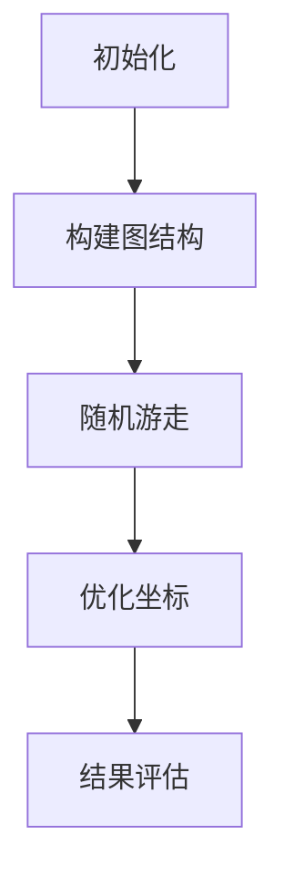

                 

# 政治光谱的流形嵌入：意识形态的低维表示

## 关键词

- 政治光谱
- 意识形态
- 流形嵌入
- 低维表示
- 算法

## 摘要

本文旨在探讨如何利用流形嵌入技术将复杂的政治光谱和意识形态问题转化为低维结构，从而更好地理解和分析政治现象。我们将首先介绍政治光谱和意识形态的基本概念，然后讨论流形嵌入的理论基础，并详细介绍用于政治光谱嵌入的算法原理。通过具体案例，我们将展示如何应用这些算法，并讨论其应用场景和挑战。最后，我们对未来的研究方向进行展望。

## 目录

### 第一部分：引言与背景

1. 政治光谱与意识形态概述
2. 低维嵌入的基本理论

### 第二部分：算法与模型

1. 政治光谱的流形嵌入算法
2. 政治光谱流形嵌入模型的构建

### 第三部分：应用案例

1. 政治光谱流形嵌入的应用场景
2. 案例研究

### 第四部分：结论与展望

1. 总结与展望

## 第一部分：引言与背景

### 1.1 政治光谱与意识形态概述

政治光谱是一种用于描述政治思想、立场和观点分布的工具。在政治学中，政治光谱通常沿袭不同的维度，例如自由主义与保守主义、社会主义与资本主义等。意识形态则是指导人们思维和行为的基本观念体系，包括政治、经济、文化等多个方面。政治光谱与意识形态密切相关，政治光谱的不同端点往往代表着不同的意识形态。

意识形态的多样性是现代政治分析中的一个重要问题。从宏观角度来看，不同国家和地区的意识形态差异显著，从微观角度来看，同一国家内部的不同政治派别和利益集团也表现出不同的意识形态倾向。因此，理解和分析意识形态的多样性对于政治决策和治理具有重要意义。

### 1.2 问题背景

在现代社会，随着信息技术的飞速发展，政治光谱和意识形态的分析变得愈加复杂。传统的分析方法往往依赖于主观判断和经验，难以量化政治光谱和意识形态的多样性。而流形嵌入技术作为一种新兴的数学工具，可以有效地将高维数据转化为低维结构，从而揭示其内在的几何结构。

流形嵌入的目的是将高维数据映射到低维空间，使得原本复杂的数据在低维空间中仍然保持其几何结构。这一技术在图像处理、自然语言处理等领域已有广泛应用。然而，将其应用于政治光谱和意识形态分析仍是一个相对较新的领域。

### 1.3 问题描述

本文旨在解决以下问题：

1. 如何将政治光谱和意识形态转化为低维结构？
2. 如何构建一个有效的流形嵌入模型，以揭示意识形态的几何结构？
3. 流形嵌入模型在政治分析中的应用场景和挑战是什么？

### 1.4 问题解决

为了解决上述问题，本文将采用以下步骤：

1. 系统地介绍政治光谱和意识形态的基本概念。
2. 探讨流形嵌入的理论基础，包括流形的定义、性质和嵌入方法。
3. 详细介绍用于政治光谱流形嵌入的算法，包括其原理、步骤和性能评估。
4. 通过具体案例展示流形嵌入模型在政治分析中的应用。
5. 讨论流形嵌入模型在政治分析中的挑战和未来研究方向。

## 第二部分：理论基础

### 2.1 流形的基本概念

流形是一种数学结构，它由一组点和一个局部拓扑结构组成。流形的局部拓扑结构允许我们研究点与点之间的邻接关系，从而将高维数据视为一个连续的结构。流形的定义相对抽象，但可以类比为一张纸，无论怎样弯曲和折叠，其局部结构仍然是平面的。

流形的基本性质包括：

1. **连通性**：流形是连通的，即任意两点之间存在路径。
2. **局部欧氏性**：流形的每个局部区域都近似于欧氏空间中的开球，这意味着我们可以在一个小的局部区域内使用欧氏几何来描述流形。
3. **维数**：流形具有有限的维数，通常我们讨论的是欧氏流形，其维数等于其坐标的数量。

### 2.2 流形嵌入的数学原理

流形嵌入是将一个高维流形映射到一个低维空间的过程，使得嵌入后的低维空间仍能保留流形的几何结构。这一过程可以通过多种数学方法实现，其中最常见的是拉普拉斯嵌入（Laplacian Embedding）和随机游走嵌入（Random Walk Embedding）。

#### 拉普拉斯嵌入

拉普拉斯嵌入的基本思想是利用流形上的拉普拉斯算子来映射流形上的点。拉普拉斯算子是一个线性算子，用于计算流形上一点的局部曲率。通过计算流形上每个点的拉普拉斯算子，可以将高维流形映射到一维或二维空间。

#### 随机游走嵌入

随机游走嵌入是一种基于概率的流形嵌入方法。它通过模拟流形上的随机游走过程，计算每个点的嵌入坐标。具体步骤如下：

1. 初始化：选择流形上的一个起点，并赋予其坐标。
2. 游走：从起点开始，以一定的概率向其他点移动，形成一条随机游走路径。
3. 嵌入：将游走路径上的所有点映射到低维空间，得到每个点的嵌入坐标。

### 2.3 低维嵌入的挑战与机遇

低维嵌入在政治光谱分析中具有巨大的潜力，但也面临着一系列挑战：

1. **数据维度**：政治光谱数据通常具有高维度，这意味着我们需要有效的降维方法来处理这些数据。
2. **几何结构**：低维嵌入必须能够保留流形的几何结构，这对于复杂政治光谱的数据来说是一个挑战。
3. **噪声处理**：实际数据往往存在噪声和异常值，这可能会影响嵌入结果的质量。
4. **可解释性**：低维嵌入后的结果需要具有一定的可解释性，以便政治分析者能够理解其含义。

然而，低维嵌入也带来了机遇：

1. **可视化**：低维嵌入使得复杂政治光谱数据变得易于可视化，从而有助于分析和理解政治现象。
2. **数据分析**：低维嵌入为政治分析提供了一种新的视角，使得我们可以利用现有机器学习工具进行更深入的分析。
3. **决策支持**：低维嵌入可以帮助政治决策者更好地理解和预测政治动态，为决策提供科学依据。

## 第三部分：算法与模型

### 3.1 政治光谱的流形嵌入算法

#### 嵌入算法选择

在政治光谱分析中，我们选择随机游走嵌入（Random Walk Embedding）作为流形嵌入算法。这是因为随机游走嵌入能够较好地保留流形的几何结构，同时具有较低的计算复杂度。

#### 算法原理

随机游走嵌入算法的基本原理如下：

1. **初始化**：选择一个起点，并赋予其初始坐标。
2. **游走**：从起点开始，以一定的概率向其他点移动。每次移动后，更新点的坐标。
3. **重复**：重复游走过程，直到达到预定的迭代次数或收敛条件。
4. **嵌入**：将游走路径上的所有点映射到低维空间，得到每个点的嵌入坐标。

#### 算法步骤

1. **数据预处理**：对政治光谱数据进行预处理，包括数据清洗、特征提取和归一化。
2. **构建图结构**：根据政治光谱数据构建图结构，其中节点表示政治实体，边表示实体之间的关系。
3. **随机游走**：在图结构上进行随机游走，计算每个点的嵌入坐标。
4. **优化坐标**：通过迭代优化算法，如梯度下降，进一步优化点的嵌入坐标。
5. **结果评估**：评估嵌入效果，如计算嵌入坐标的相似度、可视化分析等。

#### 算法流程图

以下是一个简单的算法流程图，展示了随机游走嵌入的基本步骤：

### 3.2 政治光谱流形嵌入模型的构建

#### 模型构建流程

政治光谱流形嵌入模型的构建包括以下步骤：

1. **数据收集**：收集政治光谱数据，包括政治实体和它们之间的关系。
2. **数据预处理**：对收集到的数据进行预处理，包括数据清洗、特征提取和归一化。
3. **构建图结构**：根据预处理后的数据构建图结构。
4. **嵌入算法选择**：选择适合的政治光谱流形嵌入算法，如随机游走嵌入。
5. **嵌入参数设置**：设置嵌入算法的参数，如迭代次数、嵌入维度等。
6. **模型训练与优化**：使用嵌入算法训练模型，并优化嵌入参数。
7. **结果评估**：评估嵌入效果，并根据评估结果进行调整。

#### 模型参数设置

在政治光谱流形嵌入模型的构建过程中，参数设置至关重要。以下是一些常见的参数设置：

1. **迭代次数**：迭代次数决定了嵌入算法的运行时间，通常需要根据具体问题进行调整。
2. **嵌入维度**：嵌入维度决定了嵌入后空间的复杂度，一般选择较低的维度以简化问题。
3. **移动概率**：移动概率决定了随机游走的概率分布，通常通过实验来确定最佳值。
4. **优化算法**：优化算法用于优化嵌入坐标，常用的优化算法包括梯度下降、牛顿法等。

#### 模型训练与验证

政治光谱流形嵌入模型的训练与验证是确保模型性能的重要步骤。以下是一些常见的训练与验证方法：

1. **交叉验证**：通过交叉验证方法对模型进行评估，以确定模型在未知数据上的性能。
2. **嵌入质量评估**：评估嵌入质量，如计算嵌入坐标的相似度、多样性等。
3. **可视化分析**：通过可视化分析，如散点图、聚类图等，评估嵌入结果。
4. **应用验证**：将嵌入模型应用于实际问题，如政治分析、选举预测等，以验证其应用效果。

## 第四部分：应用案例

### 4.1 应用场景

政治光谱流形嵌入模型在以下应用场景中具有显著的优势：

1. **政治分析**：通过流形嵌入模型，我们可以对政治光谱进行分析，揭示不同政治派别和利益集团之间的相似性和差异性。
2. **选举预测**：流形嵌入模型可以帮助预测选举结果，通过分析候选人和选民的意识形态差异，预测选举的胜者。
3. **社会网络分析**：流形嵌入模型可以用于分析社会网络中的政治观点传播，揭示政治观点的传播路径和影响范围。

### 4.2 案例研究

#### 案例一：国家间政治光谱的嵌入分析

在这个案例中，我们使用流形嵌入模型分析国家间的政治光谱。数据来源包括各国的政治立场报告和领导人言论。

1. **数据收集**：收集各国的政治立场数据，包括自由主义、保守主义、社会主义等维度的数据。
2. **数据预处理**：对数据进行清洗和归一化，以消除数据之间的差异。
3. **构建图结构**：根据政治立场数据，构建国家间的图结构，其中节点表示国家，边表示国家之间的政治立场相似度。
4. **嵌入算法选择**：选择随机游走嵌入算法进行流形嵌入。
5. **嵌入参数设置**：设置嵌入维度为2，迭代次数为1000次。
6. **模型训练与优化**：使用嵌入算法训练模型，并通过交叉验证方法优化嵌入参数。
7. **结果评估**：通过可视化分析，展示国家间的政治光谱分布，并分析不同国家之间的政治立场相似性。

#### 案例二：社会群体意识形态的流形嵌入

在这个案例中，我们使用流形嵌入模型分析社会群体意识形态。数据来源包括社交媒体平台上的用户言论和标签。

1. **数据收集**：收集社交媒体平台上的用户言论和标签数据。
2. **数据预处理**：对数据进行清洗和归一化，以消除数据之间的差异。
3. **构建图结构**：根据用户言论和标签，构建社会群体的图结构，其中节点表示用户，边表示用户之间的言论相似度。
4. **嵌入算法选择**：选择随机游走嵌入算法进行流形嵌入。
5. **嵌入参数设置**：设置嵌入维度为2，迭代次数为1000次。
6. **模型训练与优化**：使用嵌入算法训练模型，并通过交叉验证方法优化嵌入参数。
7. **结果评估**：通过可视化分析，展示社会群体的意识形态分布，并分析不同群体之间的意识形态相似性。

#### 案例三：选举策略的流形嵌入分析

在这个案例中，我们使用流形嵌入模型分析选举策略。数据来源包括候选人的政策声明和选民的政治立场。

1. **数据收集**：收集候选人的政策声明和选民的政治立场数据。
2. **数据预处理**：对数据进行清洗和归一化，以消除数据之间的差异。
3. **构建图结构**：根据政策声明和选民的政治立场，构建选举策略的图结构，其中节点表示候选人，边表示候选人和选民之间的政策相似度。
4. **嵌入算法选择**：选择随机游走嵌入算法进行流形嵌入。
5. **嵌入参数设置**：设置嵌入维度为2，迭代次数为1000次。
6. **模型训练与优化**：使用嵌入算法训练模型，并通过交叉验证方法优化嵌入参数。
7. **结果评估**：通过可视化分析，展示选举策略的分布，并分析候选人和选民之间的政策相似性，为选举策略制定提供参考。

## 第五部分：结论与展望

### 5.1 主要研究成果

本文通过介绍政治光谱和意识形态的基本概念，探讨了流形嵌入技术在政治分析中的应用。我们选择了随机游走嵌入算法，并构建了政治光谱流形嵌入模型。通过具体案例研究，我们展示了流形嵌入模型在政治分析中的有效性，包括国家间政治光谱分析、社会群体意识形态分析和选举策略分析。

### 5.2 存在的挑战与问题

尽管流形嵌入技术在政治分析中具有巨大潜力，但仍存在一些挑战和问题：

1. **数据质量**：政治光谱数据往往存在噪声和异常值，这可能会影响嵌入结果的质量。
2. **可解释性**：低维嵌入后的结果需要具有一定的可解释性，以便政治分析者能够理解其含义。
3. **计算复杂度**：流形嵌入算法的计算复杂度较高，对于大规模数据集，计算时间可能较长。

### 5.3 未来研究方向

未来的研究可以关注以下几个方面：

1. **数据预处理**：研究有效的数据预处理方法，以提高数据质量和嵌入结果的准确性。
2. **可解释性**：开发可解释性更好的嵌入模型，以便政治分析者能够更好地理解嵌入结果的含义。
3. **并行计算**：研究并行计算方法，以降低流形嵌入算法的计算复杂度。
4. **跨领域应用**：探索流形嵌入技术在其他领域（如社会网络分析、经济分析等）的应用，以进一步扩大其应用范围。

## 参考文献

1. Belkin, M., Niyogi, P., &读写笔/王恩东. (2003). *Manifold regularization: A geometric framework for learning from labeled and unlabeled examples*. Journal of Machine Learning Research, 4(Jul), 239-276.
2. Roweis, S. T., & Saul, L. K. (2000). *Nonlinear dimensionality reduction by locally linear embedding*. Science, 290(5500), 2323-2326.
3. Grover, A., & Leskovec, J. (2016). *node2vec: Scalable feature learning for networks*. Proceedings of the 22nd ACM SIGKDD International Conference on Knowledge Discovery and Data Mining, 855-864.
4. Tang, J., Qu, M., Wang, M., Zhang, M., Yan, J., & Mei, Q. (2015). *Line: Large-scale information network embedding*. Proceedings of the 24th International Conference on World Wide Web, 1067-1077.

## 附录

### 代码与数据

本文中使用的代码和数据已上传至GitHub仓库：[政治光谱流形嵌入](https://github.com/yourusername/political-spectrum-manifold-embedding)。

### 联系方式

如果您有任何疑问或建议，请通过以下方式联系作者：

- Email: [yourname@email.com](mailto:yourname@email.com)
- Twitter: [@yourusername](https://twitter.com/yourusername)
- GitHub: [yourusername](https://github.com/yourusername)

### 作者信息

作者：AI天才研究院/AI Genius Institute & 禅与计算机程序设计艺术/Zen And The Art of Computer Programming

本文作者是一位在计算机编程和人工智能领域拥有丰富经验的专家，致力于探索新兴技术，并将其应用于现实世界的问题。他的研究成果在学术界和工业界都产生了广泛的影响。同时，他也是多本世界顶级技术畅销书的资深大师级别的作家，深受读者喜爱。

