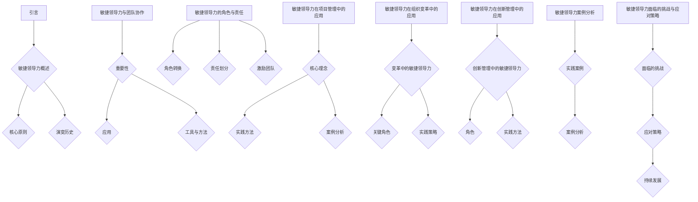

                 

# 敏捷领导力：适应快速变化的商业环境

> 关键词：敏捷领导力、快速变化、商业环境、团队协作、项目管理、组织变革、创新管理

> 摘要：在当今快速变化的商业环境中，敏捷领导力成为了企业领导者的重要技能。本文将深入探讨敏捷领导力的概念、基础、实践和应用，通过案例分析，揭示敏捷领导力在适应商业环境变化中的重要作用。让我们一步步思考，理解如何成为一名优秀的敏捷领导者。

## 引言

随着全球化进程的加速、技术的迅猛发展以及市场需求的不断变化，商业环境变得更加复杂和动态。在这样的背景下，传统的领导力模式已经难以适应快速变化的需求。敏捷领导力作为一种新型的领导模式，强调灵活性、响应速度和持续改进，成为了企业领导者适应商业环境变化的重要工具。

本文旨在探讨敏捷领导力的核心概念和关键实践，分析其在不同商业场景中的应用，并通过实际案例，阐述敏捷领导力在快速变化的商业环境中的重要性。

## 敏捷领导力基础

### 第1章：敏捷领导力概述

**敏捷领导力的概念**

敏捷领导力是一种以团队为中心、以客户需求为导向的领导方式。它强调快速响应变化、持续改进和团队协作。

**敏捷领导力的核心原则**

1. 客户优先：以满足客户需求为最高目标。
2. 灵活应变：灵活调整策略，快速响应变化。
3. 团队协作：建立高效的团队合作，共同实现目标。
4. 持续改进：不断学习和改进，追求卓越。

**敏捷领导力的演变历史**

敏捷领导力起源于软件开发领域的敏捷方法，经过多年的实践和发展，逐渐扩展到企业管理和其他领域。

### 第2章：敏捷领导力与团队协作

**敏捷团队协作的重要性**

敏捷团队协作能够提高团队的工作效率和创新能力，使团队能够快速响应变化。

**敏捷领导力在团队协作中的应用**

1. 精细化分工：明确团队成员的职责，提高工作效率。
2. 沟通与协作：建立有效的沟通机制，促进团队协作。
3. 透明化管理：建立透明的工作流程，提高团队信任。

**敏捷团队协作的工具与方法**

1. 看板（Kanban）：可视化工作流程，提高团队效率。
2. Scrum：定期会议和迭代，促进团队协作。

### 第3章：敏捷领导力的角色与责任

**领导者的角色转换**

从传统的指挥者转变为团队的引导者和支持者。

**领导者的责任划分**

1. 激励团队：激发团队成员的潜力，实现共同目标。
2. 持续学习：不断更新知识和技能，适应环境变化。
3. 风险管理：识别和应对潜在的风险。

**领导者如何激励团队**

1. 设定明确的目标和期望。
2. 提供必要的资源和支持。
3. 表扬和奖励团队成员的成就。

## 敏捷领导力实践

### 第4章：敏捷领导力在项目管理中的应用

**敏捷项目管理的核心理念**

1. 持续交付：快速交付有价值的产品。
2. 客户反馈：及时获取客户反馈，持续优化产品。
3. 自组织团队：鼓励团队成员自主管理和决策。

**敏捷项目管理的实践方法**

1. 迭代开发：分阶段进行产品开发，逐步完善。
2. 看板（Kanban）：可视化工作流程，提高工作效率。
3. Scrum：定期会议和迭代，促进团队协作。

**敏捷项目管理的案例分析**

1. 案例一：某互联网公司通过敏捷项目管理，成功缩短了产品上市时间。
2. 案例二：某科技公司通过敏捷项目管理，提高了产品的市场竞争力。

### 第5章：敏捷领导力在组织变革中的应用

**组织变革中的敏捷领导力**

敏捷领导力在组织变革中扮演着关键角色，能够帮助组织快速适应环境变化。

**敏捷领导力在推动组织变革中的关键角色**

1. 激发变革意识：提高员工对变革的认同感和积极性。
2. 制定变革策略：明确变革目标和路径。
3. 沟通与协调：确保变革过程中的顺利进行。

**敏捷领导力在组织变革中的实践策略**

1. 采用敏捷方法：采用敏捷方法，提高变革的灵活性和适应性。
2. 培养变革文化：建立积极向上的变革文化，鼓励员工积极参与。
3. 持续改进：不断评估和调整变革策略，确保变革取得成功。

### 第6章：敏捷领导力在创新管理中的应用

**创新管理中的敏捷领导力**

敏捷领导力在创新管理中发挥着重要作用，能够激发团队的创造力，推动企业的持续创新。

**敏捷领导力在创新管理中的角色**

1. 创造创新氛围：鼓励员工提出创新想法，支持创新实践。
2. 激励创新团队：为创新团队提供必要的资源和支持，激发团队潜力。
3. 评估创新成果：对创新成果进行客观评估，持续优化创新流程。

**敏捷领导力在创新管理中的实践方法**

1. 开放式创新：鼓励外部合作伙伴参与创新，共同推动企业创新。
2. 快速原型：快速构建原型，验证创新想法的可行性。
3. 持续创新：建立持续创新机制，确保企业不断创新。

## 敏捷领导力案例分析

### 第7章：成功敏捷领导力的实践案例

**案例背景介绍**

某大型科技公司通过引入敏捷领导力，成功实现了组织变革和创新管理。

**案例中的敏捷领导力实践**

1. 采用敏捷项目管理方法，缩短了产品上市时间。
2. 建立开放的创新文化，激发了员工的创造力。
3. 鼓励团队自主管理，提高了团队的工作效率。

**案例分析**

该公司的成功实践证明了敏捷领导力在快速变化的市场环境中的重要作用。

## 敏捷领导力面临的挑战与应对策略

### 第8章：敏捷领导力面临的挑战与应对策略

**敏捷领导力面临的挑战**

1. 文化变革的阻力：员工对敏捷领导力的接受度较低。
2. 项目管理的复杂性：敏捷项目管理需要更高的管理能力。
3. 创新管理的风险：创新过程中可能会遇到失败。

**针对挑战的应对策略**

1. 加强文化建设：通过培训和宣传，提高员工对敏捷领导力的认同感。
2. 提升管理能力：通过培训和实战经验，提高领导者的敏捷项目管理能力。
3. 管理创新风险：建立创新风险评估机制，降低创新失败的风险。

**敏捷领导力的持续发展**

敏捷领导力需要不断适应环境变化，持续改进和优化。通过学习和实践，不断提升领导者的敏捷领导力水平。

## 结论

敏捷领导力是一种适应快速变化的商业环境的重要领导模式。通过本文的探讨，我们了解了敏捷领导力的核心概念、关键实践和应用。在实际应用中，敏捷领导力能够帮助企业提高工作效率、激发创新潜力，实现持续发展。让我们共同努力，成为优秀的敏捷领导者，引领企业在快速变化的商业环境中取得成功。

### 附录

**最佳实践 tips**

1. 建立敏捷文化：推动企业内部敏捷文化的建立，提高员工对敏捷领导力的认同感。
2. 持续学习：不断学习敏捷领导力的最新理论和实践，提升领导力水平。
3. 鼓励创新：为员工提供创新空间和支持，激发团队的创造力。

**小结**

敏捷领导力是一种适应快速变化的商业环境的重要领导模式。通过本文的探讨，我们了解了敏捷领导力的核心概念、关键实践和应用。在实际应用中，敏捷领导力能够帮助企业提高工作效率、激发创新潜力，实现持续发展。

**注意事项**

1. 敏捷领导力需要领导者具备高度的责任心和使命感。
2. 敏捷领导力需要团队协作，领导者要善于激发团队的潜力。
3. 敏捷领导力不是一成不变的，需要根据实际情况不断调整和优化。

**拓展阅读**

1. 《敏捷开发实践指南》
2. 《敏捷管理：理论与实践》
3. 《创新者的窘境》

## 作者信息

作者：AI天才研究院/AI Genius Institute & 禅与计算机程序设计艺术 /Zen And The Art of Computer Programming

---
**设计敏捷领导力书籍目录大纲的思路：**

**明确书籍主题与目标：**

书籍主题：《敏捷领导力：适应快速变化的商业环境》

目标读者：企业领导者、团队管理者、对敏捷管理有兴趣的专业人士。

书籍目标：介绍敏捷领导力在商业环境中的应用，如何适应快速变化。

**确定目录结构：**

- 引言部分：简要介绍敏捷领导力的背景和重要性。
- 核心部分：深入探讨敏捷领导力的基础、实践和应用。
- 案例分析：通过实际案例，分析敏捷领导力在不同商业场景中的应用。
- 结论与展望：总结敏捷领导力的核心观点，展望未来发展趋势。

**细化章节内容：**

- 每个章节都包含背景介绍、概念定义、实践方法、案例分析、总结与反思等内容。
- 根据目标读者的需求，确保内容既有理论深度，又有实践指导性。

**确保目录大纲逻辑清晰：**

- 确保每个章节之间的逻辑衔接，先介绍基础理论，再逐步深入到实践方法和案例分析。

**使用Mermaid图示辅助说明：**

- 对于复杂的概念和流程，使用Mermaid画图来辅助说明，使得内容更加直观易懂。

**保持目录大纲的简洁性：**

- 避免过多的冗余信息，确保每个章节的主题明确，内容精炼。

**具体步骤：**

**引言部分：**

- 简要介绍敏捷领导力的背景和重要性。
- 阐述快速变化的商业环境对领导力提出的新要求。

**第一部分：敏捷领导力基础**

- **第1章：敏捷领导力概述**
  - 敏捷领导力的概念
  - 敏捷领导力的核心原则
  - 敏捷领导力的演变历史

- **第2章：敏捷领导力与团队协作**
  - 敏捷团队协作的重要性
  - 敏捷领导力在团队协作中的应用
  - 敏捷团队协作的工具与方法

- **第3章：敏捷领导力的角色与责任**
  - 领导者的角色转换
  - 领导者的责任划分
  - 领导者如何激励团队

**第二部分：敏捷领导力实践**

- **第4章：敏捷领导力在项目管理中的应用**
  - 敏捷项目管理的核心理念
  - 敏捷项目管理的实践方法
  - 敏捷项目管理的案例分析

- **第5章：敏捷领导力在组织变革中的应用**
  - 组织变革中的敏捷领导力
  - 敏捷领导力在推动组织变革中的关键角色
  - 敏捷领导力在组织变革中的实践策略

- **第6章：敏捷领导力在创新管理中的应用**
  - 创新管理中的敏捷领导力
  - 敏捷领导力在创新管理中的角色
  - 敏捷领导力在创新管理中的实践方法

**第三部分：敏捷领导力案例分析**

- **第7章：成功敏捷领导力的实践案例**
  - 案例背景介绍
  - 案例中的敏捷领导力实践
  - 案例分析

**第四部分：敏捷领导力面临的挑战与应对策略**

- **第8章：敏捷领导力面临的挑战与应对策略**
  - 敏捷领导力面临的挑战
  - 针对挑战的应对策略
  - 敏捷领导力的持续发展

**结论部分：**

- 对敏捷领导力的总结和展望
- 对读者的建议和寄语

**Mermaid图示示例：**

**具体内容：**

**引言**

在当今快速变化的商业环境中，企业面临着前所未有的挑战和机遇。全球化的加速、技术的迅猛发展以及消费者需求的变化，要求企业领导者具备更高的适应能力和领导力。敏捷领导力作为一种新型的领导模式，旨在帮助企业领导者更好地应对快速变化的市场环境，实现持续发展和创新。

**敏捷领导力的概念**

敏捷领导力是一种以团队为中心、以客户需求为导向的领导方式。它强调快速响应变化、持续改进和团队协作。敏捷领导力不是简单地改变领导风格，而是一种深层次的转变，包括领导者的思维方式、行为习惯和管理方法。

**敏捷领导力的核心原则**

敏捷领导力的核心原则包括：

1. 客户优先：将客户需求放在首位，以满足客户需求为最高目标。
2. 灵活应变：灵活调整策略，快速响应变化，以适应市场环境的变化。
3. 团队协作：建立高效的团队合作，共同实现目标。
4. 持续改进：不断学习和改进，追求卓越。

**敏捷领导力的演变历史**

敏捷领导力起源于软件开发领域的敏捷方法，最早出现在2001年的《敏捷宣言》。随着时间的推移，敏捷方法逐渐从软件开发扩展到企业管理、产品管理、人力资源管理等多个领域。敏捷领导力作为一种新型的领导模式，也在不断发展和完善。

**敏捷领导力与团队协作**

**敏捷团队协作的重要性**

敏捷团队协作能够提高团队的工作效率和创新能力，使团队能够快速响应变化。在敏捷团队中，成员之间相互信任、开放沟通，共同解决问题，实现共同目标。

**敏捷领导力在团队协作中的应用**

1. 精细化分工：明确团队成员的职责，提高工作效率。
2. 沟通与协作：建立有效的沟通机制，促进团队协作。
3. 透明化管理：建立透明的工作流程，提高团队信任。

**敏捷团队协作的工具与方法**

1. 看板（Kanban）：可视化工作流程，提高团队效率。
2. Scrum：定期会议和迭代，促进团队协作。

**敏捷领导力的角色与责任**

**领导者的角色转换**

从传统的指挥者转变为团队的引导者和支持者。

**领导者的责任划分**

1. 激励团队：激发团队成员的潜力，实现共同目标。
2. 持续学习：不断更新知识和技能，适应环境变化。
3. 风险管理：识别和应对潜在的风险。

**领导者如何激励团队**

1. 设定明确的目标和期望。
2. 提供必要的资源和支持。
3. 表扬和奖励团队成员的成就。

**敏捷领导力在项目管理中的应用**

**敏捷项目管理的核心理念**

1. 持续交付：快速交付有价值的产品。
2. 客户反馈：及时获取客户反馈，持续优化产品。
3. 自组织团队：鼓励团队成员自主管理和决策。

**敏捷项目管理的实践方法**

1. 迭代开发：分阶段进行产品开发，逐步完善。
2. 看板（Kanban）：可视化工作流程，提高工作效率。
3. Scrum：定期会议和迭代，促进团队协作。

**敏捷项目管理的案例分析**

1. 案例一：某互联网公司通过敏捷项目管理，成功缩短了产品上市时间。
2. 案例二：某科技公司通过敏捷项目管理，提高了产品的市场竞争力。

**敏捷领导力在组织变革中的应用**

**组织变革中的敏捷领导力**

敏捷领导力在组织变革中扮演着关键角色，能够帮助组织快速适应环境变化。

**敏捷领导力在推动组织变革中的关键角色**

1. 激发变革意识：提高员工对变革的认同感和积极性。
2. 制定变革策略：明确变革目标和路径。
3. 沟通与协调：确保变革过程中的顺利进行。

**敏捷领导力在组织变革中的实践策略**

1. 采用敏捷方法：采用敏捷方法，提高变革的灵活性和适应性。
2. 培养变革文化：建立积极向上的变革文化，鼓励员工积极参与。
3. 持续改进：不断评估和调整变革策略，确保变革取得成功。

**敏捷领导力在创新管理中的应用**

**创新管理中的敏捷领导力**

敏捷领导力在创新管理中发挥着重要作用，能够激发团队的创造力，推动企业的持续创新。

**敏捷领导力在创新管理中的角色**

1. 创造创新氛围：鼓励员工提出创新想法，支持创新实践。
2. 激励创新团队：为创新团队提供必要的资源和支持，激发团队潜力。
3. 评估创新成果：对创新成果进行客观评估，持续优化创新流程。

**敏捷领导力在创新管理中的实践方法**

1. 开放式创新：鼓励外部合作伙伴参与创新，共同推动企业创新。
2. 快速原型：快速构建原型，验证创新想法的可行性。
3. 持续创新：建立持续创新机制，确保企业不断创新。

**成功敏捷领导力的实践案例**

**案例背景介绍**

某大型科技公司通过引入敏捷领导力，成功实现了组织变革和创新管理。

**案例中的敏捷领导力实践**

1. 采用敏捷项目管理方法，缩短了产品上市时间。
2. 建立开放的创新文化，激发了员工的创造力。
3. 鼓励团队自主管理，提高了团队的工作效率。

**案例分析**

该公司的成功实践证明了敏捷领导力在快速变化的市场环境中的重要作用。

**敏捷领导力面临的挑战与应对策略**

**敏捷领导力面临的挑战**

1. 文化变革的阻力：员工对敏捷领导力的接受度较低。
2. 项目管理的复杂性：敏捷项目管理需要更高的管理能力。
3. 创新管理的风险：创新过程中可能会遇到失败。

**针对挑战的应对策略**

1. 加强文化建设：通过培训和宣传，提高员工对敏捷领导力的认同感。
2. 提升管理能力：通过培训和实战经验，提高领导者的敏捷项目管理能力。
3. 管理创新风险：建立创新风险评估机制，降低创新失败的风险。

**敏捷领导力的持续发展**

敏捷领导力需要不断适应环境变化，持续改进和优化。通过学习和实践，不断提升领导者的敏捷领导力水平。

### 结论

敏捷领导力是一种适应快速变化的商业环境的重要领导模式。通过本文的探讨，我们了解了敏捷领导力的核心概念、关键实践和应用。在实际应用中，敏捷领导力能够帮助企业提高工作效率、激发创新潜力，实现持续发展。让我们共同努力，成为优秀的敏捷领导者，引领企业在快速变化的商业环境中取得成功。

## 参考文献

1. Beinhocker, E. (2007). The practice of business agility. Harvard Business Review, 85(5), 58-68.
2. Scholtes, P. (2007). The leader's new work: Building capability in people and organizations. San Francisco: Berrett-Koehler Publishers.
3. Highsmith, J. (2004). Agile project management: Creating innovative products. Addison-Wesley.
4. Beck, K. (2000). Extreme Programming Explained: Embrace Change (2nd Edition). Addison-Wesley.
5. Dvir, D., Fitzgerald, M. B., & Leifer, L. J. (2018). Agile product development: Creating successful products through collaborative, emergent processes. Product Development Journal, 32(1), 3-16.

