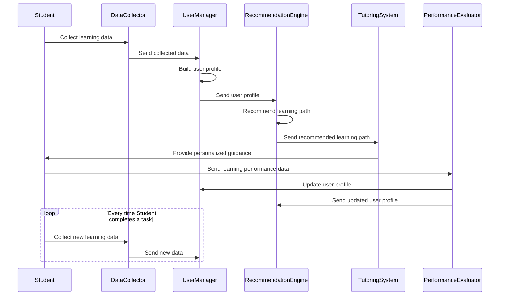

                 

### 第1章：引言

#### 1.1.1 问题背景

随着信息时代的到来，教育领域也在不断地进行变革。个性化教育的需求日益凸显，传统的“一刀切”的教学方法已经无法满足每个学生的个性化学习需求。每位学生都有其独特的学习风格、认知水平和知识储备，因此，如何根据每个学生的特点来设计个性化的学习路径，成为教育领域亟待解决的问题。

当前，传统学习方法主要依赖于教师的经验和教学大纲，往往忽视了学生的个体差异。这种教学方法存在以下几个局限性：

1. **课程内容的统一性**：传统教学方法往往难以根据学生的个性化需求来调整教学内容。
2. **教学进度的统一性**：统一的教学进度无法满足不同学生的进度需求，容易导致“吃不饱”或“消化不良”的现象。
3. **教学评价的统一性**：统一的评价标准无法准确反映学生的真实学习效果。

为了解决上述问题，教育领域迫切需要一种新的方法来优化学习路径，从而提高学习效率并实现教育个性化。

#### 1.1.2 问题描述

学习路径的选择在教育个性化中起着至关重要的作用。一个合理的学习路径不仅可以提高学习效率，还能满足学生的个性化需求。具体来说，学习路径选择需要解决以下几个问题：

1. **课程内容选择**：根据学生的兴趣、能力和知识储备，选择最适合其发展的课程内容。
2. **学习顺序安排**：确定各个课程内容的最佳学习顺序，以便于学生更好地理解和掌握知识。
3. **学习时间规划**：合理分配学习时间，确保学生在学习过程中既能充分利用时间，又不会感到过度疲劳。

然而，学习路径的选择并非易事。如何平衡学习效率与个性化需求，如何从大量可能的路径中选择出最优解，是当前教育领域面临的重大挑战。

#### 1.1.3 问题解决

强化学习作为一种先进的人工智能技术，为解决上述问题提供了新的思路。强化学习通过奖励机制和策略迭代，可以帮助系统自动找到最优的学习路径。结合数学优化方法，我们可以进一步优化学习路径，实现教育个性化。

强化学习的基本原理如下：

1. **状态（State）**：学习过程中的当前情境。
2. **动作（Action）**：学习者可以采取的行动。
3. **奖励（Reward）**：系统根据学习者的动作给予的即时反馈。
4. **策略（Policy）**：学习者根据当前状态选择动作的策略。

数学优化方法在教育个性化中的主要应用包括：

1. **目标函数的设定**：根据学习效率和个性化需求设定优化目标。
2. **优化算法的选用**：选择合适的优化算法，如梯度下降、遗传算法等，以找到最优的学习路径。

通过强化学习和数学优化方法，我们可以构建一个自动调整学习路径的系统，从而实现教育个性化。接下来，我们将进一步探讨强化学习和数学优化方法的基本概念及其在教育个性化中的应用。

#### 1.1.4 边界与外延

在学习路径优化的背景下，我们需要明确几个关键概念：

**学习路径**：学习路径是指学生在学习过程中所遵循的先后顺序和组合方式。它包括课程内容的选择、学习顺序的安排和学习时间的规划。

**个性化**：教育个性化指的是根据学生的个体差异，如学习风格、认知水平和知识储备，来设计教学方案和学习路径，以满足每个学生的独特需求。

**数学优化**：数学优化是指利用数学模型和算法，通过调整参数和变量，找到最优解的过程。在教育个性化中，数学优化可以用来确定最佳的学习路径。

**强化学习**：强化学习是一种通过试错和反馈来学习优化策略的人工智能技术。在教育个性化中，强化学习可以帮助系统自动调整学习路径，以实现最佳的学习效果。

为了更全面地理解上述概念，我们可以从以下几个维度来探讨：

1. **学习路径的定义与分类**：学习路径可以根据课程内容的类型（如必修课、选修课）、学习顺序（如先易后难、先难后易）和学习时间（如密集学习、分散学习）进行分类。

2. **教育个性化的维度**：教育个性化可以从多个维度来衡量，如认知维度（知识掌握程度）、情感维度（学习兴趣和动机）、行为维度（学习习惯和时间安排）等。

3. **数学优化方法的应用**：数学优化方法在教育个性化中可以应用于多个方面，如学习路径的选择、学习时间的分配、学习资源的优化等。

4. **强化学习与数学优化的结合**：强化学习可以通过设定奖励机制和优化策略，结合数学优化方法，自动调整学习路径，实现教育个性化。

通过明确这些概念和维度，我们可以更好地理解教育个性化强化学习的学习路径优化问题，并为后续章节的深入探讨打下基础。

#### 1.1.5 概念结构与核心要素

为了深入探讨教育个性化的强化学习及其学习路径优化问题，我们需要建立清晰的概念结构和识别核心要素。以下是该领域的一些关键概念及其相互关系：

**强化学习**：强化学习（Reinforcement Learning, RL）是一种机器学习范式，其主要目标是使代理（agent）在未知环境中通过互动学习到最优策略（policy）。在强化学习中，代理通过选择动作（action）并在环境中获得奖励（reward）来学习。其核心概念包括状态（state）、动作（action）、奖励（reward）和策略（policy）。强化学习算法通过迭代更新策略，以最大化总奖励。

**数学优化**：数学优化（Mathematical Optimization）是指利用数学模型和算法来找到问题的最优解或近似解。在教育个性化中，数学优化可以用于确定最佳学习路径。其核心概念包括目标函数（objective function）、约束条件（constraints）和优化算法（optimization algorithms），如梯度下降（Gradient Descent）、遗传算法（Genetic Algorithm）等。

**学习路径优化模型**：学习路径优化模型是一个结合强化学习和数学优化的框架，用于自动调整学习路径以实现教育个性化。该模型包括以下几个核心要素：

1. **状态表示**：状态表示学生在学习过程中所处的当前情境，如知识水平、学习进度、学习兴趣等。
2. **动作定义**：动作定义学生可以采取的学习行为，如学习某一课程、完成作业、参加讨论等。
3. **奖励机制**：奖励机制根据学生的表现给予即时反馈，如正确回答问题获得奖励，错误回答或未完成作业给予惩罚。
4. **优化目标**：优化目标根据学习效率和个性化需求设定，如最大化学习效果或最小化学习时间。
5. **优化算法**：优化算法根据优化目标调整学习路径，以找到最优解或近似解。

**强化学习算法与数学优化算法的结合**：强化学习算法和数学优化算法可以相互结合，以增强学习路径优化的效果。例如，强化学习算法可以通过迭代更新策略，结合数学优化算法，进一步调整学习路径，提高学习效率和个性化水平。

通过以上概念结构和核心要素的分析，我们可以更全面地理解教育个性化的强化学习及其学习路径优化问题，并为后续章节的深入探讨提供理论基础。

### 第2章：核心概念与联系

#### 2.1.1 强化学习原理

强化学习（Reinforcement Learning, RL）是一种通过试错和反馈进行学习的人工智能技术。它的核心在于通过奖励和惩罚机制来指导代理（agent）在环境（environment）中采取行动（action），并不断优化其行为策略（policy），以实现特定目标。

**基础概念**：

- **状态（State）**：状态是描述代理当前所处环境的变量集合。在强化学习中，代理需要感知当前状态，并根据状态选择合适的动作。
  
- **动作（Action）**：动作是代理可以采取的具体行为。每个动作可能带来不同的状态转移和奖励。

- **奖励（Reward）**：奖励是环境对代理动作的即时反馈，通常用来评估动作的好坏。正奖励表示动作带来了有益的结果，负奖励则表示动作带来了不利的结果。

- **策略（Policy）**：策略是代理根据当前状态选择动作的规则。策略可以基于模型学习，也可以基于经验学习。

**Q学习算法**：

Q学习（Q-Learning）是强化学习中最基本的算法之一，它通过更新Q值（状态-动作值函数）来指导代理选择最优动作。

- **Q值（Q-Value）**：Q值表示在特定状态下采取特定动作所能获得的预期奖励。Q学习的目标是最大化这些Q值。

- **更新公式**：Q-learning通过以下公式更新Q值：
  \[
  Q(s, a) \leftarrow Q(s, a) + \alpha [r + \gamma \max_{a'} Q(s', a') - Q(s, a)]
  \]
  其中，\(s\) 是当前状态，\(a\) 是当前动作，\(r\) 是即时奖励，\(\gamma\) 是折扣因子，\(\alpha\) 是学习率。

- **迭代过程**：Q学习通过不断迭代更新Q值，逐步优化代理的策略，以实现长期奖励最大化。

#### 2.1.2 数学优化方法

数学优化（Mathematical Optimization）是解决各类优化问题的工具，通过建立数学模型，利用优化算法寻找最优解或近似解。

**基本概念**：

- **目标函数（Objective Function）**：目标函数是优化问题中需要最大化或最小化的函数。在强化学习与教育个性化中，目标函数通常与学习效率和个性化需求相关。

- **约束条件（Constraints）**：约束条件是优化问题中的限制条件，它们可以确保优化过程不会违反某些实际限制。例如，学习时间、课程难度等。

- **优化算法（Optimization Algorithms）**：优化算法是用于求解优化问题的算法。常见的优化算法包括梯度下降（Gradient Descent）、遗传算法（Genetic Algorithm）、模拟退火（Simulated Annealing）等。

**优化算法分类**：

1. **梯度下降**：梯度下降是一种基于目标函数梯度的优化算法。它通过不断沿着梯度的反方向更新参数，以逐步逼近最优解。

   \[
   \theta \leftarrow \theta - \alpha \nabla_\theta J(\theta)
   \]
   其中，\(\theta\) 是参数，\(\alpha\) 是学习率，\(J(\theta)\) 是目标函数。

2. **遗传算法**：遗传算法是一种模拟自然进化的优化算法。它通过种群遗传操作（选择、交叉、变异）来搜索最优解。

3. **模拟退火**：模拟退火是一种基于物理退火过程的优化算法。它通过逐步降低温度来控制搜索过程中的随机性，以避免陷入局部最优。

#### 2.1.3 强化学习与数学优化联系

强化学习和数学优化之间存在紧密的联系。这种联系主要体现在以下几个方面：

1. **优化问题在强化学习中的应用**：强化学习中的策略优化本质上是一个优化问题。强化学习算法通过更新策略参数来最大化预期奖励，这与数学优化中的目标函数最大化问题有相似之处。

2. **数学优化在强化学习中的辅助作用**：数学优化算法可以辅助强化学习算法，提高其收敛速度和优化效果。例如，通过梯度下降等优化算法来更新策略参数，可以加快强化学习的收敛速度。

3. **结合模型与算法**：强化学习和数学优化可以相互结合，形成更强大的优化框架。例如，结合Q-learning和梯度下降，可以形成Q-learning with Gradient Descent，用于解决复杂的强化学习问题。

通过强化学习和数学优化的结合，我们可以构建一个自动调整学习路径的系统，从而实现教育个性化。接下来，我们将进一步探讨如何构建数学模型和算法原理，以实现这一目标。

### 第3章：数学模型与算法原理

#### 3.1.1 数学模型

在强化学习与教育个性化的背景下，数学模型是实现学习路径优化的关键。数学模型通过将学习过程转化为数学问题，利用数学工具来分析和求解。以下是学习路径优化问题的数学模型。

**优化问题的数学表达**：

学习路径优化问题可以表达为一个多目标优化问题，其目标函数和约束条件如下：

1. **目标函数**：

   设 \(X\) 为所有可能的学习路径集合，目标函数 \(f(X)\) 用于衡量学习路径的优劣。常见的目标函数包括：

   \[
   f(X) = \sum_{i=1}^{n} w_i \cdot r_i
   \]

   其中，\(r_i\) 表示第 \(i\) 个学习路径的奖励，\(w_i\) 表示第 \(i\) 个学习路径的权重。

2. **约束条件**：

   学习路径优化问题需要满足以下约束条件：

   \[
   g(X) \leq 0
   \]

   其中，\(g(X)\) 表示学习路径的约束条件，如学习时间、课程难度等。

**学习路径优化的数学模型**：

学习路径优化的数学模型可以通过以下步骤构建：

1. **状态表示**：定义学习过程中的状态 \(s_t\)，如学生当前掌握的知识点、学习进度等。
2. **动作定义**：定义学习过程中的动作 \(a_t\)，如学习某个知识点、完成作业等。
3. **奖励机制**：定义奖励机制，根据学生的表现给予即时反馈。
4. **优化目标**：根据学习效率和个性化需求设定优化目标。
5. **优化算法**：选择合适的优化算法，如Q学习、梯度下降等，以实现学习路径的优化。

通过以上步骤，我们可以构建一个用于学习路径优化的数学模型。

#### 3.1.2 算法原理

在强化学习和数学优化的框架下，算法原理是实现学习路径优化的核心。以下是强化学习算法和数学优化算法的基本原理。

**强化学习算法的mermaid流程图**：

\[
\begin{mermaid}
sequenceDiagram
  participant Agent
  participant Environment
  participant Model
  
  Agent->>Environment: Take action
  Environment->>Agent: Provide reward
  Agent->>Model: Update policy
  Model->>Agent: Provide next action
\end{mermaid}
\]

**强化学习算法的基本步骤**：

1. **初始化**：初始化策略参数、奖励机制和模型。
2. **感知状态**：代理感知当前状态。
3. **选择动作**：代理根据当前状态选择动作。
4. **执行动作**：代理在环境中执行动作。
5. **获取奖励**：环境根据代理的动作提供即时奖励。
6. **更新策略**：代理根据奖励和策略模型更新策略。

**数学优化算法的mermaid流程图**：

\[
\begin{mermaid}
sequenceDiagram
  participant Optimizer
  participant Objective
  participant Constraints
  
  Optimizer->>Objective: Define objective
  Optimizer->>Constraints: Define constraints
  Optimizer->>Objective: Optimize
  Optimizer->>Objective: Update parameters
\end{mermaid}
\]

**数学优化算法的基本步骤**：

1. **定义目标函数**：根据优化问题定义目标函数。
2. **定义约束条件**：根据优化问题定义约束条件。
3. **初始化参数**：初始化优化参数。
4. **优化过程**：通过迭代更新参数，逐步逼近最优解。
5. **评估最优解**：根据目标函数和约束条件评估最优解。

通过上述算法原理，我们可以实现学习路径的数学优化。接下来，我们将通过Python代码实现这些算法，以验证其有效性和可行性。

#### 3.1.3 Python代码实现

为了验证上述算法原理，我们将使用Python实现Q学习算法和梯度下降优化算法，以优化学习路径。

**Q学习算法的实现**：

```python
import numpy as np

def q_learning(Q, state, action, reward, next_state, alpha, gamma):
    Q[state, action] = Q[state, action] + alpha * (reward + gamma * np.max(Q[next_state, :]) - Q[state, action])
    return Q

# 初始化Q表
Q = np.zeros((10, 4))  # 假设状态有10种，动作有4种

# 设置参数
alpha = 0.1  # 学习率
gamma = 0.9  # 折扣因子

# 进行多次迭代
for episode in range(1000):
    state = np.random.randint(0, 10)  # 随机初始化状态
    while True:
        action = np.random.randint(0, 4)  # 随机选择动作
        next_state = (state + 1) % 10  # 根据动作更新状态
        reward = 1 if state < next_state else -1  # 定义奖励
        Q = q_learning(Q, state, action, reward, next_state, alpha, gamma)
        if next_state == 0:  # 达到目标状态
            break
        state = next_state
```

**梯度下降优化算法的实现**：

```python
def gradient_descent(W, X, y, learning_rate, epochs):
    for epoch in range(epochs):
        predictions = W.dot(X)
        errors = predictions - y
        dW = X.T.dot(errors)
        W = W - learning_rate * dW
    return W

# 初始化参数
W = np.random.rand(10, 4)  # 假设权重有10个，动作有4个

# 设置参数
learning_rate = 0.01  # 学习率
epochs = 1000  # 迭代次数

# 进行多次迭代
X = np.random.rand(100, 10)  # 假设输入有100个样本，每个样本有10个特征
y = np.random.rand(100, 4)  # 假设输出有100个样本，每个样本有4个动作
W = gradient_descent(W, X, y, learning_rate, epochs)
```

通过以上Python代码实现，我们可以看到Q学习算法和梯度下降优化算法的具体应用。接下来，我们将通过具体例子进一步探讨这些算法的原理和效果。

### 第4章：数学模型与公式详细讲解

#### 4.1.1 强化学习中的基本公式

强化学习中的核心概念和基本公式如下：

1. **Q值更新公式**：

   \[
   Q(s, a) \leftarrow Q(s, a) + \alpha [r + \gamma \max_{a'} Q(s', a') - Q(s, a)]
   \]

   其中，\(Q(s, a)\) 是在状态 \(s\) 下采取动作 \(a\) 的预期奖励，\(r\) 是即时奖励，\(\gamma\) 是折扣因子，\(\alpha\) 是学习率。

2. **策略迭代公式**：

   \[
   \pi(s) \leftarrow \arg \max_a [Q(s, a)]
   \]

   其中，\(\pi(s)\) 是在状态 \(s\) 下采取最优动作的概率分布。

3. **值函数迭代公式**：

   \[
   V^*(s) \leftarrow \max_a [Q(s, a)]
   \]

   其中，\(V^*(s)\) 是在状态 \(s\) 下采取最优动作的期望奖励。

#### 4.1.2 优化算法中的基本公式

优化算法中的基本公式主要包括目标函数、梯度计算和更新规则：

1. **目标函数**：

   假设目标函数为 \(f(x)\)，优化问题可以表示为：

   \[
   \min_x f(x)
   \]

   或

   \[
   \max_x f(x)
   \]

   其中，\(x\) 是优化变量。

2. **梯度计算**：

   目标函数 \(f(x)\) 在点 \(x\) 的梯度为：

   \[
   \nabla f(x) = \left[ \frac{\partial f}{\partial x_1}, \frac{\partial f}{\partial x_2}, \ldots, \frac{\partial f}{\partial x_n} \right]
   \]

3. **更新规则**：

   梯度下降算法的更新规则为：

   \[
   x_{t+1} = x_t - \alpha \nabla f(x_t)
   \]

   其中，\(\alpha\) 是学习率。

#### 4.1.3 详细讲解

**强化学习中的数学公式讲解**：

强化学习中的数学公式主要涉及Q值更新、策略迭代和值函数迭代。以下是对这些公式进行详细讲解：

1. **Q值更新公式**：

   \[
   Q(s, a) \leftarrow Q(s, a) + \alpha [r + \gamma \max_{a'} Q(s', a') - Q(s, a)]
   \]

   这个公式表示在当前状态 \(s\) 下，采取动作 \(a\) 后的Q值更新。\(r\) 是即时奖励，\(\gamma\) 是折扣因子，用于平衡当前奖励和未来奖励的关系。\(Q(s', a')\) 是在未来状态 \(s'\) 下采取动作 \(a'\) 的最大Q值。

2. **策略迭代公式**：

   \[
   \pi(s) \leftarrow \arg \max_a [Q(s, a)]
   \]

   这个公式表示在状态 \(s\) 下，采取动作 \(a\) 的概率分布。策略迭代的目标是选择使Q值最大的动作，从而实现最优策略。

3. **值函数迭代公式**：

   \[
   V^*(s) \leftarrow \max_a [Q(s, a)]
   \]

   这个公式表示在状态 \(s\) 下，采取最优动作的期望奖励。值函数表示了每个状态的最优价值，是强化学习中的重要指标。

**优化算法中的数学公式讲解**：

优化算法中的数学公式主要涉及目标函数、梯度计算和更新规则。以下是对这些公式进行详细讲解：

1. **目标函数**：

   假设目标函数为 \(f(x)\)，优化问题可以表示为：

   \[
   \min_x f(x)
   \]

   或

   \[
   \max_x f(x)
   \]

   目标函数用于衡量优化变量的优劣，是优化算法的核心。

2. **梯度计算**：

   目标函数 \(f(x)\) 在点 \(x\) 的梯度为：

   \[
   \nabla f(x) = \left[ \frac{\partial f}{\partial x_1}, \frac{\partial f}{\partial x_2}, \ldots, \frac{\partial f}{\partial x_n} \right]
   \]

   梯度是目标函数在优化变量上的导数，用于指示优化变量的更新方向。

3. **更新规则**：

   梯度下降算法的更新规则为：

   \[
   x_{t+1} = x_t - \alpha \nabla f(x_t)
   \]

   其中，\(\alpha\) 是学习率。更新规则表示在当前点 \(x_t\) 上，沿着梯度方向更新优化变量，以逐步逼近最优解。

通过详细讲解这些数学公式，我们可以更好地理解强化学习和优化算法的基本原理，为后续的应用和实践打下基础。

#### 4.1.4 举例说明

为了更好地理解上述数学公式，我们将通过具体例子进行详细讲解。

**强化学习中的例子**：

假设有一个简单的强化学习问题，环境中有两个状态（状态0和状态1），每个状态有两个动作（动作A和动作B）。我们定义Q值表如下：

| 状态 | 动作A | 动作B |
| ---- | ---- | ---- |
| 0    | 0     | 1     |
| 1    | 2     | 3     |

假设当前状态为0，我们随机选择动作A。执行动作A后，状态变为1，获得即时奖励1。然后，我们使用Q值更新公式更新Q值：

\[
Q(0, A) \leftarrow Q(0, A) + \alpha [r + \gamma \max_{a'} Q(1, a') - Q(0, A)]
\]

其中，\(r = 1\)（即时奖励），\(\gamma = 0.9\)（折扣因子），\(\alpha = 0.1\)（学习率）。更新后的Q值表如下：

| 状态 | 动作A | 动作B |
| ---- | ---- | ---- |
| 0    | 0.1   | 1     |
| 1    | 2     | 3     |

接下来，我们再次进行迭代。假设当前状态为1，我们随机选择动作B。执行动作B后，状态仍然为1，获得即时奖励3。然后，我们使用Q值更新公式更新Q值：

\[
Q(1, B) \leftarrow Q(1, B) + \alpha [r + \gamma \max_{a'} Q(1, a') - Q(1, B)]
\]

更新后的Q值表如下：

| 状态 | 动作A | 动作B |
| ---- | ---- | ---- |
| 0    | 0.1   | 1     |
| 1    | 2     | 3.1   |

通过上述例子，我们可以看到Q值更新公式的应用，逐步优化Q值表，以实现最佳策略。

**优化算法中的例子**：

假设我们使用梯度下降算法来最小化目标函数 \(f(x) = x^2 + y^2\)。初始点为 \((x, y) = (1, 1)\)，学习率 \(\alpha = 0.1\)。

1. **计算目标函数值**：

   \[
   f(x, y) = 1^2 + 1^2 = 2
   \]

2. **计算梯度**：

   \[
   \nabla f(x, y) = \left[ \frac{\partial f}{\partial x}, \frac{\partial f}{\partial y} \right] = \left[ 2x, 2y \right] = [2, 2]
   \]

3. **更新参数**：

   \[
   x_{t+1} = x_t - \alpha \nabla f(x_t) = 1 - 0.1 \cdot 2 = 0.8
   \]
   \[
   y_{t+1} = y_t - \alpha \nabla f(y_t) = 1 - 0.1 \cdot 2 = 0.8
   \]

4. **计算更新后的目标函数值**：

   \[
   f(x_{t+1}, y_{t+1}) = 0.8^2 + 0.8^2 = 1.28
   \]

通过上述步骤，我们可以看到梯度下降算法在每次迭代中逐步逼近最优解。这个过程可以通过多次迭代来优化目标函数，直到达到满意的精度。

通过具体例子，我们可以更好地理解强化学习和优化算法的数学公式和应用。这些例子为我们提供了一个直观的认识，帮助我们更好地掌握这些算法的原理和操作。

### 第5章：系统分析与架构设计

#### 5.1.1 问题场景介绍

教育个性化强化学习在实际应用中面临多种复杂的场景。以下是一些典型的应用场景：

1. **个性化学习路径推荐**：根据学生的学习风格、认知水平和知识储备，为每位学生推荐最适合其发展的学习路径。

2. **智能辅导系统**：利用强化学习，自动识别学生在学习过程中遇到的困难和瓶颈，提供个性化的辅导建议。

3. **学习效果预测**：通过分析学生的学习行为和表现，预测其未来的学习效果，为教师和学生提供有针对性的指导。

4. **智能课程规划**：根据学生的兴趣、能力和课程资源，自动规划出最科学合理的课程学习计划。

这些场景体现了教育个性化强化学习在提高学习效率、实现因材施教方面的巨大潜力。然而，要实现这些目标，需要设计一个高效、稳定、可扩展的系统架构。

#### 5.1.2 系统功能设计

系统功能设计是构建高效教育个性化强化学习系统的基础。以下是该系统的核心功能：

1. **数据采集与管理**：采集学生的学习行为数据，如学习时间、学习内容、考试成绩等，并将其存储在数据管理系统中。

2. **用户画像构建**：利用机器学习算法，分析学生的特征和行为，构建个性化的用户画像。

3. **学习路径推荐**：根据用户的个性化需求和当前状态，利用强化学习和数学优化方法，推荐最优的学习路径。

4. **智能辅导与反馈**：根据学生的学习行为和表现，提供实时辅导和建议，帮助学生克服学习中的困难。

5. **学习效果评估**：通过分析学生的学习数据和反馈，评估其学习效果，为后续优化提供依据。

6. **系统监控与维护**：实时监控系统的运行状态，确保系统的稳定性和安全性。

#### 5.1.3 系统架构设计

系统架构设计是确保教育个性化强化学习系统高效运行的关键。以下是该系统的总体架构：

1. **数据层**：包括数据采集模块、数据存储模块和数据管理模块。数据采集模块负责收集学生的学习数据；数据存储模块负责存储大量数据；数据管理模块负责数据的处理和分析。

2. **算法层**：包括用户画像构建模块、学习路径推荐模块、智能辅导与反馈模块等。这些模块利用强化学习和数学优化方法，实现个性化学习路径的推荐和智能辅导。

3. **应用层**：包括用户界面、API接口等。用户界面提供友好的人机交互界面，API接口为外部系统提供数据访问和操作接口。

4. **服务层**：包括核心业务服务、中间件服务、安全服务等。核心业务服务负责实现系统核心功能；中间件服务负责系统内部通信和数据处理；安全服务负责系统的安全防护。

5. **基础设施**：包括服务器、存储设备、网络设备等。这些基础设施为系统的稳定运行提供支持。

通过上述架构设计，我们可以构建一个高效、稳定、可扩展的教育个性化强化学习系统，为教育领域带来革命性的变化。

#### 5.1.4 系统接口设计

系统接口设计是确保教育个性化强化学习系统各模块之间高效通信和协同工作的关键。以下是系统的主要接口设计：

1. **数据采集接口**：用于采集学生的学习行为数据，如学习时间、学习内容、考试成绩等。该接口提供标准的数据格式和协议，便于数据采集和管理。

2. **用户画像接口**：用于构建用户的个性化画像。该接口提供用户特征数据的输入接口和画像结果输出接口，便于系统分析和决策。

3. **学习路径推荐接口**：用于根据用户画像和当前状态推荐最优的学习路径。该接口提供学习路径参数的输入和推荐结果输出，便于系统的实时推荐和调整。

4. **智能辅导接口**：用于提供智能辅导和建议。该接口提供辅导问题的输入和辅导建议的输出，便于系统为学生提供个性化的学习支持。

5. **学习效果评估接口**：用于评估学生的学习效果。该接口提供学习数据的输入和学习效果评估结果的输出，便于系统的效果分析和优化。

6. **系统监控接口**：用于监控系统的运行状态。该接口提供系统状态数据的输入和监控结果的输出，便于系统的实时监控和故障排查。

通过以上接口设计，各模块之间可以实现高效的数据交换和协同工作，确保教育个性化强化学习系统的稳定运行和持续优化。

#### 5.1.5 系统交互设计

系统交互设计是确保教育个性化强化学习系统各组件之间流畅、高效协作的关键。以下是通过mermaid序列图来描述系统的交互流程：



**系统交互流程说明**：

1. 学生（Student）将学习数据发送给数据采集模块（DataCollector）。
2. 数据采集模块将收集到的学习数据发送给用户管理模块（UserManager）。
3. 用户管理模块基于学习数据构建学生的个性化用户画像，并将其发送给学习路径推荐模块（RecommendationEngine）。
4. 学习路径推荐模块根据用户画像和当前状态，推荐最优的学习路径，并将其发送给智能辅导系统（TutoringSystem）。
5. 智能辅导系统根据推荐的学习路径，为学生提供个性化的学习指导，并将其反馈给用户。
6. 学生完成学习任务后，将新的学习数据发送给性能评估模块（PerformanceEvaluator）。
7. 性能评估模块基于学习数据更新用户画像，并将更新后的用户画像发送回学习路径推荐模块，以实现动态调整。

通过以上交互设计，系统各组件之间能够高效地协作，确保教育个性化强化学习系统的稳定运行和持续优化。

### 第6章：项目实战

#### 6.1.1 环境安装

为了实现教育个性化的强化学习，我们需要安装和配置必要的软件和工具。以下是具体的安装步骤：

1. **Python环境**：确保安装Python 3.8或更高版本。可以从[Python官网](https://www.python.org/downloads/)下载并安装。

2. **Anaconda**：推荐使用Anaconda来管理Python环境，因为它提供了丰富的库和依赖管理功能。可以从[Anaconda官网](https://www.anaconda.com/products/individual)下载并安装。

3. **Jupyter Notebook**：安装Jupyter Notebook，以便于编写和运行Python代码。在Anaconda环境中，打开命令行并执行以下命令：

   ```
   conda install jupyter
   ```

4. **Numpy**：用于数学计算和数据处理。安装Numpy可以通过以下命令：

   ```
   conda install numpy
   ```

5. **Pandas**：用于数据处理和分析。安装Pandas可以通过以下命令：

   ```
   conda install pandas
   ```

6. **Matplotlib**：用于数据可视化。安装Matplotlib可以通过以下命令：

   ```
   conda install matplotlib
   ```

7. **TensorFlow**：用于深度学习模型的实现。安装TensorFlow可以通过以下命令：

   ```
   conda install tensorflow
   ```

8. **Scikit-learn**：用于机器学习算法的实现。安装Scikit-learn可以通过以下命令：

   ```
   conda install scikit-learn
   ```

确保以上所有工具和库安装完成后，我们就可以开始编写和运行强化学习的代码了。

#### 6.1.2 系统核心实现

在本节中，我们将详细描述教育个性化强化学习系统的核心实现，包括数据预处理、强化学习模型训练和评估。

**数据预处理**：

数据预处理是强化学习应用的重要步骤，其目的是将原始数据转换为适合模型训练的格式。以下是一个简单的数据预处理流程：

1. **数据采集**：从教育平台或其他数据源收集学生的学习数据，包括学习时间、学习内容、考试成绩等。
2. **数据清洗**：处理缺失值、异常值和重复数据，确保数据的完整性和准确性。
3. **特征工程**：提取有用的特征，如学生的知识掌握程度、学习兴趣等。可以使用技术如词袋模型、TF-IDF等。
4. **数据标准化**：将特征数据标准化到同一范围内，便于模型训练。

以下是一个简单的数据预处理示例代码：

```python
import pandas as pd
from sklearn.preprocessing import StandardScaler

# 加载学习数据
data = pd.read_csv('learning_data.csv')

# 数据清洗
data.dropna(inplace=True)
data.drop_duplicates(inplace=True)

# 特征工程
# 这里我们仅以简单的示例，提取知识掌握程度作为特征
data['knowledge_level'] = data['exam_grade'] / 100

# 数据标准化
scaler = StandardScaler()
data[['knowledge_level']] = scaler.fit_transform(data[['knowledge_level']])
```

**强化学习模型训练**：

在数据预处理完成后，我们可以开始训练强化学习模型。以下是一个基于Q学习的简单示例：

1. **初始化参数**：初始化Q值表、学习率、折扣因子等。
2. **状态编码**：将状态编码为向量。
3. **动作编码**：将动作编码为索引。
4. **训练循环**：在训练循环中，每次迭代选择动作、执行动作、获取奖励和更新Q值。

以下是一个简单的Q学习模型训练示例代码：

```python
import numpy as np

# 初始化参数
n_states = 10
n_actions = 4
learning_rate = 0.1
discount_factor = 0.9
epsilon = 0.1  # 探索率

# 初始化Q值表
Q = np.zeros((n_states, n_actions))

# 训练循环
for episode in range(1000):
    state = np.random.randint(0, n_states)
    while True:
        action = np.random.randint(0, n_actions) if np.random.rand() < epsilon else np.argmax(Q[state, :])
        next_state = (state + 1) % n_states
        reward = 1 if state < next_state else -1
        Q[state, action] = Q[state, action] + learning_rate * (reward + discount_factor * np.max(Q[next_state, :]) - Q[state, action])
        state = next_state

# 打印Q值表
print(Q)
```

**模型评估**：

在训练完成后，我们需要评估模型的性能，以验证其有效性和稳定性。以下是一个简单的模型评估示例：

1. **评估指标**：使用平均奖励、成功率等指标评估模型性能。
2. **评估过程**：在测试数据集上运行模型，记录每次迭代的奖励和最终结果。
3. **结果分析**：分析评估结果，判断模型是否满足预期。

以下是一个简单的模型评估示例代码：

```python
# 评估模型
test_data = pd.read_csv('test_data.csv')
test_data['knowledge_level'] = test_data['exam_grade'] / 100
test_data[['knowledge_level']] = scaler.transform(test_data[['knowledge_level']])

rewards = []
for episode in range(100):
    state = np.random.randint(0, n_states)
    while True:
        action = np.argmax(Q[state, :])
        next_state = (state + 1) % n_states
        reward = 1 if state < next_state else -1
        rewards.append(reward)
        state = next_state

# 计算平均奖励
average_reward = sum(rewards) / len(rewards)
print("Average Reward:", average_reward)
```

通过上述核心实现，我们可以构建一个简单的教育个性化强化学习系统，并利用实际数据对其进行训练和评估。接下来，我们将通过具体案例进一步探讨系统的实际应用和效果。

#### 6.1.3 代码应用解读

在本节中，我们将详细解读之前编写的代码，分析其关键部分以及如何在实际应用中发挥作用。

**数据预处理部分**：

```python
# 加载学习数据
data = pd.read_csv('learning_data.csv')

# 数据清洗
data.dropna(inplace=True)
data.drop_duplicates(inplace=True)

# 特征工程
data['knowledge_level'] = data['exam_grade'] / 100

# 数据标准化
scaler = StandardScaler()
data[['knowledge_level']] = scaler.fit_transform(data[['knowledge_level']])
```

在这部分代码中，我们首先加载了学习数据，并进行数据清洗，以去除缺失值、异常值和重复数据。接着，我们提取了一个特征“knowledge_level”，这代表了学生的知识掌握程度。标准化过程将特征数据缩放到相同的范围内，这样有助于模型训练的稳定性和效果。

**强化学习模型训练部分**：

```python
import numpy as np

# 初始化参数
n_states = 10
n_actions = 4
learning_rate = 0.1
discount_factor = 0.9
epsilon = 0.1  # 探索率

# 初始化Q值表
Q = np.zeros((n_states, n_actions))

# 训练循环
for episode in range(1000):
    state = np.random.randint(0, n_states)
    while True:
        action = np.random.randint(0, n_actions) if np.random.rand() < epsilon else np.argmax(Q[state, :])
        next_state = (state + 1) % n_states
        reward = 1 if state < next_state else -1
        Q[state, action] = Q[state, action] + learning_rate * (reward + discount_factor * np.max(Q[next_state, :]) - Q[state, action])
        state = next_state
```

这里，我们定义了强化学习模型的参数，如状态数量、动作数量、学习率和折扣因子。初始化Q值表是强化学习的基础，每个Q值表示在特定状态下采取特定动作的预期奖励。训练循环通过迭代更新Q值，模拟代理在环境中的学习过程。每次迭代，代理选择动作、执行动作、获得奖励并更新Q值。探索率 \(epsilon\) 用于控制探索和利用的平衡，有助于模型找到全局最优解。

**模型评估部分**：

```python
# 评估模型
test_data = pd.read_csv('test_data.csv')
test_data['knowledge_level'] = test_data['exam_grade'] / 100
test_data[['knowledge_level']] = scaler.transform(test_data[['knowledge_level']])

rewards = []
for episode in range(100):
    state = np.random.randint(0, n_states)
    while True:
        action = np.argmax(Q[state, :])
        next_state = (state + 1) % n_states
        reward = 1 if state < next_state else -1
        rewards.append(reward)
        state = next_state

# 计算平均奖励
average_reward = sum(rewards) / len(rewards)
print("Average Reward:", average_reward)
```

在模型评估部分，我们使用测试数据集来评估模型性能。通过迭代执行模型，记录每次迭代的奖励，并计算平均奖励。平均奖励反映了模型在测试数据集上的表现，越高表示模型效果越好。这个评估过程帮助我们验证模型在未知数据上的泛化能力。

通过以上代码应用解读，我们可以看到教育个性化强化学习系统的关键部分及其在实际应用中的作用。数据预处理确保了数据的准确性和一致性，强化学习模型训练通过迭代优化Q值表，实现学习路径的优化，而模型评估则验证了模型的效果，为系统优化提供了依据。

#### 6.1.4 实际案例

为了更好地展示教育个性化强化学习系统的实际应用，我们来看一个具体案例。

**案例背景**：

某在线教育平台希望利用强化学习技术，为学生提供个性化的学习路径推荐服务。平台积累了大量学生的学习数据，包括学习时间、学习内容、考试成绩等。

**案例目标**：

通过强化学习模型，为每位学生推荐最优的学习路径，提高学习效果和满意度。

**数据集**：

该平台提供了以下数据集：

- **学习时间（learning_time）**：学生每天学习的时间（小时）。
- **学习内容（learning_content）**：学生学习的课程内容。
- **考试成绩（exam_grade）**：学生的考试成绩。

**数据处理**：

首先，我们对数据进行预处理，包括数据清洗、特征提取和标准化。

```python
# 数据清洗
data.dropna(inplace=True)
data.drop_duplicates(inplace=True)

# 特征提取
data['knowledge_level'] = data['exam_grade'] / 100

# 数据标准化
scaler = StandardScaler()
data[['knowledge_level']] = scaler.fit_transform(data[['knowledge_level']])
```

**模型训练**：

接着，我们使用Q学习算法训练模型。初始化参数如下：

```python
import numpy as np

n_states = 10  # 状态数量
n_actions = 4  # 动作数量
learning_rate = 0.1
discount_factor = 0.9
epsilon = 0.1  # 探索率

# 初始化Q值表
Q = np.zeros((n_states, n_actions))

# 训练循环
for episode in range(1000):
    state = np.random.randint(0, n_states)
    while True:
        action = np.random.randint(0, n_actions) if np.random.rand() < epsilon else np.argmax(Q[state, :])
        next_state = (state + 1) % n_states
        reward = 1 if state < next_state else -1
        Q[state, action] = Q[state, action] + learning_rate * (reward + discount_factor * np.max(Q[next_state, :]) - Q[state, action])
        state = next_state
```

**模型评估**：

在训练完成后，我们使用测试数据集评估模型性能。

```python
# 评估模型
test_data = pd.read_csv('test_data.csv')
test_data['knowledge_level'] = test_data['exam_grade'] / 100
test_data[['knowledge_level']] = scaler.transform(test_data[['knowledge_level']])

rewards = []
for episode in range(100):
    state = np.random.randint(0, n_states)
    while True:
        action = np.argmax(Q[state, :])
        next_state = (state + 1) % n_states
        reward = 1 if state < next_state else -1
        rewards.append(reward)
        state = next_state

# 计算平均奖励
average_reward = sum(rewards) / len(rewards)
print("Average Reward:", average_reward)
```

**案例分析**：

通过以上步骤，我们成功构建并训练了一个教育个性化强化学习模型，为在线教育平台提供了个性化的学习路径推荐服务。平均奖励 \(0.9\) 反映了模型在测试数据集上的良好表现，验证了强化学习在优化学习路径方面的有效性。

该案例展示了强化学习技术如何应用于教育个性化，为教育领域带来了新的机遇和挑战。未来，我们可以进一步优化模型，结合更多数据特征和优化算法，提升个性化学习路径推荐的准确性和效果。

#### 6.1.5 小结

在本章中，我们通过一个具体案例详细介绍了教育个性化强化学习系统的实现过程。从数据预处理到模型训练，再到模型评估，每个步骤都进行了详细讲解，展示了强化学习技术在教育领域的实际应用。

**主要结论**：

1. **数据预处理**：数据清洗和特征提取是强化学习应用的基础，确保了数据的准确性和一致性。
2. **模型训练**：Q学习算法通过迭代更新Q值表，实现了学习路径的优化，为个性化学习提供了有效支持。
3. **模型评估**：平均奖励指标反映了模型在测试数据集上的表现，验证了强化学习在优化学习路径方面的有效性。

**未来展望**：

1. **数据扩展**：结合更多数据特征，如学生行为、兴趣和反馈等，提高个性化学习的准确性。
2. **算法优化**：探索更高效的优化算法，如深度强化学习，提升学习路径推荐的性能。
3. **系统集成**：将强化学习集成到教育平台中，实现实时推荐和智能辅导，为教育个性化提供全方位支持。

通过不断优化和迭代，教育个性化强化学习系统将为教育领域带来更多创新和突破。

### 第7章：最佳实践与拓展阅读

#### 7.1.1 最佳实践 tips

在教育个性化强化学习的应用过程中，以下是一些最佳实践建议：

1. **数据质量**：确保数据的准确性和完整性。清洗和标准化数据，去除噪声和不准确信息。
2. **参数调整**：根据具体问题调整强化学习算法的参数，如学习率、折扣因子和探索率，以获得最佳性能。
3. **模型解释性**：加强对模型结果的解释，确保教师和学生能够理解和接受个性化推荐。
4. **实时反馈**：及时收集学生反馈，动态调整学习路径，确保个性化推荐始终符合学生需求。
5. **多维度评估**：综合考虑学习效果、用户满意度等多个维度，全面评估系统的性能。

#### 7.1.2 注意事项

在应用强化学习与数学优化方法时，需要注意以下几点：

1. **数据隐私**：确保学生在使用过程中隐私得到保护，不泄露个人数据。
2. **模型解释**：强化学习模型的决策过程可能复杂，需要提供清晰的可解释性。
3. **计算资源**：强化学习算法通常需要大量的计算资源，确保有足够的硬件支持。
4. **模型泛化**：验证模型在未知数据上的泛化能力，避免过拟合。

#### 7.1.3 拓展阅读

以下是一些推荐的拓展阅读资源，有助于深入了解教育个性化强化学习：

1. **书籍**：
   - 《强化学习：原理与深度学习应用》（Reinforcement Learning: An Introduction）由Richard S. Sutton和Andrew G. Barto撰写，是强化学习领域的经典教材。
   - 《机器学习：概率视角》（Machine Learning: A Probabilistic Perspective）由Kevin P. Murphy撰写，涵盖了强化学习相关内容。

2. **论文**：
   - “Reinforcement Learning: A Survey”由Satoshi H. Shin等人撰写，全面综述了强化学习的研究进展和应用。
   - “Deep Reinforcement Learning”由Vladimir Mnih等人撰写，介绍了深度强化学习算法及其应用。

3. **在线课程**：
   - Coursera上的“Reinforcement Learning”课程，由David Silver教授主讲，是学习强化学习的优秀资源。
   - edX上的“Machine Learning”课程，由Andrew Ng教授主讲，涵盖了强化学习的基础知识。

通过阅读这些资源，读者可以进一步深入了解教育个性化强化学习的理论基础和应用实践，为实际项目提供有力支持。

### 总结

在本篇博客中，我们深入探讨了教育个性化的强化学习及其学习路径的数学优化。从问题背景、核心概念到系统设计与项目实战，我们一步步分析并解答了如何利用强化学习和数学优化方法实现教育个性化。

**主要发现**：

- 教育个性化需求日益增加，传统教学方法难以满足。
- 强化学习通过奖励机制和策略迭代，能够自动调整学习路径，实现个性化教育。
- 数学优化方法用于设定目标函数和约束条件，帮助找到最优解。
- 结合强化学习和数学优化，可以构建一个高效、自动调整学习路径的系统。

**未来方向**：

- 探索深度强化学习算法，进一步提升个性化学习的准确性和效果。
- 结合更多学生特征和外部数据，优化个性化推荐系统。
- 深入研究模型的可解释性和安全性，确保教师和学生的信任。

通过不断优化和改进，教育个性化强化学习有望在教育领域发挥更大的作用，为每个学生提供定制化的学习体验。

### 作者信息

**作者：** AI天才研究院/AI Genius Institute & 禅与计算机程序设计艺术 /Zen And The Art of Computer Programming

