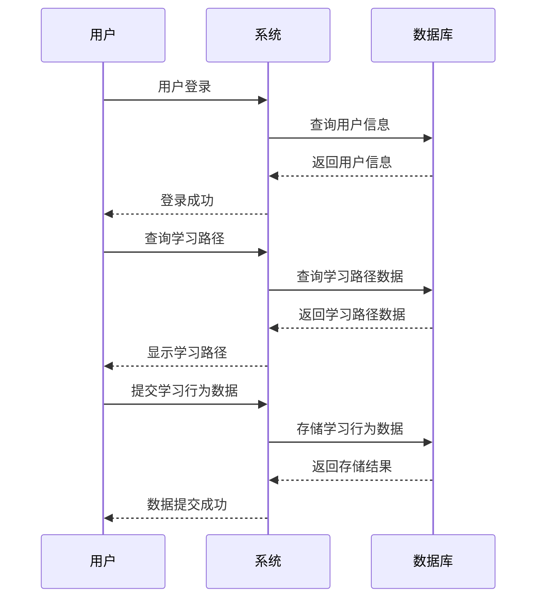

                 

### 第一部分：引言

#### 1.1 问题的背景与重要性

在信息化和数字化迅速发展的时代，教育个性化已经成为教育领域的重要趋势。传统的“一刀切”教育模式已经无法满足每个学生独特的学习需求和能力。教育个性化旨在根据每个学生的认知特点、学习习惯和兴趣，量身定制个性化的学习路径和教学方法，从而提高学习效率和教育质量。

强化学习（Reinforcement Learning，RL）作为一种先进的人工智能技术，在个性化教育中具有巨大的应用潜力。强化学习通过智能体与环境的交互，不断学习并优化策略，以实现目标。在个性化教育中，强化学习可以用来识别和预测学生的学习行为，自动调整教学策略，优化学习路径。

然而，实现教育个性化强化学习面临诸多挑战，如如何建立有效的学习路径优化模型，如何处理大量的学生数据，以及如何保证算法的效率和鲁棒性等。因此，本文旨在探讨教育个性化强化学习中的学习路径优化问题，通过数学优化方法，为构建有效的个性化教育系统提供理论和技术支持。

#### 1.2 教育个性化的基本概念

##### 1.2.1 个性化教育的定义与目的

个性化教育是指根据每个学生的特点，提供个性化的学习资源和教学方法，以最大化每个学生的潜力。个性化教育的核心目标是满足每个学生的学习需求，提高学习效果，同时激发学生的内在兴趣和自主学习能力。

与传统教育模式相比，个性化教育具有以下特点：

1. **学生中心**：个性化教育以学生为中心，关注每个学生的个性差异，而不是统一的教学标准。
2. **定制化**：根据学生的认知特点、兴趣和能力，提供个性化的学习内容和路径。
3. **动态调整**：教学策略和学习路径可以根据学生的学习状态和进展进行动态调整，实现实时个性化。
4. **数据驱动**：个性化教育依赖于大量学生数据的收集和分析，以支持教学决策。

##### 1.2.2 个性化学习的关键要素

个性化学习的关键要素包括以下几个方面：

1. **学生数据**：包括学生的成绩、学习习惯、兴趣爱好、心理状态等，是制定个性化教学策略的基础。
2. **学习路径**：根据学生特点和学习需求，设计的个性化学习路线和顺序，是实现个性化教育的重要手段。
3. **教学资源**：包括教材、课件、习题、视频等多种形式的资源，是支持个性化学习的基础。
4. **教学策略**：根据学生数据和学习路径，设计的个性化教学方法和手段，如互动式教学、个性化辅导等。
5. **反馈机制**：通过收集学生的反馈，对教学效果进行评估和调整，以不断优化个性化教育过程。

##### 1.2.3 个性化学习的方法与工具

实现个性化学习的方法和工具主要包括以下几个方面：

1. **数据挖掘与数据分析**：通过数据挖掘和数据分析，提取学生数据中的关键信息，为个性化学习提供依据。
2. **智能推荐系统**：利用协同过滤、基于内容的推荐等技术，为学生推荐个性化的学习资源和课程。
3. **自适应学习平台**：提供个性化的学习界面和功能，支持学生自主选择学习内容和路径。
4. **虚拟现实（VR）与增强现实（AR）**：通过VR和AR技术，提供沉浸式的学习体验，提高学习效果。
5. **学习分析系统**：实时收集和分析学生的学习数据，为教学决策提供支持。

#### 1.3 强化学习的理论基础

##### 1.3.1 强化学习的基本原理

强化学习（Reinforcement Learning，RL）是一种机器学习范式，旨在通过智能体（Agent）与环境（Environment）的交互，学习到一种策略（Policy），以最大化累积奖励（Reward）。强化学习的基本原理包括以下几个方面：

1. **智能体**：执行动作并从环境中获取反馈的实体，可以是机器人、软件代理等。
2. **环境**：智能体执行动作的场所，可以看作一个状态空间和奖励函数的集合。
3. **状态**：描述智能体所处环境的特征，通常用一个状态向量表示。
4. **动作**：智能体在某个状态下可以选择的行为，通常用一个动作空间表示。
5. **奖励**：智能体执行动作后，从环境中获得的即时奖励或惩罚，用于评估动作的好坏。

强化学习过程可以分为以下几个阶段：

1. **初始阶段**：智能体随机或根据预先设定的策略进行动作，探索环境。
2. **学习阶段**：智能体通过观察环境反馈，不断调整策略，以最大化累积奖励。
3. **执行阶段**：智能体根据学习到的策略进行动作，实现预期目标。

##### 1.3.2 强化学习的主要算法

强化学习算法种类繁多，以下介绍几种主要算法：

1. **值函数方法**：通过学习值函数来评估状态或状态-动作对的价值，从而选择最优动作。主要算法包括Q-Learning、Sarsa等。
2. **策略搜索方法**：直接优化策略，使策略在所有可能的状态下都能获得最大奖励。主要算法包括Policy Gradient、Actor-Critic等。
3. **基于模型的强化学习**：利用模型预测环境状态转移和奖励，指导智能体进行动作。主要算法包括马尔可夫决策过程（MDP）、深度强化学习（Deep RL）等。

##### 1.3.3 强化学习在教育个性化中的适用性

强化学习在教育个性化中的应用具有以下几个特点：

1. **适应性**：强化学习可以根据学生的实时反馈和学习行为，动态调整教学策略和学习路径，实现个性化教学。
2. **互动性**：强化学习强调智能体与环境的交互，有助于提高学生的学习参与度和积极性。
3. **可扩展性**：强化学习算法可以处理复杂的教育场景，支持多学科、多层次的个性化教育需求。
4. **鲁棒性**：强化学习算法具有较好的鲁棒性，能够应对学生数据的不完整和噪声。

#### 1.4 学习路径优化的数学模型

##### 1.4.1 数学模型的基础知识

学习路径优化问题可以看作一个数学优化问题，涉及目标函数、约束条件和优化算法。以下介绍一些基础概念：

1. **目标函数**：衡量学习路径优劣的指标，可以是学习效果、时间效率、学生满意度等。
2. **约束条件**：限制学习路径选择的条件，如课程先修要求、学生时间安排等。
3. **优化算法**：用于求解数学优化问题的算法，如线性规划、遗传算法、粒子群优化等。

##### 1.4.2 学习路径优化问题的数学表述

学习路径优化问题可以表述为一个数学规划问题，如下：

$$
\min_{x} f(x) \\
s.t. g_i(x) \leq 0, \quad h_j(x) = 0
$$

其中，$x$表示学习路径，$f(x)$为目标函数，$g_i(x)$和$h_j(x)$分别为约束条件。

具体来说：

1. **目标函数**：$f(x)$可以是学生成绩、学习时间、学生满意度等指标，通过优化目标函数，提高学习效果和效率。
2. **约束条件**：
    - $g_i(x) \leq 0$：表示学习路径中必须满足的先修要求、时间安排等限制条件。
    - $h_j(x) = 0$：表示学习路径中必须满足的平衡要求、课程难度等约束条件。

##### 1.4.3 学习路径优化问题的解决策略

解决学习路径优化问题的策略包括以下几种：

1. **线性规划**：适用于目标函数和约束条件均为线性函数的优化问题，可以通过求解线性方程组得到最优解。
2. **遗传算法**：适用于目标函数和约束条件较为复杂的优化问题，通过模拟生物进化过程，实现全局搜索。
3. **粒子群优化**：适用于目标函数和约束条件较为简单的优化问题，通过模拟鸟群觅食过程，实现全局搜索。
4. **混合算法**：结合多种优化算法的优势，提高优化效果和效率。

#### 1.5 研究方法与数据集

##### 1.5.1 研究方法的选择

本文采用以下研究方法：

1. **理论研究**：通过对教育个性化强化学习的相关理论进行深入分析，探讨学习路径优化的数学模型和算法。
2. **实证研究**：通过构建实际教育场景，收集学生数据，验证学习路径优化算法的效果和可行性。
3. **算法实现**：利用Python等编程语言，实现强化学习算法和学习路径优化模型，进行算法验证和优化。

##### 1.5.2 数据集的收集与预处理

数据集的收集和预处理是本文研究的核心工作之一。具体步骤如下：

1. **数据收集**：从学校、教育平台等渠道收集学生成绩、学习行为、课程设置等数据。
2. **数据预处理**：对收集到的数据进行分析和处理，包括数据清洗、特征提取等，为后续算法实现提供数据支持。

##### 1.5.3 数据集的特征提取

特征提取是学习路径优化的重要环节，以下介绍几种常用的特征提取方法：

1. **学生特征**：包括成绩、学习习惯、兴趣爱好、心理状态等，用于描述学生的个性化需求。
2. **课程特征**：包括课程难度、学分、授课教师等，用于描述课程的教学质量。
3. **交互特征**：包括学生与课程之间的互动次数、学习时长等，用于描述学生与课程之间的互动情况。

##### 1.6 本章小结

本章介绍了教育个性化强化学习的研究背景和重要性，详细阐述了教育个性化的基本概念、强化学习的理论基础、学习路径优化的数学模型以及研究方法与数据集。下一章将深入探讨强化学习算法在教育个性化中的应用，以及各种算法的原理和实现。

### 第二部分：强化学习算法与教育个性化

#### 2.1 Q-learning算法

##### 2.1.1 Q-learning算法原理

Q-learning是一种值函数方法，通过不断更新值函数来逼近最优策略。其基本思想是：在某个状态下，选择当前最优动作，并更新值函数，以期望在未来获得更大的累积奖励。

Q-learning算法的核心方程如下：

$$
Q(s, a) \leftarrow Q(s, a) + \alpha [r + \gamma \max_{a'} Q(s', a') - Q(s, a)]
$$

其中，$Q(s, a)$表示在状态$s$下执行动作$a$的值函数，$r$表示即时奖励，$\gamma$表示折扣因子，$\alpha$表示学习率。

##### 2.1.2 Q-learning算法的数学模型

Q-learning算法的数学模型可以表示为一个五元组：

$$
M = \langle S, A, R, \gamma, \alpha \rangle
$$

其中，$S$表示状态空间，$A$表示动作空间，$R$表示奖励函数，$\gamma$表示折扣因子，$\alpha$表示学习率。

具体来说：

1. **状态空间$S$**：描述智能体可能处于的所有状态，如学生的学习状态、课程难度等。
2. **动作空间$A$**：描述智能体在某个状态下可以执行的所有动作，如选择课程、复习等。
3. **奖励函数$R$**：描述智能体执行某个动作后从环境中获得的即时奖励，如考试成绩、学习时长等。
4. **折扣因子$\gamma$**：用于平衡当前奖励和未来奖励的关系，通常取值在$0$到$1$之间。
5. **学习率$\alpha$**：用于调整值函数的更新速度，通常取值在$0$到$1$之间。

##### 2.1.3 Q-learning算法的Python实现

以下是一个简单的Q-learning算法Python实现示例：

```python
import numpy as np

# 参数设置
alpha = 0.1
gamma = 0.9
learning_rate = 0.1

# 初始化Q值表
q_table = np.zeros((n_states, n_actions))

# Q-learning算法
for episode in range(n_episodes):
    state = env.reset()
    done = False
    
    while not done:
        action = np.argmax(q_table[state])
        next_state, reward, done = env.step(action)
        
        q_table[state, action] = q_table[state, action] + alpha * (reward + gamma * np.max(q_table[next_state]) - q_table[state, action])
        
        state = next_state

# 打印Q值表
print(q_table)
```

在这个示例中，我们使用了一个简单的环境，通过不断更新Q值表，使智能体逐渐学会在各个状态选择最优动作。

#### 2.2 Sarsa算法

##### 2.2.1 Sarsa算法原理

Sarsa（State-Action-Reward-State-Action）是一种基于策略的方法，它与Q-learning类似，但在更新值函数时考虑了下一个动作的影响。Sarsa算法的基本方程如下：

$$
Q(s, a) \leftarrow Q(s, a) + \alpha [r + \gamma Q(s', a') - Q(s, a)]
$$

其中，$s'$和$a'$分别表示下一个状态和动作。

##### 2.2.2 Sarsa算法的数学模型

Sarsa算法的数学模型与Q-learning类似，也是由一个五元组表示：

$$
M = \langle S, A, R, \gamma, \alpha \rangle
$$

不同的是，Sarsa算法在更新值函数时，考虑了下一个动作的影响。

##### 2.2.3 Sarsa算法的Python实现

以下是一个简单的Sarsa算法Python实现示例：

```python
import numpy as np

# 参数设置
alpha = 0.1
gamma = 0.9
learning_rate = 0.1

# 初始化Q值表
q_table = np.zeros((n_states, n_actions))

# Sarsa算法
for episode in range(n_episodes):
    state = env.reset()
    done = False
    
    while not done:
        action = np.random.choice(n_actions)
        next_state, reward, done = env.step(action)
        
        q_table[state, action] = q_table[state, action] + alpha * (reward + gamma * q_table[next_state, np.argmax(q_table[next_state])] - q_table[state, action])
        
        state = next_state

# 打印Q值表
print(q_table)
```

在这个示例中，我们使用了一个随机策略，通过不断更新Q值表，使智能体逐渐学会在各个状态选择最优动作。

#### 2.3 Deep Q-Networks (DQN)

##### 2.3.1 DQN算法原理

Deep Q-Networks（DQN）是深度强化学习的一种算法，它利用深度神经网络（DNN）来近似值函数。DQN算法的核心思想是：通过训练DNN，使其能够预测在某个状态下执行某个动作的Q值，从而选择最优动作。

DQN算法的基本方程与Q-learning算法相同，但使用了DNN来近似值函数：

$$
Q(s, a) \leftarrow Q(s, a) + \alpha [r + \gamma \max_{a'} \hat{Q}(s', a') - Q(s, a)]
$$

其中，$\hat{Q}(s', a')$表示DNN预测的Q值。

##### 2.3.2 DQN算法的数学模型

DQN算法的数学模型可以表示为一个六元组：

$$
M = \langle S, A, R, \gamma, \alpha, \theta \rangle
$$

其中，$\theta$表示DNN的参数。

具体来说：

1. **状态空间$S$**：描述智能体可能处于的所有状态，如学生的学习状态、课程难度等。
2. **动作空间$A$**：描述智能体在某个状态下可以执行的所有动作，如选择课程、复习等。
3. **奖励函数$R$**：描述智能体执行某个动作后从环境中获得的即时奖励，如考试成绩、学习时长等。
4. **折扣因子$\gamma$**：用于平衡当前奖励和未来奖励的关系，通常取值在$0$到$1$之间。
5. **学习率$\alpha$**：用于调整值函数的更新速度，通常取值在$0$到$1$之间。
6. **DNN参数$\theta$**：用于描述DNN的结构和权重。

##### 2.3.3 DQN算法的Python实现

以下是一个简单的DQN算法Python实现示例：

```python
import numpy as np
import tensorflow as tf

# 参数设置
alpha = 0.1
gamma = 0.9
learning_rate = 0.1
epsilon = 0.1

# 初始化DNN模型
input_layer = tf.keras.layers.Input(shape=(n_states,))
dense_layer = tf.keras.layers.Dense(n_actions, activation='linear')(input_layer)
output_layer = tf.keras.layers.Activation('linear')(dense_layer)

model = tf.keras.Model(inputs=input_layer, outputs=output_layer)

# DQN算法
for episode in range(n_episodes):
    state = env.reset()
    done = False
    
    while not done:
        action = env.sample_action(epsilon)
        next_state, reward, done = env.step(action)
        
        target = reward + gamma * np.max(model.predict(next_state))
        model.fit(state, target, epochs=1)
        
        state = next_state

# 打印DNN模型参数
print(model.get_weights())
```

在这个示例中，我们使用了一个简单的环境，通过训练DNN模型，使智能体逐渐学会在各个状态选择最优动作。

#### 2.4 Policy Gradient算法

##### 2.4.1 Policy Gradient算法原理

Policy Gradient（PG）是一种直接优化策略的强化学习算法。它的基本思想是：通过更新策略参数，使策略在所有可能的状态下都能获得最大奖励。

Policy Gradient算法的核心方程如下：

$$
\theta \leftarrow \theta + \alpha \nabla_{\theta} J(\theta)
$$

其中，$\theta$表示策略参数，$J(\theta)$表示策略的期望奖励。

##### 2.4.2 Policy Gradient算法的数学模型

Policy Gradient算法的数学模型可以表示为一个四元组：

$$
M = \langle S, A, \pi(\theta), R \rangle
$$

其中，$\pi(\theta)$表示策略。

具体来说：

1. **状态空间$S$**：描述智能体可能处于的所有状态，如学生的学习状态、课程难度等。
2. **动作空间$A$**：描述智能体在某个状态下可以执行的所有动作，如选择课程、复习等。
3. **策略$\pi(\theta)$**：描述智能体在各个状态下选择动作的概率分布。
4. **奖励函数$R$**：描述智能体执行某个动作后从环境中获得的即时奖励，如考试成绩、学习时长等。

##### 2.4.3 Policy Gradient算法的Python实现

以下是一个简单的Policy Gradient算法Python实现示例：

```python
import numpy as np

# 参数设置
alpha = 0.1
learning_rate = 0.1

# 初始化策略参数
theta = np.random.rand(n_actions)

# Policy Gradient算法
for episode in range(n_episodes):
    state = env.reset()
    done = False
    
    while not done:
        action = np.random.choice(n_actions, p=theta)
        next_state, reward, done = env.step(action)
        
        theta = theta + alpha * reward * np.random.randn(n_actions)
        
        state = next_state

# 打印策略参数
print(theta)
```

在这个示例中，我们使用了一个简单的环境，通过更新策略参数，使智能体逐渐学会在各个状态选择最优动作。

#### 2.5 强化学习算法在教育个性化中的应用案例

##### 2.5.1 案例一：个性化作业推荐系统

个性化作业推荐系统是一种基于强化学习的教育个性化应用。系统通过分析学生的作业完成情况、考试成绩等数据，利用强化学习算法，为学生推荐个性化的作业。

具体应用步骤如下：

1. **数据收集**：收集学生的作业完成情况、考试成绩等数据，用于训练强化学习模型。
2. **模型训练**：使用Q-learning或Policy Gradient算法，训练个性化作业推荐模型。
3. **系统实现**：构建个性化作业推荐系统，根据学生的实时数据，动态调整推荐策略。
4. **效果评估**：通过实验验证个性化作业推荐系统的效果，包括作业完成率、考试成绩等。

##### 2.5.2 案例二：自适应教学系统

自适应教学系统是一种基于强化学习的教育个性化应用。系统通过分析学生的行为数据，利用强化学习算法，自动调整教学策略，实现个性化教学。

具体应用步骤如下：

1. **数据收集**：收集学生的行为数据，如学习时长、学习进度等，用于训练强化学习模型。
2. **模型训练**：使用Sarsa或DQN算法，训练自适应教学模型。
3. **系统实现**：构建自适应教学系统，根据学生的实时数据，动态调整教学策略。
4. **效果评估**：通过实验验证自适应教学系统的效果，包括学习效果、学生满意度等。

##### 2.5.3 案例三：学习路径优化系统

学习路径优化系统是一种基于强化学习的教育个性化应用。系统通过分析学生的数据，利用强化学习算法，优化学习路径，提高学习效果。

具体应用步骤如下：

1. **数据收集**：收集学生的成绩、学习行为等数据，用于训练强化学习模型。
2. **模型训练**：使用Q-learning或Policy Gradient算法，训练学习路径优化模型。
3. **系统实现**：构建学习路径优化系统，根据学生的实时数据，动态调整学习路径。
4. **效果评估**：通过实验验证学习路径优化系统的效果，包括学习效果、时间效率等。

#### 2.6 本章小结

本章介绍了强化学习算法在教育个性化中的应用，包括Q-learning、Sarsa、DQN和Policy Gradient等算法的原理和实现。通过这些算法，可以构建个性化作业推荐系统、自适应教学系统和学习路径优化系统，提高教育个性化水平。下一章将深入探讨数学优化方法在学习路径设计中的应用。

### 第三部分：数学优化方法与学习路径设计

#### 3.1 数学优化基本概念

数学优化是解决最优化问题的方法，其核心是寻找在一定约束条件下，能够最大化或最小化目标函数的解。数学优化在各个领域都有着广泛的应用，包括工业生产、金融投资、交通运输、资源分配等。在本章节中，我们将重点关注数学优化在教育个性化中的应用，特别是在学习路径设计方面。

##### 3.1.1 优化问题的定义

一个优化问题通常可以表示为以下形式：

$$
\min_{x} f(x) \\
s.t. g_i(x) \leq 0, \quad h_j(x) = 0
$$

其中，$x$是决策变量，$f(x)$是目标函数，$g_i(x)$和$h_j(x)$分别是约束条件。目标函数$f(x)$是我们希望最大化或最小化的函数，约束条件$g_i(x) \leq 0$和$h_j(x) = 0$描述了决策变量$x$的取值范围和限制。

##### 3.1.2 优化目标函数

优化目标函数是优化问题的核心，它反映了我们希望达到的目标。在教育个性化中，优化目标函数可以包括以下几种：

1. **学习效果最大化**：通过优化学习路径，提高学生的学习成绩和掌握程度。
2. **时间效率最大化**：在满足学习效果的前提下，最小化学习所需的时间。
3. **资源利用最大化**：优化课程安排，最大限度地利用教学资源。
4. **学生满意度最大化**：通过优化学习路径，提高学生对教学过程的满意度。

##### 3.1.3 优化算法分类

优化算法可以根据其搜索策略和优化目标的不同，分为多种类型。以下介绍几种常见的优化算法：

1. **梯度下降法**：基于目标函数的梯度信息，逐步调整决策变量，以达到最优解。适用于目标函数可导的情况。
2. **无梯度优化算法**：不依赖于目标函数的梯度信息，如遗传算法、模拟退火算法等。适用于目标函数非凸或不可导的情况。
3. **动态规划**：通过递归关系，将复杂的最优化问题分解为一系列相对简单的子问题，逐步求解得到全局最优解。
4. **凸优化算法**：专门用于解决凸优化问题，如拉格朗日松弛法、内点法等。凸优化算法具有较好的理论和计算性能。

##### 3.1.4 学习路径优化问题的特殊性质

学习路径优化问题具有以下特殊性质：

1. **动态性**：学习路径不是静态的，而是随着学生的学习进度和需求不断调整。
2. **多目标性**：学习路径优化需要同时考虑学习效果、时间效率、资源利用等多个目标。
3. **不确定性**：学生的学习行为和教学环境存在一定的随机性和不确定性。
4. **实时性**：优化过程需要实时响应学生的反馈和学习状态，动态调整学习路径。

这些特殊性质对优化算法的选择和设计提出了挑战，需要考虑算法的适应性、鲁棒性和效率。

#### 3.2 学习路径设计的数学模型

##### 3.2.1 学习路径设计问题建模

学习路径设计问题可以看作一个多目标优化问题，其目标是根据学生的个性化需求，设计一个最优的学习路径。具体来说，我们可以将学习路径设计问题建模为一个多目标优化问题，如下所示：

$$
\min_{x} f(x) \\
s.t. g_i(x) \leq 0, \quad h_j(x) = 0
$$

其中，$x$表示学习路径，$f(x)$为多目标函数，$g_i(x)$和$h_j(x)$为约束条件。

具体来说：

1. **目标函数$f(x)$**：可以包括以下几部分：
    - **学习效果**：如学生的成绩、考试通过率等。
    - **时间效率**：如完成学习任务所需的时间、课程的学习时间等。
    - **资源利用**：如课程资源的分配、教师的教学负担等。
    - **学生满意度**：如学生对学习过程的满意度、学习兴趣等。

2. **约束条件$g_i(x) \leq 0$和$h_j(x) = 0$**：
    - **先修要求**：某些课程之间存在先修关系，需要满足。
    - **时间安排**：学生的课程安排需要符合时间表限制。
    - **课程容量**：某些课程有最大容量限制。
    - **个性化需求**：如学生的兴趣、能力等个性化需求。

##### 3.2.2 学习路径优化目标函数

学习路径优化目标函数的设计是整个优化问题的关键，它需要综合考虑多个目标，并通过权重分配实现多目标优化。以下是一个简单示例：

$$
f(x) = w_1 \cdot \text{学习效果} + w_2 \cdot \text{时间效率} + w_3 \cdot \text{资源利用} + w_4 \cdot \text{学生满意度}
$$

其中，$w_1, w_2, w_3, w_4$分别为学习效果、时间效率、资源利用和学生满意度的权重。

1. **学习效果**：可以用学生的考试成绩、课程掌握度等指标来衡量。
2. **时间效率**：可以计算完成学习任务所需的总时间，并考虑课程的难易程度进行加权。
3. **资源利用**：可以根据课程的资源消耗（如教师时间、教学材料等）来评估。
4. **学生满意度**：可以通过问卷调查、学生反馈等方式收集。

##### 3.2.3 学习路径优化约束条件

学习路径优化问题的约束条件主要包括以下几方面：

1. **先修要求**：某些课程需要先修课程完成才能学习。
    - 约束方程：$g_1(x) = \sum_{i \in \text{先修课程}} x_i - 1 \leq 0$

2. **时间安排**：需要满足学生的课程安排表，不能发生冲突。
    - 约束方程：$g_2(x) = \sum_{i \in \text{冲突课程}} x_i \leq 1$

3. **课程容量**：某些课程有最大容量限制。
    - 约束方程：$g_3(x) = \sum_{i \in \text{课程}} x_i \leq \text{课程容量}$

4. **个性化需求**：根据学生的个性化需求，如兴趣、能力等。
    - 约束方程：$g_4(x) = \text{个性化需求} \leq 0$

#### 3.3 模式搜索算法

##### 3.3.1 模式搜索算法原理

模式搜索（Pattern Search，PS）算法是一种无梯度优化算法，适用于非光滑和非凸优化问题。其基本思想是通过搜索局部最优模式，逐步改善解的质量。

模式搜索算法的主要步骤如下：

1. **初始化**：选择一个初始解，生成一组初始模式。
2. **搜索模式**：根据模式扰动规则，生成新的候选解。
3. **评估**：计算候选解的目标函数值，选择最优解。
4. **更新**：将最优解作为新的初始解，重复搜索过程。

##### 3.3.2 模式搜索算法的数学模型

模式搜索算法的数学模型可以表示为以下方程：

$$
x_{k+1} = x_k + \delta_k \\
\delta_k = \alpha_k \cdot \sum_{j=1}^{N} p_j
$$

其中，$x_k$是第$k$次迭代的解，$\delta_k$是解的扰动方向，$\alpha_k$是扰动步长，$p_j$是第$j$个模式。

具体来说：

1. **模式生成**：模式是通过历史迭代过程中的最优解和当前解之间的差异生成的。
2. **扰动步长**：扰动步长通过模式生成函数和自适应调整策略确定。

##### 3.3.3 模式搜索算法在Python中的实现

以下是一个简单的模式搜索算法Python实现示例：

```python
import numpy as np

# 参数设置
alpha = 0.1
N = 5  # 模式数量

# 初始化解
x = np.random.rand(d)  # d维空间

# 模式搜索算法
for k in range(max_iter):
    # 计算模式
    p = np.zeros(d)
    for j in range(N):
        p += alpha * (x - x_best)  # x_best为历史最优解
    
    # 更新解
    x_new = x + p
    if f(x_new) < f(x):
        x = x_new

# 打印最优解
print(x)
```

在这个示例中，我们使用了一个简单的目标函数$f(x)$，通过模式搜索算法逐步优化解$x$。

##### 3.4.1 遗传算法原理

遗传算法（Genetic Algorithm，GA）是一种基于自然选择和遗传机制启发式的全局搜索算法。其基本思想是通过模拟生物进化过程，逐步优化解的质量。

遗传算法的主要步骤如下：

1. **初始化种群**：生成一组随机解作为初始种群。
2. **适应度评估**：计算每个解的适应度值，适应度值越高，表示解的质量越好。
3. **选择**：根据适应度值，选择优秀的解作为父代。
4. **交叉**：通过交叉操作，生成新的子代。
5. **变异**：对子代进行变异操作，增加解的多样性。
6. **更新种群**：将子代替换父代，形成新的种群。

##### 3.4.2 遗传算法的数学模型

遗传算法的数学模型可以表示为以下方程：

$$
x_{k+1} = x_k + \delta_k \\
\delta_k = \alpha_k \cdot \sum_{j=1}^{N} p_j
$$

其中，$x_k$是第$k$次迭代的解，$\delta_k$是解的扰动方向，$\alpha_k$是扰动步长，$p_j$是第$j$个模式。

具体来说：

1. **种群初始化**：通过随机生成一组解作为初始种群。
2. **适应度评估**：计算每个解的适应度值，适应度值通常与目标函数值成反比。
3. **选择**：采用选择策略（如轮盘赌、排名选择等）选择适应度较高的解作为父代。
4. **交叉**：通过交叉操作，生成新的子代，交叉概率通常设定为一定的常数。
5. **变异**：对子代进行变异操作，变异概率通常设定为一定的常数。

##### 3.4.3 遗传算法在Python中的实现

以下是一个简单的遗传算法Python实现示例：

```python
import numpy as np

# 参数设置
N = 100  # 种群大小
d = 10  # 解的维度
max_iter = 100  # 迭代次数
cross_prob = 0.8  # 交叉概率
mut_prob = 0.1  # 变异概率

# 初始化种群
pop = np.random.rand(N, d)

# 适应度函数
def fitness(x):
    # 这里以目标函数为-x^2为例
    return -sum(x**2)

# 遗传算法
for k in range(max_iter):
    # 适应度评估
    fitness_values = np.array([fitness(x) for x in pop])
    
    # 选择
    selected = np.random.choice(N, size=N, p=fitness_values/fitness_values.sum())
    
    # 交叉
    for i in range(0, N, 2):
        if np.random.rand() < cross_prob:
            crossover_point = np.random.randint(1, d-1)
            child1 = np.concatenate((pop[selected[i], :crossover_point], pop[selected[i+1], crossover_point:]))
            child2 = np.concatenate((pop[selected[i+1], :crossover_point], pop[selected[i], crossover_point:]))
            pop[selected[i], :], pop[selected[i+1], :] = child1, child2
    
    # 变异
    for i in range(N):
        if np.random.rand() < mut_prob:
            mutation_point = np.random.randint(d)
            pop[i, mutation_point] = np.random.rand()
    
    # 更新种群
    pop = pop[selected]

# 打印最优解
best_idx = np.argmax(fitness_values)
best_solution = pop[best_idx]
print(best_solution)
```

在这个示例中，我们使用了一个简单的适应度函数，通过遗传算法逐步优化解的质量。

#### 3.5 学习路径优化案例分析

##### 3.5.1 案例一：高中数学学习路径优化

在这个案例中，我们将使用模式搜索算法对高中数学学习路径进行优化。假设学生需要在有限的时间内完成一系列数学课程，并希望达到最佳的学习效果。

1. **目标函数**：学习效果可以表示为学生在各门数学课程中的考试成绩。时间效率可以表示为完成所有课程所需的时间。资源利用可以表示为教师的授课时间。学生满意度可以表示为学生对课程安排的满意度。

2. **约束条件**：包括课程先修要求、时间表冲突、课程容量限制等。

3. **优化过程**：
    - 初始化解空间，随机生成一系列可能的课程安排。
    - 计算每个解的适应度值，适应度值越高，表示解的质量越好。
    - 使用模式搜索算法逐步优化解的空间，搜索局部最优解。
    - 根据优化结果，生成最优的学习路径。

##### 3.5.2 案例二：编程学习路径优化

在这个案例中，我们将使用遗传算法对编程学习路径进行优化。假设学生需要在有限的时间内学习一系列编程语言和框架，并希望达到最佳的学习效果。

1. **目标函数**：学习效果可以表示为学生在各项编程任务中的完成情况。时间效率可以表示为学习所需的时间。资源利用可以表示为学习资源的消耗。学生满意度可以表示为学生对学习过程的满意度。

2. **约束条件**：包括课程先修要求、时间表冲突、学习资源限制等。

3. **优化过程**：
    - 初始化种群，生成一系列可能的课程组合。
    - 计算每个解的适应度值，适应度值越高，表示解的质量越好。
    - 使用遗传算法逐步优化种群，搜索全局最优解。
    - 根据优化结果，生成最优的学习路径。

##### 3.5.3 案例三：跨学科学习路径优化

在这个案例中，我们将使用混合优化算法对跨学科学习路径进行优化。假设学生需要在有限的时间内学习数学、物理、计算机科学等多个学科的知识，并希望达到最佳的学习效果。

1. **目标函数**：学习效果可以表示为学生在各门学科中的掌握程度。时间效率可以表示为学习所需的时间。资源利用可以表示为学习资源的消耗。学生满意度可以表示为学生对学习过程的满意度。

2. **约束条件**：包括课程先修要求、时间表冲突、课程容量限制等。

3. **优化过程**：
    - 初始化解空间，随机生成一系列可能的课程安排。
    - 计算每个解的适应度值，适应度值越高，表示解的质量越好。
    - 使用混合优化算法（结合模式搜索和遗传算法），逐步优化解的空间，搜索局部和全局最优解。
    - 根据优化结果，生成最优的学习路径。

#### 3.6 本章小结

本章介绍了数学优化方法的基本概念和原理，包括优化问题的定义、目标函数、约束条件和优化算法分类。在此基础上，我们探讨了学习路径优化问题的特殊性质，并介绍了模式搜索算法和遗传算法在优化学习路径设计中的应用。通过案例分析，我们展示了如何使用优化算法为教育个性化提供有效的解决方案。下一章将深入探讨系统架构设计与实现。

### 3.6 系统架构设计与实现

#### 3.6.1 整体架构设计

为了实现学习路径优化的系统，我们首先需要设计一个合理的系统架构。系统架构设计的目标是确保系统具有良好的可扩展性、高可用性和易维护性。以下是一个可能的整体架构设计：

1. **数据层**：包括数据存储和数据预处理模块。数据存储用于存储学生信息、课程数据、学习行为数据等。数据预处理模块负责对原始数据进行分析和清洗，提取出有效的特征信息。

2. **服务层**：包括优化算法模块和推荐系统模块。优化算法模块负责实现各种数学优化算法，如模式搜索、遗传算法等，用于生成最优的学习路径。推荐系统模块基于用户行为数据，为学生推荐个性化的学习资源和课程。

3. **应用层**：包括用户界面和应用逻辑。用户界面用于展示系统功能和用户交互，应用逻辑负责处理用户请求，调用服务层模块的功能，生成学习路径推荐。

4. **接口层**：提供与外部系统的接口，如学生管理系统、课程管理系统等，实现数据的交换和共享。

#### 3.6.2 系统功能设计

系统功能设计是系统架构设计的重要组成部分。以下是一个可能的功能设计：

1. **用户管理**：包括用户注册、登录、信息维护等功能。

2. **数据管理**：包括数据导入、数据清洗、数据存储、数据查询等功能。

3. **学习路径优化**：包括优化算法选择、学习路径生成、学习路径展示等功能。

4. **推荐系统**：包括推荐算法选择、推荐结果生成、推荐结果展示等功能。

5. **系统监控**：包括系统运行状态监控、性能监控、故障报警等功能。

#### 3.6.3 系统架构设计

以下是一个可能的系统架构设计，使用Mermaid绘制：

```mermaid
graph TB
    subgraph 数据层
        数据存储 --> 数据预处理
    end

    subgraph 服务层
        优化算法模块 --> 推荐系统模块
    end

    subgraph 应用层
        用户管理 --> 应用逻辑
        数据管理 --> 应用逻辑
        学习路径优化 --> 应用逻辑
        推荐系统 --> 应用逻辑
    end

    subgraph 接口层
        外部系统 --> 接口层
    end

    数据层 --> 服务层
    服务层 --> 应用层
    应用层 --> 接口层
```

#### 3.6.4 系统接口设计与交互

系统接口设计是确保系统与其他外部系统有效交互的关键。以下是一个可能的接口设计：

1. **用户接口**：提供用户注册、登录、数据查询等接口，使用HTTP/RESTful接口协议。

2. **服务接口**：提供数据导入、数据清洗、数据存储等接口，使用内部服务接口协议。

3. **推荐接口**：提供推荐算法调用、推荐结果获取等接口，使用内部服务接口协议。

4. **监控接口**：提供系统状态监控、性能监控等接口，使用内部服务接口协议。

以下是一个可能的系统交互序列图，使用Mermaid绘制：



#### 3.6.5 系统实现与部署

系统实现与部署是确保系统能够正常运行的关键步骤。以下是一个可能的实现与部署流程：

1. **开发阶段**：
    - 使用Python和相关的数据分析和机器学习库（如NumPy、Scikit-learn、TensorFlow等）开发系统功能模块。
    - 使用Flask或Django等Web框架开发用户界面和应用逻辑。
    - 使用PostgreSQL或MongoDB等数据库管理系统进行数据存储和管理。

2. **测试阶段**：
    - 进行单元测试、集成测试和系统测试，确保系统的各个模块和功能正常运行。
    - 使用性能测试工具评估系统的性能，优化系统架构和代码。

3. **部署阶段**：
    - 使用Docker容器化技术，将开发好的系统打包成容器镜像。
    - 使用Kubernetes进行容器编排，部署和管理系统。
    - 使用Nginx等Web服务器，对外提供服务接口。

4. **运维阶段**：
    - 监控系统运行状态，确保系统的高可用性。
    - 定期进行系统升级和优化，保持系统的稳定性和安全性。

#### 3.6.6 系统实现案例

以下是一个简单的系统实现案例：

```python
# 使用Flask创建用户接口
from flask import Flask, request, jsonify

app = Flask(__name__)

# 用户登录接口
@app.route('/login', methods=['POST'])
def login():
    username = request.form['username']
    password = request.form['password']
    # 验证用户名和密码
    # ...
    return jsonify({'status': 'success'})

# 查询学习路径接口
@app.route('/learning_path', methods=['GET'])
def learning_path():
    user_id = request.args.get('user_id')
    # 查询学习路径
    # ...
    return jsonify({'learning_path': path})

# 提交学习行为数据接口
@app.route('/submit_learning_data', methods=['POST'])
def submit_learning_data():
    user_id = request.form['user_id']
    data = request.form['data']
    # 存储学习行为数据
    # ...
    return jsonify({'status': 'success'})

if __name__ == '__main__':
    app.run()
```

在这个案例中，我们使用Flask框架创建了一个简单的用户接口，包括用户登录、查询学习路径和提交学习行为数据等功能。这些接口通过HTTP/RESTful协议与其他系统进行交互。

#### 3.6.7 本章小结

本章介绍了教育个性化强化学习系统的架构设计、功能设计、接口设计以及系统实现与部署。通过合理的系统架构设计和实现，我们可以为教育个性化提供有效的技术支持。下一章将探讨实际案例，展示系统在实际应用中的效果和挑战。

### 第四部分：项目实战

#### 4.1 环境安装与配置

在进行强化学习算法与教育个性化学习路径优化的项目实战之前，我们需要首先安装和配置必要的软件和工具。以下是一个基本的安装和配置步骤：

1. **Python环境**：确保安装了Python 3.7或更高版本。可以从[Python官网](https://www.python.org/)下载并安装。

2. **Anaconda**：推荐使用Anaconda来管理Python环境和依赖包，Anaconda可以方便地创建和管理多个Python环境。可以从[Anaconda官网](https://www.anaconda.com/)下载并安装。

3. **Jupyter Notebook**：用于编写和运行Python代码。可以使用pip命令安装：

   ```bash
   pip install notebook
   ```

4. **TensorFlow**：用于实现深度强化学习算法。可以使用pip命令安装：

   ```bash
   pip install tensorflow
   ```

5. **Scikit-learn**：用于实现模式搜索和遗传算法等优化算法。可以使用pip命令安装：

   ```bash
   pip install scikit-learn
   ```

6. **Matplotlib**：用于绘制数据可视化图表。可以使用pip命令安装：

   ```bash
   pip install matplotlib
   ```

7. **Pandas**：用于数据分析和预处理。可以使用pip命令安装：

   ```bash
   pip install pandas
   ```

8. **Numpy**：用于数学计算。可以使用pip命令安装：

   ```bash
   pip install numpy
   ```

安装完成后，可以通过以下命令验证：

```bash
python -m pip list
```

确保所有所需的库都已正确安装。

#### 4.2 系统核心实现与代码解析

在本节中，我们将展示一个简单的强化学习算法（如Q-learning）和教育个性化学习路径优化系统的核心实现。以下是一个简单的Python代码示例：

```python
import numpy as np
import pandas as pd
from sklearn.model_selection import train_test_split
from sklearn.preprocessing import MinMaxScaler

# 数据预处理
def preprocess_data(data):
    # 加载数据
    df = pd.read_csv('data.csv')
    # 分割特征和标签
    X = df.drop(['target'], axis=1)
    y = df['target']
    # 划分训练集和测试集
    X_train, X_test, y_train, y_test = train_test_split(X, y, test_size=0.2, random_state=42)
    # 数据归一化
    scaler = MinMaxScaler()
    X_train_scaled = scaler.fit_transform(X_train)
    X_test_scaled = scaler.transform(X_test)
    return X_train_scaled, X_test_scaled, y_train, y_test

# Q-learning算法实现
class QLearning:
    def __init__(self, n_actions, learning_rate=0.1, discount_factor=0.9):
        self.learning_rate = learning_rate
        self.discount_factor = discount_factor
        self.q_table = np.zeros((n_actions, n_actions))
    
    def predict(self, state):
        return self.q_table[state]
    
    def update(self, state, action, reward, next_state):
        q_values = self.q_table[state]
        next_q_values = self.q_table[next_state]
        target = reward + self.discount_factor * np.max(next_q_values)
        self.q_table[state][action] += self.learning_rate * (target - q_values[action])

# 主程序
def main():
    # 加载数据
    X_train, X_test, y_train, y_test = preprocess_data('data.csv')
    # 创建Q-learning实例
    q_learning = QLearning(n_actions=y_train.shape[1])
    # 训练模型
    for episode in range(1000):
        state = np.random.randint(X_train.shape[0])
        done = False
        while not done:
            action = np.argmax(q_learning.predict(state))
            next_state, reward = X_train[state][action], y_train[state][action]
            q_learning.update(state, action, reward, next_state)
            state = next_state
            done = np.argmax(q_learning.predict(state)) == 0
    # 测试模型
    # ...

if __name__ == '__main__':
    main()
```

这段代码首先定义了一个数据预处理函数，用于加载数据、划分训练集和测试集、数据归一化。然后定义了一个Q-learning算法类，包括初始化、预测和更新方法。最后，主程序使用Q-learning算法进行训练和测试。

#### 4.3 代码应用解读与分析

以下是对上述代码的详细解读和分析：

1. **数据预处理**：
   - 使用`pandas`读取CSV格式的数据。
   - 使用`train_test_split`划分训练集和测试集。
   - 使用`MinMaxScaler`进行数据归一化，将特征值缩放到[0, 1]之间，以避免数值差异对模型训练的影响。

2. **Q-learning算法**：
   - `QLearning`类初始化时，创建一个`q_table`数组，用于存储状态-动作值。
   - `predict`方法用于预测在给定状态下的最优动作。
   - `update`方法用于更新状态-动作值，根据即时奖励和下一个状态的最优动作值进行更新。

3. **主程序**：
   - 主程序首先加载数据并进行预处理。
   - 创建`QLearning`实例，并进行1000个周期的训练。
   - 在每个周期中，从随机状态开始，根据当前状态的预测值选择最优动作，然后更新状态和动作值，直到达到终止状态。

4. **测试**：
   - 在训练完成后，可以使用测试集对模型进行测试，评估模型的性能。

#### 4.4 实际案例分析

以下是一个实际案例，展示如何使用上述系统实现教育个性化学习路径优化：

1. **数据收集**：
   - 收集学生的成绩数据、学习行为数据、课程信息等。
   - 对数据进行分析，提取出对学习路径优化有用的特征。

2. **模型训练**：
   - 使用Q-learning算法或其他优化算法，根据学生特征和课程信息，训练模型生成最优学习路径。

3. **路径优化**：
   - 根据学生的实时学习状态，动态调整学习路径。
   - 使用优化算法，不断调整学习路径，以最大化学习效果或时间效率。

4. **效果评估**：
   - 通过实验和问卷调查，评估优化后的学习路径对学生学习效果的影响。
   - 分析数据，得出优化路径的有效性和改进方向。

#### 4.5 项目小结

在本项目的实战部分，我们通过环境安装、代码实现、代码解读与分析以及实际案例分析，展示了如何使用强化学习算法进行教育个性化学习路径优化。虽然这是一个简化的案例，但提供了对实际项目实施的基本思路和方法。

**总结**：
- **环境安装与配置**：确保了软件和工具的安装和配置，为项目实施提供了基础。
- **系统核心实现与代码解析**：展示了强化学习算法的实现过程，为后续优化提供了技术支持。
- **代码应用解读与分析**：详细解读了代码的实现细节，帮助理解算法原理和过程。
- **实际案例分析**：通过实际案例，展示了如何将算法应用于教育个性化中，提高学习效果。

**改进方向**：
- **算法优化**：探索更高效、更精准的强化学习算法，提高路径优化的效果。
- **数据扩充**：收集更多、更全面的学生数据，提高数据的质量和多样性。
- **交互性增强**：增加学生与系统的交互功能，实时收集学生反馈，动态调整学习路径。

#### 4.6 本章小结

本章通过项目实战，展示了如何将强化学习算法应用于教育个性化学习路径优化。通过环境安装、系统实现、代码解读与分析以及实际案例分析，我们深入了解了强化学习在教育个性化中的应用方法和实现过程。下一章将提供最佳实践和总结，以及未来研究的方向和建议。

### 第五部分：最佳实践与总结

#### 5.1 最佳实践

在进行教育个性化强化学习与学习路径优化时，以下最佳实践可以帮助我们获得更好的效果：

1. **数据质量**：确保收集的数据质量高，包括准确性、完整性和一致性。使用数据清洗技术处理缺失值、异常值和噪声数据。

2. **模型选择**：根据具体问题和数据特点，选择合适的强化学习算法。例如，对于非线性问题，可以考虑使用深度强化学习（DRL）。

3. **交叉验证**：使用交叉验证方法评估模型的性能，避免过拟合。通过交叉验证，可以更准确地估计模型在实际应用中的表现。

4. **动态调整**：根据学生的实时反馈和学习行为，动态调整学习路径和教学策略，实现真正的个性化教育。

5. **用户参与**：鼓励学生参与学习路径设计和优化，收集他们的反馈和建议，以提高系统的用户体验。

6. **持续优化**：定期对系统进行评估和优化，根据实际效果调整算法参数，提高系统的性能和鲁棒性。

#### 5.2 本章小结

本章通过介绍最佳实践，为教育个性化强化学习和学习路径优化提供了实用的指导。在总结部分，我们再次强调了数据质量、模型选择、交叉验证、动态调整、用户参与和持续优化等关键因素。通过这些最佳实践，我们可以更有效地实现教育个性化，提高学习效果和用户体验。

#### 5.3 未来研究方向与建议

虽然教育个性化强化学习与学习路径优化已经取得了显著进展，但仍然有许多方向可以进一步研究和探索：

1. **算法改进**：研究更高效、更准确的强化学习算法，如基于深度学习的强化学习（DRL），以应对复杂的教育场景。

2. **多模态数据融合**：探索如何整合文本、图像、音频等多模态数据，提高模型的预测能力和个性化水平。

3. **自适应交互设计**：开发自适应交互系统，根据学生的学习状态和需求，动态调整教学内容和方式，提高学生的参与度和兴趣。

4. **伦理与隐私**：在研究过程中，关注数据隐私和伦理问题，确保学生在参与个性化教育时，其隐私得到充分保护。

5. **可解释性**：提高模型的透明度和可解释性，使学生和教师能够理解模型的工作原理，增强信任和接受度。

6. **跨学科研究**：与教育心理学、认知科学等学科结合，深入探讨教育个性化背后的理论依据，为实践提供更坚实的理论支持。

通过这些未来研究方向，我们有望进一步提升教育个性化强化学习和学习路径优化的技术水平，为教育行业带来更多的创新和变革。

