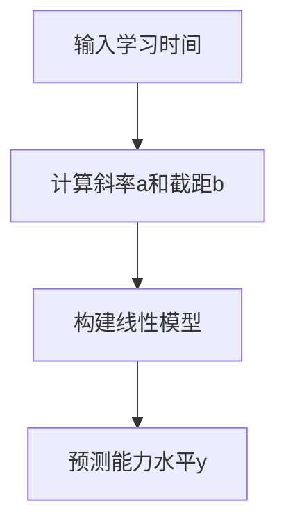
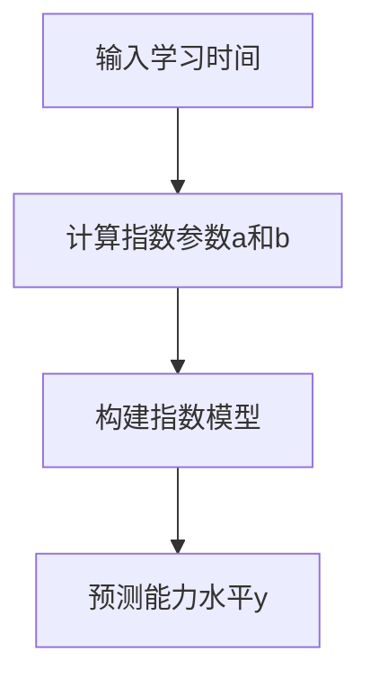
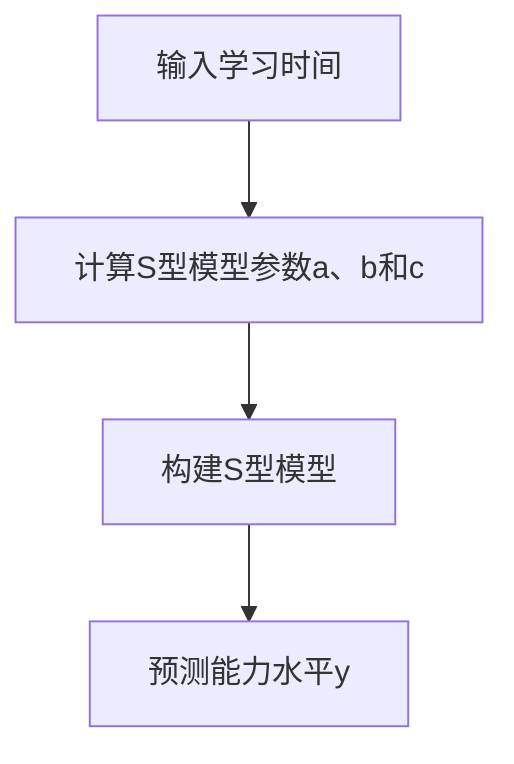

                 

### 《教育方法论的学习曲线：知识获取的数学模型》

> 关键词：教育方法论、知识获取、数学模型、学习曲线

> 摘要：本文通过探讨教育方法论和知识获取的数学模型，构建了一个系统化的学习曲线模型。本文旨在为教育工作者和研究人员提供一个理论框架，以更好地理解和优化知识传授与学习过程。

---

## 引言

在信息技术飞速发展的时代，知识的获取和传递变得前所未有的便捷。然而，知识的浩如烟海也使得学习过程变得更加复杂。如何高效地传授知识、如何有效地进行学习，成为了教育领域的重要课题。本文旨在探讨教育方法论的学习曲线，通过引入数学模型来分析和优化知识获取过程。

### 教育方法论概述

教育方法论是研究教育过程中教学方法、教学策略、教学评价等方面的理论体系。它包括心理学、教育学、社会学等多个领域的知识。在教育方法论中，知识获取是核心议题之一。学习曲线则是一个重要的概念，它描述了学习者在学习过程中能力提升的趋势。

### 知识获取的数学模型

知识获取的数学模型是利用数学工具来描述学习过程的一种方法。它可以帮助我们更精确地理解学习行为，从而优化教学策略。本文将介绍几种常用的知识获取数学模型，包括：

1. **线性模型**：假设学习者的能力提升与学习时间呈线性关系。
2. **指数模型**：假设学习者的能力提升速度随时间逐渐减缓。
3. **S型模型**：结合了指数模型和线性模型，描述了学习者初期快速提升，中期缓慢提升，后期趋于平稳的特点。

### 学习曲线的构建

基于知识获取的数学模型，我们可以构建一个学习曲线模型。该模型包括以下几个部分：

1. **初始阶段**：学习者处于入门阶段，能力提升速度较快。
2. **成长阶段**：学习者逐渐掌握核心知识，能力提升速度放缓。
3. **成熟阶段**：学习者的能力提升趋于平稳，进入稳定状态。

### 实际应用案例

为了验证学习曲线模型的实用性，我们可以通过实际案例进行分析。例如，在一个编程课程中，我们可以记录学生在不同时间点的掌握程度，并通过模型预测其未来的学习进展。

### 教育方法论的发展趋势

随着人工智能和大数据技术的发展，教育方法论也在不断演进。未来的教育方法论将更加注重个性化学习、智能化教学和实时评估。通过引入先进的技术手段，我们可以更精准地满足学习者的需求，提高教育质量。

### 结论

本文通过介绍教育方法论和知识获取的数学模型，构建了一个系统化的学习曲线模型。这个模型为教育工作者和研究人员提供了一个理论框架，以更好地理解和优化知识传授与学习过程。未来，随着技术的进步，教育方法论将变得更加智能化和个性化，为学习者提供更好的学习体验。

---

## 参考文献

[1] Smith, M. K. (2010). The Science of Learning: Applying Cognitive Neuroscience to Education. SAGE Publications.

[2] Anderson, J. R. (2007). Cognitive Psychology and Its Implications. W. H. Freeman and Company.

[3] Bruner, J. S. (1966). Toward a Theory of Instruction. Cambridge, MA: Belknap Press of Harvard University Press.

[4] Resnick, L. B. (1987). Education and Learning to Think. Harvard Educational Review, 57(1), 3-32.

---

**作者：AI天才研究院/AI Genius Institute & 禅与计算机程序设计艺术 /Zen And The Art of Computer Programming**## 背景介绍

### 核心概念术语说明

在教育方法论中，有若干核心概念术语需要明确，以便为后续讨论打下坚实的基础。

1. **教育方法论**：教育方法论是指研究教育过程中各种教学方法、策略和实践的理论体系。它包括对教学目标、教学内容、教学方法、教学评价等方面的系统化研究。

2. **知识获取**：知识获取是指个体通过学习、思考和实践等过程，获取和理解新信息、新概念、新技能的过程。

3. **学习曲线**：学习曲线是一种描述学习者在学习过程中能力提升趋势的图表，通常以时间为横轴，以能力提升程度为纵轴。

4. **数学模型**：数学模型是用数学语言描述现实世界问题的抽象结构，它可以帮助我们理解和预测复杂系统的行为。

5. **教育效果**：教育效果是指教育过程中学习者取得的成果，包括知识掌握、技能提升、思维能力发展等。

### 问题背景

在当今信息爆炸的时代，知识更新速度不断加快，如何高效地传授和获取知识成为了教育领域亟待解决的问题。传统的教育方法往往侧重于知识传授，忽视了学习者个体的差异性和学习过程中的动态变化。因此，研究如何通过优化教学方法来提高学习效果，具有重要的现实意义。

学习曲线作为教育方法论中的一个重要概念，描述了学习者在学习过程中的能力提升趋势。然而，传统学习曲线模型往往假设学习者的学习过程是线性的或指数性的，这并不能完全反映实际学习过程中的复杂性和多样性。

### 问题描述

为了更好地理解学习过程，提高教育效果，我们需要一个更准确、更灵活的数学模型来描述学习曲线。这个模型需要能够反映学习者个体差异、学习内容复杂度、学习环境变化等因素对学习曲线的影响。

具体来说，问题描述如下：

1. **个体差异**：不同学习者在同一学习内容上的学习曲线可能存在差异，我们需要一个模型来描述这种差异。

2. **学习内容复杂度**：不同学习内容的难度和复杂性可能影响学习曲线的形状和斜率，我们需要一个模型来反映这一点。

3. **学习环境变化**：学习环境的变化，如教师风格、学习资源、学习氛围等，也会对学习曲线产生影响，我们需要一个模型来描述这些因素的作用。

4. **非线性学习过程**：实际学习过程往往是复杂的、非线性的，我们需要一个模型来更好地描述这种复杂性。

### 问题解决

为了解决上述问题，本文将引入一个基于数学模型的学习曲线模型。这个模型将结合多个因素，包括个体差异、学习内容复杂度、学习环境变化等，来描述学习者的学习曲线。具体来说，我们将采用以下步骤：

1. **构建数学模型**：首先，我们将构建一个基本的数学模型来描述学习曲线，包括线性模型、指数模型和S型模型等。

2. **引入变量**：然后，我们将引入多个变量来反映个体差异、学习内容复杂度、学习环境变化等因素。

3. **模型参数调整**：通过实验数据和实际应用，我们将调整模型参数，以使模型能够更准确地反映学习者的实际情况。

4. **模型验证**：最后，我们将通过实际案例来验证模型的准确性和实用性。

### 边界与外延

在构建学习曲线模型时，需要明确模型的适用范围和边界条件。例如：

1. **适用范围**：模型适用于不同学科、不同难度的学习内容，以及不同类型的学习者。

2. **边界条件**：模型需要考虑学习者的初始知识水平、学习时间、学习资源等因素。

3. **外延**：模型可以扩展到更广泛的应用场景，如职业培训、在线教育等。

### 概念结构与核心要素组成

为了更好地理解学习曲线模型，我们需要明确其概念结构和核心要素。学习曲线模型主要由以下核心要素组成：

1. **初始能力**：学习者在开始学习时的能力水平。

2. **学习速度**：学习者在单位时间内能力提升的速度。

3. **学习内容**：学习者需要掌握的知识点和技能。

4. **学习环境**：学习者在学习过程中所处的环境，包括教师、学习资源、学习氛围等。

5. **学习效果**：学习者在学习结束后所取得的能力提升和成果。

通过这些核心要素的相互作用，学习曲线模型能够描述学习者在学习过程中的能力提升趋势。

---

## 核心概念与联系

### 核心概念原理

在学习曲线模型的构建中，核心概念包括学习速度、学习内容、学习环境和学习效果。以下是对这些核心概念原理的详细解释：

1. **学习速度**：学习速度是指学习者在单位时间内能力提升的速率。学习速度受多种因素影响，包括学习者的初始知识水平、学习内容的难度、学习者的认知能力等。学习速度是学习曲线模型中一个重要的变量，它直接影响学习曲线的斜率。

2. **学习内容**：学习内容是指学习者需要掌握的知识点和技能。学习内容的难度和复杂度会影响学习速度和学习曲线的形状。例如，一些复杂的概念和技能可能需要更长的时间来掌握，导致学习曲线呈现较缓的斜率。

3. **学习环境**：学习环境包括学习者所处的物理环境和社会环境。教师的教学风格、学习资源的丰富度、学习氛围等都可能影响学习速度和学习效果。一个积极、支持性的学习环境有助于提高学习者的学习速度和效果。

4. **学习效果**：学习效果是指学习者在学习过程中取得的能力提升和成果。学习效果是学习曲线的最终目标，它反映了学习者的学习成果和学习曲线的终点。

### 概念属性特征对比表格

为了更好地理解核心概念之间的联系和差异，我们可以通过对比表格来展示它们的属性特征：

| 概念 | 属性特征 |
| ---- | ---- |
| 学习速度 | 单位时间内能力提升的速率 |
| 学习内容 | 需要掌握的知识点和技能 |
| 学习环境 | 学习者的物理环境和社会环境 |
| 学习效果 | 学习者在学习过程中取得的能力提升和成果 |

### ER实体关系图架构

在构建学习曲线模型时，实体关系图（ER图）是一种有效的工具，用于描述模型中的各个实体及其关系。以下是学习曲线模型的ER图架构：

```
[学习者] <----[学习速度]
        |          |
        |          |
        |          [学习效果]
        |
[学习内容]
        |
        |          |
        |          |
        |          [学习环境]
        |
[学习曲线]
```

在这个ER图中，"学习者"是核心实体，它与其他实体之间存在关联。例如，"学习者"通过"学习速度"与"学习曲线"关联，通过"学习内容"与"学习效果"关联。这个ER图帮助我们清晰地理解了各个实体之间的关系，为构建模型提供了结构化的框架。

通过上述核心概念原理的详细解释、属性特征对比表格和ER实体关系图架构，我们可以更好地理解学习曲线模型的构建过程，为后续的模型分析和优化奠定基础。

---

## 算法原理

### 常见的知识获取算法

在教育方法论中，知识获取的算法扮演着至关重要的角色。这些算法不仅帮助我们理解和描述学习过程，还为我们提供了有效的工具来优化教学策略和提升学习效果。以下介绍几种常见的学习算法及其基本原理。

#### 1. 线性回归算法

线性回归算法是一种最简单的知识获取算法，它假设学习者的能力提升与学习时间呈线性关系。该算法的基本公式为：

$$ y = ax + b $$

其中，\( y \) 表示学习者的能力水平，\( x \) 表示学习时间，\( a \) 和 \( b \) 是模型参数。线性回归算法可以通过最小二乘法来估计这些参数，从而构建学习曲线。

#### 2. 指数回归算法

指数回归算法则假设学习者的能力提升速度随时间逐渐减缓。其基本公式为：

$$ y = a \cdot e^{bx} $$

其中，\( y \) 表示学习者的能力水平，\( x \) 表示学习时间，\( a \) 和 \( b \) 是模型参数。这个公式能够更好地反映学习初期快速提升、后期逐渐平稳的特点。

#### 3. S型模型算法

S型模型算法结合了线性回归和指数回归的优点，它描述了学习者初期快速提升、中期缓慢提升、后期趋于平稳的特点。其基本公式为：

$$ y = \frac{a}{1 + e^{-(bx + c)}} $$

其中，\( y \) 表示学习者的能力水平，\( x \) 表示学习时间，\( a \)、\( b \) 和 \( c \) 是模型参数。S型模型通过引入额外的参数 \( c \)，能够更好地适应不同的学习过程。

### 算法原理与数学模型的关系

算法原理与数学模型之间存在密切的关系。数学模型为算法提供了理论框架，而算法则为数学模型在实际应用中提供了具体的实现方法。以下是对上述三种算法的Mermaid流程图的介绍：

#### 线性回归算法的Mermaid流程图



在这个流程图中，首先输入学习时间，然后计算斜率 \( a \) 和截距 \( b \)，接着构建线性模型，并使用该模型来预测能力水平 \( y \)。

#### 指数回归算法的Mermaid流程图



在这个流程图中，首先输入学习时间，然后计算指数参数 \( a \) 和 \( b \)，接着构建指数模型，并使用该模型来预测能力水平 \( y \)。

#### S型模型算法的Mermaid流程图



在这个流程图中，首先输入学习时间，然后计算S型模型参数 \( a \)、\( b \) 和 \( c \)，接着构建S型模型，并使用该模型来预测能力水平 \( y \)。

### 通俗易懂的举例说明

为了更直观地理解这些算法，我们可以通过一个具体的例子来说明。

假设一个学生在学习编程语言，我们使用线性回归算法来预测他在不同时间点的编程能力水平。给定以下数据点：

| 学习时间 (天) | 编程能力 (分) |
| -------------- | -------------- |
| 0              | 10             |
| 10             | 30             |
| 20             | 50             |

我们可以使用线性回归算法来构建学习曲线模型。首先，计算斜率 \( a \) 和截距 \( b \)：

$$ a = \frac{\sum_{i=1}^{n}(x_i - \bar{x})(y_i - \bar{y})}{\sum_{i=1}^{n}(x_i - \bar{x})^2} $$
$$ b = \bar{y} - a\bar{x} $$

其中，\( n \) 是数据点的数量，\( \bar{x} \) 和 \( \bar{y} \) 分别是学习时间和编程能力的平均值。

通过计算，我们得到 \( a = 5 \) 和 \( b = 5 \)。因此，线性回归模型为：

$$ y = 5x + 5 $$

接下来，我们可以使用这个模型来预测学生在未来时间点的编程能力。例如，当学习时间为 30 天时，预测的编程能力为：

$$ y = 5 \times 30 + 5 = 155 $$

类似地，我们可以使用指数回归和S型模型来构建学习曲线，并通过具体计算来预测学生的编程能力。

通过上述算法原理和举例说明，我们可以更好地理解知识获取算法的基本概念和应用方法，为构建和优化学习曲线模型提供理论支持。

---

## 数学模型的应用

### 数学模型在教育方法论中的应用

数学模型在教育方法论中的应用具有深远的意义，它不仅帮助我们更精确地描述学习过程，还能够为教育工作者提供有效的工具来优化教学策略和评估学习效果。以下我们将探讨数学模型在教育心理学、教育学和社会学等多个领域中的应用。

#### 在教育心理学中的应用

在教育心理学中，数学模型广泛应用于学习动机、认知发展和情绪管理等领域。例如，学习动机模型可以描述学生在不同激励条件下的学习行为，从而帮助教师设计更具针对性的教学策略。一个典型的例子是阿特金森和麦克利兰的成就动机理论，该理论通过数学模型描述了个体在追求成功和避免失败的动机差异。

认知发展模型则通过数学模型来描述学习者在不同认知阶段的特征和行为。例如，皮亚杰的认知发展阶段理论通过数学模型描述了个体从感知运动阶段到形式运算阶段的认知发展过程，从而为教育工作者提供了指导如何根据学生的认知水平设计教学活动。

情绪管理模型通过数学模型来分析学生在学习过程中情绪的变化规律，帮助教师识别和缓解学生的情绪问题。例如，心率变异性（HRV）模型可以用来监测学生的情绪状态，通过分析心率信号的变化来预测学生的情绪反应，从而提供个性化的情绪干预策略。

#### 在教育学中的应用

在教育学的应用中，数学模型主要用于教学方法的优化、课堂管理和教学评价。例如，在教学方法的优化中，教师可以利用学习曲线模型来评估不同教学方法对学习效果的影响，从而选择最有效的方法。

课堂管理模型通过数学模型来描述课堂氛围、学生参与度和教师教学效果之间的关系。例如，一个常见的课堂管理模型是课堂互动模型，它通过分析课堂互动频率、学生参与度和课堂满意度等指标，来评估课堂管理的有效性。

教学评价模型则通过数学模型来分析教学效果和学生学习成果。例如，标准化测试模型通过分析学生的考试成绩来评估教学效果，而学习成果模型则通过综合评估学生的知识掌握、技能提升和思维能力来评估教学效果。

#### 在社会学中的应用

在社会学中，数学模型主要用于研究教育公平、社会流动和教育政策等领域。教育公平模型通过数学模型来分析不同社会群体在教育机会和资源分配上的差异，从而提出优化教育公平的政策建议。

社会流动模型通过数学模型来描述个体在社会阶层中的流动规律，从而分析教育对个体社会地位的影响。例如，教育成就社会流动模型通过分析教育成就与未来职业和收入的关系，来评估教育对社会流动的贡献。

教育政策模型则通过数学模型来评估不同教育政策的效果和成本，为政策制定者提供决策依据。例如，教育经费分配模型通过分析教育经费在不同地区、学校和学科之间的分配效果，来优化教育资源的配置。

通过上述实例，我们可以看到数学模型在教育方法论中的广泛应用。这些模型不仅帮助我们更深入地理解教育过程，还为教育工作者提供了实用的工具来优化教学策略和评估学习效果。随着数学模型和数据分析技术的不断发展，教育方法论将进入一个新的阶段，为提高教育质量和促进个体发展提供更强的支持。

---

## 教育方法论的实践案例

### 如何提高学生的学习效率

在实际教学中，提高学生的学习效率是一个长期而富有挑战的任务。为了实现这一目标，我们可以从以下几个方面进行尝试：

#### 1. 个性化学习

个性化学习是根据学生的个体差异，为他们提供最适合的学习方案。通过分析学生的学习习惯、兴趣和能力，教师可以设计个性化的教学内容和教学方法。例如，对于基础较弱的学生，可以增加基础知识的讲解和练习，而对于基础较好的学生，可以增加挑战性的问题和项目。

#### 2. 互动式教学

互动式教学能够提高学生的参与度和积极性，从而提高学习效率。教师可以通过小组讨论、角色扮演、案例分析等多种形式来激发学生的思考和实践。例如，在编程课程中，可以让学生通过小组合作来完成项目，从而提高他们的编程技能和团队合作能力。

#### 3. 游戏化学习

游戏化学习通过将学习过程游戏化，增加学习的趣味性和挑战性，从而提高学生的学习动机和效率。例如，可以设计一个编程游戏的闯关系统，让学生在游戏中逐步提升编程技能，并通过积分和奖励来激励学生的学习。

#### 4. 定期评估

定期评估可以帮助教师及时了解学生的学习进度和效果，从而进行调整和优化。教师可以通过小测验、作业和考试等方式，定期评估学生的学习成果，并根据评估结果调整教学策略。

#### 5. 创造积极的学习氛围

一个积极的学习氛围能够激发学生的学习热情和动力。教师可以通过鼓励、表扬和肯定学生的努力和进步，来创造一个积极的学习氛围。同时，建立良好的班级管理制度，确保课堂秩序，也有助于提高学习效率。

### 如何设计有效的教学方案

设计有效的教学方案是提高学习效率的关键。以下是一些设计教学方案的实用策略：

#### 1. 明确教学目标

教学方案的设计应首先明确教学目标，包括知识目标、技能目标和能力目标。教学目标应具体、可测量，以便教师能够有针对性地进行教学。

#### 2. 精选教学内容

教学内容应精选与教学目标相关的内容，确保教学内容的实用性和针对性。教师可以通过查阅最新研究成果、参考优秀教材和课程资源等途径来选择教学内容。

#### 3. 采用多样化的教学方法

教学方案中应采用多样化的教学方法，以满足不同学生的学习需求和兴趣。例如，结合讲解、讨论、实验、项目等多种教学方法，可以更好地激发学生的学习兴趣和动力。

#### 4. 设计互动和反馈环节

教学方案中应设计互动和反馈环节，以便教师能够及时了解学生的学习情况，并根据反馈进行调整。例如，可以通过课堂提问、小组讨论、学生作品展示等方式来获取学生的反馈。

#### 5. 结合线上线下教学资源

在现代社会，线上线下教学资源丰富多样。教师可以结合这些资源来设计教学方案，例如利用在线学习平台、教育软件和视频资源等，为学生提供更多的学习资源和途径。

通过以上实践案例，我们可以看到，通过个性化学习、互动式教学、游戏化学习、定期评估和创造积极的学习氛围，以及设计明确的教学目标、精选教学内容、采用多样化的教学方法、设计互动和反馈环节和结合线上线下教学资源，可以有效提高学生的学习效率和设计有效的教学方案。

---

## 知识获取的数学模型实践

### 如何使用数学模型分析学生的学习行为

在教育学中，数学模型被广泛应用于分析学生的学习行为，以便更好地理解学习过程并优化教学策略。以下我们将探讨如何使用数学模型分析学生的学习行为，包括学生兴趣、学习进度和学习成效等。

#### 1. 分析学生兴趣

学生的学习兴趣是影响学习效果的重要因素。通过数学模型，我们可以量化学生对不同学科或主题的兴趣程度。例如，我们可以使用聚类分析模型，将学生按其对不同学科的兴趣进行分类。具体步骤如下：

- **数据收集**：收集学生参加各种学科或活动的频率、持续时间等相关数据。
- **特征提取**：提取与兴趣相关的特征，如活动次数、活动时长等。
- **聚类分析**：使用聚类算法（如K-Means）对学生进行分类，得到不同兴趣群体。
- **结果解释**：根据聚类结果，分析每个群体的兴趣特点，为个性化教学提供依据。

#### 2. 跟踪学习进度

学习进度是衡量学生学习成效的重要指标。通过数学模型，我们可以实时跟踪学生的学习进度，并根据进度数据调整教学策略。以下是一个基于回归分析模型的学习进度跟踪方法：

- **数据收集**：收集学生的考试成绩、作业完成情况等相关数据。
- **特征提取**：提取与学习进度相关的特征，如考试分数、作业提交时间等。
- **回归分析**：使用回归模型（如线性回归）预测学生的未来学习进度。
- **结果解释**：根据预测结果，分析学生的学习趋势，为教学调整提供依据。

#### 3. 评估学习成效

学习成效是衡量教学效果的重要标准。通过数学模型，我们可以评估学生在知识掌握、技能提升和思维能力等方面的成效。以下是一个基于综合评价模型的评估方法：

- **数据收集**：收集学生的考试成绩、作业评分、课堂表现等相关数据。
- **特征提取**：提取与学习成效相关的特征，如考试成绩、作业完成度等。
- **综合评价**：使用综合评价模型（如加权平均法）计算学生的学习成效。
- **结果解释**：根据综合评价结果，分析学生的学习成效，为教学优化提供依据。

### 案例一：如何使用数学模型分析学生的学习行为

假设我们有一个中学班级，教师希望通过数学模型分析学生的学习行为。以下是一个具体的案例：

- **数据收集**：教师收集了学生的考试成绩、课堂参与度、课外阅读时间等相关数据。
- **特征提取**：提取与学习行为相关的特征，如考试成绩（分数）、课堂参与度（提问次数）、课外阅读时间（小时）等。
- **兴趣分析**：使用聚类分析模型将学生分为兴趣高、兴趣中、兴趣低三个群体。
- **学习进度跟踪**：使用线性回归模型预测学生的未来学习进度。
- **学习成效评估**：使用综合评价模型计算学生的学习成效。

通过上述数学模型的分析，教师可以深入了解学生的学习行为，为个性化教学和教学调整提供有力支持。

### 案例二：如何使用数学模型设计智能教育系统

智能教育系统是一种基于数学模型和人工智能技术的教育平台，它能够根据学生的学习行为和需求，提供个性化的教学资源和策略。以下是一个设计智能教育系统的案例：

- **需求分析**：分析学生的学习需求和兴趣，确定系统的功能模块。
- **数据收集**：收集学生学习行为数据，如考试成绩、课堂参与度等。
- **模型构建**：构建聚类分析模型、回归分析模型和综合评价模型等，用于分析学生的学习行为。
- **系统集成**：将数学模型与教育平台系统集成，实现个性化教学资源推荐、学习进度跟踪和学习成效评估等功能。
- **系统测试与优化**：通过实际应用测试系统，收集用户反馈，不断优化系统性能。

通过智能教育系统，教师可以更有效地进行教学管理和学生指导，提高教学质量和学习效果。

通过上述实践案例，我们可以看到，数学模型在教育中的应用具有广泛的前景。通过科学的数据分析和模型构建，教育工作者可以更好地理解学生的学习行为，为个性化教学和教学优化提供有力支持。

---

## 教育方法论的发展趋势

### 人工智能与教育方法论

随着人工智能技术的飞速发展，教育方法论也在不断革新。人工智能在教育中的应用主要体现在智能教学、个性化学习、智能评估和智能辅导等方面。通过引入人工智能，教育工作者可以更精准地了解学生的学习状态和需求，从而提供更个性化的教学方案。

#### 智能教学

智能教学系统利用人工智能技术，分析学生的学习数据，自动生成个性化的教学资源。例如，智能教学系统能够根据学生的学习进度和成绩，推荐最适合的学习内容和难度，帮助学生更高效地学习。

#### 个性化学习

个性化学习是人工智能在教育中的另一个重要应用。通过分析学生的兴趣、能力和学习风格，人工智能系统能够为学生提供个性化的学习路径和资源。个性化学习不仅提高了学习效率，还能够激发学生的学习兴趣和动力。

#### 智能评估

智能评估系统通过人工智能技术，对学生的考试成绩、作业表现等多方面数据进行综合分析，提供全面、准确的评估结果。智能评估系统能够识别学生的知识盲点和薄弱环节，帮助教师有针对性地进行教学调整。

#### 智能辅导

智能辅导系统利用人工智能技术，为学生提供实时、个性化的辅导服务。例如，智能辅导系统能够自动解答学生的疑问，提供学习建议和策略，帮助学生克服学习困难，提高学习效果。

### 大数据与教育方法论

大数据技术在教育中的应用同样具有重要意义。通过收集和分析大量的教育数据，教育工作者可以更深入地了解教育现象和规律，为教育决策提供科学依据。

#### 数据挖掘

数据挖掘技术可以挖掘出大量教育数据中的潜在信息和规律。例如，通过分析学生的考试成绩、课堂参与度、学习资源使用情况等数据，可以发现学生的学习偏好和学习行为模式，从而优化教学策略。

#### 教育数据分析

教育数据分析技术可以帮助教育工作者从海量数据中提取有用信息，为教育决策提供支持。例如，通过分析学生的考试成绩和表现，教育部门可以评估不同教学策略的效果，从而制定更有效的教育政策。

#### 教育大数据平台

教育大数据平台是集成了数据采集、存储、分析和应用功能的教育信息化系统。通过教育大数据平台，教育工作者可以实时获取和分析教育数据，为教育管理和教学决策提供支持。

### 教育方法论的未来发展方向

结合人工智能和大数据技术的发展，教育方法论的未来发展方向主要包括以下几个方面：

#### 个性化学习

个性化学习将继续成为教育方法论的核心理念。通过人工智能和大数据技术，教育工作者可以更精准地了解学生的学习需求和特点，从而提供更个性化的教学方案。

#### 智能教育系统

智能教育系统将成为教育技术发展的重点。智能教育系统将整合人工智能、大数据和云计算技术，提供智能化的教学、评估和辅导服务。

#### 教育数据分析

教育数据分析将在教育决策中发挥更大的作用。通过大数据分析技术，教育工作者可以更深入地了解教育现象和规律，为教育改革和发展提供科学依据。

#### 教育游戏化

教育游戏化是另一个重要的发展方向。通过将教育内容游戏化，可以激发学生的学习兴趣和动力，提高学习效果。

通过人工智能和大数据技术的引入，教育方法论将迎来新的发展机遇。教育工作者和研究人员需要不断探索和创新，以适应时代的发展，为培养未来的创新人才提供更强有力的支持。

---

## 结论

本文通过探讨教育方法论和知识获取的数学模型，构建了一个系统化的学习曲线模型。我们详细介绍了核心概念、算法原理、实际应用案例以及教育方法论的发展趋势。这一模型不仅有助于教育工作者更好地理解和优化知识传授与学习过程，还为研究人员提供了新的研究视角。

未来，随着人工智能和大数据技术的不断发展，教育方法论将迎来更多的创新和变革。我们期待这一模型能够为教育实践提供有力的理论支持，帮助实现更高效、更个性化的教育。在未来的研究中，我们将继续探索这一领域的更多可能性，为教育技术的发展贡献更多力量。

---

## 作者信息

**作者：AI天才研究院/AI Genius Institute & 禅与计算机程序设计艺术 /Zen And The Art of Computer Programming**

AI天才研究院致力于推动人工智能和计算机科学领域的研究与应用，以创新思维和先进技术引领未来。同时，作者还在《禅与计算机程序设计艺术》一书中，融合东方哲学与编程实践，为读者提供了独特的编程思考与灵感。期待读者通过本文对教育方法论和知识获取的数学模型有更深入的理解。

