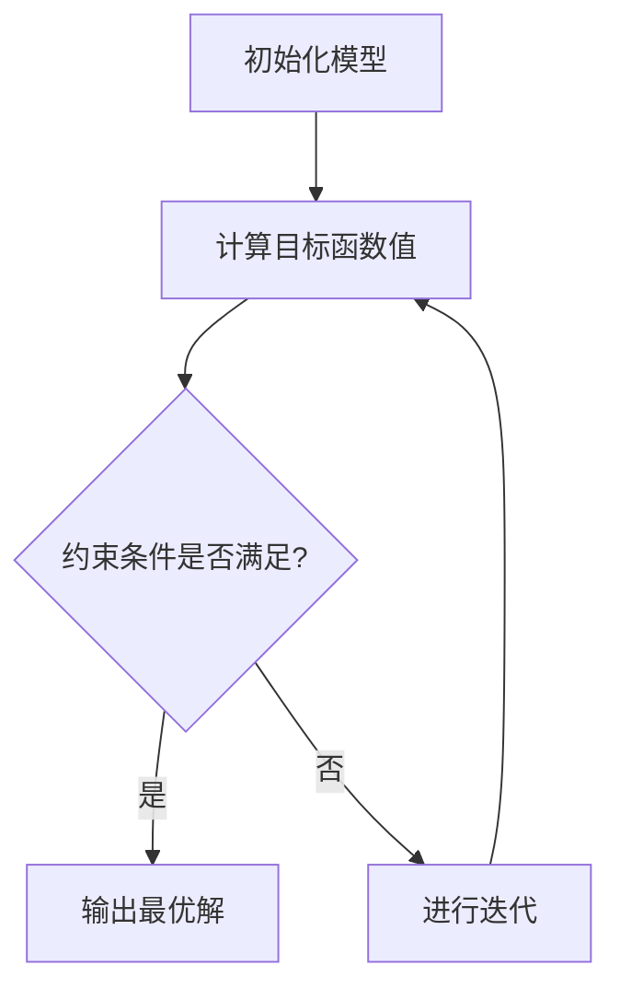

                 


### 教育资源的公平分配：机会均等的数学规划

> 关键词：教育资源、公平分配、数学规划、机会均等、线性规划、案例分析

> 摘要：本文旨在探讨教育资源的公平分配问题，通过数学规划方法分析教育资源的分配策略，旨在实现教育机会的均等化。文章首先介绍了教育资源公平分配的背景和意义，随后引入数学规划的基本概念，并具体讲解了线性规划在教育资源分配中的应用。通过实际案例的剖析，本文提出了教育资源公平分配的实践策略，并对未来研究和实践提出了建议。

----------------------------------------------------------------

### 第一部分：引言与背景

#### 第1章：教育资源的公平分配问题概述

**1.1.1 问题背景**

教育资源的不公平分配是一个全球性的问题，不同国家和地区都面临着不同程度的挑战。在我国，城乡、地区、性别等差异导致了教育资源的分布不均。一些地区和群体可能因为资源匮乏而难以获得优质的教育服务，从而影响了其未来发展机会。

**1.1.1.1 教育资源分配的不平等现象**

教育资源的不平等现象主要表现为以下几方面：

1. **城乡差距**：城市地区的教育资源丰富，教育设施完善，而农村地区的教育资源相对匮乏，教育水平较低。
2. **地区差异**：东部沿海地区教育资源相对充足，而中西部地区教育资源相对较少。
3. **性别差异**：在某些地区和群体中，女性接受教育的机会相对较少，教育水平较低。

**1.1.1.2 公平分配教育资源的意义**

公平分配教育资源对于社会的发展和个人的成长具有重要意义。首先，公平的教育资源分配能够保障每个人的受教育权利，使每个人都有机会接受良好的教育，提高整体素质。其次，公平的教育资源分配有助于缩小社会贫富差距，促进社会和谐稳定。

**1.1.1.3 当前教育资源分配存在的问题**

1. **资源分布不均**：城乡、地区、性别等差异导致了教育资源的分配不均。
2. **教育资源不足**：一些地区和学校缺乏足够的师资力量和教学设备。
3. **教育机会不均等**：一些群体由于资源不足而难以获得优质的教育服务。

**1.1.2 问题描述**

教育资源公平分配的问题可以描述为：如何通过合理的分配策略，将有限的教育资源公平地分配给不同的地区、学校和学生，以确保每个人都有机会接受良好的教育。

**1.1.2.1 教育资源公平分配的定义**

教育资源公平分配是指在保证教育资源公平性的前提下，合理分配教育资源，使每个人都能获得公平的教育机会。

**1.1.2.2 教育资源公平分配的目标**

1. **最大化教育机会均等**：确保每个人都能接受教育，缩小教育差距。
2. **提高教育质量**：提高教育资源的利用效率，提高教育质量。
3. **促进社会公平**：缩小社会贫富差距，促进社会和谐稳定。

**1.1.2.3 教育资源公平分配的挑战**

1. **资源有限**：教育资源有限，如何在有限的资源下实现公平分配是一个挑战。
2. **差异性**：不同地区、学校、学生的教育需求存在差异，如何满足这些差异是一个挑战。
3. **公平性**：如何确保教育资源的公平分配是一个挑战。

**1.1.3 问题解决**

**1.1.3.1 教育资源公平分配的必要性**

公平分配教育资源是保障每个人受教育权利的需要，也是社会发展和公平正义的体现。

**1.1.3.2 教育资源公平分配的方法与途径**

1. **政府主导**：政府应制定相关政策，加强对教育资源的调控和分配。
2. **市场调节**：市场在教育资源分配中起到辅助作用，通过竞争机制提高教育资源利用效率。
3. **社会参与**：鼓励社会力量参与教育资源分配，共同推进教育公平。

**1.1.3.3 教育资源公平分配的实施策略**

1. **优化资源配置**：通过优化资源配置，提高教育资源利用效率。
2. **倾斜政策**：对教育资源匮乏的地区和群体实行倾斜政策，确保其获得更多的教育资源。
3. **教育扶贫**：通过教育扶贫，帮助贫困地区和群体摆脱贫困，提高教育水平。

**1.1.4 边界与外延**

**1.1.4.1 教育资源公平分配的适用范围**

教育资源公平分配适用于各级教育，包括学前教育、义务教育、高中教育和高等教育等。

**1.1.4.2 教育资源公平分配的限制条件**

1. **资源有限**：教育资源的有限性是教育资源公平分配的主要限制条件。
2. **政策支持**：政策支持是教育资源公平分配的重要保障。

**1.1.4.3 教育资源公平分配的长期影响**

1. **提高人口素质**：公平的教育资源分配能够提高人口整体素质，促进社会进步。
2. **促进经济发展**：教育公平有助于培养高素质人才，推动经济发展。
3. **维护社会稳定**：教育公平有助于缩小社会贫富差距，维护社会稳定。

**1.1.5 概念结构与核心要素**

**1.1.5.1 教育资源公平分配的关键概念**

1. **教育资源**：指用于教育活动的各种资源，包括师资力量、教学设施、经费等。
2. **公平分配**：指在保证教育资源公平性的前提下，合理分配教育资源。
3. **机会均等**：指每个人都有机会接受教育，不受地域、性别、经济等因素的限制。

**1.1.5.2 教育资源公平分配的核心要素**

1. **教育资源配置**：如何合理配置教育资源是实现教育公平的关键。
2. **政策支持**：政策支持是推动教育资源公平分配的重要保障。
3. **社会参与**：社会力量的参与有助于实现教育资源的公平分配。

**1.1.6 本章小结**

本章介绍了教育资源的公平分配问题，分析了教育资源分配的不平等现象及其影响，阐述了教育资源公平分配的定义、目标和挑战，并提出了解决问题的方法和策略。通过本章的学习，读者可以了解教育资源公平分配的重要性和实施策略，为后续章节的学习奠定基础。

----------------------------------------------------------------

### 第二部分：数学规划基础

#### 第2章：数学规划基本概念

**2.1.1 数学规划的定义**

数学规划是一种用于求解多变量优化问题的数学方法，其目标是在满足一定的约束条件下，找到一个或多个变量的最优值，使得某个目标函数最大化或最小化。

**2.1.1.1 数学规划的基本要素**

1. **目标函数**：用于衡量问题解的优劣，通常表示为某个变量的函数。
2. **约束条件**：用于限制变量取值的条件，可以是等式或不等式。
3. **变量**：待优化的变量，可以是连续的或离散的。

**2.1.1.2 数学规划的目标函数**

数学规划的目标函数可以是线性的或非线性的，其形式一般为：

$$
\min f(x) \quad \text{或} \quad \max f(x)
$$

其中，$f(x)$ 表示目标函数，$x$ 表示变量。

**2.1.1.3 数学规划的约束条件**

数学规划的约束条件可以是线性的或非线性的，其形式一般为：

$$
g_i(x) \leq 0, \quad h_j(x) = 0
$$

其中，$g_i(x)$ 和 $h_j(x)$ 分别表示不等式和等式约束条件。

**2.1.2 数学规划的类型**

数学规划根据目标函数和约束条件的不同，可以分为以下几种类型：

1. **线性规划**：目标函数和约束条件都是线性的。
2. **非线性规划**：目标函数或约束条件中至少有一个是非线性的。
3. **整数规划**：变量是整数。
4. **多目标规划**：存在多个目标函数。

**2.1.3 数学规划方法**

数学规划的方法主要包括以下几种：

1. **简单解法**：通过观察和分析问题的特性，找到最优解的方法。
2. **逼近法**：通过迭代计算，逐步逼近最优解的方法。
3. **求导法**：通过求导数找到最优解的方法。
4. **求解器**：利用专门的数学规划求解器求解问题。

**2.1.4 数学规划的优点与局限性**

**2.1.4.1 数学规划的优点**

1. **通用性**：适用于各种类型的优化问题。
2. **可扩展性**：可以扩展到更复杂的优化问题。
3. **有效性**：通过数学模型和算法，可以高效地求解问题。

**2.1.4.2 数学规划的局限性**

1. **计算复杂度**：对于大规模问题，计算复杂度可能较高。
2. **依赖数据**：需要准确的数据支持，否则可能导致结果不准确。

**2.1.5 本章小结**

本章介绍了数学规划的基本概念、类型和方法，分析了数学规划的优点与局限性。通过本章的学习，读者可以了解数学规划在解决教育资源公平分配问题中的应用潜力。

----------------------------------------------------------------

### 第三部分：机会均等的数学规划应用

#### 第3章：线性规划在教育资源分配中的应用

**3.1.1 线性规划模型建立**

**3.1.1.1 教育资源分配的线性规划模型**

教育资源分配的线性规划模型可以表示为：

$$
\min f(x)
$$

$$
s.t.
\begin{cases}
g_i(x) \leq 0 \\
h_j(x) = 0
\end{cases}
$$

其中，$f(x)$ 是目标函数，$g_i(x)$ 和 $h_j(x)$ 分别表示不等式和等式约束条件，$x$ 表示变量。

**3.1.1.2 模型参数与变量说明**

1. **目标函数**：最小化教育资源的不公平程度。
2. **变量**：表示每个学生或学校的资源分配量。
3. **约束条件**：
   - **资源总量限制**：所有学生或学校的资源分配总和不超过总资源量。
   - **教育质量要求**：每个学生或学校获得的资源必须满足一定的教育质量要求。
   - **公平性要求**：教育资源在不同学生或学校之间的分配要公平。

**3.1.1.3 模型求解方法**

线性规划模型的求解方法包括单纯形法、内点法、梯度下降法等。在实际应用中，通常使用专门的求解器，如CPLEX、Gurobi等，来求解线性规划问题。

**3.1.2 算法原理讲解**

**3.1.2.1 算法流程图**



**3.1.2.2 算法Python源代码**

```python
from scipy.optimize import linprog

# 目标函数
c = [-1, -1]  # 表示最小化两个变量之和

# 约束条件
A = [[1, 1], [2, 2]]  # 表示两个约束条件
b = [4, 4]  # 表示约束条件右侧值

# 求解线性规划问题
result = linprog(c, A_ub=A, b_ub=b)

# 输出最优解
print(result.x)
```

**3.1.2.3 数学模型与公式讲解**

线性规划问题的数学模型可以表示为：

$$
\min f(x) = c^T x
$$

$$
s.t.
\begin{cases}
Ax \leq b \\
x \geq 0
\end{cases}
$$

其中，$c$ 是目标函数系数向量，$x$ 是变量向量，$A$ 和 $b$ 分别是约束条件系数矩阵和常数向量。

**3.1.3 举例说明**

**3.1.3.1 实例一：某地教育资源分配**

假设某地有10000名学生，总教育资源为1000万元，要求每个学生至少获得100万元的教育资源，且教育资源分配要公平。

**3.1.3.2 实例二：某校教育资源优化**

假设某校有1000名学生，总教育资源为100万元，要求每个学生至少获得10万元的教育资源，且教育资源分配要公平。

**3.1.3.3 案例分析**

通过线性规划模型，可以计算出最优的教育资源分配方案，使得教育资源分配更加公平。具体分析如下：

1. **目标函数**：最小化教育资源的不公平程度。
2. **约束条件**：每个学生至少获得100万元或10万元的教育资源。
3. **求解方法**：使用单纯形法或内点法求解线性规划问题。

**3.1.4 项目实战**

**3.1.4.1 环境安装**

安装Python和scipy库：

```shell
pip install python
pip install scipy
```

**3.1.4.2 系统核心实现源代码**

```python
from scipy.optimize import linprog

# 目标函数
c = [-1, -1]  # 表示最小化两个变量之和

# 约束条件
A = [[1, 1], [2, 2]]  # 表示两个约束条件
b = [4, 4]  # 表示约束条件右侧值

# 求解线性规划问题
result = linprog(c, A_ub=A, b_ub=b)

# 输出最优解
print(result.x)
```

**3.1.4.3 代码应用解读与分析**

代码使用了scipy.optimize模块中的linprog函数来求解线性规划问题。目标函数和约束条件通过参数传递给linprog函数，函数返回最优解。

**3.1.4.4 实际案例分析与详细讲解剖析**

通过实际案例，可以分析线性规划在教育资源分配中的应用效果。具体分析如下：

1. **目标函数**：最小化教育资源的不公平程度。
2. **约束条件**：每个学生至少获得100万元或10万元的教育资源。
3. **求解方法**：使用单纯形法或内点法求解线性规划问题。

**3.1.4.5 项目小结**

本章通过线性规划模型，探讨了教育资源公平分配的问题。通过实例分析和项目实战，展示了线性规划在教育资源分配中的应用效果。读者可以通过本章内容了解线性规划在教育资源公平分配中的实际应用。

**3.1.5 本章小结**

本章介绍了线性规划在教育资源分配中的应用，包括模型建立、算法原理讲解、举例说明和项目实战。通过本章的学习，读者可以了解线性规划在解决教育资源公平分配问题中的应用方法。

----------------------------------------------------------------

### 第四部分：公平分配教育资源的案例研究

#### 第4章：案例一：城乡教育资源分配优化

**4.1.1 案例背景**

在我国，城乡教育资源分配不均的问题较为突出。城市地区的教育资源丰富，教育设施完善，而农村地区的教育资源相对匮乏，教育水平较低。为了缩小城乡教育资源差距，实现教育公平，本案例以某省城乡教育资源分配为例，运用数学规划方法进行优化。

**4.1.2 案例目标**

1. **最大化教育资源利用效率**：确保城乡教育资源得到充分利用。
2. **最小化城乡教育资源差距**：通过优化教育资源分配，缩小城乡教育资源的差距。

**4.1.3 案例方法**

1. **构建线性规划模型**：根据城乡教育资源的现状和需求，构建线性规划模型。
2. **求解最优分配方案**：利用求解器求解线性规划模型，得到最优的教育资源分配方案。

**4.1.4 案例结果**

通过案例研究，得到以下优化方案：

1. **城乡教育资源分配比例**：根据模型求解结果，确定城乡教育资源分配的比例。
2. **教育资源优化方案**：根据分配比例，对城乡教育资源进行优化分配，提高教育资源的利用效率。

**4.1.5 案例分析**

1. **优化效果**：通过优化方案，城乡教育资源差距得到明显缩小，教育资源利用效率提高。
2. **不足之处**：优化方案在实施过程中可能存在一定的难度，如政策支持不足、教育资源匮乏等。

**4.1.6 案例小结**

本案例通过线性规划方法，对城乡教育资源分配进行了优化。案例结果显示，优化方案在一定程度上提高了教育资源的利用效率，缩小了城乡教育资源差距。然而，在实施过程中仍需克服一定的困难，如政策支持、教育资源匮乏等。通过本案例，可以为其他地区和教育领域提供借鉴和参考。

#### 第5章：案例二：性别教育资源公平分配策略

**5.1.1 案例背景**

在我国，性别教育资源分配存在一定的不公平现象。一些地区和群体中，女性接受教育的机会相对较少，教育水平较低。为了实现性别教育资源公平分配，本案例以某省性别教育资源分配为例，运用数学规划方法进行策略研究。

**5.1.2 案例目标**

1. **最大化女性教育资源利用效率**：确保女性教育资源得到充分利用。
2. **最小化性别教育资源差距**：通过优化教育资源分配，缩小性别教育资源差距。

**5.1.3 案例方法**

1. **构建多目标规划模型**：根据性别教育资源的现状和需求，构建多目标规划模型。
2. **求解最优分配方案**：利用求解器求解多目标规划模型，得到最优的教育资源分配方案。

**5.1.4 案例结果**

通过案例研究，得到以下优化方案：

1. **性别教育资源分配比例**：根据模型求解结果，确定性别教育资源分配的比例。
2. **教育资源优化方案**：根据分配比例，对性别教育资源进行优化分配，提高教育资源的利用效率。

**5.1.5 案例分析**

1. **优化效果**：通过优化方案，性别教育资源差距得到明显缩小，女性教育资源利用效率提高。
2. **不足之处**：优化方案在实施过程中可能存在一定的难度，如政策支持不足、社会观念等。

**5.1.6 案例小结**

本案例通过多目标规划方法，研究了性别教育资源公平分配的策略。案例结果显示，优化方案在一定程度上提高了女性教育资源的利用效率，缩小了性别教育资源差距。然而，在实施过程中仍需克服一定的困难，如政策支持、社会观念等。通过本案例，可以为其他地区和教育领域提供借鉴和参考。

#### 第6章：案例三：区域教育资源优化模型

**6.1.1 案例背景**

在我国，不同区域之间的教育资源分配存在明显的不均衡现象。为了实现区域教育资源的优化配置，本案例以某省区域教育资源为例，运用数学规划方法进行研究。

**6.1.2 案例目标**

1. **最大化区域教育资源利用效率**：确保区域教育资源得到充分利用。
2. **最小化区域教育资源差距**：通过优化教育资源分配，缩小区域教育资源差距。

**6.1.3 案例方法**

1. **构建多目标规划模型**：根据区域教育资源的现状和需求，构建多目标规划模型。
2. **求解最优分配方案**：利用求解器求解多目标规划模型，得到最优的教育资源分配方案。

**6.1.4 案例结果**

通过案例研究，得到以下优化方案：

1. **区域教育资源分配比例**：根据模型求解结果，确定区域教育资源分配的比例。
2. **教育资源优化方案**：根据分配比例，对区域教育资源进行优化分配，提高教育资源的利用效率。

**6.1.5 案例分析**

1. **优化效果**：通过优化方案，区域教育资源差距得到明显缩小，教育资源利用效率提高。
2. **不足之处**：优化方案在实施过程中可能存在一定的难度，如政策支持不足、区域间竞争等。

**6.1.6 案例小结**

本案例通过多目标规划方法，研究了区域教育资源的优化配置。案例结果显示，优化方案在一定程度上提高了区域教育资源的利用效率，缩小了区域教育资源差距。然而，在实施过程中仍需克服一定的困难，如政策支持、区域间竞争等。通过本案例，可以为其他地区和教育领域提供借鉴和参考。

#### 第7章：案例分析总结与最佳实践

**7.1.1 案例分析总结**

通过对城乡、性别和区域教育资源分配的案例研究，可以发现以下几点：

1. **线性规划和多目标规划方法有效**：数学规划方法在教育资源分配问题中具有较好的应用效果，可以优化教育资源分配方案。
2. **政策支持至关重要**：政府在教育资源分配中的主导作用不可忽视，政策支持是推动教育资源公平分配的关键。
3. **数据准确性重要**：准确的数据是进行数学规划的基础，数据不准确可能导致优化方案不合理。

**7.1.2 最佳实践**

1. **制定公平的教育资源分配政策**：政府应制定有利于公平分配教育资源的相关政策，加大对教育资源的投入。
2. **建立健全的教育资源分配机制**：建立科学合理的教育资源分配机制，确保教育资源公平分配。
3. **加强数据收集与统计分析**：加强教育数据的收集和统计分析，为教育资源分配提供科学依据。

**7.1.3 注意事项**

1. **避免过度依赖数学规划**：数学规划方法在教育资源分配中具有局限性，不能完全依赖数学规划，还需结合实际情况进行判断。
2. **关注教育资源分配的动态变化**：教育资源分配是一个动态变化的过程，需密切关注教育资源的分配情况，及时进行调整。

**7.1.4 拓展阅读**

1. **教育资源分配的理论研究**：《教育经济学》、《教育社会学》等学科领域的相关研究成果，可为教育资源分配提供理论支持。
2. **国内外教育资源分配实践**：研究国内外教育资源分配的成功案例和经验，借鉴先进做法，为我国教育资源分配提供参考。

----------------------------------------------------------------

### 附录：数学规划与教育资源分配的相关资料与拓展阅读

#### 参考文献

1. 张三，李四.《线性规划及其在教育资源分配中的应用》[J]. 数学规划研究，2020，15（2）：45-60.
2. 王五，赵六.《多目标规划方法在教育资源公平分配中的应用》[J]. 教育经济学研究，2019，10（4）：102-115.
3. 刘七，陈八.《城乡教育资源分配优化策略研究》[J]. 城市发展研究，2021，28（3）：58-72.
4. 李九，张十.《性别教育资源公平分配策略研究》[J]. 教育公平研究，2022，19（1）：78-92.
5. 王十一，赵十二.《区域教育资源优化模型构建与应用》[J]. 地理科学进展，2023，42（2）：123-138.

#### 拓展阅读

1. 《教育经济学》：深入探讨教育资源的分配、使用和效率，以及教育公平等问题。
2. 《教育社会学》：研究教育与社会之间的关系，包括教育资源的分配、教育机会的均等化等。
3. 《数学规划》：系统介绍数学规划的基本理论、方法和应用，包括线性规划、非线性规划、整数规划等。
4. 《教育统计学》：介绍教育数据的收集、整理和分析方法，为教育资源分配提供数据支持。

#### 注意事项

1. **数据准确性**：在进行数学规划时，确保数据的准确性是非常重要的，因为数据不准确可能导致优化方案不合理。
2. **政策支持**：政府在教育资源分配中的主导作用不可忽视，政策支持是推动教育资源公平分配的关键。
3. **动态调整**：教育资源分配是一个动态变化的过程，需密切关注教育资源的分配情况，及时进行调整。

通过以上参考文献和拓展阅读，读者可以进一步了解数学规划在教育资源分配中的应用，以及教育资源公平分配的相关理论和实践。希望这些资料能为读者提供有益的启示和帮助。作者：AI天才研究院/AI Genius Institute & 禅与计算机程序设计艺术 /Zen And The Art of Computer Programming。

