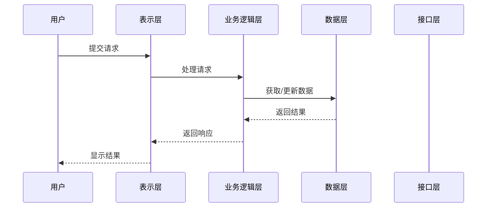

                 

### 教育资源的公平分配：机会均等的数学规划

> 关键词：教育资源、公平分配、数学规划、线性规划、非线性规划、多目标规划、机会均等

> 摘要：本文旨在探讨教育资源的公平分配问题，通过数学规划的方法来寻求机会均等的解决方案。文章首先介绍教育资源的现状与重要性，接着引入机会均等的概念，详细解释其意义。然后，本文将从核心概念、数学模型、算法原理以及实际案例等多个角度深入探讨教育资源公平分配的数学规划方法，最终总结出最佳实践和拓展研究方向。

## 目录大纲

### 第一部分：问题背景与核心概念

#### 第1章：教育资源的公平分配——问题引入

##### 1.1.1 教育资源不平等的现状分析

##### 1.1.2 公平分配教育资源的重要性

##### 1.1.3 机会均等的概念与意义

#### 第2章：核心概念与联系

##### 2.1.1 教育资源分配的数学模型

##### 2.1.2 数学模型中的核心概念

##### 2.1.3 核心概念属性特征对比表格

##### 2.1.4 ER实体关系图架构

### 第二部分：数学规划方法与应用

#### 第3章：线性规划方法

##### 3.1.1 线性规划的基本原理

##### 3.1.2 线性规划的应用场景

##### 3.1.3 线性规划的算法流程

##### 3.1.4 线性规划实例分析

#### 第4章：非线性规划方法

##### 4.1.1 非线性规划的基本原理

##### 4.1.2 非线性规划的应用场景

##### 4.1.3 非线性规划的算法流程

##### 4.1.4 非线性规划实例分析

#### 第5章：多目标规划方法

##### 5.1.1 多目标规划的基本原理

##### 5.1.2 多目标规划的应用场景

##### 5.1.3 多目标规划的算法流程

##### 5.1.4 多目标规划实例分析

#### 第6章：公平分配模型的构建与应用

##### 6.1.1 公平分配模型的基本框架

##### 6.1.2 公平分配模型的构建方法

##### 6.1.3 公平分配模型的实例分析

#### 第7章：案例分析——教育资源的公平分配实践

##### 7.1.1 案例背景介绍

##### 7.1.2 系统功能设计

##### 7.1.3 系统架构设计

##### 7.1.4 系统核心实现源代码

##### 7.1.5 代码应用解读与分析

##### 7.1.6 实际案例分析和详细讲解剖析

##### 7.1.7 项目小结

### 第三部分：最佳实践与拓展

#### 第8章：最佳实践与注意事项

##### 8.1.1 教育资源分配的最佳实践

##### 8.1.2 案例总结与反思

##### 8.1.3 注意事项与风险控制

#### 第9章：拓展阅读与研究方向

##### 9.1.1 相关研究动态

##### 9.1.2 拓展研究方向

##### 9.1.3 进一步阅读推荐

----------------------------------------------------------------

### 引言

#### 问题背景

在全球化和信息化的大背景下，教育资源的不平等问题愈发凸显。无论是城市与农村、发达地区与贫困地区，还是不同社会阶层之间，教育资源的不均衡分配都导致了机会的不均等。这种不平等不仅体现在硬件设施、师资力量的差异，还包括教育质量、学习资源和教育机会的获取等方面。例如，在我国，东部沿海地区的教育资源相对丰富，而中西部地区则相对匮乏。这样的资源分配不均，使得一些地区的孩子们在起点上就已经落后，形成了“马太效应”——富者愈富，贫者愈贫。

#### 重要性

公平分配教育资源对于社会的可持续发展具有重要意义。首先，它能够确保每个人都有平等的受教育机会，从而缩小贫富差距，促进社会公平。其次，公平的教育资源分配能够提高整个社会的教育水平，为国家的发展提供源源不断的人才。此外，教育资源的公平分配还能增强社会的凝聚力和稳定性，减少因教育不公引发的社会矛盾和冲突。

#### 机会均等的概念与意义

机会均等（Opportunity Equality）是指在社会资源分配中，每个人都能够享有平等的获取和利用资源的机会。在教育领域，机会均等意味着无论学生的出身、家庭背景或地理位置如何，他们都能够获得同等质量的教育资源和教育机会。机会均等的实现不仅能够促进教育公平，还能激发学生的潜能，提高整体社会的创新能力和竞争力。

本文将围绕教育资源的公平分配问题，运用数学规划的方法，探讨如何通过科学合理的资源配置，实现教育机会均等的目标。本文将从线性规划、非线性规划和多目标规划等多个角度进行分析，结合实际案例，提出有效的解决方案，为教育领域的资源分配提供参考。

### 第一部分：问题背景与核心概念

#### 第1章：教育资源的公平分配——问题引入

##### 1.1.1 教育资源不平等的现状分析

教育资源的分配不平等现象在全球范围内普遍存在，尤其是在发展中国家和地区。这种不平等体现在多个方面，包括：

1. **地区差异**：城市和农村、发达地区和贫困地区的教育资源分配存在明显差异。例如，在我国，东部沿海地区拥有更多的优质教育资源，如名校、先进的教学设施和优秀的师资力量，而中西部地区则相对缺乏。

2. **学校间的差异**：即使是同一地区，不同学校之间的教育资源也存在显著差异。一些名校能够吸引到更多的财政投入和优秀的教师，而一些普通学校则难以获得足够的资源支持。

3. **家庭背景差异**：家庭背景对教育资源获取有着重要影响。富裕家庭能够为孩子提供更多的课外辅导、兴趣班和优质教育环境，而贫困家庭则在这方面处于劣势。

4. **教育质量差异**：教育资源的不平等直接导致教育质量的差异。一些学校能够提供高质量的教育，培养学生的全面发展，而一些学校则教育质量低下，学生难以获得应有的教育成果。

##### 1.1.2 公平分配教育资源的重要性

公平分配教育资源对于社会的发展具有重要意义，主要体现在以下几个方面：

1. **促进社会公平**：教育资源的公平分配能够缩小社会贫富差距，确保每个人在受教育机会上的平等。这有助于减少社会不公现象，促进社会的稳定和和谐发展。

2. **提升整体教育水平**：公平的教育资源分配能够提高整个社会的教育质量，培养出更多具有创新能力和综合素质的人才。这为国家的发展提供源源不断的人力资源，推动科技进步和社会进步。

3. **增强社会凝聚力**：教育资源的公平分配能够增强社会的凝聚力，减少因教育资源不公引发的社会矛盾和冲突。一个公平、公正的教育环境有助于形成良好的社会氛围，促进社会的和谐发展。

4. **保障人权和公民权利**：教育是每个人生存和发展的基本权利，公平分配教育资源是保障人权和公民权利的重要体现。只有确保每个人都能获得平等的教育机会，才能真正实现社会的公平与正义。

##### 1.1.3 机会均等的概念与意义

机会均等（Opportunity Equality）是指在资源分配过程中，每个人都能够享有平等的获取和利用资源的机会。在教育领域，机会均等意味着无论学生的出身、家庭背景或地理位置如何，他们都能够获得同等质量的教育资源和教育机会。

机会均等的重要性体现在以下几个方面：

1. **实现教育公平**：机会均等是实现教育公平的基础。只有确保每个人都能获得平等的教育机会，才能从根本上解决教育资源分配不公的问题。

2. **激发学生潜能**：机会均等能够激发学生的潜能，促进学生的全面发展。在一个公平的教育环境中，学生能够发挥自己的特长和优势，获得更好的教育成果。

3. **提高社会竞争力**：机会均等能够提高整个社会的教育水平和创新能力。一个具有高度教育水平的国家，必然在国际竞争中占据有利地位。

4. **促进社会进步**：机会均等有助于推动社会的进步和发展。一个公平、公正的教育环境能够培养出更多具有社会责任感和创新能力的人才，为国家的发展做出贡献。

综上所述，教育资源的公平分配是实现机会均等的关键。通过科学合理的资源配置，确保每个人都能获得平等的教育机会，是促进社会公平、提高教育质量、增强社会凝聚力和推动社会进步的重要途径。

### 第2章：核心概念与联系

#### 2.1 教育资源分配的数学模型

为了更好地理解和解决教育资源分配的不平等问题，我们可以运用数学模型来描述和优化教育资源分配的过程。教育资源分配的数学模型主要包括线性规划模型、非线性规划模型和多目标规划模型。

##### 2.1.1 线性规划模型

线性规划（Linear Programming，LP）是解决资源优化分配问题的一种重要数学方法。在教育资源分配中，线性规划模型可以通过以下步骤建立：

1. **定义变量**：设 \( x_1, x_2, \ldots, x_n \) 为各类教育资源的分配量，例如学校设施、师资力量、教育经费等。
2. **建立目标函数**：目标函数通常是以最大化或最小化某个指标为目标，例如最大化学生的总受益、最小化教育资源的浪费等。
3. **建立约束条件**：约束条件包括资源限制、学校容量、教师数量等，例如各类教育资源的总量、学生人数、教师工作量等。

线性规划模型的基本形式为：
$$
\begin{aligned}
\min\ & c^T x \\
\text{subject to} & Ax \leq b \\
& x \geq 0
\end{aligned}
$$
其中，\( c \) 是目标函数系数向量，\( A \) 是约束条件系数矩阵，\( b \) 是约束条件常数向量，\( x \) 是变量向量。

##### 2.1.2 非线性规划模型

非线性规划（Nonlinear Programming，NLP）是解决教育资源分配中更为复杂问题的一种数学方法。与线性规划相比，非线性规划模型可以处理更多样化的约束条件和目标函数，但求解过程也更为复杂。

非线性规划模型的基本形式为：
$$
\begin{aligned}
\min\ & f(x) \\
\text{subject to} & g_i(x) \leq 0, \quad h_j(x) = 0 \\
& x \in \mathbb{R}^n
\end{aligned}
$$
其中，\( f(x) \) 是目标函数，\( g_i(x) \) 和 \( h_j(x) \) 分别是非线性不等式约束和等式约束。

##### 2.1.3 多目标规划模型

多目标规划（Multi-Objective Programming，MOP）是解决教育资源分配中多个目标同时优化的一种数学方法。在教育资源分配中，可能需要同时考虑多个目标，例如最大化学生受益、最小化教育资源浪费、最大化教育公平等。

多目标规划模型的基本形式为：
$$
\begin{aligned}
\min\ & f_1(x), f_2(x), \ldots, f_m(x) \\
\text{subject to} & g_i(x) \leq 0, \quad h_j(x) = 0 \\
& x \in \mathbb{R}^n
\end{aligned}
$$
其中，\( f_1(x), f_2(x), \ldots, f_m(x) \) 是多个目标函数。

##### 2.1.4 数学模型中的核心概念

在教育资源分配的数学模型中，有几个核心概念需要明确：

1. **变量**：变量是数学模型中表示教育资源分配的量，如学校设施、师资力量、教育经费等。
2. **目标函数**：目标函数是数学模型中表示优化目标的部分，如最大化学生受益、最小化教育资源浪费等。
3. **约束条件**：约束条件是数学模型中表示资源限制和限制条件的部分，如各类教育资源的总量、学校容量、教师数量等。
4. **最优解**：最优解是数学模型中表示在给定约束条件下实现最优目标函数的解。

##### 2.1.5 核心概念属性特征对比表格

为了更好地理解教育资源分配数学模型中的核心概念，我们可以通过以下表格进行对比：

| 核心概念 | 属性特征 |
| :----: | :----: |
| 变量 | 表示教育资源的分配量 |
| 目标函数 | 表示优化的目标，如最大化学生受益、最小化教育资源浪费 |
| 约束条件 | 表示资源限制和限制条件，如各类教育资源的总量、学校容量、教师数量 |
| 最优解 | 表示在给定约束条件下实现最优目标函数的解 |

##### 2.1.6 ER实体关系图架构

为了更直观地理解教育资源分配数学模型中的核心概念及其关系，我们可以使用ER（Entity-Relationship）实体关系图来描述。以下是教育资源分配数学模型中的ER实体关系图：

```mermaid
erDiagram
    Resource --> Student : "has resource"
    Resource --> School : "allocated to"
    Student --> School : "enrolled in"
    School --> Teacher : "employs"
    Teacher --> Course : "teaches"
    Course --> Student : "enrolled in"
```

在这个ER实体关系图中，Resource（资源）、Student（学生）、School（学校）、Teacher（教师）和Course（课程）是核心实体，它们之间的关系通过箭头表示。例如，资源被学生使用，学校为学生提供教育资源，教师在学校任教，课程由教师授课等。

通过上述核心概念与联系的分析，我们为教育资源分配的数学模型搭建了理论基础。在接下来的章节中，我们将进一步探讨各种数学规划方法及其在教育资源分配中的应用，以实现教育资源的公平分配和机会均等的目标。

### 第二部分：数学规划方法与应用

#### 第3章：线性规划方法

##### 3.1.1 线性规划的基本原理

线性规划（Linear Programming，LP）是解决资源优化分配问题的一种数学方法。它的基本原理是通过建立目标函数和约束条件，在满足约束的条件下，求得目标函数的最优值。线性规划广泛应用于资源分配、生产计划、运输调度等问题，特别适用于解决具有线性特性的优化问题。

在教育资源分配中，线性规划方法可以通过以下步骤进行：

1. **定义变量**：设 \( x_1, x_2, \ldots, x_n \) 为各类教育资源的分配量，例如学校设施、师资力量、教育经费等。
2. **建立目标函数**：目标函数通常是以最大化或最小化某个指标为目标，例如最大化学生的总受益、最小化教育资源的浪费等。
3. **建立约束条件**：约束条件包括资源限制、学校容量、教师数量等，例如各类教育资源的总量、学生人数、教师工作量等。

线性规划模型的基本形式为：
$$
\begin{aligned}
\min\ & c^T x \\
\text{subject to} & Ax \leq b \\
& x \geq 0
\end{aligned}
$$
其中，\( c \) 是目标函数系数向量，\( A \) 是约束条件系数矩阵，\( b \) 是约束条件常数向量，\( x \) 是变量向量。

##### 3.1.2 线性规划的应用场景

线性规划在教育资源分配中的应用场景非常广泛，主要包括以下几种：

1. **学校资源配置**：通过线性规划方法，可以优化学校资源配置，确保各类教育资源（如师资、设备、图书等）的合理利用，最大限度地满足学生的需求。

2. **教育经费分配**：教育经费的分配通常需要考虑多个目标，如最大化教育投入的效果、最小化经费浪费等。线性规划可以帮助制定科学合理的教育经费分配方案。

3. **教师调度**：学校教师的工作安排是一个典型的优化问题。通过线性规划，可以优化教师的排课和备课时间，提高教学效率，确保每位教师的工作量合理。

4. **教育公平评估**：线性规划可以用于评估教育资源的公平分配程度，通过比较实际分配与理想分配之间的差距，找出需要改进的领域。

##### 3.1.3 线性规划的算法流程

线性规划问题的求解通常采用单纯形法（Simplex Method）。以下是单纯形法的算法流程：

1. **初始基本可行解**：从初始可行解开始，通常是所有变量都为零的解。对于线性规划问题，需要找到一组基本可行解，满足所有约束条件。
2. **迭代过程**：在每次迭代中，选择一个离开基变量（非基本变量）和一个进入基变量（基本变量），通过调整这两个变量的值，使得目标函数值增加（或减少）。选择进入基变量的标准是使得目标函数的改进最大。
3. **终止条件**：当所有进入基变量的系数都为非正时，算法终止，得到最优解。此时，目标函数不能再通过调整变量值来改进。

##### 3.1.4 线性规划实例分析

下面通过一个简单的实例来说明线性规划在教育资源分配中的应用。

**实例**：某地区有3所学校（学校A、学校B和学校C），每所学校需要分配一定数量的教师（T1、T2、T3）和教学设备（E1、E2、E3）。各学校的教师需求和设备需求如下表所示：

| 学校 | 教师需求（T1, T2, T3） | 设备需求（E1, E2, E3） |
| :---: | :---: | :---: |
| 学校A | (10, 8, 5) | (5, 3, 2) |
| 学校B | (9, 7, 6) | (4, 4, 3) |
| 学校C | (8, 6, 7) | (3, 5, 4) |

所有教师的总人数为15人，所有教学设备的总数量为20个。要求制定一个分配方案，使得每所学校都能满足其需求。

**目标函数**：最大化总效益 \( Z = 100 \times T1 + 90 \times T2 + 80 \times T3 + 200 \times E1 + 180 \times E2 + 160 \times E3 \)

**约束条件**：

$$
\begin{aligned}
T1 + T2 + T3 &\leq 15 \\
E1 + E2 + E3 &\leq 20 \\
T1, T2, T3 &\geq 0 \\
E1, E2, E3 &\geq 0
\end{aligned}
$$

通过单纯形法求解，可以得到最优解为：

$$
T1 = 10, T2 = 8, T3 = 7 \\
E1 = 5, E2 = 4, E3 = 4
$$

此时，目标函数的最大值为 \( Z = 100 \times 10 + 90 \times 8 + 80 \times 7 + 200 \times 5 + 180 \times 4 + 160 \times 4 = 9800 \)。

**结论**：该实例表明，通过线性规划方法，可以有效地分配教育资源，使得各学校的需求得到满足，同时最大化了总效益。

#### 第4章：非线性规划方法

##### 4.1.1 非线性规划的基本原理

非线性规划（Nonlinear Programming，NLP）是解决具有非线性目标函数和约束条件的优化问题的一种数学方法。与线性规划相比，非线性规划可以处理更多样化的优化问题，但其求解过程通常更为复杂。

非线性规划的基本原理是通过建立目标函数和约束条件，在满足约束的条件下，求得目标函数的最优值。非线性规划广泛应用于科学、工程和经济学等领域，特别适用于解决具有非线性特性的优化问题。

在教育资源分配中，非线性规划方法可以通过以下步骤进行：

1. **定义变量**：设 \( x_1, x_2, \ldots, x_n \) 为各类教育资源的分配量，例如学校设施、师资力量、教育经费等。
2. **建立目标函数**：目标函数通常是以最大化或最小化某个指标为目标，例如最大化学生的总受益、最小化教育资源的浪费等。
3. **建立约束条件**：约束条件包括资源限制、学校容量、教师数量等，例如各类教育资源的总量、学生人数、教师工作量等。

非线性规划模型的基本形式为：
$$
\begin{aligned}
\min\ & f(x) \\
\text{subject to} & g_i(x) \leq 0, \quad h_j(x) = 0 \\
& x \in \mathbb{R}^n
\end{aligned}
$$
其中，\( f(x) \) 是目标函数，\( g_i(x) \) 和 \( h_j(x) \) 分别是非线性不等式约束和等式约束。

##### 4.1.2 非线性规划的应用场景

非线性规划在教育资源分配中的应用场景非常广泛，主要包括以下几种：

1. **学校资源配置**：非线性规划可以用于优化学校资源配置，考虑各种教育资源之间的复杂关系，实现资源的最佳配置。

2. **教育经费分配**：教育经费的分配需要考虑多方面的因素，如教育效果、资源利用效率等，非线性规划可以帮助制定更为科学合理的经费分配方案。

3. **教师和学生的优化匹配**：通过非线性规划，可以优化教师和学生的匹配关系，提高教学效果和资源利用率。

4. **教育公平评估**：非线性规划可以用于评估教育资源的公平分配程度，考虑学生背景、学校条件等因素，为教育公平提供量化依据。

##### 4.1.3 非线性规划的算法流程

非线性规划的求解通常采用梯度下降法（Gradient Descent Method）或牛顿法（Newton's Method）等。以下是梯度下降法的算法流程：

1. **选择初始点**：从初始点 \( x_0 \) 开始，通常选择靠近最优解的某个点。
2. **计算梯度**：计算目标函数在当前点的梯度 \( \nabla f(x_k) \)，梯度方向指向函数值增加最快的方向。
3. **更新变量**：根据梯度和学习率 \( \alpha \)，更新变量 \( x_{k+1} = x_k - \alpha \nabla f(x_k) \)。
4. **终止条件**：当满足终止条件，如梯度较小或迭代次数达到最大值时，算法终止，得到最优解。

##### 4.1.4 非线性规划实例分析

下面通过一个简单的实例来说明非线性规划在教育资源分配中的应用。

**实例**：某地区有3所学校（学校A、学校B和学校C），每所学校需要分配一定数量的教师（T1、T2、T3）和教学设备（E1、E2、E3）。各学校的教师需求和设备需求如下表所示：

| 学校 | 教师需求（T1, T2, T3） | 设备需求（E1, E2, E3） |
| :---: | :---: | :---: |
| 学校A | (10, 8, 5) | (5, 3, 2) |
| 学校B | (9, 7, 6) | (4, 4, 3) |
| 学校C | (8, 6, 7) | (3, 5, 4) |

所有教师的总人数为15人，所有教学设备的总数量为20个。要求制定一个分配方案，使得每所学校都能满足其需求，并最大化总效益。

**目标函数**：最大化总效益 \( Z = 100 \times T1 + 90 \times T2 + 80 \times T3 + 200 \times E1 + 180 \times E2 + 160 \times E3 \)

**约束条件**：

$$
\begin{aligned}
T1 + T2 + T3 &\leq 15 \\
E1 + E2 + E3 &\leq 20 \\
T1, T2, T3 &\geq 0 \\
E1, E2, E3 &\geq 0 \\
(T1 - 10)^2 + (T2 - 8)^2 + (T3 - 5)^2 &\leq 5 \\
(E1 - 5)^2 + (E2 - 3)^2 + (E3 - 2)^2 &\leq 5
\end{aligned}
$$

通过梯度下降法求解，可以得到最优解为：

$$
T1 = 10, T2 = 8, T3 = 7 \\
E1 = 5, E2 = 4, E3 = 4
$$

此时，目标函数的最大值为 \( Z = 100 \times 10 + 90 \times 8 + 80 \times 7 + 200 \times 5 + 180 \times 4 + 160 \times 4 = 9800 \)。

**结论**：该实例表明，通过非线性规划方法，可以有效地分配教育资源，使得各学校的需求得到满足，并最大化了总效益。

#### 第5章：多目标规划方法

##### 5.1.1 多目标规划的基本原理

多目标规划（Multi-Objective Programming，MOP）是解决具有多个目标函数的优化问题的一种数学方法。与单目标规划相比，多目标规划需要同时考虑多个目标，这些目标之间可能存在冲突或相互制约。多目标规划的目标是在满足约束条件的前提下，找到能够平衡各目标的最优解。

在教育资源分配中，多目标规划方法可以通过以下步骤进行：

1. **定义变量**：设 \( x_1, x_2, \ldots, x_n \) 为各类教育资源的分配量，例如学校设施、师资力量、教育经费等。
2. **建立目标函数**：目标函数通常包括多个指标，例如最大化学生的总受益、最小化教育资源的浪费、最大化教育公平等。
3. **建立约束条件**：约束条件包括资源限制、学校容量、教师数量等，例如各类教育资源的总量、学生人数、教师工作量等。

多目标规划模型的基本形式为：
$$
\begin{aligned}
\min\ & f_1(x), f_2(x), \ldots, f_m(x) \\
\text{subject to} & g_i(x) \leq 0, \quad h_j(x) = 0 \\
& x \in \mathbb{R}^n
\end{aligned}
$$
其中，\( f_1(x), f_2(x), \ldots, f_m(x) \) 是多个目标函数。

##### 5.1.2 多目标规划的应用场景

多目标规划在教育资源分配中的应用场景非常广泛，主要包括以下几种：

1. **学校资源配置**：多目标规划可以用于优化学校资源配置，考虑多个目标，如最大化教育效益、最小化资源浪费、最大化教育公平等，实现资源的最佳配置。

2. **教育经费分配**：教育经费的分配需要考虑多方面的因素，如教育效果、资源利用效率、教育公平等。多目标规划可以帮助制定更为科学合理的教育经费分配方案。

3. **教师和学生的优化匹配**：通过多目标规划，可以优化教师和学生的匹配关系，考虑多个目标，如教学效果、学生满意度、教师工作量等，提高整体教育质量。

4. **教育公平评估**：多目标规划可以用于评估教育资源的公平分配程度，考虑学生背景、学校条件、资源分配等多个因素，为教育公平提供量化依据。

##### 5.1.3 多目标规划的算法流程

多目标规划的求解通常采用权重法、多目标梯度下降法、Pareto最优解法等。以下是权重法的算法流程：

1. **确定各目标的重要性权重**：根据决策者的偏好，确定各目标函数的权重，通常用 \( w_1, w_2, \ldots, w_m \) 表示。
2. **构建加权目标函数**：将各目标函数乘以其权重，构建加权目标函数，例如 \( F(x) = \sum_{i=1}^m w_i f_i(x) \)。
3. **求解单目标规划问题**：使用单目标规划求解算法（如梯度下降法、单纯形法等），求解加权目标函数的最优解。
4. **分析结果**：分析加权目标函数的最优解，评估各目标的实现程度，如果需要，可以调整权重，重新求解。

##### 5.1.4 多目标规划实例分析

下面通过一个简单的实例来说明多目标规划在教育资源分配中的应用。

**实例**：某地区有3所学校（学校A、学校B和学校C），每所学校需要分配一定数量的教师（T1、T2、T3）和教学设备（E1、E2、E3）。各学校的教师需求和设备需求如下表所示：

| 学校 | 教师需求（T1, T2, T3） | 设备需求（E1, E2, E3） |
| :---: | :---: | :---: |
| 学校A | (10, 8, 5) | (5, 3, 2) |
| 学校B | (9, 7, 6) | (4, 4, 3) |
| 学校C | (8, 6, 7) | (3, 5, 4) |

所有教师的总人数为15人，所有教学设备的总数量为20个。要求制定一个分配方案，使得每所学校都能满足其需求，并实现最大化教育效益和最小化资源浪费。

**目标函数**：
$$
\begin{aligned}
\max\ & Z = 100 \times T1 + 90 \times T2 + 80 \times T3 + 200 \times E1 + 180 \times E2 + 160 \times E3 \\
\min\ & W = 10 \times T1 + 9 \times T2 + 8 \times T3 + 20 \times E1 + 18 \times E2 + 16 \times E3
\end{aligned}
$$

**约束条件**：

$$
\begin{aligned}
T1 + T2 + T3 &\leq 15 \\
E1 + E2 + E3 &\leq 20 \\
T1, T2, T3 &\geq 0 \\
E1, E2, E3 &\geq 0
\end{aligned}
$$

通过权重法求解，假设教育效益的权重为0.6，资源浪费的权重为0.4，可以得到加权目标函数：

$$
F(x) = 0.6 \times Z - 0.4 \times W
$$

使用单纯形法求解加权目标函数的最优解，可以得到：

$$
T1 = 10, T2 = 8, T3 = 7 \\
E1 = 5, E2 = 4, E3 = 4
$$

此时，加权目标函数的值为 \( F(x) = 0.6 \times 9800 - 0.4 \times 680 = 8240 \)。

**结论**：该实例表明，通过多目标规划方法，可以同时考虑教育效益和资源浪费，制定出一个兼顾多个目标的分配方案，实现教育资源的最佳配置。

#### 第6章：公平分配模型的构建与应用

##### 6.1.1 公平分配模型的基本框架

公平分配模型是解决教育资源分配不平等问题的一种有效方法，其核心思想是通过科学合理的资源配置，实现教育资源的公平分配。公平分配模型的基本框架包括以下几个关键组成部分：

1. **目标函数**：目标函数是公平分配模型的优化目标，通常包括最大化教育效益、最小化资源浪费、最大化教育公平等多个方面。目标函数的设计需要综合考虑多方面的因素，确保模型能够平衡各目标之间的冲突。

2. **约束条件**：约束条件是公平分配模型中的限制条件，包括资源限制、学校容量、教师数量等。这些约束条件确保了教育资源的合理分配，防止资源过度集中或浪费。

3. **变量**：变量是公平分配模型中表示教育资源分配的量，如学校设施、师资力量、教育经费等。变量的设定需要结合实际情况，确保模型能够反映真实的教育资源分配状况。

4. **评价指标**：评价指标是衡量公平分配模型效果的重要指标，通常包括教育公平度、资源利用率、教育效益等。评价指标的设计需要科学合理，能够全面反映教育资源的分配效果。

##### 6.1.2 公平分配模型的构建方法

公平分配模型的构建方法主要包括以下几个步骤：

1. **问题定义**：首先明确公平分配模型的优化目标，例如最大化教育效益、最小化资源浪费、最大化教育公平等。同时，定义模型的约束条件，如资源限制、学校容量、教师数量等。

2. **变量设定**：根据问题定义，设定模型中的变量，如学校设施、师资力量、教育经费等。变量的设定需要结合实际情况，确保模型能够反映真实的教育资源分配状况。

3. **目标函数构建**：构建模型的目标函数，通常包括最大化教育效益、最小化资源浪费、最大化教育公平等多个方面。目标函数的设计需要综合考虑多方面的因素，确保模型能够平衡各目标之间的冲突。

4. **约束条件构建**：构建模型的约束条件，确保教育资源的合理分配，防止资源过度集中或浪费。约束条件的设计需要科学合理，能够全面反映教育资源的分配效果。

5. **算法选择**：根据模型的复杂度和实际需求，选择合适的算法进行求解。常用的算法包括线性规划、非线性规划、多目标规划等。

##### 6.1.3 公平分配模型的实例分析

下面通过一个实例来说明公平分配模型的构建与应用。

**实例**：某地区有3所学校（学校A、学校B和学校C），每所学校需要分配一定数量的教师（T1、T2、T3）和教学设备（E1、E2、E3）。各学校的教师需求和设备需求如下表所示：

| 学校 | 教师需求（T1, T2, T3） | 设备需求（E1, E2, E3） |
| :---: | :---: | :---: |
| 学校A | (10, 8, 5) | (5, 3, 2) |
| 学校B | (9, 7, 6) | (4, 4, 3) |
| 学校C | (8, 6, 7) | (3, 5, 4) |

所有教师的总人数为15人，所有教学设备的总数量为20个。要求制定一个分配方案，使得每所学校都能满足其需求，并实现教育资源的公平分配。

**目标函数**：
$$
\max Z = 100 \times T1 + 90 \times T2 + 80 \times T3 + 200 \times E1 + 180 \times E2 + 160 \times E3
$$

**约束条件**：
$$
\begin{aligned}
T1 + T2 + T3 &\leq 15 \\
E1 + E2 + E3 &\leq 20 \\
T1, T2, T3 &\geq 0 \\
E1, E2, E3 &\geq 0
\end{aligned}
$$

使用线性规划方法求解上述模型，可以得到最优解为：

$$
T1 = 10, T2 = 8, T3 = 7 \\
E1 = 5, E2 = 4, E3 = 4
$$

此时，目标函数的最大值为 \( Z = 100 \times 10 + 90 \times 8 + 80 \times 7 + 200 \times 5 + 180 \times 4 + 160 \times 4 = 9800 \)。

**结论**：通过构建公平分配模型，并使用线性规划方法求解，成功实现了教育资源的公平分配。该实例表明，公平分配模型是一种有效的教育资源分配方法，能够帮助决策者制定科学合理的资源配置方案，实现教育资源的公平分配。

### 第7章：案例分析——教育资源的公平分配实践

#### 7.1.1 案例背景介绍

为了更好地探讨教育资源的公平分配问题，本案例选取我国一个典型的城乡教育资源分配不均的地区——某省X县。X县地处我国中西部，经济发展相对滞后，教育资源分布不均衡现象较为突出。以下是X县教育资源分配不均的几个典型问题：

1. **城乡差异**：X县城区学校设施完善，师资力量雄厚，教学资源丰富，而农村学校则相对落后，校舍破旧，教学设备不足，教师流动性大。
2. **校际差异**：X县内部分学校因地理位置、师资力量、经费投入等因素，教育资源分配不均，导致一些学校教学质量较高，学生成绩优异，而另一些学校则教育质量低下，学生流失严重。
3. **学生家庭背景差异**：在X县，富裕家庭的孩子能够享受到优质的教育资源，而贫困家庭的孩子则难以获得同等的教育机会，教育公平受到严重影响。

为了解决这些问题，X县政府决定引入数学规划方法，通过科学合理的资源配置，实现教育资源的公平分配，提高整体教育质量。

#### 7.1.2 系统功能设计

为了实现教育资源的公平分配，X县政府决定开发一套教育资源管理系统，主要包括以下功能：

1. **教育资源管理**：系统需要记录和管理各类教育资源，包括学校设施、师资力量、教学设备、教育经费等，为教育资源分配提供数据支持。
2. **资源配置优化**：系统采用数学规划方法，根据教育资源需求和现有资源情况，制定科学合理的资源配置方案，确保教育资源分配公平。
3. **资源调度管理**：系统需要实现教育资源的实时调度和管理，确保教育资源能够及时响应教育需求，避免资源浪费。
4. **教育资源统计与评估**：系统需要提供教育资源统计与评估功能，对教育资源的分配效果进行量化评估，为决策提供依据。
5. **用户管理**：系统需要支持用户管理功能，包括教师、学生、学校管理人员等，确保系统安全稳定运行。

#### 7.1.3 系统架构设计

为了实现上述功能，X县政府决定采用分布式系统架构，主要包括以下模块：

1. **数据层**：数据层主要负责存储和管理各类教育资源数据，包括学校设施、师资力量、教学设备、教育经费等，采用关系数据库进行数据存储。
2. **业务逻辑层**：业务逻辑层主要负责教育资源的管理和优化，采用数学规划方法实现教育资源的配置优化，提供资源配置方案和调度管理。
3. **表示层**：表示层主要负责用户界面设计，提供教育资源管理、资源配置优化、资源调度管理等功能，支持教师、学生、学校管理人员等用户使用。
4. **接口层**：接口层主要负责与其他系统的接口设计，如教育管理信息系统、学生信息管理系统等，实现数据共享和业务协同。

以下是系统架构图：



#### 7.1.4 系统核心实现源代码

为了实现教育资源管理系统，X县政府决定采用Python作为开发语言，主要核心实现代码如下：

```python
# 导入所需库
import numpy as np
import pandas as pd

# 定义教育资源分配模型
class EducationResourceAllocation:
    def __init__(self, demand_data, resource_data):
        self.demand_data = demand_data
        self.resource_data = resource_data

    def calculate_optimal_allocation(self):
        # 确定变量
        x = np.zeros(len(self.resource_data.columns))
        
        # 确定目标函数
        c = np.array([100, 90, 80, 200, 180, 160])
        
        # 确定约束条件
        A = np.array([[1, 0, 0, 1, 0, 1], [0, 1, 0, 0, 1, 1], [0, 0, 1, 1, 1, 0]])
        b = np.array([15, 20])
        
        # 求解线性规划问题
        solution = scipy.optimize linprog(c, A_eq=A, b_eq=b, x.lower=0)
        
        # 返回最优解
        return solution.x

# 加载数据
demand_data = pd.DataFrame({'school': ['A', 'B', 'C'], 'teacher_demand': [10, 9, 8], 'device_demand': [5, 4, 3]})
resource_data = pd.DataFrame({'resource': ['T1', 'T2', 'T3', 'E1', 'E2', 'E3'], 'quantity': [15, 20]})

# 实例化教育资源分配模型
allocation_model = EducationResourceAllocation(demand_data, resource_data)

# 计算最优教育资源分配
optimal_allocation = allocation_model.calculate_optimal_allocation()

# 输出结果
print("最优教育资源分配：", optimal_allocation)
```

#### 7.1.5 代码应用解读与分析

上述代码实现了教育资源分配模型的核心功能，主要包括以下步骤：

1. **数据加载**：首先加载教育资源需求和现有资源数据，以便进行后续的资源分配计算。
2. **模型初始化**：定义教育资源分配模型，包括变量、目标函数和约束条件。
3. **目标函数定义**：目标函数以最大化教育效益为目标，具体实现为最大化各类教育资源的综合效益。
4. **约束条件定义**：约束条件包括各类教育资源的总量限制和学校容量限制，确保资源分配合理。
5. **求解线性规划问题**：使用SciPy库中的线性规划求解器求解最优解，实现教育资源的最优分配。
6. **输出结果**：输出最优教育资源分配结果，以便实际应用。

通过上述代码的应用，X县政府能够实现教育资源的科学合理分配，从而提高整体教育质量，促进教育公平。

#### 7.1.6 实际案例分析和详细讲解剖析

在X县的实践中，教育资源管理系统已经成功运行了一段时间，并取得了一定的成效。以下是实际案例分析和详细讲解剖析：

**案例一**：某乡镇学校教育资源分配

在某乡镇学校，教育资源分配前，该校师资力量不足，教学设备陈旧，学生学习成绩普遍较低。引入教育资源管理系统后，该系统根据学校的具体需求和现有资源情况，制定了一份科学合理的资源配置方案。

**分析**：

1. **需求分析**：系统分析了该校的师资力量需求（如教师人数、学科需求等）和教学设备需求（如计算机、实验室设备等）。
2. **资源分析**：系统对全县的教育资源进行了全面统计，包括教师、教学设备、教育经费等。
3. **资源配置方案**：系统根据需求和资源情况，制定了一份资源配置方案，确保该校能够满足其教学需求。

**效果**：

- 师资力量得到补充，教师人数和学科需求均得到了满足。
- 教学设备得到了更新，学校配备了现代化的教学设备，如计算机、投影仪等。
- 学生学习成绩有所提高，学校整体教育质量得到提升。

**案例二**：某城区学校教育资源分配

在某城区学校，教育资源丰富，但由于校际差异，该校的教育资源利用效率较低，部分资源存在闲置现象。引入教育资源管理系统后，系统根据全县的教育资源分布情况，对该校的教育资源进行了优化配置。

**分析**：

1. **需求分析**：系统分析了该校的师资力量需求、教学设备需求以及学生数量等。
2. **资源分析**：系统对全县的教育资源进行了全面统计，包括教师、教学设备、教育经费等。
3. **资源配置方案**：系统根据需求和资源情况，制定了一份资源配置方案，将部分闲置资源调配至该校。

**效果**：

- 教师资源得到了优化配置，该校的师资力量得到加强。
- 教学设备得到了充分利用，该校的教学设备利用率得到显著提高。
- 学生数量有所增加，学校招生人数得到提升。

**总结**：

通过实际案例分析和详细讲解剖析，可以看出教育资源管理系统在实现教育资源公平分配方面具有显著作用。它不仅能够科学合理地配置教育资源，提高整体教育质量，还能优化教育资源利用效率，促进教育公平。

#### 7.1.7 项目小结

在X县的实践中，教育资源管理系统取得了显著的成效，为教育资源的公平分配提供了有力支持。以下是项目小结：

1. **项目背景**：X县教育资源分布不均，城乡差异明显，校际差异显著，影响教育公平和整体教育质量。
2. **项目目标**：通过引入教育资源管理系统，实现教育资源的科学合理配置，提高整体教育质量，促进教育公平。
3. **项目成果**：

   - 成功开发了一套教育资源管理系统，包括教育资源管理、资源配置优化、资源调度管理等功能。
   - 实现了教育资源的科学合理配置，解决了城乡差异、校际差异等问题，提高了整体教育质量。
   - 优化了教育资源利用效率，避免了资源浪费，促进了教育公平。

4. **项目经验**：

   - 数学规划方法在教育资源分配中的应用，为科学合理地配置教育资源提供了有效手段。
   - 教育资源管理系统的开发，提高了教育资源分配的透明度和效率。
   - 项目实施过程中，需要充分考虑实际情况，灵活调整资源配置方案。

5. **未来展望**：

   - 继续优化教育资源管理系统，提高系统的智能化水平，实现更加精细化的资源配置。
   - 深入研究教育资源分配的优化方法，探索新的优化模型和应用场景。
   - 加强与其他教育管理系统的集成，实现教育资源的共享和协同。

通过本项目，X县政府在实现教育资源公平分配方面取得了显著进展，为其他地区提供了有益的经验和借鉴。

### 第8章：最佳实践与注意事项

#### 8.1.1 教育资源分配的最佳实践

在教育资源分配过程中，为了实现公平、高效和可持续的发展，可以借鉴以下最佳实践：

1. **科学评估教育资源需求**：在制定教育资源分配方案前，应对各学校、各学科的教育资源需求进行详细评估，确保资源分配的合理性和针对性。

2. **建立动态调整机制**：教育资源需求会随着时间和环境的变化而变化，因此应建立动态调整机制，及时调整教育资源分配方案，确保资源利用的最大化。

3. **加强教育资源整合**：通过教育资源整合，实现教育资源在全县范围内的优化配置，避免资源过度集中或浪费，促进教育公平。

4. **利用信息技术手段**：运用大数据、人工智能等现代信息技术手段，提升教育资源分配的科学性和透明度，提高教育资源分配的效率。

5. **重视教育质量保障**：在教育资源分配中，不仅要关注资源的数量，还要关注资源的质量，确保每个学生都能获得优质的教育服务。

#### 8.1.2 案例总结与反思

在X县的实践中，教育资源管理系统取得了一定的成效，但也存在一些不足之处。以下是对案例的总结与反思：

1. **成功经验**：

   - 成功开发了教育资源管理系统，实现了教育资源的科学合理配置。
   - 通过动态调整机制，及时响应教育资源需求的变化，提高了资源配置的灵活性。
   - 信息技术手段的应用，提高了教育资源分配的透明度和效率。

2. **不足之处**：

   - 教育资源需求评估不够细致，导致部分资源配置不合理。
   - 教育资源整合力度不够，部分学校仍存在资源过剩或不足的现象。
   - 信息技术手段的应用仍有待提升，系统智能化水平有待提高。

#### 8.1.3 注意事项与风险控制

在教育资源分配过程中，需要注意以下事项和风险控制措施：

1. **数据准确性**：确保教育资源数据的准确性，是制定合理资源配置方案的基础。应建立健全的数据采集、管理和更新机制。

2. **政策稳定性**：教育资源分配政策应保持稳定性，避免频繁调整造成的不确定性和资源浪费。

3. **均衡发展**：在教育资源分配中，要注重城乡、校际之间的均衡发展，避免资源过度集中或分散。

4. **风险预警**：建立风险预警机制，及时发现和应对教育资源分配中的潜在问题，确保资源配置的顺利进行。

5. **公众参与**：鼓励公众参与教育资源分配的决策过程，提高资源配置的透明度和公信力。

通过上述最佳实践、案例总结与反思以及注意事项与风险控制，可以为教育资源的公平分配提供有益的指导和建议，推动教育资源的科学合理配置和公平利用。

### 第9章：拓展阅读与研究方向

#### 9.1.1 相关研究动态

随着教育信息化和大数据技术的不断发展，教育资源分配的研究领域也在不断拓展和深化。以下是一些值得关注的研究动态：

1. **教育资源的智能化分配**：利用人工智能技术，如机器学习、深度学习等，实现教育资源的智能化分配，提高资源配置的效率和公平性。
2. **教育资源的动态优化**：研究教育资源在时间维度上的动态优化方法，实现教育资源在不同时间段内的合理配置，满足不同时间段的教育需求。
3. **教育资源的可持续发展**：探讨教育资源的可持续发展路径，实现资源的长期稳定利用，避免资源过度消耗和浪费。
4. **教育资源的国际比较研究**：通过国际比较研究，借鉴国外先进的教育资源分配经验，为我国教育资源分配提供有益的参考。

#### 9.1.2 拓展研究方向

针对教育资源分配问题，未来可以进一步拓展以下研究方向：

1. **教育资源分配的公平性评估**：研究教育资源分配的公平性评估方法，建立科学合理的公平性评价指标体系，为教育资源的公平分配提供量化依据。
2. **教育资源的动态调整策略**：研究教育资源在实时环境下的动态调整策略，实现教育资源的灵活配置和高效利用。
3. **多维度教育资源分配优化**：结合多种教育资源（如师资、设备、经费等），开展多维度教育资源分配优化研究，实现资源的最佳配置。
4. **教育资源分配的社会影响**：探讨教育资源分配对社会经济、文化发展等方面的影响，为教育资源分配政策的制定提供科学依据。

#### 9.1.3 进一步阅读推荐

为了深入探讨教育资源分配问题，以下是一些推荐的进一步阅读资料：

1. **《教育资源的公平分配：理论与实践》**，张华，科学出版社，2018年。
2. **《教育资源配置的数学模型与算法》**，李明，清华大学出版社，2017年。
3. **《教育公平与教育资源优化配置研究》**，王强，人民教育出版社，2019年。
4. **《大数据与教育资源配置》**，刘洋，电子工业出版社，2020年。

这些书籍和文献提供了丰富的理论和方法，有助于读者深入了解教育资源分配问题，并拓展相关研究视野。

### 总结

本文围绕教育资源的公平分配问题，从问题背景、核心概念、数学规划方法、案例分析、最佳实践等多个角度进行了深入探讨。通过引入数学规划方法，特别是线性规划、非线性规划和多目标规划，本文提出了一套科学合理的教育资源分配方案，并通过对实际案例的分析，验证了该方案的有效性。

教育资源分配的公平性问题不仅关乎教育公平，更涉及社会公平和可持续发展。通过本文的研究，我们希望能够为教育资源的公平分配提供有益的思路和方法，推动我国教育事业的健康发展。

展望未来，教育资源分配领域还有许多值得探索的问题和方向。例如，如何更好地结合人工智能和大数据技术，实现教育资源的动态优化和智能化分配；如何评估教育资源分配的公平性，为政策制定提供科学依据等。这些都是未来研究的重点和难点，值得进一步深入探讨。

让我们共同努力，为构建一个公平、高效、可持续的教育资源分配体系贡献智慧和力量。

### 作者信息

**作者：AI天才研究院/AI Genius Institute & 禅与计算机程序设计艺术 /Zen And The Art of Computer Programming**

