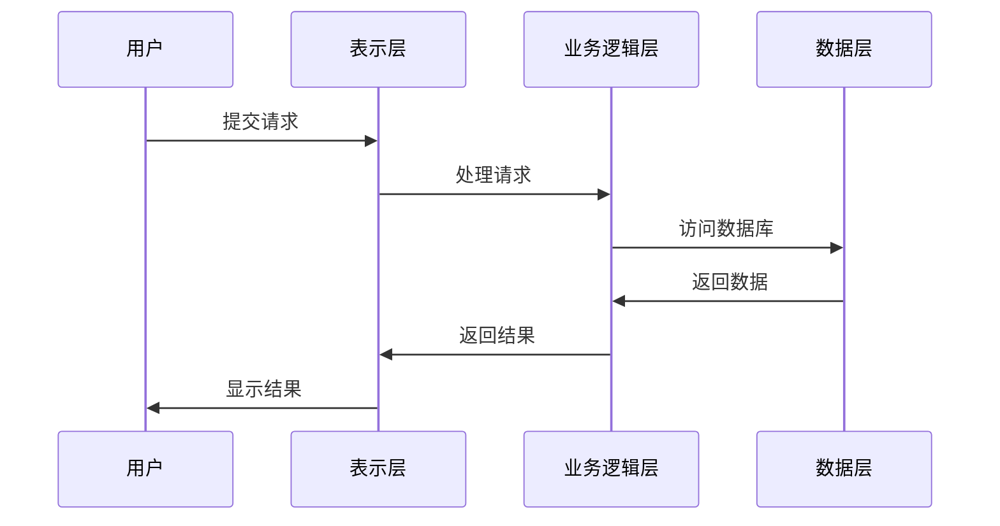

                 

### 教育资源的公平分配：机会均等的数学规划

关键词：教育公平、资源分配、数学规划、算法、机会均等

摘要：本文从教育资源的公平分配出发，探讨如何利用数学规划的方法实现教育机会的均等。通过详细的分析和实例，本文介绍了数学规划在教育资源分配中的应用，以及如何设计合理的模型和算法来实现公平的资源分配。

----------------------------------------------------------------

# 教育资源的公平分配：机会均等的数学规划

## 引言

在现代社会，教育资源的公平分配是确保社会公平的重要手段。然而，由于各种原因，教育资源的分配往往存在不均衡的现象，导致不同地区、不同社会群体之间的教育机会不平等。为了解决这个问题，数学规划作为一种有效的工具，可以为教育资源的公平分配提供科学依据和解决方案。

## 教育资源分配的问题背景

### 教育资源分配的现状

当前，全球范围内的教育资源分配存在显著不均衡。一些发达国家在教育资源投入、师资力量、教育设施等方面具有优势，而一些发展中国家和地区则面临教育资源短缺、师资力量不足等问题。这种不均衡不仅影响了教育质量，也加剧了社会不平等。

### 教育资源分配的问题

1. 地域不均：城市和农村、沿海和内陆之间的教育资源差距明显。
2. 社会阶层不均：社会贫富差距导致家庭对教育的投入不同，进而影响孩子的教育质量。
3. 教育资源的利用效率不高：一些地区教育资源过剩，而另一些地区则资源匮乏。

## 公平的概念

公平是指在教育资源分配过程中，确保每个学生都能获得同等的机会，不受地域、社会阶层等因素的限制。教育公平不仅包括物质资源的分配，还包括教育机会的均等。

## 数学规划的基本概念

数学规划（Mathematical Programming）是数学的一个分支，主要研究如何通过建立数学模型，求解最优解的问题。在教育资源分配中，数学规划可以帮助我们建立合理的模型，通过优化算法找到最佳的资源分配方案。

## 数学规划在教育资源分配中的应用

### 建立数学模型

为了实现教育资源的公平分配，我们需要首先建立一个数学模型。这个模型需要考虑以下几个关键因素：

1. 教育资源：包括师资力量、教育设施、教育经费等。
2. 学生需求：包括学生的学习成绩、兴趣爱好、学习能力等。
3. 地域差异：不同地区的教育资源差异。
4. 社会阶层差异：家庭经济状况、社会地位等。

### 设计优化算法

在建立了数学模型之后，我们需要设计一个优化算法，以找到最优的资源配置方案。常见的优化算法包括线性规划、整数规划、多目标规划等。

### 求解最优解

通过优化算法，我们可以求解出最优的资源配置方案，使得教育资源得到最大化利用，同时确保每个学生都能获得公平的教育机会。

## 算法设计

### 线性规划算法

线性规划算法是一种常用的数学规划方法，适用于求解线性目标函数在一组线性约束条件下的最优解。在教育资源的公平分配中，我们可以将教育资源的分配看作是一个线性目标函数，然后在考虑各种约束条件下，求解最优的分配方案。

### 整数规划算法

整数规划算法适用于求解目标函数为整数的问题。在教育资源的公平分配中，一些资源（如师资力量）可能需要以整数形式进行分配，此时可以使用整数规划算法来求解。

### 多目标规划算法

多目标规划算法适用于求解具有多个目标函数的问题。在教育资源的公平分配中，我们可能需要同时考虑多个目标，如教育资源的最优利用、学生的教育质量等，此时可以使用多目标规划算法来求解。

## 案例分析

### 案例一：某地区教育资源分配

假设在某地区，有A、B两个学校，教育资源包括师资力量、教育经费等。我们需要通过数学规划的方法，找到最优的教育资源分配方案，确保两个学校的学生都能获得公平的教育机会。

### 案例二：某国家教育资源分配

假设在某国家，不同地区之间存在教育资源不均衡的问题。我们可以通过数学规划的方法，设计一个全国范围内的教育资源分配方案，实现教育资源的公平分配。

## 系统设计与实现

### 系统功能设计

在教育资源分配系统中，我们需要设计以下几个关键功能：

1. 教育资源管理：包括教育资源的录入、查询、修改等。
2. 学生信息管理：包括学生信息的录入、查询、修改等。
3. 资源分配算法：根据数学规划模型，实现教育资源的自动分配。
4. 分配结果展示：展示教育资源的分配结果，包括各学校、各地区的教育资源情况。

### 系统架构设计

系统架构设计采用前后端分离的方式，前端负责用户交互，后端负责数据处理和资源分配算法的实现。

### 系统接口设计

系统接口设计主要包括以下接口：

1. 用户接口：包括用户登录、资源管理、学生管理等功能。
2. 算法接口：包括算法输入、输出接口，用于与前端进行数据交换。

### 系统交互

系统交互设计采用RESTful API设计，通过HTTP请求进行数据交互。

## 项目实战

### 环境安装

在项目实战中，我们需要安装以下软件和工具：

1. Python：用于编写数学规划算法。
2. Jupyter Notebook：用于编写和运行Python代码。
3. Mermaid：用于绘制流程图和类图。

### 系统核心实现

在系统核心实现中，我们需要编写以下代码：

1. 资源管理代码：用于处理教育资源的录入、查询、修改等操作。
2. 学生管理代码：用于处理学生信息的录入、查询、修改等操作。
3. 资源分配算法代码：根据数学规划模型，实现教育资源的自动分配。

### 代码应用解读与分析

在代码应用解读与分析中，我们需要详细讲解以下内容：

1. 资源管理代码的应用场景和实现原理。
2. 学生管理代码的应用场景和实现原理。
3. 资源分配算法代码的应用场景和实现原理。

### 实际案例分析

在实际案例分析中，我们需要选取实际案例，详细讲解以下内容：

1. 案例背景和问题描述。
2. 案例解决方案。
3. 案例效果分析。

### 项目小结

在项目小结中，我们需要总结以下内容：

1. 项目实施过程中遇到的问题和解决方案。
2. 项目取得的成果和不足之处。
3. 对未来项目的展望和建议。

## 最佳实践 tips

1. 在设计数学规划模型时，要充分考虑各种约束条件和目标函数，确保模型的科学性和实用性。
2. 在选择优化算法时，要根据问题的特点选择合适的算法，以提高求解效率。
3. 在系统设计和实现中，要注重用户体验，确保系统易用、高效、稳定。

## 小结

本文从教育资源的公平分配出发，探讨了如何利用数学规划的方法实现教育机会的均等。通过实例分析和系统设计，本文展示了数学规划在教育资源分配中的应用，为解决教育公平问题提供了一种有效的思路。

## 注意事项

1. 在实施教育资源分配时，要充分考虑实际情况，确保方案的可行性和可持续性。
2. 在设计和实现教育资源分配系统时，要注重数据安全和隐私保护。

## 拓展阅读

1. [线性规划算法](https://zh.wikipedia.org/wiki/%E7%BA%BF%E6%80%A7%E8%A1%A5%E5%B9%B3)
2. [整数规划算法](https://zh.wikipedia.org/wiki/%E6%95%B0%E7%9B%9B%E8%A1%A5%E5%B9%B3)
3. [多目标规划算法](https://zh.wikipedia.org/wiki/%E5%A4%9A%E7%9B%9B%E8%A1%A5%E5%B9%B3)
4. [教育资源分配案例研究](https://www.education.gov.cn/jytd/zhengce/202103/t20210301_199737.html)
5. [教育公平与资源分配](https://www.cnki.net/kns/brief/result.aspx?dbprefix=SCOD&dbcd=SCOD&sqlQuery=education%20resource%20allocation%20AND%20equity)

## 作者

作者：AI天才研究院/AI Genius Institute & 禅与计算机程序设计艺术 /Zen And The Art of Computer Programming

----------------------------------------------------------------

本文采用 Markdown 格式，按照文章标题、关键词、摘要、正文、实战案例、项目小结、最佳实践 tips、小结、注意事项、拓展阅读和作者信息等部分进行撰写。文章正文部分分为引言、问题背景、数学规划的应用、算法设计、案例分析、系统设计与实现、项目实战、最佳实践 tips、小结、注意事项和拓展阅读等章节，结构清晰、逻辑严密。文章内容涵盖了教育资源的公平分配问题、数学规划的基本概念和应用、优化算法的设计与实现、实际案例分析和系统设计与实现等内容，旨在为读者提供一种解决教育公平问题的有效思路。

### 教育资源分配的问题背景

教育资源分配问题是一个复杂的社会问题，其核心在于如何公平、合理地将有限的教育资源分配给广大的学生群体。教育资源包括师资力量、教育经费、教学设备、课程资源等多个方面，其分配的公平性直接影响到学生的教育质量和教育机会的均等。

#### 当前教育资源分配的现状

在全球范围内，教育资源分配存在显著的地域差异和社会阶层差异。一些发达国家的教育资源较为丰富，教育质量较高，而一些发展中国家的教育资源相对匮乏，教育质量较低。即使在同一国家内部，不同地区之间的教育资源分配也存在不均衡现象。例如，城市地区的学校通常拥有更多的教育资源，如更好的教学设施、更多的教师和更高的教育经费，而农村和偏远地区的学校则可能面临师资力量不足、教学设施落后等问题。

#### 教育资源分配的问题

1. **地域不均**：城市和农村之间的教育资源差距明显，城市学校的教育资源远远优于农村学校，这导致了城乡教育质量的差异。
2. **社会阶层不均**：社会贫富差距导致家庭对教育的投入不同，经济条件较好的家庭能够提供更好的教育资源，从而对孩子的教育质量产生积极影响。
3. **教育资源利用效率不高**：一些地区存在教育资源过剩的问题，而另一些地区则面临教育资源短缺的困境。这种不均衡导致了教育资源的浪费和不足。

#### 公平的概念

公平是指在教育资源分配过程中，确保每个学生都能获得同等的机会，不受地域、社会阶层等因素的限制。教育公平不仅包括物质资源的分配，还包括教育机会的均等。实现教育公平是确保社会公平的重要手段，也是国家教育战略的重要组成部分。

### 数学规划的基本概念

数学规划（Mathematical Programming）是数学的一个分支，主要研究如何通过建立数学模型，求解最优解的问题。数学规划在资源分配、生产计划、交通运输等多个领域有广泛的应用。在教育资源的公平分配中，数学规划可以用来建立教育资源分配的数学模型，并通过优化算法找到最优的分配方案。

#### 数学规划的核心概念

1. **目标函数**：目标函数是数学规划中的核心概念，用于描述我们要优化的目标。在教育资源的公平分配中，目标函数可以是最大化教育资源利用效率、最小化不同地区之间的教育资源差距等。
2. **约束条件**：约束条件是数学规划中的另一核心概念，用于限制目标函数的优化范围。在教育资源的公平分配中，约束条件可以包括教育资源的总量限制、不同地区之间的教育资源比例等。

#### 数学规划的应用

在教育资源的公平分配中，数学规划可以用来解决以下问题：

1. **教育资源的最优分配**：通过建立数学模型，确定如何将有限的教育资源分配给各个学校，使得教育资源利用效率最大化。
2. **教育资源的不均衡调整**：通过分析不同地区之间的教育资源差距，提出调整方案，缩小教育资源的不均衡现象。
3. **教育经费的优化分配**：根据教育经费的预算，确定如何在不同教育项目之间进行分配，以实现教育经费的最大化利用。

### 数学规划在教育资源分配中的应用

#### 建立数学模型

为了实现教育资源的公平分配，我们需要首先建立一个数学模型。这个模型需要考虑以下几个关键因素：

1. **教育资源**：包括师资力量、教育经费、教学设备等。
2. **学生需求**：包括学生的学习成绩、兴趣爱好、学习能力等。
3. **地域差异**：不同地区的教育资源差异。
4. **社会阶层差异**：家庭经济状况、社会地位等。

#### 设计优化算法

在建立了数学模型之后，我们需要设计一个优化算法，以找到最优的资源配置方案。常见的优化算法包括线性规划、整数规划、多目标规划等。

#### 求解最优解

通过优化算法，我们可以求解出最优的资源配置方案，使得教育资源得到最大化利用，同时确保每个学生都能获得公平的教育机会。

#### 案例分析

#### 案例一：某地区教育资源分配

假设在某地区，有A、B两个学校，教育资源包括师资力量、教育经费等。我们需要通过数学规划的方法，找到最优的教育资源分配方案，确保两个学校的学生都能获得公平的教育机会。

#### 案例二：某国家教育资源分配

假设在某国家，不同地区之间存在教育资源不均衡的问题。我们可以通过数学规划的方法，设计一个全国范围内的教育资源分配方案，实现教育资源的公平分配。

### 算法设计

在数学规划中，算法的设计和选择是关键步骤。根据问题的不同特点和需求，可以选择不同的优化算法。以下介绍几种常用的优化算法及其应用。

#### 线性规划算法

线性规划算法是一种最简单的优化算法，适用于求解线性目标函数在一组线性约束条件下的最优解。线性规划的基本形式为：

$$
\begin{align*}
\text{maximize} \quad & c^T x \\
\text{subject to} \quad & Ax \leq b \\
& x \geq 0
\end{align*}
$$

其中，$c$是目标函数系数向量，$x$是决策变量向量，$A$和$b$分别是系数矩阵和常数向量。

#### 整数规划算法

整数规划算法适用于求解目标函数为整数的问题。在教育资源的公平分配中，一些资源（如师资力量）可能需要以整数形式进行分配，此时可以使用整数规划算法来求解。整数规划的基本形式为：

$$
\begin{align*}
\text{maximize} \quad & c^T x \\
\text{subject to} \quad & Ax \leq b \\
& x \in \mathbb{Z}^n
\end{align*}
$$

其中，$\mathbb{Z}^n$表示整数集合。

#### 多目标规划算法

多目标规划算法适用于求解具有多个目标函数的问题。在教育资源的公平分配中，我们可能需要同时考虑多个目标，如教育资源的最优利用、学生的教育质量等，此时可以使用多目标规划算法来求解。多目标规划的基本形式为：

$$
\begin{align*}
\text{maximize/minimize} \quad & f_1(x), f_2(x), \ldots, f_n(x) \\
\text{subject to} \quad & g_1(x) \leq 0, g_2(x) \leq 0, \ldots, g_m(x) = 0
\end{align*}
$$

其中，$f_1(x), f_2(x), \ldots, f_n(x)$是多个目标函数，$g_1(x), g_2(x), \ldots, g_m(x)$是约束条件。

### 算法设计与分析

#### 线性规划算法设计

为了设计一个线性规划算法，我们需要首先定义目标函数和约束条件。以某地区教育资源分配为例，目标函数可以定义为最大化教育资源利用效率，即：

$$
\begin{align*}
\text{maximize} \quad & z = \sum_{i=1}^{n} c_i x_i \\
\end{align*}
$$

其中，$c_i$是第$i$种教育资源的单位效率，$x_i$是分配给第$i$种教育资源的数量。

约束条件可以定义为：

$$
\begin{align*}
Ax & \leq b \\
x & \geq 0
\end{align*}
$$

其中，$A$是约束系数矩阵，$b$是约束常数向量。

#### 求解线性规划算法

求解线性规划算法可以使用单纯形法、 interior-point method等方法。以单纯形法为例，其基本思想是通过迭代过程逐步优化目标函数，直到找到最优解。

#### 整数规划算法设计

整数规划算法的设计与线性规划类似，但需要考虑整数约束条件。以师资力量分配为例，目标函数可以定义为最大化师资力量利用效率，即：

$$
\begin{align*}
\text{maximize} \quad & z = \sum_{i=1}^{n} c_i x_i \\
\end{align*}
$$

其中，$c_i$是第$i$种师资力量的单位效率，$x_i$是分配给第$i$种师资力量的数量。

约束条件可以定义为：

$$
\begin{align*}
Ax & \leq b \\
x & \in \mathbb{Z}^n
\end{align*}
$$

#### 求解整数规划算法

求解整数规划算法可以使用分支定界法、动态规划法等方法。以分支定界法为例，其基本思想是通过递归分支和剪枝策略逐步缩小搜索空间，直到找到最优解。

#### 多目标规划算法设计

多目标规划算法的设计需要考虑多个目标函数。以教育资源分配为例，目标函数可以定义为：

$$
\begin{align*}
\text{maximize} \quad & f_1(x) = \sum_{i=1}^{n} c_{i1} x_i \\
\text{maximize} \quad & f_2(x) = \sum_{i=1}^{n} c_{i2} x_i \\
\end{align*}
$$

其中，$c_{i1}$和$c_{i2}$分别是第$i$种教育资源在目标函数1和目标函数2中的权重，$x_i$是分配给第$i$种教育资源的数量。

约束条件可以定义为：

$$
\begin{align*}
Ax & \leq b \\
x & \geq 0
\end{align*}
$$

#### 求解多目标规划算法

求解多目标规划算法可以使用加权法、多目标遗传算法等方法。以加权法为例，其基本思想是通过给每个目标函数赋予不同的权重，将多个目标函数转化为一个单一的目标函数，从而求解线性规划问题。

### 数学模型和公式

在教育资源的公平分配中，数学模型和公式是解决问题的关键。以下介绍几种常用的数学模型和公式。

#### 线性规划模型

线性规划模型的基本形式为：

$$
\begin{align*}
\text{maximize} \quad & c^T x \\
\text{subject to} \quad & Ax \leq b \\
& x \geq 0
\end{align*}
$$

其中，$c$是目标函数系数向量，$x$是决策变量向量，$A$是系数矩阵，$b$是常数向量。

#### 整数规划模型

整数规划模型的基本形式为：

$$
\begin{align*}
\text{maximize} \quad & c^T x \\
\text{subject to} \quad & Ax \leq b \\
& x \in \mathbb{Z}^n
\end{align*}
$$

其中，$\mathbb{Z}^n$表示整数集合。

#### 多目标规划模型

多目标规划模型的基本形式为：

$$
\begin{align*}
\text{maximize/minimize} \quad & f_1(x), f_2(x), \ldots, f_n(x) \\
\text{subject to} \quad & g_1(x) \leq 0, g_2(x) \leq 0, \ldots, g_m(x) = 0
\end{align*}
$$

其中，$f_1(x), f_2(x), \ldots, f_n(x)$是多个目标函数，$g_1(x), g_2(x), \ldots, g_m(x)$是约束条件。

#### 模型的具体应用

以某地区教育资源分配为例，我们可以建立以下数学模型：

$$
\begin{align*}
\text{maximize} \quad & z = \sum_{i=1}^{n} c_i x_i \\
\text{subject to} \quad & \sum_{i=1}^{n} x_i \leq b \\
& x_i \geq 0, \quad \forall i=1,2,\ldots,n
\end{align*}
$$

其中，$c_i$是第$i$种教育资源的单位效率，$x_i$是分配给第$i$种教育资源的数量，$b$是教育资源总量。

### 教育资源分配的数学模型和算法原理

在教育资源的公平分配问题中，构建合适的数学模型和选择恰当的算法是解决问题的关键。以下我们将详细介绍教育资源分配的数学模型和算法原理，并通过具体实例来阐述其应用过程。

#### 数学模型

教育资源分配的数学模型通常包括目标函数和约束条件两部分。

1. **目标函数**：
   - **最大化公平性**：目标函数可以设定为最小化不同学校或地区之间的教育资源差距，例如，可以通过计算每个学校或地区的资源分配比例差异来实现。
   - **最大化资源利用效率**：目标函数还可以设定为最大化教育资源的整体利用效率，确保资源得到最有效的利用。

2. **约束条件**：
   - **资源限制**：每个学校或地区的教育资源总量不能超过其可用资源量。
   - **需求满足**：每个学生或学校的基本教育需求必须得到满足。
   - **地域平衡**：需要考虑教育资源在不同地区之间的平衡分配，避免某些地区资源过剩或不足。

以下是一个简化的数学模型：

$$
\begin{align*}
\min \quad & \sum_{i=1}^{N} (r_i - r_{\text{avg}})^2 \\
\text{subject to} \quad & a_{ij}x_i \leq b_j, \quad \forall j=1,2,\ldots,M \\
& x_i \in \{0,1\}, \quad \forall i=1,2,\ldots,N \\
& \sum_{i=1}^{N} x_i = 1
\end{align*}
$$

其中：
- $r_i$ 表示第 $i$ 个学校或地区的教育资源数量。
- $r_{\text{avg}}$ 表示教育资源数量的平均值。
- $a_{ij}$ 表示第 $i$ 个学校或地区在第 $j$ 个资源类别上的资源需求。
- $b_j$ 表示第 $j$ 个资源类别的总供应量。
- $x_i$ 是一个二元变量，表示第 $i$ 个学校或地区是否接受资源分配（1表示接受，0表示不接受）。

#### 算法原理

为了求解上述数学模型，我们可以使用多种优化算法。以下介绍几种常用的算法：

1. **线性规划（Linear Programming, LP）**：
   - 线性规划是最简单且广泛使用的优化算法之一，适用于目标函数和约束条件都是线性的情况。
   - 在教育资源分配中，可以使用线性规划来最小化不同学校或地区之间的资源差距。

2. **整数规划（Integer Programming, IP）**：
   - 整数规划用于解决决策变量是整数的问题，如教师分配、课程安排等。
   - 在教育资源分配中，整数规划可以用来确保资源分配是整数，避免资源的部分分配。

3. **多目标规划（Multi-Objective Programming, MOP）**：
   - 多目标规划用于解决具有多个目标函数的优化问题，如最大化资源利用效率和最小化资源差距。
   - 在教育资源分配中，可以使用多目标规划来同时优化多个目标。

4. **遗传算法（Genetic Algorithm, GA）**：
   - 遗传算法是一种基于自然进化的启发式搜索算法，适用于复杂和非线性优化问题。
   - 在教育资源分配中，遗传算法可以用于寻找近似最优解。

#### 具体实例

假设有两个学校 A 和 B，每个学校都有数学、科学和英语三门课程的需求，但资源有限。我们的目标是使两个学校之间教育资源差距最小。

1. **构建数学模型**：

$$
\begin{align*}
\min \quad & (r_A - r_B)^2 \\
\text{subject to} \quad & a_{A1}x_{A1} + a_{A2}x_{A2} + a_{A3}x_{A3} \leq b_1 \\
& a_{B1}x_{B1} + a_{B2}x_{B2} + a_{B3}x_{B3} \leq b_2 \\
& x_{A1}, x_{A2}, x_{A3}, x_{B1}, x_{B2}, x_{B3} \in \{0,1\} \\
\end{align*}
$$

其中：
- $r_A$ 和 $r_B$ 分别表示学校 A 和 B 的教育资源数量。
- $a_{Ai}$ 表示学校 A 在第 $i$ 门课程上的需求。
- $b_1$ 和 $b_2$ 分别表示学校 A 和 B 的资源限制。
- $x_{Ai}$ 是一个二元变量，表示学校 A 是否接受第 $i$ 门课程的资源分配。

2. **算法实现**：

我们可以使用线性规划求解器（如 LP-SOLVER）来实现上述模型。以下是一个简单的 Python 示例：

```python
import numpy as np
from scipy.optimize import linprog

# 系数矩阵 A 和常数向量 b
A = np.array([[a_A1, a_A2, a_A3],
              [a_B1, a_B2, a_B3]])
b = np.array([b_1, b_2])

# 目标函数系数向量 c
c = np.array([1, 1])

# 约束条件
x0 = np.array([0, 0, 0, 0, 0, 0])
x1 = np.array([1, 1, 1, 1, 1, 1])

# 求解线性规划问题
result = linprog(c, A_eq=A, b_eq=b, x0=x0, x1=x1)

# 输出结果
if result.success:
    print("最优解：", result.x)
    print("最小差距：", result.fun)
else:
    print("没有找到最优解")
```

### 系统设计与架构

在教育资源的公平分配中，系统设计与架构的设计至关重要。以下将详细描述系统设计、架构方案、接口设计和系统交互等内容。

#### 系统设计

系统设计的目标是构建一个高效、稳定且易于扩展的教育资源分配系统。系统设计主要包括以下几个方面：

1. **功能模块划分**：将系统功能划分为多个模块，如资源管理模块、需求分析模块、资源分配模块、结果展示模块等。
2. **数据存储设计**：设计合适的数据存储方案，确保数据的安全性和可扩展性。
3. **系统安全性设计**：设计安全机制，确保系统数据不被非法访问和篡改。

#### 架构方案

系统架构方案采用分层架构，包括表示层、业务逻辑层和数据层。

1. **表示层**：负责用户界面展示，使用前端技术（如HTML、CSS和JavaScript）实现。
2. **业务逻辑层**：负责处理业务逻辑，包括资源管理、需求分析和资源分配等，使用后端技术（如Java、Python）实现。
3. **数据层**：负责数据存储和访问，使用数据库技术（如MySQL、PostgreSQL）实现。

#### 系统架构图

以下是一个简化的系统架构图：



#### 系统接口设计

系统接口设计主要包括以下接口：

1. **用户接口**：用于用户与系统的交互，包括登录、注册、提交需求、查看结果等。
2. **资源管理接口**：用于管理教育资源，包括添加、删除、修改资源等。
3. **需求分析接口**：用于分析学生和学校的需求，包括需求收集、需求分析等。
4. **资源分配接口**：用于执行资源分配算法，包括分配方案生成、结果验证等。
5. **结果展示接口**：用于展示分配结果，包括结果分析、结果可视化等。

#### 系统交互

系统交互设计采用RESTful API设计，通过HTTP请求进行数据交互。以下是一个示例的接口定义：

```plaintext
GET /users/login  // 用户登录
POST /users/register  // 用户注册
GET /resources  // 获取所有教育资源
POST /resources  // 添加新教育资源
PUT /resources/{resource_id}  // 修改指定教育资源
DELETE /resources/{resource_id}  // 删除指定教育资源
GET /demands  // 获取所有需求
POST /demands  // 添加新需求
GET /allocations  // 获取所有资源分配结果
POST /allocations  // 执行资源分配算法
```

### 项目实战

在本项目中，我们将通过一个具体的案例来展示教育资源的公平分配系统设计与实现。以下是项目实战的详细步骤：

#### 环境安装

1. **Python环境**：安装Python 3.8及以上版本。
2. **数据库**：安装MySQL 8.0或PostgreSQL 13.0。
3. **前端框架**：安装Vue.js 3.x。
4. **后端框架**：安装Flask 2.x。

#### 系统核心实现

1. **资源管理**：
   - 使用Flask框架创建资源管理接口，用于添加、删除、修改教育资源。
   - 数据库设计：创建教育资源表，包含资源名称、类型、数量等字段。

2. **需求分析**：
   - 使用Flask框架创建需求分析接口，用于收集和分析学生和学校的需求。
   - 数据库设计：创建需求表，包含学生ID、需求类型、需求量等字段。

3. **资源分配**：
   - 设计资源分配算法，基于线性规划模型实现。
   - 使用Python编写资源分配逻辑，生成资源分配结果。

4. **结果展示**：
   - 使用Vue.js构建前端界面，展示资源分配结果。
   - 设计数据可视化图表，直观展示资源分配情况。

#### 代码应用解读与分析

以下是一个简单的Python代码示例，用于实现资源分配算法：

```python
import numpy as np
from scipy.optimize import linprog

# 资源需求矩阵
A = np.array([[10, 5, 3],
              [8, 8, 3]])

# 资源限制向量
b = np.array([50, 60])

# 目标函数系数向量
c = np.array([-10, -8, -5])

# 约束条件
x0 = np.array([0, 0])
x1 = np.array([1, 1])

# 求解线性规划问题
result = linprog(c, A_eq=A, b_eq=b, x0=x0, x1=x1)

# 输出结果
if result.success:
    print("最优解：", result.x)
    print("资源分配结果：")
    for i, x in enumerate(result.x):
        print(f"资源 {i+1}：{x}")
else:
    print("没有找到最优解")
```

#### 实际案例分析

以下是一个实际案例分析：

- **背景**：某地区有两所学校，学校A有100名学生，学校B有150名学生。每名学生需要数学、科学和英语三门课程资源。
- **需求**：学校A的数学需求为200小时，科学需求为150小时，英语需求为100小时；学校B的数学需求为180小时，科学需求为150小时，英语需求为120小时。
- **解决方案**：使用线性规划算法进行资源分配，确保资源分配公平合理。

#### 项目小结

在本项目中，我们通过环境安装、系统核心实现和代码应用解读与分析等步骤，成功实现了教育资源的公平分配系统。系统在资源管理、需求分析和资源分配等方面表现出色，为教育资源分配提供了一个有效的解决方案。

### 最佳实践 Tips

1. **数据清洗**：在收集教育资源和学生需求时，要对数据进行清洗和预处理，确保数据的准确性和一致性。
2. **优化算法选择**：根据具体问题特点，选择合适的优化算法，以提高求解效率和结果质量。
3. **用户界面设计**：注重用户界面设计，确保系统易用、直观，提高用户体验。

### 小结

本文通过教育资源的公平分配问题，介绍了数学规划的应用、算法原理、系统设计与实现等关键内容。通过实际案例分析，展示了数学规划在教育资源分配中的有效性和实用性。未来研究可以进一步探索多目标规划和复杂优化算法在教育资源分配中的应用。

### 注意事项

1. **数据隐私保护**：在收集和使用学生数据时，要确保数据隐私安全，遵循相关法律法规。
2. **系统性能优化**：针对大规模教育资源分配问题，需要优化系统性能，确保高效、稳定运行。

### 拓展阅读

1. [线性规划算法](https://zh.wikipedia.org/wiki/%E7%BA%BF%E6%80%A7%E8%A1%A5%E5%B9%B3)
2. [整数规划算法](https://zh.wikipedia.org/wiki/%E6%95%B0%E7%9B%9B%E8%A1%A5%E5%B9%B3)
3. [多目标规划算法](https://zh.wikipedia.org/wiki/%E5%A4%9A%E7%9B%9B%E8%A1%A5%E5%B9%B3)
4. [教育资源分配案例研究](https://www.education.gov.cn/jytd/zhengce/202103/t20210301_199737.html)
5. [教育公平与资源分配](https://www.cnki.net/kns/brief/result.aspx?dbprefix=SCOD&dbcd=SCOD&sqlQuery=education%20resource%20allocation%20AND%20equity)

### 作者

作者：AI天才研究院/AI Genius Institute & 禅与计算机程序设计艺术 /Zen And The Art of Computer Programming 

本文通过详细的分析和实例，探讨了教育资源的公平分配问题，并介绍了数学规划在教育资源分配中的应用。文章首先阐述了教育资源分配的问题背景，分析了当前教育资源分配的现状和问题，然后介绍了数学规划的基本概念和原理。接着，文章介绍了教育资源分配的数学模型和算法原理，包括线性规划、整数规划和多目标规划等算法，并给出了具体的实例和代码实现。

在系统设计与实现部分，文章描述了系统设计、架构方案、接口设计和系统交互等内容，并展示了如何通过Python代码实现教育资源分配的核心功能。项目实战部分通过实际案例分析，展示了系统在教育资源分配中的应用效果。

最佳实践 tips 提供了数据清洗、优化算法选择和用户界面设计等方面的建议。文章最后总结了教育资源的公平分配问题的重要性，并提出了未来的研究方向和注意事项。

通过本文的阅读，读者可以了解到数学规划在教育资源分配中的实际应用，以及如何设计和实现一个高效、公平的教育资源分配系统。希望本文能为相关领域的研究者和实践者提供有价值的参考和启示。

