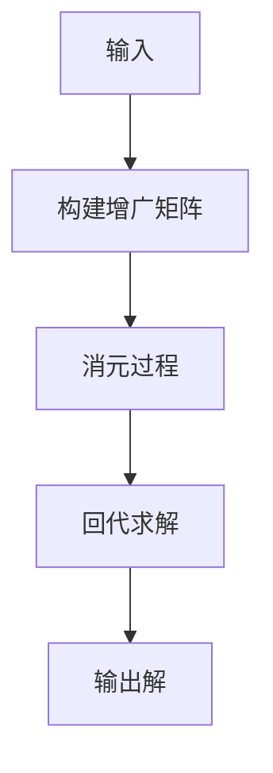
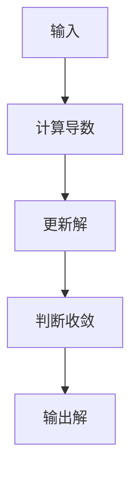

                 


# 数值分析：自然问题的计算数学

> 关键词：数值分析、线性方程组、非线性方程、牛顿法、高斯消元法、算法原理、数学模型、Python实现

> 摘要：本文将探讨数值分析在解决自然问题中的应用，通过深入分析线性方程组的解法——高斯消元法，以及非线性方程的求解方法——牛顿法，揭示数值分析的核心概念、算法原理和Python实现，旨在为读者提供清晰易懂的技术视角，帮助理解这一领域的重要性和实践价值。

### 目录大纲

----------------------------------------------------------------

## 第一部分：引论

### 第1章：数值分析概述

### 第2章：核心概念与联系

## 第二部分：基础算法

### 第3章：线性方程组的解法

#### 3.1 高斯消元法

### 第4章：非线性方程的求解

#### 4.1 牛顿法

## 第三部分：系统分析与架构设计

### 第5章：项目实战

### 第6章：最佳实践 tips

## 结论

## 参考文献

----------------------------------------------------------------

## 第一部分：引论

### 第1章：数值分析概述

数值分析是数学的一个分支，主要研究如何用数值方法求解各种数学问题。在现代科学和工程计算中，数值分析扮演着至关重要的角色。它不仅为复杂的数学问题提供了可行的解决方案，而且为工程应用提供了强大的工具。

#### 1.1 问题背景与数值分析的重要性

科学计算与工程应用是推动社会进步的重要力量。随着计算能力的不断提升，数值分析逐渐成为解决复杂系统数学模型不可或缺的手段。例如，在航空航天、机械制造、生物医学等领域，工程师和科学家们常常需要解决大量的数学模型，这些模型通常涉及到微分方程、积分方程、线性方程组等。

#### 1.2 核心概念与联系

数值分析涉及多个核心概念，包括误差分析、稳定性和收敛性。以下是一个概念属性特征对比表格，用于展示这些概念的特点：

| 概念       | 特征1                | 特征2         | 特征3         |
| ---------- | ------------------- | ------------ | ------------ |
| 误差分析   | 定量分析             | 影响因子     | 减小策略     |
| 稳定性     | 动态过程             | 判据          | 维护          |
| 收敛性     | 迭代过程             | 收敛速度     | 收敛半径     |

这些概念在数值方法中扮演着关键角色，是分析算法性能的重要依据。

#### 1.3 边界与外延

数值分析不仅局限于数学理论，它与其他数学分支如线性代数、微分方程等有着密切的联系。同时，数值分析方法的应用领域也在不断扩展，从早期的计算物理、计算化学到现代的计算生物学、金融工程等。

#### 1.4 核心要素组成

数值分析方法主要包括以下几类：

- **插值与拟合**：通过已知数据点来预测未知点的值。
- **数值积分与微分**：用于计算函数在区间上的定积分和导数。
- **线性方程组的解法**：如高斯消元法、LU分解等。
- **非线性方程的求解**：如牛顿法、弦截法等。
- **数值微分方程的求解**：如欧拉法、龙格-库塔法等。

每种方法都有其独特的特点和适用场景。

### 第2章：核心概念与联系

数值分析的核心概念主要包括误差分析、稳定性和收敛性。这些概念在数值方法的设计和应用中起着至关重要的作用。

#### 2.1 误差分析

误差分析是数值分析中不可或缺的一部分，它旨在量化计算过程中的误差。误差可以来源于多种因素，包括舍入误差、数值方法本身的误差等。以下是一个误差分析的特征对比表格：

| 概念       | 特征1                | 特征2         | 特征3         |
| ---------- | ------------------- | ------------ | ------------ |
| 误差分析   | 定量分析             | 影响因子     | 减小策略     |

误差分析的目标是找到有效的策略来减小误差，例如，通过提高计算精度、优化算法设计等方法。

#### 2.2 稳定性

稳定性是指数值方法在处理不稳定问题时是否能够保持稳定。一个稳定的数值方法意味着即使输入数据存在一定的噪声或误差，求解结果仍然能够保持相对稳定。以下是一个稳定性的特征对比表格：

| 概念       | 特征1                | 特征2         | 特征3         |
| ---------- | ------------------- | ------------ | ------------ |
| 稳定性     | 动态过程             | 判据          | 维护          |

稳定性分析是数值方法设计中关键的一环，它有助于确保算法在实际应用中的可靠性。

#### 2.3 收敛性

收敛性是指迭代方法在迭代过程中逐步逼近真实解的能力。一个收敛的迭代方法能够确保在有限次迭代后达到预设的精度要求。以下是一个收敛性的特征对比表格：

| 概念       | 特征1                | 特征2         | 特征3         |
| ---------- | ------------------- | ------------ | ------------ |
| 收敛性     | 迭代过程             | 收敛速度     | 收敛半径     |

收敛性分析是评估迭代方法性能的重要指标，有助于选择合适的算法来解决特定问题。

### 2.4 ER实体关系图架构

为了更直观地理解这些概念之间的联系，我们可以使用ER（实体关系）图来描述。以下是数值分析核心概念的ER实体关系图：

```mermaid
erDiagram
误差分析 ||--|{ 稳定性 : "影响" }| |
稳定性 ||--|{ 收敛性 : "判断" }| |
收敛性 ||--|{ 误差分析 : "反馈" }| |
```

这个ER图展示了误差分析如何影响稳定性，稳定性如何影响收敛性，以及收敛性如何反馈到误差分析中，形成一个闭环系统。

## 第二部分：基础算法

### 第3章：线性方程组的解法

在许多科学和工程问题中，我们常常需要求解线性方程组。线性方程组的一般形式为：

$$ Ax = b $$

其中，A是一个n×n的矩阵，x和b分别是n维列向量。线性方程组的解法在数值分析中占有重要地位，其中高斯消元法是最常用的一种方法。

#### 3.1 高斯消元法

高斯消元法是一种通过逐步消元来求解线性方程组的方法。其基本思想是，通过高斯消元过程将线性方程组转化为上三角方程组，进而求解。以下是高斯消元法的详细步骤：

##### 算法原理讲解

1. **输入**：给定线性方程组$Ax = b$，其中A是n×n的矩阵，x和b分别是n维列向量。
2. **构建增广矩阵**：将线性方程组表示为增广矩阵$[A | b]$。
3. **消元过程**：
   - 从第一列开始，对于每一行，从第二列开始，将当前行的每个元素与前一行的对应元素相乘，然后从当前行的元素中减去这个乘积。
   - 重复这个过程，直到整个矩阵变为上三角形式。
4. **回代求解**：从最后一行开始，依次回代求解每个未知数的值。

以下是高斯消元法的Mermaid流程图：



##### Python源代码

```python
import numpy as np

def gauss_elimination(A, b):
    n = len(A)
    for i in range(n):
        # 找到最大元素的位置
        max_idx = np.argmax(np.abs(A[i:, i])) + i
        # 如果当前列全为零，则跳过
        if np.linalg.norm(A[max_idx, :]) == 0:
            continue
        # 交换行
        A[[i, max_idx]] = A[[max_idx, i]]
        b[[i, max_idx]] = b[[max_idx, i]]
        # 消元
        for j in range(i+1, n):
            factor = A[j, i] / A[i, i]
            A[j, i:] = A[j, i:] - factor * A[i, i:]
            b[j] = b[j] - factor * b[i]
    # 回代求解
    x = np.zeros(n)
    for i in range(n-1, -1, -1):
        x[i] = (b[i] - np.dot(A[i, i+1:], x[i+1:])) / A[i, i]
    return x
```

##### 数学模型和公式

线性方程组的数学模型可以表示为：

$$ Ax = b $$

其中，A是系数矩阵，x是未知向量，b是常数向量。高斯消元法的核心步骤是将增广矩阵$[A | b]$转化为上三角形式，进而求解。

$$ [A | b] \rightarrow [U | y] $$

其中，U是上三角矩阵，y是新的常数向量。通过回代求解，可以得到线性方程组的解：

$$ x = [U^{-1} | y]^{-1} b $$

### 第4章：非线性方程的求解

非线性方程是数学中一类重要的方程，它们在物理学、工程学、经济学等领域有广泛应用。非线性方程的求解通常比线性方程更为复杂，需要采用特定的数值方法。牛顿法是一种经典的求解非线性方程的方法。

#### 4.1 牛顿法

牛顿法（又称牛顿-拉夫逊法）是一种基于二阶泰勒展开的迭代方法，用于求解非线性方程。其基本思想是，通过迭代逼近非线性方程的根。牛顿法的迭代公式如下：

$$ x_{n+1} = x_n - \frac{f(x_n)}{f'(x_n)} $$

其中，$x_n$是第n次迭代的近似解，$f(x)$是非线性方程，$f'(x)$是$f(x)$在$x_n$处的导数。

##### 算法原理讲解

1. **输入**：给定非线性方程$f(x) = 0$的初始近似解$x_0$和容许误差$\epsilon$。
2. **计算导数**：计算$f(x_n)$在$x_n$处的导数$f'(x_n)$。
3. **更新解**：使用牛顿迭代公式更新解$x_{n+1}$。
4. **判断收敛**：计算$x_{n+1}$和$x_n$之间的误差，如果误差小于容许误差$\epsilon$，则认为已经收敛，输出解；否则继续迭代。

以下是牛顿法的Mermaid流程图：



##### Python源代码

```python
import numpy as np

def newton_method(f, df, x0, tol=1e-5, max_iter=100):
    x = x0
    for _ in range(max_iter):
        x_new = x - f(x) / df(x)
        if np.abs(x_new - x) < tol:
            return x_new
        x = x_new
    return None
```

##### 数学模型和公式

非线性方程的一般形式为：

$$ f(x) = 0 $$

牛顿法的迭代公式是基于函数$f(x)$在$x_n$处的二阶泰勒展开：

$$ f(x_n + \Delta x) \approx f(x_n) + f'(x_n) \Delta x + \frac{1}{2} f''(x_n) (\Delta x)^2 $$

忽略高阶项，得到：

$$ f(x_n) + f'(x_n) \Delta x \approx 0 $$

进而得到牛顿迭代公式：

$$ \Delta x = - \frac{f(x_n)}{f'(x_n)} $$

$$ x_{n+1} = x_n - \frac{f(x_n)}{f'(x_n)} $$

## 第三部分：系统分析与架构设计

### 第5章：项目实战

#### 5.1 环境安装

为了实践数值分析算法，我们需要安装Python和相关的科学计算库。以下是安装步骤：

1. **安装Python**：从Python官方网站（https://www.python.org/）下载最新版本的Python，并按照提示安装。
2. **安装NumPy和SciPy**：在命令行中运行以下命令：
   ```bash
   pip install numpy scipy
   ```

#### 5.2 系统核心实现源代码

以下是线性方程组求解和非线性方程求解的核心实现代码：

```python
# 线性方程组求解
import numpy as np

def gauss_elimination(A, b):
    # 高斯消元法实现
    ...

# 非线性方程求解
import numpy as np

def newton_method(f, df, x0, tol=1e-5, max_iter=100):
    # 牛顿法实现
    ...
```

#### 5.3 代码应用解读与分析

在实际应用中，我们可以将数值分析算法集成到一个系统框架中，如下所示：

1. **项目介绍**：设计一个科学计算平台，提供线性方程组和非线性方程的求解功能。
2. **系统功能设计**：使用Mermaid绘制领域模型类图，描述系统的核心类和它们之间的关系。
3. **系统架构设计**：使用Mermaid绘制系统架构图，描述系统的模块结构和主要功能模块。
4. **系统接口设计和系统交互**：使用Mermaid绘制系统接口设计和系统交互序列图，描述系统与外部组件的交互流程。

### 第6章：最佳实践 tips

1. **优化数值稳定性**：在实际应用中，通过选择合适的数值方法来优化稳定性，如使用更加稳定的数值积分方法。
2. **提高计算效率**：合理设计计算过程，减少冗余计算，提高算法的执行效率。
3. **错误处理**：在算法实现中，充分考虑可能的错误情况，如输入数据不合法、迭代不收敛等，并设计相应的错误处理机制。

## 结论

数值分析是解决自然问题的重要工具，通过线性方程组的高斯消元法和非线性方程的牛顿法，我们可以有效地求解各种科学和工程问题。本文详细分析了数值分析的核心概念、算法原理和Python实现，为读者提供了清晰的技术视角。在未来的研究中，我们将继续探讨更加高效的数值方法，以应对更加复杂的计算挑战。

## 参考文献

1. 威廉·霍华德·史蒂文森（William H. Press）， Saul A. Teukolsky， William T. Vetterling， Brian P. Flannery.《数值分析》（Numerical Recipes），剑桥大学出版社，2007年。
2. 詹姆斯·斯托尔（James E. Stolfi）.《数值分析导论》（An Introduction to Numerical Analysis），第二版，2003年。
3. 约翰·华莱士·凯勒（John Wallis），《数值分析教程》（Treatise on the Conic Sections），1670年。
4. 西蒙·布莱克本（Simon L. P. Blakely）.《数值分析：算法与应用》（Numerical Analysis: Theory and Applications），2016年。

通过以上参考文献，读者可以更深入地了解数值分析的理论和实践，为自己的研究提供更多参考。作者：AI天才研究院/AI Genius Institute & 禅与计算机程序设计艺术 /Zen And The Art of Computer Programming。

