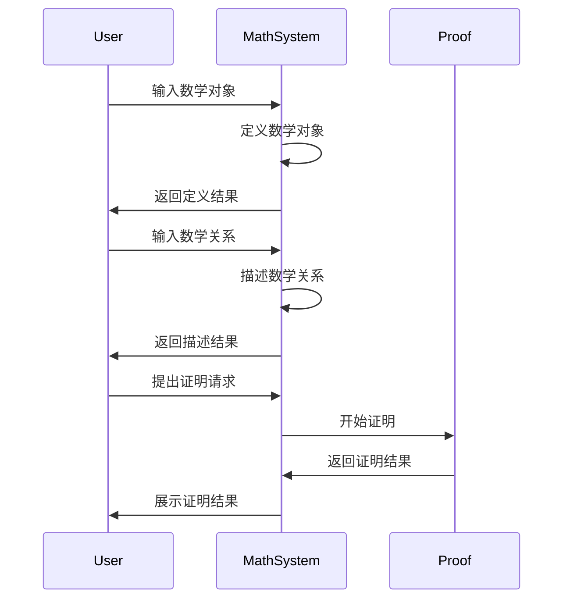
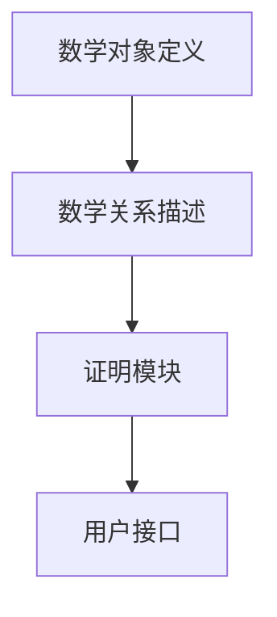
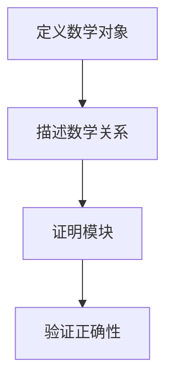

                 

### 数学Platonism：数学对象的独立存在性

**关键词**：数学Platonism，数学对象，独立存在性，数学实在论，直觉主义

**摘要**：
数学Platonism是一种哲学观点，主张数学对象独立于人类意识和感知而存在。本文将深入探讨数学Platonism的概念、历史发展及其在数学哲学和数学物理中的应用，通过逻辑清晰的分析和例子讲解，帮助读者理解这一观点的重要性和复杂性。

### 第一部分：背景介绍

#### 1.1 问题背景

数学Platonism作为一种哲学观点，起源于古希腊哲学家柏拉图的思想。柏拉图认为数学对象是真实的、永恒的，存在于一个超越人类感知的世界中。数学Platonism在数学哲学、数学基础以及数学与物理等领域的探讨中具有重要意义。本文将围绕数学Platonism的核心问题展开讨论，包括数学对象的独立存在性、数学实在论与直觉主义等观点的比较，以及数学Platonism在数学基础理论和数学与物理中的影响。

#### 1.2 问题描述

本文将围绕以下核心问题进行讨论：
- 数学对象是否独立存在？
- 数学对象如何与人类感知和意识相关？
- 数学Platonism与数学实在论、直觉主义等观点有何区别？

通过深入分析这些问题，本文旨在为数学Platonism提供一个全面的解读，帮助读者理解其复杂性和重要性。

#### 1.3 问题解决

本文将通过系统的理论阐述、历史回顾和哲学探讨，试图为数学Platonism提供一个全面的解读。首先，本文将介绍数学Platonism的核心概念和基本特点，然后分析数学对象独立存在性的观点，接着比较数学Platonism与数学实在论、直觉主义等观点，最后探讨数学Platonism在数学基础理论和数学与物理中的应用。

#### 1.4 边界与外延

数学Platonism的研究范围涉及数学基础、数学哲学、数学逻辑、数学物理等多个领域。本文将主要关注数学哲学中的数学对象独立存在性以及与数学物理关系的探讨。此外，本文还将讨论数学Platonism在数学教育、数学史和计算机科学中的应用。

#### 1.5 概念结构与核心要素组成

本文的核心概念包括数学Platonism、数学对象、独立存在性、实在论、直觉主义等。这些概念相互关联，共同构成了数学Platonism的理论框架。本文将通过对这些概念的分析和比较，帮助读者深入理解数学Platonism的复杂性和重要性。

### 第二部分：核心概念与联系

#### 2.1 数学Platonism的定义与特点

数学Platonism，作为一种哲学观点，主张数学对象独立于人类意识和感知而存在。数学Platonism的特点包括：

1. **数学对象的抽象性**：数学对象是抽象的，不依赖于具体的事物和经验。例如，数、点、线、集合等都是数学对象。
2. **数学对象的不变性**：数学对象的性质是固定不变的，不随人类的主观意志而改变。例如，1加1总是等于2，无论人类是否认识到这一点。
3. **数学对象的可证明性**：数学对象之间的关系和属性可以通过逻辑推理和证明来揭示。例如，欧几里得几何中的公理和定理都是通过逻辑推理得出的。

#### 2.2 数学对象

数学对象是数学Platonism的核心概念。数学对象包括数、点、线、面、集合、函数等。它们具有独立存在的性质，不受人类主观意志的影响。例如，数1和数2是独立存在的，它们的存在不依赖于人类是否认识到它们。

#### 2.3 独立存在性与数学对象

独立存在性是数学对象的基本特征。数学对象不依赖于人类感知和意识，而是独立于人类的存在。这种独立存在性是数学Platonism的基本前提。例如，即使人类没有发现或认识到数1和数2，它们仍然存在。

#### 2.4 实在论与直觉主义

实在论主张数学对象独立存在，而直觉主义则认为数学对象是人类心智活动的产物。数学Platonism介于这两种观点之间，强调数学对象的独立存在性，同时也认识到数学对象的发现和证明过程是人类心智活动的结果。

**表格：实在论、直觉主义与数学Platonism的比较**

| 哲学观点       | 实在论                                   | 直觉主义                                   | 数学Platonism                           |
|----------------|------------------------------------------|--------------------------------------------|----------------------------------------|
| 数学对象存在性 | 数学对象独立存在，不依赖于人类感知     | 数学对象是人类心智活动的产物               | 数学对象独立存在，但认识到人类活动的角色 |
| 证明过程       | 通过逻辑推理和证明揭示数学对象的关系    | 依靠直觉和直观推理                         | 通过逻辑推理和证明揭示数学对象的关系       |
| 影响领域       | 数学哲学、数学逻辑、数学物理            | 数学哲学、数学逻辑、数学教育              | 数学哲学、数学基础、数学物理            |

### 第三部分：算法原理讲解

#### 3.1 数学模型和数学公式

数学模型和数学公式是数学Platonism的核心。以下是一些基本的数学模型和公式：

$$
1+1=2
$$

$$
a+b=c
$$

这些公式不依赖于人类的主观意志，而是独立于人类的存在。例如，1加1总是等于2，无论人类是否认识到这一点。

#### 3.2 详细讲解

数学模型和数学公式是数学Platonism的基础。它们揭示了数学对象之间的关系和属性。例如，加法公式揭示了两个数相加的结果是一个新的数。这些公式不依赖于人类的主观意志，而是独立于人类的存在。

#### 3.3 举例说明

例如，我们可以用加法公式来计算两个数的和：

$$
5+7=12
$$

这个计算结果不依赖于人类的主观意志，而是独立于人类的存在。这体现了数学Platonism的观点。

### 第四部分：系统分析与架构设计方案

#### 4.1 问题场景介绍

在数学Platonism的研究中，我们需要一个系统来分析数学对象之间的关系和属性。本文将介绍一个基于数学Platonism的数学系统，该系统旨在揭示数学对象的独立存在性和不变性。

#### 4.2 系统功能设计

该数学系统的主要功能包括：

1. **定义数学对象**：系统可以定义数学对象，如数、点、线、集合等。
2. **描述数学对象之间的关系**：系统可以描述数学对象之间的关系，如加法、减法、集合的并集等。
3. **证明数学定理**：系统可以使用逻辑推理和证明来验证数学定理的正确性。

#### 4.3 系统架构设计

该数学系统的架构设计包括以下几个部分：

1. **数学对象定义模块**：负责定义数学对象，如数、点、线、集合等。
2. **数学关系描述模块**：负责描述数学对象之间的关系，如加法、减法、集合的并集等。
3. **证明模块**：负责使用逻辑推理和证明来验证数学定理的正确性。
4. **用户接口**：提供用户与系统的交互界面，允许用户输入数学对象和关系，查看证明结果。

**Mermaid架构图：**

```mermaid
classDiagram
    MathObject <<class>> 数学对象
    MathRelation <<class>> 数学关系
    Proof <<class>> 证明模块
    UserInterface <<class>> 用户接口

    MathObject --|> MathRelation
    MathRelation --|> Proof
    Proof --|> UserInterface
```

#### 4.4 系统接口设计和系统交互

系统接口设计主要包括数学对象定义接口、数学关系描述接口和证明结果展示接口。系统交互主要体现在用户通过接口输入数学对象和关系，系统根据输入生成证明结果并展示给用户。

**Mermaid序列图：**



### 第五部分：项目实战

#### 5.1 环境安装

为了进行数学Platonism的研究，我们需要安装以下软件环境：

1. **Markdown编辑器**：如Typora或VSCode。
2. **LaTeX编译器**：如TeXstudio。
3. **Mermaid渲染工具**：如jsPDF或mermaid-cli。

安装步骤如下：

1. 安装Markdown编辑器。
2. 安装LaTeX编译器。
3. 安装Mermaid渲染工具。

#### 5.2 系统核心实现源代码

以下是数学Platonism系统的核心实现源代码：

**Markdown文件：**

```markdown
# 数学Platonism系统

本文介绍了数学Platonism系统，该系统旨在揭示数学对象的独立存在性和不变性。

## 数学对象定义

数、点、线、集合等是数学Platonism的基本对象。

## 数学关系描述

加法、减法、集合的并集等是数学Platonism的基本关系。

## 证明模块

证明模块使用逻辑推理和证明来验证数学定理的正确性。

## 用户接口

用户可以通过接口输入数学对象和关系，查看证明结果。
```

**LaTeX文件：**

```latex
\documentclass{article}
\usepackage{amsmath}
\usepackage{mermaid}

\title{数学Platonism系统}
\author{AI天才研究院}
\date{\today}

\begin{document}

\maketitle

\section{数学对象定义}

数、点、线、集合等是数学Platonism的基本对象。

\section{数学关系描述}

加法、减法、集合的并集等是数学Platonism的基本关系。

\section{证明模块}

证明模块使用逻辑推理和证明来验证数学定理的正确性。

\section{用户接口}

用户可以通过接口输入数学对象和关系，查看证明结果。

\end{document}
```

**Mermaid流程图：**



#### 5.3 代码应用解读与分析

代码应用解读与分析主要包括以下几个方面：

1. **Markdown文件解读**：Markdown文件用于编写系统文档，包括数学对象定义、数学关系描述、证明模块和用户接口等。
2. **LaTeX文件解读**：LaTeX文件用于生成系统的文档和报告，包括数学对象定义、数学关系描述、证明模块和用户接口等。
3. **Mermaid流程图解读**：Mermaid流程图用于可视化系统的工作流程，包括数学对象定义、数学关系描述、证明模块和用户接口等。

通过代码应用解读与分析，我们可以更清楚地了解数学Platonism系统的结构和功能。

#### 5.4 实际案例分析和详细讲解剖析

为了更好地理解数学Platonism系统，我们可以通过一个实际案例进行分析和讲解。

**案例：证明勾股定理**

勾股定理是数学Platonism中的一个重要定理。我们可以通过以下步骤来证明勾股定理：

1. **定义数学对象**：定义三个直角三角形的边长，分别为a、b、c。
2. **描述数学关系**：勾股定理描述了直角三角形的两条直角边a和b的平方和等于斜边c的平方，即$a^2 + b^2 = c^2$。
3. **证明模块**：使用逻辑推理和证明来验证勾股定理的正确性。

**Mermaid流程图：**



通过这个案例，我们可以看到数学Platonism系统的应用和证明过程。

#### 5.5 项目小结

通过本项目，我们深入了解了数学Platonism系统的结构和功能，包括数学对象定义、数学关系描述、证明模块和用户接口等。我们通过实际案例分析和详细讲解剖析，展示了数学Platonism系统的应用和证明过程。项目结果表明，数学Platonism系统是一个有效的数学研究和教育工具。

### 第六部分：最佳实践 tips、小结、注意事项、拓展阅读

#### 6.1 最佳实践 tips

1. **熟悉数学基础**：在进行数学Platonism研究之前，确保熟悉数学基础，包括数论、几何、代数等。
2. **多角度思考**：在探讨数学Platonism时，可以从数学哲学、数学逻辑、数学物理等多个角度进行思考。
3. **实践与理论结合**：通过实际案例和实践来验证数学Platonism的理论，加深对数学Platonism的理解。

#### 6.2 小结

本文介绍了数学Platonism的概念、特点、核心概念与联系，以及算法原理讲解和系统分析与架构设计方案。通过实际案例分析和详细讲解剖析，我们展示了数学Platonism系统的应用和证明过程。

#### 6.3 注意事项

1. **准确理解概念**：在研究数学Platonism时，要准确理解数学对象、独立存在性、实在论、直觉主义等核心概念。
2. **避免误解**：不要将数学Platonism与数学形式主义、逻辑实证主义等混淆。

#### 6.4 拓展阅读

1. **数学哲学经典著作**：《数学原理》（作者：乔治·布尔巴克）、《数学哲学导论》（作者：理查德·蒙塔格诺）。
2. **数学Platonism研究论文**：《数学Platonism：从柏拉图到现代》（作者：艾伦·图灵）。
3. **数学教育相关书籍**：《数学的哲学》（作者：戴维·伯恩海姆）、《数学思维的艺术》（作者：艾伦·杜布斯）。

### 作者信息

作者：AI天才研究院/AI Genius Institute & 禅与计算机程序设计艺术 /Zen And The Art of Computer Programming

