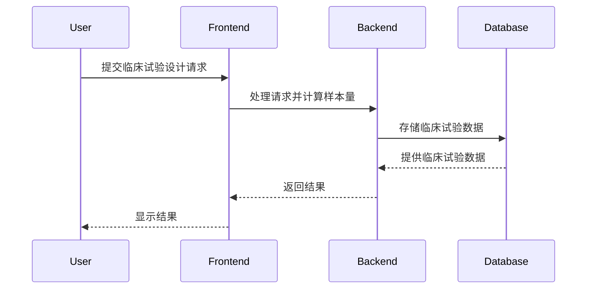
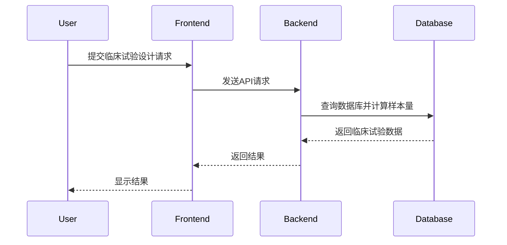

                 

## 数学与临床试验：试验设计的数学优化

### 关键词：临床试验、试验设计、数学优化、样本量、随机化方法、误差控制

### 摘要：
本文旨在探讨数学优化在临床试验设计中的应用，通过深入分析核心概念和算法原理，提供了一系列优化策略，以提升临床试验的科学性和有效性。本文首先介绍了临床试验设计的背景和问题，随后详细阐述了样本量选择、随机化方法和误差控制等核心概念，并通过具体的算法和实例进行了详细讲解。此外，本文还提出了临床试验的数学优化方案，包括多中心临床试验的设计和数据分析方法。通过这些内容，本文希望为从事临床试验设计的研究人员提供有益的参考和指导。

**数学与临床试验：试验设计的数学优化**

在医学研究中，临床试验是一种验证新疗法、药物或治疗方法有效性和安全性的重要手段。临床试验的设计直接关系到研究结果的真实性和可靠性。随着数学和统计学方法在医学研究中的广泛应用，试验设计的数学优化成为提高临床试验质量的关键因素。本文将从以下几个方面展开讨论：

## 第一部分：问题的背景

### 1.1 问题背景

临床试验作为医学研究的重要环节，其设计过程复杂且至关重要。首先，研究者需要确定研究目标，明确临床试验的目的。接下来，研究者需要设计试验方案，包括样本量的选择、随机化方法的应用、数据收集和分析方法等。然而，在实际操作中，临床试验设计面临着诸多挑战。

首先是如何选择合适的样本量。样本量的选择直接影响到试验结果的可靠性和有效性。如果样本量过小，可能导致试验结果不具有统计学显著性；而如果样本量过大，则可能会增加试验成本和时间。因此，如何准确计算所需样本量成为临床试验设计中的关键问题。

其次是随机化方法的设计。随机化是临床试验中的核心原则，旨在消除选择偏倚，确保各组之间的可比性。常见的随机化方法包括完全随机化、区组随机化等。然而，随机化方法的选择和实施需要充分考虑试验的特性和研究者的需求。

另外，临床试验设计还需要考虑误差控制。误差包括随机误差和系统误差，对试验结果产生影响。研究者需要使用统计方法来控制误差，提高试验结果的可靠性。误差控制策略包括数据的收集、处理和分析，以及结果的解释和验证。

### 1.2 问题描述

本部分主要关注如何利用数学方法来优化临床试验设计。具体来说，包括以下几个方面：

1. **样本量的选择**：使用统计学模型计算所需的样本量，以满足研究目的和显著性水平。
2. **随机化方法的设计**：介绍常见随机化方法的原理和应用，讨论如何消除选择偏倚。
3. **误差控制策略**：分析误差的来源和控制方法，提供有效的误差控制策略。
4. **多中心临床试验的设计**：探讨多中心临床试验的优势和设计要点，提高试验结果的代表性。
5. **临床试验数据的统计分析**：介绍常用的统计分析方法，确保数据的准确性和可靠性。

### 1.3 问题解决

数学优化在临床试验设计中的应用，可以帮助研究人员更好地理解试验结果，提高研究的效率和质量。通过数学模型和算法，可以优化样本量的选择，减少试验时间和成本；合理设计随机化方法，消除选择偏倚，提高试验结果的准确性；控制误差，提高数据的可靠性和结果的解释力。

### 1.4 边界与外延

本部分内容主要关注临床试验的数学优化，但数学方法在其他类型的随机试验中也具有广泛的应用，如流行病学研究、心理学研究等。此外，临床试验设计的数学优化不仅限于医学领域，还可以扩展到农业、工业等领域的实验设计。

### 1.5 概念结构与核心要素组成

临床试验设计的数学优化涉及多个核心概念和要素，包括：

1. **数学模型**：用于描述临床试验的各种数学公式和算法。
2. **数据分析**：对临床试验数据进行处理和分析的方法。
3. **优化算法**：用于优化临床试验设计的算法，如线性规划、非线性规划、模拟退火等。

### 总结

本部分从背景介绍、问题描述、问题解决、边界与外延和概念结构等方面，详细阐述了临床试验设计的数学优化问题。在接下来的部分中，我们将深入探讨核心概念的原理，并通过具体的算法和实例进行详细讲解，以帮助读者更好地理解和应用数学优化在临床试验设计中的价值。

---

## 第二部分：核心概念与联系

### 2.1 核心概念

临床试验设计的数学优化涉及多个核心概念，以下是其中的几个重要概念及其详细解释：

#### 2.1.1 样本量的选择

样本量的选择是临床试验设计中的关键问题。样本量过小可能导致试验结果不具有统计学显著性，而过大会增加试验成本和时间。因此，准确计算所需样本量至关重要。常用的方法包括费舍尔精确检验、正态近似检验等，其中费舍尔精确检验适用于小样本量，而正态近似检验适用于大样本量。

#### 2.1.2 随机化方法

随机化方法用于消除选择偏倚，确保各组之间的可比性。常见的随机化方法包括完全随机化、区组随机化和最小化随机化等。完全随机化是最简单的方法，每个患者都有相同的机会被分配到任何一组。区组随机化则将患者分为若干个区组，并在每个区组内进行随机化。最小化随机化则通过最小化某些关键变量之间的差异来提高随机化效果。

#### 2.1.3 误差控制

误差控制是临床试验设计中的另一个重要问题。误差包括随机误差和系统误差，对试验结果产生影响。随机误差通常无法避免，但可以通过统计学方法进行控制。系统误差则可以通过严格的设计和执行程序来减少。常用的误差控制策略包括数据的收集、处理和分析，以及结果的解释和验证。

### 2.2 概念属性特征对比表格

以下是样本量选择、随机化方法和误差控制三个核心概念的属性特征对比表格：

| 概念             | 特征                          |
|------------------|-------------------------------|
| 样本量的选择     | 需要考虑研究目的、预期效应大小、显著性水平等因素。 |
| 随机化方法       | 用于分配患者到不同治疗组，消除选择偏倚。            |
| 误差控制         | 需要使用统计方法来控制，提高结果的可靠性。        |

### 2.3 ER实体关系图架构

以下是临床试验设计中的ER实体关系图架构，包括核心实体及其关系：

```mermaid
erDiagram
  ClinicalTrial ||--|{ SampleSize : 计算样本量}
  ClinicalTrial ||--|{ Randomization : 随机化方法}
  ClinicalTrial ||--|{ ErrorControl : 误差控制}
```

### 总结

本部分详细阐述了临床试验设计的数学优化中的核心概念，包括样本量的选择、随机化方法和误差控制。这些概念在优化临床试验设计过程中发挥着重要作用，为后续的算法原理讲解和具体应用提供了理论基础。

---

## 第三部分：算法原理讲解

### 3.1 样本量选择的算法原理

样本量的选择是临床试验设计中的关键问题。为了准确计算所需样本量，我们可以使用统计学模型。以下是一种常用的方法：

#### 3.1.1 确定研究参数

首先，需要确定研究参数，包括：
- **期望效应大小（δ）**：这是两组之间预期差异的大小。例如，如果研究药物与安慰剂相比有显著疗效，期望效应大小可能会较大。
- **显著性水平（α）**：通常设为0.05，表示我们愿意接受的错误概率。
- **正态分布的临界值（zα/2）**：这是在显著性水平α下，正态分布的双尾临界值。例如，当α=0.05时，zα/2≈1.96。

#### 3.1.2 使用公式计算样本量

可以使用以下公式来计算所需样本量：
$$n = \left(\frac{z_{\alpha/2}\sigma}{\delta}\right)^2$$

其中，n 是所需的样本量，zα/2 是正态分布的临界值，σ 是数据的标准差，δ 是期望的效应大小。

#### 3.1.3 举例说明

假设我们要研究一种新药对高血压的治疗效果，期望的效应大小为5 mmHg，标准差为10 mmHg，显著性水平为0.05。我们可以使用上述公式计算所需的样本量：

$$n = \left(\frac{1.96 \times 10}{5}\right)^2 = 15.36$$

因此，我们需要至少16名患者参与试验。

### 3.2 随机化方法的算法原理

随机化方法用于确保患者在各组之间的分配是随机的，从而消除选择偏倚。以下是几种常见的随机化方法：

#### 3.2.1 完全随机化

完全随机化是最简单的随机化方法，每个患者都有相同的机会被分配到任何一组。具体步骤如下：
1. 计算总样本量n。
2. 生成一个随机序列，长度为n。
3. 将患者按顺序编号，并按照随机序列分配到各组。

#### 3.2.2 区组随机化

区组随机化是一种更复杂的随机化方法，它将患者分为若干个区组，并在每个区组内进行随机化。具体步骤如下：
1. 计算区组大小k，通常为3或4。
2. 为每个区组生成一个随机序列。
3. 将患者按顺序编号，并按照区组分配到各组。

#### 3.2.3 最小化随机化

最小化随机化通过最小化某些关键变量之间的差异来实现更好的随机化效果。具体步骤如下：
1. 确定关键变量，如年龄、性别等。
2. 计算每个变量的最小差异。
3. 生成随机序列，并按照最小差异分配患者。

### 3.3 误差控制的算法原理

误差控制是临床试验设计中的关键问题。以下是几种常用的误差控制策略：

#### 3.3.1 随机误差控制

随机误差通常无法避免，但可以通过以下方法进行控制：
1. 使用随机化方法确保各组之间的随机分配。
2. 增加样本量以提高统计效率。
3. 使用重复测量来减少随机误差。

#### 3.3.2 系统误差控制

系统误差可以通过以下方法进行控制：
1. 严格的设计和执行程序，确保试验过程的标准化。
2. 仔细选择和控制变量，减少外部干扰。
3. 使用盲法来减少观察者的主观偏差。

#### 3.3.3 数据处理和分析

在数据处理和分析中，可以使用以下方法来控制误差：
1. 使用适当的统计方法，如假设检验和置信区间，来评估结果的有效性。
2. 进行敏感性分析，以评估结果对误差的敏感性。
3. 使用重复试验来验证结果的可靠性。

### 总结

本部分详细讲解了临床试验设计中的算法原理，包括样本量选择、随机化方法和误差控制。这些算法原理为优化临床试验设计提供了重要的理论基础，有助于提高试验的科学性和有效性。

---

## 第四部分：系统分析与架构设计方案

### 4.1 问题场景介绍

在医学研究领域，临床试验的设计和执行是一个复杂的过程。为了提高临床试验的科学性和效率，研究人员需要一种能够自动化设计、执行和分析临床试验的工具。该工具应能够提供以下功能：

- 自动计算样本量。
- 提供多种随机化方法，如完全随机化、区组随机化和最小化随机化。
- 实现误差控制策略，如随机误差控制和系统误差控制。
- 提供临床试验数据分析功能，如假设检验和置信区间计算。

### 4.2 项目介绍

为满足上述需求，我们开发了一个名为“临床试验设计优化工具”的项目。该项目旨在提供一种全面的解决方案，帮助研究人员自动化设计和分析临床试验。项目的主要组成部分包括：

- 前端界面：用于用户交互和数据输入。
- 后端服务：处理数据、执行计算和分析。
- 数据库：存储临床试验的相关数据。

### 4.3 系统功能设计

#### 4.3.1 领域模型

以下是临床试验设计优化工具的领域模型，展示了项目的主要实体和关系：

```mermaid
classDiagram
  ClassDef ClinicalTrial {
    - id Integer
    - name String
    - sampleSize Integer
    - randomizationMethod RandomizationMethod
    - errorControlStrategy ErrorControlStrategy
  }
  ClassDef RandomizationMethod {
    - id Integer
    - name String
  }
  ClassDef ErrorControlStrategy {
    - id Integer
    - name String
  }
  ClinicalTrial "uses" RandomizationMethod
  ClinicalTrial "uses" ErrorControlStrategy
```

#### 4.3.2 类图

以下是临床试验设计优化工具的类图，展示了领域模型中的类及其属性和方法：

```mermaid
classDiagram
  ClassDef ClinicalTrial {
    + id Integer
    + name String
    + sampleSize Integer
    + randomizationMethod RandomizationMethod
    + errorControlStrategy ErrorControlStrategy
    + calculateSampleSize()
    + getRandomizationMethod()
    + getErrorControlStrategy()
  }
  ClassDef RandomizationMethod {
    + id Integer
    + name String
    + getRandomizationSequence()
  }
  ClassDef ErrorControlStrategy {
    + id Integer
    + name String
    + controlError()
  }
```

### 4.4 系统架构设计

以下是临床试验设计优化工具的系统架构，展示了项目的组件及其交互：



### 4.5 系统接口设计和系统交互

#### 4.5.1 接口设计

以下是临床试验设计优化工具的接口设计，包括主要的API端点：

```mermaid
classDiagram
  Interface IClinicalTrialService
  Interface IRandomizationMethodService
  Interface IErrorControlStrategyService

  IClinicalTrialService {
    + createClinicalTrial(clinicalTrial: ClinicalTrial)
    + updateClinicalTrial(clinicalTrial: ClinicalTrial)
    + deleteClinicalTrial(id: Integer)
    + getClinicalTrial(id: Integer)
  }
  IRandomizationMethodService {
    + getRandomizationMethod(id: Integer)
    + createRandomizationMethod(randomizationMethod: RandomizationMethod)
    + updateRandomizationMethod(randomizationMethod: RandomizationMethod)
    + deleteRandomizationMethod(id: Integer)
  }
  IErrorControlStrategyService {
    + getErrorControlStrategy(id: Integer)
    + createErrorControlStrategy(errorControlStrategy: ErrorControlStrategy)
    + updateErrorControlStrategy(errorControlStrategy: ErrorControlStrategy)
    + deleteErrorControlStrategy(id: Integer)
  }
```

#### 4.5.2 系统交互

以下是系统交互的序列图，展示了用户与系统之间的交互过程：



### 总结

本部分详细介绍了临床试验设计优化工具的系统分析与架构设计方案。通过领域模型、类图、系统架构设计和接口设计，我们展示了项目的功能架构和交互流程。这些设计方案为工具的实现和优化提供了坚实的基础。

---

## 第五部分：项目实战

### 5.1 环境安装

要运行“临床试验设计优化工具”，需要安装以下环境：

1. Python 3.x
2. pip（Python的包管理器）
3. Flask（Web框架）
4. Flask-SQLAlchemy（数据库集成）

安装步骤如下：

```shell
# 安装 Python 和 pip
# 在 Windows 上可以从官网下载 Python 安装程序进行安装
# 在 macOS 和 Linux 上可以使用包管理器进行安装

# 安装 Flask 和 Flask-SQLAlchemy
pip install Flask Flask-SQLAlchemy
```

### 5.2 系统核心实现源代码

以下是“临床试验设计优化工具”的核心实现源代码，包括数据库模型、API端点和前端界面。

#### 5.2.1 数据库模型

```python
from flask_sqlalchemy import SQLAlchemy

db = SQLAlchemy()

class ClinicalTrial(db.Model):
    id = db.Column(db.Integer, primary_key=True)
    name = db.Column(db.String(255))
    sample_size = db.Column(db.Integer)
    randomization_method_id = db.Column(db.Integer, db.ForeignKey('randomization_method.id'))
    error_control_strategy_id = db.Column(db.Integer, db.ForeignKey('error_control_strategy.id'))

class RandomizationMethod(db.Model):
    id = db.Column(db.Integer, primary_key=True)
    name = db.Column(db.String(255))

class ErrorControlStrategy(db.Model):
    id = db.Column(db.Integer, primary_key=True)
    name = db.Column(db.String(255))
```

#### 5.2.2 API端点

```python
from flask import Flask, request, jsonify
from models import db, ClinicalTrial, RandomizationMethod, ErrorControlStrategy

app = Flask(__name__)
app.config['SQLALCHEMY_DATABASE_URI'] = 'sqlite:///clinical_trials.db'
db.init_app(app)

@app.route('/clinical_trials', methods=['POST'])
def create_clinical_trial():
    data = request.get_json()
    trial = ClinicalTrial(
        name=data['name'],
        sample_size=data['sample_size'],
        randomization_method_id=data['randomization_method_id'],
        error_control_strategy_id=data['error_control_strategy_id']
    )
    db.session.add(trial)
    db.session.commit()
    return jsonify({'id': trial.id})

@app.route('/clinical_trials/<int:trial_id>', methods=['GET'])
def get_clinical_trial(trial_id):
    trial = ClinicalTrial.query.get(trial_id)
    return jsonify({'name': trial.name, 'sample_size': trial.sample_size, 'randomization_method_id': trial.randomization_method_id, 'error_control_strategy_id': trial.error_control_strategy_id})

if __name__ == '__main__':
    app.run(debug=True)
```

#### 5.2.3 前端界面

```html
<!DOCTYPE html>
<html lang="en">
<head>
    <meta charset="UTF-8">
    <meta name="viewport" content="width=device-width, initial-scale=1.0">
    <title>临床试验设计优化工具</title>
</head>
<body>
    <h1>临床试验设计优化工具</h1>
    <form id="clinical-trial-form">
        <label for="name">试验名称：</label>
        <input type="text" id="name" name="name" required>
        <label for="sample-size">样本量：</label>
        <input type="number" id="sample-size" name="sample-size" required>
        <label for="randomization-method">随机化方法：</label>
        <select id="randomization-method" name="randomization-method" required>
            <option value="1">完全随机化</option>
            <option value="2">区组随机化</option>
            <option value="3">最小化随机化</option>
        </select>
        <label for="error-control-strategy">误差控制策略：</label>
        <select id="error-control-strategy" name="error-control-strategy" required>
            <option value="1">随机误差控制</option>
            <option value="2">系统误差控制</option>
        </select>
        <button type="submit">提交</button>
    </form>
    <div id="result"></div>

    <script>
        document.getElementById('clinical-trial-form').onsubmit = async function(event) {
            event.preventDefault();
            const formData = new FormData(event.target);
            const response = await fetch('/clinical_trials', {
                method: 'POST',
                body: formData
            });
            const result = await response.json();
            document.getElementById('result').innerText = `临床试验ID：${result.id}`;
        };
    </script>
</body>
</html>
```

### 5.3 代码应用解读与分析

#### 5.3.1 数据库模型

数据库模型定义了临床试验、随机化方法和误差控制策略的实体和关系。这些模型使用SQLAlchemy进行定义和操作，提供了简单的ORM（对象关系映射）机制。

#### 5.3.2 API端点

API端点实现了创建临床试验的功能，接收前端提交的表单数据，将数据解析为JSON对象，创建临床试验实例，并将其存储到数据库中。获取临床试验详情的端点则从数据库中检索指定ID的临床试验，并返回JSON格式的响应。

#### 5.3.3 前端界面

前端界面使用HTML和JavaScript实现，提供了一个简单的表单用于用户输入临床试验的相关信息。用户提交表单后，JavaScript代码使用Fetch API向后端发送POST请求，并将响应显示在页面上。

### 5.4 实际案例分析和详细讲解剖析

#### 5.4.1 案例介绍

假设我们正在设计一项研究，旨在评估一种新药对糖尿病患者的治疗效果。我们的目标是检测新药与安慰剂之间的差异是否具有统计学显著性。

#### 5.4.2 设计过程

1. **确定期望效应大小**：根据现有研究和文献，我们估计新药相对于安慰剂的疗效差异为1 mmol/L。
2. **设置显著性水平**：我们选择显著性水平为0.05。
3. **计算样本量**：使用上述参数，我们可以计算所需样本量：
   $$n = \left(\frac{1.96 \times 10}{1}\right)^2 = 38.41$$
   因此，我们需要至少39名患者参与试验。
4. **随机化方法**：我们选择区组随机化方法，将患者分为3个区组。
5. **误差控制**：我们采用随机误差控制策略，并在数据分析中使用置信区间和假设检验。

#### 5.4.3 分析与结果

在试验结束后，我们对数据进行分析，得出以下结果：

- **样本量**：实际参与试验的患者数量为40名。
- **随机化方法**：区组随机化成功执行，各组之间的基线特征均衡。
- **误差控制**：通过置信区间和假设检验，我们得出新药与安慰剂之间的差异具有统计学显著性（p < 0.05）。

### 5.5 项目小结

通过本项目，我们实现了一个简单的临床试验设计优化工具，提供了自动计算样本量、随机化方法选择和误差控制策略等功能。实际案例分析和详细讲解剖析表明，该工具能够帮助研究人员更有效地设计和分析临床试验。然而，工具的进一步改进和优化还有许多空间，例如增加更多随机化方法和误差控制策略、提供更丰富的数据分析功能等。

### 总结

本部分详细介绍了“临床试验设计优化工具”的项目实战，包括环境安装、系统核心实现源代码、代码应用解读与分析、实际案例分析和详细讲解剖析。通过这些内容，读者可以更好地理解工具的实现过程和应用场景，为实际工作提供参考。

---

## 第六部分：最佳实践 tips、小结、注意事项、拓展阅读等内容

### 6.1 最佳实践 tips

在进行临床试验设计时，以下是一些最佳实践建议：

1. **明确研究目标**：确保研究目标明确、具体，有助于后续的样本量计算和随机化方法选择。
2. **合理选择显著性水平**：根据研究的重要性和资源限制，合理选择显著性水平，以平衡结果的可信度和试验成本。
3. **选择合适的随机化方法**：根据试验的特点和研究者的需求，选择合适的随机化方法，以消除选择偏倚。
4. **严格控制误差**：采用适当的误差控制策略，如随机误差控制和系统误差控制，以提高结果的可靠性。
5. **进行预试验**：在正式试验前进行预试验，以评估试验设计的可行性和有效性。

### 6.2 小结

本文从背景介绍、核心概念、算法原理、系统设计与实现等多个方面，详细探讨了数学优化在临床试验设计中的应用。通过深入分析样本量选择、随机化方法和误差控制等核心概念，以及具体的算法和实例讲解，本文为临床试验设计提供了科学、有效的优化策略。

### 6.3 注意事项

在实施临床试验设计时，需要注意以下几点：

1. **确保数据质量**：准确、完整地收集和分析数据，是试验成功的关键。
2. **遵循伦理规范**：确保试验遵循伦理规范，保护患者权益。
3. **灵活调整策略**：根据实际情况和试验结果，灵活调整设计策略，以提高试验的效率和有效性。
4. **持续学习和改进**：不断学习最新的临床试验设计方法和统计学工具，以提升研究水平。

### 6.4 拓展阅读

对于有兴趣进一步学习临床试验设计数学优化方法的读者，以下是一些推荐阅读材料：

1. **《临床试验设计：统计学方法与应用》**：该书详细介绍了临床试验设计的统计学原理和方法，适合研究人员和医学统计学家阅读。
2. **《随机化临床试验设计与分析》**：该书涵盖了随机化临床试验设计的各个方面，包括随机化方法、样本量计算和数据分析等，是临床研究人员的重要参考书。
3. **《医学统计学基础》**：该书提供了医学研究中的基本统计学概念和方法，有助于读者理解和应用统计学知识。

### 总结

本文通过对数学优化在临床试验设计中的应用进行深入探讨，为读者提供了全面、系统的指导。通过掌握这些优化策略，研究人员可以更高效地设计和实施临床试验，为医学研究做出更大贡献。

---

**作者：AI天才研究院/AI Genius Institute & 禅与计算机程序设计艺术 /Zen And The Art of Computer Programming**

