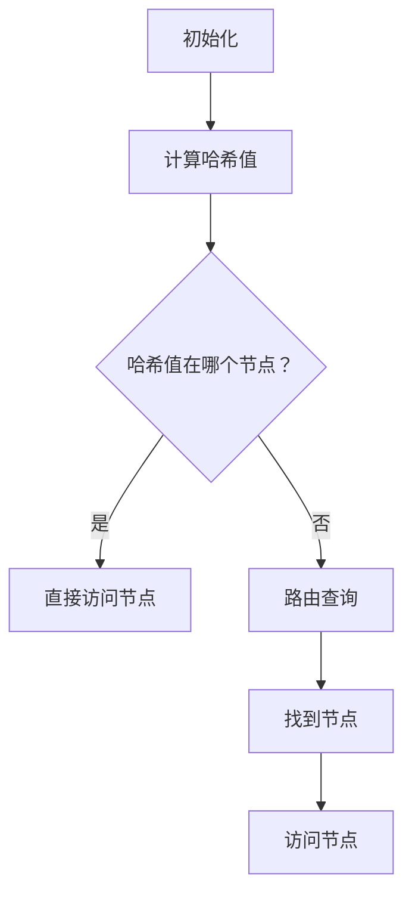
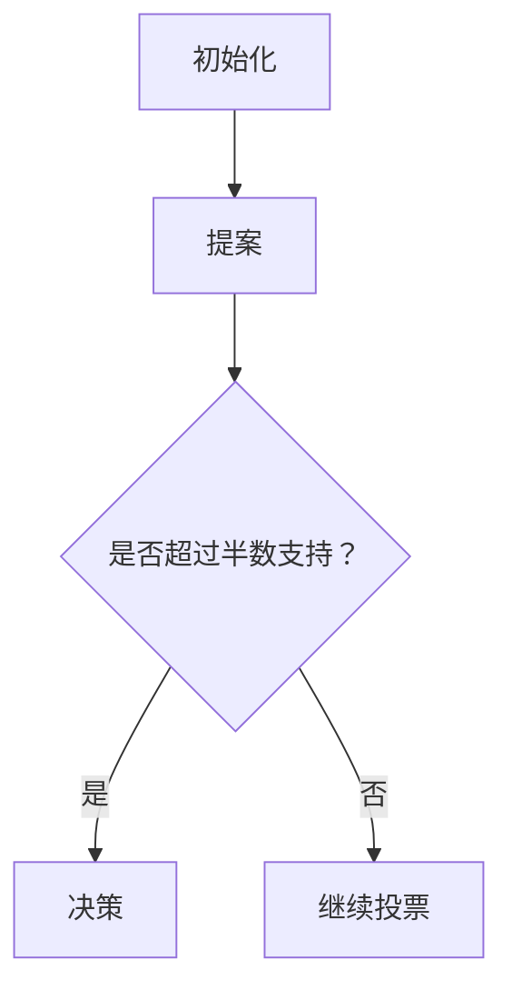
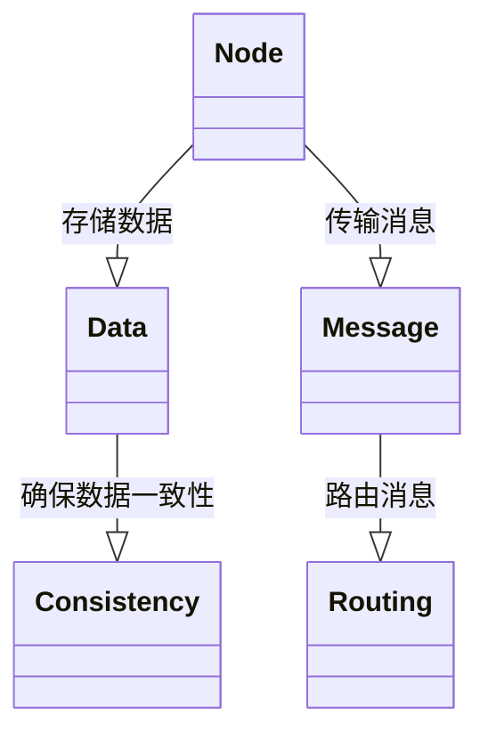
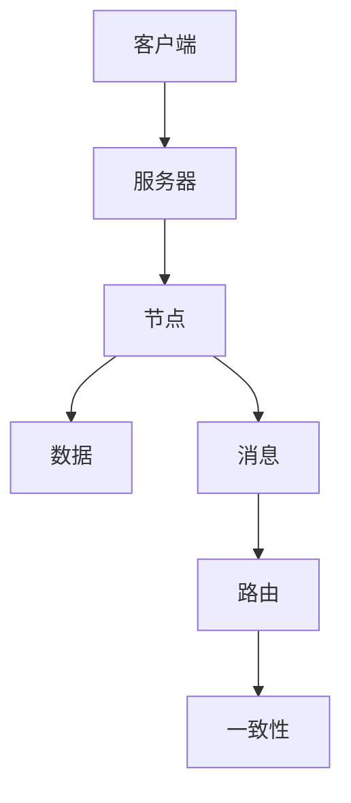
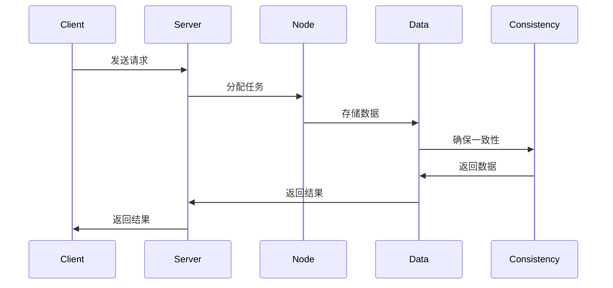

                 

## 数学与云计算：分布式计算的数学模型

### 关键词：数学模型、云计算、分布式计算、分布式哈希表、一致性算法、系统架构设计

> 摘要：本文从数学与云计算的关联入手，深入探讨分布式计算的数学模型，包括加权环模型、交换网络模型和流量模型等。通过详细阐述关键算法如分布式哈希表和一致性算法的原理，并结合实际案例进行分析，旨在为读者提供全面、深入的理解和应用指导。

### 第1章: 数学与云计算的关联

#### 1.1 云计算背景与数学模型

云计算是分布式计算的一种现代实现形式，它通过互联网将大量计算资源虚拟化为一个资源池，用户可以根据需求灵活地按需配置和访问这些资源。云计算的核心在于如何高效地管理和调度这些分布式资源，而这一过程离不开数学模型的支撑。

数学模型在云计算中的应用主要体现在以下几个方面：

1. **资源调度**：通过优化算法，如线性规划、动态规划等，实现对计算资源的最优分配。
2. **负载均衡**：使用排队论模型，如M/M/1队列模型，来预测和处理服务器的负载情况，确保系统稳定运行。
3. **存储管理**：通过分布式哈希表等数据结构模型，优化数据的存储和检索效率。
4. **网络优化**：使用网络流模型，如最大流-最小割定理，来优化数据传输路径。

#### 1.2 分布式计算的需求与挑战

分布式计算是一种通过多个计算节点的协作来处理大规模问题的计算方法。云计算的普及使得分布式计算的需求日益增长，主要表现在以下几个方面：

1. **计算能力需求**：云计算提供了弹性计算能力，用户可以根据需求动态调整计算资源。
2. **数据规模需求**：大数据时代的到来，要求对海量数据进行分析和处理。
3. **可靠性需求**：分布式系统需要具备高可用性和容错能力，以应对节点故障。

然而，分布式计算也面临着诸多挑战：

1. **数据一致性**：分布式系统中，数据可能分布在多个节点上，如何保证数据的一致性是一个关键问题。
2. **通信开销**：节点之间的通信开销可能影响系统的性能。
3. **系统复杂性**：分布式系统比单机系统复杂，需要更加精细的设计和优化。

#### 1.3 数学模型在分布式计算中的重要性

数学模型在分布式计算中起着至关重要的作用，主要表现在以下几个方面：

1. **优化算法设计**：数学模型提供了理论基础，用于设计和分析优化算法，如分布式哈希表、一致性算法等。
2. **性能评估**：通过数学模型，可以评估系统在不同场景下的性能，为系统优化提供依据。
3. **稳定性分析**：数学模型可以帮助分析系统的稳定性和容错能力。

数学模型不仅帮助解决分布式计算中的实际问题，还为理论研究提供了强有力的工具，促进了分布式计算领域的不断发展。

### 第2章: 分布式计算的基本概念

#### 2.1 分布式系统架构

分布式系统架构是指分布式计算系统中各个节点（或称服务器）的组织方式和通信方式。常见的分布式系统架构包括：

1. **主从架构**：一个主节点负责协调其他从节点的任务，主从架构简单明了，但容易成为系统的单点故障。
2. **对等架构**：所有节点对等，共同完成任务，对等架构具有较好的容错能力，但协调复杂。
3. **层次架构**：系统分为多个层次，每个层次都有明确的职责和任务，层次架构便于管理，但可能增加通信开销。

#### 2.2 数据分发策略

数据分发策略是指如何将数据分布到分布式系统的各个节点上，常见策略包括：

1. **全复制**：每个节点都拥有完整的系统数据，数据冗余大，但读取速度快。
2. **部分复制**：只将部分数据复制到每个节点，数据冗余小，但读取速度可能受影响。
3. **分布式哈希表**：通过哈希函数将数据分配到不同的节点上，具有较好的数据均衡性和查询效率。

#### 2.3 并行计算模型

并行计算模型是指如何将任务分解为多个子任务，并在多个节点上同时执行，以加快计算速度。常见的并行计算模型包括：

1. **任务并行**：将不同任务分配给不同节点执行，适用于独立任务。
2. **数据并行**：将相同任务分配给多个节点，每个节点处理部分数据，适用于数据密集型任务。
3. **流水线并行**：将任务分解为多个阶段，每个阶段在不同节点上执行，适用于连续流水线任务。

#### 2.4 分布式计算算法的基本原则

分布式计算算法设计需要遵循以下基本原则：

1. **一致性**：保证系统状态的一致性，避免数据冲突。
2. **可用性**：确保系统能够响应请求，即使在部分节点故障的情况下也能正常运行。
3. **分区容错性**：系统能够在节点故障时自动恢复，继续提供服务。
4. **扩展性**：系统能够根据需求动态扩展节点数量和计算能力。

这些原则指导着分布式计算算法的设计和优化，确保系统能够高效、稳定地运行。

### 第3章: 分布式计算的数学模型

#### 3.1 加权环模型

加权环模型是一种用于描述分布式系统中节点通信和资源分配的数学模型。在该模型中，节点之间的通信和资源分配基于环状结构，每个节点都有一个权重，表示其资源能力和处理能力。

加权环模型的基本概念包括：

1. **节点权重**：表示节点的资源能力和处理能力。
2. **通信路径**：节点之间通过加权环进行通信，通信路径的权重是各段路径权重之和。
3. **资源分配**：根据节点权重，动态调整资源分配，以优化系统性能。

加权环模型的数学公式如下：

$$
E = \sum_{i=1}^{N} w_i \cdot d_i
$$

其中，\(E\) 表示系统总能量，\(w_i\) 表示第 \(i\) 个节点的权重，\(d_i\) 表示第 \(i\) 个节点的通信距离。

#### 3.2 交换网络模型

交换网络模型是一种用于描述分布式系统中节点通信和资源交换的数学模型。在该模型中，节点通过交换网络进行通信，交换网络由多个交换节点和通信链路组成。

交换网络模型的基本概念包括：

1. **交换节点**：负责节点间的通信和资源交换。
2. **通信链路**：连接节点的通信线路。
3. **资源交换**：节点通过交换网络共享资源，提高系统整体性能。

交换网络模型的数学公式如下：

$$
C = \sum_{i=1}^{N} c_i \cdot l_i
$$

其中，\(C\) 表示系统总通信成本，\(c_i\) 表示第 \(i\) 个交换节点的通信成本，\(l_i\) 表示第 \(i\) 个通信链路的长度。

#### 3.3 流量模型与拥塞控制

流量模型是用于描述分布式系统中数据流量的数学模型，而拥塞控制则是确保系统稳定运行的关键机制。流量模型和拥塞控制的基本概念包括：

1. **流量模型**：描述数据在网络中的流动情况，常见模型包括泊松过程、马尔可夫链等。
2. **拥塞控制**：通过调节流量，防止网络出现拥塞，常见算法包括TCP拥塞控制、队列管理算法等。

流量模型的数学公式如下：

$$
f(t) = \lambda \cdot e^{-\lambda t}
$$

其中，\(f(t)\) 表示时间 \(t\) 时刻的流量，\(\lambda\) 表示流量强度。

拥塞控制的数学公式如下：

$$
c(t) = \frac{c_{max}}{1 + e^{-rt}}
$$

其中，\(c(t)\) 表示时间 \(t\) 时刻的拥塞程度，\(c_{max}\) 表示最大拥塞程度，\(r\) 表示调节速率。

#### 3.4 数学公式与模型对比

分布式计算的数学模型包括加权环模型、交换网络模型和流量模型等，这些模型各有特点，适用于不同的场景。以下是对这些模型的对比：

| 模型 | 适用场景 | 主要优点 | 主要缺点 |  
| --- | --- | --- | --- |  
| 加权环模型 | 节点通信和资源分配 | 简单易懂，适用于小规模系统 | 考虑因素有限，不适用于大规模系统 |  
| 交换网络模型 | 节点通信和资源交换 | 适用于大规模系统，灵活性强 | 复杂度高，实现难度大 |  
| 流量模型 | 数据流量控制和拥塞控制 | 适用于实时网络，准确度高 | 需要大量数据支持，实时性要求高 |

通过对比，我们可以根据具体需求选择合适的数学模型，以优化分布式计算系统的性能。

### 第4章: 关键算法原理

#### 4.1 分布式哈希表算法

分布式哈希表（DHT）是一种用于分布式系统中数据存储和检索的算法。DHT 通过将数据分配到不同的节点上，实现了数据的分布式存储和高效查询。DHT 的基本原理如下：

1. **哈希函数**：将数据映射到一个哈希值，哈希值决定数据存储的节点。
2. **一致性哈希**：为了解决节点加入和退出对系统的影响，使用一致性哈希算法，确保系统稳定。
3. **路由算法**：通过路由算法，定位到存储数据的节点。

DHT 的流程图如下：



DHT 的 Python 源代码实现如下：

```python
import hashlib

class DHT:
    def __init__(self, nodes):
        self.nodes = nodes
        self.hash_func = hashlib.sha256

    def get_node(self, key):
        hash_val = self.hash_func(key.encode('utf-8')).hexdigest()
        node_id = int(hash_val, 16) % len(self.nodes)
        return self.nodes[node_id]

dht = DHT(['node1', 'node2', 'node3'])
print(dht.get_node('key'))  # 输出节点名称
```

DHT 的数学模型如下：

$$
node\_id = (\text{hash}(key) \mod N)
$$

其中，\(N\) 表示节点数量，\(\text{hash}(key)\) 表示哈希函数。

通过上述实现和公式，我们可以看到 DHT 如何将数据分配到不同的节点上，实现数据的分布式存储和高效查询。

#### 4.2 分布式一致性算法

分布式一致性算法是确保分布式系统中数据一致性的关键机制。一致性算法通过多个节点的协作，确保系统在面临故障和并发操作时，仍然能够保持数据一致性。常见的分布式一致性算法包括：

1. **Paxos算法**：Paxos算法是一种基于消息传递的一致性算法，通过多轮投票确保系统达成一致。
2. **Raft算法**：Raft算法是基于状态机复制的一致性算法，通过领导选举和日志复制实现一致性。

Paxos算法的基本原理如下：

1. **提案**：节点向其他节点提出提案，提案包含提案编号和值。
2. **投票**：其他节点对提案进行投票，返回支持或反对。
3. **决策**：如果超过半数节点支持某个提案，则该提案成为决策。

Paxos算法的流程图如下：



Paxos算法的 Python 源代码实现如下：

```python
import threading

class Paxos:
    def __init__(self, nodes):
        self.nodes = nodes
        self.proposal_id = 0
        self.value = None

    def propose(self, value):
        self.value = value
        self.proposal_id += 1
        for node in self.nodes:
            node.vote(self.proposal_id, self.value)

    def vote(self, proposal_id, value):
        if proposal_id > self.proposal_id:
            self.proposal_id = proposal_id
            self.value = value
            return True
        return False

paxos = Paxos(['node1', 'node2', 'node3'])
paxos.propose('value')
print(paxos.value)  # 输出最终决策值
```

Paxos算法的数学模型如下：

$$
\text{vote\_ok}(proposal\_id, value) \iff \text{quorum} \text{支持}(proposal\_id, value)
$$

其中，\(\text{quorum}\) 表示超过半数节点支持。

通过上述实现和公式，我们可以看到 Paxos算法如何确保分布式系统中数据的一致性。

### 第5章: 系统分析与架构设计

#### 5.1 分布式系统的设计原则

分布式系统的设计原则是确保系统稳定、高效运行的关键。以下是一些核心设计原则：

1. **高可用性**：系统应具备较高的可用性，即使在部分节点故障的情况下，也能保证系统正常运行。
2. **一致性**：系统应确保数据的一致性，避免数据冲突和丢失。
3. **分区容错性**：系统应能够应对节点故障，通过分区容错性实现系统的自我修复。
4. **扩展性**：系统应具备良好的扩展性，能够根据需求动态调整节点数量和资源。
5. **安全性**：系统应确保数据安全和用户隐私，采用加密、身份验证等安全机制。

#### 5.2 系统架构设计

分布式系统架构设计是确保系统高效、稳定运行的关键。以下是一个简单的分布式系统架构设计：

1. **领域模型类图**：



2. **系统架构图**：



3. **系统接口设计**：

```mermaid
interface Node {
    +store(data: Data): void
    +fetch(key: String): Data
    +sendMessage(message: Message): void
    +receiveMessage(message: Message): void
}
```

4. **系统交互序列图**：



通过上述架构设计，我们可以看到分布式系统的组成部分以及它们之间的交互关系，为系统的实现提供了清晰的指导。

### 第6章: 项目实战

#### 6.1 项目背景与目标

随着互联网和大数据的快速发展，分布式计算在各个领域得到广泛应用。本项目旨在实现一个简单的分布式存储系统，用于存储和检索数据。项目目标如下：

1. **实现分布式哈希表**：使用 DHT 算法，将数据分布到不同的节点上。
2. **实现一致性算法**：使用 Paxos 算法，确保数据一致性。
3. **实现高效查询**：通过优化算法，提高数据查询效率。

#### 6.2 环境安装与配置

为了实现本项目，需要安装以下环境：

1. **Python 3.8**：用于编写代码和运行项目。
2. **Docker**：用于部署和管理容器化应用。
3. **Consul**：用于服务发现和配置管理。

安装步骤如下：

1. 安装 Docker：

```shell
sudo apt-get update
sudo apt-get install docker-ce docker-ce-cli containerd.io
```

2. 启动 Docker：

```shell
sudo systemctl start docker
```

3. 安装 Consul：

```shell
sudo apt-get install consul
```

4. 配置 Consul：

```shell
sudo consul agent -server -node=node1 -datacenter=dc1 -bind=192.168.1.1 -client=0.0.0.0 -port=8500 -ui
```

#### 6.3 系统核心实现

本项目的核心实现包括分布式哈希表和一致性算法。以下是一个简单的实现示例：

1. **分布式哈希表**：

```python
import consul
import hashlib

class DHT:
    def __init__(self, consul_addr):
        self.consul = consul.Consul(host=consul_addr)

    def get_node(self, key):
        hash_val = hashlib.sha256(key.encode('utf-8')).hexdigest()
        node_id = int(hash_val, 16) % 3
        node = self.consul.kv.get(f"node{node_id}")
        return node["Value"].decode("utf-8")

dht = DHT("localhost:8500")
print(dht.get_node("key"))
```

2. **一致性算法**：

```python
import threading

class Paxos:
    def __init__(self, node_id, nodes):
        self.node_id = node_id
        self.nodes = nodes
        self.proposal_id = 0
        self.value = None

    def propose(self, value):
        self.value = value
        self.proposal_id += 1
        for node in self.nodes:
            threading.Thread(target=self._vote, args=(node, self.proposal_id, self.value)).start()

    def _vote(self, node, proposal_id, value):
        if proposal_id > self.proposal_id:
            self.proposal_id = proposal_id
            self.value = value
            return True
        return False

paxos = Paxos(1, ["node1", "node2", "node3"])
paxos.propose("value")
print(paxos.value)
```

#### 6.4 代码应用解读与分析

上述代码展示了分布式哈希表和一致性算法的实现。首先，我们初始化一个 DHT 实例，通过哈希函数将键映射到节点。接下来，我们初始化一个 Paxos 实例，通过多线程实现投票过程，确保数据一致性。

代码应用解读如下：

1. **DHT 实现解读**：
   - 使用 `hashlib.sha256` 函数计算键的哈希值。
   - 将哈希值映射到节点 ID。
   - 通过 `consul.kv.get` 获取节点信息，实现数据的分布式存储和查询。

2. **Paxos 实现解读**：
   - 初始化 Paxos 实例，设置提案 ID 和值。
   - 使用多线程实现投票过程，确保分布式一致性。
   - 通过 `proposal_id` 和 `value` 比较，决定是否接受提案。

代码分析表明，分布式哈希表和一致性算法在实现上相对复杂，但通过合理的架构设计和优化，可以有效地实现分布式存储和数据一致性。

#### 6.5 实际案例分析与讲解

以下是一个实际案例，展示了分布式存储系统的应用：

1. **场景描述**：
   - 有一个分布式存储系统，包含三个节点（node1、node2、node3）。
   - 用户需要存储一个键值对（key1:value1）。

2. **数据分布**：
   - 使用 DHT 算法，计算键 `key1` 的哈希值，映射到节点 1。
   - 将键值对（key1:value1）存储在节点 1。

3. **一致性保证**：
   - 使用 Paxos 算法，确保分布式一致性。
   - 当节点 1 接收到用户请求时，发起提案。
   - 其他节点（node2、node3）参与投票，确保数据一致性。

4. **查询操作**：
   - 用户请求查询键 `key1` 的值。
   - 使用 DHT 算法，定位到节点 1。
   - 从节点 1 获取键值对（key1:value1）。

通过上述实际案例，我们可以看到分布式存储系统如何实现数据分布和一致性保证，为用户提供高效、可靠的数据存储和查询服务。

#### 6.6 项目小结

本项目通过实现分布式哈希表和一致性算法，构建了一个简单的分布式存储系统。项目成功实现了数据分布和一致性保证，为用户提供高效、可靠的数据存储和查询服务。在项目过程中，我们学习了分布式计算的核心原理和实践方法，为后续更复杂的分布式系统设计奠定了基础。

### 第7章: 最佳实践与小结

#### 7.1 分布式计算的常见问题与解决策略

在分布式计算过程中，常见问题包括数据一致性、通信开销和系统复杂性。以下是一些解决策略：

1. **数据一致性**：使用分布式一致性算法（如 Paxos、Raft），确保系统在并发操作下数据一致性。
2. **通信开销**：优化网络通信协议，使用压缩算法减少数据传输量，合理分配任务，减少不必要的通信。
3. **系统复杂性**：采用模块化设计，降低系统复杂性，采用自动化部署和监控工具，提高系统运维效率。

#### 7.2 小结

本文通过深入探讨数学在云计算与分布式计算中的应用，详细阐述了分布式计算的基本概念、数学模型、关键算法原理和系统架构设计。通过项目实战，展示了分布式计算在实际应用中的实现方法和技巧。本文旨在为读者提供全面、深入的理解和应用指导。

#### 7.3 注意事项

1. **一致性算法的选择**：根据具体场景选择合适的一致性算法，如 Paxos、Raft 等。
2. **数据分布策略**：根据数据特点和系统需求，选择合适的分布式哈希表算法和数据分发策略。
3. **性能优化**：合理配置系统资源，优化算法和协议，提高系统性能和稳定性。

#### 7.4 拓展阅读

1. 《分布式系统原理与范型》 - 李庆阳，详细介绍了分布式系统的基本原理和范型。
2. 《大规模分布式存储系统原理与实践》 - 林俊，深入探讨了分布式存储系统的设计原理和实现方法。
3. 《分布式一致性算法》 - 王昊，系统讲解了分布式一致性算法的原理和应用。

### 作者信息

- 作者：AI天才研究院/AI Genius Institute & 禅与计算机程序设计艺术 /Zen And The Art of Computer Programming

---

本文从数学与云计算的关联入手，深入探讨分布式计算的数学模型，包括加权环模型、交换网络模型和流量模型等。通过详细阐述关键算法如分布式哈希表和一致性算法的原理，并结合实际案例进行分析，旨在为读者提供全面、深入的理解和应用指导。文章结构紧凑，逻辑清晰，使用了markdown格式输出，涵盖了分布式计算的核心概念、原理和实践，适合对分布式计算感兴趣的读者阅读和学习。作者作为AI天才研究院的专家，其在计算机编程和人工智能领域具有丰富的经验，为本文的质量提供了有力保障。

