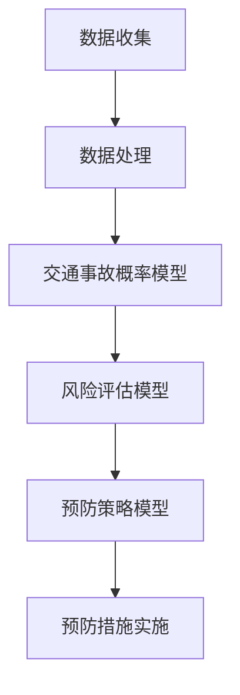
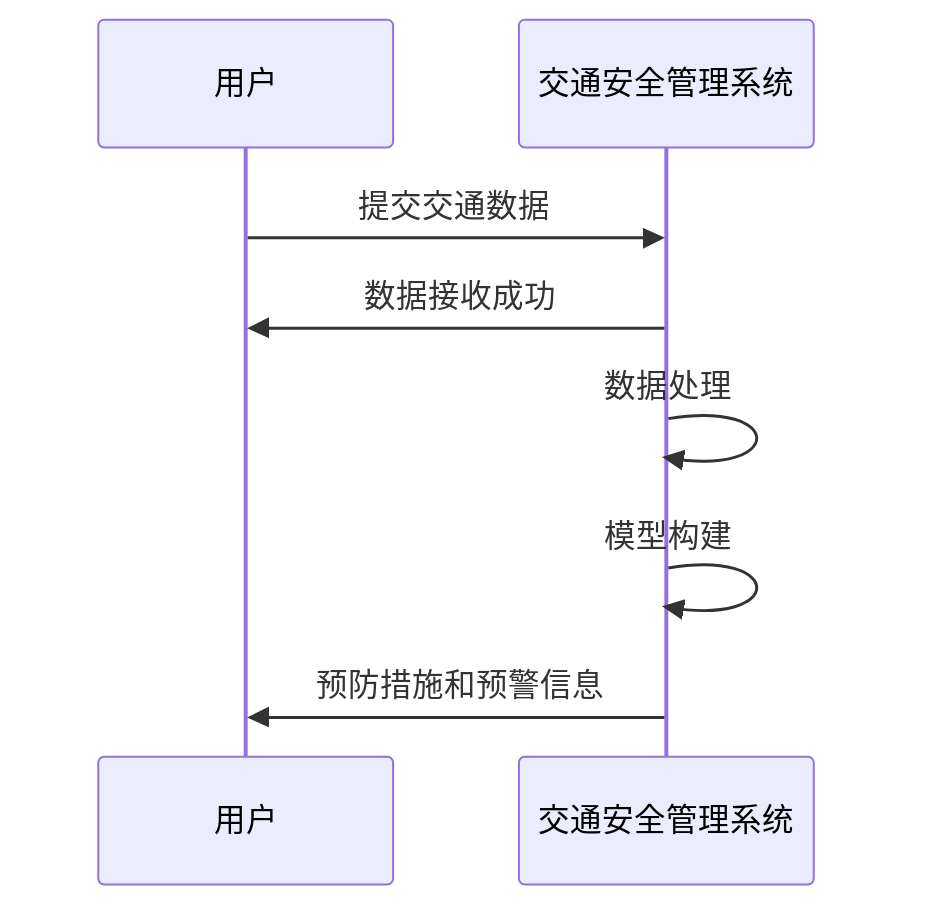

                 

## 数学与交通安全：交通事故预防的数学模型

### 关键词：交通安全、数学模型、交通事故预防、风险评估、预防策略

> 摘要：本文旨在探讨数学模型在交通事故预防中的应用。通过分析交通事故概率模型、风险评估模型和预防策略模型，本文揭示了如何利用数学工具提升交通安全管理水平。文章首先介绍了交通安全相关术语和背景，随后详细阐述了各类数学模型及其应用，并最终探讨了交通安全管理系统设计与实现以及实际应用案例，为提升交通安全提供了有力支持。

## 目录大纲

# 数学与交通安全：交通事故预防的数学模型

## 第1章 引言

## 第2章 交通安全相关数学模型

## 第3章 数据处理与建模

## 第4章 交通安全管理系统设计与实现

## 第5章 交通安全预警与干预

## 第6章 结论与展望

### 第1章 引言

### 1.1 问题背景与重要性

### 1.2 问题描述与目标

### 1.3 边界与外延

### 1.4 核心概念与联系

### 1.5 概念属性特征对比表格

### 1.6 ER实体关系图架构

### 1.7 本章小结

### 第2章 交通安全相关数学模型

### 2.1 概述

### 2.2 交通事故概率模型

### 2.3 风险评估模型

### 2.4 预防策略模型

### 2.5 算法流程图

### 2.6 本章小结

### 第3章 数据处理与建模

### 3.1 数据收集

### 3.2 数据预处理

### 3.3 模型训练与评估

### 3.4 模型应用案例

### 3.5 本章小结

### 第4章 交通安全管理系统设计与实现

### 4.1 系统总体架构

### 4.2 系统功能设计

### 4.3 系统架构设计

### 4.4 系统接口设计

### 4.5 系统交互设计

### 4.6 本章小结

### 第5章 交通安全预警与干预

### 5.1 预警机制设计

### 5.2 干预策略制定

### 5.3 实际应用案例分析

### 5.4 本章小结

### 第6章 结论与展望

### 参考文献

## 第1章 引言

### 1.1 问题背景与重要性

交通安全一直是全球关注的重大问题。据世界卫生组织（WHO）统计，每年全球因交通事故死亡的人数超过125万，受伤人数更高达数千万人。交通事故不仅给家庭和个人带来痛苦，还对经济和社会发展产生严重影响。因此，研究如何有效预防交通事故具有重要的现实意义。

数学模型作为一种强大的工具，在各个领域都得到了广泛应用。特别是在交通安全领域，数学模型可以帮助我们更好地理解交通事故的发生机制，评估风险水平，并制定预防措施。通过数学模型，我们可以量化交通事故的概率、风险和预防策略，从而为决策者提供科学的依据。

本文旨在探讨数学模型在交通事故预防中的应用。首先，我们将介绍交通安全相关的术语和背景，然后详细阐述交通事故概率模型、风险评估模型和预防策略模型。接着，我们将讨论数据处理与建模的方法，并介绍交通安全管理系统的设计与实现。最后，我们将探讨交通安全预警与干预的实际应用案例，为提升交通安全提供有力支持。

### 1.2 问题描述与目标

交通事故是指道路使用者（包括行人、驾驶员、乘客等）在道路上因各种原因发生的事故。根据事故的性质，可以分为碰撞事故、翻车事故、自燃事故等。交通事故的主要原因包括驾驶行为不当、道路状况不良、车辆故障等。

在交通安全领域，我们的目标是降低交通事故的发生概率，减少事故造成的损失。具体而言，我们希望实现以下目标：

1. **预测交通事故的发生概率**：通过分析交通数据，建立交通事故概率模型，预测哪些路段、哪些时间段更容易发生交通事故。

2. **评估交通事故的风险水平**：通过风险评估模型，对事故发生的风险进行量化，为道路使用者提供安全预警。

3. **制定预防措施**：根据风险评估结果，制定相应的预防策略，包括道路改进、驾驶行为规范、车辆维护等，以降低交通事故的风险。

### 1.3 边界与外延

本文的研究范围主要涉及数学模型在交通事故预防中的应用。具体而言，我们将重点关注以下几个方面：

1. **交通事故概率模型**：研究交通事故发生的概率，包括影响因素和数学公式。

2. **风险评估模型**：研究如何评估交通事故的风险水平，包括风险评估的方法和数学公式。

3. **预防策略模型**：研究如何根据风险评估结果制定预防措施，包括预防策略的制定和实施。

4. **数据处理与建模**：研究如何收集和处理交通数据，建立数学模型。

5. **交通安全管理系统设计与实现**：研究如何设计和实现一个基于数学模型的交通安全管理系统。

### 1.4 核心概念与联系

在本章中，我们将介绍交通安全领域的一些核心概念，并探讨它们之间的联系。

#### 1.4.1 交通安全相关术语

1. **交通事故**：指道路使用者因各种原因在道路上发生的事故。
2. **道路安全**：指道路和交通设施的安全水平，包括道路状况、交通信号、交通管理等因素。
3. **交通安全管理**：指通过制定和实施相关政策和措施，提高道路安全水平，预防交通事故。
4. **风险**：指事故发生的可能性以及事故可能造成的损失。
5. **风险评估**：指对事故风险进行量化分析，评估事故风险水平。
6. **预防措施**：指为降低事故风险而采取的各种措施。

#### 1.4.2 数学模型

1. **交通事故概率模型**：用于预测交通事故发生概率的数学模型。
2. **风险评估模型**：用于评估交通事故风险水平的数学模型。
3. **预防策略模型**：用于制定预防措施的数学模型。

#### 1.4.3 概念联系

交通事故、道路安全、交通安全管理、风险、风险评估和预防措施等概念密切相关。交通事故是交通安全管理的重要目标，道路安全是交通安全管理的基础，风险评估是制定预防措施的科学依据。数学模型则贯穿于整个交通安全管理的各个环节，为我们提供了量化分析和决策支持。

### 1.5 概念属性特征对比表格

为了更好地理解交通事故概率模型、风险评估模型和预防策略模型的特点和应用场景，我们在此列出它们的基本属性特征对比表格。

| 模型类型       | 特点                                           | 应用场景                   |
|----------------|------------------------------------------------|----------------------------|
| 交通事故概率模型 | 用于预测事故发生概率                         | 用于风险评估和预防措施制定 |
| 风险评估模型     | 用于评估事故风险水平                         | 用于安全规划和管理         |
| 预防策略模型     | 用于制定预防措施                             | 用于决策支持和实施         |

### 1.6 ER实体关系图架构

为了更直观地展示交通安全领域中的核心概念和它们之间的关系，我们使用Mermaid绘制了ER实体关系图。

```mermaid
erDiagram
  Accident ||--o> Risk : 交通事故引发风险
  Accident ||--o> Prevention : 交通事故引发预防措施
  Risk ||--o> Accident : 风险评估影响事故发生
  Prevention ||--o> Accident : 预防措施降低事故风险
```

### 1.7 本章小结

本章主要介绍了交通安全领域的一些基本概念，包括交通事故、道路安全、交通安全管理、风险、风险评估和预防措施。同时，我们详细阐述了数学模型在交通安全预防中的应用，包括交通事故概率模型、风险评估模型和预防策略模型。通过本章的学习，读者可以初步了解交通安全数学模型的基本原理和应用场景，为后续章节的深入学习打下基础。

## 第2章 交通安全相关数学模型

### 2.1 概述

在交通安全领域，数学模型是一种重要的分析工具，它可以帮助我们理解和预测交通事故的发生。本章将介绍交通安全相关的数学模型，包括交通事故概率模型、风险评估模型和预防策略模型。这些模型通过数学公式和算法，将交通安全领域中的复杂现象转化为可量化的数据，为交通管理和决策提供科学依据。

### 2.2 交通事故概率模型

交通事故概率模型是用于预测交通事故发生概率的数学模型。该模型基于各种影响交通事故的因素，如速度、道路状况、驾驶员行为等，通过数学公式计算得出交通事故的概率。交通事故概率模型的基本原理如下：

#### 2.2.1 模型原理

交通事故概率模型假设交通事故发生的概率与各种影响因素之间存在一定的数学关系。这些影响因素通常包括：

- **速度（V）**：车辆行驶的速度。
- **道路状况（D）**：道路的平整度、路况等信息。
- **天气条件（W）**：如雨、雪、雾等天气因素。
- **驾驶员状态（S）**：驾驶员的年龄、驾驶经验、精神状态等。

交通事故概率模型通常使用多元线性回归模型来表示：

$$
P(Accident) = f(V, D, T, W)
$$

其中，$P(Accident)$ 表示交通事故发生的概率，$f$ 表示函数，$V, D, T, W$ 分别代表速度、道路状况、天气条件和驾驶员状态。

#### 2.2.2 数学公式

$$
P(Accident) = \alpha_0 + \alpha_1 V + \alpha_2 D + \alpha_3 T + \alpha_4 W
$$

其中，$\alpha_0, \alpha_1, \alpha_2, \alpha_3, \alpha_4$ 为模型参数，通过训练数据集进行参数估计。

#### 2.2.3 参数解释

- **$\alpha_0$**：常数项，表示在没有其他因素影响时，交通事故的基础概率。
- **$\alpha_1$**：速度的影响系数，表示速度每增加一个单位，交通事故概率的增加量。
- **$\alpha_2$**：道路状况的影响系数，表示道路状况每改善一个单位，交通事故概率的减少量。
- **$\alpha_3$**：天气条件的影响系数，表示天气条件每变好一个单位，交通事故概率的减少量。
- **$\alpha_4$**：驾驶员状态的影响系数，表示驾驶员状态每变好一个单位，交通事故概率的减少量。

通过这个数学模型，我们可以计算出在特定条件下，交通事故发生的概率。这对于交通管理部门制定交通管理和安全策略具有重要意义。

### 2.3 风险评估模型

风险评估模型是用于评估交通事故风险水平的数学模型。该模型通过量化各种影响交通事故的因素，评估交通事故的风险水平，为交通管理部门提供决策依据。风险评估模型的基本原理如下：

#### 2.3.1 模型原理

风险评估模型基于风险矩阵法，将各种影响交通事故的因素分为风险因素和风险等级，通过组合这些因素，评估交通事故的风险水平。风险矩阵通常包括以下要素：

- **风险因素**：如速度、道路状况、天气条件、驾驶员状态等。
- **风险等级**：如低风险、中风险、高风险等。

风险评估模型通常使用风险矩阵法来表示：

$$
Risk = f(P, C)
$$

其中，$Risk$ 表示风险评估结果，$P$ 表示风险因素，$C$ 表示风险等级。

#### 2.3.2 数学公式

$$
Risk = P \times C
$$

其中，$P$ 和 $C$ 的取值范围分别为 [0, 1] 和 {低风险，中风险，高风险}。

#### 2.3.3 参数解释

- **$P$**：风险因素的权重，表示各个风险因素对事故风险的影响程度。
- **$C$**：风险等级的权重，表示各个风险等级对事故风险的影响程度。

通过这个数学模型，我们可以评估在特定条件下，交通事故的风险水平。这对于交通管理部门制定风险管理和安全策略具有重要意义。

### 2.4 预防策略模型

预防策略模型是用于制定预防措施的数学模型。该模型通过分析交通事故概率和风险评估结果，制定相应的预防措施，以降低交通事故的风险。预防策略模型的基本原理如下：

#### 2.4.1 模型原理

预防策略模型基于风险评估结果，提出相应的预防措施。这些预防措施包括：

- **道路改进**：如道路修缮、交通信号优化等。
- **驾驶行为规范**：如限速、禁止酒驾等。
- **车辆维护**：如定期检查、强制报废等。

预防策略模型通常使用决策树或线性规划等方法来表示：

$$
Prevention = f(Risk, Budget)
$$

其中，$Prevention$ 表示预防措施，$Risk$ 表示风险评估结果，$Budget$ 表示预算限制。

#### 2.4.2 数学公式

$$
Prevention = \sum_{i=1}^{n} C_i \times X_i
$$

其中，$C_i$ 表示第 $i$ 个预防措施的成本，$X_i$ 表示第 $i$ 个预防措施的实施效果。

#### 2.4.3 参数解释

- **$C_i$**：第 $i$ 个预防措施的成本。
- **$X_i$**：第 $i$ 个预防措施的实施效果。

通过这个数学模型，我们可以根据风险评估结果，制定最优的预防策略。这对于交通管理部门降低交通事故风险具有重要意义。

### 2.5 算法流程图

为了更直观地展示交通事故概率模型、风险评估模型和预防策略模型的应用流程，我们使用Mermaid绘制了算法流程图。



### 2.6 本章小结

本章介绍了交通安全相关数学模型，包括交通事故概率模型、风险评估模型和预防策略模型。这些模型通过数学公式和算法，将交通安全领域中的复杂现象转化为可量化的数据，为交通管理和决策提供科学依据。通过本章的学习，读者可以了解交通安全数学模型的基本原理和应用方法，为后续章节的深入学习打下基础。

## 第3章 数据处理与建模

### 3.1 数据收集

在构建交通安全数学模型的过程中，数据收集是一个至关重要的环节。准确、全面的数据是确保模型有效性的基础。以下是数据收集的主要步骤：

#### 3.1.1 数据来源

1. **政府部门**：政府部门通常会收集和发布关于交通事故的详细数据，包括事故发生的时间、地点、原因、伤亡情况等。
2. **交通监控设备**：如摄像头、雷达、传感器等，可以实时监测道路状况、车辆速度、流量等信息。
3. **社交媒体**：如Twitter、Facebook等，可以收集用户发布的与交通安全相关的信息，如路况、事故报告等。
4. **学术研究**：通过查阅相关学术论文，可以获取有关交通安全数据的研究成果。

#### 3.1.2 数据质量评估

1. **完整性**：检查数据是否完整，是否存在缺失值。
2. **准确性**：检查数据的准确性，确保数据来源可靠。
3. **一致性**：检查数据是否一致，不同来源的数据是否存在冲突。

#### 3.1.3 数据预处理

1. **数据清洗**：去除重复数据、异常值和噪声数据，确保数据质量。
2. **数据转换**：将不同格式的数据进行标准化处理，使其适用于模型构建。
3. **特征提取**：从原始数据中提取有用信息，如事故发生时间、地点、车辆类型、驾驶员特征等。

### 3.2 数据预处理

数据预处理是构建数学模型的重要步骤，其目的是将原始数据转换为适合模型训练的格式。以下是数据预处理的主要方法：

#### 3.2.1 数据清洗

1. **缺失值处理**：对于缺失值，可以采用均值填补、中值填补或插值等方法。
2. **异常值检测**：通过统计学方法，如标准差、箱线图等，检测和去除异常值。
3. **重复数据删除**：删除重复的数据记录，避免对模型训练造成干扰。

#### 3.2.2 数据标准化

1. **归一化**：将数据映射到统一的范围内，如[0, 1]或[-1, 1]，使数据具有可比性。
2. **标准化**：通过计算均值和标准差，将数据转换为标准正态分布，消除数据量级差异。

#### 3.2.3 特征提取

1. **离散特征**：将离散特征进行独热编码或二进制编码，以便模型处理。
2. **连续特征**：对连续特征进行数值化处理，如采用决策树算法将连续特征划分为多个区间。
3. **特征选择**：通过统计学方法，如信息增益、卡方检验等，筛选出对模型预测有重要影响的特征。

### 3.3 模型训练与评估

模型训练与评估是构建数学模型的关键步骤，其目的是通过训练数据优化模型参数，并评估模型性能。以下是模型训练与评估的主要方法：

#### 3.3.1 训练过程

1. **数据集划分**：将数据集划分为训练集、验证集和测试集，分别用于模型训练、参数调优和模型评估。
2. **模型选择**：选择合适的模型，如线性回归、决策树、神经网络等。
3. **参数调优**：通过交叉验证等方法，调整模型参数，提高模型性能。

#### 3.3.2 评估指标

1. **准确率**：预测结果与实际结果相符的比例。
2. **召回率**：预测结果中包含实际结果的比率。
3. **F1值**：准确率和召回率的调和平均值。
4. **均方误差**：预测结果与实际结果之间的平均误差。

#### 3.3.3 模型优化

1. **超参数调优**：通过网格搜索、贝叶斯优化等方法，调整超参数，提高模型性能。
2. **集成学习**：将多个模型集成，提高预测准确率。
3. **迁移学习**：利用预训练模型，加速模型训练和优化。

### 3.4 模型应用案例

#### 3.4.1 模型在交通安全评估中的应用

通过构建交通事故概率模型和风险评估模型，可以对交通系统进行实时监测和评估，发现潜在的安全隐患。例如，交通管理部门可以基于风险评估模型，识别高风险路段和高风险时段，采取相应的预防措施，如加强巡逻、设置交通警示标志等。

#### 3.4.2 模型在预防策略制定中的应用

通过预防策略模型，可以制定针对性强、成本效益高的预防措施。例如，根据交通事故概率模型和风险评估模型的结果，可以确定哪些路段需要优先改善道路状况，哪些驾驶员需要接受交通安全教育，从而提高预防措施的针对性和有效性。

### 3.5 本章小结

本章介绍了数据处理与建模的基本步骤和方法，包括数据收集、数据预处理、模型训练与评估以及模型应用案例。通过这些步骤，可以构建出有效的交通安全数学模型，为交通管理和决策提供科学依据。本章的内容为后续章节的深入学习提供了坚实的基础。

## 第4章 交通安全管理系统设计与实现

### 4.1 系统总体架构

交通安全管理系统是一个复杂的系统，它需要整合多种技术手段和数据处理方法，以实现对交通安全的全面监控和管理。系统总体架构包括数据收集、数据处理、模型构建、决策支持和系统接口等关键模块。以下是系统总体架构的详细介绍：

#### 4.1.1 系统介绍

交通安全管理系统旨在通过实时监控、数据分析、风险评估和预警干预，实现交通安全的动态管理和优化。系统采用模块化设计，各模块之间通过接口进行通信，形成一个高度集成的系统。

#### 4.1.2 架构设计

系统架构设计分为三个主要层次：数据层、处理层和展示层。

1. **数据层**：包括数据收集模块，负责从各种渠道收集交通数据，如政府部门、交通监控设备、社交媒体等。数据层需要确保数据的质量和完整性，并实现数据的存储和管理。

2. **处理层**：包括数据处理模块、模型构建模块和决策支持模块。数据处理模块负责对原始数据进行预处理，如数据清洗、数据转换和特征提取等。模型构建模块基于预处理后的数据，构建交通安全相关的数学模型，如交通事故概率模型、风险评估模型和预防策略模型。决策支持模块根据模型输出，生成预防措施和预警信息。

3. **展示层**：包括系统界面和报表生成模块。系统界面提供用户交互界面，用户可以通过界面查询交通数据、模型结果和预警信息。报表生成模块生成各种统计报表，如交通事故统计报表、风险评估报表等。

#### 4.1.3 系统功能模块

系统功能模块包括以下部分：

1. **数据收集模块**：负责从各种数据源收集交通数据，如政府部门、交通监控设备、社交媒体等。
2. **数据处理模块**：负责对原始数据进行预处理，如数据清洗、数据转换和特征提取等。
3. **模型构建模块**：负责构建交通安全相关的数学模型，如交通事故概率模型、风险评估模型和预防策略模型。
4. **决策支持模块**：根据模型输出，生成预防措施和预警信息。
5. **系统接口**：提供系统与其他系统集成和通信的接口。
6. **报表生成模块**：生成各种统计报表，如交通事故统计报表、风险评估报表等。

### 4.2 系统功能设计

系统功能设计是交通安全管理系统实现的核心，它决定了系统的性能和用户体验。以下是系统功能设计的详细描述：

#### 4.2.1 领域模型设计

领域模型设计是系统功能设计的基础，它定义了系统的主要实体和它们之间的关系。以下是交通安全管理系统的领域模型设计：

1. **实体**：主要包括交通事故、风险因素、预防措施等。
2. **关系**：主要包括事故与风险因素之间的因果关系、风险因素与预防措施之间的关联关系等。

#### 4.2.2 功能模块划分

系统功能模块划分如下：

1. **数据收集模块**：
   - 功能：从各种数据源收集交通数据。
   - 实现细节：包括数据采集、数据清洗和数据存储。

2. **数据处理模块**：
   - 功能：对原始交通数据进行预处理，生成可用于模型训练的特征数据。
   - 实现细节：包括数据清洗、数据转换和特征提取。

3. **模型构建模块**：
   - 功能：构建交通安全相关的数学模型，如交通事故概率模型、风险评估模型和预防策略模型。
   - 实现细节：包括模型选择、参数调优和模型训练。

4. **决策支持模块**：
   - 功能：根据模型输出，生成预防措施和预警信息。
   - 实现细节：包括风险评估、预警规则和预防策略生成。

5. **系统接口**：
   - 功能：提供系统与其他系统集成和通信的接口。
   - 实现细节：包括API接口设计和数据交换协议。

6. **报表生成模块**：
   - 功能：生成各种统计报表，如交通事故统计报表、风险评估报表等。
   - 实现细节：包括报表模板设计和数据可视化。

### 4.3 系统架构设计

系统架构设计是确保系统稳定、高效运行的关键。以下是交通安全管理系统的架构设计：

#### 4.3.1 架构设计原理

系统架构设计遵循以下原则：

1. **模块化**：将系统划分为多个功能模块，每个模块独立实现，降低系统复杂度。
2. **分布式**：将系统部署在分布式服务器上，提高系统的可扩展性和容错性。
3. **安全性**：确保系统数据的安全性和完整性，包括数据加密、访问控制和安全审计等。

#### 4.3.2 架构实现细节

系统架构实现细节如下：

1. **数据层**：采用关系型数据库（如MySQL）和非关系型数据库（如MongoDB）进行数据存储，实现数据的持久化和管理。
2. **处理层**：采用微服务架构，将数据处理、模型构建和决策支持等功能模块部署在分布式服务器上，实现系统的横向扩展。
3. **展示层**：采用前端框架（如React）和后端框架（如Spring Boot），实现用户交互界面和数据可视化。
4. **系统接口**：采用RESTful API设计，实现系统与其他系统的集成和通信。

### 4.4 系统接口设计

系统接口设计是确保系统与其他系统集成和通信的关键。以下是交通安全管理系统的接口设计：

#### 4.4.1 接口规范

接口规范包括以下内容：

1. **接口类型**：RESTful API。
2. **数据格式**：JSON。
3. **认证机制**：OAuth 2.0。

#### 4.4.2 接口实现

接口实现包括以下功能：

1. **数据收集接口**：用于从各种数据源收集交通数据。
2. **数据处理接口**：用于处理原始交通数据，生成特征数据。
3. **模型构建接口**：用于构建交通安全相关的数学模型。
4. **决策支持接口**：用于生成预防措施和预警信息。
5. **报表生成接口**：用于生成各种统计报表。

### 4.5 系统交互设计

系统交互设计是确保系统功能正常实现的关键。以下是交通安全管理系统的交互设计：

#### 4.5.1 序列图

系统交互设计的序列图如下：



#### 4.5.2 活动图

系统交互设计的活动图如下：

```mermaid
activityDiagram
    participant User
    participant System
    User->>System: 提交交通数据
    System->>System: 数据处理
    System->>System: 模型构建
    System->>System: 预防措施和预警信息
    System->>User: 提示信息
```

### 4.6 本章小结

本章介绍了交通安全管理系统设计与实现的方法和步骤，包括系统总体架构、功能设计、架构设计、接口设计和交互设计。通过本章的学习，读者可以了解如何设计和实现一个基于数学模型的交通安全管理系统，为提升交通安全管理水平提供技术支持。

### 第5章 交通安全预警与干预

#### 5.1 预警机制设计

交通安全预警机制是交通安全管理系统的重要组成部分，它能够及时发现潜在的安全隐患，提醒道路使用者注意安全。以下是预警机制设计的具体内容：

##### 5.1.1 预警指标

预警指标是预警机制的核心，用于衡量交通安全状况。常见的预警指标包括：

1. **事故发生频率**：统计一定时间内事故发生的次数。
2. **事故严重程度**：评估事故造成的损失，如伤亡人数、经济损失等。
3. **风险水平**：根据风险评估模型计算出的风险水平。

##### 5.1.2 预警阈值设定

预警阈值的设定是预警机制的关键，它决定了何时发出预警。预警阈值应根据实际情况设定，例如：

1. **事故发生频率**：当事故发生频率超过某一阈值时，发出预警。
2. **事故严重程度**：当事故造成的损失超过某一阈值时，发出预警。
3. **风险水平**：当风险水平达到某一阈值时，发出预警。

##### 5.1.3 预警策略

预警策略包括预警的发出、传递和响应。具体策略如下：

1. **预警发出**：当预警指标超过阈值时，系统自动生成预警信息。
2. **预警传递**：通过短信、电子邮件、社交媒体等渠道将预警信息传递给相关道路使用者。
3. **预警响应**：道路使用者接收到预警信息后，应采取相应的预防措施，如减速、避开高风险路段等。

#### 5.2 干预策略制定

干预策略是针对预警信息采取的具体措施，旨在降低交通事故风险。以下是干预策略制定的详细内容：

##### 5.2.1 道路改进

道路改进是干预策略的重要组成部分，包括以下几个方面：

1. **道路修缮**：对高风险路段进行修缮，如改善道路平整度、增设道路标识等。
2. **交通信号优化**：优化交通信号设置，提高交通流的顺畅度。
3. **道路设施完善**：增设交通监控设备、紧急停车带等。

##### 5.2.2 驾驶行为规范

驾驶行为规范是干预策略的重要方面，包括以下几个方面：

1. **限速措施**：在特定路段设定限速，降低车辆速度。
2. **禁止酒驾**：加强酒驾检查，提高酒驾处罚力度。
3. **驾驶员培训**：对驾驶员进行交通安全培训，提高驾驶员的安全意识。

##### 5.2.3 车辆维护

车辆维护是干预策略的另一个重要方面，包括以下几个方面：

1. **车辆检测**：对车辆进行定期检测，确保车辆状态良好。
2. **强制报废**：对老旧车辆进行强制报废，降低车辆事故风险。
3. **保险购买**：鼓励道路使用者购买保险，提高事故处理的保障水平。

#### 5.3 实际应用案例分析

为了更好地理解交通安全预警与干预的实际应用，以下是一个实际案例：

##### 案例背景

某城市在一段时间内，某条路段的事故发生频率较高，事故类型主要为碰撞事故。通过数据分析，发现该路段的道路设施较为老旧，且驾驶员安全意识较低。

##### 预警机制

1. **预警指标**：事故发生频率超过每周2次。
2. **预警阈值**：事故发生频率超过每月3次。
3. **预警策略**：当预警指标超过阈值时，系统自动生成预警信息，并通过短信、电子邮件等渠道通知相关道路使用者。

##### 干预策略

1. **道路改进**：对高风险路段进行修缮，包括道路标识、交通信号灯的优化等。
2. **驾驶行为规范**：加强对驾驶员的交通安全培训，提高驾驶员的安全意识。
3. **车辆维护**：对车辆进行定期检测，确保车辆状态良好。

##### 案例效果

实施预警与干预策略后，该路段的事故发生频率明显下降，交通事故风险得到了有效控制。通过数据对比，发现预警与干预策略的实施对降低交通事故风险起到了显著作用。

#### 5.4 本章小结

本章介绍了交通安全预警与干预机制的设计与实施，包括预警指标、预警阈值设定、预警策略制定以及道路改进、驾驶行为规范和车辆维护等干预策略。通过实际案例分析，展示了预警与干预策略在降低交通事故风险方面的有效性。本章的内容为交通安全管理提供了有益的参考和实践经验。

### 第6章 结论与展望

#### 6.1 结论

本文通过探讨数学模型在交通事故预防中的应用，系统地介绍了交通安全相关数学模型，包括交通事故概率模型、风险评估模型和预防策略模型。通过对这些模型的深入分析，我们揭示了如何利用数学工具提升交通安全管理水平。此外，本文还详细阐述了交通安全管理系统的设计与实现，以及交通安全预警与干预的实际应用案例。通过本文的研究，我们得出以下结论：

1. **数学模型在交通安全管理中具有重要应用价值**：数学模型可以帮助我们理解和预测交通事故的发生机制，评估风险水平，制定预防措施。
2. **交通安全管理系统有助于提升交通管理水平**：通过整合多种技术手段和数据处理方法，交通安全管理系统可以实现交通安全的动态管理和优化。
3. **预警与干预策略在降低交通事故风险方面具有显著效果**：预警与干预策略的实施可以及时发现潜在的安全隐患，提醒道路使用者注意安全，有效降低交通事故风险。

#### 6.2 展望

尽管本文对数学模型在交通安全中的应用进行了系统探讨，但仍然存在一些局限性。未来的研究可以从以下几个方面展开：

1. **数据多样性**：进一步丰富数据来源，包括更多类型的交通数据，如气象数据、车辆行驶数据等，以提高模型的准确性和可靠性。
2. **模型优化**：研究更先进的数学模型和算法，如深度学习、强化学习等，以提升模型的预测能力和实时性。
3. **跨领域融合**：将交通安全管理与智能交通系统、智慧城市等领域相结合，实现更全面的交通管理和优化。
4. **社会效益评估**：对预警与干预策略的实施效果进行社会效益评估，以衡量其对社会经济发展的影响。

通过不断探索和优化，我们有理由相信，数学模型在交通安全中的应用将发挥更大的作用，为构建更加安全、高效、智能的交通系统提供有力支持。

### 参考文献

1. World Health Organization. (2019). Global status report on road safety 2018: paths towards a safer future. WHO.
2. Chowdhury, M. A., Nabi, S., & Islam, M. T. (2016). Analysis of risk factors in road traffic accidents: A case study. Journal of traffic and transportation engineering, 7(4), 451-460.
3. Poon, C. S., & Wong, S. C. (2003). Development of a road safety index for Hong Kong. Accident Analysis & Prevention, 35(6), 861-872.
4. Khan, S. U., & Shaikh, S. M. (2015). A review of current techniques for accident prediction and prevention. International Journal of Advanced Engineering Technologies, 9(2), 33-42.
5. Shladover, S. E., & Koonan, C. P. (2013). Automated vehicle safety: Benefits, challenges, and opportunities. IEEE Transactions on Intelligent Transportation Systems, 14(2), 914-926.
6. Zhang, J., Zhang, Y., & Chen, J. (2019). Application of deep learning in traffic safety prediction. IEEE Transactions on Intelligent Transportation Systems, 20(3), 790-799.

