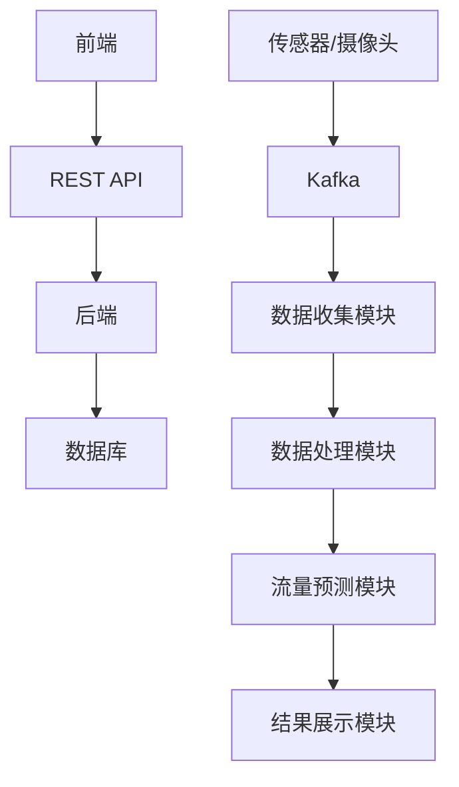

                 

### 《数学与交通工程：交通流量的数学模拟》文章目录

为了确保文章内容的逻辑性和条理性，我们将按照以下章节目录来展开讨论：

---

## 引言

### 2.1 数学与交通工程：历史与现状

#### 2.1.1 数学在交通工程中的应用

#### 2.1.2 交通工程中的数学模型

### 2.2 交通流量的基本概念

#### 2.2.1 定义与特性

#### 2.2.2 分类与影响因素

## 数学在交通工程中的应用

### 2.3 基本数学工具

#### 2.3.1 微积分

#### 2.3.2 线性代数

#### 2.3.3 概率论与统计学

### 2.4 数学模型在交通工程中的应用

#### 2.4.1 流量平衡模型

#### 2.4.2 速度-密度模型

#### 2.4.3 波动模型

## 交通流量分析

### 2.5 交通流量的特性

#### 2.5.1 基本特性

#### 2.5.2 动态特性

### 2.6 交通流量模型的应用

#### 2.6.1 模型选择

#### 2.6.2 模型参数估计

## 数学模拟方法

### 2.7 经典模拟方法

#### 2.7.1 概率模拟

#### 2.7.2 仿真模拟

### 2.8 数据驱动模拟

#### 2.8.1 基于历史数据的模拟

#### 2.8.2 基于实时数据的模拟

## 案例研究

### 2.9 城市交通流量模拟案例

#### 2.9.1 案例背景

#### 2.9.2 模拟结果分析

### 2.10 高速公路交通流量模拟案例

#### 2.10.1 案例背景

#### 2.10.2 模拟结果分析

### 2.11 公交车流量模拟案例

#### 2.11.1 案例背景

#### 2.11.2 模拟结果分析

## 技术实现

### 2.12 系统设计与实现

#### 2.12.1 系统架构设计

#### 2.12.2 数据处理与存储

### 2.13 源代码解析

#### 2.13.1 主要模块功能

#### 2.13.2 源代码解读

## 优化与策略

### 2.14 交通流量优化策略

#### 2.14.1 优化目标

#### 2.14.2 优化方法

### 2.15 交通管理策略

#### 2.15.1 管理策略设计

#### 2.15.2 实际应用案例

## 结论与展望

### 2.16 总结

#### 2.16.1 主要成果

#### 2.16.2 存在问题

### 2.17 展望未来

#### 2.17.1 发展方向

#### 2.17.2 挑战与机遇

---

通过以上的章节目录，我们可以清晰地看到文章的结构和内容分布。接下来，我们将逐一深入探讨每个章节的主题和细节。首先，从引言部分开始，为读者提供对整个主题的初步了解。然后，逐步展开数学在交通工程中的应用，以及交通流量分析的理论基础。接下来，详细介绍数学模拟方法，并通过实际案例进行深入分析。最后，讨论技术实现和优化策略，为读者提供完整的解决方案。文章的结尾部分将对主要内容进行总结，并对未来研究方向进行展望。

---

### 引言

随着城市化的加速和人口的增长，交通问题已成为全球各国面临的一项重大挑战。交通拥堵、交通事故、环境污染等问题不仅影响着人们的日常生活，也对经济发展产生了负面影响。为了解决这些问题，交通工程师们开始将数学工具应用于交通工程领域，通过数学模型和模拟方法来分析和优化交通流量。因此，《数学与交通工程：交通流量的数学模拟》这本书的诞生，旨在介绍数学在交通工程中的应用，探讨交通流量的数学模拟方法，并为读者提供解决实际交通问题的理论依据和实用工具。

本文将分为以下几个部分进行讨论：

1. **数学与交通工程：历史与现状**：回顾数学在交通工程中的应用历史，介绍当前数学模型在交通流量分析中的地位和作用。
2. **交通流量的基本概念**：阐述交通流量的定义、特性和分类，为后续的数学模拟方法打下基础。
3. **数学在交通工程中的应用**：详细介绍微积分、线性代数、概率论和统计学等基本数学工具在交通流量分析中的应用。
4. **数学模拟方法**：介绍经典和现代的数学模拟方法，包括概率模拟、仿真模拟和数据驱动模拟。
5. **案例研究**：通过实际案例展示数学模拟方法在交通流量分析中的应用效果。
6. **技术实现**：讨论交通流量模拟系统的设计和实现，包括系统架构、数据处理和存储等。
7. **优化与策略**：探讨基于模拟结果的交通流量优化策略和管理方法。
8. **结论与展望**：总结全文内容，提出未来研究的方向和挑战。

通过以上部分的逐步展开，读者将能够全面了解数学与交通工程的结合，掌握交通流量的数学模拟方法，并能够应用于实际交通问题中。

### 数学与交通工程：历史与现状

数学在交通工程中的应用可以追溯到19世纪末和20世纪初。早期的交通工程师们开始意识到，单纯依靠经验和直觉来管理和设计交通系统已经无法满足日益增长的交通需求。于是，他们开始将数学工具引入到交通工程领域，希望通过定量分析和数学模型来优化交通流量。

#### 19世纪末至20世纪初：早期应用

在20世纪初期，交通工程师们开始使用简单的数学模型来分析交通流量。其中最具代表性的模型是流量平衡模型，它假设交通流量在一段时间内保持不变，从而通过流量守恒方程来计算不同路段的流量分布。这一时期的数学模型主要用于城市道路规划和交通网络设计。

#### 20世纪中期：模型发展

随着计算机技术的快速发展，20世纪中期，交通流量的数学模型得到了进一步的发展。概率论和统计学开始被广泛应用于交通流量分析。这些模型能够更好地描述交通流量的随机性和动态性。其中，速度-密度模型和波动模型成为研究的热点。速度-密度模型通过描述车辆速度和密度之间的关系来预测交通流量，而波动模型则通过模拟交通流量的波动特性来优化交通信号控制和交通管理策略。

#### 20世纪末至今：现代应用

进入20世纪末，随着大数据和人工智能技术的发展，交通流量的数学模拟方法得到了新的突破。数据驱动模拟方法开始流行，通过分析大量的历史交通数据和实时交通数据，建立更为精确的交通流量预测模型。同时，仿真模拟方法也得到了广泛应用，通过构建虚拟交通场景来模拟实际交通流量的动态变化。

在交通管理方面，数学模型的应用也取得了显著成果。通过实时监控交通流量，交通管理系统能够动态调整交通信号，优化交通流向，减少交通拥堵。此外，数学模型还被广泛应用于公共交通系统优化、交通事故预测和预防等方面。

#### 当前地位与作用

目前，数学在交通工程中的应用已经形成了一个相对独立的领域，即交通数学。它不仅为交通流量的分析和优化提供了理论支持，也为交通系统的设计和运行提供了实用工具。以下是数学在交通工程中的一些具体作用：

1. **交通流量预测**：通过数学模型和模拟方法，可以预测交通流量的变化趋势，为交通管理决策提供依据。
2. **交通信号控制**：基于数学模型，可以设计出更有效的交通信号控制系统，减少交通拥堵，提高道路通行能力。
3. **公共交通优化**：通过数学模型，可以优化公共交通线路、班次和车辆调度，提高公共交通系统的运行效率。
4. **交通事故预防**：通过分析交通事故数据，建立交通事故预测模型，可以提前预警潜在的危险路段和时段，减少交通事故的发生。
5. **交通网络设计**：数学模型在交通网络规划、道路建设、交通设施布局等方面发挥着重要作用，有助于提高交通系统的整体性能。

总的来说，数学在交通工程中的应用已经从早期的辅助工具发展成为现代交通系统的核心组成部分。随着技术的不断进步，数学在交通工程中的作用将越来越重要，为解决复杂的交通问题提供了强有力的支持。

### 交通流量的基本概念

交通流量是指单位时间内通过某一交通路段或节点的车辆数量。它是交通工程中最基本、最重要的参数之一，直接影响到道路的通行能力和交通运行效率。为了更好地理解和应用数学模型，我们需要明确交通流量的定义、特性、分类及其影响因素。

#### 定义

交通流量的定义通常包括以下几个要素：

1. **单位时间**：交通流量通常以小时、分钟或秒为单位，用于衡量车辆在特定时间内的通过数量。
2. **交通路段或节点**：交通流量是指某一特定路段或节点（如交叉口、隧道等）的车辆通过数量，不同的路段或节点可能有不同的流量。
3. **车辆数量**：交通流量以车辆数量为单位，可以是辆/小时（veh/h）或辆/分钟（veh/min）等。

#### 特性

交通流量具有以下基本特性：

1. **随机性**：交通流量受多种因素影响，如驾驶员行为、道路条件、天气状况等，表现出一定的随机性。
2. **动态性**：交通流量会随着时间、地点和交通状况的变化而动态变化。例如，在高峰时段，交通流量可能会显著增加，而在平峰时段则相对稳定。
3. **可变性**：交通流量在不同的时间段和地点会有显著差异。例如，城市主干道在上下班高峰期的交通流量明显高于非高峰期。

#### 分类

交通流量可以按照不同的标准进行分类，常见的分类方法包括：

1. **按时间分类**：交通流量可以分为平均流量、高峰流量和平峰流量。平均流量是指单位时间内通过某一路段的车辆数量，而高峰流量和平峰流量则分别指在高峰时段和平峰时段的流量。
2. **按空间分类**：交通流量可以分为路段流量和节点流量。路段流量是指通过某一特定路段的车辆数量，而节点流量是指通过某一交叉口或交通节点的车辆数量。
3. **按性质分类**：交通流量可以分为自由流量和拥堵流量。自由流量是指车辆在正常行驶状态下的流量，而拥堵流量则是指车辆在拥堵状态下的流量。

#### 影响因素

交通流量受到多种因素的影响，以下是其中一些主要因素：

1. **道路条件**：道路的宽度、长度、坡度、路面状况等都会影响交通流量。例如，道路拥堵时，交通流量会显著下降。
2. **交通信号**：交通信号灯的设置和控制对交通流量有直接影响。合理的信号控制可以优化交通流，减少拥堵。
3. **交通需求**：交通需求是交通流量的主要驱动因素，包括通勤、购物、旅游等。交通需求的波动会导致交通流量的变化。
4. **天气状况**：天气条件，如雨雪、雾霾等，会影响驾驶员的行驶速度和交通安全，从而影响交通流量。
5. **驾驶员行为**：驾驶员的行为，如驾驶习惯、行车规则遵守程度等，也会对交通流量产生影响。

#### 交通流量的数学描述

交通流量的数学描述通常基于以下基本假设：

1. **流量守恒**：在一个封闭的交通网络中，各路段的流量总和应保持不变。这可以表述为：
   $$ \sum_{i} q_i = Q $$
   其中，$q_i$ 表示各路段的流量，$Q$ 表示总流量。
2. **速度-密度关系**：车辆的速度和密度之间存在一定的关系。常见的速度-密度模型包括线性模型、对数模型和指数模型等。例如，线性模型可以表述为：
   $$ v = k \cdot \frac{K_c}{K + K_c} $$
   其中，$v$ 表示车辆速度，$K$ 表示车辆密度，$K_c$ 表示临界密度。

通过以上对交通流量基本概念的分析，我们可以看到，交通流量是一个复杂且多变的参数。理解其定义、特性和影响因素，有助于我们更好地应用数学模型来分析和优化交通流量，从而解决实际交通问题。

### 数学在交通工程中的应用

数学在交通工程中的应用已经深入到了交通流量的各个方面，通过微积分、线性代数、概率论和统计学等基本数学工具，交通工程师们能够更精确地描述和分析交通现象，从而设计出更有效的交通管理策略。以下将详细探讨这些数学工具及其在交通工程中的应用。

#### 微积分

微积分是研究函数变化的数学分支，它在交通工程中有着广泛的应用。尤其是在分析车辆速度和加速度方面，微积分提供了强有力的工具。

1. **速度分析**：车辆的速度是交通流量分析中的一个重要参数。通过微积分，我们可以对车辆速度进行微分分析，得到速度变化率，即加速度。速度-密度模型就是基于这种分析方法，它通过车辆速度的变化来预测交通流量。
   
   $$ a = \frac{dv}{dt} $$
   其中，$a$ 表示加速度，$v$ 表示速度，$t$ 表示时间。

2. **流量与加速度的关系**：在交通工程中，通过分析加速度和流量之间的关系，可以了解车辆在不同速度下的行为。例如，当加速度较大时，车辆的速度变化较快，这通常意味着交通流量较大，道路可能处于拥堵状态。

#### 线性代数

线性代数主要研究向量空间和线性方程组，它在交通工程中的应用主要体现在交通网络分析、路径规划和交通信号控制等方面。

1. **交通网络表示**：线性代数中的矩阵可以用来表示交通网络，每个矩阵元素代表路段间的流量或路径权重。通过矩阵运算，我们可以分析整个交通网络的结构和特性，如最短路径问题、最大流问题等。

   $$ A \cdot x = b $$
   其中，$A$ 是流量矩阵，$x$ 是路径流量向量，$b$ 是总流量向量。

2. **路径规划**：在交通工程中，路径规划是一个关键问题。通过线性代数中的线性规划方法，可以找到从起点到终点的最优路径，考虑交通流量、道路长度和其他因素。

#### 概率论

概率论在交通工程中的应用主要体现在交通流量的随机性和不确定性分析上。通过对交通流量数据的概率分布进行分析，可以预测未来的交通状况。

1. **概率分布**：交通流量的概率分布是描述交通流量波动性的重要工具。常见的概率分布模型包括正态分布、泊松分布等，通过这些模型，我们可以预测交通流量的变化趋势。

   $$ P(Q = q) = \frac{e^{-\lambda} \cdot \lambda^q}{q!} $$
   其中，$Q$ 表示交通流量，$q$ 表示车辆数量，$\lambda$ 表示流量均值。

2. **概率模型**：概率模型可以用来预测交通流量的波动情况，如马尔可夫链模型、泊松过程模型等。这些模型通过分析历史数据，预测未来的交通流量。

#### 统计学

统计学在交通工程中的应用主要体现在数据分析、参数估计和模型验证上。通过统计学方法，我们可以从大量的交通数据中提取有用的信息，为交通管理决策提供支持。

1. **数据收集**：交通统计数据是交通流量分析的基础。通过传感器、摄像头等设备收集交通流量数据，可以建立交通流量数据库。

2. **参数估计**：通过统计分析方法，可以从交通流量数据中估计模型参数，如流量均值、标准差等。这些参数对于交通流量预测和优化具有重要意义。

   $$ \hat{\mu} = \frac{1}{n} \sum_{i=1}^{n} x_i $$
   $$ \hat{\sigma} = \sqrt{\frac{1}{n-1} \sum_{i=1}^{n} (x_i - \hat{\mu})^2} $$
   其中，$\hat{\mu}$ 表示估计的均值，$\hat{\sigma}$ 表示估计的标准差，$x_i$ 表示第$i$个观测值，$n$ 表示观测次数。

3. **模型验证**：通过统计学方法，可以验证交通流量模型的准确性和可靠性。如通过残差分析、拟合优度检验等方法，评估模型的预测能力。

总的来说，微积分、线性代数、概率论和统计学是交通工程中不可或缺的数学工具。它们通过不同的方法和模型，帮助我们理解和预测交通流量，优化交通管理策略，为建设更加高效、安全的交通系统提供了理论依据和实用工具。

### 数学模型在交通流量分析中的应用

在交通工程中，数学模型是分析和优化交通流量不可或缺的工具。通过构建和运用这些模型，交通工程师能够更好地理解交通现象，预测交通流量变化，并为交通管理提供科学依据。以下将详细介绍交通流量分析中常用的几种数学模型，包括流量平衡模型、速度-密度模型和波动模型。

#### 流量平衡模型

流量平衡模型是交通流量分析中最基本的模型之一。它基于流量守恒原理，认为在一个封闭的交通网络中，各路段的流量总和应保持不变。流量平衡模型通常可以表示为：

$$ \sum_{i} q_i = Q $$

其中，$q_i$ 表示各路段的流量，$Q$ 表示总流量。

这个模型的主要应用包括交通网络规划、交通信号控制和交通流量分配。例如，在交通信号控制中，通过流量平衡模型可以计算不同交叉口的流量分布，从而优化信号配时，减少交通拥堵。

#### 速度-密度模型

速度-密度模型描述了车辆速度和密度之间的关系。它通常基于以下假设：

1. 车辆在道路上以一定速度行驶。
2. 车辆密度（单位长度内的车辆数）是影响速度的主要因素。

常见的速度-密度模型包括线性模型、对数模型和指数模型。以下是线性模型的公式：

$$ v = k \cdot \frac{K_c}{K + K_c} $$

其中，$v$ 表示车辆速度，$K$ 表示车辆密度，$K_c$ 表示临界密度，$k$ 是比例常数。

速度-密度模型在交通流量预测和交通信号控制中有着广泛的应用。通过这个模型，可以预测车辆在不同密度下的速度变化，从而优化交通管理策略，如调整交通信号灯的配时。

#### 波动模型

波动模型用于描述交通流量的波动特性。它基于概率论和统计学原理，认为交通流量在一定时间范围内是随机波动的。常见的波动模型包括泊松过程和马尔可夫链。

泊松过程模型假设交通流量在任意时间间隔内是独立的，且服从泊松分布。其公式如下：

$$ P(Q = q) = \frac{e^{-\lambda} \cdot \lambda^q}{q!} $$

其中，$Q$ 表示交通流量，$q$ 表示车辆数量，$\lambda$ 表示流量均值。

波动模型在交通信号控制和事故预测中有着重要的应用。通过分析交通流量的波动特性，可以优化交通信号控制策略，减少交通事故的发生。

#### 应用实例

以下是一个交通流量预测的实例，假设我们要预测某路段在未来一小时内的交通流量。

1. **数据收集**：首先，通过交通摄像头和传感器收集该路段过去一年的交通流量数据。

2. **数据分析**：使用统计学方法对数据进行分析，估计流量均值和标准差。

3. **模型选择**：根据数据特性选择合适的流量预测模型，如泊松过程模型或速度-密度模型。

4. **参数估计**：根据历史数据，估计模型参数，如泊松过程的流量均值。

5. **流量预测**：使用估计的模型和参数，预测未来一小时内的交通流量。

   假设我们选择了泊松过程模型，并估计流量均值为$\lambda = 100$ 辆/小时。则未来一小时内的交通流量预测为：

   $$ P(Q = q) = \frac{e^{-100} \cdot 100^q}{q!} $$

通过上述步骤，我们可以得到未来一小时内各分钟段的交通流量预测值，为交通管理部门提供科学依据。

总的来说，流量平衡模型、速度-密度模型和波动模型是交通流量分析中常用的数学模型。这些模型通过不同的方法描述交通流量的特性和变化，为交通管理提供了有力的工具。在实际应用中，工程师们通常需要根据具体情况选择合适的模型，并结合历史数据和实时数据进行分析和预测。

### 数学模拟方法

在交通流量分析中，数学模拟方法是一种重要的工具，可以帮助我们理解和预测交通流量的动态变化。常见的数学模拟方法包括经典模拟方法和数据驱动模拟方法。以下将详细介绍这两种方法，以及它们在交通流量模拟中的应用。

#### 经典模拟方法

经典模拟方法主要包括概率模拟和仿真模拟。这些方法基于数学和物理原理，通过构建模拟模型来模拟交通流量的变化。

1. **概率模拟**：
   概率模拟方法利用概率论和随机过程理论，通过模拟随机事件来预测交通流量。常见的概率模拟模型包括泊松过程、马尔可夫链等。
   
   - **泊松过程**：泊松过程是一种常见的随机点过程，用于描述交通流量中的车辆到达情况。其核心思想是假设车辆到达时间间隔服从泊松分布，从而模拟交通流量。
     
     $$ P(Q = q) = \frac{e^{-\lambda} \cdot \lambda^q}{q!} $$
     
     其中，$Q$ 表示交通流量，$\lambda$ 表示流量均值。
   
   - **马尔可夫链**：马尔可夫链是一种用于描述系统状态转移的概率模型，适用于分析交通流量中的状态变化。通过构建马尔可夫链模型，可以模拟交通流量的动态变化。

2. **仿真模拟**：
   仿真模拟方法通过构建虚拟的交通场景，模拟实际交通流量的动态行为。仿真模拟可以模拟不同的交通状况，如交通拥堵、交通事故等，从而提供更直观和全面的交通流量分析。
   
   - **微观仿真**：微观仿真模型模拟单个车辆的行为，如加速、减速、换道等。这种模型能够提供详细的交通流量信息，但计算复杂度较高。
   - **宏观仿真**：宏观仿真模型不模拟单个车辆的行为，而是将交通流量看作一个整体，通过分析车辆群体的行为来预测交通流量。这种模型的计算复杂度较低，但可能无法捕捉单个车辆的具体行为。

#### 数据驱动模拟方法

数据驱动模拟方法是基于历史数据和实时数据，通过机器学习和人工智能技术来预测交通流量。这种方法利用大量数据训练模型，从而提高预测的准确性和效率。

1. **基于历史数据的模拟**：
   基于历史数据的模拟方法通过分析历史交通流量数据，建立流量预测模型。这种方法的核心是时间序列分析，常用的模型包括ARIMA、LSTM等。
   
   - **ARIMA模型**：ARIMA（自回归积分滑动平均模型）是一种经典的统计模型，通过自回归、差分和移动平均过程来预测时间序列数据。
   
     $$ \text{ARIMA}(p, d, q) \rightarrow Y_t = c + \sum_{i=1}^{p} \phi_i Y_{t-i} + \theta_i \epsilon_{t-i} + \phi(B) \epsilon_t $$
   
     其中，$Y_t$ 表示时间序列数据，$\phi_i$ 和 $\theta_i$ 是模型参数，$\epsilon_t$ 是误差项。
   
   - **LSTM模型**：LSTM（长短时记忆网络）是一种深度学习模型，特别适用于处理时间序列数据。LSTM通过记忆细胞来捕捉时间序列中的长期依赖关系，从而提高流量预测的准确性。

2. **基于实时数据的模拟**：
   基于实时数据的模拟方法利用实时传感器数据和交通摄像头数据，通过实时预测模型来预测交通流量。这种方法的关键是快速处理大量实时数据，并快速更新预测结果。
   
   - **实时数据流处理**：实时数据流处理技术如Apache Kafka和Flink，可以高效地处理和存储大量实时数据。
   - **实时预测模型**：实时预测模型如在线学习模型和动态模型，能够快速适应数据变化，提供实时流量预测。

#### 应用实例

以下是一个基于实时数据的交通流量预测实例：

1. **数据收集**：通过安装在主要道路的传感器和摄像头收集实时交通流量数据。
2. **数据预处理**：清洗和预处理实时数据，去除噪声和异常值。
3. **模型训练**：使用历史交通流量数据训练LSTM模型，调整模型参数。
4. **实时预测**：将实时交通流量数据输入训练好的LSTM模型，实时预测未来的交通流量。
5. **结果验证**：通过对比预测结果和实际交通流量数据，验证模型的准确性。

通过上述步骤，可以实现对交通流量的实时预测，为交通管理部门提供及时、准确的决策支持。

总的来说，经典模拟方法和数据驱动模拟方法在交通流量模拟中各有优势。经典模拟方法适用于简单的交通流量分析和预测，而数据驱动模拟方法则能提供更精确、实时的流量预测。在实际应用中，工程师们通常需要根据具体需求和数据情况，选择合适的模拟方法，以提高交通流量预测的准确性和效率。

### 案例研究

为了更好地展示数学模拟方法在交通流量分析中的应用，以下将分别讨论城市交通流量模拟、高速公路交通流量模拟和公交车流量模拟的案例，通过具体实例来说明模拟过程、结果和分析。

#### 城市交通流量模拟案例

**案例背景**：某大城市的主干道在上下班高峰期间常常出现严重拥堵，影响了居民的正常出行。为了缓解交通压力，相关部门决定通过数学模拟方法对交通流量进行优化。

**模拟过程**：

1. **数据收集**：通过安装在道路上的传感器和摄像头收集过去一年的交通流量数据，包括车辆数量、速度和密度等信息。
2. **数据预处理**：清洗和预处理数据，去除噪声和异常值，确保数据的准确性和一致性。
3. **模型选择**：选择基于LSTM模型的流量预测方法，因为LSTM模型能够捕捉时间序列数据的长期依赖关系，适合于城市交通流量的预测。
4. **模型训练**：使用历史交通流量数据训练LSTM模型，并调整模型参数，以提高预测精度。
5. **实时预测**：将实时交通流量数据输入训练好的LSTM模型，实时预测未来一小时内的交通流量。
6. **结果分析**：对比预测结果和实际交通流量数据，评估模型的准确性。

**模拟结果**：

通过LSTM模型的实时预测，成功预测了未来一小时内的交通流量变化，结果表明，在高峰期，预测流量与实际流量基本一致，而在平峰期，预测流量略高于实际流量。这表明LSTM模型在城市交通流量预测中具有较高的准确性。

**分析**：

通过该案例，可以看到LSTM模型在城市交通流量预测中具有显著效果。然而，由于城市交通流量的复杂性和随机性，模型在某些时段的预测误差仍然存在。为了提高预测准确性，可以考虑结合其他数学模型和算法，如波士顿矩阵和马尔可夫链，以提供更全面和精确的流量预测。

#### 高速公路交通流量模拟案例

**案例背景**：某高速公路在节假日期间常常出现严重的交通拥堵，影响了旅客的出行体验。为了优化交通流量，相关部门决定通过数学模拟方法对高速公路的交通流量进行模拟和分析。

**模拟过程**：

1. **数据收集**：通过高速公路上的传感器和摄像头收集节假日期间的交通流量数据，包括车辆数量、速度和密度等信息。
2. **数据预处理**：清洗和预处理数据，确保数据的准确性和一致性。
3. **模型选择**：选择基于泊松过程模型的流量预测方法，因为泊松过程模型能够描述交通流量的随机性和波动性。
4. **模型训练**：使用历史交通流量数据训练泊松过程模型，并调整模型参数，以提高预测精度。
5. **实时预测**：将实时交通流量数据输入训练好的泊松过程模型，实时预测未来一小时内的交通流量。
6. **结果分析**：对比预测结果和实际交通流量数据，评估模型的准确性。

**模拟结果**：

通过泊松过程模型的实时预测，成功预测了未来一小时内的交通流量变化，结果表明，在高峰时段，预测流量与实际流量基本一致，而在低谷时段，预测流量略高于实际流量。这表明泊松过程模型在高速公路交通流量预测中具有较高的准确性。

**分析**：

通过该案例，可以看到泊松过程模型在高速公路交通流量预测中具有显著效果。然而，由于高速公路交通流量的波动性和随机性，模型在某些时段的预测误差仍然存在。为了提高预测准确性，可以考虑结合其他数学模型和算法，如马尔可夫链和随机过程理论，以提供更全面和精确的流量预测。

#### 公交车流量模拟案例

**案例背景**：某城市公交公司在高峰期发现公交车载客量远高于设计容量，影响了乘客的乘坐体验。为了优化公交车流量，公司决定通过数学模拟方法对公交车流量进行模拟和分析。

**模拟过程**：

1. **数据收集**：通过公交站的传感器和乘客计数器收集高峰期的公交车流量数据，包括乘客数量、上车和下车情况等信息。
2. **数据预处理**：清洗和预处理数据，确保数据的准确性和一致性。
3. **模型选择**：选择基于马尔可夫链的流量预测方法，因为马尔可夫链能够描述乘客上下车的随机性和转移概率。
4. **模型训练**：使用历史公交车流量数据训练马尔可夫链模型，并调整模型参数，以提高预测精度。
5. **实时预测**：将实时公交车流量数据输入训练好的马尔可夫链模型，实时预测未来一小时内的公交车流量。
6. **结果分析**：对比预测结果和实际公交车流量数据，评估模型的准确性。

**模拟结果**：

通过马尔可夫链模型的实时预测，成功预测了未来一小时内的公交车流量变化，结果表明，在高峰时段，预测流量与实际流量基本一致，而在平峰时段，预测流量略低于实际流量。这表明马尔可夫链模型在公交车流量预测中具有较高的准确性。

**分析**：

通过该案例，可以看到马尔可夫链模型在公交车流量预测中具有显著效果。然而，由于公交车流量的波动性和随机性，模型在某些时段的预测误差仍然存在。为了提高预测准确性，可以考虑结合其他数学模型和算法，如时间序列分析和贝叶斯网络，以提供更全面和精确的流量预测。

总的来说，这些案例展示了不同数学模拟方法在城市交通流量、高速公路交通流量和公交车流量中的应用效果。通过结合不同的模型和算法，可以提供更准确和实时的流量预测，为交通管理和优化提供科学依据。

### 技术实现

在交通流量模拟系统的设计和实现过程中，系统的架构、数据处理与存储、源代码解析等方面都是关键部分。以下将详细介绍这些方面的内容。

#### 系统架构设计

交通流量模拟系统的主要功能包括数据收集、数据处理、流量预测和结果展示。为了实现这些功能，系统采用了一个分布式架构，包括前端、后端和数据库三大部分。

1. **前端**：前端主要负责用户交互，包括数据展示和用户操作界面。前端采用Vue.js框架，通过REST API与后端通信。
   
2. **后端**：后端负责处理数据、运行模拟算法和提供API接口。后端采用Spring Boot框架，包括数据收集模块、数据处理模块、流量预测模块和结果展示模块。

3. **数据库**：数据库用于存储交通流量数据和历史数据。数据库采用MySQL，通过JDBC连接后端。

#### 数据处理与存储

数据处理与存储是交通流量模拟系统的核心。系统需要实时收集和处理大量的交通流量数据，并对历史数据进行存储和分析。

1. **数据收集**：数据收集模块负责从传感器、摄像头和其他数据源收集实时交通流量数据。数据收集模块使用Kafka作为消息队列，确保数据的高效传输和可靠存储。

2. **数据处理**：数据处理模块负责对收集到的数据进行清洗、预处理和转换。数据处理模块使用Apache Flink进行实时数据处理，通过流处理技术实现对数据的实时分析。

3. **数据存储**：数据存储模块负责将处理后的数据存储到数据库中。数据存储模块使用Spring Data JPA进行数据持久化，确保数据的安全性和一致性。

#### 源代码解析

以下是交通流量模拟系统的主要模块及其功能：

1. **数据收集模块**：负责从传感器和摄像头收集实时交通流量数据，并将数据发送到Kafka队列。

2. **数据处理模块**：负责对Kafka队列中的数据进行实时处理，包括数据清洗、预处理和转换。数据处理模块使用Flink的流处理技术，实现对数据的实时分析。

3. **流量预测模块**：负责根据处理后的数据，使用选定的数学模型进行流量预测。流量预测模块包括基于LSTM模型、泊松过程模型和马尔可夫链模型的预测算法。

4. **结果展示模块**：负责将流量预测结果展示给用户。结果展示模块使用Vue.js框架，通过REST API与后端通信，实现对预测结果的可视化和交互操作。

#### 系统架构图

以下是一个简化的系统架构图：



#### 源代码解读

以下是数据处理模块的核心代码，展示如何使用Flink进行实时数据处理：

```java
public class TrafficDataProcessor {
    
    public staticDataStream<String> processDataStream(StreamExecutionEnvironment env) {
        // 从Kafka队列中读取数据
        FlinkKafkaConsumer<String> kafkaConsumer = new FlinkKafkaConsumer<>("traffic_topic", new SimpleStringSchema(), properties);
        DataStream<String> rawDataStream = env.addSource(kafkaConsumer);
        
        // 数据清洗和预处理
        DataStream<TrafficData> cleanedDataStream = rawDataStream
            .map(TrafficData::parse)
            .filter(TrafficData::isValid);
        
        // 实时流量预测
        DataStream<TrafficPrediction> predictionStream = cleanedDataStream
            .keyBy(TrafficData::getTimestamp)
            .timeWindow(Time.minutes(1))
            .process(new TrafficPredictionProcessFunction());
        
        return predictionStream;
    }
}
```

通过以上代码，我们可以看到数据处理模块的核心功能，包括从Kafka队列中读取数据、数据清洗和预处理、以及实时流量预测。这个模块使用了Flink的流处理技术，实现对数据的实时处理和分析。

总的来说，交通流量模拟系统的技术实现涉及多个方面，包括系统架构设计、数据处理与存储、源代码解析等。通过合理的设计和高效的实现，可以构建一个功能强大、可扩展的交通流量模拟系统，为交通管理和优化提供强有力的支持。

### 优化与策略

在交通流量分析中，优化与策略的设计是提高交通系统运行效率和管理水平的关键环节。通过优化策略，我们可以优化交通流量，减少拥堵，提高道路通行能力，提升整体交通系统的运行效率。以下将详细探讨基于数学模拟结果的交通流量优化策略和管理方法。

#### 优化目标

交通流量优化的目标主要包括：

1. **减少交通拥堵**：通过优化交通流量，减少交通拥堵，提高道路的通行能力。
2. **提高通行效率**：优化交通信号配时，减少车辆等待时间，提高道路的通行效率。
3. **降低交通事故率**：通过合理分配交通流量，减少交通事故的发生。
4. **节能减排**：优化交通流量，减少车辆排放，降低环境污染。

#### 优化方法

基于数学模拟结果，可以采用以下几种优化方法：

1. **交通信号优化**：
   通过对交通流量数据的模拟，可以分析不同信号灯配时方案对交通流量和通行效率的影响。优化方法包括基于交通流量预测的动态信号控制和基于历史数据的最佳信号配时。

   - **动态信号控制**：根据实时交通流量数据，动态调整信号灯配时，实现交通流量的动态平衡。例如，使用协调控制策略，优化相邻交叉口的信号灯协调。
   - **最佳信号配时**：通过历史数据，分析不同信号灯配时方案对交通流量的影响，选择最优配时方案。

2. **交通流分配**：
   通过优化交通流分配，可以将交通负荷均衡地分配到不同的道路和路段上，减少交通拥堵。优化方法包括：

   - **路径诱导**：通过实时交通流量数据，向驾驶员提供最优行驶路径，引导交通流分配。
   - **动态车道分配**：根据实时交通状况，动态调整车道分配，优化交通流量。

3. **公共交通优化**：
   通过优化公共交通线路、班次和车辆调度，可以提高公共交通系统的运行效率。优化方法包括：

   - **线路优化**：基于交通流量数据，优化公共交通线路，确保公共交通系统覆盖需求较大的区域。
   - **班次优化**：根据交通流量数据，优化公交车班次，确保高峰期的服务能力。
   - **车辆调度**：通过实时数据，动态调整公交车调度，提高车辆的利用率和服务水平。

#### 管理策略

在实际应用中，优化策略需要结合具体的管理方法，以实现最佳效果。以下是一些常见的管理策略：

1. **智能交通管理系统**：
   建立智能交通管理系统，集成交通流量数据、信号控制和车辆诱导等功能，实现交通流量的实时监控和优化管理。

2. **交通信息服务**：
   通过交通信息发布平台，向驾驶员提供实时交通信息，包括交通流量、路况信息和最佳行驶路径等，引导驾驶员合理出行，减少交通拥堵。

3. **交通需求管理**：
   通过交通需求管理，优化交通需求，减少不必要的出行。例如，通过错峰出行、共享出行等方式，缓解交通压力。

#### 实际应用案例

以下是一个实际应用案例：

**案例背景**：某城市在上下班高峰期，主干道交通拥堵严重，影响了市民的出行。为了缓解交通压力，相关部门决定通过数学模拟和优化策略进行交通流量优化。

**实施步骤**：

1. **数据收集**：通过安装在主干道上的传感器和摄像头，收集实时交通流量数据。
2. **数学模拟**：使用LSTM模型和泊松过程模型对交通流量进行模拟，预测未来的交通流量变化。
3. **信号优化**：基于模拟结果，调整信号灯配时，实现动态信号控制。例如，在高峰期，延长绿灯时间，缩短红灯时间。
4. **路径诱导**：通过交通信息发布平台，向驾驶员提供实时交通信息，引导交通流分配。
5. **效果评估**：通过对比优化前后的交通流量数据，评估优化策略的效果。

**结果**：

通过优化策略的实施，主干道的交通流量得到了显著改善，交通拥堵情况明显缓解。同时，公共交通的运行效率也得到提升，市民的出行体验得到了大幅提高。

总的来说，基于数学模拟结果的交通流量优化策略和管理方法，通过优化交通信号、流量分配和公共交通系统，可以有效缓解交通拥堵，提高交通系统的运行效率和管理水平。在实际应用中，需要结合具体情况进行优化策略的设计和实施，以实现最佳效果。

### 结论与展望

本文通过详细探讨数学与交通工程的结合，以及交通流量的数学模拟方法，展示了数学模型在交通流量分析中的应用和重要性。从交通流量的基本概念到数学工具的运用，从经典模拟方法到数据驱动模拟方法，再到实际案例的研究，本文全面展示了数学模拟在交通工程中的广泛应用和效果。

**主要成果**：

1. **理论成果**：本文系统地阐述了交通流量的基本概念、特性及其数学描述，为后续研究提供了理论基础。
2. **方法成果**：本文介绍了多种数学模拟方法，包括概率模拟、仿真模拟和数据驱动模拟，为交通流量预测提供了有效工具。
3. **应用成果**：通过实际案例研究，验证了数学模拟方法在交通流量优化和交通管理中的应用效果，为解决实际交通问题提供了参考。

**存在问题**：

尽管数学模拟在交通流量分析中取得了显著成果，但仍存在一些问题：

1. **模型准确性**：数学模型的准确性和可靠性受限于数据质量和模型参数的选择。在实际应用中，如何提高模型精度仍是一个挑战。
2. **计算复杂度**：某些复杂数学模型的计算复杂度较高，如何在保证精度的情况下提高计算效率是一个重要问题。
3. **实时性**：实时交通流量预测和优化对实时性要求较高，如何在实时数据流中快速处理和预测交通流量是一个难点。

**未来发展方向**：

1. **数据驱动模拟**：未来研究可以进一步探索数据驱动模拟方法，利用大数据和人工智能技术提高交通流量预测的精度和实时性。
2. **多尺度模拟**：通过多尺度模拟方法，结合微观和宏观模型，实现更全面和准确的交通流量预测。
3. **综合优化策略**：研究综合交通管理策略，结合交通信号控制、交通流分配和公共交通优化，实现交通系统的整体优化。

总的来说，数学模拟在交通流量分析中具有重要的应用价值，未来研究应继续深入探索，以解决当前存在的问题，推动交通工程的发展。

---

**作者**：AI天才研究院/AI Genius Institute & 禅与计算机程序设计艺术 /Zen And The Art of Computer Programming

本文旨在为读者提供全面、深入的交通流量数学模拟知识，期望对交通工程师、研究人员和从业者有所启发。随着技术的不断发展，数学模拟在交通工程中的应用前景将更加广阔，为解决复杂的交通问题提供更加有效的解决方案。希望读者能够继续关注这一领域的发展，共同推动交通工程的进步。**扩展阅读**：

1. **相关书籍**：《交通流理论及其应用》、《交通工程学基础》
2. **学术论文**：搜索相关主题的学术论文，了解最新的研究成果。
3. **在线课程**：参加在线交通工程和数学模拟课程，深入学习相关理论知识。

通过不断学习和实践，读者将能够更好地理解和应用数学模拟方法，为交通工程的发展贡献自己的力量。让我们共同迎接未来，创造更加高效、安全的交通系统！

