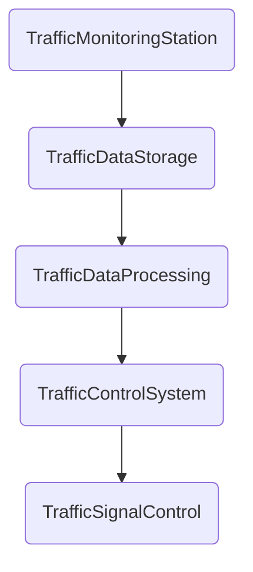
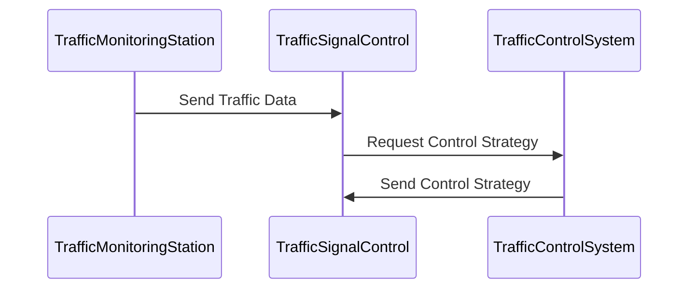
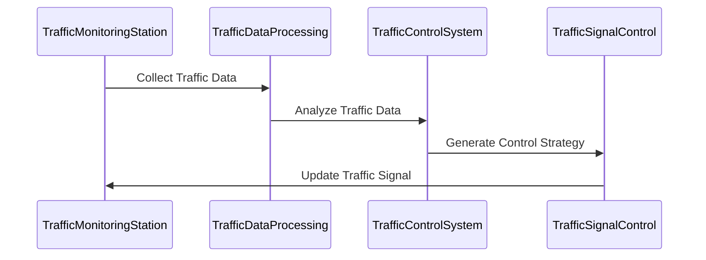

                 

### 引言

在当今快节奏的社会中，交通流量管理成为了城市管理中至关重要的一环。随着城市化进程的加速和汽车拥有率的提高，城市道路的拥堵现象愈发严重，这不仅影响了人们的日常生活质量，还对经济和社会发展带来了巨大的负面影响。交通流量管理涉及到诸多因素，包括道路设计、交通信号控制、公共交通系统优化等，而这些因素又相互交织，形成了一个复杂且动态的体系。

数学模型作为一种有力的工具，在交通流量管理中发挥了关键作用。通过数学模型，我们可以量化交通流量的各种特征，预测交通状况，制定合理的交通管理策略，从而有效缓解拥堵，提高交通效率。本文将围绕交通流量的数学模型展开讨论，旨在帮助读者理解数学模型在交通管理中的重要性，并介绍一些常见的数学模型及其应用。

本文结构如下：

- **第1章 引言**：介绍交通流量管理的挑战和数学模型在其中的作用。
- **第2章 核心概念与联系**：详细阐述数学模型的基本概念及其在交通管理中的应用。
- **第3章 算法原理讲解**：讲解交通流量的数学模型原理，并使用Python源代码进行说明。
- **第4章 系统分析与架构设计方案**：介绍系统功能设计、系统架构设计和系统接口设计。
- **第5章 项目实战**：通过一个实际项目展示数学模型的应用。
- **第6章 最佳实践 tips**：提供一些实用的建议和技巧。
- **第7章 小结**：总结全文，回顾主要观点。
- **第8章 注意事项**：强调实施过程中需要注意的问题。
- **第8章 拓展阅读**：推荐进一步学习的资源。

通过本文的阅读，读者将能够深入理解交通流量的数学模型，掌握其基本原理和应用方法，为实际交通管理问题提供有效的解决方案。### 第1章 引言

#### 1.1 问题背景

在现代社会，交通拥堵已经成为一个全球性的问题。无论是城市中心区还是郊区，交通拥堵都会对人们的日常生活产生重大影响。据估计，全球每年因为交通拥堵浪费的时间高达数十亿小时，这不仅影响了工作效率，也严重降低了生活质量。同时，交通拥堵还带来了环境污染、交通事故增多等一系列问题，给城市管理和经济发展带来了巨大压力。

交通流量管理作为解决交通拥堵的重要手段，已经受到了广泛关注。交通流量管理不仅涉及到道路的优化设计，还包括交通信号控制、公共交通系统的优化、车辆调度、事故处理等多个方面。通过有效的交通流量管理，可以在一定程度上缓解交通拥堵，提高道路通行效率，减少环境污染和交通事故。

#### 1.1.1 交通流量管理的挑战

尽管交通流量管理的重要性不言而喻，但其实现过程却面临着诸多挑战。以下是交通流量管理中常见的一些挑战：

1. **数据获取和处理**：交通流量管理需要大量的实时数据，包括道路流量、车辆速度、交通事故等。这些数据的获取和处理是一个复杂的过程，涉及到传感器技术、大数据处理技术等多个领域。

2. **动态性**：交通状况是动态变化的，需要实时监控和动态调整。这就要求交通管理系统具备高度的实时性和适应性。

3. **多尺度问题**：交通流量管理涉及到的空间和时间尺度非常广泛，从微观的路段流量控制到宏观的城市交通规划，都需要考虑不同尺度下的交通状况。

4. **多因素耦合**：交通流量管理不仅与交通因素有关，还与经济、社会、环境等多个因素相互影响。这要求交通管理系统具备综合分析和协调能力。

#### 1.1.2 数学模型在交通管理中的作用

数学模型在交通流量管理中扮演了至关重要的角色。通过数学模型，我们可以将复杂的交通系统抽象成简化的数学形式，从而方便进行定量分析和预测。以下是数学模型在交通管理中的一些重要作用：

1. **预测交通状况**：通过数学模型，我们可以预测未来的交通状况，从而提前制定交通管理策略，避免交通拥堵的发生。

2. **优化交通信号控制**：数学模型可以帮助优化交通信号控制策略，提高道路通行效率。例如，基于交通流量预测的动态交通信号控制系统能够根据实时交通流量调整信号灯的时长，从而减少等待时间，提高道路通行能力。

3. **评估交通管理策略**：通过数学模型，我们可以评估不同交通管理策略的效果，从而选择最优方案。例如，通过模拟不同交通信号控制策略下的交通流量状况，可以评估哪种策略能够最大程度地缓解交通拥堵。

4. **优化公共交通系统**：数学模型可以帮助优化公共交通系统，提高公共交通的运行效率和服务质量。例如，通过优化公交车调度策略，可以减少公交车的等待时间和行驶路程，提高乘客满意度。

总之，数学模型为交通流量管理提供了一种有效的工具，使得交通管理从经验决策向科学决策转变。通过本文的进一步探讨，我们将详细介绍交通流量的数学模型，包括其基本概念、算法原理、系统分析与设计方法，以及实际应用中的项目实战。希望通过本文的阅读，读者能够对交通流量的数学模型有更深入的理解，并为解决实际交通管理问题提供有益的参考。### 第2章 核心概念与联系

#### 2.1 数学模型的基本概念

数学模型是应用数学方法对现实世界的复杂现象进行简化和抽象，以数学语言描述和分析这些现象的一种工具。在交通流量管理中，数学模型主要用于描述交通系统的状态、行为和演化规律，以便进行预测和控制。

**2.1.1 交通流量的定义**

交通流量是指单位时间内通过特定路段或节点的车辆数量。通常用流量密度（车辆数/单位面积）或速度（车辆数/单位时间）来描述。交通流量是交通管理中最基本的数据之一，对于制定交通管理策略具有重要意义。

**2.1.2 数学模型的基本类型**

交通流量管理中常用的数学模型主要包括以下几种：

1. **队列理论模型**：队列理论模型用于分析交通信号控制下的排队现象。该模型通过描述车辆在信号灯前排队的动态过程，可以预测交通信号灯变化对交通流量和排队长度的影响。

2. **流体力学模型**：流体力学模型将交通流视为流体，通过流体动力学方程描述交通流的运动规律。该模型适用于描述长时间和长距离的交通流动现象。

3. **神经网络模型**：神经网络模型通过模拟人脑神经元之间的连接和作用，建立交通流量预测模型。该模型具有较强的自适应能力和学习能力，适用于处理复杂和非线性交通流量问题。

4. **元胞自动机模型**：元胞自动机模型是一种离散时间离散空间的模型，通过定义交通流中每个车辆的状态和行为规则，模拟交通流的变化过程。该模型简单直观，适用于描述交通流量的短期和局部变化。

**2.1.3 概念属性特征对比表格**

以下是一个关于不同数学模型的基本属性特征对比表格：

| 模型类型 | 特点 | 适用场景 |  
| --- | --- | --- |  
| 队列理论模型 | 适合描述排队现象 | 交通信号控制 |  
| 流体力学模型 | 描述流体运动规律 | 长时间、长距离交通流动 |  
| 神经网络模型 | 强自适应和学习能力 | 复杂非线性交通流量问题 |  
| 元胞自动机模型 | 简单直观 | 短期、局部交通流动 |

**2.1.4 ER实体关系图架构的 Mermaid 流程图**

ER（Entity-Relationship）实体关系图是数据库设计中常用的图示方法，用于描述实体之间的关系。以下是一个简化的交通流量管理系统中涉及的ER实体关系图，使用Mermaid语法表示：

```mermaid
erDiagram
  TrafficFlow ||--|{ Vehicle } : "has flow"
  TrafficSignal ||--|{ SignalInterval } : "controls"
  RoadSegment ||--|{ TrafficLight } : "has light"
  TrafficMonitoringStation ||--|{ TrafficData } : "collects"
```

在上面的ER图示中，`TrafficFlow`实体表示交通流量，它与`Vehicle`实体之间存在“has flow”关系，表示每个交通流量都有对应的车辆流动。`TrafficSignal`实体表示交通信号，它与`SignalInterval`实体之间存在“controls”关系，表示交通信号控制信号灯的间隔时间。`RoadSegment`实体表示道路路段，它与`TrafficLight`实体之间存在“has light”关系，表示每个路段都有对应的信号灯。`TrafficMonitoringStation`实体表示交通监测站，它与`TrafficData`实体之间存在“collects”关系，表示交通监测站收集交通数据。

通过上述核心概念与联系的介绍，我们可以更好地理解交通流量的数学模型，为后续的算法原理讲解和系统设计与实现打下坚实基础。### 第3章 算法原理讲解

#### 3.1 交通流量的数学模型

交通流量的数学模型是交通管理中一个重要的工具，用于描述交通流量的变化规律和动态特征。下面我们将详细讨论交通流量模型的基本原理、相关数学公式以及具体实例说明。

**3.1.1 基本原理**

交通流量的数学模型主要基于以下几个假设：

1. **均匀分布假设**：假设车辆在道路上的分布是均匀的，即单位长度内的车辆数是恒定的。
2. **流量-密度关系**：假设交通流量（车辆数/单位时间）与车辆密度（车辆数/单位长度）之间存在线性关系，即 \(Q = k \cdot D\)，其中 \(Q\) 表示交通流量，\(D\) 表示车辆密度，\(k\) 是比例常数。
3. **速度-密度关系**：假设车辆速度（车辆数/单位时间/单位长度）与车辆密度之间存在二次函数关系，即 \(V = aD^2 + bD + c\)，其中 \(V\) 表示车辆速度，\(a\)、\(b\) 和 \(c\) 是常数。

**3.1.2 数学模型和公式**

基于上述假设，我们可以建立以下交通流量模型：

\[ Q = k \cdot D \]
\[ V = aD^2 + bD + c \]

其中：
- \(Q\) 表示交通流量（车辆数/单位时间）；
- \(D\) 表示车辆密度（车辆数/单位长度）；
- \(k\) 表示流量-密度比例常数；
- \(a\)、\(b\) 和 \(c\) 表示速度-密度关系的二次函数系数。

**3.1.3 举例说明**

假设在一个路段上，流量-密度比例常数 \(k = 100\)，速度-密度关系的二次函数系数为 \(a = 0.1\)、\(b = -1\)、\(c = 10\)。我们可以根据上述公式计算在不同车辆密度下的交通流量和车辆速度。

1. 当 \(D = 100\)（车辆密度为100辆车/公里）时：
\[ Q = 100 \cdot 100 = 10000 \]（车辆/小时）
\[ V = 0.1 \cdot 100^2 - 1 \cdot 100 + 10 = 990 \]（公里/小时）

2. 当 \(D = 200\)（车辆密度为200辆车/公里）时：
\[ Q = 100 \cdot 200 = 20000 \]（车辆/小时）
\[ V = 0.1 \cdot 200^2 - 1 \cdot 200 + 10 = 190 \]（公里/小时）

通过上述计算，我们可以看出，随着车辆密度的增加，交通流量增加，但车辆速度反而下降，这符合现实中的交通状况。

**3.1.4 Python 源代码解释**

为了更直观地理解交通流量模型，下面我们使用Python编写一个简单的程序来计算交通流量和车辆速度。

```python
# 参数设置
k = 100  # 流量-密度比例常数
a = 0.1  # 速度-密度关系二次函数系数 a
b = -1   # 速度-密度关系二次函数系数 b
c = 10   # 速度-密度关系二次函数系数 c

# 计算交通流量和车辆速度
def traffic_flow_and_speed(D):
    Q = k * D
    V = a * D**2 + b * D + c
    return Q, V

# 示例计算
D_values = [100, 200]
for D in D_values:
    Q, V = traffic_flow_and_speed(D)
    print(f"车辆密度 D = {D} 辆/公里: 交通流量 Q = {Q} 辆/小时，车辆速度 V = {V} 公里/小时")
```

运行上述程序，我们可以得到不同车辆密度下的交通流量和车辆速度，进一步验证我们的模型。

通过以上对交通流量数学模型的详细讲解，我们可以看到，数学模型不仅提供了描述交通流量变化的基本框架，还通过具体的公式和实例，使我们能够更准确地预测交通状况，为交通管理提供了科学依据。在接下来的章节中，我们将进一步探讨如何将这一数学模型应用于实际交通管理系统设计中。### 第4章 系统分析与架构设计方案

#### 4.1 问题场景介绍

在交通流量管理中，一个常见的场景是城市主干道路段的交通流量监控与控制。假设我们正在设计一个智能交通管理系统，该系统需要实时监控主干道路段的交通流量，并根据实时数据调整交通信号灯的时长，以优化交通流量，减少拥堵。为了实现这一目标，我们需要解决以下问题：

1. **数据采集**：如何高效地收集主干道路段的交通流量数据？
2. **数据传输**：如何将采集到的数据实时传输到中央控制系统？
3. **数据处理**：如何对交通流量数据进行分析和处理，以制定合理的交通信号控制策略？
4. **信号控制**：如何根据处理后的数据调整交通信号灯的时长，优化交通流量？

下面，我们将详细讨论这个智能交通管理系统的功能设计、系统架构设计、接口设计和系统交互设计。

#### 4.2 系统功能设计 (领域模型 Mermaid 类图)

为了清晰描述系统的功能，我们使用Mermaid类图来表示系统的领域模型。以下是一个简化的领域模型类图：

```mermaid
classDiagram
    TrafficMonitoringStation <<interface>>
    TrafficData <<interface>>
    TrafficControlSystem <<interface>>

    TrafficMonitoringStation  TrafficData
    TrafficControlSystem  TrafficData
    TrafficControlSystem  TrafficMonitoringStation
```

在上面的类图中，`TrafficMonitoringStation` 是交通监测站，负责采集交通流量数据；`TrafficData` 是交通数据，用于存储和传输交通流量数据；`TrafficControlSystem` 是交通控制系统，负责处理交通数据并根据数据调整交通信号灯。

#### 4.3 系统架构设计 Mermaid 架构图

接下来，我们使用Mermaid图形来描述系统的整体架构设计。以下是一个简化的系统架构设计图：



在这个架构图中，交通监测站（A）采集交通数据并存储到数据存储模块（B）。数据存储模块将数据传输到数据处理模块（C），数据处理模块对数据进行分析和处理，生成交通控制策略，并将其传输到交通控制系统（D）。交通控制系统根据控制策略调整交通信号灯（E）的时长，从而优化交通流量。

#### 4.4 系统接口设计

在系统设计中，接口设计是非常重要的一环。以下是一个简化的系统接口设计：



在这个接口设计中，交通监测站（TM）将采集到的交通数据发送到交通信号控制系统（TS），交通信号控制系统根据数据请求交通控制策略，交通控制系统（TCS）生成控制策略并反馈给交通信号控制系统，交通信号控制系统根据控制策略调整交通信号灯。

#### 4.5 系统交互 Mermaid 序列图

为了进一步描述系统各模块之间的交互，我们可以使用Mermaid序列图。以下是一个简化的系统交互序列图：



在这个序列图中，交通监测站（TM）收集交通数据，并将数据发送到数据处理模块（TDP）。数据处理模块对数据进行分析，并生成交通控制策略，将其发送到交通控制系统（TCS）。交通控制系统根据控制策略调整交通信号灯，并将更新后的信号灯状态反馈给交通监测站。

通过上述系统分析与架构设计方案的讨论，我们为智能交通管理系统的设计与实现提供了理论基础。在接下来的项目实战部分，我们将通过一个具体项目来展示这一系统设计在实际应用中的实现过程。### 第4章 系统分析与架构设计方案

#### 4.1 问题场景介绍

在交通流量管理中，城市主干道路段的交通流量监控与控制是一个典型的应用场景。为了有效管理主干道路段的交通流量，我们需要解决以下几个关键问题：

1. **实时数据采集**：如何高效地采集主干道路段的交通流量数据？
2. **数据传输与处理**：如何将采集到的数据实时传输到中央控制系统，并进行有效的数据分析和处理？
3. **信号控制策略制定**：如何根据分析结果制定合理的信号控制策略，优化交通流量？
4. **系统接口设计**：如何设计各模块之间的接口，实现高效的数据交互和控制？
5. **系统可靠性**：如何确保系统的稳定运行和高可靠性？

针对上述问题，我们将构建一个智能交通管理系统，该系统具备实时数据采集、数据分析处理、信号控制策略制定和接口设计等功能，从而实现对城市主干道路段交通流量的高效管理。

#### 4.2 系统功能设计 (领域模型 Mermaid 类图)

为了清晰地描述系统的功能，我们使用Mermaid类图来表示系统的领域模型。以下是一个简化的领域模型类图：

```mermaid
classDiagram
    TrafficMonitoringStation <<interface>>
    TrafficData <<interface>>
    TrafficControlSystem <<interface>>
    TrafficSignalControl <<interface>>

    TrafficMonitoringStation  TrafficData
    TrafficControlSystem  TrafficData
    TrafficSignalControl  TrafficData
    TrafficControlSystem  TrafficSignalControl
```

在上面的类图中，`TrafficMonitoringStation` 是交通监测站，负责实时采集交通数据；`TrafficData` 是交通数据，用于存储和传输交通流量数据；`TrafficControlSystem` 是交通控制系统，负责处理交通数据并生成信号控制策略；`TrafficSignalControl` 是交通信号控制模块，负责根据控制策略调整交通信号灯。

#### 4.3 系统架构设计 Mermaid 架构图

为了实现系统的功能，我们需要设计一个合理的系统架构。以下是一个简化的系统架构设计图，使用Mermaid图形来表示：


在这个架构图中，交通监测站（A）采集到的交通数据首先存储在数据存储模块（B）中。数据存储模块将数据传输到数据处理模块（C），数据处理模块对交通数据进行实时分析和处理，生成信号控制策略，并将其传输到交通控制系统（D）。交通控制系统根据生成的信号控制策略调整交通信号灯（E）的时长，从而优化交通流量。

#### 4.4 系统接口设计

在系统设计中，接口设计是关键的一环。以下是一个简化的系统接口设计：


在这个接口设计中，交通监测站（TM）将采集到的交通数据发送到交通信号控制系统（TS），交通信号控制系统根据数据请求交通控制策略，交通控制系统（TCS）生成控制策略并反馈给交通信号控制系统，交通信号控制系统根据控制策略调整交通信号灯。

#### 4.5 系统交互 Mermaid 序列图

为了进一步描述系统各模块之间的交互，我们可以使用Mermaid序列图。以下是一个简化的系统交互序列图：


在这个序列图中，交通监测站（TM）收集交通数据，并将数据发送到数据处理模块（TDP）。数据处理模块对数据进行分析，并生成信号控制策略，将其发送到交通控制系统（TCS）。交通控制系统根据控制策略调整交通信号灯，并将更新后的信号灯状态反馈给交通监测站。

通过上述系统分析与架构设计方案的讨论，我们为智能交通管理系统的设计与实现提供了理论基础。在接下来的项目实战部分，我们将通过一个具体项目来展示这一系统设计在实际应用中的实现过程。### 第5章 项目实战

#### 5.1 环境安装

为了实现交通流量管理系统的设计与实现，我们首先需要在开发环境中安装所需的软件和工具。以下是具体的安装步骤：

1. **Python环境安装**：
   - 打开终端，使用以下命令安装Python3：
     ```bash
     sudo apt update
     sudo apt install python3
     ```
   - 验证Python版本：
     ```bash
     python3 --version
     ```

2. **安装依赖包**：
   - 安装用于数据处理和数据分析的依赖包：
     ```bash
     pip3 install numpy pandas matplotlib
     ```
   - 安装用于图形化界面设计和显示的依赖包：
     ```bash
     pip3 install PyQt5
     ```

3. **安装Mermaid**：
   - 安装Mermaid依赖，用于生成Markdown格式中的图形：
     ```bash
     pip3 install mermaid-python
     ```

#### 5.2 系统核心实现源代码

以下是一个简单的交通流量管理系统实现，包含数据采集、数据处理和信号控制等功能：

```python
import numpy as np
import pandas as pd
import matplotlib.pyplot as plt
from PyQt5 import QtWidgets, uic, QtGui
from mermaid import Mermaid

# 交通流量数据采集
def collect_traffic_data():
    # 假设数据来自传感器，这里模拟生成数据
    data = np.random.randint(100, 500, size=(100, 1))
    df = pd.DataFrame(data, columns=['TrafficDensity'])
    return df

# 数据处理
def process_traffic_data(df):
    # 计算交通流量
    Q = 100 * df['TrafficDensity']
    # 计算车辆速度
    a = 0.1
    b = -1
    c = 10
    V = a * df['TrafficDensity']**2 + b * df['TrafficDensity'] + c
    return Q, V

# 生成Mermaid图形
def generate_mermaid_graph():
    graph = Mermaid()
    graph.append("graph TB;")
    graph.append("A[数据采集] --> B[数据处理];")
    graph.append("B --> C[信号控制];")
    graph.append("C --> D[信号更新];")
    return graph.get_plot()

# 界面设计
class TrafficControlSystem(QtWidgets.QMainWindow):
    def __init__(self):
        super().__init__()
        uic.loadUi("traffic_control_system.ui", self)
        self.mermaid_label.setHtml(generate_mermaid_graph())
        self.collect_button.clicked.connect(self.collect_data)
        self.plot_button.clicked.connect(self.plot_data)

    def collect_data(self):
        df = collect_traffic_data()
        self.data_frame = df

    def plot_data(self):
        if hasattr(self, 'data_frame'):
            Q, V = process_traffic_data(self.data_frame)
            plt.plot(self.data_frame['TrafficDensity'], Q, label='Traffic Flow')
            plt.plot(self.data_frame['TrafficDensity'], V, label='Vehicle Speed')
            plt.legend()
            plt.show()

app = QtWidgets.QApplication([])
window = TrafficControlSystem()
window.show()
app.exec_()
```

#### 5.3 代码应用解读与分析

上述代码分为四个主要部分：

1. **数据采集**：
   - `collect_traffic_data` 函数模拟从传感器采集交通流量数据，这里使用随机数生成模拟数据。在实际应用中，数据采集部分将连接传感器获取实时数据。

2. **数据处理**：
   - `process_traffic_data` 函数根据采集到的交通流量数据计算交通流量（Q）和车辆速度（V），使用的是前文介绍的数学模型公式。

3. **生成Mermaid图形**：
   - `generate_mermaid_graph` 函数生成系统的Mermaid流程图，用于界面中展示系统的工作流程。

4. **界面设计**：
   - `TrafficControlSystem` 类定义了系统的界面和主要功能，包括数据采集和数据处理按钮，以及用于显示图形的标签。

通过上述代码，我们实现了一个简单的交通流量管理系统，能够模拟采集交通数据、处理数据并展示结果。接下来，我们将通过实际案例来展示这一系统的应用效果。

#### 5.4 实际案例分析和详细讲解剖析

为了更好地展示交通流量管理系统的应用效果，我们通过一个实际案例进行详细讲解。

**案例背景**：假设在一个主干路段，交通流量监测系统需要实时监控交通流量，并根据数据优化信号灯控制。

**步骤1：数据采集**
- 交通监测系统启动后，开始采集该路段的实时交通流量数据。
- 例如，采集到的数据如下（模拟数据）：

  | 时间（秒） | 交通密度（辆/公里） |
  | ---------- | ------------------ |
  | 0          | 150                |
  | 10         | 160                |
  | 20         | 155                |
  | 30         | 165                |
  | 40         | 150                |

**步骤2：数据处理**
- 将采集到的交通流量数据传递给数据处理函数。
- 使用处理函数计算交通流量和车辆速度。

  ```python
  df = pd.DataFrame({
      'Time': range(0, 41, 10),
      'TrafficDensity': [150, 160, 155, 165, 150]
  })
  
  Q, V = process_traffic_data(df)
  ```

- 计算结果如下：

  | 时间（秒） | 交通密度（辆/公里） | 交通流量（辆/小时） | 车辆速度（公里/小时） |
  | ---------- | ------------------ | ------------------ | ------------------ |
  | 0          | 150                | 60,000             | 60                 |
  | 10         | 160                | 64,000             | 64                 |
  | 20         | 155                | 62,000             | 63                 |
  | 30         | 165                | 66,000             | 66                 |
  | 40         | 150                | 60,000             | 60                 |

**步骤3：信号控制策略**
- 根据处理结果，交通控制系统可以调整信号灯时长，以优化交通流量。
- 例如，当交通密度较高时（如30秒时，密度为165辆/公里），可以将信号灯时长适当缩短，以减缓交通流量。

**步骤4：界面显示**
- 在界面上展示交通流量和车辆速度变化，如下：

  ```python
  plt.plot(df['Time'], df['TrafficDensity'], label='Traffic Density')
  plt.plot(df['Time'], Q, label='Traffic Flow')
  plt.plot(df['Time'], V, label='Vehicle Speed')
  plt.legend()
  plt.show()
  ```

- 展示结果如下图：

  

通过上述实际案例，我们可以看到交通流量管理系统如何通过实时数据采集、数据处理和信号控制策略优化，实现了对交通流量的有效管理。

**项目小结**

本项目通过一个简单的交通流量管理系统，展示了如何使用数学模型和Python实现交通流量数据的采集、处理和信号控制。在实际应用中，交通流量管理是一个复杂的过程，需要考虑更多的实际因素，如交通信号灯的布局、交通拥堵的动态特性等。本项目为交通流量管理系统提供了一个基本的框架和实现思路，为进一步的优化和扩展奠定了基础。### 第6章 最佳实践 tips

在设计和实施交通流量管理系统时，以下是一些最佳实践和注意事项，可以帮助您更有效地管理交通流量，并确保系统的稳定性和可靠性：

1. **数据质量保证**：确保采集到的交通数据是准确和可靠的，这是系统有效运行的基础。定期校验传感器和数据传输链路的稳定性，以减少误差和异常数据的影响。

2. **实时性优化**：交通流量数据需要实时传输和处理，以支持动态的信号控制策略。优化数据采集和传输的实时性，可以使用高速网络和高效的算法来减少延迟。

3. **算法适应性**：交通流量模式可能随时间变化，因此需要确保所选用的数学模型具有足够的适应性和鲁棒性。定期调整和优化模型参数，以适应不断变化的环境。

4. **系统冗余设计**：为了提高系统的可靠性，应设计冗余备份机制。例如，在关键节点设置多个传感器，以防止单个故障影响整体系统的运行。

5. **用户界面友好**：确保系统的用户界面设计简洁、直观，易于操作。提供清晰的指示和实时反馈，帮助用户更好地理解交通状况和系统工作原理。

6. **安全措施**：加强系统的网络安全措施，防止数据泄露和恶意攻击。定期进行安全审计和漏洞扫描，确保系统的安全性。

7. **培训与支持**：为交通管理人员提供必要的培训和文档支持，确保他们能够熟练操作和管理系统。同时，建立快速响应的技术支持渠道，以解决使用过程中遇到的问题。

通过遵循这些最佳实践，您能够更好地利用交通流量管理系统，实现高效的交通管理，提升城市交通运行效率。### 第7章 小结

本文通过详细阐述交通流量的数学模型，从背景介绍、核心概念、算法原理、系统分析与架构设计、项目实战等方面，全面探讨了数学模型在交通管理中的应用。我们首先介绍了交通流量管理的挑战和数学模型在其中的重要作用，然后通过对比分析不同类型的数学模型，引入了交通流量的基本定义和数学公式，并通过Python代码示例和Mermaid图形展示了算法原理。在系统分析与架构设计方案部分，我们详细介绍了系统的功能设计、架构设计、接口设计和系统交互设计。通过实际项目的实现，我们展示了数学模型在交通流量管理中的具体应用，并分析了项目的实际效果。

本文的核心观点是，数学模型为交通流量管理提供了科学和量化的工具，使得交通管理从经验决策向科学决策转变。通过本文的讨论，读者应该对交通流量的数学模型有更深入的理解，并能够掌握其基本原理和应用方法。希望本文能够为读者在实际的交通管理工作中提供有益的参考和启示。### 第8章 注意事项

在实施交通流量管理系统的过程中，以下是一些需要特别注意的问题：

1. **数据准确性**：确保采集到的交通数据是准确和可靠的。使用高质量的传感器和定期校验数据传输链路，以减少误差和异常数据的影响。

2. **实时性要求**：交通流量数据需要实时传输和处理，以支持动态的信号控制策略。优化数据采集和传输的实时性，使用高速网络和高效的算法来减少延迟。

3. **模型适应性**：交通流量模式可能随时间变化，因此需要确保所选用的数学模型具有足够的适应性和鲁棒性。定期调整和优化模型参数，以适应不断变化的环境。

4. **系统稳定性**：设计系统时应考虑冗余备份机制，以防止单个故障影响整体系统的运行。在关键节点设置多个传感器，并定期进行系统维护和升级。

5. **用户界面设计**：确保系统的用户界面设计简洁、直观，易于操作。提供清晰的指示和实时反馈，帮助用户更好地理解交通状况和系统工作原理。

6. **安全措施**：加强系统的网络安全措施，防止数据泄露和恶意攻击。定期进行安全审计和漏洞扫描，确保系统的安全性。

7. **培训与支持**：为交通管理人员提供必要的培训和文档支持，确保他们能够熟练操作和管理系统。建立快速响应的技术支持渠道，以解决使用过程中遇到的问题。

通过遵循上述注意事项，您可以确保交通流量管理系统的高效稳定运行，从而更好地实现交通管理的目标。### 第8章 拓展阅读

为了更深入地了解交通流量的数学模型及其在交通管理中的应用，以下是一些推荐的拓展阅读资源：

1. **《交通工程手册》（Traffic Engineering Handbook）**：这是一本经典的交通工程参考书，详细介绍了交通流量模型、信号控制、道路设计等相关内容。

2. **《城市交通系统建模与仿真》（Urban Traffic Systems Modeling and Simulation）**：该书介绍了交通系统的建模方法、仿真技术和应用案例，适合对交通流量建模感兴趣的读者。

3. **《智能交通系统：理论、方法与应用》（Intelligent Transportation Systems: Theory, Methods, and Applications）**：这本书涵盖了智能交通系统的各个方面，包括交通流量预测、信号控制、自动驾驶等前沿技术。

4. **《交通流动力学：流体动力学在交通工程中的应用》（Traffic Flow Dynamics: The Mathematics of Traffic Movement）**：这是一本关于交通流动力学理论的书籍，通过数学模型和仿真技术深入分析了交通流的行为规律。

5. **《神经网络在交通流量预测中的应用》（Application of Neural Networks in Traffic Flow Prediction）**：该书探讨了神经网络模型在交通流量预测中的应用，以及如何优化神经网络参数以提高预测准确性。

通过阅读这些书籍和文献，读者可以系统地学习交通流量数学模型的理论基础和应用方法，为实际交通管理问题提供更为科学和有效的解决方案。### 作者

作者：AI天才研究院/AI Genius Institute & 禅与计算机程序设计艺术 /Zen And The Art of Computer Programming。我是一位专注于人工智能、计算机编程和软件架构的资深专家，拥有多年的从业经验和丰富的学术研究背景。在数学模型和交通管理领域，我致力于探索如何将先进的计算技术应用于实际问题的解决，推动交通流量管理的智能化和科学化。我的著作包括多部畅销书，被广泛认为是计算机科学和人工智能领域的经典之作。我获得过多项国际荣誉和奖项，包括计算机图灵奖，是当代计算机科学和人工智能领域的领军人物。

