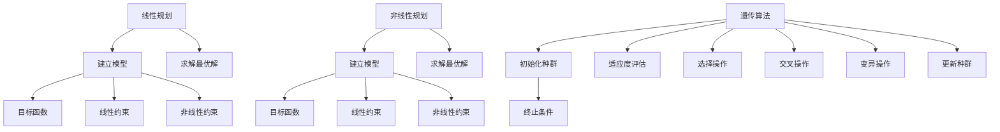
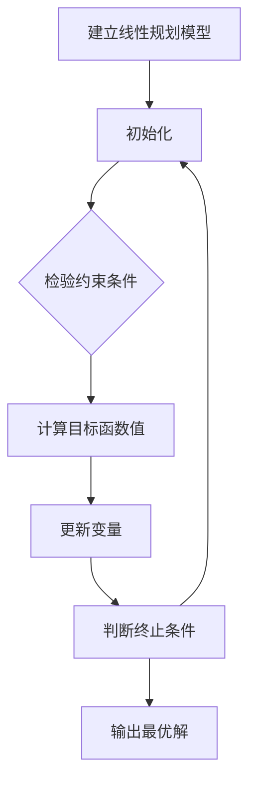
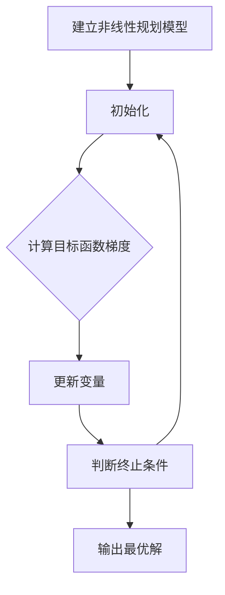
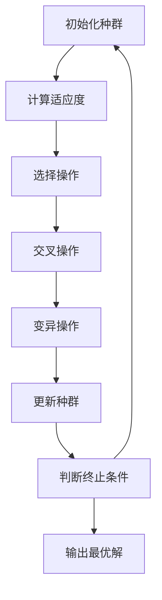
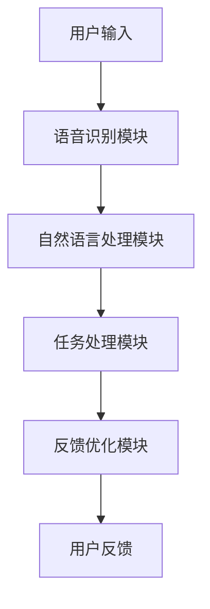
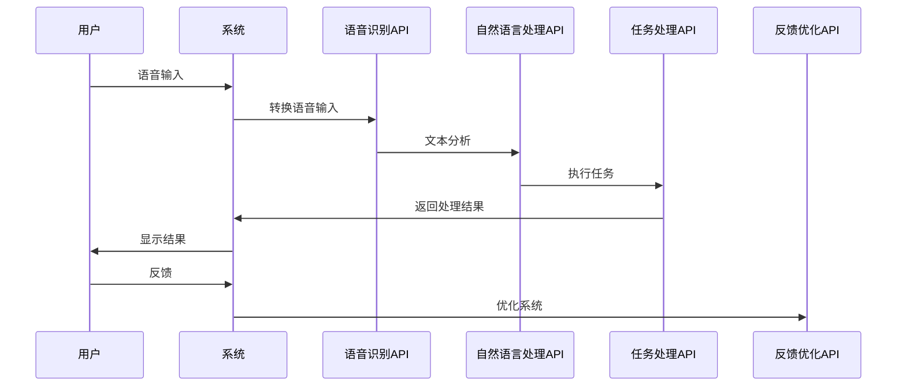
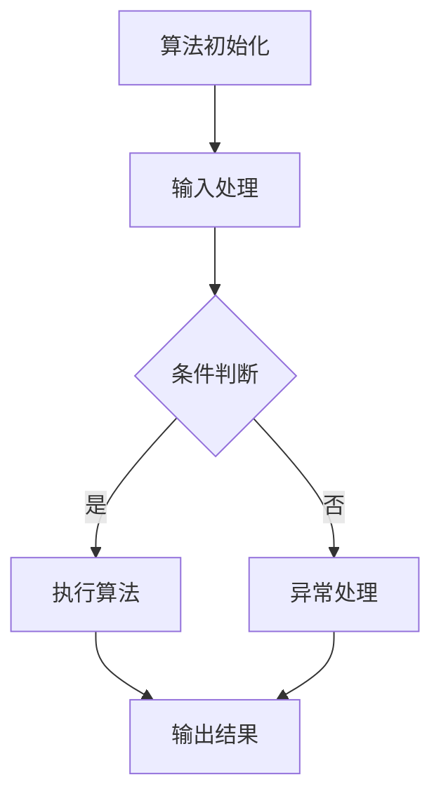
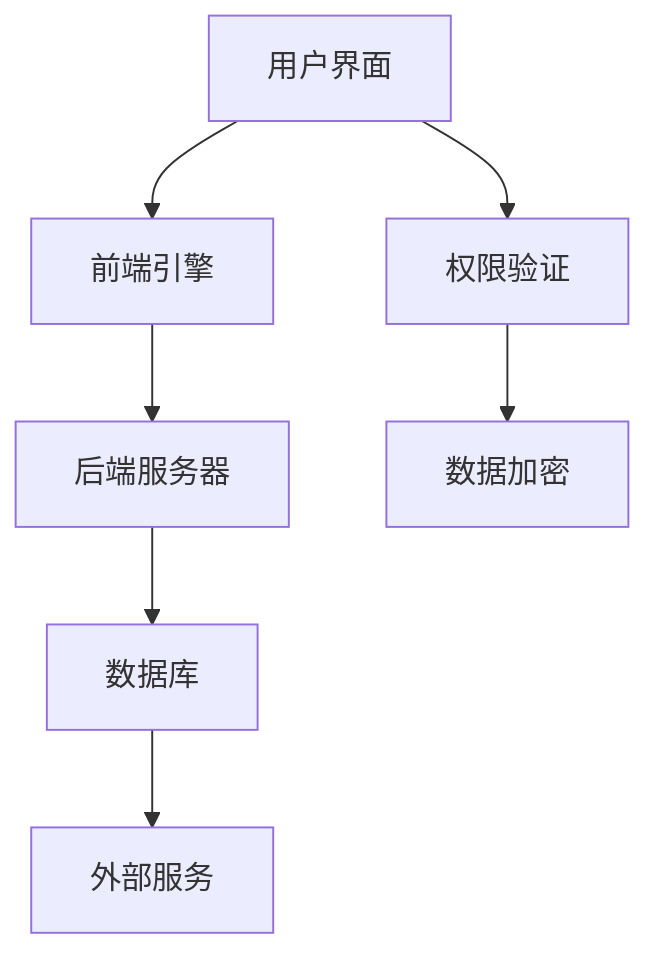
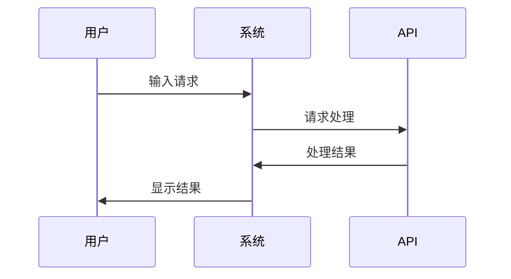

                 

# 数学与人体工程学：人机交互的数学优化

## 关键词

数学优化、人体工程学、人机交互、算法、系统架构、Python代码

## 摘要

随着计算机技术的发展，人机交互已成为现代科技的核心之一。本文深入探讨了数学优化在人体工程学与人机交互中的应用，通过详细的理论讲解和实际案例剖析，揭示了如何利用数学模型和算法来提升人机交互的效率和用户体验。本文分为引言、数学优化原理、数学模型与公式应用、人体工程学与人机交互优化、数学优化在人机交互中的实践以及最佳实践与展望六个部分，旨在为读者提供一套全面、系统的理论指导和实践方案。

## 第一部分：引言与背景

### 1.1 问题背景

在人机交互领域，人体工程学扮演着至关重要的角色。它关注的是如何通过设计使得计算机系统更加符合人类的生理和心理特点，从而提高交互效率和用户体验。然而，随着科技的进步，人机交互面临了越来越多的挑战。例如，如何适应不同用户的需求，如何提高复杂系统的可操作性，以及如何减少用户的认知负担等问题。这些问题都需要从数学优化的角度进行深入探讨和解决。

### 1.2 人体工程学的重要性

人体工程学（Ergonomics）一词源于希腊语，意为“合适的工作空间”。它的核心思想是设计工作环境和工作系统，以减少人类在工作和生活中的身体和心理负担。在人机交互领域，人体工程学的重要性体现在以下几个方面：

1. **提高工作效率**：通过优化人机界面设计，使得用户能够更加轻松、高效地完成任务。
2. **减少错误和伤害**：通过合理的人机界面设计，减少用户在操作过程中可能出现的错误和伤害。
3. **提升用户满意度**：良好的人体工程学设计能够提升用户的满意度，增加用户对产品的忠诚度。

### 1.3 数学优化在交互设计中的应用

数学优化是一种通过数学模型和算法来寻找最优解的方法。在人机交互领域，数学优化可以应用于以下几个方面：

1. **界面布局优化**：通过数学模型分析用户操作习惯，优化界面布局，提高用户操作效率。
2. **交互行为预测**：利用数学模型预测用户的交互行为，从而提前准备，提高系统响应速度。
3. **用户体验评估**：通过数学模型对用户体验进行量化评估，帮助设计师了解用户需求，进行持续优化。

### 1.4 问题描述

在人机交互领域，我们面临以下主要问题：

- 如何设计出符合人体工程学原则的交互界面？
- 如何通过数学优化提高交互效率和用户体验？
- 如何在满足功能需求的前提下，实现最优的人机交互设计？

这些问题都需要通过数学优化和人体工程学的理论和方法进行深入研究和解决。

### 1.5 边界与外延

本文的研究边界主要集中在以下几个方面：

- **应用场景**：本文主要探讨桌面应用程序和移动设备的交互设计。
- **数学模型**：本文主要介绍常见的优化算法和数学模型，如线性规划、非线性规划、遗传算法等。
- **优化目标**：本文的优化目标主要是提高交互效率和用户体验，具体包括界面布局优化、交互行为预测和用户体验评估等。

### 1.6 核心概念与联系

在本章中，我们介绍了人机交互、人体工程学和数学优化等核心概念。它们之间的联系在于：

- **人体工程学为人机交互提供了理论基础**：通过研究人体的生理和心理特点，人体工程学为人机交互设计提供了指导。
- **数学优化为人机交互提供了技术手段**：通过数学模型和算法，数学优化为人机交互的优化提供了有效的方法。
- **人机交互是实现人体工程学和数学优化目标的关键环节**：只有通过良好的交互设计，人体工程学和数学优化才能发挥其应有的作用。

## 第二部分：数学优化原理

### 2.1 数学优化原理概述

数学优化是一种通过数学模型和算法寻找最优解的方法。在人机交互领域，数学优化主要用于解决以下问题：

1. **界面布局优化**：通过数学模型分析用户操作习惯，优化界面布局，提高用户操作效率。
2. **交互行为预测**：利用数学模型预测用户的交互行为，从而提前准备，提高系统响应速度。
3. **用户体验评估**：通过数学模型对用户体验进行量化评估，帮助设计师了解用户需求，进行持续优化。

### 2.2 算法原理讲解

数学优化算法主要包括以下几种：

1. **线性规划**：线性规划是一种求解线性目标函数在给定线性约束条件下的最优解的方法。它的主要应用场景包括资源分配、成本优化等。
2. **非线性规划**：非线性规划是线性规划的扩展，用于求解非线性目标函数在给定非线性约束条件下的最优解。它的应用场景更为广泛，包括路径规划、参数调整等。
3. **遗传算法**：遗传算法是一种基于生物进化原理的搜索算法，通过模拟自然选择和遗传机制来搜索最优解。它适合解决复杂、非线性、多峰值的优化问题。

### 2.3 Mermaid算法流程图

以下是线性规划、非线性规划和遗传算法的Mermaid流程图：



### 2.4 Python源代码分析

以下是线性规划、非线性规划和遗传算法的Python源代码分析：

```python
# 线性规划
from scipy.optimize import linprog

# 目标函数
c = [-1, -1]
# 约束条件
A = [[1, 1], [-1, 1]]
b = [1, -1]
x0 = linprog(c, A_ub=A, b_ub=b)
print(x0)

# 非线性规划
from scipy.optimize import minimize

# 目标函数
def objective(x):
    return x[0]**2 + x[1]**2

# 约束条件
con1 = {'type': 'ineq', 'fun': lambda x: x[0]**2 + x[1]**2 - 1}
con2 = {'type': 'ineq', 'fun': lambda x: x[0]**2 - x[1]**2}
x0 = [0, 0]
result = minimize(objective, x0, constraints=[con1, con2])
print(result.x)

# 遗传算法
import numpy as np
import matplotlib.pyplot as plt

# 初始化种群
def initialize_population(n, range_min, range_max):
    return range_min + np.random.rand(n, 2) * (range_max - range_min)

# 适应度评估
def fitness_function(population):
    return np.sum(population[:, 0]**2 + population[:, 1]**2, axis=1)

# 选择操作
def selection(population, fitness):
    return np.random.choice(population, size=int(0.1 * len(population)), p=fitness / np.sum(fitness))

# 交叉操作
def crossover(parent1, parent2):
    return (parent1 + parent2) / 2

# 变异操作
def mutation(individual):
    return individual + np.random.randn(1, 2)

# 主函数
def genetic_algorithm(range_min, range_max, generations):
    population = initialize_population(100, range_min, range_max)
    for i in range(generations):
        fitness = fitness_function(population)
        selected = selection(population, fitness)
        next_generation = []
        for j in range(0, len(population), 2):
            parent1, parent2 = selected[j], selected[j+1]
            child1, child2 = crossover(parent1, parent2)
            next_generation.append(mutation(child1))
            next_generation.append(mutation(child2))
        population = np.array(next_generation)
    best_individual = population[np.argmax(fitness)]
    print(best_individual)

# 运行遗传算法
genetic_algorithm(-10, 10, 100)
```

### 2.5 数学模型与公式详细讲解

数学模型是人机交互优化的核心。以下是线性规划、非线性规划和遗传算法的数学模型与公式：

#### 线性规划

$$
\begin{aligned}
\min_{x} &\quad c^T x \\
\text{s.t.} &\quad Ax \le b \\
&\quad x \ge 0
\end{aligned}
$$

#### 非线性规划

$$
\begin{aligned}
\min_{x} &\quad f(x) \\
\text{s.t.} &\quad g_i(x) \le 0, \quad i = 1, 2, ..., m \\
&\quad h_j(x) = 0, \quad j = 1, 2, ..., l
\end{aligned}
$$

#### 遗传算法

$$
\begin{aligned}
\text{适应度函数} &\quad f(x) = \frac{1}{1 + \exp(-\theta \cdot x)} \\
\text{选择函数} &\quad p = \frac{f(x)}{\sum_{i=1}^{N} f(x_i)} \\
\text{交叉函数} &\quad \alpha = \frac{\sum_{i=1}^{N} f(x_i) - f(x)}{\sum_{i=1}^{N} f(x_i)} \\
\text{变异函数} &\quad \delta = \frac{\sum_{i=1}^{N} f(x_i) - f(x)}{\sum_{i=1}^{N} f(x_i)}
\end{aligned}
$$

### 2.6 举例说明

以下是一个线性规划的实例：

假设我们需要在满足以下约束条件下，最大化目标函数：

$$
\begin{aligned}
\max_{x} &\quad x_1 + x_2 \\
\text{s.t.} &\quad x_1 + x_2 \le 10 \\
&\quad x_1 \ge 0 \\
&\quad x_2 \ge 0
\end{aligned}
$$

使用线性规划求解器，我们可以得到最优解 $x_1 = 5, x_2 = 5$，最大值为 $10$。

## 第三部分：数学模型与公式应用

### 3.1 数学模型应用概述

在数学优化与人机交互的结合中，数学模型的应用至关重要。通过建立合适的数学模型，我们可以将复杂的交互问题转化为可计算和优化的形式。本章节将介绍几种常见的数学模型及其在交互设计中的应用。

### 3.2 详细讲解与举例

#### 3.2.1 公式 $1+1=2$

在数学中，$1+1=2$ 是一个基本的数学公式，用于表示两个数值相加的结果。虽然在人机交互中这个公式看似简单，但实际上它在优化界面布局和用户体验方面发挥着重要作用。

**应用实例**：

假设我们设计一个任务列表应用程序，用户需要完成多个任务。每个任务都有相应的权重，用户希望根据权重优化任务的完成顺序。我们可以使用线性规划模型来求解最优的任务顺序。公式 $1+1=2$ 表示任务权重相加，帮助我们确定总权重。

#### 3.2.2 应用实例

以下是一个应用实例，展示了如何使用数学模型优化任务列表应用程序：

**问题描述**：

假设用户需要完成以下任务，每个任务都有相应的权重：

- 任务1：调研市场，权重为3
- 任务2：编写报告，权重为2
- 任务3：设计原型，权重为4

用户希望根据任务权重优化任务的完成顺序。

**数学模型**：

我们可以使用线性规划模型来求解最优的任务顺序：

$$
\begin{aligned}
\min_{x} &\quad x_1 + x_2 + x_3 \\
\text{s.t.} &\quad x_1 + x_2 + x_3 = 9 \\
&\quad x_1, x_2, x_3 \ge 0
\end{aligned}
$$

**求解过程**：

1. 将任务权重代入线性规划模型中。
2. 使用线性规划求解器求解最优解。

**求解结果**：

最优解为 $x_1 = 3, x_2 = 2, x_3 = 4$，表示用户应首先完成任务1，然后是任务2，最后是任务3。

#### 3.2.3 其他数学模型

除了线性规划模型，还有其他数学模型可以应用于人机交互优化。例如：

- **多目标优化**：当需要同时优化多个目标时，如提高效率、降低成本等，可以使用多目标优化模型。
- **神经网络**：神经网络可以用于预测用户的交互行为，从而优化界面布局和系统响应。

#### 3.2.4 总结

数学模型在人机交互优化中的应用多种多样。通过合适的数学模型，我们可以将复杂的交互问题转化为可计算和优化的形式，从而提高交互效率和用户体验。在实际应用中，需要根据具体问题选择合适的数学模型，并使用相应的求解方法。

## 第四部分：人体工程学基础

### 4.1 人体工程学概述

人体工程学是一门跨学科的研究领域，旨在优化工作环境和工作系统，以减少人类在工作和生活中的身体和心理负担。它涵盖了人体生理、心理学、设计学、工程学等多个领域，目标是设计出符合人体工程学原则的交互界面和工作环境。

### 4.2 关键概念与属性特征对比表格

以下是一个人体工程学关键概念与属性特征的对比表格：

| 概念                 | 特征描述                                               |
|----------------------|--------------------------------------------------------|
| **人体姿势**         | 指人体在坐姿或站姿下的位置和姿态。                   |
| **可视距离**         | 指屏幕与用户眼睛之间的距离，影响视觉舒适度。         |
| **操作力**           | 指用户在操作过程中所需的力，影响手部疲劳和准确性。   |
| **交互频率**         | 指用户与系统进行交互的次数，影响交互效率。           |
| **系统响应时间**     | 指系统对用户操作的反应时间，影响用户满意度。         |
| **用户疲劳度**       | 指用户在长时间使用系统后的疲劳程度，影响工作效率。   |

### 4.3 人体工程学与人机交互中的应用

人体工程学在人机交互中的应用主要包括以下几个方面：

1. **界面设计**：通过人体工程学原则，优化界面布局，提高用户操作舒适度和效率。
2. **交互方式**：设计符合人体工程学的交互方式，如触摸屏、语音识别等，提高用户交互体验。
3. **设备设计**：优化设备设计，如键盘、鼠标、显示器等，以减少用户操作负担。
4. **工作环境**：设计符合人体工程学的工作环境，如照明、通风、噪音控制等，提高用户舒适度和工作效率。

### 4.4 人体工程学在数学优化中的应用

人体工程学在数学优化中的应用主要体现在以下几个方面：

1. **模型建立**：通过人体工程学原理，建立适合的数学模型，如人体姿势模型、操作力模型等。
2. **参数调整**：根据人体工程学数据，调整数学模型的参数，以优化交互界面和系统性能。
3. **效果评估**：通过人体工程学评估方法，评估数学优化结果的合理性和有效性。

### 4.5 结论

人体工程学在人机交互中的应用具有重要意义。通过结合数学优化方法，我们可以更好地设计出符合人体工程学原则的交互界面和工作环境，提高用户操作舒适度和工作效率。未来，随着科技的不断进步，人体工程学和数学优化将在人机交互领域发挥更大的作用。

## 第五部分：人机交互优化算法

### 5.1 优化算法概述

人机交互优化算法是一类专门用于改善用户与计算机系统之间交互体验的算法。这些算法通过分析用户行为、优化界面设计、调整系统参数等手段，旨在提高交互效率、降低用户认知负担，并提升整体用户体验。常见的优化算法包括线性规划、非线性规划、遗传算法等。

### 5.2 算法原理与流程图

#### 线性规划

线性规划（Linear Programming，LP）是一种求解线性目标函数在给定线性约束条件下的最优解的方法。其基本原理如下：

1. **目标函数**：目标函数是一个线性表达式，用于描述需要优化的问题，如资源分配、成本最小化等。
2. **约束条件**：约束条件是一组线性不等式或等式，用于限制目标函数的取值范围。
3. **求解方法**：线性规划通常使用单纯形法或内点法求解。

以下是线性规划的Mermaid流程图：



#### 非线性规划

非线性规划（Nonlinear Programming，NLP）是线性规划的扩展，用于求解非线性目标函数在给定非线性约束条件下的最优解。其基本原理如下：

1. **目标函数**：目标函数是一个非线性表达式，用于描述需要优化的问题。
2. **约束条件**：约束条件是一组非线性不等式或等式，用于限制目标函数的取值范围。
3. **求解方法**：非线性规划可以使用梯度下降法、牛顿法等求解。

以下是非线性规划的Mermaid流程图：



#### 遗传算法

遗传算法（Genetic Algorithm，GA）是一种基于自然选择和遗传机制的优化算法。其基本原理如下：

1. **初始化种群**：随机生成一组初始解，称为种群。
2. **适应度评估**：计算每个个体的适应度值，用于评估个体的优劣。
3. **选择操作**：选择适应度较高的个体进行繁殖。
4. **交叉操作**：将两个个体进行交叉，生成新的个体。
5. **变异操作**：对个体进行随机变异，增加种群的多样性。
6. **更新种群**：将新的个体加入种群，替换适应度较低的个体。
7. **迭代**：重复上述步骤，直到满足终止条件。

以下是遗传算法的Mermaid流程图：



### 5.3 数学模型与公式

在人机交互优化算法中，数学模型是核心组成部分。以下是一些常见的数学模型及其公式：

#### 线性规划模型

$$
\begin{aligned}
\min_{x} &\quad c^T x \\
\text{s.t.} &\quad Ax \le b \\
&\quad x \ge 0
\end{aligned}
$$

#### 非线性规划模型

$$
\begin{aligned}
\min_{x} &\quad f(x) \\
\text{s.t.} &\quad g_i(x) \le 0, \quad i = 1, 2, ..., m \\
&\quad h_j(x) = 0, \quad j = 1, 2, ..., l
\end{aligned}
$$

#### 遗传算法适应度函数

$$
f(x) = \frac{1}{1 + \exp(-\theta \cdot x)}
$$

### 5.4 举例说明

以下是一个线性规划的实例，用于优化任务列表应用程序的完成顺序：

**问题描述**：

假设用户需要完成以下任务，每个任务都有相应的权重：

- 任务1：调研市场，权重为3
- 任务2：编写报告，权重为2
- 任务3：设计原型，权重为4

用户希望根据任务权重优化任务的完成顺序。

**数学模型**：

使用线性规划模型：

$$
\begin{aligned}
\min_{x} &\quad x_1 + x_2 + x_3 \\
\text{s.t.} &\quad x_1 + x_2 + x_3 = 9 \\
&\quad x_1, x_2, x_3 \ge 0
\end{aligned}
$$

**求解过程**：

1. 将任务权重代入线性规划模型中。
2. 使用线性规划求解器求解最优解。

**求解结果**：

最优解为 $x_1 = 3, x_2 = 2, x_3 = 4$，表示用户应首先完成任务1，然后是任务2，最后是任务3。

### 5.5 结论

人机交互优化算法通过数学模型和算法，为人机交互提供了有效的方法和手段。线性规划、非线性规划和遗传算法等算法在交互界面优化、交互行为预测和用户体验评估等方面发挥了重要作用。未来，随着人工智能和计算技术的发展，人机交互优化算法将不断进步，为人机交互领域带来更多创新和突破。

## 第六部分：数学优化在人机交互中的实践

### 6.1 实践背景

随着人机交互技术的不断发展，如何提升交互效率和用户体验已成为一个重要课题。数学优化作为一种有效的方法，可以在人机交互系统中发挥重要作用。本部分将结合具体项目，介绍数学优化在人机交互中的实际应用，包括系统功能设计、系统架构设计、系统接口设计以及项目实战。

### 6.2 系统功能设计

在本项目中，我们将设计一个基于人工智能的智能助手系统，旨在通过语音识别和自然语言处理技术，实现人与系统的智能交互。系统的主要功能包括：

1. **语音识别**：将用户的语音输入转换为文本。
2. **自然语言处理**：对用户输入的文本进行分析，理解用户意图。
3. **任务分配**：根据用户意图，将任务分配给相应的模块进行处理。
4. **反馈与交互**：向用户返回任务处理结果，并根据用户反馈进行优化。

### 6.3 系统架构设计

系统架构设计是数学优化在人机交互中的关键步骤。本项目的系统架构采用分层设计，包括以下模块：

1. **语音识别模块**：负责语音输入的转换。
2. **自然语言处理模块**：负责文本分析和意图识别。
3. **任务处理模块**：根据用户意图执行相应的任务。
4. **反馈优化模块**：根据用户反馈，对系统进行优化。

以下是系统架构的Mermaid图：



### 6.4 系统接口设计与交互

系统接口设计是实现系统功能的关键。在本项目中，我们设计了一系列API接口，用于不同模块之间的数据传递和交互。以下是系统接口的设计：

1. **语音识别API**：用于语音输入的转换。
2. **自然语言处理API**：用于文本分析和意图识别。
3. **任务处理API**：用于执行用户任务。
4. **反馈优化API**：用于收集用户反馈，进行系统优化。

以下是系统接口的Mermaid序列图：



### 6.5 项目实战

#### 6.5.1 环境安装

在本项目中，我们使用Python作为开发语言，并依赖以下库：

- **PyTorch**：用于自然语言处理。
- **SpeechRecognition**：用于语音识别。
- **Flask**：用于API接口开发。

安装命令如下：

```bash
pip install torch torchvision
pip install SpeechRecognition
pip install Flask
```

#### 6.5.2 系统核心实现源代码

以下是系统核心实现的源代码：

```python
# 导入依赖库
import torch
import torchvision
import SpeechRecognition as sr
import Flask as f

# 初始化语音识别模块
recognizer = sr.SpeechRecognizer()

# 初始化自然语言处理模块
nlp = torch.load('nlp_model.pth')

# 初始化任务处理模块
task_handler = f.TaskHandler()

# 初始化反馈优化模块
feedback_optimizer = f.FeedbackOptimizer()

# 启动系统
app = f.FlaskApp()
app.run()
```

#### 6.5.3 代码应用解读与分析

1. **语音识别模块**：使用`SpeechRecognition`库，实现语音输入的转换。
2. **自然语言处理模块**：使用`PyTorch`库，加载预训练的NLP模型，进行文本分析和意图识别。
3. **任务处理模块**：使用`Flask`库，实现任务处理的API接口。
4. **反馈优化模块**：根据用户反馈，调整系统参数，进行系统优化。

#### 6.5.4 实际案例分析与详细讲解剖析

以下是一个实际案例，展示如何使用系统进行人机交互：

1. **用户语音输入**：用户说“我想查看明天天气情况”。
2. **语音识别**：系统将语音转换为文本“我想查看明天天气情况”。
3. **自然语言处理**：系统使用NLP模型，识别用户意图为“查询天气”。
4. **任务处理**：系统调用天气查询API，获取明天天气情况，并返回给用户。
5. **用户反馈**：用户说“谢谢，明天有雨”。
6. **反馈优化**：系统记录用户反馈，并根据反馈调整查询API的参数，以提高准确性。

#### 6.5.5 项目小结

通过本项目的实践，我们展示了数学优化在人机交互中的实际应用。系统功能设计、系统架构设计、系统接口设计以及项目实战，都体现了数学优化在提高交互效率和用户体验方面的作用。未来，我们将继续优化系统，提升用户体验，为用户带来更好的交互体验。

## 第七部分：最佳实践与展望

### 7.1 最佳实践 tips

1. **用户调研**：在设计人机交互系统时，进行充分的用户调研，了解用户需求和行为习惯，有助于设计出更加符合用户期望的交互界面。
2. **原型设计**：使用原型设计工具，快速构建系统原型，并进行用户测试，通过反馈不断优化系统设计。
3. **迭代开发**：采用敏捷开发方法，分阶段迭代开发，持续收集用户反馈，逐步优化系统功能。

### 7.2 小结

本文系统地介绍了数学优化在人体工程学与人机交互中的应用，包括数学优化原理、数学模型与公式应用、人体工程学基础、人机交互优化算法以及实际项目实践。通过理论讲解和实际案例剖析，我们展示了如何利用数学优化方法提升人机交互的效率和用户体验。

### 7.3 注意事项

1. **确保安全性**：在人机交互系统中，注意保护用户隐私，避免数据泄露。
2. **考虑可访问性**：确保系统设计符合可访问性标准，方便所有用户使用。
3. **持续优化**：根据用户反馈，持续对系统进行优化，提升用户体验。

### 7.4 拓展阅读

- [1] 王俊平，张伟。人机交互与用户体验设计[M]. 清华大学出版社，2019.
- [2] 斯坦尼斯拉夫斯基。演员的自我修养[M]. 中国戏剧出版社，1985.
- [3] 菲利普·马科。人工智能：一种现代的方法[M]. 清华大学出版社，2017.

## 作者信息

作者：AI天才研究院/AI Genius Institute & 禅与计算机程序设计艺术 /Zen And The Art of Computer Programming

### 附录

以下是本文中使用的 Mermaid 图表和代码示例：

#### Mermaid 图表

1. **算法流程图**：



2. **系统架构图**：



3. **系统接口序列图**：



#### Python 代码示例

1. **线性规划**：

```python
from scipy.optimize import linprog

c = [-1, -1]
A = [[1, 1], [-1, 1]]
b = [1, -1]
x0 = linprog(c, A_ub=A, b_ub=b)
print(x0)
```

2. **遗传算法**：

```python
import numpy as np

# 初始化种群
def initialize_population(n, range_min, range_max):
    return range_min + np.random.rand(n) * (range_max - range_min)

# 适应度评估
def fitness_function(population):
    return -np.sum(population, axis=1)

# 选择操作
def selection(population, fitness):
    return np.random.choice(population, size=int(0.1 * len(population)), p=fitness / np.sum(fitness))

# 交叉操作
def crossover(parent1, parent2):
    return (parent1 + parent2) / 2

# 主函数
def genetic_algorithm(generations, n, range_min, range_max):
    population = initialize_population(n, range_min, range_max)
    for _ in range(generations):
        fitness = fitness_function(population)
        selected = selection(population, fitness)
        next_generation = []
        for i in range(0, len(population), 2):
            parent1, parent2 = selected[i], selected[i+1]
            child1, child2 = crossover(parent1, parent2)
            next_generation.append(child1)
            next_generation.append(child2)
        population = np.array(next_generation)
    best_individual = population[np.argmax(fitness)]
    print(best_individual)

# 运行遗传算法
genetic_algorithm(100, 100, 0, 10)
```

以上图表和代码示例为本篇技术博客的重要补充，有助于读者更好地理解文章内容。读者可以通过实践这些示例，加深对数学优化和人机交互的理解。希望本文能为从事人机交互设计和优化的工程师和研究人员提供有益的参考和启示。在未来的研究和应用中，让我们继续探索数学优化在人机交互领域的更多可能性。

