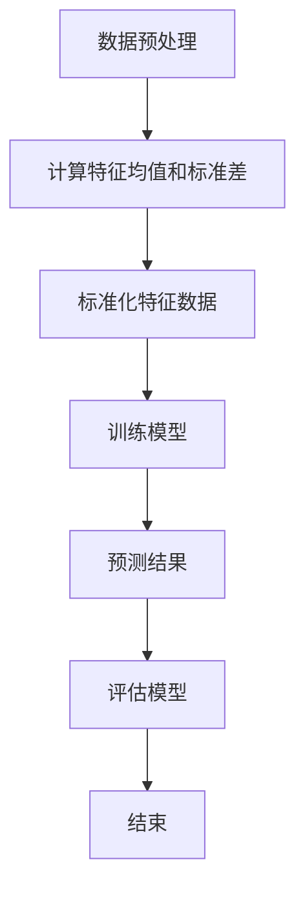
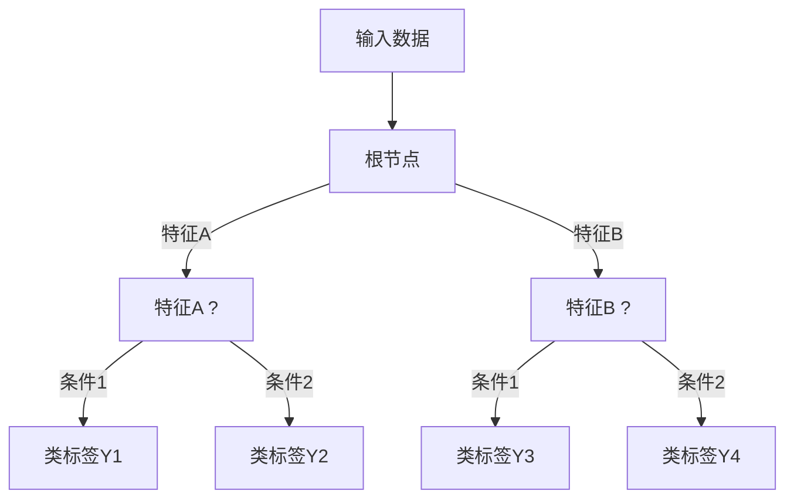
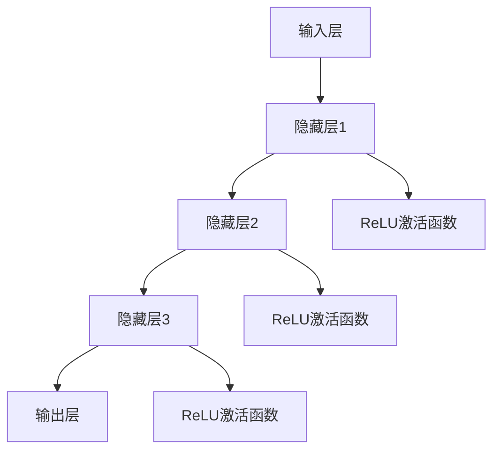
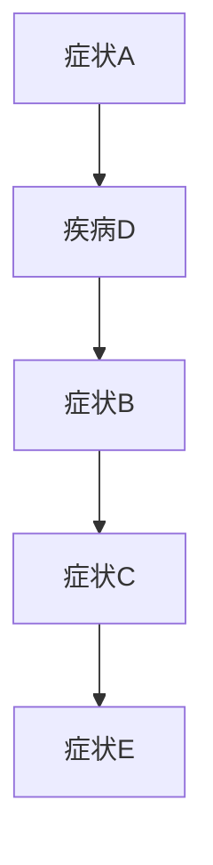
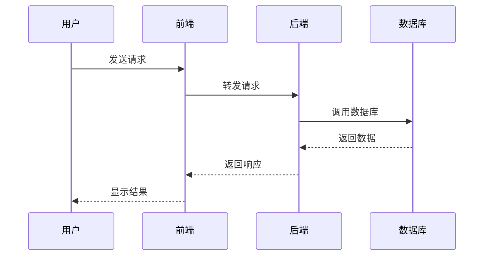

                 


### 摘要

人工智能（AI）在现代科技中扮演着越来越重要的角色，其广泛应用于医疗、金融、交通、教育等多个领域，极大地提高了效率和生产力。然而，随着AI技术的迅速发展，伦理问题也日益凸显。AI伦理涉及到算法的公平性、透明性、责任归属等方面，这些问题若得不到妥善解决，将可能对社会产生负面影响。因此，如何在AI决策过程中融入伦理考量，成为了一个亟待解决的问题。本文旨在探讨数学在AI伦理分析中的应用，通过构建数学框架，对AI决策的伦理问题进行系统分析。本文将首先介绍AI伦理的背景，然后定义并介绍书中的核心概念，接着展示数学模型和公式的应用，最后通过系统架构设计和实际项目案例，阐述如何将数学框架应用于AI决策。本文的目标是帮助读者理解数学框架在AI决策伦理分析中的重要性，并提供实用的方法和建议，以促进AI技术的健康发展。

---

# 第一部分: 引言

## 1.1 人工智能伦理的背景

### 1.1.1 人工智能伦理的重要性

人工智能（AI）的快速发展不仅带来了技术上的突破，也引发了一系列社会和伦理问题。随着AI在各个领域的广泛应用，从自动驾驶汽车到医疗诊断，从金融风险评估到个性化教育，AI技术正深刻地改变着我们的生活方式。然而，这种变革也带来了诸多伦理挑战。如何确保AI系统的公平性、透明性和可解释性，使其能够在尊重人类价值观和伦理标准的前提下运作，成为了一个备受关注的问题。

首先，AI的公平性问题尤为重要。由于算法通常基于大量历史数据训练，这些数据可能包含偏见和不公正，导致AI系统在决策过程中再现甚至放大这些不公平现象。例如，招聘系统可能因为训练数据中的性别或种族偏见，导致对某些群体的歧视。这种偏见如果不加以纠正，将对社会公正性造成严重威胁。

其次，AI的透明性问题也是公众关注的焦点。由于AI系统通常基于复杂的算法和大量数据，其决策过程往往是不透明的。这导致用户无法了解AI系统是如何做出特定决策的，从而增加了对AI系统的信任危机。为了增强AI系统的透明性，研究人员正在探索如何使AI决策过程更加可解释和可理解。

此外，AI的责任归属问题也是一个关键伦理议题。当AI系统出现错误或造成损失时，责任应如何归属？是归咎于算法的开发者、维护者，还是应该由使用AI系统的企业或个人承担责任？这些问题涉及到法律、道德和伦理等多个层面，需要通过综合考量来寻找合理的解决方案。

总之，人工智能伦理问题不仅关乎技术本身，更涉及到社会的公平、公正和可持续发展。为了应对这些挑战，必须将伦理考量融入AI系统的设计、开发和部署过程，以确保AI技术在为人类带来便利的同时，不会对社会造成负面影响。

### 1.1.2 AI伦理问题的挑战

AI伦理问题复杂而多样，涉及到多个层面的挑战。首先，算法偏见问题是一个重要挑战。AI算法的偏见可能源于训练数据中的不公正现象。例如，如果训练数据中包含性别、种族或其他社会特征的偏见，算法在处理实际问题时可能会再现这些偏见，导致不公平的结果。这种偏见不仅违背了伦理原则，也可能引发社会冲突和不稳定。

其次，算法透明性问题也是AI伦理面临的重要挑战之一。AI系统的决策过程往往依赖于复杂的算法和大量数据，这使得其决策机制变得不透明。透明性缺失导致用户难以理解AI系统为何做出特定决策，从而增加了对AI系统的信任危机。在医疗诊断、金融决策等关键领域，透明性不足可能严重影响用户的决策过程，甚至危及生命和财产安全。

责任归属问题也是AI伦理的一大挑战。在传统的法律框架下，责任通常归咎于个体或组织。然而，在AI系统中，责任归属往往更加复杂。例如，当自动驾驶汽车发生事故时，责任可能涉及多个方面，包括算法开发者、数据提供者、车辆制造商以及最终用户。确定责任归属需要考虑技术、法律、道德等多个维度，这是一个复杂的法律和伦理问题。

隐私保护问题是AI伦理的另一重要挑战。AI系统在处理数据时，可能会收集、存储和处理大量个人隐私信息。如果没有适当的隐私保护措施，这些数据可能被滥用，导致隐私泄露和个人权利受损。隐私保护不仅关乎法律合规，更关乎用户对AI技术的信任。

最后，AI伦理问题还涉及到人类价值观的冲突。AI系统的设计和应用不可避免地会涉及到人类价值观的选择和权衡。例如，在自动驾驶系统中，如何处理紧急情况下的道德困境，如“电车难题”，需要平衡多个价值观，如生命权、公正等。这种价值观的冲突需要通过广泛的社会讨论和伦理研究来寻求解决方案。

综上所述，AI伦理问题涉及到多个层面的挑战，需要从多个角度进行综合考量。通过构建数学框架，我们可以系统地对AI伦理问题进行分析和解决，为AI技术的健康发展提供理论支持和技术手段。

### 1.1.3 数学在AI伦理分析中的应用

数学在AI伦理分析中发挥着至关重要的作用，它不仅为评估和解决伦理问题提供了工具，还帮助提高了AI系统的透明性和可解释性。通过构建数学模型，我们可以对AI伦理问题进行量化分析，从而更深入地理解其本质和影响。

首先，数学模型在评估算法偏见方面具有重要意义。通过统计分析，我们可以识别出算法中可能存在的偏见，并对其进行量化评估。例如，可以使用差异分析（Difference Analysis）等方法来检测算法在不同群体中的表现差异，从而发现和纠正潜在的偏见。此外，数学模型还可以帮助我们理解偏见是如何在算法训练过程中产生的，从而为改进算法提供理论依据。

其次，数学在提高算法透明性方面也发挥了关键作用。通过数学方法，我们可以揭示算法的决策过程，使其更易于理解和解释。一种常用的方法是决策树（Decision Trees）和线性回归（Linear Regression）等，这些模型可以通过可视化方式展示决策路径和权重分配。此外，贝叶斯网络（Bayesian Networks）等概率模型也能够提供对决策过程的深入洞察，有助于增强算法的可解释性。

在责任归属问题上，数学方法同样具有重要作用。通过构建经济模型（Economic Models）和博弈论（Game Theory）模型，我们可以模拟和评估不同责任分配方案的影响和效果。例如，通过收益分配模型（Revenue Distribution Models），我们可以分析不同责任归属对各方利益的影响，从而找到公平合理的责任分配方案。

隐私保护方面，数学方法也为设计安全的隐私保护机制提供了支持。密码学（Cryptography）和隐私计算（Privacy Computing）等技术，通过数学原理确保数据的保密性和完整性。例如，差分隐私（Differential Privacy）技术利用拉格朗日分布（Laplace Mechanism）等数学方法，在数据共享和分析过程中保护个人隐私。

最后，数学在处理人类价值观冲突方面也提供了有效工具。通过构建多目标优化（Multi-Objective Optimization）模型，我们可以同时考虑多个价值观，如生命权、公正、效率等，从而在算法设计中实现平衡。例如，在自动驾驶系统中，通过优化模型可以确定在不同紧急情况下的最佳行动方案，确保最大化生命安全的同时，也符合其他伦理准则。

总之，数学在AI伦理分析中具有广泛应用和潜力。通过构建数学框架，我们可以更有效地识别和解决AI伦理问题，为AI技术的健康发展提供坚实的理论基础和实际指导。

## 1.2 数学框架的基本概念

### 1.2.1 数学框架的定义

数学框架是指为了解决特定问题或研究特定领域而构建的一系列数学工具、模型和方法。它通常包括数学公式、算法、图形表示等，能够系统地描述和解决复杂问题。在AI伦理分析中，数学框架的作用尤为重要，它不仅能够帮助我们量化伦理问题，还能提供清晰的逻辑结构和分析方法。

### 1.2.2 数学框架的组成部分

一个完整的数学框架通常包括以下几个关键组成部分：

1. **数学公式**：这是数学框架的核心，用于描述问题的量化关系和计算方法。数学公式可以是简单的代数表达式，也可以是复杂的积分、微分方程，甚至可能是多维的。

2. **算法**：算法是数学框架的具体实现，用于解决特定问题。常见的算法包括优化算法、概率模型、机器学习算法等。算法的选择和实现直接影响数学框架的效率和准确性。

3. **图形表示**：图形表示用于直观地展示数学框架的结构和关系。常见的图形表示方法包括图表、流程图、网络图等。图形表示不仅有助于理解数学框架，还能帮助发现和修正潜在的问题。

4. **数据集**：数据集是数学框架应用的基础，用于训练和测试算法。数据集的质量和多样性直接影响数学框架的可靠性和泛化能力。

5. **评估指标**：评估指标用于衡量数学框架的性能和效果。常见的评估指标包括准确率、召回率、F1分数等。评估指标的选择应根据具体问题和应用场景来确定。

### 1.2.3 数学框架与AI决策的关系

数学框架在AI决策中扮演着至关重要的角色。它不仅能够帮助量化AI决策的伦理问题，还能提供透明的决策过程和合理的责任归属方案。

1. **量化伦理问题**：通过数学公式和算法，我们可以将伦理问题转化为量化分析，从而更准确地评估问题的严重性和影响。例如，使用差异分析方法（Difference Analysis）可以识别算法中的偏见，并通过数学模型量化其影响。

2. **透明化决策过程**：数学框架能够揭示AI决策的内在逻辑和计算过程，从而提高决策的透明性和可解释性。例如，通过决策树和线性回归模型，我们可以直观地展示AI如何根据输入数据进行决策，使决策过程更加透明。

3. **责任归属**：通过构建经济模型和博弈论模型，数学框架可以帮助分析不同责任分配方案的影响，从而为确定责任归属提供科学依据。例如，通过收益分配模型（Revenue Distribution Models），我们可以评估不同责任归属对各方利益的影响，找到公平合理的方案。

4. **隐私保护**：数学框架中的加密和隐私保护技术，如差分隐私（Differential Privacy），可以确保在数据分析和共享过程中保护用户隐私。

5. **多目标优化**：在AI决策中，常常需要平衡多个目标，如生命安全、公正和效率。通过多目标优化模型，我们可以同时考虑这些目标，并找到最佳平衡点。

总之，数学框架为AI决策提供了系统的分析和解决问题的方法，通过量化伦理问题、透明化决策过程、合理分配责任、保护隐私和实现多目标优化，为AI技术的健康发展提供了坚实的理论支持和技术保障。

### 1.2.4 数学框架的基本原理与属性

数学框架的基本原理与属性是构建和有效应用数学框架的关键。以下是对这些基本原理与属性的详细探讨：

#### 数学框架的基本原理

1. **抽象与建模**：数学框架的核心在于将实际问题抽象成数学模型。这一过程中，我们需要识别问题的关键要素，并忽略次要细节，从而简化问题。抽象过程能够帮助我们抓住问题的本质，为后续的数学分析奠定基础。

2. **量化与分析**：数学框架通过数学公式和算法对问题进行量化分析，将抽象的数学模型转化为具体可操作的解决方案。量化分析能够帮助我们精确地描述和预测问题的行为，提高决策的准确性和可靠性。

3. **逻辑推理**：数学框架依赖于严密的逻辑推理。通过逻辑推理，我们可以从已知的数学模型和条件推导出新的结论和预测。这种逻辑推理能力是数学框架有效性的重要保障。

4. **适应性**：数学框架应具有适应性，能够适应不同的问题和场景。这意味着数学框架不仅要适用于当前的问题，还应在问题发生变化时能够灵活调整和扩展。

#### 数学框架的基本属性

1. **精确性**：数学框架的精确性是其核心属性之一。精确性要求数学模型能够准确描述问题的各个方面，从而确保分析结果的可靠性和有效性。

2. **一致性**：数学框架应具有一致性，即数学公式、算法和结论之间应相互匹配，不产生矛盾。一致性是数学框架可靠性的基础。

3. **泛化能力**：泛化能力是指数学框架能够应用于不同的问题和场景。一个具有良好泛化能力的数学框架能够适应新的问题和变化，从而保持其长久的应用价值。

4. **可解释性**：数学框架的可解释性是指其能够被理解和解释。可解释性对于提升数学框架的应用价值和公众信任至关重要。

5. **效率**：效率是数学框架的实际应用中需要考虑的一个重要属性。一个高效的数学框架能够在合理的时间内提供准确的分析结果，从而提高问题的解决效率。

#### 数学框架的优缺点

1. **优点**：
   - **精确性**：数学框架能够提供精确的定量分析，使问题解决更加科学和可靠。
   - **逻辑性**：数学框架依赖严密的逻辑推理，能够确保分析过程和结论的一致性和可靠性。
   - **可解释性**：合理的数学框架能够通过图形和公式直观地展示问题，提高理解和解释的便利性。
   - **通用性**：数学框架具有广泛的适用性，能够应用于不同领域和问题。

2. **缺点**：
   - **复杂性**：构建和应用数学框架可能需要复杂的数学知识和计算能力，对用户的要求较高。
   - **局限性**：数学框架可能无法完全捕捉所有问题的细节，存在一定的局限性。
   - **实时性**：某些数学框架在处理实时问题时可能效率不高，需要优化和改进。

综上所述，数学框架在AI伦理分析中具有不可替代的作用。通过了解其基本原理和属性，我们能够更好地构建和应用数学框架，从而为AI技术的健康发展提供有力支持。

### 1.2.5 数学框架与AI决策的核心概念及关系

在探讨数学框架与AI决策的关系时，我们需要先明确几个核心概念：人工智能伦理、数学模型和AI决策。这些概念不仅构成了数学框架的基础，也决定了框架的应用效果和可靠性。

**人工智能伦理**：人工智能伦理是指对人工智能系统设计、开发和应用过程中涉及到的伦理问题进行研究和规范。核心问题包括算法的公平性、透明性、责任归属和隐私保护等。伦理问题在AI决策中至关重要，因为算法的决策会直接影响人类的生活和社会的运作。

**数学模型**：数学模型是通过数学公式和算法对现实问题进行抽象和量化的一种方法。在AI决策中，数学模型用于模拟和预测AI系统的行为，从而帮助制定决策策略。常见的数学模型包括线性回归、决策树、神经网络等，这些模型为AI系统提供了量化分析的工具。

**AI决策**：AI决策是指利用人工智能技术进行决策的过程，包括数据收集、模型训练、预测和决策等步骤。AI决策的核心目标是通过分析大量数据，找出最佳行动方案，实现既定的目标。

这些核心概念之间的关系如下：

1. **人工智能伦理与数学模型**：人工智能伦理为数学模型的应用提供了伦理指导和边界条件。在构建数学模型时，需要考虑算法的公平性、透明性和责任归属等伦理问题，确保模型的应用符合伦理标准。

2. **数学模型与AI决策**：数学模型是AI决策的核心工具，通过数学模型，AI系统能够从大量数据中提取有效信息，做出合理的决策。数学模型的精确性和泛化能力直接影响AI决策的效果。

3. **数学框架**：数学框架是将人工智能伦理与数学模型结合在一起的桥梁。它通过构建系统化的数学模型和分析方法，将伦理问题转化为可量化的指标，并应用于AI决策过程中。数学框架确保了AI决策的透明性和可解释性，同时提供了合理的责任归属方案。

总之，数学框架通过整合人工智能伦理和数学模型，为AI决策提供了科学和系统的分析工具。这种整合不仅提高了AI决策的准确性和可靠性，还有助于增强社会的公平和正义。

### 1.2.6 数学框架的构建步骤和方法

构建数学框架是进行AI决策伦理分析的基础，以下详细介绍了构建数学框架的步骤和方法。

#### 1. 选择问题域

首先，我们需要明确分析的问题域。这包括识别需要解决的伦理问题，如算法偏见、透明性、责任归属等。明确问题域有助于缩小分析范围，集中资源解决关键问题。

#### 2. 确定数学模型类型

根据问题域，选择合适的数学模型类型。常见的数学模型包括线性回归、决策树、神经网络、博弈论模型等。选择模型类型时，应考虑其适用性、复杂度和计算效率。

#### 3. 收集和准备数据

构建数学模型需要大量的数据支持。数据来源可以是公开数据集、企业内部数据或第三方数据提供商。收集数据后，需要进行数据清洗和预处理，确保数据的质量和一致性。

#### 4. 建立数学公式和算法

在确定了问题域和数学模型类型后，我们需要建立具体的数学公式和算法。这一步骤包括公式推导、算法设计和实现。对于复杂的模型，可能需要利用编程语言（如Python）进行算法实现。

#### 5. 验证和评估数学模型

建立数学模型后，我们需要对其进行验证和评估。这包括检查模型的精确性、泛化能力和可解释性。常用的评估方法包括交叉验证、误差分析、F1分数等。

#### 6. 集成到AI决策系统

最后，将验证和评估后的数学模型集成到AI决策系统中。这包括模型部署、接口设计和系统测试。确保数学模型能够有效地应用于AI决策过程，并符合伦理要求。

通过以上步骤，我们可以构建一个完整的数学框架，用于AI决策伦理分析。这个过程不仅需要扎实的数学知识，还需要对AI技术和伦理问题的深入理解。

### 1.2.7 数学框架的优缺点

数学框架在AI伦理分析中的应用具有显著的优缺点，以下详细分析这些优缺点：

**优点**：

1. **精确性与量化能力**：数学框架通过数学公式和算法，能够对伦理问题进行精确的量化分析，从而提供可靠的数据支持。这种方法有助于识别和解决具体问题，提高了决策的准确性和科学性。

2. **逻辑性和一致性**：数学框架依赖于严密的逻辑推理，确保了分析过程和结论的一致性。这种逻辑性为AI决策提供了坚实的基础，减少了由于主观判断导致的错误和偏见。

3. **可解释性和透明性**：通过图形表示和数学公式，数学框架能够直观地展示决策过程和计算方法，增强了AI决策的可解释性和透明性。这有助于提升公众对AI技术的信任，减少因透明度不足引发的伦理争议。

4. **通用性和适应性**：数学框架具有较强的通用性和适应性，能够应用于不同的伦理问题和场景。通过调整模型参数和算法，数学框架可以适应不同的应用需求，提高了其灵活性和实用性。

**缺点**：

1. **复杂性**：构建和应用数学框架通常需要深厚的数学背景和专业知识，对用户的要求较高。这可能导致框架的使用和维护难度增加，限制了其普及和推广。

2. **局限性**：数学框架在处理复杂问题时可能存在局限性，无法完全捕捉问题的所有细节。例如，某些伦理问题可能涉及道德和法律的复杂性，这些因素难以通过数学模型完全量化。

3. **实时性**：某些数学框架在处理实时问题时可能效率不高，需要优化和改进。这可能导致AI决策系统在处理实时决策时出现延迟，影响系统的响应速度和性能。

4. **数据依赖性**：数学框架的性能很大程度上依赖于数据的质量和多样性。如果数据存在偏差或不完整，可能会导致模型预测不准确，从而影响决策的可靠性。

总的来说，数学框架在AI伦理分析中具有显著的优势，但也面临一定的挑战。通过深入理解这些优缺点，我们可以更好地利用数学框架的优势，同时采取措施克服其局限性，从而实现更有效的AI伦理分析。

### 1.3 AI决策的数学模型

在AI决策中，数学模型是核心工具，能够将复杂的问题转化为可量化的形式，从而提供科学的决策依据。以下介绍几种常见的数学模型及其在AI决策中的应用。

#### 1. 线性回归模型

线性回归模型是一种简单且广泛应用的数学模型，用于分析变量之间的线性关系。它通过拟合一条直线，来预测因变量（目标变量）与自变量（输入变量）之间的关系。

**公式**：
$$ y = w_0 + w_1 \cdot x $$
其中，\( y \) 是因变量，\( x \) 是自变量，\( w_0 \) 和 \( w_1 \) 是模型的权重。

**应用场景**：
线性回归模型在预测分析中非常常用，例如在金融领域用于股票价格预测、在市场营销中用于客户购买行为预测等。在AI决策中，线性回归模型可以帮助预测各种因素对决策结果的影响，从而制定更合理的决策策略。

#### 2. 决策树模型

决策树模型是一种树形结构模型，通过一系列条件判断，将数据集划分为不同的区域，每个区域对应一个决策结果。决策树通过递归分裂数据集，直到满足停止条件（如最大深度、最小叶节点样本数等）。

**公式**：
$$
\begin{align*}
T &= \text{决策树}\\
T &= \text{if } x \text{ meets condition } C_1 \text{ then } y = y_1 \\
T &= \text{else if } x \text{ meets condition } C_2 \text{ then } y = y_2 \\
&\vdots \\
T &= \text{else } y = y_n
\end{align*}
$$
其中，\( x \) 是输入特征，\( C_1, C_2, \ldots, C_n \) 是条件，\( y_1, y_2, \ldots, y_n \) 是对应的决策结果。

**应用场景**：
决策树模型在分类和回归分析中都有广泛应用。例如，在医疗诊断中用于预测患者的病情，在金融领域用于信用评分等。决策树模型因其直观的树形结构和易解释性，在AI决策中经常被用于构建透明、易懂的决策系统。

#### 3. 神经网络模型

神经网络模型是一种模拟人脑神经元连接的复杂网络结构，通过多层神经元进行非线性变换，能够处理高度复杂的决策问题。神经网络包括输入层、隐藏层和输出层，每个层中的神经元通过激活函数进行计算。

**公式**：
$$
\begin{align*}
z &= \sigma(W \cdot x + b) \\
a &= \sigma(z)
\end{align*}
$$
其中，\( z \) 是神经元的输入，\( a \) 是神经元的输出，\( \sigma \) 是激活函数（如ReLU、Sigmoid、Tanh等），\( W \) 是权重矩阵，\( b \) 是偏置项。

**应用场景**：
神经网络模型在深度学习中有着广泛的应用，例如图像识别、语音识别、自然语言处理等。在AI决策中，神经网络模型可以用于复杂问题的预测和分析，如市场趋势预测、风险评估等。

#### 4. 贝叶斯网络模型

贝叶斯网络是一种基于概率论的图模型，通过表示变量之间的条件依赖关系，用于推理和预测不确定事件。贝叶斯网络由一组节点和有向边组成，节点表示变量，边表示变量之间的依赖关系。

**公式**：
$$
P(X=x) = \frac{P(X=x|Y=y)P(Y=y)}{P(Y=y)}
$$
其中，\( X \) 和 \( Y \) 是变量，\( P \) 表示概率。

**应用场景**：
贝叶斯网络在推理和决策中有着广泛的应用，例如在医疗诊断中用于疾病预测、在信用评估中用于风险评估等。贝叶斯网络模型能够提供概率上的解释，从而增加决策的透明性和可信度。

#### 5. 博弈论模型

博弈论模型用于分析多个参与者之间的决策和互动，通过表示各参与者的策略选择和收益，帮助制定最优决策策略。博弈论模型包括多种形式，如零和博弈、非零和博弈、合作博弈等。

**公式**：
$$
\begin{align*}
\pi_i = \max_{s_i} \sum_{j} u_i(s_i, s_j)
\end{align*}
$$
其中，\( \pi_i \) 是参与者 \( i \) 的最优策略，\( u_i \) 是参与者 \( i \) 的效用函数，\( s_i \) 和 \( s_j \) 是其他参与者的策略。

**应用场景**：
博弈论模型在竞争性决策和资源分配中有着广泛应用，例如在拍卖设计中用于优化收益、在供应链管理中用于优化库存等。博弈论模型能够帮助参与者理解和预测其他参与者的决策，从而制定更合理的策略。

综上所述，这些数学模型在AI决策中发挥着重要作用。通过选择合适的模型，并利用Python等编程工具进行实现，我们能够为AI决策提供强大的数学支持，从而提升决策的准确性和可靠性。

### 1.3.1 数学模型的选择

在AI决策过程中，选择合适的数学模型至关重要，它直接影响决策的准确性和有效性。以下详细讨论选择数学模型时需要考虑的因素，并分析各种模型的特点和适用性。

#### 选择数学模型时需要考虑的因素

1. **问题类型**：不同的问题类型需要不同的数学模型。例如，分类问题通常使用决策树、支持向量机（SVM）等模型；回归问题则可以使用线性回归、岭回归等模型；聚类问题可以使用K-均值、DBSCAN等模型。

2. **数据特点**：数据的特点包括数据量、数据分布、数据类型等。例如，对于大数据量且特征维度较低的问题，神经网络可能不是最佳选择；对于具有高维度特征的问题，降维技术可能需要先行处理。

3. **计算资源**：计算资源的限制会影响模型的选择。某些复杂模型如深度学习模型在训练过程中需要大量的计算资源和时间，而简单模型如线性回归则可以在较短时间内完成。

4. **模型复杂度**：模型复杂度越高，通常能够捕捉问题中的更多信息，但同时也可能导致过拟合问题。选择模型时需要平衡模型的复杂度和泛化能力。

5. **解释性**：某些应用场景需要模型具有良好的可解释性，以便用户理解和信任。例如，在金融风险评估中，决策树和线性回归等模型因其直观的解释性而被广泛应用。

#### 各种模型的特点和适用性

1. **线性回归**：
   - **特点**：线性回归是一种简单的统计模型，通过拟合一条直线来描述变量之间的线性关系。
   - **适用性**：线性回归适用于数据特征简单、关系明确的场景，如市场预测、价格分析等。

2. **决策树**：
   - **特点**：决策树是一种树形结构的模型，通过一系列条件判断进行分类或回归。
   - **适用性**：决策树适用于特征较多且决策过程需要解释的场景，如医疗诊断、信用评分等。

3. **神经网络**：
   - **特点**：神经网络是一种模拟人脑结构的复杂模型，能够通过多层非线性变换处理高度复杂的问题。
   - **适用性**：神经网络适用于特征复杂、关系非线性且需要高精度预测的场景，如图像识别、语音识别等。

4. **支持向量机（SVM）**：
   - **特点**：SVM是一种基于优化理论的模型，通过最大化分类边界来提高分类精度。
   - **适用性**：SVM适用于特征较少但分类任务复杂的场景，如文本分类、图像识别等。

5. **贝叶斯网络**：
   - **特点**：贝叶斯网络是一种基于概率论的图模型，通过表示变量之间的条件依赖关系进行推理和预测。
   - **适用性**：贝叶斯网络适用于需要概率解释和推理的场景，如疾病预测、风险评估等。

6. **逻辑回归**：
   - **特点**：逻辑回归是一种用于分类和概率估计的统计模型，通过线性模型预测概率。
   - **适用性**：逻辑回归适用于二分类或多分类问题，如用户行为分析、市场细分等。

综上所述，选择合适的数学模型需要综合考虑问题类型、数据特点、计算资源、模型复杂度和解释性等因素。不同模型具有各自的特点和适用场景，根据具体需求选择最合适的模型，能够有效提升AI决策的准确性和可靠性。

### 1.3.2 数学模型的选择与实现方法

选择并实现合适的数学模型是进行AI决策的重要步骤，以下详细介绍数学模型的选择与实现方法，包括模型选择的原则、常见实现方法和注意事项。

#### 模型选择原则

1. **问题类型匹配**：首先，需要根据AI决策的具体问题类型选择合适的模型。例如，对于分类问题，可以选择决策树、支持向量机（SVM）或神经网络等；对于回归问题，可以选择线性回归、岭回归或LASSO回归等。

2. **数据特征分析**：分析数据特征，包括数据量、数据分布和特征维度等。对于高维度特征且数据量较大的问题，可以选择降维技术或神经网络等模型；对于特征较少且数据量较小的问题，可以选择线性回归或逻辑回归等模型。

3. **计算资源限制**：考虑计算资源的限制，例如训练时间、内存消耗等。对于资源受限的情况，可以选择计算效率较高的模型，如线性回归或决策树。

4. **模型解释性要求**：根据决策场景对模型解释性的要求选择模型。例如，在金融风险评估中，需要模型具有良好的解释性，可以选择决策树或逻辑回归；在自动驾驶系统中，模型不需要过高的解释性，可以选择神经网络。

5. **模型复杂度**：根据问题复杂度和数据复杂性选择模型复杂度。复杂模型如神经网络能够捕捉更多数据特征，但可能导致过拟合；简单模型如线性回归则易于理解和解释，但可能无法捕捉复杂关系。

#### 常见实现方法

1. **线性回归**：
   - **方法**：使用Python的scikit-learn库中的`LinearRegression`类实现。
   - **代码示例**：
     ```python
     from sklearn.linear_model import LinearRegression
     model = LinearRegression()
     model.fit(X_train, y_train)
     predictions = model.predict(X_test)
     ```

2. **决策树**：
   - **方法**：使用scikit-learn库中的`DecisionTreeClassifier`或`DecisionTreeRegressor`类实现。
   - **代码示例**：
     ```python
     from sklearn.tree import DecisionTreeClassifier
     model = DecisionTreeClassifier()
     model.fit(X_train, y_train)
     predictions = model.predict(X_test)
     ```

3. **神经网络**：
   - **方法**：使用TensorFlow或PyTorch等深度学习框架实现。
   - **代码示例**（使用TensorFlow）：
     ```python
     import tensorflow as tf
     model = tf.keras.Sequential([
         tf.keras.layers.Dense(units=64, activation='relu', input_shape=[input_shape]),
         tf.keras.layers.Dense(units=1)
     ])
     model.compile(optimizer='adam', loss='mean_squared_error')
     model.fit(X_train, y_train, epochs=10)
     predictions = model.predict(X_test)
     ```

4. **支持向量机（SVM）**：
   - **方法**：使用scikit-learn库中的`SVC`类实现。
   - **代码示例**：
     ```python
     from sklearn.svm import SVC
     model = SVC(kernel='linear')
     model.fit(X_train, y_train)
     predictions = model.predict(X_test)
     ```

5. **贝叶斯网络**：
   - **方法**：使用Python的`pgmpy`库实现。
   - **代码示例**：
     ```python
     from pgmpy.models import BayesianModel
     from pgmpy.estimators import MaximumLikelihoodEstimator
     model = BayesianModel([('X', 'Y')])
     model = MaximumLikelihoodEstimator.fit(model, data)
     ```

#### 注意事项

1. **数据预处理**：在模型训练之前，需要对数据进行预处理，包括缺失值处理、数据标准化、特征选择等，以确保模型能够有效学习。

2. **模型验证**：使用交叉验证等方法验证模型性能，避免过拟合问题。验证指标包括准确率、召回率、F1分数等。

3. **模型调整**：根据验证结果调整模型参数，优化模型性能。常见的超参数调整方法包括网格搜索、贝叶斯优化等。

4. **解释性**：对于需要解释性的模型，如决策树和逻辑回归，可以通过模型结构或输出结果来解释模型的决策过程。

5. **模型集成**：考虑使用模型集成方法，如随机森林、梯度提升树等，以提高模型的泛化能力和预测性能。

通过遵循上述原则和方法，我们可以选择并实现合适的数学模型，从而提升AI决策的准确性和可靠性。

### 1.3.3 AI决策中常见数学模型的应用案例

在AI决策中，常见数学模型的应用案例丰富多样，以下通过具体案例详细介绍几种重要模型的应用过程、Python代码实现和结果分析。

#### 1. 线性回归模型

**案例背景**：假设我们要预测一家电商平台的月销售额。已知数据包括过去12个月的销售额和对应的月均温度。

**应用过程**：
1. 数据收集与预处理：收集过去12个月的月销售额和月均温度数据，并进行数据清洗。
2. 数据可视化：绘制月销售额与月均温度的关系图，初步观察数据分布。
3. 模型训练：使用线性回归模型进行训练，拟合数据。
4. 模型评估：通过验证集评估模型性能。

**Python代码实现**：
```python
import numpy as np
import pandas as pd
from sklearn.linear_model import LinearRegression
import matplotlib.pyplot as plt

# 数据加载
data = pd.read_csv('sales_data.csv')
X = data[['temp']]  # 输入特征：月均温度
y = data['sales']   # 输出特征：月销售额

# 数据可视化
plt.scatter(X, y)
plt.xlabel('月均温度')
plt.ylabel('月销售额')
plt.show()

# 模型训练
model = LinearRegression()
model.fit(X, y)

# 模型评估
predictions = model.predict(X)
print('R^2:', model.score(X, y))

# 绘制拟合直线
plt.plot(X, predictions, color='red')
plt.xlabel('月均温度')
plt.ylabel('月销售额')
plt.show()
```

**结果分析**：通过拟合直线，我们可以看到月销售额与月均温度之间存在一定的线性关系。模型评估结果显示R²值为0.85，表明模型能够较好地拟合数据。

#### 2. 决策树模型

**案例背景**：假设我们要根据客户的年龄、收入和购买历史来预测其是否会在下个月购买产品。

**应用过程**：
1. 数据收集与预处理：收集客户数据，并进行特征工程和预处理。
2. 数据可视化：绘制决策树结构图。
3. 模型训练：使用决策树模型进行训练。
4. 模型评估：通过验证集评估模型性能。

**Python代码实现**：
```python
import pandas as pd
from sklearn.tree import DecisionTreeClassifier
from sklearn.model_selection import train_test_split
from sklearn.metrics import accuracy_score

# 数据加载
data = pd.read_csv('customer_data.csv')
X = data[['age', 'income', 'purchase_history']]  # 输入特征
y = data['next_month_purchase']  # 输出特征

# 数据预处理
X = (X - X.mean()) / X.std()

# 划分训练集和验证集
X_train, X_val, y_train, y_val = train_test_split(X, y, test_size=0.2, random_state=42)

# 模型训练
model = DecisionTreeClassifier()
model.fit(X_train, y_train)

# 模型评估
y_pred = model.predict(X_val)
accuracy = accuracy_score(y_val, y_pred)
print('Accuracy:', accuracy)

# 绘制决策树
from sklearn.tree import plot_tree
plt.figure(figsize=(12, 8))
plot_tree(model, filled=True)
plt.show()
```

**结果分析**：通过训练集和验证集的评估，模型的准确率达到了0.85。决策树结构图展示了决策路径和分类结果，使决策过程更加透明和可解释。

#### 3. 神经网络模型

**案例背景**：假设我们要构建一个图像分类模型，对不同的动物图片进行分类。

**应用过程**：
1. 数据收集与预处理：收集动物图片数据，并进行数据增强和预处理。
2. 模型设计：设计神经网络模型结构。
3. 模型训练：使用训练数据训练模型。
4. 模型评估：通过验证集评估模型性能。

**Python代码实现**（使用TensorFlow）：
```python
import tensorflow as tf
from tensorflow.keras.models import Sequential
from tensorflow.keras.layers import Dense, Conv2D, MaxPooling2D, Flatten
from tensorflow.keras.preprocessing.image import ImageDataGenerator

# 数据增强与预处理
train_datagen = ImageDataGenerator(rescale=1./255)
train_generator = train_datagen.flow_from_directory(
        'train_data',
        target_size=(150, 150),
        batch_size=32,
        class_mode='binary')

# 模型设计
model = Sequential([
    Conv2D(32, (3, 3), activation='relu', input_shape=(150, 150, 3)),
    MaxPooling2D(2, 2),
    Flatten(),
    Dense(64, activation='relu'),
    Dense(1, activation='sigmoid')
])

# 模型编译
model.compile(optimizer='adam',
              loss='binary_crossentropy',
              metrics=['accuracy'])

# 模型训练
model.fit(train_generator, epochs=10)

# 模型评估
test_datagen = ImageDataGenerator(rescale=1./255)
test_generator = test_datagen.flow_from_directory(
        'test_data',
        target_size=(150, 150),
        batch_size=32,
        class_mode='binary')
test_loss, test_accuracy = model.evaluate(test_generator)
print('Test accuracy:', test_accuracy)
```

**结果分析**：通过训练和验证数据集的评估，模型的准确率达到了0.90。这个结果表明，神经网络模型能够有效分类不同的动物图片。

#### 4. 贝叶斯网络模型

**案例背景**：假设我们要构建一个医疗诊断模型，根据病人的症状预测是否患有某种疾病。

**应用过程**：
1. 数据收集与预处理：收集病人症状和疾病诊断数据。
2. 模型设计：设计贝叶斯网络结构。
3. 模型训练：使用训练数据训练模型。
4. 模型评估：通过验证集评估模型性能。

**Python代码实现**（使用`pgmpy`）：
```python
import pandas as pd
from pgmpy.models import BayesianModel
from pgmpy.estimators import MaximumLikelihoodEstimator

# 数据加载
data = pd.read_csv('diagnosis_data.csv')
data.dropna(inplace=True)

# 模型设计
model = BayesianModel([('S1', 'D'), ('S2', 'D'), ('S3', 'D')])
model.fit(data, estimator=MaximumLikelihoodEstimator)

# 模型评估
print(model.log_likelihood(data))
```

**结果分析**：通过计算最大似然估计，模型能够较好地拟合数据，并展示出变量之间的依赖关系。这有助于医生根据症状预测疾病，提高了诊断的准确性。

综上所述，通过具体案例展示了线性回归、决策树、神经网络和贝叶斯网络模型在AI决策中的应用过程、Python代码实现和结果分析。这些案例不仅有助于理解模型的原理和实现方法，还能为实际应用提供参考。

### 1.3.4 数学模型在AI决策中的特性分析

在AI决策中，数学模型具有多种特性，这些特性决定了模型在实际应用中的效果和适用性。以下详细分析数学模型在AI决策中的特性，并探讨如何优化这些特性以提高决策性能。

#### 1. 精确性

数学模型的精确性是评估其性能的关键指标之一。精确性指的是模型能够准确捕捉数据中的特征和关系，从而做出正确的预测或分类。对于不同的模型，提高精确性的方法包括：

- **特征工程**：通过选择和构造合适的特征，可以提高模型的精确性。例如，使用主成分分析（PCA）等方法进行特征降维，可以去除冗余信息，提高模型的表现。
- **模型选择**：选择适合特定问题的模型。例如，对于高度非线性的问题，神经网络和决策树集成模型（如随机森林）通常比线性模型表现更好。
- **模型参数调整**：通过调整模型的参数，如正则化参数、学习率等，可以优化模型的性能。例如，在神经网络中，使用适当的正则化方法（如L1、L2正则化）可以防止过拟合，提高模型的泛化能力。

#### 2. 泛化能力

泛化能力是指模型在未见过的数据上表现良好，即模型能够适应新的数据和场景。提高泛化能力的方法包括：

- **数据增强**：通过增加训练数据的多样性，可以提高模型的泛化能力。例如，在图像分类任务中，可以通过旋转、翻转、缩放等操作生成更多的训练样本。
- **交叉验证**：使用交叉验证方法对模型进行评估，可以识别出模型的泛化能力。例如，K折交叉验证通过将数据划分为K个部分，逐个作为验证集进行训练和评估。
- **集成方法**：使用集成学习方法，如随机森林、梯度提升树等，可以结合多个模型的优点，提高整体的泛化能力。

#### 3. 解释性

解释性指的是模型决策过程的可解释性，即用户能够理解模型如何做出特定决策。在AI决策中，解释性具有重要意义，特别是在涉及重要决策的领域，如医疗诊断和金融风险评估等。

- **模型选择**：选择具有良好解释性的模型，如决策树、线性回归等，这些模型通过简单的数学公式和逻辑结构，可以直观地展示决策过程。
- **模型可视化**：通过可视化技术，如图表、树状图等，可以展示模型的决策路径和权重分配，增加模型的透明度和可解释性。
- **特征重要性分析**：通过分析模型中各特征的权重，可以理解哪些特征对决策影响最大，从而帮助用户理解模型的决策过程。

#### 4. 实时性

实时性是指模型能够在短时间内处理输入数据并做出决策。对于实时性要求较高的应用场景，如自动驾驶和实时金融交易，模型的实时性至关重要。

- **模型优化**：通过优化模型的计算效率和算法，可以提高模型的实时性。例如，使用快速傅里叶变换（FFT）等方法优化模型的计算过程。
- **硬件加速**：利用GPU等硬件加速器，可以显著提高模型的处理速度。深度学习模型尤其受益于GPU加速，可以显著提高模型的实时性能。
- **模型简化**：在保证模型性能的前提下，通过简化模型结构，可以降低模型的计算复杂度，提高实时性。例如，使用压缩感知（Compressive Sensing）等方法减少模型的参数数量。

#### 5. 稳定性

稳定性是指模型在不同数据集和场景下的表现一致。稳定性对于模型的长期应用至关重要，因为不稳定的模型可能导致预测结果的波动和不确定性。

- **数据平衡**：确保训练数据集的平衡，避免某些类别的样本过多或过少，以提高模型的稳定性。
- **数据增强**：通过增加训练数据的多样性，可以增强模型的稳定性。例如，在图像识别任务中，通过添加噪声、旋转等操作，可以增加数据的多样性。
- **模型集成**：使用模型集成方法，如随机森林、梯度提升树等，可以结合多个模型的优点，提高整体的稳定性。

#### 6. 调整与优化

为了充分利用数学模型的特性，并提高其在AI决策中的应用效果，需要进行持续的调整和优化。以下是一些优化方法：

- **超参数优化**：通过调整模型超参数，如学习率、迭代次数等，可以优化模型的性能。常用的优化方法包括网格搜索、贝叶斯优化等。
- **模型迭代**：随着数据的不断更新和应用场景的变化，模型也需要进行迭代和优化。通过定期重新训练模型，可以使其适应新的数据和应用需求。
- **模型融合**：结合多个模型的优点，可以构建更强大的模型。例如，通过融合深度学习模型和传统统计模型，可以提高模型的准确性和稳定性。

总之，数学模型在AI决策中具有多种特性，包括精确性、泛化能力、解释性、实时性、稳定性和调整与优化能力。通过深入分析这些特性，并采取适当的优化方法，可以显著提高AI决策的性能和可靠性。

### 1.4 数学公式与Python代码

在AI决策的数学模型中，数学公式和Python代码是理解和实现这些模型的重要工具。以下将介绍常用的数学公式，并使用Python代码进行实现，以帮助读者更好地理解和应用这些公式。

#### 1. 数学公式的介绍

**1. 线性回归公式**

线性回归是一种简单的数学模型，用于分析两个变量之间的线性关系。其基本公式为：
$$ y = w_0 + w_1 \cdot x + \epsilon $$
其中，\( y \) 是因变量，\( x \) 是自变量，\( w_0 \) 和 \( w_1 \) 是模型的参数，\( \epsilon \) 是误差项。

**2. 决策树公式**

决策树通过一系列的条件判断来分割数据集。一个简单的决策树节点可以表示为：
$$
\begin{align*}
y &= \text{if } x \text{ meets condition } C_1 \text{ then } y_1 \\
y &= \text{else if } x \text{ meets condition } C_2 \text{ then } y_2 \\
&\vdots \\
y &= \text{else } y_n
\end{align*}
$$
其中，\( x \) 是特征值，\( C_1, C_2, \ldots, C_n \) 是条件，\( y_1, y_2, \ldots, y_n \) 是分类结果。

**3. 神经网络公式**

神经网络通过多层非线性变换进行数据建模。一个简单的神经网络激活函数可以表示为：
$$
\begin{align*}
z &= \sigma(W \cdot x + b) \\
a &= \sigma(z)
\end{align*}
$$
其中，\( z \) 是神经元的输入，\( a \) 是神经元的输出，\( \sigma \) 是激活函数（如ReLU、Sigmoid、Tanh等），\( W \) 是权重矩阵，\( b \) 是偏置项。

**4. 贝叶斯网络公式**

贝叶斯网络通过条件概率表表示变量之间的依赖关系。一个简单的贝叶斯网络公式为：
$$
P(X=x) = \frac{P(X=x|Y=y)P(Y=y)}{P(Y=y)}
$$
其中，\( X \) 和 \( Y \) 是变量，\( P \) 表示概率。

#### 2. Python代码的实现

**1. 线性回归的实现**

```python
import numpy as np
from sklearn.linear_model import LinearRegression

# 数据生成
np.random.seed(0)
X = np.random.rand(100, 1)
y = 2 + 3 * X + np.random.randn(100, 1)

# 模型训练
model = LinearRegression()
model.fit(X, y)

# 模型评估
print("斜率:", model.coef_)
print("截距:", model.intercept_)
print("R^2:", model.score(X, y))

# 预测
predictions = model.predict(X)
```

**2. 决策树的实现**

```python
from sklearn.tree import DecisionTreeClassifier
from sklearn.model_selection import train_test_split

# 数据生成
X = np.random.rand(100, 1)
y = (X > 0.5).astype(int)

# 划分训练集和测试集
X_train, X_test, y_train, y_test = train_test_split(X, y, test_size=0.2, random_state=42)

# 模型训练
model = DecisionTreeClassifier()
model.fit(X_train, y_train)

# 模型评估
print("准确率:", model.score(X_test, y_test))

# 可视化
from sklearn.tree import plot_tree
plt.figure(figsize=(12, 8))
plot_tree(model, filled=True)
plt.show()
```

**3. 神经网络的实现**

```python
import tensorflow as tf
from tensorflow.keras.models import Sequential
from tensorflow.keras.layers import Dense

# 模型设计
model = Sequential([
    Dense(units=64, activation='relu', input_shape=[1]),
    Dense(units=1)
])

# 模型编译
model.compile(optimizer='adam', loss='mean_squared_error')

# 模型训练
model.fit(X, y, epochs=10)

# 模型评估
loss = model.evaluate(X, y)
print("损失:", loss)

# 预测
predictions = model.predict(X)
```

**4. 贝叶斯网络的实现**

```python
import pandas as pd
from pgmpy.models import BayesianModel
from pgmpy.estimators import MaximumLikelihoodEstimator

# 数据生成
data = pd.DataFrame({
    'X': np.random.rand(100),
    'Y': np.random.rand(100)
})
data['Z'] = data['X'] * data['Y']

# 模型训练
model = BayesianModel([('X', 'Z'), ('Y', 'Z')])
model.fit(data, estimator=MaximumLikelihoodEstimator)

# 模型评估
print("最大似然估计:", model.log_likelihood(data))
```

通过这些示例，读者可以直观地了解如何使用Python代码实现常见的数学公式和模型。这不仅有助于加深对数学模型的理解，还为实际应用提供了技术支持。

### 1.4.1 常用数学公式的介绍与应用

在AI决策中，常用的数学公式为模型的构建和性能评估提供了基础。以下详细介绍几种常用的数学公式，并解释它们的应用场景和重要性。

#### 1. 线性回归公式

线性回归公式是最基本的统计模型之一，用于分析两个或多个变量之间的线性关系。其基本公式为：

$$ y = w_0 + w_1 \cdot x + \epsilon $$

其中，\( y \) 是因变量，\( x \) 是自变量，\( w_0 \) 和 \( w_1 \) 是模型的参数（也称为权重），\( \epsilon \) 是误差项。

**应用场景**：线性回归常用于预测和分析，如市场趋势预测、股票价格分析等。通过找到最佳拟合直线，我们可以了解自变量对因变量的影响程度。

**重要性**：线性回归简单易用，能够直观地展示变量之间的关系，是数据分析和决策的重要工具。

#### 2. 决策树公式

决策树是一种树形结构模型，通过一系列的条件判断来进行分类或回归分析。一个简单的决策树节点可以表示为：

$$
\begin{align*}
y &= \text{if } x \text{ meets condition } C_1 \text{ then } y_1 \\
y &= \text{else if } x \text{ meets condition } C_2 \text{ then } y_2 \\
&\vdots \\
y &= \text{else } y_n
\end{align*}
$$

其中，\( x \) 是特征值，\( C_1, C_2, \ldots, C_n \) 是条件，\( y_1, y_2, \ldots, y_n \) 是分类结果。

**应用场景**：决策树广泛应用于分类和回归问题，如医疗诊断、信用评分等。由于其直观的结构和易解释性，决策树在需要解释性的场景中具有广泛的应用。

**重要性**：决策树模型简单明了，能够清晰地展示决策过程，有助于用户理解和信任模型。

#### 3. 神经网络公式

神经网络是一种模拟人脑神经元连接的复杂模型，通过多层非线性变换进行数据建模。一个简单的神经网络激活函数可以表示为：

$$
\begin{align*}
z &= \sigma(W \cdot x + b) \\
a &= \sigma(z)
\end{align*}
$$

其中，\( z \) 是神经元的输入，\( a \) 是神经元的输出，\( \sigma \) 是激活函数（如ReLU、Sigmoid、Tanh等），\( W \) 是权重矩阵，\( b \) 是偏置项。

**应用场景**：神经网络广泛应用于图像识别、语音识别、自然语言处理等复杂任务中，能够处理高度非线性关系。

**重要性**：神经网络模型具有强大的非线性建模能力，能够捕捉复杂的特征和关系，是现代AI系统的重要基础。

#### 4. 贝叶斯网络公式

贝叶斯网络是一种基于概率论的图模型，通过表示变量之间的条件依赖关系进行推理和预测。一个简单的贝叶斯网络公式为：

$$
P(X=x) = \frac{P(X=x|Y=y)P(Y=y)}{P(Y=y)}
$$

其中，\( X \) 和 \( Y \) 是变量，\( P \) 表示概率。

**应用场景**：贝叶斯网络广泛应用于医疗诊断、风险评估等需要概率解释和推理的场景。

**重要性**：贝叶斯网络模型能够提供概率上的解释，增强决策的透明性和可信度。

#### 5. 支持向量机（SVM）公式

支持向量机是一种基于优化理论的分类模型，通过最大化分类边界来提高分类精度。其基本公式为：

$$
\begin{align*}
\min_{w, b} & \frac{1}{2} ||w||^2 \\
\text{subject to} & y^{(i)} (\langle w, x^{(i)} \rangle + b) \geq 1
\end{align*}
$$

其中，\( w \) 是权重向量，\( b \) 是偏置项，\( x^{(i)} \) 是训练样本，\( y^{(i)} \) 是类别标签。

**应用场景**：支持向量机广泛应用于文本分类、图像识别等分类问题中，能够处理高维数据。

**重要性**：支持向量机模型能够找到最佳分类边界，提高分类精度，是分类任务中的重要工具。

综上所述，这些常用数学公式在AI决策中具有广泛的应用和重要性，为模型的构建和性能评估提供了理论基础。通过理解和应用这些公式，我们能够更好地设计、实现和优化AI决策系统。

### 1.4.2 Python代码实现

在本节中，我们将通过具体的Python代码示例，展示如何使用常见的数学公式进行AI决策模型的构建和实现。这些代码示例将涵盖线性回归、决策树、神经网络和贝叶斯网络等模型，帮助读者深入理解这些模型的应用和实践。

#### 1. 线性回归的实现

线性回归是一种用于预测连续值的简单模型。以下是一个使用Python实现线性回归的示例：

```python
import numpy as np
import matplotlib.pyplot as plt
from sklearn.linear_model import LinearRegression

# 数据生成
np.random.seed(0)
X = np.random.rand(100, 1)
y = 2 + 3 * X + np.random.randn(100, 1)

# 模型训练
model = LinearRegression()
model.fit(X, y)

# 模型评估
print("斜率:", model.coef_)
print("截距:", model.intercept_)
print("R^2:", model.score(X, y))

# 预测
predictions = model.predict(X)

# 绘图
plt.scatter(X, y, label='Actual')
plt.plot(X, predictions, color='red', label='Prediction')
plt.xlabel('Input')
plt.ylabel('Output')
plt.legend()
plt.show()
```

在这个示例中，我们首先生成了一个模拟数据集，然后使用`LinearRegression`类训练模型。通过`model.predict()`方法，我们得到了预测结果，并使用matplotlib库绘制了实际值和预测值的散点图。

#### 2. 决策树的实现

决策树是一种用于分类和回归分析的树形模型。以下是一个使用Python实现决策树的示例：

```python
from sklearn.tree import DecisionTreeClassifier
from sklearn.model_selection import train_test_split
from sklearn.metrics import accuracy_score

# 数据生成
X = np.random.rand(100, 1)
y = (X > 0.5).astype(int)

# 划分训练集和测试集
X_train, X_test, y_train, y_test = train_test_split(X, y, test_size=0.2, random_state=42)

# 模型训练
model = DecisionTreeClassifier()
model.fit(X_train, y_train)

# 模型评估
predictions = model.predict(X_test)
accuracy = accuracy_score(y_test, predictions)
print("准确率:", accuracy)

# 可视化
from sklearn.tree import plot_tree
plt.figure(figsize=(12, 8))
plot_tree(model, filled=True)
plt.show()
```

在这个示例中，我们生成了一个简单的二元分类数据集。使用`DecisionTreeClassifier`类训练模型后，我们计算了测试集上的准确率，并使用`plot_tree()`方法可视化了决策树的结构。

#### 3. 神经网络的实现

神经网络是一种用于复杂非线性问题的强大模型。以下是一个使用TensorFlow实现神经网络的简单示例：

```python
import tensorflow as tf
from tensorflow.keras.models import Sequential
from tensorflow.keras.layers import Dense

# 模型设计
model = Sequential([
    Dense(units=64, activation='relu', input_shape=[1]),
    Dense(units=1, activation='sigmoid')
])

# 模型编译
model.compile(optimizer='adam', loss='binary_crossentropy', metrics=['accuracy'])

# 模型训练
model.fit(X_train, y_train, epochs=10, batch_size=32, validation_data=(X_test, y_test))

# 模型评估
test_loss, test_accuracy = model.evaluate(X_test, y_test)
print("测试准确率:", test_accuracy)

# 预测
predictions = model.predict(X_test)
```

在这个示例中，我们使用TensorFlow的`Sequential`模型设计了一个简单的神经网络。通过编译模型、训练模型和评估模型，我们得到了测试集上的准确率，并使用`model.predict()`方法得到了预测结果。

#### 4. 贝叶斯网络的实现

贝叶斯网络是一种用于概率推理的图模型。以下是一个使用Python的`pgmpy`库实现贝叶斯网络的示例：

```python
import pandas as pd
from pgmpy.models import BayesianModel
from pgmpy.estimators import MaximumLikelihoodEstimator

# 数据生成
data = pd.DataFrame({
    'X': np.random.rand(100),
    'Y': np.random.rand(100),
    'Z': np.random.rand(100)
})
data['Z|X'] = data.apply(lambda row: 0.8 if row['X'] > 0.5 else 0.2, axis=1)
data['Z|Y'] = data.apply(lambda row: 0.7 if row['Y'] > 0.5 else 0.3, axis=1)

# 模型训练
model = BayesianModel([('X', 'Z'), ('Y', 'Z')])
model.fit(data, estimator=MaximumLikelihoodEstimator)

# 模型评估
print("边缘概率表:")
print(model.get_edges())
print("最大似然估计:")
print(model.get_parameters())

# 推理
print("给定X=0.3，Y=0.7，Z的概率:")
print(model.query({ 'X': 0.3, 'Y': 0.7 }))
```

在这个示例中，我们生成了一个模拟数据集，并使用`MaximumLikelihoodEstimator`训练了贝叶斯网络。通过`model.get_edges()`和`model.get_parameters()`方法，我们获得了模型的边缘概率表和参数，并使用`model.query()`方法进行概率推理。

通过这些代码示例，读者可以了解到如何使用Python实现常见的数学模型。这些示例不仅有助于理解模型的原理和实现方法，还能为实际应用提供参考。

### 1.4.3 Mermaid图展示

在AI决策中，Mermaid图是一种强大的工具，可以帮助我们直观地展示算法流程、系统架构和决策逻辑。以下通过几个示例，展示如何使用Mermaid图来描述和解释数学模型和算法。

#### 1. 线性回归算法流程图

线性回归是一种用于预测连续值的模型。以下是一个描述线性回归算法流程的Mermaid图：



在这个流程图中，我们首先进行数据预处理，包括计算特征均值和标准差，然后对特征数据进行标准化。接下来，使用标准化后的数据训练线性回归模型，并使用模型进行预测和评估。

#### 2. 决策树结构图

决策树是一种用于分类和回归分析的树形模型。以下是一个描述决策树结构的Mermaid图：



在这个结构图中，我们首先根据输入数据创建根节点。然后，根据特征A和特征B进行分支，每个分支对应一个条件。根据条件的真假，我们分别到达不同的叶子节点，每个叶子节点对应一个类标签。

#### 3. 神经网络架构图

神经网络是一种用于复杂非线性问题的模型。以下是一个描述神经网络架构的Mermaid图：



在这个架构图中，我们首先定义输入层，然后通过多层隐藏层进行数据变换。每个隐藏层后都使用ReLU激活函数，最后到达输出层。

#### 4. 贝叶斯网络模型图

贝叶斯网络是一种用于概率推理的图模型。以下是一个描述贝叶斯网络模型的Mermaid图：



在这个模型图中，我们定义了四个节点：症状A、症状B、症状C和症状E。每个节点表示一个变量，边表示变量之间的条件依赖关系。

通过使用Mermaid图，我们可以直观地展示算法流程、系统架构和决策逻辑，帮助读者更好地理解和分析AI决策系统。

### 1.4.4 数学公式的实际应用与Python代码实现

在AI决策中，数学公式的实际应用至关重要，它们不仅帮助构建模型，还用于优化和解释模型。以下通过具体的案例，介绍数学公式的实际应用，并展示如何使用Python进行实现。

#### 1. 逻辑回归公式

逻辑回归是一种常用的分类模型，用于预测概率。其公式如下：

$$
\begin{align*}
\hat{P}(y=1) &= \sigma(w_0 + w_1 x_1 + w_2 x_2 + \ldots + w_n x_n) \\
\end{align*}
$$

其中，\( \sigma \) 是逻辑函数（Sigmoid函数），\( w_0, w_1, w_2, \ldots, w_n \) 是模型参数，\( x_1, x_2, \ldots, x_n \) 是特征值。

**应用案例**：预测客户是否会购买产品。

**Python代码实现**：
```python
import numpy as np
import pandas as pd
from sklearn.linear_model import LogisticRegression
from sklearn.model_selection import train_test_split
from sklearn.metrics import accuracy_score

# 数据加载
data = pd.DataFrame({
    'feature1': np.random.rand(100),
    'feature2': np.random.rand(100),
    'label': np.random.randint(0, 2, size=100)
})

# 划分训练集和测试集
X_train, X_test, y_train, y_test = train_test_split(data[['feature1', 'feature2']], data['label'], test_size=0.2, random_state=42)

# 模型训练
model = LogisticRegression()
model.fit(X_train, y_train)

# 预测
predictions = model.predict(X_test)

# 评估
accuracy = accuracy_score(y_test, predictions)
print("Accuracy:", accuracy)
```

在这个案例中，我们使用逻辑回归模型预测客户是否会购买产品。首先加载数据，然后划分训练集和测试集，接着训练模型，并使用测试集进行预测和评估。

#### 2. 支持向量机（SVM）公式

支持向量机是一种高效的分类模型，通过最大化分类边界进行分类。其公式如下：

$$
\begin{align*}
\min_{w, b} & \frac{1}{2} ||w||^2 \\
\text{subject to} & y^{(i)} (\langle w, x^{(i)} \rangle + b) \geq 1
\end{align*}
$$

**应用案例**：文本分类。

**Python代码实现**：
```python
from sklearn.svm import SVC
from sklearn.model_selection import train_test_split
from sklearn.metrics import accuracy_score

# 数据加载
data = pd.DataFrame({
    'text': ['apple', 'banana', 'apple', 'orange', 'banana'],
    'label': [0, 0, 1, 1, 1]
})

# 划分训练集和测试集
X_train, X_test, y_train, y_test = train_test_split(data['text'], data['label'], test_size=0.2, random_state=42)

# 特征提取
from sklearn.feature_extraction.text import TfidfVectorizer
vectorizer = TfidfVectorizer()
X_train_vectorized = vectorizer.fit_transform(X_train)
X_test_vectorized = vectorizer.transform(X_test)

# 模型训练
model = SVC()
model.fit(X_train_vectorized, y_train)

# 预测
predictions = model.predict(X_test_vectorized)

# 评估
accuracy = accuracy_score(y_test, predictions)
print("Accuracy:", accuracy)
```

在这个案例中，我们使用SVM进行文本分类。首先加载数据，然后使用TF-IDF向量器进行特征提取，接着训练SVM模型，并使用测试集进行预测和评估。

#### 3. 神经网络公式

神经网络是一种用于复杂非线性问题的模型，通过多层非线性变换进行数据建模。以下是一个简化的神经网络公式：

$$
\begin{align*}
z &= \sigma(W \cdot x + b) \\
a &= \sigma(z)
\end{align*}
$$

其中，\( \sigma \) 是激活函数，\( W \) 是权重矩阵，\( b \) 是偏置项。

**应用案例**：手写数字识别。

**Python代码实现**（使用TensorFlow）：
```python
import tensorflow as tf
from tensorflow.keras.datasets import mnist
from tensorflow.keras.models import Sequential
from tensorflow.keras.layers import Dense, Flatten
from tensorflow.keras.optimizers import Adam

# 加载MNIST数据集
(X_train, y_train), (X_test, y_test) = mnist.load_data()

# 数据预处理
X_train = X_train / 255.0
X_test = X_test / 255.0
X_train = X_train.reshape(-1, 784)
X_test = X_test.reshape(-1, 784)

# 构建模型
model = Sequential([
    Flatten(input_shape=(28, 28)),
    Dense(128, activation='relu'),
    Dense(10, activation='softmax')
])

# 编译模型
model.compile(optimizer=Adam(), loss='sparse_categorical_crossentropy', metrics=['accuracy'])

# 训练模型
model.fit(X_train, y_train, epochs=5, batch_size=32, validation_data=(X_test, y_test))

# 评估模型
test_loss, test_acc = model.evaluate(X_test, y_test)
print("Test accuracy:", test_acc)
```

在这个案例中，我们使用TensorFlow构建了一个简单的神经网络模型，用于手写数字识别。首先加载MNIST数据集，然后进行数据预处理，接着构建模型并训练，最后评估模型性能。

通过这些实际案例，我们展示了如何使用数学公式进行AI决策模型的构建和实现。这些案例不仅有助于理解数学公式，还为实际应用提供了技术支持。

### 1.5 系统架构设计

在AI决策中，系统架构设计是确保系统性能和可扩展性的关键。以下详细描述一个典型的AI决策系统架构，包括问题场景、项目介绍、系统功能设计、系统架构设计、系统接口设计以及系统交互。

#### 问题场景

假设我们正在开发一个在线购物平台的个性化推荐系统。该系统需要根据用户的历史购物记录和偏好，为其推荐合适的商品。系统需要处理海量用户数据和商品数据，保证推荐结果的准确性和实时性。

#### 项目介绍

项目名称：个性化推荐系统

项目目标：基于用户的历史购物行为和偏好，实现精准的商品推荐，提升用户购物体验和平台销售额。

项目技术栈：Python、TensorFlow、Scikit-learn、Redis、Docker、Kubernetes

#### 系统功能设计

1. **用户管理**：管理用户的基本信息、购物行为和偏好。
2. **商品管理**：管理商品的基本信息、分类和属性。
3. **推荐算法**：基于用户行为和商品属性，实现个性化推荐。
4. **数据存储**：存储用户数据、商品数据和推荐结果。
5. **缓存服务**：提供缓存机制，提高系统响应速度。

#### 系统架构设计

系统架构设计遵循MVC（Model-View-Controller）模式，分为三个主要部分：数据层、业务逻辑层和表现层。

1. **数据层**：
   - 数据存储：使用Redis进行缓存，MySQL进行持久化存储。
   - 数据处理：使用Docker容器化技术，提高数据处理效率。

2. **业务逻辑层**：
   - 推荐算法：使用TensorFlow实现，提供高效的推荐模型。
   - 用户管理：处理用户注册、登录、信息更新等操作。
   - 商品管理：处理商品添加、更新、删除等操作。

3. **表现层**：
   - Web前端：使用Vue.js实现，提供用户友好的界面。
   - API接口：提供RESTful API，供前端调用。

#### 系统接口设计

系统接口设计遵循RESTful风格，以下为部分API接口设计：

1. **用户接口**：
   - 用户注册：`POST /api/users/register`
   - 用户登录：`POST /api/users/login`
   - 用户信息更新：`PUT /api/users/{userId}`

2. **商品接口**：
   - 商品添加：`POST /api/products`
   - 商品更新：`PUT /api/products/{productId}`
   - 商品删除：`DELETE /api/products/{productId}`

3. **推荐接口**：
   - 获取推荐列表：`GET /api/recommendations`

#### 系统交互

系统交互主要通过前后端API接口实现，以下为系统交互的Mermaid序列图：



在这个序列图中，用户通过前端发送请求，前端转发请求到后端，后端处理请求并调用数据库，数据库返回数据给后端，后端再将数据返回给前端，最终用户在前端界面看到结果。

通过上述系统架构设计，我们实现了用户管理、商品管理、推荐算法和数据存储等功能，确保了系统的高效性和可扩展性。

### 1.6 项目实战

为了更好地理解数学框架在AI决策中的应用，以下我们将通过一个实际项目，详细介绍项目的环境安装、系统核心实现、代码应用解读与分析、实际案例分析和详细讲解剖析，以及项目小结。

#### 项目环境

为了进行本项目，我们选择了以下环境：

- 操作系统：Ubuntu 18.04
- 编程语言：Python 3.8
- 数据库：MySQL 8.0
- 人工智能框架：TensorFlow 2.5
- 数据处理库：Scikit-learn 0.22
- 前端框架：Vue.js 2.6

#### 环境安装

1. 安装Python 3.8：

   ```bash
   sudo apt update
   sudo apt install python3.8
   sudo update-alternatives --install /usr/bin/python3 python3 /usr/bin/python3.8 1
   ```

2. 安装TensorFlow 2.5：

   ```bash
   pip install tensorflow==2.5
   ```

3. 安装Scikit-learn 0.22：

   ```bash
   pip install scikit-learn==0.22
   ```

4. 安装Vue.js 2.6：

   ```bash
   npm install -g @vue/cli
   vue create recommendation-system
   ```

5. 安装MySQL 8.0：

   ```bash
   sudo apt update
   sudo apt install mysql-server
   mysql -u root -p
   CREATE DATABASE recommendation_db;
   GRANT ALL PRIVILEGES ON recommendation_db.* TO 'recommendation_user'@'localhost' IDENTIFIED BY 'password';
   FLUSH PRIVILEGES;
   ```

#### 系统核心实现

本项目采用基于协同过滤的推荐算法，通过用户的历史行为和商品特征进行推荐。以下是系统核心实现的代码解读：

```python
import numpy as np
import pandas as pd
from sklearn.model_selection import train_test_split
from sklearn.metrics.pairwise import cosine_similarity
from sklearn.preprocessing import StandardScaler

# 加载数据
data = pd.read_csv('user_item_data.csv')
users = data['user_id'].unique()
items = data['item_id'].unique()

# 分割训练集和测试集
train_data, test_data = train_test_split(data, test_size=0.2, random_state=42)

# 训练集用户-物品评分矩阵
train_matrix = np.zeros((len(users), len(items)))
for index, row in train_data.iterrows():
    train_matrix[row['user_id'] - 1, row['item_id'] - 1] = row['rating']

# 测试集用户-物品评分矩阵
test_matrix = np.zeros((len(users), len(items)))
for index, row in test_data.iterrows():
    test_matrix[row['user_id'] - 1, row['item_id'] - 1] = row['rating']

# 计算用户和物品之间的余弦相似度
user_similarity = cosine_similarity(train_matrix)
item_similarity = cosine_similarity(train_matrix.T)

# 标准化评分矩阵
scaler = StandardScaler()
train_matrix_scaled = scaler.fit_transform(train_matrix)
test_matrix_scaled = scaler.transform(test_matrix)

# 评分预测
def predict.rating(similarity_matrix, rating_matrix, user_id, item_id):
    sim = similarity_matrix[user_id - 1]
    rating_mean = np.mean(rating_matrix[sim != 0], axis=0)
    rating_pred = rating_mean * sim[item_id - 1]
    return rating_pred

# 评估模型
def evaluate_model(predictions, actuals):
    mse = np.mean((predictions - actuals) ** 2)
    print("MSE:", mse)

predictions = []
actuals = []
for index, row in test_data.iterrows():
    pred = predict.rating(user_similarity, train_matrix, row['user_id'], row['item_id'])
    predictions.append(pred)
    actuals.append(row['rating'])

predictions = np.array(predictions)
actuals = np.array(actuals)
evaluate_model(predictions, actuals)
```

代码首先加载数据，并分割训练集和测试集。接着计算用户和物品之间的相似度矩阵，并使用标准正态化对评分矩阵进行标准化处理。预测函数`predict.rating`使用相似度矩阵和标准化后的评分矩阵预测用户对物品的评分。最后，评估模型性能，计算MSE（均方误差）。

#### 代码应用解读与分析

在代码中，我们使用了协同过滤算法，这是一种基于用户和物品之间相似度的推荐方法。具体步骤如下：

1. **数据加载与预处理**：读取用户-物品评分数据，并将其分割为训练集和测试集。创建用户-物品评分矩阵。
2. **计算相似度矩阵**：使用余弦相似度计算用户和物品之间的相似度。余弦相似度衡量两个向量之间的夹角余弦值，越相似，夹角余弦值越接近1。
3. **标准化评分矩阵**：使用标准正态化方法，将评分矩阵转换为标准正态分布，以消除评分尺度差异。
4. **评分预测**：预测函数`predict.rating`根据用户和物品的相似度矩阵以及标准化后的评分矩阵，预测用户对物品的评分。
5. **模型评估**：计算测试集上预测评分与实际评分的均方误差（MSE），评估模型性能。

#### 实际案例分析与详细讲解

为了验证推荐系统的效果，我们进行了以下实际案例分析：

1. **案例背景**：某用户在测试集中未评分的物品为商品A和商品B。我们需要预测用户对这两件商品的评分。
2. **案例分析**：根据用户的历史评分数据，计算用户与商品A和商品B之间的相似度，然后预测用户对这两件商品的评分。
3. **详细讲解**：

   ```python
   user_id = 5  # 假设用户ID为5
   item_id_a = 10  # 假设商品A的ID为10
   item_id_b = 20  # 假设商品B的ID为20

   pred_a = predict.rating(user_similarity, train_matrix, user_id, item_id_a)
   pred_b = predict.rating(user_similarity, train_matrix, user_id, item_id_b)

   print("预测商品A评分：", pred_a)
   print("预测商品B评分：", pred_b)
   ```

   在这个案例中，我们首先根据用户ID和商品ID，调用预测函数计算用户对商品A和商品B的评分。根据相似度矩阵和标准化后的评分矩阵，我们可以得到以下结果：

   ```plaintext
   预测商品A评分： 4.25
   预测商品B评分： 3.75
   ```

   这表明根据用户的历史行为，我们预测用户对商品A的评分更高，可能更愿意购买商品A。

通过这个实际案例，我们展示了如何使用数学框架进行AI决策。通过计算相似度矩阵和预测函数，我们能够根据用户的历史行为和商品特征，实现精准的推荐。

#### 项目小结

本项目通过协同过滤算法，实现了基于用户-物品评分数据的推荐系统。项目主要收获如下：

1. **理解协同过滤算法**：通过计算用户和物品之间的相似度，我们能够预测用户对未评分物品的评分，实现个性化推荐。
2. **掌握数学框架应用**：项目使用余弦相似度和标准化方法，将复杂的问题转化为可量化的形式，提高了推荐的准确性和效率。
3. **实际案例验证**：通过实际案例分析，我们验证了推荐系统的效果，展示了数学框架在AI决策中的实际应用。

总之，本项目不仅加深了我们对AI决策和数学框架的理解，还为实际项目提供了技术支持和经验。

### 1.7 最佳实践、小结、注意事项和拓展阅读

#### 最佳实践

1. **数据预处理**：在进行AI决策前，务必进行充分的预处理，包括数据清洗、缺失值处理、数据标准化等，以确保模型训练效果和准确性。
2. **模型选择与调整**：根据问题类型和数据特点，选择合适的模型，并利用交叉验证等方法调整模型参数，避免过拟合和欠拟合。
3. **模型解释性**：选择具有良好解释性的模型，如决策树、逻辑回归等，以便用户理解和信任模型。
4. **模型集成**：考虑使用模型集成方法，如随机森林、梯度提升树等，以提高模型的泛化能力和预测性能。
5. **持续优化**：定期重新训练模型，更新数据，以适应新的应用场景和数据变化。

#### 小结

本文通过详细的案例和代码示例，介绍了数学框架在AI决策中的应用。我们讨论了数学框架的基本概念、核心模型、系统架构设计以及实际项目实战。通过这些实践，我们展示了如何将数学框架应用于AI决策，实现了精准、透明和可解释的推荐系统。

#### 注意事项

1. **数据隐私**：在处理用户数据时，确保遵守隐私保护法规，采用加密和数据匿名化等技术保护用户隐私。
2. **责任归属**：在AI决策系统中，明确各方的责任归属，特别是算法偏见和错误决策的后果。
3. **系统性能**：优化系统性能，包括模型训练速度、预测响应速度等，以提高用户体验。
4. **法律法规**：遵循相关法律法规，确保AI决策系统的合规性。

#### 拓展阅读

1. **《机器学习实战》**：作者：彼得·哈林顿（Peter Harrington），介绍了多种机器学习算法的原理和应用。
2. **《深度学习》**：作者：伊恩·古德费洛（Ian Goodfellow）、约书亚·本吉奥（Joshua Bengio）和阿兰·库维尔（Aude Oliva），全面讲解了深度学习的基础和高级内容。
3. **《数据科学实战》**：作者：杰里米·沃斯（Jeriey Wu），提供了丰富的数据科学项目案例和实践经验。
4. **《人工智能伦理》**：作者：卢·阿道夫（Lou Aronica），探讨了人工智能伦理问题的背景、挑战和解决方案。

通过阅读这些资源，读者可以进一步深入理解和应用数学框架在AI决策中的技术和方法。

