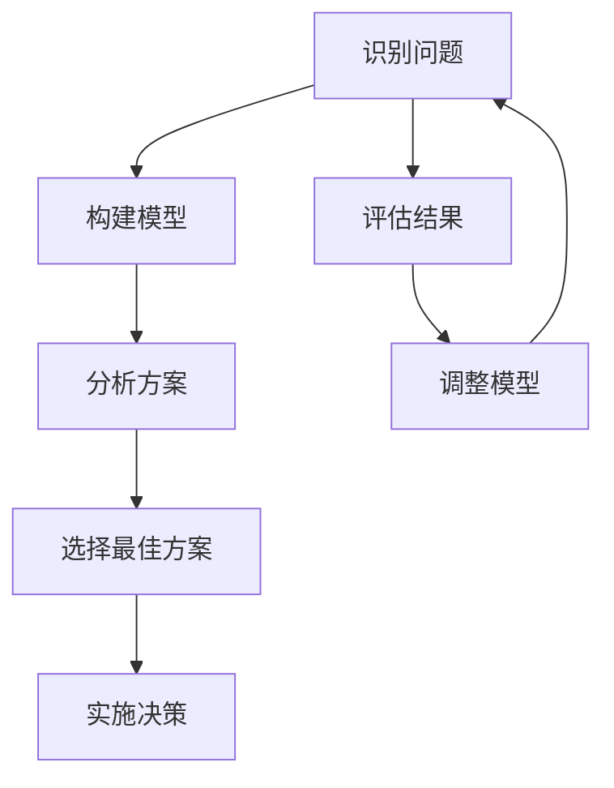
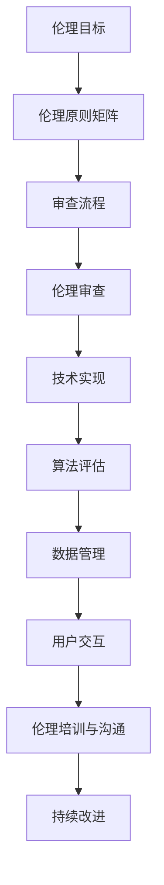

                 

### 《数学与人工智能伦理：AI决策的数学框架》

> 关键词：人工智能伦理，数学模型，决策框架，可解释性，公平性

> 摘要：本文探讨了人工智能伦理问题，并引入了数学模型作为AI决策的框架。通过分析决策理论、概率论、预测模型和优化算法，本文为AI伦理决策提供了理论支持。同时，通过实际案例研究，本文探讨了AI决策的可解释性与公平性问题，并提出了相应的解决方案。文章旨在为人工智能伦理的研究和实践提供有价值的参考。

----------------------------------------------------------------

### 书籍概述

**1.1 引言**

随着人工智能技术的迅猛发展，AI在决策领域的应用越来越广泛。然而，随之而来的伦理问题也日益凸显。人工智能伦理涉及到多个方面，包括隐私、公平性、透明度等。如何确保AI系统的决策符合伦理标准，已经成为学术界和工业界关注的焦点。

本文旨在探讨人工智能伦理问题，并引入数学模型作为AI决策的框架。通过分析决策理论、概率论、预测模型和优化算法，本文为AI伦理决策提供了理论支持。同时，通过实际案例研究，本文探讨了AI决策的可解释性与公平性问题，并提出了相应的解决方案。

**1.2 目的与读者对象**

本文的目标是：
1. 分析人工智能伦理的核心问题，探讨其与数学模型的关系。
2. 建立一个基于数学模型的AI决策框架，为AI伦理决策提供理论支持。
3. 分析AI决策的可解释性与公平性问题，并提出解决方案。

本文的读者对象包括：
1. 对人工智能伦理感兴趣的研究人员。
2. 从事人工智能开发与决策的系统工程师。
3. 对数学模型在AI决策中应用感兴趣的学生和学者。

**1.3 书籍结构安排**

本文分为以下几部分：

1. 书籍概述：介绍本书的目的、读者对象和结构安排。
2. 第1章 问题背景与核心概念：分析人工智能伦理的背景和核心概念。
3. 第2章 AI决策数学框架基础：介绍决策理论、概率论和预测模型。
4. 第3章 AI伦理决策案例分析：通过案例研究探讨AI伦理决策。
5. 第4章 AI决策的可解释性与公平性：分析可解释性与公平性原理和实现方法。
6. 第5章 AI决策伦理框架构建：设计AI伦理决策框架。
7. 第6章 未来展望与挑战：探讨AI伦理决策的发展趋势和挑战。
8. 结论与展望：总结全文，展望未来AI伦理决策的发展方向。

----------------------------------------------------------------

### 第1章 问题背景与核心概念

**2.1 人工智能伦理概述**

人工智能伦理是指在人工智能技术的研究、开发和应用过程中，需要遵循的一系列伦理原则和道德规范。人工智能伦理问题的出现，源于AI技术对社会、经济、文化和个人生活等多个方面的深远影响。

人工智能伦理问题的背景主要包括以下几个方面：

1. **隐私问题**：随着AI技术的应用，个人隐私数据的收集、存储和使用成为了一大伦理挑战。如何保护用户的隐私，避免隐私泄露和数据滥用，是AI伦理需要关注的重点。

2. **公平性问题**：人工智能系统在决策过程中可能会存在偏见和歧视，影响社会公平。例如，招聘系统可能因为训练数据中的偏见而导致不公平的招聘决策。

3. **透明度问题**：人工智能系统的决策过程通常是非透明的，用户很难了解其决策依据和原因。如何提高AI系统的透明度，使其决策过程更加可解释，是伦理研究的一个重要方向。

4. **责任归属问题**：在AI技术引发事故或错误决策时，责任归属成为一个复杂的问题。例如，自动驾驶汽车发生事故时，责任应归属于开发者、使用者还是系统本身？

**2.2 核心概念与联系**

在讨论人工智能伦理问题时，需要了解几个核心概念，包括伦理学、决策理论、概率论和预测模型等。

**2.2.1 伦理学的核心概念**

伦理学是关于道德和行为的哲学研究。伦理学的核心概念包括：

1. **公正**：公正是指分配资源或待遇时，遵循平等、公平的原则。在人工智能伦理中，公正关注的是AI系统如何在不同群体之间公平地分配资源和服务。

2. **义务**：义务是指个体或组织在特定情境下必须履行的道德责任。在AI伦理中，义务关注的是开发者、使用者和监管者各自的责任。

3. **德性**：德性是指个体在道德行为中所表现出的良好品质和道德修养。在AI伦理中，德性关注的是开发者、使用者和监管者的道德素质。

**2.2.2 人工智能伦理学的核心概念**

人工智能伦理学的核心概念包括：

1. **透明度**：透明度是指AI系统决策过程的可解释性。提高透明度有助于用户理解AI系统的决策依据和原因，从而增强信任。

2. **公平性**：公平性是指AI系统在决策过程中不会因为偏见或歧视而导致不公平的结果。公平性关注的是AI系统如何在不同群体之间公平地分配资源和待遇。

3. **可解释性**：可解释性是指AI系统决策过程的透明度。可解释性有助于用户理解和信任AI系统的决策，从而降低风险。

**2.2.3 概念属性特征对比表格**

为了更好地理解伦理学的核心概念和人工智能伦理学的核心概念，我们可以在表格中对比它们的属性特征：

| 核心概念 | 属性特征 |
| :--- | :--- |
| 公正（伦理学） | 平等、公平原则 |
| 义务（伦理学） | 道德责任 |
| 德性（伦理学） | 道德品质 |
| 透明度（人工智能伦理学） | 可解释性 |
| 公平性（人工智能伦理学） | 避免偏见和歧视 |
| 可解释性（人工智能伦理学） | 决策过程的透明度 |

**2.2.4 ER实体关系图架构的Mermaid流程图**

为了更直观地展示核心概念之间的联系，我们可以使用Mermaid流程图来绘制ER实体关系图：

```mermaid
erDiagram
    EthicsConcept |--<|{Decision Theory}
    EthicsConcept |--<|{Probability Theory}
    EthicsConcept |--<|{Predictive Modeling}
    AI伦理学Concept|--|{Transparency}
    AI伦理学Concept|--|{Fairness}
    AI伦理学Concept|--|{Explainability}
```

这个ER实体关系图展示了伦理学的核心概念与决策理论、概率论、预测模型以及人工智能伦理学的核心概念之间的联系。

----------------------------------------------------------------

### 第2章 AI决策数学框架基础

**3.1 决策理论概述**

决策理论是研究在不确定环境中做出最优决策的数学理论。它关注的是决策者如何在多个可选方案中选择一个最佳方案。决策理论的基本概念包括：

1. **决策者**：做出决策的个体或组织。
2. **方案**：决策者可以选择的行动方案。
3. **状态**：决策过程中可能出现的各种结果。
4. **效用**：决策者对各种结果的偏好程度。

决策理论的基本原则是最大化决策者的期望效用。在不确定环境下，决策者需要根据概率分布来评估各种方案的效用。决策过程包括以下几个步骤：

1. **识别问题**：明确决策的目标和限制条件。
2. **构建模型**：建立数学模型来描述决策问题。
3. **分析方案**：评估各个方案在不同状态下的效用。
4. **选择最佳方案**：根据效用最大化原则选择最佳方案。

**3.2 数学模型与原理**

在AI决策中，常用的数学模型包括概率论、预测模型和优化算法。

**3.2.1 概率论基础**

概率论是研究随机事件的数学分支。在AI决策中，概率论主要用于评估不确定性和风险。以下是一些概率论的基本概念：

1. **概率分布**：描述随机变量可能取值的概率分布。
2. **条件概率**：在已知某个事件发生的情况下，另一个事件发生的概率。
3. **贝叶斯定理**：用于计算后验概率，即在已知结果的情况下，推断先验概率。

贝叶斯定理的数学公式为：

$$
P(A|B) = \frac{P(B|A)P(A)}{P(B)}
$$

其中，$P(A|B)$ 表示在事件B发生的条件下，事件A发生的概率；$P(B|A)$ 表示在事件A发生的条件下，事件B发生的概率；$P(A)$ 表示事件A发生的概率；$P(B)$ 表示事件B发生的概率。

**3.2.2 预测模型与优化算法**

预测模型是用于预测未来事件或结果的数学模型。在AI决策中，预测模型可以帮助决策者评估不同方案的可能结果。以下是一些常用的预测模型：

1. **决策树**：一种树形结构，用于分类和回归任务。
2. **神经网络**：一种基于人脑神经网络的数学模型，用于复杂函数的拟合和预测。
3. **支持向量机**：一种用于分类和回归任务的优化算法。

优化算法是用于求解最优解的数学方法。以下是一些常用的优化算法：

1. **梯度下降**：一种迭代优化算法，用于最小化损失函数。
2. **拉格朗日乘数法**：一种用于求解约束优化问题的算法。
3. **遗传算法**：一种基于生物进化的优化算法。

**3.2.3 Mermaid流程图**

为了更直观地展示决策理论和数学模型的应用，我们可以使用Mermaid流程图来绘制决策过程：



这个流程图展示了决策过程的各个步骤，包括识别问题、构建模型、分析方案、选择最佳方案、实施决策、评估结果和调整模型。

**3.2.4 数学公式与讲解**

为了更好地理解数学模型的应用，我们可以在文中嵌入数学公式并进行详细讲解。以下是一个例子：

$$
\begin{aligned}
\text{预期效用} &= \sum_{i=1}^{n} u_i \cdot p_i \\
u_i &= \text{方案} i \text{在状态} s_i \text{下的效用} \\
p_i &= \text{方案} i \text{在状态} s_i \text{下的概率}
\end{aligned}
$$

这个公式表示了在不确定环境下，决策者如何根据方案在不同状态下的效用和概率来计算预期效用，从而选择最佳方案。

通过上述分析，我们可以看出，决策理论和数学模型在AI决策中起着至关重要的作用。它们为AI决策提供了理论支持，使得决策过程更加科学和可解释。

----------------------------------------------------------------

### 第3章 AI伦理决策案例分析

**4.1 案例背景与概述**

在本章中，我们将通过分析一个具体的案例，探讨AI伦理决策的应用和挑战。这个案例涉及到自动驾驶汽车在紧急情况下的决策问题。自动驾驶汽车在道路上行驶时，可能会遇到各种紧急情况，如行人横穿道路、车辆故障等。如何确保自动驾驶汽车的决策符合伦理标准，是一个重要的研究课题。

**4.2 案例分析**

为了分析这个案例，我们需要首先对案例数据进行预处理。然后，我们可以使用决策理论、概率论和预测模型来评估不同决策方案的伦理合理性。

**4.2.1 数据预处理**

在本案例中，我们需要收集以下数据：

1. 道路状况：包括道路宽度、车辆流量、天气状况等。
2. 情景描述：包括紧急情况的具体描述，如行人横穿、车辆故障等。
3. 自动驾驶汽车性能：包括刹车距离、加速性能、转向性能等。

通过对这些数据进行预处理，我们可以将其转换为适合建模的格式。例如，可以使用数值编码来表示道路状况和情景描述，使用统计数据来评估自动驾驶汽车的性能。

**4.2.2 案例算法应用**

在预处理完数据后，我们可以使用决策理论、概率论和预测模型来评估不同决策方案的伦理合理性。以下是一个简单的算法应用流程：

1. **识别问题**：明确自动驾驶汽车在紧急情况下的决策目标，如最大化乘客安全、最小化损失等。
2. **构建模型**：建立数学模型来描述决策问题，包括概率分布、效用函数等。
3. **分析方案**：评估不同决策方案在不同情景下的效用，并计算预期效用。
4. **选择最佳方案**：根据预期效用最大化原则，选择最佳决策方案。

**4.2.3 Mermaid流程图**

为了更直观地展示案例算法的应用，我们可以使用Mermaid流程图来绘制决策过程：


这个流程图展示了决策过程的各个步骤，包括识别问题、构建模型、分析方案、选择最佳方案、实施决策、评估结果和调整模型。

**4.2.4 结果解读与讨论**

通过算法分析，我们可以得到每个决策方案的预期效用。根据预期效用最大化原则，我们可以选择最佳决策方案。例如，如果自动驾驶汽车在紧急情况下选择刹车，那么它的预期效用可能会高于选择加速或保持不变。

然而，这并不意味着最佳决策方案就是最符合伦理标准的决策。在AI伦理决策中，我们还需要考虑其他因素，如乘客安全、行人安全、社会责任等。因此，我们需要对结果进行进一步解读和讨论。

**4.2.5 拓展讨论**

在未来，随着人工智能技术的不断发展，AI伦理决策将面临更多的挑战。例如，自动驾驶汽车在面临多车碰撞风险时，如何确保决策的公平性和透明度？如何在紧急情况下平衡乘客安全和行人安全？这些都是需要深入探讨的问题。

通过分析这个案例，我们可以看到，AI伦理决策不仅仅是技术问题，还涉及到伦理、道德和社会责任等多个方面。只有通过综合考虑这些因素，才能确保AI系统的决策符合伦理标准，为社会带来更大的价值。

----------------------------------------------------------------

### 第4章 AI决策的可解释性与公平性

**5.1 可解释性原理**

AI决策的可解释性是指用户可以理解AI系统决策的原因和过程。可解释性对于提高用户信任、降低决策风险和促进AI技术的普及具有重要意义。以下是可解释性的几个关键原则：

1. **透明性**：AI系统的决策过程应该是透明的，用户可以清楚地了解系统的输入、中间过程和最终输出。
2. **可理解性**：AI系统的决策规则和逻辑应该是易于理解的，用户不需要专业的技术知识就可以理解。
3. **可验证性**：用户应该能够验证AI系统的决策结果，确保其符合预期和实际情况。

为了提高AI决策的可解释性，可以采用以下几种方法：

1. **解释性模型**：选择具有明确决策规则和逻辑的模型，如决策树、逻辑回归等。
2. **可视化工具**：使用可视化工具，如图表、流程图等，将决策过程和结果展示给用户。
3. **解释性算法**：开发专门的可解释性算法，如LIME（Local Interpretable Model-agnostic Explanations）和SHAP（SHapley Additive exPlanations）等。

**5.2 公平性评估**

AI决策的公平性是指AI系统在决策过程中不会因为某些特定群体的特征而产生不公平的结果。公平性是AI伦理决策的重要原则之一，以下是一些常用的公平性评估方法：

1. **基尼不平等指数**：用于衡量决策结果在不同群体之间的不公平程度。基尼不平等指数的值介于0和1之间，值越大表示不公平程度越高。
2. **统计 parity**：用于衡量AI系统在不同群体之间的预测准确性是否一致。统计parity要求系统对于不同群体的预测准确率相等。
3. **均衡性分析**：分析决策结果在不同群体中的分布情况，确保系统不会对某些群体产生歧视。

为了提高AI决策的公平性，可以采用以下几种方法：

1. **数据预处理**：在训练模型之前，对训练数据进行清洗和预处理，去除潜在的偏见和歧视。
2. **公平性约束**：在模型训练过程中，加入公平性约束，确保模型不会对某些群体产生偏见。
3. **后处理调整**：在模型输出结果后，对结果进行后处理调整，确保决策结果的公平性。

**5.3 实践应用**

在本节中，我们将通过一个实际案例，展示如何应用可解释性和公平性原理来改进AI决策系统。

**5.3.1 案例研究**

假设我们正在开发一个招聘系统，用于预测应聘者的面试结果。系统需要评估应聘者的简历、面试表现等多个指标，并给出是否录用的建议。

**5.3.2 可解释性应用**

为了提高招聘系统的可解释性，我们可以采用以下方法：

1. **解释性模型**：选择逻辑回归模型，因为其决策规则和逻辑相对简单，容易理解。
2. **可视化工具**：使用散点图和回归方程，将每个指标的权重和贡献展示给用户。
3. **解释性算法**：使用LIME算法，为每个应聘者生成局部解释，解释其被录用的原因。

**5.3.3 公平性应用**

为了提高招聘系统的公平性，我们可以采用以下方法：

1. **数据预处理**：对简历数据进行清洗，去除可能包含歧视性信息的字段，如性别、种族等。
2. **公平性约束**：在模型训练过程中，加入公平性约束，确保模型不会对某些群体产生偏见。
3. **后处理调整**：对模型输出结果进行后处理调整，确保决策结果的公平性，如对某些群体的录用率进行调整。

**5.3.4 结果解读与讨论**

通过上述方法，我们可以改进招聘系统的可解释性和公平性。在结果解读和讨论方面，我们可以：

1. **分析指标贡献**：分析每个指标对录用决策的贡献，确保系统的决策过程是合理的。
2. **评估公平性**：评估模型在不同群体中的决策结果，确保系统的公平性。
3. **持续优化**：根据用户反馈和实际情况，不断优化系统的可解释性和公平性。

通过这个案例研究，我们可以看到，应用可解释性和公平性原理可以显著提高AI决策系统的质量和可信度。这不仅有助于用户理解和信任AI系统，还有助于降低决策风险，促进AI技术的普及和应用。

----------------------------------------------------------------

### 第5章 AI决策伦理框架构建

**6.1 伦理决策框架设计**

构建一个有效的AI决策伦理框架，需要系统地考虑伦理原则、技术实现、法律法规和社会影响等多个方面。以下是一个基于伦理原则的AI决策框架设计步骤：

**6.1.1 基于伦理原则的框架设计**

1. **明确伦理目标**：定义AI系统应遵循的伦理原则，如公正、透明、公平性、责任和尊重用户隐私等。
2. **构建伦理原则矩阵**：将伦理原则与AI决策的关键要素（如算法、数据、用户交互等）进行关联，形成一个矩阵，确保每个要素都能体现相应的伦理原则。
3. **设计伦理审查流程**：制定伦理审查机制，包括审查标准、审查程序和审查委员会，确保AI决策在开发和应用过程中得到持续审查。

**6.1.2 Mermaid架构图**

为了更直观地展示AI决策伦理框架的架构设计，我们可以使用Mermaid流程图来绘制：



这个架构图展示了从伦理目标到伦理审查、技术实现和用户交互的完整流程，以及每个环节之间的关联和互动。

**6.2 应用场景与实施**

AI决策伦理框架可以在多种应用场景中实施，以下是一些典型的应用场景和实施策略：

**6.2.1 应用场景**

1. **自动驾驶汽车**：确保自动驾驶汽车的决策符合伦理原则，如最小化事故风险、保障行人安全等。
2. **医疗诊断系统**：确保AI辅助诊断系统的决策不会因偏见而导致不公平的医疗结果。
3. **招聘系统**：确保AI招聘系统的决策不会因性别、种族等因素而导致歧视。

**6.2.2 实施策略**

1. **伦理培训与沟通**：为AI开发者和决策者提供伦理培训，提高其伦理意识，并建立与用户的沟通渠道，确保用户对AI决策过程有充分的理解。
2. **伦理审查与评估**：建立定期审查机制，对AI系统进行伦理评估，确保其符合伦理标准。审查可以包括技术层面（如算法公平性）、数据层面（如数据隐私）和社会层面（如用户接受度）。
3. **技术实现与改进**：在AI系统开发过程中，集成伦理原则，通过技术手段确保系统的可解释性和公平性。例如，使用解释性模型和公平性约束，对系统进行持续改进。

**6.2.3 伦理风险评估与应对**

1. **风险评估**：对AI系统的潜在风险进行识别和评估，包括伦理风险、技术风险和社会风险等。
2. **应对策略**：制定应对策略，如风险缓解、风险规避和风险转移等，确保AI系统的决策过程是负责任的。
3. **持续监控与反馈**：建立监控机制，对AI系统的决策过程进行持续监控，收集用户反馈，及时调整和改进系统。

通过上述步骤和策略，我们可以构建一个全面、系统的AI决策伦理框架，确保AI系统的决策过程符合伦理标准，为人类带来更大的福祉。

----------------------------------------------------------------

### 第6章 未来展望与挑战

**7.1 发展趋势**

人工智能伦理决策的未来发展趋势主要体现在以下几个方面：

1. **技术的进步**：随着人工智能技术的不断发展，新的算法和模型将不断涌现，为伦理决策提供更强大的支持。例如，深度学习和强化学习技术的应用，将使AI决策更加智能和灵活。

2. **法律的完善**：各国政府和国际组织将加大对人工智能伦理问题的关注，出台更加完善的法律法规，规范AI系统的开发和应用。例如，欧盟的《通用数据保护条例》（GDPR）已经开始对人工智能伦理问题进行规范。

3. **跨学科的融合**：人工智能伦理决策将更多地融合伦理学、法律学、心理学、社会学等学科的研究成果，形成跨学科的研究方法，为伦理决策提供更加全面的视角。

**7.2 挑战与解决**

尽管人工智能伦理决策有着广阔的发展前景，但仍然面临诸多挑战：

1. **技术挑战**：AI系统的复杂性和不确定性使得伦理决策过程更加困难。例如，自动驾驶汽车在紧急情况下的决策需要快速、准确地评估多种因素，这对算法和模型提出了高要求。

2. **法律挑战**：目前的人工智能法律法规尚不完善，无法全面覆盖所有伦理问题。例如，关于AI责任归属的法律条款仍然存在争议，需要进一步完善。

3. **社会挑战**：公众对AI伦理决策的接受度和信任度仍然较低。例如，自动驾驶汽车的普及面临着公众对安全性和隐私的担忧。

为了解决这些挑战，可以采取以下措施：

1. **技术创新**：持续研发新的算法和模型，提高AI系统的可解释性和公平性。例如，开发更加透明和易于解释的深度学习模型。

2. **法律完善**：制定和完善人工智能伦理决策相关的法律法规，明确责任归属和监管机制。例如，建立全球统一的AI伦理标准。

3. **公众教育**：加强公众对AI伦理决策的了解和教育，提高公众对AI技术的信任度和接受度。例如，通过媒体宣传、教育培训等方式，普及AI伦理知识。

通过技术创新、法律完善和公众教育，我们可以逐步解决人工智能伦理决策面临的各种挑战，推动AI技术在伦理框架下健康、可持续发展。

----------------------------------------------------------------

### 结论与展望

本书《数学与人工智能伦理：AI决策的数学框架》旨在探讨人工智能伦理问题，并引入数学模型作为AI决策的框架。通过分析决策理论、概率论、预测模型和优化算法，本文为AI伦理决策提供了理论支持。同时，通过实际案例研究，本文探讨了AI决策的可解释性与公平性问题，并提出了相应的解决方案。

本文的主要结论如下：

1. 人工智能伦理是一个复杂的领域，涉及多个方面，如隐私、公平性、透明度和责任归属等。
2. 数学模型在AI决策中起着关键作用，可以为AI伦理决策提供理论支持。
3. 可解释性和公平性是AI决策的重要原则，通过技术创新和法律完善，可以提高AI系统的可解释性和公平性。
4. AI决策伦理框架的构建需要综合考虑伦理原则、技术实现、法律法规和社会影响等多个方面。

展望未来，AI伦理决策将继续面临诸多挑战，如技术的复杂性、法律的完善性和公众的接受度等。然而，随着技术的进步、法律的完善和公众教育的加强，我们有理由相信，AI伦理决策将在伦理框架下实现健康、可持续发展。

未来研究方向包括：

1. 深入研究AI决策中的不确定性问题，提出更有效的算法和模型。
2. 探索跨学科的研究方法，结合伦理学、法律学、心理学和社会学等领域的知识，为AI伦理决策提供更加全面的视角。
3. 加强对AI伦理决策的法律规范，建立全球统一的AI伦理标准。
4. 通过公众教育和宣传活动，提高公众对AI伦理决策的信任度和接受度。

作者：AI天才研究院/AI Genius Institute & 禅与计算机程序设计艺术 /Zen And The Art of Computer Programming。希望本书能为人工智能伦理的研究和实践提供有价值的参考。

