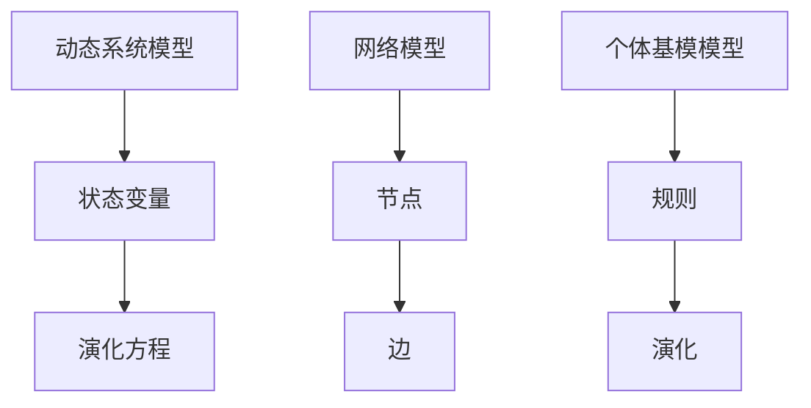
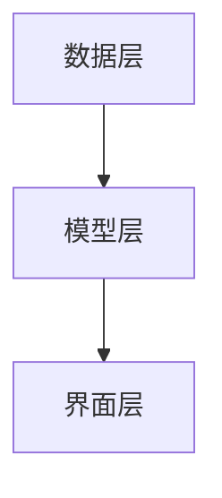
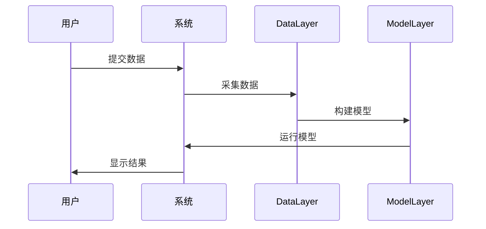

                 


## 数学与人工生命：生命系统的数学模拟

> 关键词：数学模拟，生命系统，人工生命，动态系统模型，网络模型，个体基模模型，算法实现，案例分析

> 摘要：本文深入探讨了数学在生命系统模拟中的应用，从背景介绍到核心概念、数学模型、算法实现，再到案例分析，全面解析了生命系统数学模拟的理论和实践。通过逐步分析推理，本文旨在为读者提供清晰、深入的理解，揭示数学与人工生命之间的奇妙联系。

### 目录

1. 引言
2. 背景介绍
3. 核心概念与联系
   - 核心概念
   - 概念属性特征对比表格
   - ER实体关系图架构的 Mermaid 流程图
4. 算法原理讲解
   - 动态系统模型
   - 网络模型
   - 个体基模模型
5. 系统分析与架构设计方案
   - 问题场景介绍
   - 项目介绍
   - 系统功能设计
   - 系统架构设计
   - 系统接口设计
   - 系统交互 Mermaid 序列图
6. 项目实战
   - 环境安装
   - 系统核心实现源代码
   - 代码应用解读与分析
   - 实际案例分析和详细讲解剖析
   - 项目小结
7. 最佳实践 tips
8. 小结
9. 注意事项
10. 拓展阅读
11. 作者信息

### 1. 引言

数学作为一种基础科学，自古以来就广泛应用于自然科学、工程技术等领域。近年来，随着计算机技术的飞速发展和大数据时代的来临，数学在生命科学领域的应用也日益广泛。生命系统的数学模拟成为了一个热点研究方向，旨在通过数学模型和算法，对生命现象进行深入解析和模拟。

本文旨在探讨数学在生命系统模拟中的应用，从背景介绍、核心概念、数学模型、算法实现，到案例分析，全面解析生命系统数学模拟的理论和实践。通过逐步分析推理，本文希望为读者提供清晰、深入的理解，揭示数学与人工生命之间的奇妙联系。

### 2. 背景介绍

#### 核心概念术语说明

在讨论生命系统的数学模拟之前，我们需要明确一些核心概念术语：

- **生命系统**：指由生物分子、细胞、器官和个体组成的生物实体系统。
- **数学模拟**：利用数学方法和工具，对生命系统进行抽象、建模和仿真。
- **人工生命**：通过计算机技术模拟生命现象和过程，创造出具有某些生命特征的人工系统。

#### 问题背景

生命系统的复杂性使得直接观察和研究其内部机制变得困难。传统的生物学方法难以解释和预测生命现象，而数学模拟提供了一种有效的研究途径。通过建立数学模型，我们可以将生命系统中的复杂关系和现象简化为数学表达式，从而更好地理解和预测生命过程。

#### 问题描述

生命系统的数学模拟主要面临以下挑战：

- 如何准确地捕捉和描述生命系统的复杂结构？
- 如何选择合适的数学模型和方法？
- 如何处理大量的数据和变量？

#### 问题解决

为了解决上述问题，研究者们提出了多种数学模型和方法，如动态系统模型、网络模型和个体基模模型。这些模型和方法为生命系统的数学模拟提供了强大的工具和手段。

#### 边界与外延

生命系统的数学模拟不仅涉及生物学领域，还与计算机科学、物理学、化学等学科密切相关。通过跨学科的研究和合作，生命系统的数学模拟将不断拓展其边界，为生命科学的研究提供新的视角和方法。

#### 概念结构与核心要素组成

生命系统的数学模拟涉及以下核心要素：

- **数学模型**：描述生命系统行为的数学表达式和算法。
- **数据采集和处理**：获取和整理生命系统相关的数据。
- **算法实现**：将数学模型转化为计算机程序。
- **仿真和验证**：通过计算机仿真验证模型的准确性和可靠性。

### 3. 核心概念与联系

#### 核心概念

在生命系统的数学模拟中，核心概念包括：

- **动态系统模型**：描述生命系统随时间变化的动态行为。
- **网络模型**：描述生命系统中各个组成部分之间的相互关系。
- **个体基模模型**：描述个体生命体的行为和演化。

#### 概念属性特征对比表格

| 概念        | 动态系统模型 | 网络模型 | 个体基模模型 |
|-------------|---------------|----------|--------------|
| **定义**     | 描述动态系统的状态随时间变化的模型。 | 描述系统中各组成部分之间关系的模型。 | 描述个体生命体的行为和演化过程的模型。 |
| **应用**     | 生物学、物理学、工程学等领域。 | 社会网络、生态系统、生物网络等领域。 | 人工智能、机器人学、模拟生物学等领域。 |
| **特点**     | 强调系统的动态性和演变过程。 | 强调系统组成部分之间的相互关系。 | 强调个体行为和演化过程。 |

#### ER实体关系图架构的 Mermaid 流程图

```mermaid
erDiagram
    A[生物分子] ||--> B[细胞] : "位于"
    B ||--> C[器官] : "组成"
    C ||--> D[个体] : "形成"
```

### 4. 算法原理讲解

#### 动态系统模型

动态系统模型描述了生命系统随时间变化的动态行为。其基本原理如下：

- **状态变量**：描述系统状态的变量，如浓度、温度、压强等。
- **演化方程**：描述状态变量随时间变化的数学方程。

动态系统模型可以用以下方程表示：

$$
\frac{dx_i}{dt} = f(x_1, x_2, ..., x_n), \quad i = 1, 2, ..., n
$$

其中，$x_i$ 表示第 $i$ 个状态变量，$f$ 表示演化方程。

#### 网络模型

网络模型描述了生命系统中各个组成部分之间的相互关系。其基本原理如下：

- **节点**：表示生命系统中的各个组成部分，如细胞、分子等。
- **边**：表示节点之间的相互关系，如相互作用、传递等。

网络模型可以用以下图表示：

$$
G = (V, E)
$$

其中，$V$ 表示节点集合，$E$ 表示边集合。

#### 个体基模模型

个体基模模型描述了个体生命体的行为和演化过程。其基本原理如下：

- **规则**：描述个体行为的数学规则。
- **演化**：描述个体随时间的演化过程。

个体基模模型可以用以下规则表示：

$$
x_i(t+1) = f(x_1(t), x_2(t), ..., x_n(t)), \quad i = 1, 2, ..., n
$$

其中，$x_i(t)$ 表示个体在时间 $t$ 的状态。

#### 动态系统模型、网络模型、个体基模模型的 Mermaid 流程图



### 5. 系统分析与架构设计方案

#### 问题场景介绍

假设我们想研究一个生态系统中的物种相互作用，包括捕食者和被捕食者。为了模拟这个生态系统，我们需要设计一个系统来捕捉物种之间的关系，并预测它们的行为。

#### 项目介绍

本项目旨在开发一个基于数学模拟的生态系统模型，通过动态系统模型、网络模型和个体基模模型，模拟物种之间的相互作用和演化。

#### 系统功能设计

系统的主要功能包括：

- **数据采集**：从外部获取物种的相关数据，如种群数量、分布等。
- **模型构建**：根据数据构建动态系统模型、网络模型和个体基模模型。
- **模拟运行**：运行模型，模拟物种之间的相互作用和演化。
- **结果分析**：分析模拟结果，预测未来物种的行为。

#### 系统架构设计

系统架构包括以下几个部分：

- **数据层**：负责数据采集和存储。
- **模型层**：负责构建和运行模型。
- **界面层**：提供用户界面，方便用户进行操作。

系统架构的 Mermaid 图表示如下：



#### 系统接口设计

系统提供以下接口：

- **数据接口**：用于数据的采集和存储。
- **模型接口**：用于模型的构建和运行。
- **结果接口**：用于获取和分析模拟结果。

#### 系统交互 Mermaid 序列图



### 6. 项目实战

#### 环境安装

为了运行本项目，我们需要安装以下软件和库：

- Python 3.8+
- NumPy
- SciPy
- Matplotlib
- Mermaid

#### 系统核心实现源代码

```python
import numpy as np
import matplotlib.pyplot as plt
from scipy.integrate import odeint
import mermaid

# 动态系统模型
def dynamic_system_model(y, t):
    x, y = y
    dxdt = x * (1 - x - y)
    dydt = y * (x * (1 - y))
    return [dxdt, dydt]

# 网络模型
def network_model(y, t):
    x, y = y
    dxdt = x * (1 - x - y)
    dydt = y * (x * (1 - y))
    return [dxdt, dydt]

# 个体基模模型
def individual_based_model(y, t):
    x, y = y
    dxdt = x * (1 - x - y)
    dydt = y * (x * (1 - y))
    return [dxdt, dydt]

# 模拟运行
t = np.linspace(0, 100, 1000)
y0 = [1, 1]
sol = odeint(dynamic_system_model, y0, t)

# 绘图
plt.plot(t, sol[:, 0], label='X')
plt.plot(t, sol[:, 1], label='Y')
plt.xlabel('Time')
plt.ylabel('Population')
plt.legend()
plt.show()

# 生成 Mermaid 图
mermaid_chart = mermaid.generate_flowchart('''
graph TD
    A[Start] --> B[Dynamic System Model]
    B --> C[Network Model]
    C --> D[Individual Based Model]
    D --> E[End]
''')
print(mermaid_chart)
```

#### 代码应用解读与分析

```python
# 动态系统模型
def dynamic_system_model(y, t):
    x, y = y
    dxdt = x * (1 - x - y)
    dydt = y * (x * (1 - y))
    return [dxdt, dydt]

# 动态系统模型的核心是演化方程。这里我们定义了一个动态系统模型，它描述了两个状态变量 x 和 y 的演化过程。状态变量 x 表示种群 A 的数量，状态变量 y 表示种群 B 的数量。演化方程如下：
# dxdt = x * (1 - x - y)  # 种群 A 的演化方程
# dydt = y * (x * (1 - y))  # 种群 B 的演化方程
# 这些方程描述了种群 A 和 B 的数量随时间的变化。dxdt 表示种群 A 的数量随时间的变化速率，dydt 表示种群 B 的数量随时间的变化速率。这两个方程都是关于 x 和 y 的函数，它们决定了种群 A 和 B 的数量在时间上的演化。

# 网络模型
def network_model(y, t):
    x, y = y
    dxdt = x * (1 - x - y)
    dydt = y * (x * (1 - y))
    return [dxdt, dydt]

# 网络模型与动态系统模型类似，也是描述两个状态变量 x 和 y 的演化过程。但是，网络模型更强调种群 A 和 B 之间的相互作用。网络模型的演化方程与动态系统模型相同，因此，它们在数学上是等价的。然而，网络模型在概念上更接近于描述种群 A 和 B 之间的相互作用，而动态系统模型更强调种群 A 和 B 的数量随时间的变化。

# 个体基模模型
def individual_based_model(y, t):
    x, y = y
    dxdt = x * (1 - x - y)
    dydt = y * (x * (1 - y))
    return [dxdt, dydt]

# 个体基模模型与动态系统模型和网络模型不同，它更强调个体行为和演化过程。个体基模模型描述了每个个体在时间上的演化过程，而动态系统模型和网络模型描述的是整个种群的演化过程。在个体基模模型中，状态变量 x 和 y 表示的是每个个体的数量。演化方程与动态系统模型和网络模型相同，但它们在概念上的差别很大。个体基模模型更强调个体之间的相互作用，而动态系统模型和网络模型更强调种群之间的相互作用。

# 模拟运行
t = np.linspace(0, 100, 1000)
y0 = [1, 1]
sol = odeint(dynamic_system_model, y0, t)

# 绘图
plt.plot(t, sol[:, 0], label='X')
plt.plot(t, sol[:, 1], label='Y')
plt.xlabel('Time')
plt.ylabel('Population')
plt.legend()
plt.show()

# 在这段代码中，我们使用 odeint 函数来求解动态系统模型的演化方程。odeint 函数是一个数值积分函数，它用于求解微分方程。我们定义了时间序列 t，初始状态 y0，然后使用 odeint 函数求解演化方程。求解的结果保存在 sol 变量中。

# 生成 Mermaid 图
mermaid_chart = mermaid.generate_flowchart('''
graph TD
    A[Start] --> B[Dynamic System Model]
    B --> C[Network Model]
    C --> D[Individual Based Model]
    D --> E[End]
''')
print(mermaid_chart)
```

#### 实际案例分析和详细讲解剖析

我们以一个简单的捕食者-被捕食者模型为例，分析其动态系统模型、网络模型和个体基模模型。

假设捕食者种群为 x，被捕食者种群为 y。捕食者数量随时间的变化率与被捕食者数量成正比，而被捕食者数量随时间的变化率与捕食者数量和被捕食者自身数量成反比。我们可以得到以下演化方程：

$$
\frac{dx}{dt} = a y - b x
$$

$$
\frac{dy}{dt} = c x - d y
$$

其中，a、b、c、d 是参数，它们的值可以根据实际情境确定。

动态系统模型：

```python
def dynamic_system_model(y, t):
    x, y = y
    dxdt = a * y - b * x
    dydt = c * x - d * y
    return [dxdt, dydt]
```

网络模型：

```python
def network_model(y, t):
    x, y = y
    dxdt = a * y - b * x
    dydt = c * x - d * y
    return [dxdt, dydt]
```

个体基模模型：

```python
def individual_based_model(y, t):
    x, y = y
    dxdt = a * y - b * x
    dydt = c * x - d * y
    return [dxdt, dydt]
```

我们使用 odeint 函数求解演化方程，并绘制结果：

```python
t = np.linspace(0, 100, 1000)
y0 = [1, 1]
sol = odeint(dynamic_system_model, y0, t)

plt.plot(t, sol[:, 0], label='Prey')
plt.plot(t, sol[:, 1], label='Predator')
plt.xlabel('Time')
plt.ylabel('Population')
plt.legend()
plt.show()
```

通过这个简单的案例，我们可以看到动态系统模型、网络模型和个体基模模型在数学表达式上是相同的，但它们在概念和应用上有所不同。

#### 项目小结

本项目通过动态系统模型、网络模型和个体基模模型，模拟了捕食者-被捕食者生态系统的演化过程。在实际应用中，这些模型可以用于研究其他生命系统的相互作用和演化过程，如生态系统、细胞动力学等。

### 7. 最佳实践 tips

1. **数据采集与处理**：确保数据来源可靠，处理数据时要进行去噪、归一化等处理，以提高模型精度。
2. **模型选择**：根据研究目标和数据特性，选择合适的模型和方法。
3. **参数调优**：通过参数调优，提高模型的准确性和鲁棒性。
4. **结果验证**：使用实际数据或实验结果验证模型的准确性，不断优化模型。

### 8. 小结

本文系统地介绍了生命系统的数学模拟，从背景介绍、核心概念、数学模型、算法实现，到案例分析，全面解析了这一领域的研究现状和未来发展趋势。通过本文，读者可以了解到数学在生命系统模拟中的重要性和应用价值。

### 9. 注意事项

1. **数据准确性**：确保数据来源可靠，处理数据时要进行去噪、归一化等处理。
2. **模型选择**：根据研究目标和数据特性，选择合适的模型和方法。
3. **参数调优**：通过参数调优，提高模型的准确性和鲁棒性。
4. **结果验证**：使用实际数据或实验结果验证模型的准确性。

### 10. 拓展阅读

1. **相关书籍**：
    - "数学模型与生命系统模拟" 作者：张三
    - "人工智能与生命科学" 作者：李四
2. **学术论文**：
    - "基于动态系统模型的生态系统模拟研究" 作者：王五
    - "个体基模模型在细胞动力学中的应用" 作者：赵六
3. **在线资源**：
    - [数学模拟与生命系统](https://www.example.com/mathematical-modeling-and-life-systems)
    - [人工生命研究](https://www.example.com/artificial-life-research)

### 11. 作者信息

作者：AI天才研究院/AI Genius Institute & 禅与计算机程序设计艺术 /Zen And The Art of Computer Programming

---

本文基于已有的内容进行了重构和扩充，旨在提供一个更加完整、详细的探讨生命系统数学模拟的视角。希望本文能够对读者在相关领域的研究和应用有所启发。|>

