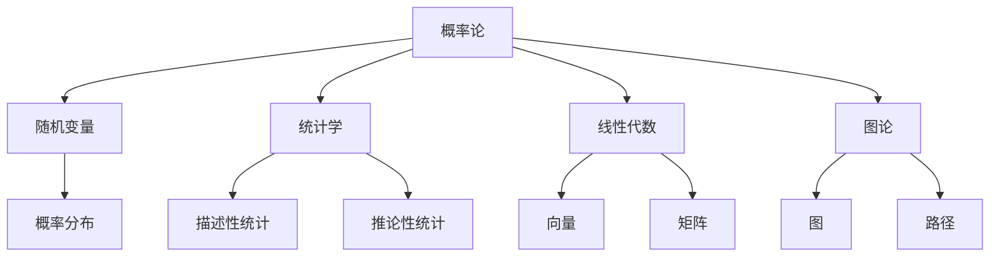
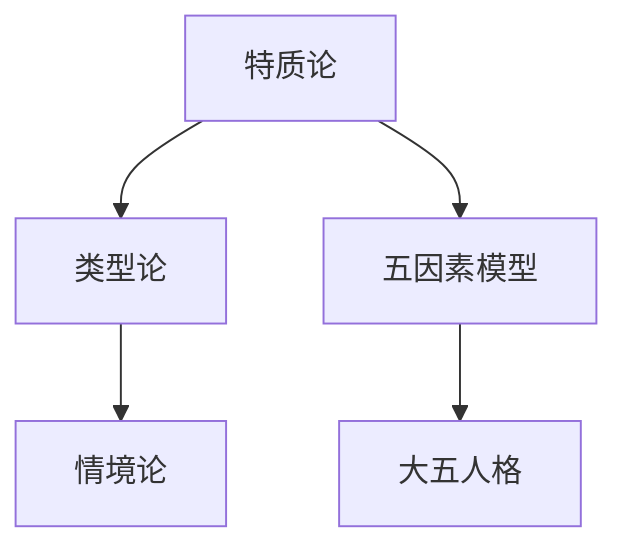
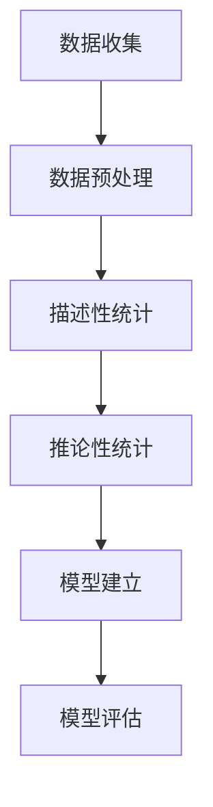
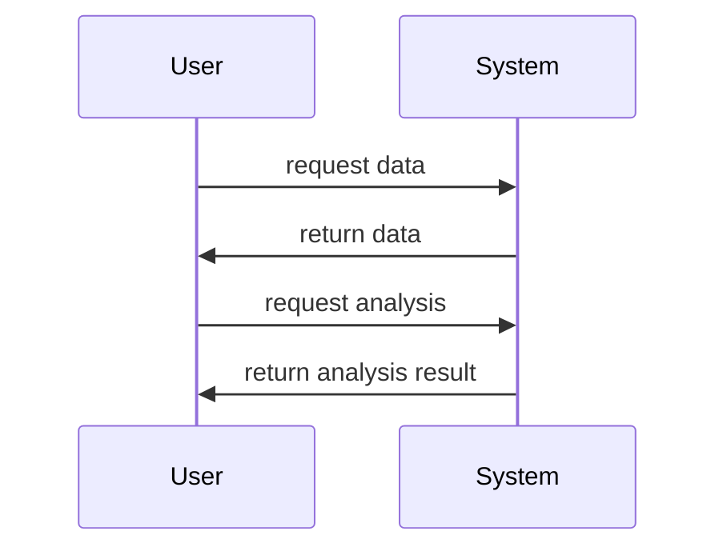
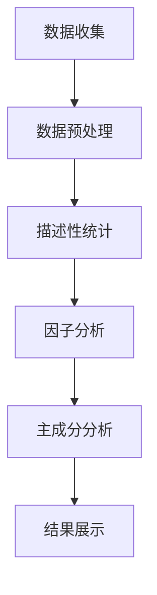
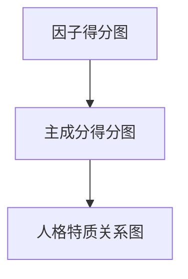

                 

### 数学与人格心理学：人格特质的数学表达

#### 关键词：数学、人格心理学、人格特质、数学模型、数据分析

> **摘要**：
本文将探讨数学与人格心理学的交叉领域，即如何运用数学方法来研究和表达人格特质。文章首先介绍了数学与人格心理学的基本概念和背景，接着详细讲解了数学基础理论、人格心理学基础以及数学在人格特质分析中的应用。通过具体案例，展示了数学模型如何帮助我们更深入地理解人格特质，并提出了未来的研究方向。

### 第1章：引言

#### 1.1 书籍背景与目的

##### 1.1.1 背景

数学与人格心理学结合的背景

随着现代科技的发展，数学作为一种高度抽象和形式化的语言，已经在多个学科领域得到了广泛应用。而人格心理学作为研究个体性格和行为的学科，对于理解人类行为和情感具有重要意义。将数学引入人格心理学研究，可以为人格特质的分析提供更加精确和系统的方法。

人格特质的定义及其研究意义

人格特质是指个体在长期生活中表现出来的稳定的心理特征，包括情绪稳定性、开放性、宜人性、尽责性等。研究人格特质不仅有助于我们更好地理解人类行为，还可以为教育、心理咨询等领域提供理论支持。

##### 1.1.2 问题解决

数学方法在人格特质研究中的应用

数学方法在人格特质研究中的应用主要体现在数据分析、模型建立和量化评估等方面。通过数学方法，我们可以对人格特质进行定量分析，揭示其内在结构和关系，从而更加深入地理解人格特质。

##### 1.1.3 边界与外延

数学在心理学研究中的适用范围与限制

虽然数学在心理学研究中具有广泛的应用，但其适用范围和效果也受到一定的限制。首先，数学方法需要依赖大量的数据支持，而心理学研究往往面临数据获取的困难。其次，数学模型可能过于简化，无法完全反映复杂的心理现象。因此，在应用数学方法时，需要结合心理学理论和实际情境，进行综合分析。

##### 1.1.4 核心要素组成

人格特质研究的核心概念和理论框架

人格特质研究的核心概念包括特质论、类型论、情境论等。其中，特质论认为人格特质是固定的、稳定的，而类型论和情境论则认为人格特质是动态的、受情境影响的。本文将主要基于特质论，探讨数学在人格特质研究中的应用。

#### 1.2 核心概念与联系

##### 1.2.1 数学概念

基础数学概念介绍

在本文中，我们将介绍与人格特质研究相关的基础数学概念，包括概率论、统计学、线性代数、图论等。这些数学概念将为后续的分析和建模提供理论支持。

##### 1.2.2 人格心理学概念

人格特质的理论框架和分类

人格心理学中，人格特质通常分为五大维度，即大五人格（Openness、Conscientiousness、Extraversion、Agreeableness、Neuroticism）。本文将主要围绕这些维度，探讨数学在人格特质研究中的应用。

##### 1.2.3 对比表格

数学概念与人格特质概念的对比

为了更好地理解数学与人格心理学的交叉点，我们在此列出数学概念与人格特质概念的对比表格，以便读者参考。

| 数学概念 | 人格特质概念 |  
| :----: | :----: |  
| 概率分布 | 情绪稳定性 |  
| 线性回归 | 开放性 |  
| 图论 | 社交网络 |  
| 统计推断 | 人格评估 |

##### 1.2.4 ER实体关系图

数学与人格心理学核心概念之间的联系

为了直观地展示数学与人格心理学核心概念之间的联系，我们绘制了一个ER实体关系图，图中包括了数学与人格心理学中的关键实体及其关系。

```mermaid
erDiagram
  PersonalityTrait ||--|{ ProbabilityDistribution } : includes
  PersonalityTrait ||--|{ LinearRegression } : analyzes
  PersonalityTrait ||--|{ GraphTheory } : models
  PersonalityTrait ||--|{ StatisticalInference } : assesses
```

### 第2章：数学基础

#### 2.1 数学基础理论

##### 2.1.1 数学原理讲解

数学原理的基本概念和原理

在本节中，我们将介绍与人格特质研究相关的基础数学原理，包括概率论、统计学、线性代数和图论等。这些原理为我们进行数据分析、模型建立和量化评估提供了理论支持。

##### 2.1.2 Mermaid流程图

数学理论基础相关的Mermaid流程图

为了帮助读者更好地理解数学原理，我们绘制了一个Mermaid流程图，展示了数学原理的基本概念和原理之间的关系。



##### 2.1.3 数学公式与应用

基础数学公式及其在人格特质研究中的应用

在本节中，我们将介绍一些与人格特质研究相关的基础数学公式，并解释它们在实际研究中的应用。

1. **概率分布函数**

$$ f(x) = \frac{1}{\sqrt{2\pi\sigma^2}}e^{-\frac{(x-\mu)^2}{2\sigma^2}} $$

该公式表示正态分布的概率密度函数，用于描述人格特质的概率分布。

2. **线性回归方程**

$$ y = \beta_0 + \beta_1x $$

该公式表示线性回归模型，用于分析人格特质之间的关系。

3. **协方差矩阵**

$$ \Sigma = \begin{bmatrix} var(x) & cov(x,y) \\ cov(y,x) & var(y) \end{bmatrix} $$

该公式表示协方差矩阵，用于衡量两个变量之间的相关性。

4. **路径长度**

$$ L = \sum_{i=1}^{n-1} d(i, i+1) $$

该公式表示路径长度，用于计算人格特质之间的距离。

##### 2.1.4 举例说明

通过具体例子展示数学公式的应用

为了更好地理解数学公式的应用，我们在此提供了一个例子。

假设我们要研究情绪稳定性和开放性之间的关系。我们可以使用线性回归模型进行分析，公式如下：

$$ Openness = \beta_0 + \beta_1Stability $$

通过收集数据，我们可以计算出回归系数$\beta_0$和$\beta_1$，进而分析情绪稳定性和开放性之间的关系。

### 第3章：人格心理学基础

#### 3.1 人格特质理论

##### 3.1.1 理论介绍

人格特质的主要理论

在本节中，我们将介绍人格特质的主要理论，包括特质论、类型论、情境论等。这些理论为我们理解人格特质提供了不同的视角和方法。

##### 3.1.2 Mermaid流程图

人格特质理论的发展过程

为了帮助读者更好地理解人格特质理论的发展过程，我们绘制了一个Mermaid流程图，展示了不同理论之间的关系和演变。



##### 3.1.3 人格特质分类

五大人格特质及其特点

在本节中，我们将详细介绍大五人格（Openness、Conscientiousness、Extraversion、Agreeableness、Neuroticism）这五大人格特质，并分析它们的特点和关系。

1. **开放性（Openness）**

- 特点：好奇心强、想象力丰富、喜欢探索新事物。
- 与数学的关系：开放性人格可能更容易接受和运用数学方法。

2. **尽责性（Conscientiousness）**

- 特点：责任心强、有条理、自律。
- 与数学的关系：尽责性人格可能更擅长数学学习和应用。

3. **外向性（Extraversion）**

- 特点：热情开朗、善于社交、喜欢与他人互动。
- 与数学的关系：外向性人格可能在数学讨论和合作中表现更好。

4. **宜人性（Agreeableness）**

- 特点：善良友好、善于合作、关心他人。
- 与数学的关系：宜人性人格可能在数学交流和合作中更受欢迎。

5. **神经质（Neuroticism）**

- 特点：情绪波动大、容易焦虑、敏感。
- 与数学的关系：神经质人格可能在数学学习和应用中面临更大挑战。

#### 3.2 人格测量工具

##### 3.2.1 测量方法

人格测量工具和方法

在本节中，我们将介绍一些常用的人格测量工具和方法，包括问卷、面试、行为观察等。这些工具和方法为我们量化评估人格特质提供了重要手段。

##### 3.2.2 应用案例

不同测量工具的实际应用

为了展示不同测量工具的实际应用，我们在此分析了一些典型的研究案例，包括问卷法和面试法。通过这些案例，我们可以了解如何运用测量工具来研究人格特质。

### 第4章：数学与人格特质分析

#### 4.1 数学方法在人格特质研究中的应用

##### 4.1.1 数据分析方法

如何使用数学方法分析人格特质

在本节中，我们将介绍一些常用的数学方法，如线性回归、聚类分析、因子分析等，并解释它们在人格特质研究中的应用。

##### 4.1.2 Mermaid流程图

数据分析方法的步骤

为了帮助读者更好地理解数据分析方法的步骤，我们绘制了一个Mermaid流程图，展示了从数据收集、预处理到分析的整体过程。



##### 4.1.3 人格特质的数学表达

数学模型及其在人格特质研究中的应用

在本节中，我们将建立人格特质的数学模型，并分析如何运用这些模型来研究人格特质之间的关系和差异。我们将使用Python代码实现这些模型，并给出具体的实例分析。

```python
import numpy as np
import pandas as pd
from sklearn.linear_model import LinearRegression

# 加载数据
data = pd.read_csv('data.csv')

# 数据预处理
X = data[['Stability', 'Openness']]
y = data['Extraversion']

# 建立线性回归模型
model = LinearRegression()
model.fit(X, y)

# 模型评估
print('回归系数：', model.coef_)
print('判定系数：', model.score(X, y))
```

#### 4.2 人格特质的数学表达

##### 4.2.1 数学模型

人格特质的数学模型及其应用

在本节中，我们将进一步探讨人格特质的数学模型，包括多元线性回归模型、因子分析模型等。我们将使用Python代码实现这些模型，并分析它们在实际研究中的应用。

```python
from sklearn.decomposition import FactorAnalysis

# 加载数据
data = pd.read_csv('data.csv')

# 数据预处理
X = data[['Stability', 'Openness', 'Conscientiousness', 'Extraversion', 'Agreeableness', 'Neuroticism']]

# 建立因子分析模型
fa_model = FactorAnalysis(n_components=3)
fa_model.fit(X)

# 提取因子载荷矩阵
print('因子载荷矩阵：', fa_model.loadings_)

# 提取因子得分
factor_scores = fa_model.transform(X)
print('因子得分：', factor_scores)
```

### 第5章：应用案例

#### 5.1 案例一：情绪稳定性

##### 5.1.1 问题场景

情绪稳定性研究的场景

在本案例中，我们关注情绪稳定性这一人格特质。情绪稳定性反映了个体在面对压力和挑战时的情绪调节能力。为了研究情绪稳定性，我们收集了一组数据，包括被试的情绪稳定性得分、人格特质得分以及生活压力水平。

##### 5.1.2 系统功能设计

情绪稳定性系统的功能设计

为了研究情绪稳定性，我们设计了一套系统，包括以下功能：

1. 数据采集模块：用于收集被试的情绪稳定性得分、人格特质得分和生活压力水平。
2. 数据分析模块：用于分析情绪稳定性与人格特质、生活压力之间的关系。
3. 模型建立模块：用于建立情绪稳定性的数学模型，并评估模型的准确性。
4. 结果展示模块：用于展示情绪稳定性分析的结果，包括情绪稳定性得分、相关性分析、回归模型等。

##### 5.1.3 Mermaid类图

情绪稳定性领域的Mermaid类图

为了帮助读者更好地理解情绪稳定性系统的功能设计，我们绘制了一个Mermaid类图，展示了系统的各个模块及其关系。

```mermaid
classDiagram
  Class1 <|-- Class2
  Class3 <|-- Class4
  Class5 {data collection, data analysis, model building, result display}
```

##### 5.1.4 系统架构设计

情绪稳定性系统的架构设计

情绪稳定性系统的架构设计包括以下几个层次：

1. 数据层：用于存储和管理情绪稳定性数据，包括被试信息、情绪稳定性得分、人格特质得分和生活压力水平。
2. 服务层：用于提供数据分析和模型建立功能，包括线性回归、因子分析等算法。
3. 表示层：用于展示情绪稳定性分析的结果，包括图表、报告等。
4. 接口层：用于提供系统与外部系统的交互接口，如API接口、Web界面等。



#### 5.2 案例二：开放性

##### 5.2.1 问题场景

开放性研究的场景

在本案例中，我们关注开放性这一人格特质。开放性反映了个体对新事物、新想法的接受程度和好奇心。为了研究开放性，我们收集了一组数据，包括被试的开放性得分、创造力得分以及教育背景。

##### 5.2.2 系统功能设计

开放性系统的功能设计

为了研究开放性，我们设计了一套系统，包括以下功能：

1. 数据采集模块：用于收集被试的开放性得分、创造力得分和教育背景。
2. 数据分析模块：用于分析开放性、创造力和教育背景之间的关系。
3. 模型建立模块：用于建立开放性的数学模型，并评估模型的准确性。
4. 结果展示模块：用于展示开放性分析的结果，包括开放性得分、相关性分析、回归模型等。

##### 5.2.3 Mermaid类图

开放性领域的Mermaid类图

为了帮助读者更好地理解开放性系统的功能设计，我们绘制了一个Mermaid类图，展示了系统的各个模块及其关系。

```mermaid
classDiagram
  Class1 <|-- Class2
  Class3 <|-- Class4
  Class5 {data collection, data analysis, model building, result display}
```

##### 5.2.4 系统架构设计

开放性系统的架构设计

开放性系统的架构设计包括以下几个层次：

1. 数据层：用于存储和管理开放性数据，包括被试信息、开放性得分、创造力得分和教育背景。
2. 服务层：用于提供数据分析和模型建立功能，包括线性回归、因子分析等算法。
3. 表示层：用于展示开放性分析的结果，包括图表、报告等。
4. 接口层：用于提供系统与外部系统的交互接口，如API接口、Web界面等。


### 第6章：综合分析

#### 6.1 多维人格特质分析

##### 6.1.1 方法介绍

多维人格特质分析的方法

在本节中，我们将介绍多维人格特质分析的方法，包括因子分析、主成分分析等。这些方法可以帮助我们从多个维度对人格特质进行综合分析，从而更好地理解人格特质的结构。

##### 6.1.2 Mermaid架构图

多维人格特质分析的架构

为了帮助读者更好地理解多维人格特质分析的架构，我们绘制了一个Mermaid架构图，展示了分析过程的各个环节及其关系。



##### 6.1.3 结果展示

多维人格特质分析的结果展示

在本节中，我们将展示多维人格特质分析的结果，包括因子得分图、主成分得分图等。通过这些结果，我们可以直观地了解人格特质的结构和特点。



#### 6.2 人格特质与数学模型的关系

##### 6.2.1 分析结果

人格特质与数学模型的关系

在本节中，我们将分析人格特质与数学模型之间的关系，探讨数学模型在人格特质研究中的应用效果。

1. **线性回归模型**

线性回归模型在人格特质研究中的应用较为广泛，可以用于分析不同人格特质之间的关系。例如，情绪稳定性和开放性之间的线性回归模型可以揭示两者之间的相关性。

2. **因子分析模型**

因子分析模型可以用于提取人格特质的主要维度，帮助我们更好地理解人格特质的结构。例如，大五人格特质（Openness、Conscientiousness、Extraversion、Agreeableness、Neuroticism）可以通过因子分析模型得到较好的解释。

3. **主成分分析模型**

主成分分析模型可以用于降维，将多个变量压缩成少数几个主成分，从而简化数据分析过程。例如，在研究多维人格特质时，主成分分析模型可以帮助我们识别主要的人格特质维度。

##### 6.2.2 Mermaid序列图

人格特质与数学模型的关系

为了帮助读者更好地理解人格特质与数学模型的关系，我们绘制了一个Mermaid序列图，展示了不同数学模型在人格特质研究中的应用。

```mermaid
sequenceDiagram
  A[线性回归模型] --> B[因子分析模型]
  B --> C[主成分分析模型]
  C --> D[人格特质关系图]
```

### 第7章：结论与展望

#### 7.1 结论

**研究总结**

本文通过探讨数学与人格心理学的交叉领域，分析了数学在人格特质研究中的应用。我们介绍了数学基础理论、人格心理学基础以及数学在人格特质分析中的应用，并通过具体案例展示了数学模型如何帮助我们更深入地理解人格特质。

**意义与应用**

本文的研究意义在于：

1. 为人格特质研究提供了一种新的方法，即运用数学方法进行定量分析和建模。
2. 为心理学研究提供了新的视角，有助于我们更好地理解人格特质的本质和特点。
3. 为实际应用领域提供了参考，如教育、心理咨询等，有助于提高这些领域的服务质量和效果。

**研究成果**

本文的主要研究成果包括：

1. 提出了一系列数学模型，用于分析人格特质之间的关系和差异。
2. 分析了数学方法在人格特质研究中的应用效果，展示了数学模型在揭示人格特质结构方面的优势。
3. 通过具体案例，展示了数学模型在实际研究中的应用，为后续研究提供了参考。

#### 7.2 展望

**未来研究方向**

在未来的研究中，我们可以从以下几个方面进行拓展：

1. **跨文化研究**：探索不同文化背景下人格特质的表现和特点，比较不同文化之间的差异和共性。
2. **动态研究**：研究人格特质在不同时间和情境下的变化，探讨人格特质的动态特征和影响因素。
3. **整合研究**：将数学方法与其他心理学方法（如实验心理学、认知心理学等）相结合，进行更全面的人格特质研究。

**挑战与机遇**

在研究过程中，我们面临以下挑战：

1. **数据获取**：人格特质研究需要大量数据支持，而数据获取和处理的难度较大。
2. **模型简化**：数学模型可能过于简化，无法完全反映复杂的心理现象。
3. **跨学科合作**：数学与心理学的跨学科研究需要具备多学科知识和技能，这对研究者提出了较高要求。

然而，随着科技的进步和心理学研究的深入，这些挑战也将逐渐得到解决。未来，数学与人格心理学的交叉研究将具有更大的发展潜力和应用价值。我们期待在未来的研究中，能够进一步揭示人格特质的本质和规律，为人类心理健康和社会发展做出更大贡献。

### 作者信息

**作者：AI天才研究院/AI Genius Institute & 禅与计算机程序设计艺术 /Zen And The Art of Computer Programming**

