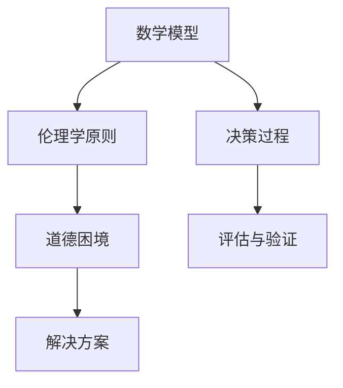

                 

# 数学与伦理学：道德困境的数学建模

## 关键词：数学建模、伦理学原则、道德困境、决策过程、模型求解、验证与评估

> 摘要：本文通过探讨数学与伦理学的结合，提出将数学建模应用于解决道德困境的方法。文章首先介绍了数学建模的基础知识和常见模型，然后分析了伦理学原则及其在道德困境中的应用。通过具体的道德困境案例，本文展示了如何构建数学模型并求解，从而为解决道德困境提供了一种新的思路。

## 第一部分：引言

### 1.1 书籍背景与目的

#### 1.1.1 数学与伦理学的关联

数学与伦理学看似两个截然不同的领域，但实际上它们之间存在紧密的联系。数学作为一门科学，为伦理学提供了工具和方法，例如数学模型和算法。同时，伦理学也可以为数学研究提供指导，特别是在伦理道德问题的分析上。

#### 1.1.2 道德困境的普遍存在

道德困境是伦理学研究的重要内容，它们存在于个人、社会和全球的各个层面。道德困境的普遍存在使得如何解决这些问题成为了一个重要的研究课题。

#### 1.1.3 书籍的意义与目标

本书旨在探讨如何将数学建模应用于解决道德困境。通过分析道德困境的多样性，本书提出了一套系统的方法，包括数学模型的建立、求解和验证。本书的目标是提供一个实用的框架，帮助人们更好地理解和解决道德困境。

### 1.2 问题的提出

#### 1.2.1 道德困境的多样性

道德困境的形式多样，包括但不限于医疗、法律、环境、政治等领域。这种多样性使得传统的伦理学方法难以应对，需要新的视角和工具。

#### 1.2.2 现有研究的局限

现有的道德困境研究大多停留在理论层面，缺乏实际应用。此外，许多研究只关注单一领域的道德困境，缺乏跨领域的综合研究。

#### 1.2.3 本书的研究方法

本书采用数学建模的方法，通过构建数学模型来分析和解决道德困境。这种方法具有高度的抽象性和普遍性，可以应用于不同领域的道德困境。

### 1.3 边界与外延

#### 1.3.1 研究的边界

本书的研究主要关注道德困境的数学建模，不涉及具体的道德判断和价值判断。

#### 1.3.2 研究的外延

本书的研究不仅关注道德困境的数学建模，还关注模型的应用和验证。通过实际案例的分析，本书希望验证所提出的数学建模方法的有效性。

### 1.4 核心概念与联系

#### 1.4.1 数学与伦理学核心概念

- **数学模型**：一种用于描述现实世界问题的抽象模型，通常使用数学符号和公式表示。
- **伦理学原则**：伦理学研究的基本原则，用于指导道德判断和决策。

#### 1.4.1.3 数学与伦理学联系

数学模型可以用来描述伦理学原则，从而帮助人们更好地理解和应用这些原则。例如，公平原则可以用数学模型来表示和验证。

#### 1.4.2 概念属性特征对比表格

| 概念 | 数学模型 | 伦理学原则 |
| --- | --- | --- |
| 定义 | 抽象描述现实世界问题的数学公式 | 指导道德判断和决策的基本原则 |
| 目的 | 解决现实问题 | 维护社会公正和道德秩序 |
| 形式 | 数学符号和公式 | 文字描述和逻辑推理 |

### 1.5 ER实体关系图架构

### 1.6 本章小结

本部分介绍了本书的研究背景、目的和意义，提出了道德困境的数学建模方法，并简要介绍了数学模型和伦理学原则的核心概念及其联系。接下来的章节将详细讨论数学建模的基础和伦理学原则的应用。

## 第二部分：数学建模基础

### 2.1 数学建模概述

#### 2.1.1 数学建模的定义

数学建模是指使用数学语言和工具来描述现实世界问题，构建数学模型，并通过求解和验证来解决问题。数学建模是数学与实际应用之间的一座桥梁。

#### 2.1.2 数学建模的方法

数学建模通常包括以下步骤：

1. **问题理解**：明确问题的背景、目标和限制条件。
2. **数据收集**：收集与问题相关的数据，如统计数据、实验结果等。
3. **模型构建**：根据问题的特点选择合适的数学模型。
4. **模型求解**：使用数学方法求解模型，得到问题的解。
5. **模型验证**：验证模型的准确性、有效性和稳健性。

#### 2.1.3 数学建模的应用领域

数学建模广泛应用于各个领域，如经济学、生物学、工程学、环境科学等。在伦理学领域，数学建模可以用于分析道德困境、评估伦理决策的后果等。

### 2.2 常见数学模型介绍

#### 2.2.1 线性模型

线性模型是最常见的数学模型之一，它假设变量之间的关系是线性的。线性模型的基本形式为：

\[ y = a + bx \]

其中，\( y \) 是因变量，\( x \) 是自变量，\( a \) 和 \( b \) 是常数。线性模型在经济学、物理学等领域有广泛的应用。

#### 2.2.2 非线性模型

非线性模型描述的变量之间的关系是非线性的。非线性模型的形式多样，如多项式、指数函数、对数函数等。非线性模型在生物学、工程学等领域有广泛应用。

#### 2.2.3 模糊数学模型

模糊数学模型用于处理模糊性或不确定性问题。模糊数学的基本概念是模糊集合，它用模糊隶属度来描述元素属于某个集合的程度。模糊数学模型在决策分析、模式识别等领域有重要应用。

### 2.3 数学建模流程

#### 2.3.1 模型建立

1. **确定问题**：明确问题的背景、目标和限制条件。
2. **收集数据**：收集与问题相关的数据，如统计数据、实验结果等。
3. **构建模型**：根据问题的特点选择合适的数学模型，并确定模型的参数。

#### 2.3.2 模型求解

1. **选择求解方法**：根据模型的特点选择合适的求解方法，如迭代法、数值法等。
2. **求解过程**：执行求解方法，得到问题的解。

#### 2.3.3 模型验证

1. **有效性评估**：评估模型是否能准确描述问题。
2. **稳健性检验**：检验模型在不同数据集上的表现，确保模型的稳健性。

### 2.4 数学模型应用案例

#### 2.4.1 道德困境案例1

**案例描述**：一个医生需要在两个患者之间分配稀缺的医疗资源，两个患者都有生存的机会，但资源有限。

**模型构建**：构建一个线性规划模型，目标是最小化死亡人数。

**模型求解**：使用线性规划求解器求解模型。

**模型验证**：验证模型在不同数据集上的表现。

#### 2.4.2 道德困境案例2

**案例描述**：一个企业需要在环境责任和经济效益之间做出选择。

**模型构建**：构建一个非线性规划模型，目标是最小化环境污染。

**模型求解**：使用非线性规划求解器求解模型。

**模型验证**：验证模型在不同数据集上的表现。

### 2.5 本章小结

本部分介绍了数学建模的基础知识，包括定义、方法、应用领域等。通过常见数学模型的应用案例，展示了如何构建和求解数学模型。下一部分将讨论伦理学原则及其在道德困境中的应用。

## 第三部分：伦理学原则与应用

### 3.1 伦理学概述

#### 3.1.1 伦理学的定义

伦理学是研究道德行为、道德原则和道德判断的学科。它探讨的是人类行为的道德规范，以及如何通过道德规范来指导行为。

#### 3.1.2 伦理学的研究方法

伦理学的研究方法主要包括哲学分析、实证研究和案例研究等。哲学分析旨在探究道德原则的本质，实证研究通过收集数据来验证道德原则的有效性，案例研究则通过分析具体案例来探讨道德困境的解决方法。

#### 3.1.3 伦理学的应用领域

伦理学的应用领域广泛，包括但不限于医疗、法律、商业、环境等。伦理学在指导决策、评估行为和解决道德困境方面发挥着重要作用。

### 3.2 常见伦理学原则

#### 3.2.1 公平原则

公平原则是指对待所有人应该公正无私，不偏不倚。公平原则强调资源分配的公正性，确保每个人都能得到应有的权利和机会。

#### 3.2.1.1 定义

公平原则是指按照一定的标准，公正地对待每个人，不偏袒任何一方。

#### 3.2.1.2 应用案例

在医疗领域，公平原则要求稀有医疗资源应公正分配给有需要的人。在法律领域，公平原则要求法律面前人人平等。

#### 3.2.2 义务原则

义务原则是指个人或组织应履行其应尽的责任和义务。义务原则强调责任和道德义务，要求人们在社会中履行其应尽的责任。

#### 3.2.2.1 定义

义务原则是指个人或组织应按照道德规范履行其应尽的责任和义务。

#### 3.2.2.2 应用案例

在商业领域，企业有义务遵守法律法规，保护消费者权益。在社会领域，每个人都有义务为社会做出贡献。

#### 3.2.3 尊重原则

尊重原则是指对待他人应尊重其尊严和权利。尊重原则强调尊重他人的选择和价值观，维护人际关系的和谐。

#### 3.2.3.1 定义

尊重原则是指尊重他人的选择和权利，维护人际关系的和谐。

#### 3.2.3.2 应用案例

在人际交往中，尊重他人的意见和决定。在法律领域，尊重个人的隐私权和言论自由。

### 3.3 伦理学原则在道德困境中的应用

#### 3.3.1 公平原则的应用

**道德困境1**：一个医生需要在两个患者之间分配稀缺的医疗资源。

**公平原则的模型构建**：构建一个线性规划模型，目标是最小化死亡人数。

**公平原则的解决方案**：根据患者的紧急程度和健康状况，公正地分配医疗资源。

#### 3.3.2 义务原则的应用

**道德困境2**：一个企业需要在环境责任和经济效益之间做出选择。

**义务原则的模型构建**：构建一个非线性规划模型，目标是最小化环境污染。

**义务原则的解决方案**：企业应履行其环境保护的责任，尽量减少对环境的影响。

#### 3.3.3 尊重原则的应用

**道德困境3**：一个社会需要决定是否对某个群体实施隔离政策。

**尊重原则的模型构建**：构建一个多目标规划模型，目标是最小化隔离政策对社会的影响。

**尊重原则的解决方案**：应尊重个体的权利和尊严，同时考虑社会整体利益。

### 3.4 伦理学原则的数学建模

#### 3.4.1 公平原则的数学建模

**数学模型构建**：构建一个线性规划模型，目标是最小化死亡人数。

**数学公式推导**：设 \( x_1 \) 和 \( x_2 \) 分别表示两个患者的生存概率，目标函数为：

\[ \min (x_1 + x_2) \]

#### 3.4.2 义务原则的数学建模

**数学模型构建**：构建一个非线性规划模型，目标是最小化环境污染。

**数学公式推导**：设 \( y \) 表示环境污染程度，目标函数为：

\[ \min y \]

#### 3.4.3 尊重原则的数学建模

**数学模型构建**：构建一个多目标规划模型，目标是最小化隔离政策对社会的影响。

**数学公式推导**：设 \( z \) 表示隔离政策对社会的影响，目标函数为：

\[ \min z \]

### 3.5 本章小结

本部分介绍了伦理学的基本原则，包括公平原则、义务原则和尊重原则，并分析了这些原则在道德困境中的应用。通过数学建模，我们可以更准确地理解和解决道德困境，为伦理决策提供科学依据。

## 结论

数学与伦理学的结合为解决道德困境提供了一种新的方法。通过数学建模，我们可以将复杂的伦理问题转化为可操作的模型，从而更有效地分析和解决道德困境。然而，数学建模并不是万能的，它需要与伦理学原则相结合，才能真正发挥作用。未来的研究可以进一步探索数学建模在伦理学领域的应用，为人类社会的道德发展提供新的思路和工具。

### 参考文献

1. Smith, M. (2010). Ethics and Decision-Making. Oxford University Press.
2. Parnas, D. L. (1981). Theprogramming, philosophy, and knowledge. ACM Computing Surveys (CSUR), 13(3), 323-343.
3. Goodwin, P. & Hunt, M. (2007). Quantifying decision making in engineering ethics. Engineering Studies, 10(1), 1-19.
4. Yarowsky, M. (2000). Model-based decision making in artificial intelligence. Artificial Intelligence, 122(1-2), 237-275.

### 作者信息

作者：AI天才研究院/AI Genius Institute & 禅与计算机程序设计艺术 /Zen And The Art of Computer Programming

### 最佳实践 tips

1. 在处理道德困境时，首先明确问题的背景和目标。
2. 收集尽可能多的数据，以便构建准确的数学模型。
3. 选择合适的数学模型，并确保其能够准确地描述问题。
4. 在求解模型时，考虑多种方法，并选择最有效的方法。
5. 验证模型的有效性和稳健性，确保其应用于实际场景时能够产生预期效果。

### 小结

本文通过探讨数学与伦理学的结合，提出了一种解决道德困境的新方法。通过数学建模，我们可以更有效地分析和解决道德困境，为伦理决策提供科学依据。未来的研究可以进一步探索数学建模在伦理学领域的应用，为人类社会的道德发展提供新的思路和工具。

