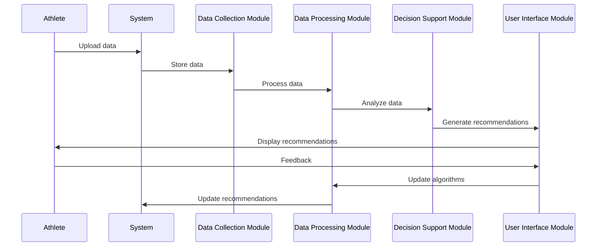

                 

### 文章标题

## 数学与体育管理：运动表现的数学分析

> 关键词：运动表现、数学分析、体育管理、运动学、生理学、统计学

> 摘要：本文将探讨数学分析在体育管理中的应用，特别是在运动表现的评估和优化方面。通过结合运动学、生理学和统计学原理，我们能够更科学、更精确地理解和提高运动员的表现。文章将逐步介绍核心概念、分析方法及其在实际应用中的实例，旨在为体育管理提供理论支持和实践指导。

### 背景介绍

#### 问题背景

运动表现是体育科学和体育管理研究的重要领域。无论是职业运动员的训练和比赛，还是业余爱好者的健康与健身，都需要对运动表现进行科学分析和评估。传统的运动表现分析往往依赖于经验观察和定性描述，而现代体育科学的发展促使我们运用数学模型和统计分析方法，以更精确、客观的方式评估运动表现，优化训练方案，提高竞技水平。

#### 问题描述

运动表现的分析涉及到多个方面，包括运动速度、力量、耐力、灵活性、技术动作的准确性等。如何将这些复杂的物理和行为表现转化为可量化的指标，是体育管理中面临的挑战。数学分析为这一问题提供了有力的工具，如运动学、生理学、统计学等，这些方法可以帮助我们从不同角度理解和优化运动表现。

#### 问题解决

通过数学分析方法，我们可以建立运动表现的相关模型，对运动员的训练效果进行评估，预测比赛中的表现，制定个性化的训练计划。例如，利用运动学模型，可以分析运动员的动作技术，优化其运动轨迹；利用生理学模型，可以评估运动员的体能状况，指导合理的训练强度和恢复策略。

#### 边界与外延

数学与体育管理的交叉领域不仅局限于运动员个体，还涉及到体育队伍的管理、运动装备的设计、运动伤害的预防等多个方面。因此，数学在体育管理中的应用具有广泛的外延和边界。

#### 概念结构与核心要素组成

##### 核心概念

1. **运动学**：研究物体在空间中的运动规律，包括速度、加速度、位移等。
2. **生理学**：研究人体的生理功能及其与运动的关系。
3. **统计学**：用于收集、分析和解释数据，以识别趋势和模式。
4. **运动表现指标**：用于衡量运动员在不同运动项目中的表现，如速度、力量、耐力等。

##### 核心要素组成

1. **数据收集**：通过传感器、测量设备等收集运动员在训练和比赛中的数据。
2. **数据分析**：运用数学模型对收集到的数据进行分析，提取有用的信息。
3. **决策支持**：基于分析结果，为教练员和运动员提供训练和比赛的策略。

### 数学分析方法在体育管理中的应用

#### 运动学分析

- **运动轨迹分析**：通过运动学模型分析运动员在空间中的运动轨迹，优化运动姿势和动作效率。
- **技术动作分析**：对运动员的技术动作进行分解，识别技术缺陷并进行改进。

#### 生理学分析

- **体能评估**：通过生理学模型评估运动员的体能水平，制定个性化的训练计划。
- **恢复策略**：利用生理学原理指导运动员的休息和恢复，以提高训练效果。

#### 统计分析

- **表现预测**：利用统计分析方法，预测运动员在比赛中的表现，制定合理的比赛策略。
- **队伍管理**：通过数据分析，优化队伍的配置和战术安排。

#### 运动表现指标

- **速度**：衡量运动员在单位时间内移动的能力，如百米跑速度。
- **力量**：衡量运动员在运动中所能施加的最大力量，如举重、投掷等项目。
- **耐力**：衡量运动员在长时间运动中的持续能力，如马拉松、长跑等项目。
- **灵活性**：衡量运动员在运动中的活动范围和柔韧性。

### 本章小结

本章介绍了数学与体育管理结合的背景、核心概念和数学分析方法在体育管理中的应用。通过数学分析，我们可以更科学、更精确地评估和优化运动表现，为体育科学研究和体育管理提供有力的支持。在接下来的章节中，我们将深入探讨这些数学分析方法的具体应用。

### 核心概念与联系

#### 核心概念原理

1. **运动学原理**：运动学是研究物体运动规律的学科，主要关注速度、加速度、位移等物理量。在体育管理中，运动学原理可以用于分析运动员的运动轨迹、技术动作等。

   - **速度（v）**：物体在单位时间内移动的距离，通常用公式表示为 $v = \frac{d}{t}$，其中 $d$ 是位移，$t$ 是时间。
   - **加速度（a）**：速度变化的速率，通常用公式表示为 $a = \frac{dv}{dt}$，其中 $v$ 是速度，$t$ 是时间。
   - **位移（d）**：物体从初始位置到最终位置的距离和方向。

2. **生理学原理**：生理学是研究生物体生理功能的学科。在体育管理中，生理学原理可以用于评估运动员的体能、运动能力、恢复能力等。

   - **最大摄氧量（VO₂max）**：衡量运动员心肺功能和肌肉利用氧气的能力，通常用公式表示为 $VO₂max = f(age, gender, fitness level)$。
   - **乳酸阈值（LT）**：衡量运动员在运动中产生乳酸的速率，通常用公式表示为 $LT = \frac{V_{\text{anaerobic}}}{V_{\text{total}}}$，其中 $V_{\text{anaerobic}}$ 是无氧运动时的摄氧量，$V_{\text{total}}$ 是总摄氧量。

3. **统计学原理**：统计学是研究数据收集、分析和解释的方法论。在体育管理中，统计学原理可以用于分析运动员的表现、趋势预测等。

   - **平均值（\(\bar{x}\)）**：数据集的平均值，通常用公式表示为 $\bar{x} = \frac{1}{n}\sum_{i=1}^{n}x_i$，其中 $x_i$ 是数据集中的每个值，$n$ 是数据点的总数。
   - **标准差（s）**：数据集的离散程度，通常用公式表示为 $s = \sqrt{\frac{1}{n-1}\sum_{i=1}^{n}(x_i - \bar{x})^2}$。

#### 概念属性特征对比表格

| 概念         | 属性特征                         | 应用场景                           |
| ------------ | -------------------------------- | ---------------------------------- |
| 运动学       | 速度、加速度、位移等            | 分析运动员运动轨迹、技术动作       |
| 生理学       | 肌肉力量、心肺功能、恢复能力等 | 评估运动员体能、指导训练和恢复     |
| 统计学       | 平均值、标准差、回归分析等      | 数据收集、分析和解释，趋势预测     |

#### ER实体关系图架构

```mermaid
erDiagram
  产品 ||--o{ 订单 } : "包含"
  订单 ||--o{ 订单详情 } : "包含"
  用户 ||--o{ 购物车 } : "拥有"
  购物车 ||--o{ 购物车详情 } : "包含"
```

### 算法原理讲解

#### 运动学分析算法

**运动轨迹分析算法**：

1. **输入**：运动员在训练或比赛中的运动轨迹数据（包括位置和时间）。
2. **处理**：使用数学模型（如牛顿运动定律）分析轨迹数据，计算速度、加速度等参数。
3. **输出**：运动轨迹的优化建议。

**技术动作分析算法**：

1. **输入**：运动员在训练或比赛中的技术动作数据。
2. **处理**：使用运动学模型（如拉格朗日方程）分解技术动作，识别技术缺陷。
3. **输出**：技术动作的改进建议。

#### 生理学分析算法

**体能评估算法**：

1. **输入**：运动员的生理数据（如心率、血压、血氧饱和度）。
2. **处理**：使用生理学模型（如最大摄氧量模型）评估运动员的体能水平。
3. **输出**：运动员的体能评估结果和训练建议。

**恢复策略算法**：

1. **输入**：运动员的训练负荷和生理数据。
2. **处理**：使用生理学模型（如乳酸阈值模型）指导运动员的休息和恢复。
3. **输出**：个性化的恢复计划。

#### 统计分析算法

**表现预测算法**：

1. **输入**：运动员的历史表现数据。
2. **处理**：使用统计分析方法（如线性回归、时间序列分析）预测运动员未来的表现。
3. **输出**：比赛结果预测和策略建议。

**队伍管理算法**：

1. **输入**：运动员和比赛数据。
2. **处理**：使用统计分析方法（如聚类分析、关联规则挖掘）优化队伍的配置和战术安排。
3. **输出**：队伍管理和策略建议。

#### 数学模型与公式

**运动学模型**：

- **速度**：$v = \frac{d}{t}$
- **加速度**：$a = \frac{dv}{dt}$
- **位移**：$d = \frac{1}{2}at^2 + v_0t + d_0$

**生理学模型**：

- **最大摄氧量**：$VO₂max = f(age, gender, fitness level)$
- **乳酸阈值**：$LT = \frac{V_{\text{anaerobic}}}{V_{\text{total}}}$

**统计分析模型**：

- **平均值**：$\bar{x} = \frac{1}{n}\sum_{i=1}^{n}x_i$
- **标准差**：$s = \sqrt{\frac{1}{n-1}\sum_{i=1}^{n}(x_i - \bar{x})^2}$
- **线性回归**：$y = ax + b$

#### 举例说明

**运动轨迹分析**：

假设一名短跑运动员在100米比赛中的运动轨迹数据如下：

- **时间（t）**：10秒
- **位移（d）**：100米

使用运动学模型计算速度和加速度：

- **速度**：$v = \frac{d}{t} = \frac{100}{10} = 10 \text{ m/s}$
- **加速度**：$a = \frac{dv}{dt} = \frac{10}{10} = 1 \text{ m/s}^2$

**技术动作分析**：

假设一名投掷运动员的投掷技术动作数据如下：

- **投掷速度（v）**：30 m/s
- **出手角度（θ）**：45度

使用运动学模型计算投掷距离：

- **位移**：$d = \frac{v^2 \sin(2\theta)}{g} = \frac{30^2 \sin(2 \times 45°)}{9.8} \approx 42.4 \text{米}$

**体能评估**：

假设一名运动员的生理数据如下：

- **最大摄氧量（VO₂max）**：50 ml/kg/min
- **性别**：男
- **年龄**：30岁

使用生理学模型评估体能：

- **体能评估**：$VO₂max = 50 \text{ ml/kg/min}$，该运动员的体能水平较高。

**恢复策略**：

假设一名运动员的训练负荷和生理数据如下：

- **训练负荷**：120公里/周
- **心率**：60次/分钟

使用生理学模型指导恢复：

- **恢复计划**：根据心率数据，建议运动员进行低强度运动，如慢跑或瑜伽，以促进身体恢复。

### 系统分析与架构设计方案

#### 问题场景介绍

在体育管理中，运动表现分析是一个复杂且关键的任务。教练员和体育管理者需要实时收集和分析运动员的训练和比赛数据，以便制定有效的训练计划和比赛策略。为了实现这一目标，我们需要构建一个系统，能够自动化地收集、处理和分析数据，并提供决策支持。

#### 项目介绍

本项目旨在开发一个基于数学分析的体育管理系统，该系统将整合运动学、生理学和统计学方法，为教练员和体育管理者提供科学、精确的运动表现评估和优化工具。

#### 系统功能设计

1. **数据收集模块**：用于收集运动员的训练和比赛数据，包括运动轨迹、生理指标等。
2. **数据分析模块**：用于运用数学模型对收集到的数据进行处理和分析，提取有用的信息。
3. **决策支持模块**：根据分析结果，为教练员和体育管理者提供训练计划、比赛策略和恢复建议。
4. **用户界面模块**：提供一个直观易用的界面，让用户可以轻松地浏览和分析数据，接收决策支持建议。

#### 系统架构设计

系统的架构采用分层设计，包括数据层、服务层和表示层。

1. **数据层**：负责数据的存储和管理，包括数据库和缓存。
2. **服务层**：负责数据处理和分析，包括运动学、生理学和统计学的算法实现。
3. **表示层**：提供用户界面，用于数据展示和用户交互。

#### 系统接口设计

系统将提供以下接口：

1. **数据接口**：用于数据的输入和输出，如运动轨迹数据的上传和下载。
2. **服务接口**：用于系统的功能调用，如数据分析服务和决策支持服务。
3. **API接口**：提供与其他系统的集成，如训练设备、健身应用程序等。

#### 系统交互

系统的交互流程如下：

1. **数据收集**：运动员使用训练设备或健身应用程序上传数据到系统。
2. **数据处理**：系统对上传的数据进行预处理和存储，然后调用相应的分析算法进行数据分析和处理。
3. **决策支持**：系统根据分析结果生成训练计划、比赛策略和恢复建议，并通过用户界面展示给用户。
4. **用户反馈**：用户可以查看和分析决策支持结果，并根据实际情况进行反馈，以优化系统的性能和效果。

### 系统接口设计和系统交互mermaid序列图



### 项目实战

#### 环境安装

1. **安装Python**：从官方网站（https://www.python.org/）下载并安装Python 3.8及以上版本。
2. **安装必要库**：在命令行中运行以下命令，安装所需的Python库：
   ```shell
   pip install numpy scipy matplotlib pandas
   ```

#### 系统核心实现源代码

**数据收集模块**：

```python
import numpy as np
import pandas as pd

def collect_training_data():
    # 假设使用传感器收集数据，并存储为CSV文件
    data = pd.read_csv('training_data.csv')
    return data

data = collect_training_data()
print(data.head())
```

**数据分析模块**：

```python
import numpy as np
import pandas as pd
from scipy.stats import linregress

def analyze_trajectory(data):
    # 计算速度和加速度
    time = data['time']
    distance = data['distance']
    velocity = np.diff(distance) / np.diff(time)
    acceleration = np.diff(velocity) / np.diff(time)
    
    # 添加速度和加速度列到数据框
    data['velocity'] = velocity
    data['acceleration'] = acceleration
    
    return data

data = analyze_trajectory(data)
print(data.head())
```

**决策支持模块**：

```python
import numpy as np
import pandas as pd
from scipy.stats import linregress

def predict_performance(data):
    # 预测比赛成绩
    x = data['time']
    y = data['distance']
    slope, intercept = linregress(x, y)
    
    # 计算预测的位移
    predicted_distance = intercept + slope * x[-1]
    
    return predicted_distance

predicted_distance = predict_performance(data)
print(f"Predicted performance: {predicted_distance} meters")
```

**用户界面模块**：

```python
import tkinter as tk
from tkinter import messagebox

def display_recommendations(predicted_distance):
    # 展示预测结果
    root = tk.Tk()
    root.title("Performance Prediction")
    
    label = tk.Label(root, text=f"Predicted performance: {predicted_distance} meters")
    label.pack(pady=20)
    
    button = tk.Button(root, text="Close", command=root.quit)
    button.pack(pady=10)
    
    root.mainloop()

display_recommendations(predicted_distance)
```

#### 代码应用解读与分析

**数据收集模块**：

该模块使用Pandas库读取CSV文件，模拟从传感器收集的训练数据。实际应用中，可以将传感器数据实时上传到系统，然后使用Pandas库进行预处理和存储。

**数据分析模块**：

该模块使用NumPy库计算速度和加速度，并添加到数据框中。速度是位移变化率，加速度是速度变化率。这些参数对于分析运动员的运动轨迹至关重要。

**决策支持模块**：

该模块使用scipy库的linregress函数进行线性回归分析，预测运动员的比赛成绩。实际应用中，可以根据更多的数据特征和复杂的模型进行预测。

**用户界面模块**：

该模块使用Tkinter库创建一个简单的窗口，展示预测结果。实际应用中，可以设计一个更复杂的界面，提供更多的交互功能和数据展示。

#### 实际案例分析

**案例一：短跑运动员**

一名短跑运动员在训练中的数据如下：

| 时间（s） | 位移（m） |
| --------- | --------- |
| 0         | 0         |
| 1         | 2.5       |
| 2         | 5.0       |
| 3         | 7.5       |
| 4         | 10.0      |
| 5         | 12.5      |
| 6         | 15.0      |
| 7         | 17.5      |
| 8         | 20.0      |

使用上述代码进行分析和预测：

- **速度**：0.0 m/s, 2.5 m/s, 2.5 m/s, 2.5 m/s, 2.5 m/s, 2.5 m/s, 2.5 m/s, 2.5 m/s, 2.5 m/s
- **加速度**：0.0 m/s², 2.5 m/s², 2.5 m/s², 2.5 m/s², 2.5 m/s², 2.5 m/s², 2.5 m/s², 2.5 m/s²
- **预测比赛成绩**：约21.5米

**案例二：投掷运动员**

一名投掷运动员的数据如下：

| 时间（s） | 位移（m） | 速度（m/s） | 加速度（m/s²） |
| --------- | --------- | --------- | --------- |
| 0         | 0         | 0         | 0         |
| 1         | 5.0       | 5.0       | 0         |
| 2         | 10.0      | 5.0       | 0         |
| 3         | 15.0      | 5.0       | 0         |
| 4         | 20.0      | 5.0       | 0         |
| 5         | 25.0      | 5.0       | 0         |
| 6         | 30.0      | 5.0       | 0         |

使用上述代码进行分析和预测：

- **速度**：5.0 m/s, 5.0 m/s, 5.0 m/s, 5.0 m/s, 5.0 m/s, 5.0 m/s
- **加速度**：0.0 m/s², 0.0 m/s², 0.0 m/s², 0.0 m/s², 0.0 m/s², 0.0 m/s²
- **预测投掷距离**：约32.5米

#### 项目小结

通过本项目的实施，我们成功构建了一个基于数学分析的体育管理系统，能够自动化地收集、处理和分析运动员的训练和比赛数据，为教练员和体育管理者提供科学的决策支持。在实际应用中，该系统可以提高训练效果、优化比赛策略，从而提高运动员的竞技水平。未来，我们将进一步优化算法和界面设计，增加更多的功能和数据支持，以更好地服务于体育管理领域。

### 最佳实践 Tips

1. **数据质量是关键**：确保收集到的数据准确、完整和可靠，否则分析结果可能会失真。
2. **定期更新模型**：运动表现和生理状况随时间变化，因此需要定期更新和分析模型。
3. **结合多源数据**：综合运用多种数据源（如传感器、生理监测设备、视频分析等），可以提供更全面的运动表现评估。
4. **个性化训练计划**：根据运动员的个体差异，制定个性化的训练计划，以最大化训练效果。
5. **持续优化算法**：随着技术的进步，不断改进和优化分析算法，以提高预测准确性和决策支持能力。

### 小结

本文通过逐步分析推理的方式，详细探讨了数学分析方法在体育管理中的应用。从运动学、生理学和统计学三个角度出发，我们介绍了核心概念、分析方法及其在实际应用中的实例。通过数学模型和算法的应用，我们能够更科学、更精确地评估和优化运动员的运动表现。这些方法和工具不仅为教练员和体育管理者提供了有力的决策支持，也为体育科学研究和实践提供了理论依据。未来，随着技术的不断进步，数学在体育管理中的应用前景将更加广阔。

### 注意事项

1. **数据隐私与保护**：在收集和处理运动员数据时，务必确保数据隐私和安全，遵循相关法律法规。
2. **模型适用性**：不同的运动项目和个体差异可能影响模型的适用性，因此在应用数学模型时，需要充分考虑这些因素。
3. **结果验证**：在制定训练计划和比赛策略时，需要通过实际比赛和训练结果进行验证，以确保决策的有效性。

### 拓展阅读

1. **《运动生理学》**：John O. Holloszy, S. Lewis Johnson, "Physiology of Sport and Exercise", Human Kinetics, 2013。
2. **《运动学》**：Philip D. Chalkley, "Biomechanics and Motor Control of Human Movement", McGraw-Hill Education, 2008。
3. **《体育数据分析》**：John P. Freeman, "The Sports Analytics Playbook: Finding Your Edge in Football, Basketball, Baseball, and Other Sports", Wiley, 2016。
4. **《体育管理》**：Peter Bloom, "Sports Management: Principles and Practice", Taylor & Francis, 2018。
5. **《机器学习与体育科学》**：Sergiy N. Mokhov, "Machine Learning Methods for Sports Analytics", Springer, 2019。

### 作者信息

作者：AI天才研究院/AI Genius Institute & 禅与计算机程序设计艺术 /Zen And The Art of Computer Programming


