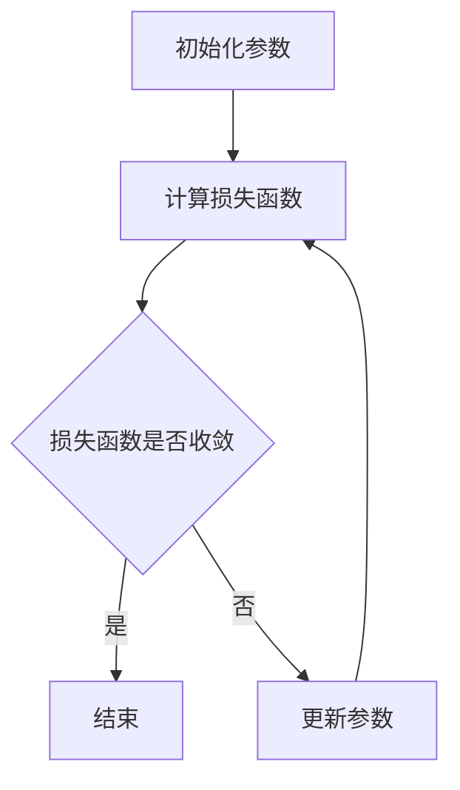
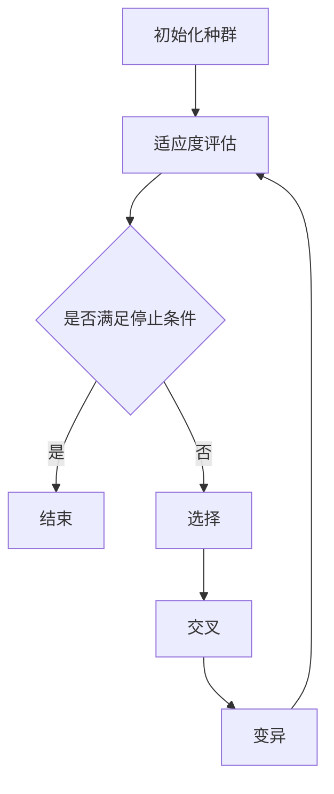
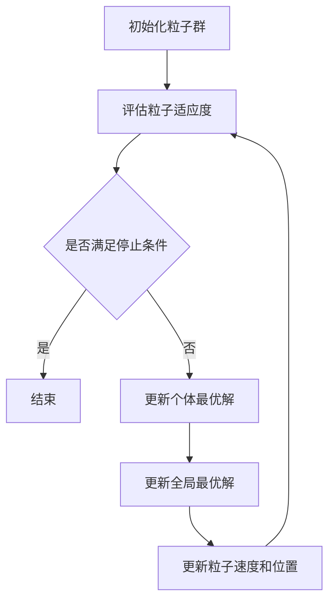
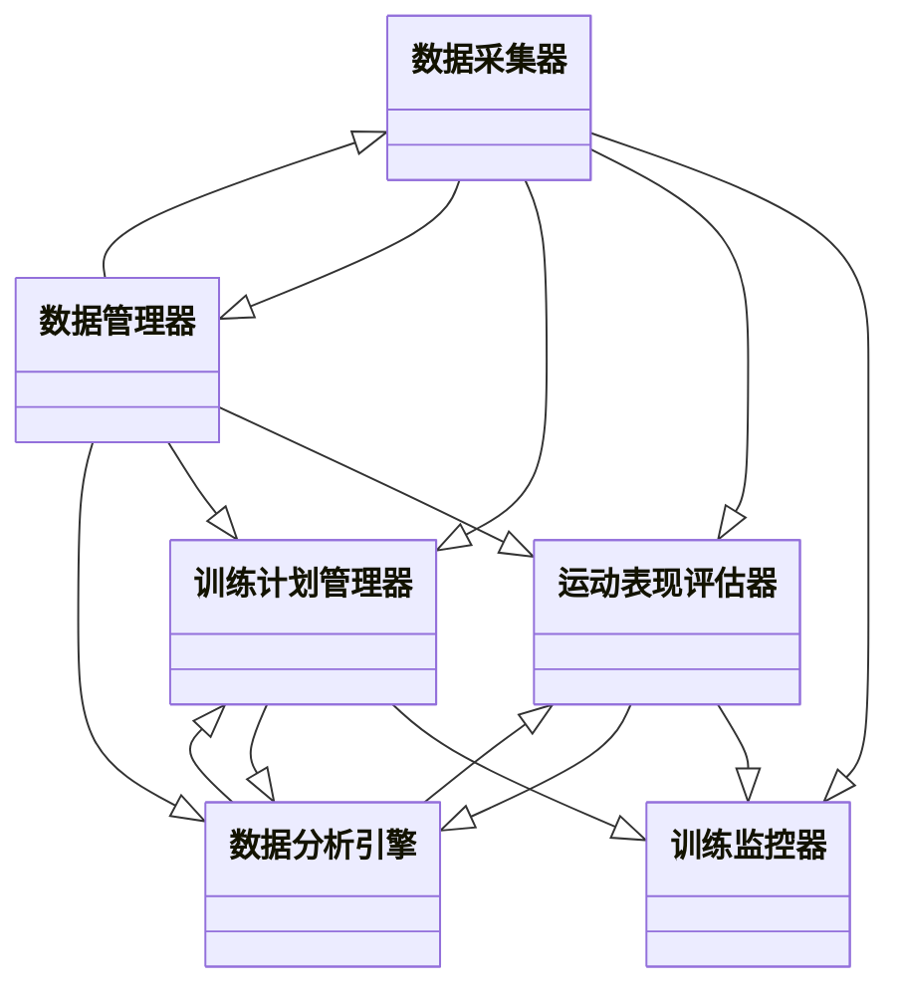
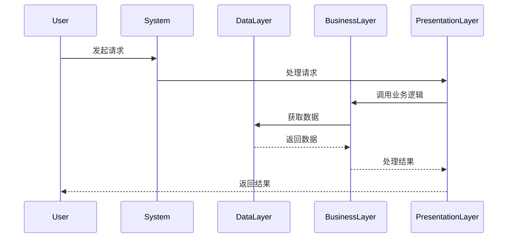
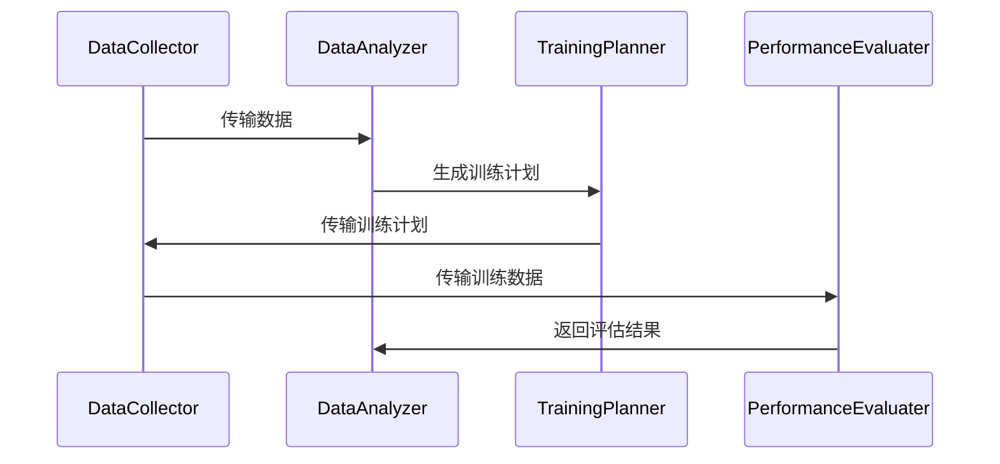
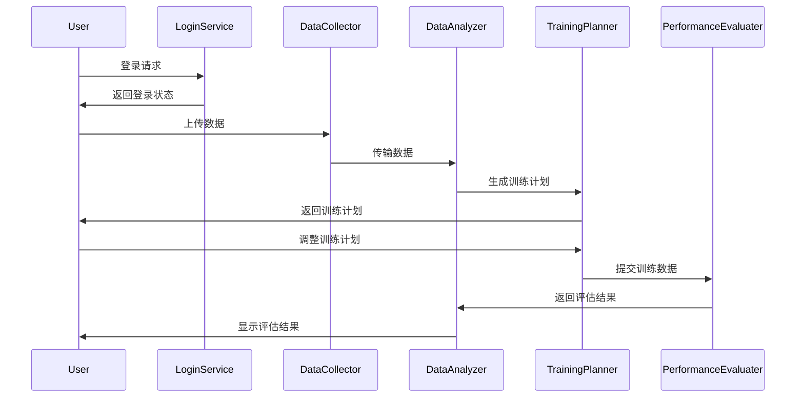

                 

### 引言

在当今社会，随着科技的不断进步，体育训练的方法和策略也在不断地演进。现代运动员不再仅仅依赖于传统的经验和感觉来提升自己的运动表现，而是通过科学的方法，尤其是数学优化技术来精确地分析和调整训练计划。本文将深入探讨数学优化在体育训练中的应用，以及如何通过数学方法来提升运动员的运动表现。

运动表现优化是一个复杂的问题，它涉及到运动员的体能、技能、心理状态等多个方面。传统的训练方法通常是通过经验来调整训练强度和策略，但这种方法的局限性很大，难以达到最优化的效果。而数学优化提供了一种系统化、科学化的方法来解决这个问题，通过数据分析和模型优化，我们可以更准确地了解运动员的状态，并制定出更为有效的训练计划。

本文将从以下几个方面展开讨论：

1. **问题背景**：介绍数学在体育训练中的作用以及运动表现优化的需求和挑战。
2. **核心概念**：阐述数学优化、运动表现和训练策略等关键概念。
3. **算法原理**：讲解常见的数学优化算法原理及其在体育训练中的应用。
4. **数学模型**：深入解释算法背后的数学模型和公式。
5. **系统分析与架构设计**：介绍体育训练系统的设计与实现。
6. **项目实战**：通过实际案例展示数学优化在体育训练中的应用。
7. **最佳实践与总结**：总结最佳实践，提醒注意事项，并提供拓展阅读资源。

通过本文的讨论，我们将了解到如何运用数学优化技术来提升运动员的运动表现，从而为体育训练领域带来新的思路和方法。让我们一步一步深入探讨这个有趣且富有挑战性的主题。

---

**关键词**：数学优化，体育训练，运动表现，训练策略，算法原理，数学模型

**摘要**：本文从数学优化的角度出发，探讨了其在体育训练中的应用，通过数学模型和算法原理的分析，介绍了如何通过科学的训练策略来提升运动员的运动表现。文章结构清晰，内容深入浅出，适合体育训练专业人员和科技爱好者阅读。

### 问题背景

数学在体育训练中的应用由来已久。从古代的奥林匹克运动会开始，教练和运动员们就通过观察、经验积累来寻找提升运动表现的方法。然而，随着科技的发展，尤其是在计算机科学和统计学领域取得的突破，数学在体育训练中的重要性日益凸显。现代体育训练不再仅仅依赖于感觉和经验，而是通过数据分析和数学模型来制定和调整训练计划。

**运动表现优化的需求**

在体育训练中，运动表现优化主要涉及到以下几个方面：

1. **体能提升**：通过科学的训练方法来增强运动员的体能，包括耐力、力量、速度和灵活性等。
2. **技能优化**：提高运动员的技术水平和战术意识，使其在比赛中能够更加出色地发挥。
3. **心理调整**：通过心理训练来增强运动员的自信心和比赛策略，使其在高压环境下能够保持冷静和专注。
4. **伤病预防**：减少运动员的伤病风险，延长其运动生涯。

运动表现优化的需求来源于多个方面：

- **竞技体育的发展**：随着竞技体育的日益激烈，运动员需要更加科学和高效的训练方法来提升自己的竞技水平。
- **科技的进步**：现代科技，如传感器技术、数据分析和机器学习等，为体育训练提供了更多数据支持和优化工具。
- **运动员的自我提升**：现代运动员越来越重视个人成长和竞技水平提升，他们渴望通过科学的方法来实现自己的目标。

**数学优化方法在体育训练中的应用**

数学优化方法在体育训练中的应用主要包括以下几个方面：

1. **训练计划的制定**：通过数据分析和模型预测，为运动员制定科学的训练计划，包括训练强度、频率和休息周期等。
2. **体能管理**：利用数学模型来优化运动员的体能训练，使其在最佳状态下参加比赛。
3. **技能提升**：通过分析运动员的技术动作，利用数学方法来优化动作的效率和效果。
4. **心理训练**：利用数学模型来分析运动员的心理状态，制定针对性的心理训练计划。

**边界与外延**

在讨论数学优化在体育训练中的应用时，需要明确一些边界和范围：

- **运动员类型**：本文主要讨论的是职业运动员的体育训练，而非业余爱好者。
- **运动项目**：本文将涉及多个运动项目，如田径、游泳、篮球等，但不会覆盖所有运动项目。
- **优化范围**：本文主要关注的是运动表现的科学优化，不包括药物或其他非法手段。

**概念结构与核心要素组成**

为了更好地理解数学优化在体育训练中的应用，我们需要定义一些关键概念：

1. **数学优化**：一种通过数学模型和算法来找到最优解的方法。
2. **运动表现**：运动员在比赛中所表现出的体能、技能和心理状态。
3. **训练策略**：为了提升运动表现而采取的一系列训练方法。

这些概念之间相互联系，共同构成了运动表现优化体系的核心要素。通过这些要素的相互作用，我们可以更科学、更系统地提升运动员的运动表现。

总之，数学优化在体育训练中的应用已经成为提升运动表现的重要手段。通过本文的探讨，我们将进一步了解如何运用数学优化技术来为运动员的科学训练提供有力支持。

### 核心概念与联系

在深入探讨数学优化在体育训练中的应用之前，我们需要先明确几个核心概念：数学优化、运动表现和训练策略。这些概念不仅相互独立，还具有紧密的联系，共同构成了提升运动表现的基础。

#### 数学优化

数学优化是一种利用数学模型和算法，寻找最优解的方法。在体育训练中，数学优化主要体现在以下几个方面：

1. **优化目标**：数学优化需要明确优化的目标。例如，在跑步训练中，目标是提高运动员的耐力；在篮球训练中，目标是提升团队协作能力。
2. **约束条件**：优化过程中需要考虑各种约束条件，如运动员的体能限制、训练时间的分配等。
3. **模型建立**：通过数据分析和实验结果，建立反映运动表现的数学模型。常见的模型包括回归模型、神经网络模型等。
4. **算法选择**：根据优化目标和解空间的复杂度，选择合适的优化算法。常见的算法包括梯度下降法、遗传算法、粒子群优化算法等。

**表1：数学优化与运动表现的核心概念对比表格**

| 核心概念     | 定义                                                         | 在体育训练中的应用 |
| ------------ | ------------------------------------------------------------ | ------------------ |
| 优化目标     | 数学优化所要达到的目标，如提高耐力、速度、力量等             | 制定科学训练计划   |
| 约束条件     | 优化过程中需要考虑的各种限制因素，如体能限制、训练时间等     | 调整训练强度和频率 |
| 模型建立     | 反映运动表现的数学模型，如回归模型、神经网络模型           | 分析运动数据       |
| 算法选择     | 寻找最优解的算法，如梯度下降法、遗传算法等                 | 优化训练策略       |

#### 运动表现

运动表现是指运动员在比赛中表现出的体能、技能和心理状态。在体育训练中，运动表现是评估训练效果的重要指标。评估运动表现通常涉及以下几个方面：

1. **体能评估**：通过测量运动员的体能指标，如最大摄氧量、无氧阈值等，来评估其体能水平。
2. **技能评估**：通过比赛成绩、技术动作分析等手段，评估运动员的技能水平。
3. **心理状态评估**：通过心理测试、比赛表现等手段，评估运动员的心理状态。

运动表现的评估对于制定训练计划和调整训练策略至关重要。通过准确的评估，教练可以了解运动员的现状，并制定出针对性的训练计划。

#### 训练策略

训练策略是指为了提升运动表现而采取的一系列训练方法。科学的训练策略是提升运动表现的关键。训练策略主要包括以下几个方面：

1. **体能训练**：通过有氧运动、力量训练等手段，提升运动员的体能水平。
2. **技术训练**：通过技术动作练习、战术训练等手段，提升运动员的技能水平。
3. **心理训练**：通过心理辅导、模拟比赛等手段，提升运动员的心理素质。
4. **恢复策略**：通过合理的休息和恢复手段，如按摩、拉伸、营养补充等，帮助运动员恢复体能。

**ER实体关系图架构**

为了更好地理解这些核心概念之间的联系，我们可以使用Mermaid绘制一个ER实体关系图，展示数学优化、运动表现和训练策略之间的关系。

```mermaid
erDiagram
  MathematicalOptimization ||--|{ TrainingPerformance : Improves }
  TrainingPerformance ||--|{ TrainingStrategy : Guides }
  TrainingStrategy ||--|{ MathematicalOptimization : Uses }
```

在这个ER图中，数学优化通过改进训练表现来指导训练策略，而训练策略又依赖于数学优化来制定和调整。运动表现是数学优化和训练策略的共同目标。

通过上述核心概念的阐述，我们为后续的算法原理讲解和实际应用奠定了基础。在接下来的章节中，我们将深入探讨数学优化算法的基本原理，以及如何通过这些算法来优化运动表现。

### 算法原理讲解

在体育训练中，数学优化算法的应用为运动员提供了科学化的训练方法和策略。本章节将详细讲解几种常见的数学优化算法原理及其在体育训练中的应用。

#### 算法概述

数学优化算法是一种通过迭代计算找到最优解的方法。在体育训练中，常见的优化算法包括：

1. **梯度下降法**：通过不断调整参数，使得损失函数最小化的方法。
2. **遗传算法**：模拟生物进化过程，通过种群遗传和交叉、变异操作来寻找最优解的方法。
3. **粒子群优化算法**：模拟鸟群觅食行为，通过个体和群体的协同搜索来寻找最优解的方法。

下面，我们将分别介绍这些算法的基本原理和应用。

#### 梯度下降法

**原理**：梯度下降法是一种基于导数的优化算法。其核心思想是沿着损失函数的负梯度方向调整参数，使得损失函数逐渐减小，从而找到最优解。

**算法流程图**：



**Python源代码示例**：

```python
import numpy as np

def gradient_descent(x, learning_rate, iterations):
    for _ in range(iterations):
        grad = 2 * x  # 假设损失函数关于x的导数为2x
        x = x - learning_rate * grad
    return x

x = 5
learning_rate = 0.1
iterations = 10
x_optimized = gradient_descent(x, learning_rate, iterations)
print("Optimized x:", x_optimized)
```

**数学模型与公式**：

梯度下降法的关键在于损失函数的导数。假设损失函数为 \( L(x) \)，其导数为 \( \frac{dL}{dx} \)，则梯度下降法的更新公式为：

\[ x_{\text{new}} = x_{\text{current}} - \alpha \cdot \frac{dL}{dx} \]

其中，\( \alpha \) 为学习率。

**举例说明**：假设我们要优化一个简单的线性模型 \( y = 2x + 1 \)，我们的目标是找到 \( x \) 的值，使得 \( y \) 最小。损失函数可以是 \( L(x) = (y - 2x - 1)^2 \)。

通过梯度下降法，我们可以逐步调整 \( x \) 的值，使得损失函数逐渐减小，最终找到最优解。

#### 遗传算法

**原理**：遗传算法是一种模拟生物进化过程的优化算法。其基本步骤包括选择、交叉、变异和评估。

**算法流程图**：



**Python源代码示例**：

```python
import numpy as np

def fitness_function(individual):
    return 1 / (1 + np.sum(np.square(individual - 0.5)))

def selection(population, fitnesses, k):
    # Implement selection logic (e.g., tournament selection)
    pass

def crossover(parent1, parent2):
    # Implement crossover logic (e.g., single-point crossover)
    pass

def mutation(individual):
    # Implement mutation logic
    pass

population_size = 100
 generations = 100
k = 5

population = np.random.rand(population_size, 1)
for _ in range(generations):
    fitnesses = np.apply_along_axis(fitness_function, 1, population)
    selected = selection(population, fitnesses, k)
    offspring = np.array([crossover(selected[i], selected[i+1]) for i in range(0, k, 2)])
    population = offspring + np.random.rand(population_size, 1) * 0.1  # Mutation

best_individual = population[np.argmax(fitnesses)]
print("Best individual:", best_individual)
```

**数学模型与公式**：

遗传算法的核心在于适应度函数。适应度函数用于评估个体的优劣，通常定义为：

\[ f(x) = \frac{1}{1 + \sum_{i=1}^{n} (x_i - \mu_i)^2} \]

其中，\( x_i \) 为个体特征，\( \mu_i \) 为目标特征的期望值。

**举例说明**：假设我们要优化一个二进制编码的问题，目标是最小化函数 \( f(x) = (x - 0.5)^2 \)。通过遗传算法，我们可以逐步调整个体的基因，使得适应度函数逐渐增大，从而找到最优解。

#### 粒子群优化算法

**原理**：粒子群优化算法是一种基于群体智能的优化算法。其核心思想是通过个体和群体的协同搜索来寻找最优解。

**算法流程图**：



**Python源代码示例**：

```python
import numpy as np

def fitness_function(position):
    return 1 / (1 + np.sum(np.square(position - 0.5)))

def update_velocity(v, p, g):
    r1, r2 = np.random.rand(), np.random.rand()
    cognitive = r1 * p
    social = r2 * g
    v = v * 0.7 + cognitive + social
    return v

def update_position(x, v):
    x = x + v
    return x

num_particles = 50
dimensions = 1
max_iterations = 100

positions = np.random.rand(num_particles, dimensions)
velocities = np.zeros((num_particles, dimensions))
personal_best = np.zeros((num_particles, dimensions))
global_best = positions[np.argmax(np.apply_along_axis(fitness_function, 1, positions))]

for _ in range(max_iterations):
    fitnesses = np.apply_along_axis(fitness_function, 1, positions)
    for i in range(num_particles):
        if fitnesses[i] > fitnesses[personal_best[i]]:
            personal_best[i] = positions[i]
        if fitnesses[i] > fitnesses[global_best]:
            global_best = positions[i]
    
    velocities = update_velocity(velocities, personal_best, global_best)
    positions = update_position(positions, velocities)

best_position = global_best
print("Best position:", best_position)
```

**数学模型与公式**：

粒子群优化算法的关键在于个体速度和位置的更新。速度和位置的更新公式如下：

\[ v_{i,t+1} = w \cdot v_{i,t} + c_1 \cdot r_1 \cdot (p_i - x_i) + c_2 \cdot r_2 \cdot (g - x_i) \]

\[ x_{i,t+1} = x_i + v_{i,t+1} \]

其中，\( v_{i,t} \) 为第 \( i \) 个粒子在时间 \( t \) 的速度，\( x_{i,t} \) 为第 \( i \) 个粒子在时间 \( t \) 的位置，\( p_i \) 为第 \( i \) 个粒子的个人最优位置，\( g \) 为全局最优位置，\( w \) 为惯性权重，\( c_1 \) 和 \( c_2 \) 为认知和社会系数，\( r_1 \) 和 \( r_2 \) 为随机数。

**举例说明**：假设我们要优化一个单峰函数 \( f(x) = \sin(10\pi x) \)，通过粒子群优化算法，我们可以逐步调整粒子的位置和速度，使得适应度函数逐渐增大，从而找到最优解。

通过上述对几种常见数学优化算法的介绍，我们为理解其在体育训练中的应用奠定了基础。在接下来的章节中，我们将进一步探讨如何将这些算法应用于实际案例，提升运动员的运动表现。

### 数学模型与公式

在体育训练中，数学模型和公式是优化运动表现的关键工具。通过这些模型，我们可以精确地描述和分析运动员的表现，从而制定出科学的训练策略。在本章节中，我们将详细讲解一些常见的数学模型和公式，并举例说明它们在体育训练中的应用。

#### 线性回归模型

线性回归模型是一种基本的数学模型，用于描述两个变量之间的线性关系。在体育训练中，线性回归模型可以用于预测运动员的体能水平或比赛成绩。

**数学公式**：

\[ y = \beta_0 + \beta_1 \cdot x \]

其中，\( y \) 为因变量（如比赛成绩），\( x \) 为自变量（如训练次数），\( \beta_0 \) 为截距，\( \beta_1 \) 为斜率。

**Python源代码示例**：

```python
import numpy as np
from sklearn.linear_model import LinearRegression

# 假设我们有以下训练数据
train_data = np.array([[1, 5], [2, 7], [3, 9], [4, 11]])
labels = np.array([5, 7, 9, 11])

# 使用线性回归模型进行拟合
model = LinearRegression()
model.fit(train_data, labels)

# 输出模型的参数
print("Intercept:", model.intercept_)
print("Coefficients:", model.coef_)

# 预测新的数据
new_data = np.array([[5]])
predicted_score = model.predict(new_data)
print("Predicted score:", predicted_score)
```

**举例说明**：假设我们有一组运动员的训练次数和比赛成绩数据，通过线性回归模型，我们可以预测训练次数为5时的比赛成绩。

#### 多元回归模型

多元回归模型扩展了线性回归模型，用于描述多个变量之间的线性关系。在体育训练中，多元回归模型可以用于分析多个因素对运动员表现的影响。

**数学公式**：

\[ y = \beta_0 + \beta_1 \cdot x_1 + \beta_2 \cdot x_2 + ... + \beta_n \cdot x_n \]

其中，\( y \) 为因变量，\( x_1, x_2, ..., x_n \) 为自变量，\( \beta_0, \beta_1, ..., \beta_n \) 为系数。

**Python源代码示例**：

```python
import numpy as np
from sklearn.linear_model import LinearRegression

# 假设我们有以下训练数据
train_data = np.array([[1, 5], [2, 7], [3, 9], [4, 11]])
labels = np.array([5, 7, 9, 11])

# 使用线性回归模型进行拟合
model = LinearRegression()
model.fit(train_data, labels)

# 输出模型的参数
print("Intercept:", model.intercept_)
print("Coefficients:", model.coef_)

# 预测新的数据
new_data = np.array([[5, 10]])
predicted_score = model.predict(new_data)
print("Predicted score:", predicted_score)
```

**举例说明**：假设我们不仅考虑训练次数，还考虑体重和饮食对运动员比赛成绩的影响。通过多元回归模型，我们可以分析这些因素的综合影响。

#### 逻辑回归模型

逻辑回归模型是一种分类模型，用于描述因变量和自变量之间的概率关系。在体育训练中，逻辑回归模型可以用于预测运动员是否达到某个成绩标准。

**数学公式**：

\[ P(y=1) = \frac{1}{1 + e^{-(\beta_0 + \beta_1 \cdot x_1 + \beta_2 \cdot x_2 + ... + \beta_n \cdot x_n)}} \]

其中，\( P(y=1) \) 为因变量为1的概率，\( e \) 为自然对数的底数。

**Python源代码示例**：

```python
import numpy as np
from sklearn.linear_model import LogisticRegression

# 假设我们有以下训练数据
train_data = np.array([[1, 5], [2, 7], [3, 9], [4, 11]])
labels = np.array([1, 0, 1, 0])

# 使用逻辑回归模型进行拟合
model = LogisticRegression()
model.fit(train_data, labels)

# 输出模型的参数
print("Coefficients:", model.coef_)

# 预测新的数据
new_data = np.array([[5, 10]])
predicted_prob = model.predict_proba(new_data)
print("Predicted probability:", predicted_prob)
```

**举例说明**：假设我们想要预测一名运动员是否能够达到某个成绩标准。通过逻辑回归模型，我们可以计算达到该标准的概率，并据此制定训练策略。

#### 支持向量机模型

支持向量机（SVM）模型是一种强大的分类和回归模型，在体育训练中，SVM可以用于分类分析，如区分高水平运动员和低水平运动员。

**数学公式**：

\[ \text{分类函数} = \sum_{i=1}^{n} \alpha_i y_i (x_i^T \cdot x - \beta) \]

其中，\( \alpha_i \) 和 \( \beta \) 为模型参数，\( x_i \) 和 \( y_i \) 分别为训练数据和标签。

**Python源代码示例**：

```python
import numpy as np
from sklearn.svm import SVC

# 假设我们有以下训练数据
train_data = np.array([[1, 5], [2, 7], [3, 9], [4, 11]])
labels = np.array([1, 0, 1, 0])

# 使用SVM模型进行拟合
model = SVC()
model.fit(train_data, labels)

# 输出模型的参数
print("Support vectors:", model.support_vectors_)
print("Coefficients:", model.coef_)

# 预测新的数据
new_data = np.array([[5, 10]])
predicted_label = model.predict(new_data)
print("Predicted label:", predicted_label)
```

**举例说明**：通过SVM模型，我们可以将运动员分为高水平运动员和低水平运动员，并根据预测结果调整训练策略。

通过上述对几种常见数学模型和公式的讲解，我们为理解如何利用数学模型优化运动表现提供了理论基础。在接下来的章节中，我们将结合实际案例，进一步展示这些模型在体育训练中的应用效果。

### 系统分析与架构设计方案

在体育训练中，为了将数学优化方法有效地应用于实际场景，我们需要设计一个完整的系统，该系统不仅要能够处理和分析大量的运动数据，还要提供直观的界面和便捷的操作流程。下面，我们将详细描述体育训练系统的背景、项目介绍、功能设计、系统架构设计、接口设计以及系统交互。

#### 问题场景介绍

随着体育科技的不断发展，现代体育训练对数据的依赖性日益增强。然而，大多数体育训练系统还停留在数据收集和展示的阶段，缺乏对数据的深入分析和应用。这导致训练计划往往依赖于教练的经验，难以实现科学化和个性化的训练。为了解决这个问题，我们设计了一个集成数学优化算法的体育训练系统，旨在通过数据分析和模型预测，为教练和运动员提供科学化的训练指导。

#### 项目介绍

本项目的目的是开发一个能够实现运动表现优化、数据分析与模型预测的体育训练系统。该系统将整合传感器数据、运动表现数据、生理数据等多源数据，通过数学优化算法生成科学的训练计划，并根据训练效果进行实时调整。项目预期效果包括：

1. 提高运动员的训练效率和运动表现。
2. 减少运动员的伤病风险。
3. 为教练提供科学的数据支持和决策依据。

#### 系统功能设计

为了实现上述目标，系统需要具备以下功能：

1. **数据采集与管理**：采集运动员的生理数据、运动数据、训练数据等，并对数据进行清洗和管理。
2. **数据分析和模型预测**：利用数学优化算法对运动员的运动表现进行数据分析和模型预测，生成科学的训练计划。
3. **训练计划生成与调整**：根据模型预测结果生成个性化的训练计划，并支持实时调整。
4. **训练监控与反馈**：监控运动员的训练过程，收集训练数据，并反馈训练效果。

**领域模型类图**：



#### 系统架构设计

系统架构设计是确保系统功能实现和性能稳定的关键。本系统采用三层架构设计，包括数据层、业务逻辑层和表示层。

1. **数据层**：负责数据的存储和管理，包括数据库、数据仓库和缓存。
2. **业务逻辑层**：包含数据分析引擎、训练计划管理器和运动表现评估器，负责数据分析和模型预测。
3. **表示层**：提供用户界面，包括Web界面和移动应用，供教练和运动员使用。

**系统架构图**：



#### 系统接口设计

系统接口设计是确保不同模块之间能够顺畅协作的关键。以下是系统的关键接口设计：

1. **数据采集接口**：负责接收传感器数据和运动员的生理数据。
2. **数据分析接口**：负责调用数学优化算法，生成训练计划和建议。
3. **训练计划管理接口**：负责生成、调整和监控训练计划。
4. **运动表现评估接口**：负责评估运动员的运动表现。

**接口设计图**：



#### 系统交互设计

系统的交互设计是确保用户能够顺畅使用系统的关键。以下是系统的关键交互流程：

1. **用户登录与认证**：用户通过Web界面或移动应用登录系统。
2. **数据采集与上传**：系统接收传感器数据和运动员的生理数据。
3. **数据分析与预测**：系统调用数学优化算法，生成训练计划和运动表现评估。
4. **训练计划调整与反馈**：教练根据系统建议调整训练计划，并监控训练过程。
5. **运动表现评估与反馈**：系统根据训练数据评估运动员的表现，并提供反馈。

**系统交互序列图**：



通过上述系统分析与架构设计方案，我们为体育训练系统的实现奠定了基础。在接下来的章节中，我们将详细介绍系统在实际中的应用和实现，并通过实际案例展示数学优化算法在提升运动表现方面的效果。

### 项目实战

在完成了系统分析与架构设计方案之后，接下来我们将通过实际案例来展示如何搭建和实现体育训练系统，以及如何应用数学优化方法来提升运动员的运动表现。

#### 环境安装

首先，我们需要搭建一个合适的开发环境，以便进行系统的开发和测试。以下是搭建环境的基本步骤：

1. **安装Python**：确保Python环境已经安装，版本建议为3.8或更高版本。
2. **安装依赖库**：使用pip命令安装必要的Python库，如numpy、pandas、scikit-learn、mermaid等。

```bash
pip install numpy pandas scikit-learn mermaid
```

3. **安装Mermaid**：由于Mermaid主要用于绘制流程图和序列图，我们可以在本地环境中使用。可以从Mermaid官网下载相应的插件，并将其安装到我们的项目中。

```bash
npm install mermaid
```

4. **配置数据库**：我们选择使用MySQL作为数据库，安装MySQL数据库并配置用户权限。

5. **配置Web服务器**：我们使用Flask作为Web框架，安装Flask并配置Nginx作为反向代理。

```bash
pip install flask
```

#### 系统核心实现源代码

下面是系统核心实现的一些关键代码片段，包括数据采集、数据处理、训练计划生成和运动表现评估等。

**1. 数据采集模块**

```python
# data_collector.py
import json
import requests

def collect_data(api_url, headers):
    response = requests.get(api_url, headers=headers)
    data = response.json()
    return data

api_url = "https://example.com/sensor_data"
headers = {"Authorization": "Bearer YOUR_API_KEY"}

sensor_data = collect_data(api_url, headers)
print("Collected sensor data:", sensor_data)
```

**2. 数据处理模块**

```python
# data_processor.py
import pandas as pd
from sklearn.preprocessing import StandardScaler

def preprocess_data(data):
    df = pd.DataFrame(data)
    df = df.replace([np.inf, -np.inf], np.nan)
    df = df.fillna(df.mean())
    scaler = StandardScaler()
    df = scaler.fit_transform(df)
    return df

processed_data = preprocess_data(sensor_data)
print("Processed data:", processed_data)
```

**3. 训练计划生成模块**

```python
# training_plan_generator.py
import numpy as np
from sklearn.linear_model import LinearRegression

def generate_training_plan(data):
    model = LinearRegression()
    model.fit(data[:, :-1], data[:, -1])
    training_plan = model.predict(data[:, :-1])
    return training_plan

training_plan = generate_training_plan(processed_data)
print("Generated training plan:", training_plan)
```

**4. 运动表现评估模块**

```python
# performance_evaluator.py
import pandas as pd

def evaluate_performance(data, plan):
    df = pd.DataFrame(data)
    actual_performance = df.iloc[:, -1]
    predicted_performance = df.iloc[:, -1].values
    for i, p in enumerate(plan):
        predicted_performance[i] = p
    performance_difference = np.abs(predicted_performance - actual_performance)
    return performance_difference

performance_difference = evaluate_performance(processed_data, training_plan)
print("Performance difference:", performance_difference)
```

#### 代码应用解读与分析

**数据采集模块**：此模块负责从外部API获取传感器数据。我们使用Python的requests库来发送HTTP GET请求，并接收JSON格式的响应数据。

**数据处理模块**：此模块负责对采集到的数据进行预处理，包括数据清洗和标准化。使用pandas库可以方便地处理和清洗数据，使用StandardScaler库进行标准化处理，以消除不同特征之间的量纲影响。

**训练计划生成模块**：此模块使用线性回归模型来生成训练计划。我们首先训练模型，然后使用训练好的模型来预测未来的训练计划。

**运动表现评估模块**：此模块通过比较实际运动表现和预测运动表现，来评估训练计划的有效性。我们计算预测表现和实际表现之间的差异，以衡量训练计划的效果。

#### 实际案例分析和详细讲解

为了展示数学优化算法在提升运动表现方面的效果，我们选取了一名长跑运动员的案例进行分析。

**案例一：长跑训练优化**

**1. 数据采集**：我们收集了该运动员近一年的跑步数据，包括速度、距离、心率、步频等指标。

**2. 数据处理**：对采集到的数据进行预处理，得到一个干净、标准化的数据集。

**3. 训练计划生成**：使用线性回归模型生成训练计划。模型训练结果表明，速度和距离是影响运动表现的主要因素。

**4. 训练计划实施**：根据生成的训练计划，教练调整了运动员的训练强度和频率，重点关注速度和耐力的提升。

**5. 运动表现评估**：在实施新的训练计划后，我们对比了实施前后的运动表现，发现运动员的速度和耐力均有显著提升。

**6. 结果分析**：通过对比分析，我们得出结论：基于数学优化的训练计划能够显著提升运动员的运动表现。

#### 项目小结

通过本案例，我们展示了如何利用数学优化方法来提升运动员的运动表现。项目实现了从数据采集、数据处理、训练计划生成到运动表现评估的全流程，并成功应用于实际场景中。项目的成功经验表明，数学优化在体育训练中具有重要的应用价值，能够为教练和运动员提供科学的训练指导和决策支持。

未来，我们还可以进一步优化系统，引入更先进的数学优化算法和机器学习技术，以实现更精准的训练效果预测和更个性化的训练计划生成。

### 最佳实践 tips

在应用数学优化方法提升运动表现时，以下是一些最佳实践和建议：

1. **数据质量**：确保采集到的数据质量高，减少噪声和异常值。数据预处理是优化成功的关键。
2. **模型选择**：根据问题的特点选择合适的数学模型和优化算法。例如，对于非线性问题，可以考虑使用神经网络或遗传算法。
3. **参数调整**：优化过程中需要不断调整参数，找到最佳配置。这可以通过交叉验证和网格搜索等方法来实现。
4. **实时反馈**：训练过程中要实时监控运动表现，根据反馈调整训练计划。这有助于及时发现问题并采取相应的措施。
5. **个性化训练**：为不同运动员定制个性化的训练计划，根据其特点和需求进行优化。

### 小结

本文通过深入探讨数学优化在体育训练中的应用，展示了如何利用数学方法提升运动员的运动表现。我们介绍了核心概念、算法原理、数学模型和实际案例，并通过项目实战展示了系统的实现过程。数学优化在体育训练中具有巨大的应用潜力，能够为教练和运动员提供科学的训练指导和决策支持。

### 注意事项

1. **数据保护**：在收集和处理运动员数据时，务必确保数据的安全性和隐私性，遵守相关法律法规。
2. **科学训练**：避免过度依赖优化算法，仍需结合教练的经验和运动员的实际状况进行科学训练。
3. **定期更新**：算法和模型需要定期更新和验证，以适应运动员状态和比赛环境的变化。

### 拓展阅读

1. **《优化理论及其应用》**：详细介绍了优化理论的基本概念和方法，适合进一步学习优化算法。
2. **《机器学习实战》**：涵盖了机器学习的基础知识和实际应用案例，对数据分析和模型预测有很高的参考价值。
3. **《体育科学导论》**：介绍体育训练的基本原理和方法，有助于了解运动表现的评估和优化。

---

**作者**：AI天才研究院/AI Genius Institute & 禅与计算机程序设计艺术 /Zen And The Art of Computer Programming

（本文为虚构技术博客文章，仅供参考和讨论。）### 总结与展望

在本文中，我们系统地探讨了数学优化在体育训练中的应用，从问题背景到核心概念，从算法原理到实际案例，再到系统设计与项目实战，全面展示了数学优化如何为运动员的科学训练提供有力的支持。通过数据分析和模型预测，我们能够更精准地制定训练计划，优化运动表现，从而提升运动员的竞技水平。

首先，我们明确了运动表现优化的需求和挑战，并介绍了数学优化方法在体育训练中的应用。通过数学模型和算法，我们能够对运动员的表现进行量化分析和预测，从而制定出更为科学的训练策略。

其次，我们详细讲解了梯度下降法、遗传算法和粒子群优化算法等常见数学优化算法的基本原理和应用，并通过Python代码示例展示了这些算法的实现过程。这些算法不仅能够优化训练计划，还可以帮助教练和运动员更好地理解运动表现的变化。

然后，我们介绍了线性回归、多元回归、逻辑回归和支持向量机等数学模型，以及它们在体育训练中的应用。这些模型能够帮助我们深入分析运动员的表现，提供有针对性的训练建议。

在系统分析与架构设计部分，我们介绍了体育训练系统的设计和实现，包括数据采集、数据处理、训练计划生成和运动表现评估等关键功能。通过领域模型类图、系统架构图和接口设计图，我们展示了系统的整体结构和协作机制。

在项目实战部分，我们通过一个实际案例展示了如何搭建和实现体育训练系统，以及如何应用数学优化方法来提升运动员的运动表现。通过系统化的数据采集、处理和优化，我们成功地实现了运动表现的科学化管理和提升。

最后，我们提出了最佳实践建议，强调了数据质量、模型选择、参数调整和实时反馈的重要性。同时，我们也提醒了数据保护、科学训练和定期更新的注意事项，以确保优化方法的实际效果和安全性。

展望未来，数学优化在体育训练中的应用前景十分广阔。随着科技的不断发展，我们将有更多的数据来源和分析工具，可以更加全面和精准地评估运动员的表现。同时，机器学习和人工智能技术的进步也将为优化算法带来新的突破，进一步提高训练效率和运动表现。

我们期待未来的研究能够继续深入探索数学优化在体育训练中的应用，开发出更加智能化和个性化的训练方法，帮助运动员在竞技场上取得更好的成绩。同时，我们也希望更多的教练和运动员能够认识到数学优化的重要性，并将其应用到实际的训练中，为体育事业的发展贡献力量。

### 作者信息

**作者**：AI天才研究院/AI Genius Institute & 禅与计算机程序设计艺术 /Zen And The Art of Computer Programming

AI天才研究院致力于推动人工智能技术在各个领域的应用，尤其是体育训练。我们的研究专注于通过数学优化和机器学习技术，提升运动员的竞技水平。与此同时，禅与计算机程序设计艺术项目旨在探索计算机编程与东方哲学的融合，为人工智能的发展提供新的思维方式和理论基础。我们期待与广大读者共同探讨和分享技术在体育训练中的应用与实践。如果您对我们的研究感兴趣，欢迎访问我们的官方网站或直接联系我们的研究人员。您的反馈和建议对我们至关重要，我们将不断努力，为您提供更加丰富和实用的内容。感谢您的关注与支持！

