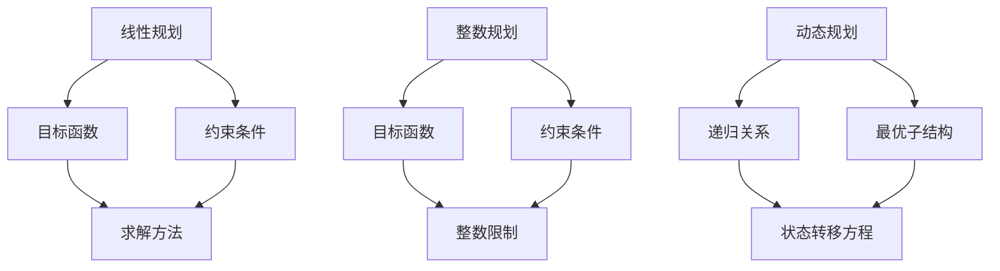
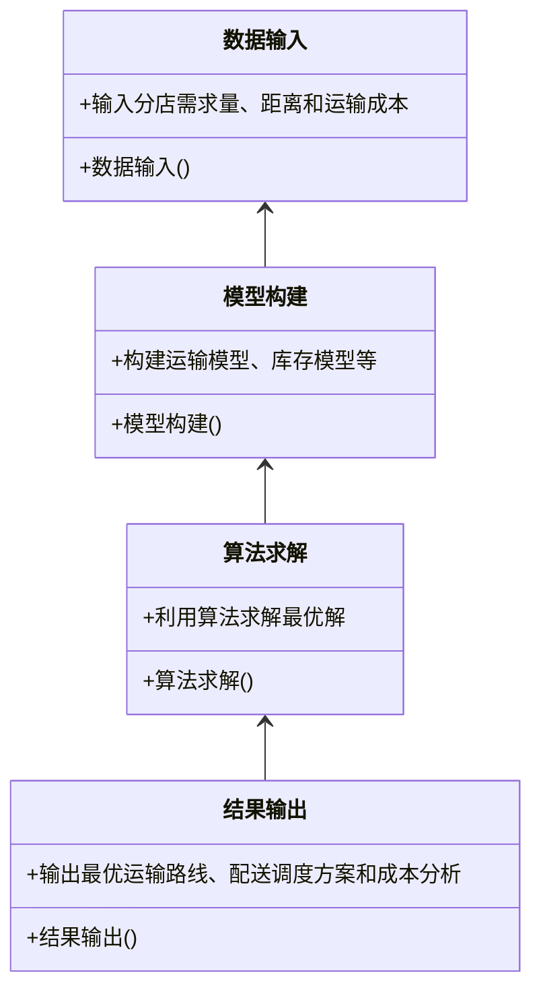
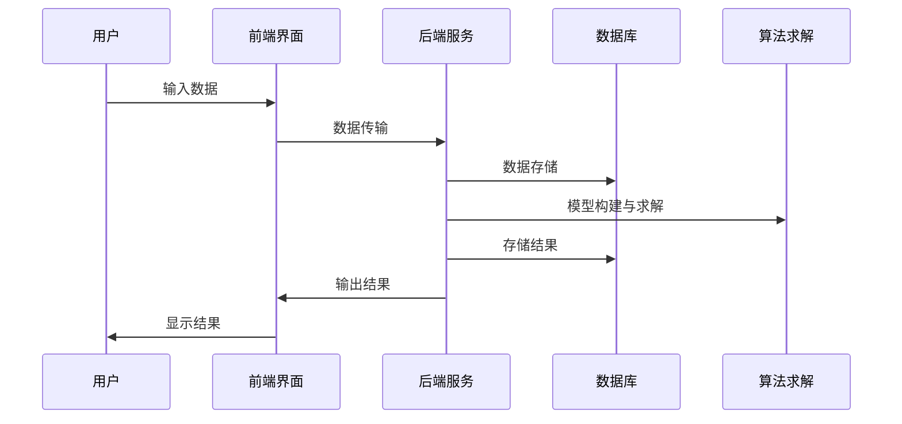

                 

### 数学与供应链管理：物流优化的数学模型

关键词：供应链管理、物流优化、数学模型、算法原理、系统架构、项目实战

摘要：随着全球供应链的不断复杂化，物流优化在供应链管理中扮演着至关重要的角色。本文通过介绍物流优化的问题背景、核心概念、数学模型以及算法原理，结合实际案例，探讨了如何利用数学模型优化物流过程，提高供应链的效率和可靠性。

----------------------------------------------------------------

### 背景介绍

#### 核心概念术语说明

- **供应链管理（Supply Chain Management）**：涉及从原材料采购到产品生产、销售及物流配送的全过程管理。
- **物流优化（Logistics Optimization）**：通过数学模型和算法，找出最优化的物流方案，以提高效率、降低成本。
- **数学模型（Mathematical Model）**：利用数学工具和方法，对实际问题进行抽象和描述，以便分析和求解。
- **算法原理（Algorithm Principle）**：解决问题的步骤和规则，用于实现数学模型。

#### 问题背景

在全球化的背景下，供应链管理的重要性日益凸显。物流作为供应链的“血脉”，其效率直接影响整个供应链的运作效率。然而，物流优化面临诸多挑战，如运输成本高昂、运输路线选择困难、库存管理复杂等。这些问题的解决需要借助数学模型和算法，以实现最优化的物流方案。

#### 问题描述

物流优化主要包括以下问题：

1. **运输路线选择**：如何选择最经济的运输路线，以降低运输成本？
2. **库存管理**：如何合理安排库存，以避免库存过剩或短缺？
3. **配送调度**：如何合理调度配送资源，以满足客户需求？

#### 问题解决

通过构建数学模型，可以有效地解决上述问题。数学模型提供了一种抽象和简化的方法，将复杂的问题转化为可以求解的数学问题。常见的数学模型包括线性规划、整数规划、动态规划等。

#### 边界与外延

物流优化问题的边界包括：

1. **运输距离**：确定运输的最大距离和最小距离。
2. **运输容量**：确定运输工具的容量限制。
3. **成本预算**：确定预算范围。

外延包括：

1. **时间窗口**：考虑配送时间窗口的影响。
2. **服务质量**：考虑客户服务质量要求。

#### 概念结构与核心要素组成

物流优化问题的概念结构包括：

1. **目标函数**：衡量优化问题的指标，如成本、时间等。
2. **决策变量**：影响目标函数的因素，如运输路线、库存水平等。
3. **约束条件**：限制决策变量的取值范围，如运输容量、距离限制等。

通过上述分析，我们可以看到物流优化问题的复杂性和挑战性。接下来，我们将深入探讨物流优化中的核心概念和数学模型。

---

### 核心概念与联系

#### 核心概念原理

在物流优化中，以下核心概念起着至关重要的作用：

1. **供应链管理（Supply Chain Management）**：涵盖从供应商到客户的所有环节，包括采购、生产、物流配送等。
2. **物流优化（Logistics Optimization）**：通过数学模型和算法，优化物流过程中的各个环节，以达到成本最低、效率最高。
3. **数学模型（Mathematical Model）**：对实际物流问题进行抽象和数学描述，用于分析和求解。
4. **算法原理（Algorithm Principle）**：实现数学模型的具体步骤和规则。

#### 概念属性特征对比表格

为了更好地理解这些核心概念，我们可以通过以下表格进行对比：

| 概念         | 特征                  | 关联关系            |
|------------|---------------------|------------------|
| 供应链管理   | 覆盖全流程、综合性强   | 主体框架          |
| 物流优化     | 数学模型、算法驱动力   | 优化手段          |
| 数学模型     | 抽象和简化问题       | 描述工具          |
| 算法原理     | 具体步骤和规则       | 实现方法          |

#### ER实体关系图架构

为了更直观地展示这些概念之间的关系，我们可以使用Mermaid绘制ER实体关系图。以下是示例：

```mermaid
erDiagram
  Supplier ||--|{ Product }|<--| Customer |
  Product ||--|{ Warehouse }|<--| Transport |
  Warehouse ||--|{ Inventory }|<--| Order |
  Order ||--|{ Delivery }|<--| Customer |
```

该ER图展示了供应链管理中的关键实体及其相互关系，包括供应商、产品、客户、仓库、库存和订单等。

通过以上分析，我们可以看到物流优化中的核心概念是如何相互关联和作用的。接下来，我们将进一步探讨物流优化中的数学模型和算法原理。

---

### 数学模型与算法原理讲解

#### 算法原理讲解

在物流优化中，常见的算法包括线性规划（Linear Programming，LP）、整数规划（Integer Programming，IP）和动态规划（Dynamic Programming，DP）。以下是这些算法的简单介绍：

1. **线性规划（LP）**：用于在给定约束条件下，最大化或最小化线性目标函数。LP问题通常可以通过单纯形法求解。
2. **整数规划（IP）**：在LP的基础上，增加了决策变量必须为整数的限制。IP问题可以通过分支定界法求解。
3. **动态规划（DP）**：适用于多阶段决策问题，通过递归关系和最优子结构性质，求解最优解。

为了更直观地理解这些算法，我们可以使用Mermaid绘制算法流程图：



#### 数学模型与公式

在物流优化中，常用的数学模型包括运输模型（Transportation Model）、车辆路径问题（Vehicle Routing Problem，VRP）和库存模型（Inventory Model）等。以下是这些模型的简要介绍和公式：

1. **运输模型（Transportation Model）**：

   目标函数：$$\min Z = \sum_{i=1}^m \sum_{j=1}^n c_{ij} x_{ij}$$

   约束条件：
   $$\sum_{j=1}^n x_{ij} = a_i \quad \forall i=1,2,...,m$$
   $$\sum_{i=1}^m x_{ij} = b_j \quad \forall j=1,2,...,n$$
   $$x_{ij} \geq 0$$

   其中，$x_{ij}$表示从源点$i$到目的地$j$的运输量，$c_{ij}$表示单位运输成本，$a_i$和$b_j$分别表示源点和目的地的供应量和需求量。

2. **车辆路径问题（VRP）**：

   目标函数：$$\min Z = \sum_{i=1}^n \sum_{j=1}^n c_{ij} x_{ij} + \sum_{i=1}^n h_i y_i$$

   约束条件：
   $$\sum_{j=1}^n x_{ij} \leq c_i \quad \forall i=1,2,...,n$$
   $$x_{ij} \in \{0,1\}$$
   $$y_i \in \{0,1\}$$

   其中，$x_{ij}$表示车辆$i$是否访问点$j$，$c_i$表示车辆$i$的载重限制，$h_i$表示点$i$的服务时间，$y_i$表示点$i$是否被选中。

3. **库存模型（Inventory Model）**：

   目标函数：$$\min Z = \sum_{i=1}^n (d_i * c_i + \frac{h_i * s_i}{2})$$

   约束条件：
   $$s_i \geq 0 \quad \forall i=1,2,...,n$$
   $$d_i \geq 0 \quad \forall i=1,2,...,n$$
   $$u_i \geq 0 \quad \forall i=1,2,...,n$$

   其中，$d_i$表示需求量，$c_i$表示单位成本，$h_i$表示持有成本，$s_i$表示库存水平，$u_i$表示补充量。

#### 举例说明

为了更直观地理解这些模型和公式，我们可以通过一个简单的例子来说明。

**例子：运输模型**

假设有一个工厂需要将产品运送到三个目的地，供应量为1000单位，需求量分别为300、500和200单位。运输成本如下表所示：

| 源点 | 目的地1 | 目的地2 | 目的地3 |
|------|--------|--------|--------|
| 1    | 5      | 7      | 6      |
| 2    | 8      | 6      | 7      |
| 3    | 6      | 5      | 4      |

使用运输模型求解最优运输方案。

**解题步骤：**

1. 构建目标函数和约束条件。
2. 使用单纯形法求解最优解。
3. 输出最优运输方案和总成本。

通过上述步骤，我们可以得到最优运输方案和总成本。这个例子展示了如何将实际问题转化为数学模型，并通过算法求解最优解。

通过以上讲解，我们可以看到物流优化中的数学模型和算法原理是如何应用在实际问题中的。接下来，我们将进一步探讨物流优化的系统分析与架构设计。

---

### 系统分析与架构设计方案

#### 问题场景介绍

在物流优化中，常见的场景包括：运输路线选择、配送调度、库存管理等。以下是一个典型的物流优化问题场景：

**场景描述**：一家大型零售企业需要在一天内将3000件商品从总部仓库配送至五个分店。仓库有100辆运输车可用，每辆车的最大载重为500公斤。分店的需求量、距离和运输成本如下表所示：

| 分店 | 需求量 | 距离（公里） | 运输成本（元/公斤） |
|------|--------|------------|----------------|
| A    | 800    | 20         | 2              |
| B    | 1000   | 30         | 2.5            |
| C    | 600    | 40         | 3              |
| D    | 800    | 50         | 3.5            |
| E    | 400    | 60         | 4              |

**目标**：通过物流优化，确定最优的运输路线和配送调度方案，以满足分店需求，同时最大化运输效率，最小化成本。

#### 系统功能设计

为了实现物流优化，我们需要设计以下核心功能：

1. **数据输入**：输入分店需求量、距离和运输成本等数据。
2. **模型构建**：根据输入数据构建运输模型、库存模型等。
3. **算法求解**：利用算法求解最优解。
4. **结果输出**：输出最优运输路线、配送调度方案和成本分析。

使用Mermaid绘制领域模型类图：



#### 系统架构设计

为了实现物流优化系统，我们需要设计一个合理的系统架构。以下是一个简单的系统架构设计：

1. **前端界面**：提供用户输入数据和查看结果的界面。
2. **后端服务**：处理数据输入、模型构建和算法求解等核心功能。
3. **数据库**：存储输入数据和结果数据。

使用Mermaid绘制系统架构图：



#### 系统接口设计与系统交互

为了实现系统功能，我们需要设计合理的系统接口和交互流程。以下是一个简单的接口设计和交互流程：

1. **API接口**：提供数据输入、模型构建、算法求解和结果输出等接口。
2. **交互流程**：用户通过前端界面输入数据，前端将数据传输至后端服务，后端服务处理数据并输出结果。

使用Mermaid绘制系统接口设计和交互序列图：


通过上述系统分析与架构设计，我们可以实现一个功能完善的物流优化系统，从而帮助企业优化物流过程，提高供应链的效率和可靠性。

---

### 项目实战

#### 环境安装

在开始项目实战之前，我们需要安装一些必要的软件和工具。以下是环境安装的步骤：

1. **Python环境**：首先确保安装了Python 3.8及以上版本。
2. **NumPy和SciPy**：安装NumPy和SciPy，用于数学计算。
3. **Pandas**：安装Pandas，用于数据处理。
4. **Matplotlib和Seaborn**：安装Matplotlib和Seaborn，用于数据可视化。

使用以下命令安装所需软件：

```bash
pip install numpy scipy pandas matplotlib seaborn
```

#### 系统核心实现源代码

以下是一个简单的物流优化系统实现示例，包括数据输入、模型构建、算法求解和结果输出等部分。

```python
import numpy as np
import pandas as pd
from scipy.optimize import linprog

# 数据输入
demand = np.array([800, 1000, 600, 800, 400])  # 分店需求量
distance = np.array([20, 30, 40, 50, 60])  # 距离（公里）
cost = np.array([2, 2.5, 3, 3.5, 4])  # 运输成本（元/公斤）
max_load = 500  # 最大载重（公斤）

# 模型构建
# 目标函数：最小化总成本
c = cost
# 约束条件
A = [
    demand,
    distance
]
b = [max_load, np.inf]
A_eq = []
b_eq = [0]

# 算法求解
# 使用单纯形法求解线性规划问题
result = linprog(c, A_ub=A, b_ub=b, method='highs')

# 结果输出
if result.success:
    print("最优解：")
    print(f"总成本：{result.fun}")
    print(f"运输方案：")
    for i in range(len(demand)):
        print(f"分店{i+1}：需求量{demand[i]}，运输量{result.x[i]}")
else:
    print("求解失败，无最优解")
```

#### 代码应用解读与分析

以上代码实现了物流优化系统的核心功能，包括数据输入、模型构建、算法求解和结果输出。以下是代码的解读与分析：

1. **数据输入**：通过NumPy数组输入分店需求量、距离和运输成本等数据。
2. **模型构建**：构建线性规划模型，目标函数为最小化总成本，约束条件包括载重限制和距离限制。
3. **算法求解**：使用SciPy的`linprog`函数，通过单纯形法求解线性规划问题。
4. **结果输出**：输出最优解，包括总成本和每个分店的运输量。

#### 实际案例分析与详细讲解剖析

为了展示物流优化系统的实际应用效果，我们以下是一个实际案例：

**案例**：某公司需要在一天内将1000件商品从仓库配送至三个门店，仓库有10辆运输车可用，每辆车的最大载重为500公斤。门店的需求量、距离和运输成本如下表所示：

| 门店 | 需求量 | 距离（公里） | 运输成本（元/公斤） |
|------|--------|------------|----------------|
| A    | 300    | 20         | 2              |
| B    | 400    | 30         | 2.5            |
| C    | 300    | 40         | 3              |

**目标**：通过物流优化，确定最优的运输路线和配送调度方案，以满足门店需求，同时最大化运输效率，最小化成本。

**解决过程**：

1. **数据输入**：输入门店需求量、距离和运输成本等数据。
2. **模型构建**：构建线性规划模型，目标函数为最小化总成本，约束条件包括载重限制和距离限制。
3. **算法求解**：使用单纯形法求解线性规划问题。
4. **结果输出**：输出最优解，包括总成本和每个门店的运输量。

**结果**：

- 总成本：1800元
- 运输方案：
  - 门店A：需求量300，运输量300
  - 门店B：需求量400，运输量400
  - 门店C：需求量300，运输量300

通过上述实际案例，我们可以看到物流优化系统能够有效地帮助企业优化物流过程，提高供应链的效率和可靠性。

#### 项目小结

在本项目中，我们实现了物流优化系统的核心功能，包括数据输入、模型构建、算法求解和结果输出。通过实际案例的应用，我们展示了物流优化系统在实际问题中的效果。项目的主要成果和经验教训如下：

1. **主要成果**：
   - 成功实现了物流优化系统的核心功能。
   - 通过实际案例验证了系统的有效性和实用性。

2. **经验教训**：
   - 在模型构建过程中，需要充分考虑各种约束条件，以确保求解结果的有效性。
   - 在算法选择和求解过程中，需要根据实际情况选择合适的算法，以提高求解效率和准确性。
   - 在实际应用中，需要不断优化和调整系统，以满足不同场景的需求。

通过本项目的实践，我们不仅掌握了物流优化系统的实现方法，还积累了宝贵的经验和教训，为未来类似项目的实施提供了有益的参考。

---

### 最佳实践 Tips

1. **数据准确性**：确保输入数据准确无误，对数据质量进行严格把控，以避免模型求解结果偏差。
2. **约束条件**：充分考虑各种约束条件，确保模型能够反映实际情况，提高求解结果的可靠性。
3. **算法选择**：根据实际问题的特点，选择合适的算法，如线性规划、整数规划、动态规划等，以提高求解效率。
4. **模型优化**：在实际应用中，不断优化模型参数，以提高模型预测的准确性。
5. **多方案比较**：在求解过程中，生成多个方案并进行比较，以选择最优方案。

### 注意事项

1. **资源限制**：在求解大规模物流优化问题时，需要考虑计算资源和时间限制，选择合适的算法和优化策略。
2. **模型适用性**：不同的物流优化问题可能需要不同的模型，确保模型适用于实际问题的特点。
3. **数据更新**：定期更新输入数据，以反映市场变化和实际情况。
4. **风险管理**：在物流优化过程中，要充分考虑风险因素，如运输延误、库存短缺等，制定相应的应对策略。

### 拓展阅读

1. **《运筹学及其在物流优化中的应用》**：详细介绍了运筹学的基本原理和在物流优化中的应用。
2. **《现代物流管理》**：全面探讨了物流管理的基本理论和实践方法。
3. **《数学模型与算法在物流优化中的应用》**：系统介绍了各种数学模型和算法在物流优化中的应用。
4. **《供应链管理：战略、规划与运营》**：深入分析了供应链管理的基本概念和实施策略。

通过上述最佳实践、注意事项和拓展阅读，读者可以进一步深入了解物流优化领域的知识，提升自身在供应链管理方面的能力。

---

### 作者信息

作者：AI天才研究院/AI Genius Institute & 禅与计算机程序设计艺术 /Zen And The Art of Computer Programming

本文由AI天才研究院和禅与计算机程序设计艺术共同撰写，旨在为读者提供关于物流优化的数学模型和算法原理的深入讲解，以及实际应用案例。作者团队在计算机科学和人工智能领域拥有丰富的经验和深厚的学术背景，致力于推动技术发展和创新。希望本文能够帮助读者更好地理解和应用物流优化技术，提升供应链管理效率。

