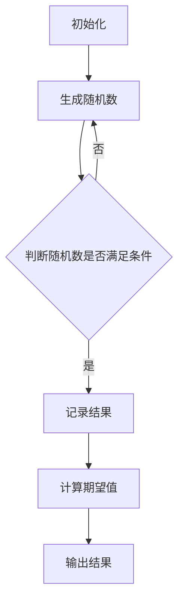
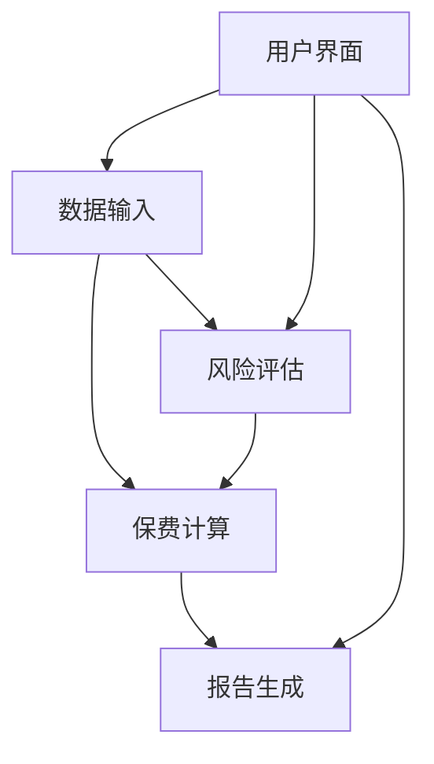
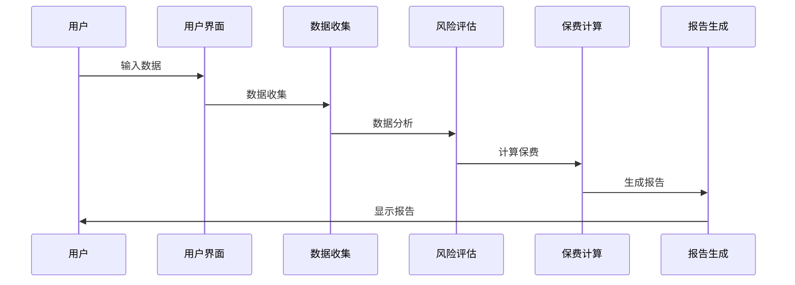

                 

# 数学与保险精算：保险产品的数学定价

## 关键词

- 保险精算
- 数学模型
- 保险产品定价
- 概率分布
- 蒙特卡洛模拟

## 摘要

本文旨在深入探讨保险精算中数学模型的应用，特别是在保险产品定价方面。通过详细解析利率、折现率、概率分布等核心概念，本文展示了如何利用数学工具来定量分析和评估保险风险。此外，本文还将介绍蒙特卡洛模拟算法，用于更精确地预测和定价复杂的保险产品。通过实际案例和系统架构分析，本文提供了对保险产品定价的全面理解，并指出了实践中需要注意的关键点。

## 第1章 引言

### 1.1 问题背景

#### 1.1.1 保险行业的重要性

保险行业是全球金融体系中不可或缺的一部分，它不仅为个人和企业提供了重要的风险保障，还促进了社会的稳定和经济的健康发展。保险产品种类繁多，包括但不限于健康保险、财产保险、人寿保险等。这些产品的共同目标是通过分散风险，减轻个人或企业在遭受意外损失时的经济负担。

#### 1.1.2 保险产品的特点

保险产品具有以下显著特点：

1. **风险分散**：保险公司通过大量客户的共同支付，分散个体风险。
2. **长期合同**：保险通常涉及长期合同，比如终身人寿保险。
3. **不确定性和概率**：保险的定价很大程度上依赖于对未来风险的预测和概率分析。
4. **复杂性和多样性**：不同类型的保险产品有不同的定价策略和风险评估方法。

#### 1.1.3 数学在保险精算中的应用

数学在保险精算中扮演着至关重要的角色。保险精算师利用数学模型来评估风险、计算保单保费、预测未来现金流等。关键的数学工具包括概率论、统计学、金融数学和计算方法等。

### 1.2 问题概述

#### 1.2.1 保险产品定价的挑战

保险产品定价面临着诸多挑战，包括：

1. **风险多样化**：不同保险产品的风险类型和程度各不相同。
2. **不确定因素**：未来风险的不确定性，如医疗费用趋势、自然灾害频率等。
3. **竞争压力**：保险公司需要保持竞争力，合理定价以吸引客户。
4. **法规合规**：保险公司需要遵守相关法律法规，确保定价的合理性和透明度。

#### 1.2.2 保险产品定价的核心要素

保险产品定价的核心要素包括：

1. **风险评估**：评估潜在风险，包括疾病、意外、自然灾害等。
2. **预期损失**：预测未来可能发生的损失，并据此定价。
3. **保费定价**：计算保费，以覆盖预期损失并获取利润。
4. **投资收益**：保险公司的投资收益也对保费定价有影响。

#### 1.2.3 目标与边界

保险产品定价的目标是确保保险公司能够长期稳健运营，同时为客户提供合理的风险保障。边界则包括法律法规的要求、市场承受能力以及公司的风险管理策略。

### 1.3 核心概念与联系

#### 1.3.1 利率、折现率与贴现率

利率是资金借贷的回报率，是时间价值的体现。折现率则是将未来现金流折算为现值的利率，用于评估保险产品的预期价值。贴现率则是特定于保险业务的利率，用于计算预期损失现值。

##### 1.3.1.1 利率的定义与计算

$$
i = \frac{r}{n} \times 100\%
$$

其中，\(i\) 是年利率，\(r\) 是实际利率，\(n\) 是每年的复利次数。

##### 1.3.1.2 折现率的定义与计算

$$
\text{折现率} = \left(1 + \frac{r}{n}\right)^{-n}
$$

##### 1.3.1.3 贴现率的定义与计算

$$
\text{贴现率} = \frac{\text{预期损失}}{\text{保障金额}}
$$

#### 1.3.2 概率分布与风险度量

概率分布描述了不同风险事件发生的可能性。常用的概率分布包括正态分布、泊松分布、二项分布等。

##### 1.3.2.1 概率分布的定义与类型

- **正态分布**：最常见的概率分布，描述数据围绕平均值分布的情况。
- **泊松分布**：描述事件在固定时间或空间内发生的频率。
- **二项分布**：描述在固定次数的试验中成功次数的概率。

##### 1.3.2.2 风险度的度量

风险度量的方法包括：

1. **期望值**：衡量风险的中心位置，计算公式为：
   $$
   E(X) = \sum_{i=1}^{n} x_i p_i
   $$
   其中，\(E(X)\) 是期望值，\(x_i\) 是可能的结果，\(p_i\) 是相应的概率。
   
2. **方差**：衡量风险的分散程度，计算公式为：
   $$
   \text{Var}(X) = E[(X - E(X))^2]
   $$

### 1.3.3 ER实体关系图

下面是ER实体关系图的示例，描述了保险产品定价相关的核心实体和关系：

```
[实体: 保险产品]
[实体: 客户]
[实体: 风险评估]

[关系: 保单]
[关系: 报价]
[关系: 损失计算]

```

### 1.3.4 概念属性特征对比表格

| 概念       | 定义                                                         | 属性特征                       |
|------------|--------------------------------------------------------------|--------------------------------|
| 利率       | 资金借贷的回报率                                             | 年利率、月利率等               |
| 折现率     | 将未来现金流折算为现值的利率                                 | 确定未来价值的现值             |
| 贴现率     | 保险业务中用于计算预期损失现值的利率                         | 预期损失与保障金额的比率       |
| 概率分布   | 描述风险事件发生可能性的函数                                 | 正态分布、泊松分布、二项分布等 |
| 风险度量   | 评估风险的方法                                               | 期望值、方差等                 |

## 1.4 数学模型和数学公式

### 1.4.1 期望值的计算

期望值是衡量随机变量平均取值的重要指标。对于离散型随机变量，期望值的计算公式如下：

$$
E(X) = \sum_{i=1}^{n} x_i p_i
$$

其中，\(x_i\) 是随机变量可能取的值，\(p_i\) 是相应的概率。

对于连续型随机变量，期望值的计算公式为：

$$
E(X) = \int_{-\infty}^{\infty} x f(x) dx
$$

其中，\(f(x)\) 是随机变量 \(X\) 的概率密度函数。

#### 1.4.1.1 公式表示

离散型随机变量期望值：

$$
E(X) = \sum_{i=1}^{n} x_i p_i
$$

连续型随机变量期望值：

$$
E(X) = \int_{-\infty}^{\infty} x f(x) dx
$$

#### 1.4.1.2 详细讲解

期望值的计算是保险精算中的一项基础工作。通过期望值，可以预测保险产品的未来收益和损失。对于离散型随机变量，我们通过概率分布计算出每个可能结果的期望值。对于连续型随机变量，则通过积分来计算期望值。

#### 1.4.1.3 举例说明

假设一个保险产品有三种可能的结果：无损失（概率0.5），小额损失（概率0.3），大额损失（概率0.2）。无损失的金额为0元，小额损失的金额为100元，大额损失的金额为500元。计算该保险产品的期望值。

$$
E(X) = 0 \times 0.5 + 100 \times 0.3 + 500 \times 0.2 = 0 + 30 + 100 = 130
$$

因此，该保险产品的期望损失为130元。

### 1.4.2 离散型随机变量的期望与方差

#### 1.4.2.1 公式表示

离散型随机变量期望值：

$$
E(X) = \sum_{i=1}^{n} x_i p_i
$$

离散型随机变量方差：

$$
\text{Var}(X) = E[(X - E(X))^2]
$$

#### 1.4.2.2 详细讲解

方差是衡量随机变量取值分散程度的指标。对于离散型随机变量，方差计算需要先求出期望值，然后计算每个取值与期望值的差的平方，最后取平均值。通过方差，可以评估保险产品风险的大小。

#### 1.4.2.3 举例说明

假设一个离散型随机变量 \(X\) 有三种可能的结果：0（概率0.3），1（概率0.5），2（概率0.2）。计算 \(X\) 的期望值和方差。

期望值：

$$
E(X) = 0 \times 0.3 + 1 \times 0.5 + 2 \times 0.2 = 0 + 0.5 + 0.4 = 0.9
$$

方差：

$$
\text{Var}(X) = E[(X - E(X))^2] = (0 - 0.9)^2 \times 0.3 + (1 - 0.9)^2 \times 0.5 + (2 - 0.9)^2 \times 0.2 = 0.246
$$

因此，该离散型随机变量的期望值为0.9，方差为0.246。

### 1.4.3 连续型随机变量的概率密度函数与期望

#### 1.4.3.1 公式表示

连续型随机变量概率密度函数：

$$
f(x) = \frac{1}{\sqrt{2\pi\sigma^2}} e^{-\frac{(x-\mu)^2}{2\sigma^2}}
$$

其中，\(\mu\) 是均值，\(\sigma^2\) 是方差。

连续型随机变量期望值：

$$
E(X) = \int_{-\infty}^{\infty} x f(x) dx
$$

#### 1.4.3.2 详细讲解

连续型随机变量的概率密度函数描述了随机变量在不同取值下的概率分布。通过概率密度函数，可以计算随机变量的期望值，这是评估保险产品风险的重要指标。

#### 1.4.3.3 举例说明

假设一个正态分布的随机变量 \(X\)，其均值为10，方差为4。计算 \(X\) 的概率密度函数和期望值。

概率密度函数：

$$
f(x) = \frac{1}{\sqrt{2\pi \cdot 4}} e^{-\frac{(x-10)^2}{2\cdot 4}} = \frac{1}{2\sqrt{2\pi}} e^{-\frac{(x-10)^2}{8}}
$$

期望值：

$$
E(X) = \int_{-\infty}^{\infty} x f(x) dx = 10
$$

因此，该正态分布随机变量的概率密度函数如上所示，期望值为10。

## 1.5 算法原理讲解

### 1.5.1 蒙特卡洛模拟

蒙特卡洛模拟是一种基于概率和统计的方法，通过模拟随机事件来近似计算数学期望和概率分布。它广泛应用于保险精算、金融工程和科学计算等领域。

#### 1.5.1.1 算法mermaid流程图



#### 1.5.1.2 Python源代码

```python
import random

def monte_carlo_simulation(experiments, condition_func, result_func):
    results = []
    for _ in range(experiments):
        x = random.random()  # 生成随机数
        if condition_func(x):  # 判断随机数是否满足条件
            result = result_func(x)
            results.append(result)
    return sum(results) / len(results)  # 计算期望值

# 示例：条件函数和结果函数
def condition_func(x):
    return x > 0.5

def result_func(x):
    return x * 2

# 运行蒙特卡洛模拟
mean = monte_carlo_simulation(10000, condition_func, result_func)
print(f"期望值: {mean}")
```

#### 1.5.1.3 算法原理的数学模型和公式

蒙特卡洛模拟的数学模型可以表示为：

$$
E(X) = \frac{1}{N} \sum_{i=1}^{N} X_i
$$

其中，\(X_i\) 是第 \(i\) 次模拟的结果，\(N\) 是模拟次数。

#### 1.5.1.4 举例说明

假设我们要估计一个概率事件 \(P(A)\) 的概率，其中 \(A\) 是在区间 \([0, 1]\) 内随机选取的数大于0.5。我们可以使用蒙特卡洛模拟来近似计算这个概率。

```python
import random

def monte_carlo_probability(experiments, condition):
    successes = 0
    for _ in range(experiments):
        x = random.random()
        if x > condition:
            successes += 1
    return successes / experiments

# 运行蒙特卡洛概率模拟
p_a = monte_carlo_probability(10000, 0.5)
print(f"P(A): {p_a}")
```

通过多次模拟，我们可以得到 \(P(A)\) 的近似值。

## 1.6 系统分析与架构设计方案

### 1.6.1 保险产品定价系统介绍

#### 1.6.1.1 项目介绍

保险产品定价系统是一个用于计算和评估保险产品保费的系统。该系统集成了多种数学模型和算法，包括概率分布、期望值计算和蒙特卡洛模拟等，旨在提供精确和可靠的保险产品定价。

#### 1.6.1.2 系统功能设计

系统的主要功能包括：

1. **数据收集**：收集与保险产品相关的数据，如客户信息、风险评估指标、历史损失数据等。
2. **风险评估**：使用数学模型和算法对客户的风险进行评估。
3. **保费计算**：根据风险评估结果计算保险产品的保费。
4. **报告生成**：生成详细的保费计算报告，包括风险评估指标、保费计算过程和结果等。
5. **用户界面**：提供用户友好的界面，方便用户输入数据、查看报告和调整参数。

### 1.6.2 系统架构设计

#### 1.6.2.1 系统架构设计mermaid架构图



#### 1.6.2.2 系统接口设计和系统交互

系统接口设计和系统交互的mermaid序列图如下：



## 第2章 保险精算基础

### 2.1 保险精算的基本概念

#### 2.1.1 保险精算的定义与作用

保险精算是保险业的核心学科，它通过数学和统计学方法，对保险产品的风险进行评估和管理。保险精算的主要作用包括：

1. **保费定价**：通过评估风险，合理确定保险产品的保费水平。
2. **财务规划**：为保险公司提供财务预测和投资策略，确保公司的长期稳健运营。
3. **风险管理**：帮助保险公司识别和控制风险，降低损失。
4. **法规合规**：确保保险公司的运营符合相关法律法规。

#### 2.1.2 保险精算的核心要素

保险精算的核心要素包括：

1. **风险评估**：评估客户的保险需求，预测可能发生的风险。
2. **保费计算**：根据风险评估结果，计算保险产品的保费。
3. **准备金评估**：确定保险公司应保留的未到期责任准备金和未实现利润准备金。
4. **投资策略**：制定合理的投资策略，确保保险基金的稳健增值。

#### 2.1.3 保险精算的历史与发展

保险精算的历史可以追溯到17世纪的欧洲，当时荷兰和英国等国家的保险公司开始采用数学方法来评估风险和计算保费。随着概率论和统计学的发展，保险精算逐渐形成了一套完整的理论体系。20世纪以来，计算机技术的应用极大地推动了保险精算的发展，使其变得更加精确和高效。

### 2.2 保险精算的主要方法

#### 2.2.1 风险管理方法

风险管理方法是保险精算中至关重要的一环，它包括以下几个步骤：

1. **风险识别**：识别可能影响保险公司财务状况的风险因素，如疾病、自然灾害、信用风险等。
2. **风险评估**：使用数学模型和统计方法，评估这些风险对保险公司的潜在影响。
3. **风险控制**：制定风险控制措施，如设置合理的保险限额、建立风险储备金等，以降低风险。
4. **风险规避**：通过转移风险或避免高风险业务，减少保险公司面临的潜在损失。
5. **风险分散**：通过多样化的投资和业务布局，分散风险，降低单一风险事件的影响。

#### 2.2.2 财务方法

财务方法是保险精算的重要组成部分，它主要包括以下方面：

1. **财务预测**：根据风险评估结果，预测保险公司的未来现金流和财务状况。
2. **资产负债管理**：通过合理的资产负债配置，确保保险公司的财务稳定性和盈利能力。
3. **投资收益与风险控制**：制定科学的投资策略，确保保险基金的投资收益，同时控制投资风险。

#### 2.2.2.1 财务预测与评估

财务预测是保险精算中的核心任务，它包括以下几个方面：

1. **未来现金流预测**：预测保险公司的未来现金流，包括保费收入、赔付支出、投资收益等。
2. **资产负债表预测**：预测保险公司的未来资产负债表，包括资产、负债和所有者权益的变化。
3. **利润预测**：预测保险公司的未来利润，包括净利润和综合收益。

#### 2.2.2.2 资产负债管理

资产负债管理是确保保险公司财务稳定性的关键，它包括以下几个方面：

1. **资产配置**：根据保险公司的投资目标和风险偏好，合理配置资产，包括股票、债券、房地产等。
2. **负债管理**：通过合理的负债策略，降低保险公司的资金成本和财务风险。
3. **流动性管理**：确保保险公司拥有足够的流动性，以应对突发情况和财务压力。

#### 2.2.2.3 投资收益与风险控制

投资收益与风险控制是保险精算中的关键环节，它包括以下几个方面：

1. **投资策略**：制定科学的投资策略，确保保险基金的投资收益。
2. **风险控制**：通过风险分散、资产配置和投资组合优化等方法，控制投资风险。
3. **业绩评估**：定期评估投资业绩，调整投资策略，以适应市场变化和风险偏好。

### 2.3 保险精算的应用案例

#### 2.3.1 生命保险精算

生命保险精算是保险精算中的一个重要领域，它涉及对保险产品的风险评估和定价。生命保险精算的主要应用包括：

1. **风险评估**：评估被保险人的寿命风险，包括年龄、性别、健康状况等。
2. **保费计算**：根据风险评估结果，计算适合的保费水平。
3. **准备金评估**：确定保险公司应保留的未到期责任准备金和未实现利润准备金。

#### 2.3.1.1 生命保险定价原理

生命保险定价主要基于以下原理：

1. **风险分散**：通过大量被保险人的共同支付，分散个体风险。
2. **概率论**：使用概率论和统计学方法，预测未来风险和损失。
3. **预期收益**：根据风险评估结果，确定合理的保费水平，确保保险公司能够盈利。

#### 2.3.1.2 生命保险产品分析

生命保险产品包括定期寿险、终身寿险、养老保险等多种类型。每种产品都有其独特的定价原理和风险评估方法。例如：

1. **定期寿险**：主要针对一定期限内的风险，保费较低，适合短期保障需求。
2. **终身寿险**：提供终身保障，保费较高，适合长期财务规划。
3. **养老保险**：结合保险和投资功能，为退休提供保障。

#### 2.3.2 财产保险精算

财产保险精算主要涉及对财产损失的风险评估和定价。财产保险精算的主要应用包括：

1. **风险评估**：评估财产损失风险，包括火灾、盗窃、自然灾害等。
2. **保费计算**：根据风险评估结果，计算适合的保费水平。
3. **准备金评估**：确定保险公司应保留的未到期责任准备金和未实现利润准备金。

#### 2.3.2.1 财产保险定价原理

财产保险定价主要基于以下原理：

1. **风险分散**：通过大量被保险人的共同支付，分散个体风险。
2. **历史数据**：利用历史数据，分析财产损失的发生概率和损失程度。
3. **预期收益**：根据风险评估结果，确定合理的保费水平，确保保险公司能够盈利。

#### 2.3.2.2 财产保险产品分析

财产保险产品包括房屋保险、汽车保险、企业财产保险等多种类型。每种产品都有其独特的定价原理和风险评估方法。例如：

1. **房屋保险**：主要保障房屋及其附属设施，保费通常与房屋价值、地理位置等相关。
2. **汽车保险**：主要保障车辆及其使用过程中可能发生的损失，保费通常与车型、驾驶经验等相关。
3. **企业财产保险**：主要保障企业的资产和经营活动，保费通常与企业的规模、行业特点等相关。

#### 2.3.3 健康保险精算

健康保险精算主要涉及对健康风险的风险评估和定价。健康保险精算的主要应用包括：

1. **风险评估**：评估被保险人的健康状况和医疗需求。
2. **保费计算**：根据风险评估结果，计算适合的保费水平。
3. **准备金评估**：确定保险公司应保留的未到期责任准备金和未实现利润准备金。

#### 2.3.3.1 健康保险定价原理

健康保险定价主要基于以下原理：

1. **风险分散**：通过大量被保险人的共同支付，分散个体风险。
2. **医疗数据**：利用医疗数据，分析健康风险的发生概率和损失程度。
3. **预期收益**：根据风险评估结果，确定合理的保费水平，确保保险公司能够盈利。

#### 2.3.3.2 健康保险产品分析

健康保险产品包括医疗保险、大病保险、健康体检保险等多种类型。每种产品都有其独特的定价原理和风险评估方法。例如：

1. **医疗保险**：主要保障被保险人的医疗费用，保费通常与年龄段、既往病史等相关。
2. **大病保险**：主要保障被保险人因重大疾病产生的费用，保费通常较高，保障力度大。
3. **健康体检保险**：主要保障被保险人进行健康体检的费用，保费较低，适合健康人群。

### 2.4 本章小结

本章详细介绍了保险精算的基本概念、主要方法和应用案例。通过分析生命保险、财产保险和健康保险等不同类型的保险产品，我们可以看到保险精算在保险产品定价中的重要作用。保险精算不仅涉及数学和统计方法，还需要结合实际业务情况和市场环境，确保保险产品的合理定价和风险控制。未来的研究和实践将更加注重数据的利用和算法的创新，以提高保险精算的精确度和效率。

## 附录：最佳实践、注意事项与拓展阅读

### 最佳实践

1. **数据收集与处理**：确保数据的准确性和完整性，使用先进的数据清洗和处理技术，提高数据分析的可靠性。
2. **风险评估模型**：根据不同类型保险产品的特点，选择合适的风险评估模型，结合历史数据和实时数据，提高风险评估的准确性。
3. **投资策略**：制定科学合理的投资策略，平衡风险与收益，确保保险基金的稳健增值。

### 注意事项

1. **法规合规**：遵守相关法律法规，确保保险产品定价的合理性和透明度。
2. **市场适应**：关注市场变化和客户需求，及时调整保险产品的设计和定价策略。
3. **风险管理**：加强风险识别、评估和控制，降低保险公司的运营风险。

### 拓展阅读

1. **《保险精算原理与应用》**：详细介绍了保险精算的基本理论、方法和应用案例。
2. **《蒙特卡洛方法及其应用》**：深入探讨了蒙特卡洛模拟在保险精算和其他领域的应用。
3. **《风险管理与金融工程》**：介绍了风险管理的理论基础和实践方法，适用于保险精算的学习和研究。

作者：AI天才研究院/AI Genius Institute & 禅与计算机程序设计艺术 /Zen And The Art of Computer Programming

---

本文旨在提供对保险精算中数学模型和应用的综合理解，包括核心概念、数学公式、算法原理以及系统架构设计。通过实际案例和系统实现，读者可以更好地掌握保险产品定价的数学基础和实用技巧。在未来的研究和实践中，不断优化算法和提升数据处理能力，将有助于提高保险精算的精确度和效率，为保险行业的持续发展贡献力量。

