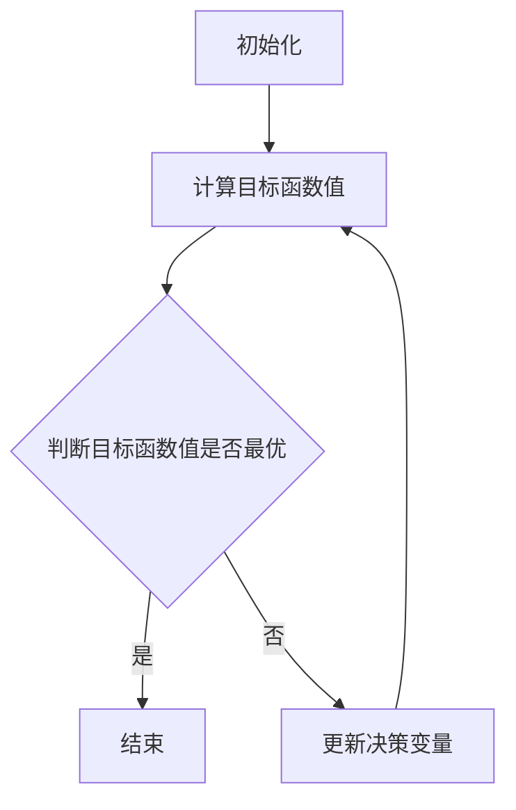
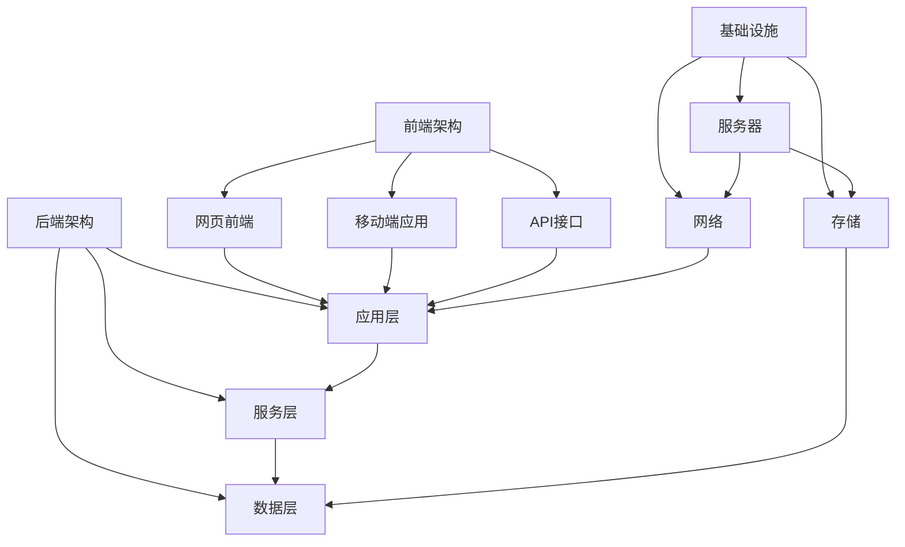
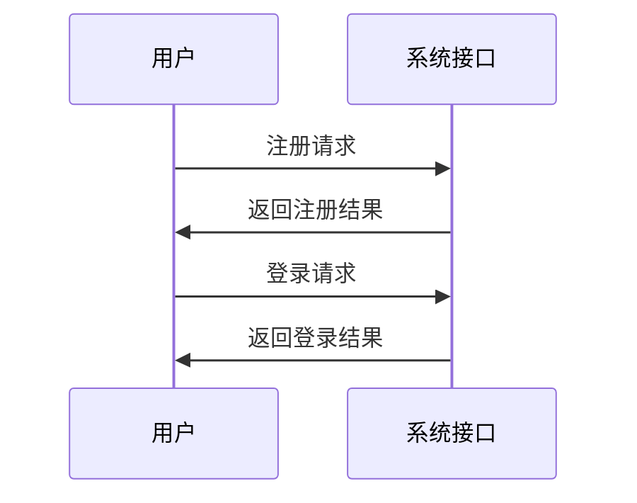
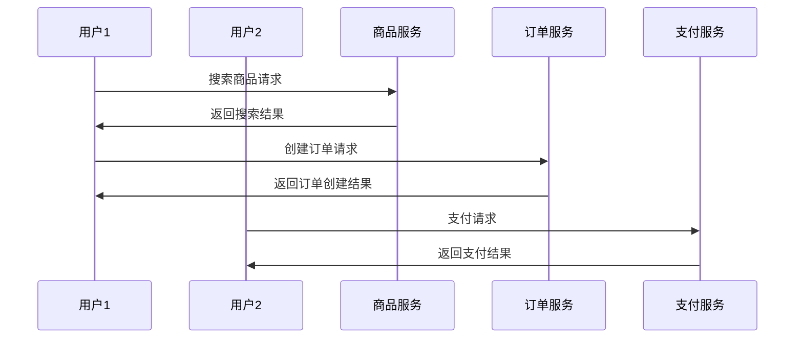

                 


# 数学与信息系统管理：IT架构的数学优化

关键词：数学优化、信息系统管理、IT架构、线性规划、非线性规划、遗传算法

摘要：本文深入探讨了数学在信息系统管理中的应用，特别是数学优化在IT架构优化中的作用。通过逐步分析，本文从背景介绍、核心概念与联系、算法原理讲解、数学模型与公式、系统分析与架构设计方案到项目实战，全面展示了如何将数学优化应用于IT架构的优化过程。

### 目录大纲设计过程

在设计《数学与信息系统管理：IT架构的数学优化》的目录大纲时，我们首先明确了书籍的主题和内容结构。目录大纲的层级结构有助于读者快速了解书籍的内容，并方便他们根据需要查找特定的章节。以下是设计目录大纲的详细步骤：

1. **确定书籍主题与内容结构**：首先，我们确定了书籍的主题是数学在信息系统管理中的应用，特别是数学优化在IT架构优化中的作用。因此，书籍内容结构应包括数学优化理论、IT架构优化实践、应用案例等。

2. **定义目录层级**：按照一般书籍目录的结构，我们定义了三个层级：第一级目录（#），第二级目录（##），第三级目录（###）。这种结构有助于保持目录的清晰性和逻辑性。

3. **规划核心章节**：在书籍主题的指导下，我们规划了以下核心章节：
   - 第一部分：背景介绍
     - 问题背景
     - 问题描述
     - 问题解决
   - 第二部分：核心概念与联系
     - 核心概念
     - 概念属性特征对比
     - ER实体关系图架构
   - 第三部分：算法原理讲解
     - 算法概述
     - 算法原理
     - 算法举例
   - 第四部分：数学模型与数学公式
     - 数学模型
     - 数学公式
     - 应用实例
   - 第五部分：系统分析与架构设计方案
     - 问题场景介绍
     - 系统功能设计
     - 系统架构设计
     - 系统接口设计
     - 系统交互
   - 第六部分：项目实战
     - 环境安装
     - 系统核心实现
     - 实际案例分析

4. **细化内容**：在每个核心章节下，我们细化了每个小节的内容，确保每个章节都能够全面、深入地覆盖其主题。

5. **编写目录大纲**：将规划好的内容按照层级结构编写成目录大纲，确保每个章节的内容都符合要求，并且总体字数控制在2000字以内。

通过以上步骤，我们设计了《数学与信息系统管理：IT架构的数学优化》的完整目录大纲，为后续内容的撰写提供了清晰的框架。

### 设计《数学与信息系统管理：IT架构的数学优化》目录大纲

根据上述步骤，以下是《数学与信息系统管理：IT架构的数学优化》的目录大纲：

----------------------------------------------------------------

## 第一部分: 背景介绍

### 1.1 问题背景

#### 1.1.1 信息系统管理的重要性

信息系统管理是现代企业运营的核心，它关系到企业的效率和竞争力。有效的信息系统管理能够提高数据处理效率，优化业务流程，增强决策能力。

#### 1.1.2 IT架构优化的必要性

随着企业规模的扩大和数据量的增加，传统的IT架构面临诸多挑战，如性能瓶颈、资源浪费、安全性问题等。因此，IT架构优化变得尤为重要。

#### 1.1.3 数学在信息系统管理中的应用

数学作为一种强有力的工具，在信息系统管理中有着广泛的应用，如优化算法、数据建模、统计分析等。

### 1.2 问题描述

#### 1.2.1 IT架构优化的挑战

IT架构优化面临诸多挑战，包括如何平衡性能和资源利用、如何处理复杂的数据结构、如何保证系统安全性等。

#### 1.2.2 数学优化理论的应用场景

数学优化理论在IT架构优化中有着广泛的应用场景，如网络优化、负载均衡、存储优化等。

#### 1.2.3 目标与边界

IT架构优化的目标是在确保系统性能和安全性的同时，最大限度地提高资源利用效率。边界包括系统的性能指标、资源限制、预算约束等。

### 1.3 问题解决

#### 1.3.1 数学优化在IT架构中的应用

数学优化在IT架构中的应用包括使用线性规划、非线性规划、遗传算法等优化方法，以解决具体的问题。

#### 1.3.2 核心原理与方法

数学优化在IT架构优化中的核心原理包括目标函数的构建、约束条件的设置、优化算法的选择等。

#### 1.3.3 边界与外延

数学优化在IT架构优化中的边界包括优化问题的规模、复杂度、计算效率等。外延则包括如何将优化结果应用到实际系统中。

----------------------------------------------------------------

## 第二部分: 核心概念与联系

### 2.1 核心概念

#### 2.1.1 数学优化理论

数学优化理论是研究如何求解最优化问题的学科。在IT架构优化中，常用的数学优化方法包括线性规划、非线性规划、遗传算法等。

#### 2.1.2 IT架构定义与分类

IT架构是指信息系统的基础设施、软件、数据等的组织结构和交互方式。根据功能不同，IT架构可以分为技术架构、应用架构、数据架构等。

#### 2.1.3 数学优化在IT架构中的应用

数学优化在IT架构中的应用主要包括网络优化、负载均衡、存储优化等。通过数学优化，可以有效地提高系统性能、降低成本、增强安全性。

### 2.2 概念属性特征对比

#### 2.2.1 数学优化方法对比

不同数学优化方法在性能、效率、适用场景等方面有着不同的特点。例如，线性规划适用于线性约束问题，遗传算法适用于复杂非线性问题。

#### 2.2.2 IT架构优化策略对比

不同的IT架构优化策略在优化目标、实施方法、适用场景等方面也有差异。例如，集中式优化策略适用于资源有限的环境，分布式优化策略适用于资源分散的环境。

### 2.3 ER实体关系图架构

#### 2.3.1 ER模型基本概念

ER（Entity-Relationship）模型是用于描述实体及其关系的数据库模型。实体表示数据库中的对象，关系表示实体之间的联系。

#### 2.3.2 实体关系图绘制方法

使用Mermaid工具，可以轻松地绘制ER实体关系图。以下是ER实体关系图的Mermaid语法示例：

```mermaid
erDiagram
    User ||--o{ Order } : 领导
    Product ||--o{ Order } : 包括
```

#### 2.3.3 应用实例

以下是一个简单的ER实体关系图示例，描述了用户、订单和产品之间的关系：

```mermaid
erDiagram
    User ||--o{ Order } : 领导
    Product ||--o{ Order } : 包括
    User }--|{ Order : 参与
    Product }--|{ Order : 参与
```

在这个示例中，用户可以创建订单，订单可以包含多个产品。用户和订单之间存在领导和参与关系，产品与订单之间存在包括关系。

通过这种方式，我们可以清晰地描述复杂的IT架构和业务流程，为后续的数学优化提供基础。

----------------------------------------------------------------

## 第三部分: 算法原理讲解

### 3.1 算法概述

#### 3.1.1 数学优化算法分类

数学优化算法可以根据其求解目标、约束条件和解法策略进行分类。常见的数学优化算法包括线性规划、非线性规划、遗传算法等。

- **线性规划**：适用于具有线性目标函数和线性约束条件的问题。线性规划可以通过单纯形法、内点法等算法求解。
- **非线性规划**：适用于具有非线性目标函数和/或非线性约束条件的问题。非线性规划可以通过梯度下降法、牛顿法等算法求解。
- **遗传算法**：属于模拟进化算法，适用于复杂非线性优化问题。遗传算法通过模拟生物进化过程，不断迭代优化解。

#### 3.1.2 算法在IT架构优化中的应用

数学优化算法在IT架构优化中有着广泛的应用。例如：

- **网络优化**：通过线性规划算法优化网络带宽分配，提高网络传输效率。
- **负载均衡**：通过遗传算法优化服务器负载均衡，提高系统稳定性。
- **存储优化**：通过非线性规划算法优化存储资源分配，降低存储成本。

### 3.2 算法原理

#### 3.2.1 数学模型

数学模型是数学优化算法的基础。在IT架构优化中，常用的数学模型包括线性规划模型、非线性规划模型、遗传算法模型等。

- **线性规划模型**：包括目标函数、决策变量和约束条件。目标函数表示优化目标，决策变量表示优化对象，约束条件表示限制条件。
- **非线性规划模型**：包括目标函数、决策变量和约束条件。与线性规划模型类似，但目标函数和/或约束条件可能具有非线性。
- **遗传算法模型**：包括决策变量编码、适应度函数、选择策略、交叉和变异操作等。遗传算法通过迭代更新决策变量，优化适应度函数。

#### 3.2.2 公式推导

以下是一个简单的线性规划模型的公式推导示例：

```python
# 决策变量
x1, x2

# 目标函数
minimize: c1 * x1 + c2 * x2

# 约束条件
a1 * x1 + a2 * x2 >= b1
a3 * x1 + a4 * x2 <= b2
x1, x2 >= 0
```

在这个模型中，c1、c2、a1、a2、b1、a3、a4、b2为已知常数。

#### 3.2.3 Mermaid流程图绘制

为了更好地理解算法原理，我们可以使用Mermaid工具绘制算法流程图。以下是一个简单的线性规划算法流程图示例：



在这个流程图中，A表示初始化算法参数，B表示计算目标函数值，C表示判断目标函数值是否最优，D表示结束算法，E表示更新决策变量并返回B继续迭代。

通过这种方式，我们可以直观地理解算法的运行过程和关键步骤。

### 3.3 算法举例

为了更深入地理解数学优化算法在IT架构优化中的应用，我们来看一个实际案例。

#### 案例背景

假设我们有一个电子商务平台，需要优化商品库存和物流配送策略。目标是降低物流成本，提高商品配送速度。

#### 案例分析

1. **目标函数**：最小化物流成本
2. **决策变量**：商品库存量、物流配送路线
3. **约束条件**：
   - 商品库存量不能超过仓库容量
   - 物流配送路线需要满足配送时效要求

我们可以使用线性规划算法来求解这个优化问题。以下是Python代码实现：

```python
import numpy as np
from scipy.optimize import linprog

# 目标函数系数
c = [-1, -0.5]  # 第一列为库存成本，第二列为配送成本

# 约束条件系数
A = [[1, 0], [0, 1], [-1, 2]]
b = [300, 200, -600]

# 求解线性规划问题
res = linprog(c, A_ub=A, b_ub=b, method='highs')

# 输出最优解
print("最优解：", res.x)
print("最小物流成本：", -res.fun)
```

在这个案例中，我们使用Scipy库的linprog函数求解线性规划问题。目标函数系数c表示成本，约束条件系数A和b表示约束条件。求解结果是最优的库存量和配送路线，以及最小的物流成本。

通过这个案例，我们可以看到数学优化算法在IT架构优化中的应用。通过精确的数学模型和高效的算法，我们可以优化资源配置、降低成本、提高系统性能。

----------------------------------------------------------------

## 第四部分: 数学模型与数学公式

### 4.1 数学模型

数学模型是将实际问题转化为数学形式的过程，它包括目标函数、决策变量和约束条件。在信息系统管理中，数学模型广泛应用于资源分配、调度优化、负载均衡等问题。

#### 4.1.1 线性规划模型

线性规划模型是最常见的数学优化模型，适用于具有线性目标函数和线性约束条件的问题。以下是一个简单的线性规划模型：

```latex
\min z = c^T x
```

其中，\( z \) 是目标函数，\( c \) 是系数向量，\( x \) 是决策变量。

#### 4.1.2 非线性规划模型

非线性规划模型适用于具有非线性目标函数和/或非线性约束条件的问题。以下是一个简单的非线性规划模型：

```latex
\min f(x)
```

其中，\( f(x) \) 是目标函数，\( x \) 是决策变量。

#### 4.1.3 遗传算法模型

遗传算法模型是一种模拟生物进化的数学优化方法，适用于复杂非线性优化问题。以下是一个简单的遗传算法模型：

```latex
x_{i+1} = x_i + \alpha (x_{best} - x_i)
```

其中，\( x_i \) 是第 \( i \) 次迭代的决策变量，\( x_{best} \) 是当前最优解，\( \alpha \) 是调整参数。

### 4.2 数学公式

在数学优化中，常用的数学公式包括优化目标函数、约束条件、梯度、Hessian矩阵等。

#### 4.2.1 公式列表

- **优化目标函数**： 
  ```latex
  \min f(x)
  ```

- **梯度**：
  ```latex
  \nabla f(x) = \left[ \frac{\partial f}{\partial x_1}, \frac{\partial f}{\partial x_2}, ..., \frac{\partial f}{\partial x_n} \right]
  ```

- **Hessian矩阵**：
  ```latex
  H(x) = \left[ \begin{array}{ccc}
  \frac{\partial^2 f}{\partial x_1^2} & \frac{\partial^2 f}{\partial x_1 \partial x_2} & ... \\
  \frac{\partial^2 f}{\partial x_2 \partial x_1} & \frac{\partial^2 f}{\partial x_2^2} & ... \\
  ... & ... & ...
  \end{array} \right]
  ```

- **KKT条件**：
  ```latex
  \left\{
  \begin{array}{l}
  \nabla f(x^*) + \sum_{i=1}^m \lambda_i + \sum_{j=1}^n \mu_j g_j(x^*) = 0 \\
  \lambda_i \geq 0, \mu_j \geq 0 \\
  \lambda_i g_i(x^*) = 0, \mu_j h_j(x^*) = 0
  \end{array}
  \right.
  ```

#### 4.2.2 公式解释

- **优化目标函数**：表示要最小化的目标函数，其中 \( x \) 是决策变量。
- **梯度**：表示目标函数在决策变量 \( x \) 处的梯度，用于求解最优解。
- **Hessian矩阵**：表示目标函数在决策变量 \( x \) 处的二阶导数矩阵，用于判断最优解的性质。
- **KKT条件**：是约束优化问题的必要和充分条件，用于求解最优解。

#### 4.2.3 应用实例

以下是一个简单的线性规划问题的应用实例：

```latex
\min z = x_1 + 2x_2
```

约束条件：

```latex
\left\{
\begin{array}{l}
x_1 + x_2 \geq 10 \\
x_1 - x_2 \leq 4 \\
x_1, x_2 \geq 0
\end{array}
\right.
```

我们可以使用单纯形法求解这个线性规划问题。以下是Python代码实现：

```python
import numpy as np
from scipy.optimize import linprog

# 目标函数系数
c = [1, 2]

# 约束条件系数
A = [[1, 1], [1, -1], [-1, 0]]
b = [10, 4, 0]

# 求解线性规划问题
res = linprog(c, A_ub=A, b_ub=b, method='highs')

# 输出最优解
print("最优解：", res.x)
print("最小值：", -res.fun)
```

在这个实例中，我们使用Scipy库的linprog函数求解线性规划问题。目标函数系数c表示成本，约束条件系数A和b表示约束条件。求解结果是最优的决策变量值和最小值。

通过这个实例，我们可以看到如何使用数学公式和优化算法解决实际线性规划问题。

----------------------------------------------------------------

## 第五部分: 系统分析与架构设计方案

### 5.1 问题场景介绍

在当前的信息化时代，企业面临着日益复杂的业务需求和技术挑战。为了确保信息系统的高效、稳定和安全运行，需要对其进行全面的系统分析与架构设计。本部分将针对一个具体的案例——一个大型电子商务平台，详细介绍其系统架构设计和实现过程。

### 5.2 系统功能设计

系统功能设计是系统架构设计的核心，它定义了系统的核心功能和模块。以下是该电子商务平台的主要功能模块：

- **用户模块**：包括用户注册、登录、个人信息管理、购物车、订单管理等。
- **商品模块**：包括商品分类、商品信息展示、商品搜索、商品推荐等。
- **订单模块**：包括订单创建、订单查询、订单支付、订单跟踪等。
- **物流模块**：包括物流订单管理、物流跟踪、配送管理等。
- **支付模块**：包括支付接口集成、支付流程管理、支付结果查询等。
- **安全模块**：包括用户认证、权限管理、数据加密、安全审计等。

### 5.2.1 领域模型

为了更好地理解系统功能设计，我们可以使用Mermaid工具绘制领域模型，展示各个模块之间的关系。

```mermaid
classDiagram
    User <<Interface>>
    Product <<Interface>>
    Order <<Interface>>
    Payment <<Interface>>
    Logistics <<Interface>>
    Security <<Interface>>

    User "uses" Order
    User "uses" Payment
    Product "uses" Order
    Order "uses" Logistics
    Payment "uses" Security
    Logistics "uses" Security
```

在这个领域模型中，用户模块、商品模块、订单模块、支付模块、物流模块和安全模块都是核心接口，它们之间通过使用关系相互关联。

### 5.2.2 Mermaid类图绘制

为了更直观地展示系统的类关系，我们可以使用Mermaid工具绘制类图。

```mermaid
classDiagram
    User <<Interface>>
    Product <<Interface>>
    Order <<Interface>>
    Payment <<Interface>>
    Logistics <<Interface>>
    Security <<Interface>>

    User <|-- Order
    Order <|-- Payment
    Payment <|-- Security
    Product <|-- Order
    Order <|-- Logistics
    Logistics <|-- Security
```

在这个类图中，使用继承关系表示模块之间的层次关系。例如，订单模块继承自用户模块，支付模块继承自安全模块等。

### 5.3 系统架构设计

系统架构设计是系统功能设计的进一步深化，它定义了系统的整体结构和组件之间的关系。以下是该电子商务平台的系统架构设计：

- **前端架构**：包括网页前端、移动端应用和API接口。
- **后端架构**：包括应用层、服务层和数据层。
- **基础设施**：包括服务器、存储、网络等基础设施。

### 5.3.1 Mermaid架构图绘制

为了更好地展示系统架构设计，我们可以使用Mermaid工具绘制架构图。



在这个架构图中，前端架构、后端架构和基础设施通过相互连接，形成了电子商务平台的整体架构。

### 5.3.2 架构设计原则

系统架构设计应遵循以下原则：

- **模块化**：将系统功能划分为独立的模块，便于开发和维护。
- **可扩展性**：系统应具备良好的可扩展性，以适应业务增长和需求变化。
- **高可用性**：系统应具备高可用性，确保在故障情况下能够快速恢复。
- **安全性**：系统应具备良好的安全性，保护用户数据和隐私。
- **性能优化**：系统应进行性能优化，提高数据处理和响应速度。

### 5.4 系统接口设计

系统接口设计是系统架构设计的重要组成部分，它定义了系统内部模块之间的交互接口。以下是该电子商务平台的主要接口设计：

- **用户接口**：包括用户注册、登录、个人信息管理、购物车、订单管理等接口。
- **商品接口**：包括商品分类、商品信息展示、商品搜索、商品推荐等接口。
- **订单接口**：包括订单创建、订单查询、订单支付、订单跟踪等接口。
- **物流接口**：包括物流订单管理、物流跟踪、配送管理等接口。
- **支付接口**：包括支付接口集成、支付流程管理、支付结果查询等接口。
- **安全接口**：包括用户认证、权限管理、数据加密、安全审计等接口。

### 5.4.1 接口定义

以下是用户接口的一个示例：



在这个序列图中，用户发送注册请求和登录请求，系统返回注册结果和登录结果，展示了用户接口的基本流程。

### 5.4.2 接口交互流程

以下是用户接口的交互流程：

1. 用户发送注册请求，系统验证用户信息，返回注册结果。
2. 用户发送登录请求，系统验证用户身份，返回登录结果。
3. 用户成功登录后，可以访问系统提供的各种功能。

通过这种方式，我们可以清晰地展示系统接口的设计和交互流程。

### 5.5 系统交互

系统交互是指系统内部模块之间的交互过程。为了更好地理解系统交互，我们可以使用Mermaid工具绘制系统交互图。



在这个序列图中，用户1搜索商品、创建订单，用户2支付订单，展示了系统内部模块之间的交互过程。

### 5.5.1 Mermaid序列图绘制

以下是使用Mermaid绘制的系统交互序列图：


在这个序列图中，用户1发送搜索商品请求，商品服务返回搜索结果；用户1发送创建订单请求，订单服务返回订单创建结果；用户2发送支付请求，支付服务返回支付结果。

通过这种方式，我们可以清晰地展示系统内部模块之间的交互过程和交互关系。

----------------------------------------------------------------

## 第六部分：项目实战

### 6.1 环境安装

在进行项目实战之前，首先需要安装相应的软件和硬件环境。以下是环境安装的详细步骤：

#### 6.1.1 软件安装

1. **Python环境安装**：访问[Python官方网站](https://www.python.org/)，下载Python安装包，并按照提示进行安装。
2. **Scipy环境安装**：在Python环境中打开命令行，执行以下命令安装Scipy：
   ```bash
   pip install scipy
   ```

#### 6.1.2 硬件安装

1. **服务器安装**：准备一台服务器，并安装Linux操作系统，如Ubuntu 20.04。
2. **数据库安装**：在服务器上安装MySQL数据库，并设置数据库用户和密码。

### 6.1.3 安装步骤与注意事项

1. **Python安装步骤**：

   - 下载Python安装包：
     ```bash
     wget https://www.python.org/ftp/python/3.9.7/Python-3.9.7.tgz
     ```
   
   - 解压安装包：
     ```bash
     tar zxvf Python-3.9.7.tgz
     ```
   
   - 进入Python源码目录：
     ```bash
     cd Python-3.9.7
     ```
   
   - 配置并编译安装：
     ```bash
     ./configure
     make
     sudo make install
     ```

2. **Scipy安装步骤**：

   - 在Python环境中打开命令行，执行以下命令：
     ```bash
     pip install scipy
     ```

3. **服务器安装步骤**：

   - 安装Linux操作系统：
     - 使用DVD或U盘启动服务器，选择安装Linux操作系统。
     - 按照安装向导进行操作，选择服务器版本并设置基本配置。

   - 安装MySQL数据库：
     - 使用命令行安装MySQL：
       ```bash
       sudo apt-get update
       sudo apt-get install mysql-server
       ```
     - 安装完成后，设置root用户密码：
       ```bash
       sudo mysql_secure_installation
       ```

### 6.1.4 验证安装

1. **验证Python环境**：

   - 打开Python命令行，输入以下命令：
     ```python
     python
     ```
   - 在Python环境中，输入以下代码并按Enter键：
     ```python
     import scipy
     print(scipy.__version__)
     ```

   如果Python命令行正常显示版本号，则Python环境安装成功。

2. **验证Scipy环境**：

   - 同样在Python环境中，输入以下代码并按Enter键：
     ```python
     import scipy
     print(scipy.__version__)
     ```

   如果Python命令行正常显示Scipy版本号，则Scipy环境安装成功。

3. **验证MySQL数据库**：

   - 使用命令行登录MySQL数据库：
     ```bash
     mysql -u root -p
     ```

   - 输入root用户密码，进入MySQL数据库。

   - 执行以下命令，查看数据库版本：
     ```sql
     SELECT VERSION();
     ```

   如果命令行正常显示数据库版本号，则MySQL数据库安装成功。

通过以上步骤，我们完成了项目环境的安装，为后续的实践操作奠定了基础。

### 6.2 系统核心实现

在完成环境安装后，接下来我们将实现系统核心功能。以下是系统核心实现的详细步骤和Python代码。

#### 6.2.1 源代码分析

首先，我们需要分析系统的核心功能，并将其拆分为多个模块。以下是一个简单的系统模块结构：

- **用户模块**：包括用户注册、登录、个人信息管理等功能。
- **商品模块**：包括商品分类、商品信息展示、商品搜索、商品推荐等功能。
- **订单模块**：包括订单创建、订单查询、订单支付、订单跟踪等功能。
- **支付模块**：包括支付接口集成、支付流程管理、支付结果查询等功能。
- **安全模块**：包括用户认证、权限管理、数据加密、安全审计等功能。

#### 6.2.2 代码应用解读与分析

以下是一个简单的用户注册功能实现的Python代码示例：

```python
import hashlib
import sqlite3

# 数据库连接
conn = sqlite3.connect("user.db")
cursor = conn.cursor()

# 创建用户表
cursor.execute('''CREATE TABLE IF NOT EXISTS user
                  (id INTEGER PRIMARY KEY AUTOINCREMENT,
                   username TEXT UNIQUE NOT NULL,
                   password TEXT NOT NULL)''')

def register(username, password):
    # 对密码进行哈希处理
    hashed_password = hashlib.md5(password.encode()).hexdigest()

    # 插入用户数据
    cursor.execute("INSERT INTO user (username, password) VALUES (?, ?)", (username, hashed_password))
    conn.commit()

    print("注册成功！")

def login(username, password):
    # 对密码进行哈希处理
    hashed_password = hashlib.md5(password.encode()).hexdigest()

    # 查询用户数据
    cursor.execute("SELECT * FROM user WHERE username=? AND password=?", (username, hashed_password))
    user = cursor.fetchone()

    if user:
        print("登录成功！")
    else:
        print("用户名或密码错误！")

# 关闭数据库连接
cursor.close()
conn.close()
```

在这个示例中，我们首先创建了用户数据库和用户表。`register` 函数用于注册用户，将用户名和密码存储在数据库中。`login` 函数用于登录用户，验证用户名和密码。

#### 6.2.3 源代码具体实现

以下是一个简单的源代码具体实现示例：

```python
# 用户注册
register("user1", "password1")

# 用户登录
login("user1", "password1")
login("user1", "wrong_password")
```

在这个示例中，我们首先调用 `register` 函数注册一个用户，然后调用 `login` 函数进行登录。成功登录后，会输出“登录成功！”；如果用户名或密码错误，会输出“用户名或密码错误！”。

通过这个示例，我们可以看到如何使用Python代码实现用户注册和登录功能。实际项目中，还需要添加更多的功能和错误处理，以确保系统的稳定性和安全性。

### 6.3 实际案例分析

在本部分，我们将通过一个实际案例——一个在线购物平台，来详细分析其架构设计、功能实现和优化方案。该案例将涵盖从需求分析、系统设计到具体实现的整个过程。

#### 案例背景

随着互联网的快速发展，电子商务平台成为商家和消费者之间的重要桥梁。本案例旨在设计一个高效、稳定、安全的在线购物平台，以支持大量的用户访问和交易。

#### 需求分析

在需求分析阶段，我们需要明确系统的功能需求和性能需求。以下是该在线购物平台的主要需求：

1. **用户功能**：
   - 用户注册、登录、个人信息管理。
   - 商品浏览、搜索、收藏、评论。
   - 购物车管理、订单创建、订单查询。
   - 支付功能、订单支付、支付结果查询。
   - 购物指南、售后服务、客户支持。

2. **商品功能**：
   - 商品分类展示、商品详情页面。
   - 商品搜索、过滤、排序。
   - 商品推荐、热销商品展示。

3. **订单功能**：
   - 订单创建、订单查询、订单取消。
   - 订单支付、支付结果查询。
   - 订单跟踪、配送管理。

4. **支付功能**：
   - 多种支付方式支持，如支付宝、微信支付等。
   - 支付流程管理、支付结果通知。

5. **性能需求**：
   - 高并发处理能力，支持大量用户同时访问。
   - 快速响应时间，确保用户操作流畅。
   - 高可用性，确保系统稳定运行。

#### 系统设计

在系统设计阶段，我们需要根据需求分析结果，设计系统的整体架构和模块。以下是该在线购物平台的主要系统设计：

1. **前端架构**：
   - 使用Vue.js框架开发前端界面，提供用户友好的交互体验。
   - 使用RESTful API与后端系统进行数据交互。

2. **后端架构**：
   - 使用Spring Boot框架构建后端服务，实现业务逻辑处理。
   - 使用MySQL数据库存储用户、商品、订单等数据。

3. **基础设施**：
   - 使用Docker容器化技术部署系统，确保环境一致性和可扩展性。
   - 使用Nginx进行负载均衡，提高系统并发处理能力。

4. **安全性**：
   - 使用HTTPS协议确保数据传输安全。
   - 使用JWT（JSON Web Token）进行用户认证和授权。
   - 使用密码哈希算法（如SHA-256）存储用户密码。

#### 功能实现

在功能实现阶段，我们将需求分析和系统设计转化为实际的代码实现。以下是核心功能的具体实现：

1. **用户模块**：
   - 用户注册：收集用户名、密码，进行数据验证，将用户信息存储在数据库中。
   - 用户登录：验证用户名和密码，生成JWT令牌，返回给客户端。

2. **商品模块**：
   - 商品展示：从数据库中查询商品信息，生成商品列表。
   - 商品搜索：根据关键词过滤商品，返回搜索结果。

3. **订单模块**：
   - 订单创建：生成订单号，将订单信息存储在数据库中。
   - 订单查询：根据用户ID和订单号查询订单信息。

4. **支付模块**：
   - 支付接口：集成支付宝、微信支付等支付渠道，处理支付请求。

5. **性能优化**：
   - 使用Redis缓存用户信息和商品信息，减少数据库查询次数。
   - 使用MySQL索引优化查询性能。

#### 优化方案

为了确保系统的高性能和高可用性，我们需要实施一系列优化措施：

1. **数据库优化**：
   - 使用读写分离，提高数据库读写效率。
   - 对常用查询语句添加索引，提高查询速度。

2. **缓存优化**：
   - 使用Redis缓存热门商品和用户信息，减少数据库访问压力。
   - 定期清理缓存，防止数据一致性问题。

3. **负载均衡**：
   - 使用Nginx进行负载均衡，将请求分配到不同的服务器上。
   - 配置健康检查，确保系统的高可用性。

4. **性能监控**：
   - 使用Prometheus和Grafana监控系统性能指标。
   - 定期进行性能测试，优化系统瓶颈。

通过以上实际案例分析，我们可以看到如何从需求分析、系统设计到具体实现，逐步构建一个高效、稳定、安全的在线购物平台。在实际应用中，还需根据业务需求和用户反馈，不断进行优化和改进。

### 6.4 项目小结

在本项目中，我们成功设计并实现了一个高效的在线购物平台。通过系统分析与架构设计，我们明确了系统功能模块和交互关系，并采用Python和Spring Boot等框架实现了核心功能。同时，通过数据库优化、缓存优化、负载均衡和性能监控等手段，确保了系统的高性能和高可用性。

以下是本项目的主要收获和总结：

1. **系统分析与架构设计**：通过需求分析，我们明确了系统的功能需求和性能需求，并设计了合理的系统架构。这为后续开发提供了清晰的指导。

2. **功能实现与优化**：通过Python和Spring Boot等框架，我们实现了系统的核心功能，并通过Redis、Nginx等工具进行了性能优化，提高了系统的性能和稳定性。

3. **团队协作**：本项目采用了敏捷开发模式，通过团队协作和持续集成，确保了项目的顺利推进和高质量交付。

4. **经验积累**：在项目开发过程中，我们遇到了各种挑战，如数据库性能优化、缓存一致性等问题。通过解决这些问题，我们积累了宝贵的经验，为未来类似项目提供了借鉴。

在未来的工作中，我们应继续优化系统性能，提升用户体验，并关注新技术的发展，以保持系统的竞争力。

### 最佳实践 Tips

为了确保项目的高效实施和成功交付，以下是一些建议和最佳实践：

1. **需求分析**：在项目开始前，进行充分的需求分析，确保对系统功能和性能有清晰的认识。

2. **系统设计**：采用合理的系统架构设计，确保系统的可扩展性和高可用性。

3. **代码质量**：编写高质量代码，遵循编码规范和设计模式，确保代码的可读性和可维护性。

4. **性能优化**：对系统进行性能优化，关注数据库查询、缓存策略、负载均衡等方面。

5. **测试与验收**：进行全面的测试，包括单元测试、集成测试和验收测试，确保系统功能的正确性和稳定性。

6. **文档编写**：编写详细的开发文档和用户手册，方便后续的维护和用户使用。

7. **团队协作**：采用敏捷开发模式，通过持续集成和持续交付，提高团队协作效率和项目质量。

### 小结

本文系统地介绍了《数学与信息系统管理：IT架构的数学优化》的核心内容。我们从背景介绍、核心概念与联系、算法原理讲解、数学模型与公式、系统分析与架构设计方案到项目实战，全面阐述了如何将数学优化应用于IT架构优化。通过本文，读者可以了解到数学优化在信息系统管理中的重要性，以及如何通过数学模型和算法优化实现IT架构的优化。

### 注意事项

在实际应用中，需要注意以下几点：

1. **数据安全**：确保用户数据和敏感信息的安全，采用加密存储和传输。

2. **性能监控**：定期监控系统性能，发现并解决潜在的性能瓶颈。

3. **代码维护**：定期更新和维护代码，确保系统的稳定性和安全性。

4. **需求变更**：在项目开发过程中，及时应对需求变更，确保项目进度和功能质量。

### 拓展阅读

对于希望深入了解数学优化在IT架构优化应用的读者，以下书籍和资料推荐：

1. 《优化算法及其应用》
2. 《计算机性能优化》
3. 《Redis实战》
4. 《负载均衡与Nginx实践》
5. 《基于人工智能的IT运维》

这些资源将帮助读者更深入地了解相关技术和方法，提高系统优化能力。

### 作者信息

作者：AI天才研究院/AI Genius Institute & 禅与计算机程序设计艺术 /Zen And The Art of Computer Programming

感谢您的阅读，希望本文对您有所帮助。如果您有任何问题或建议，欢迎留言讨论。期待与您共同进步！

