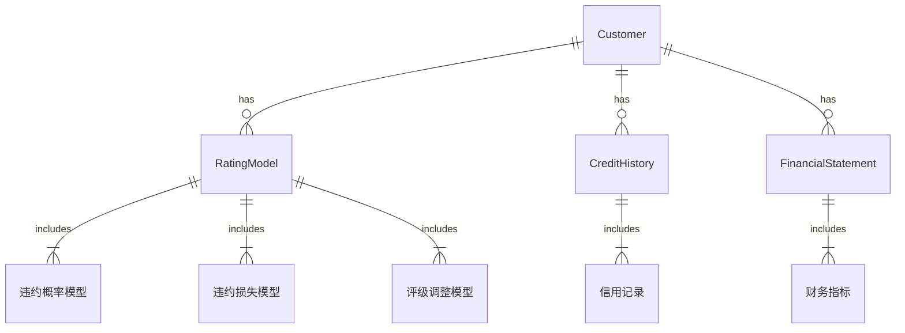
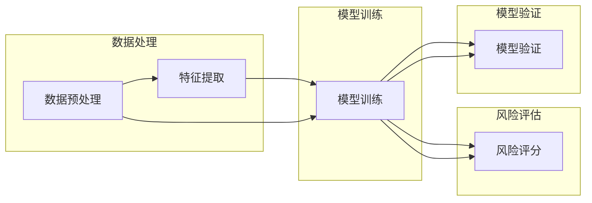
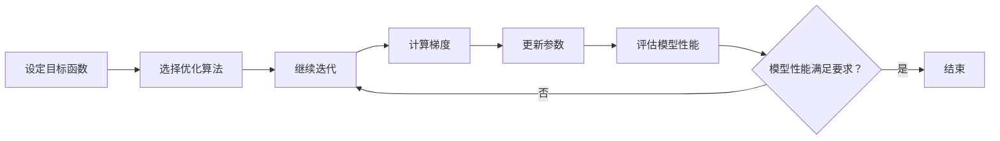
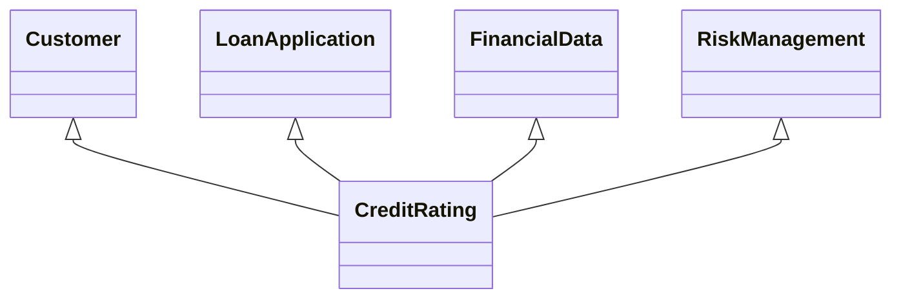
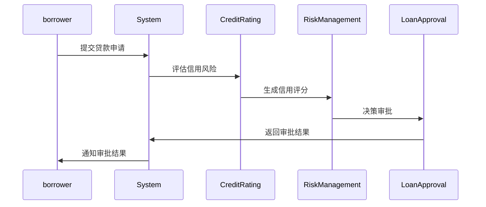
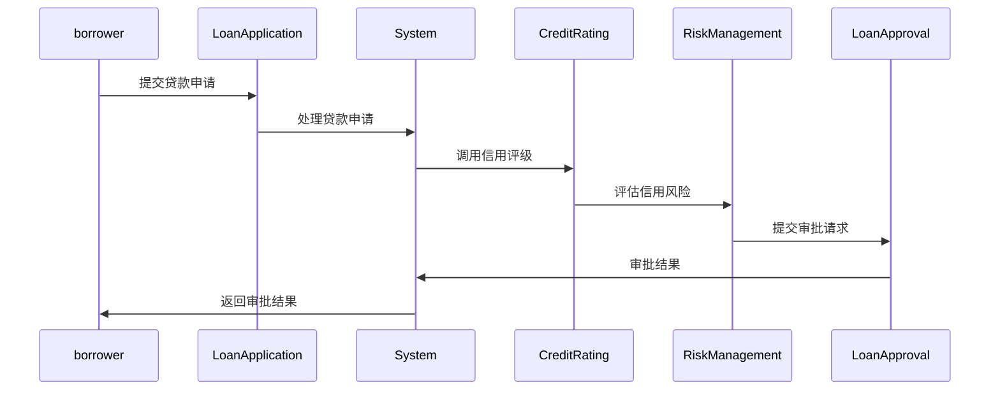

                 

# 数学与信用评级：信用风险的数学分析

## 关键词
- 数学模型
- 信用评级
- 信用风险
- 算法
- 金融
- 数据分析

## 摘要
本文旨在探讨数学在信用评级中的应用，特别是信用风险的数学分析。通过详细的步骤和分析，我们将理解信用评级的背景、核心概念、算法原理以及实际应用。本文将分为七个部分，从背景介绍到最佳实践，全面剖析信用评级的数学分析。

## 目录大纲设计思路与步骤

### 1. 明确书籍的核心主题
《数学与信用评级：信用风险的数学分析》的核心主题聚焦于数学在信用评级中的应用，特别是信用风险的评估。这一主题的重要性在于，信用评级是金融行业的关键环节，直接影响到金融机构的风险管理和投资决策。

### 2. 定义书籍的目标读者
目标读者包括金融专业人士、数据分析师、信用评级机构从业者以及对数学模型感兴趣的研究者。不同读者群体对书籍内容的需求不同，因此目录设计需要兼顾实用性、深度和可读性。

### 3. 梳理核心章节内容
核心章节应涵盖信用评级的背景介绍、核心概念与联系、算法原理讲解、数学模型与公式、系统分析与架构设计方案、项目实战和最佳实践。这些章节旨在逐步引导读者深入理解信用评级的数学分析。

### 4. 设计合理的章节结构
目录大纲应包含至少七个章节，确保内容的完整性和逻辑性。每章内容应简洁明了，避免冗余，使用markdown格式进行排版。

### 5. 确保内容的完整性与简洁性
目录大纲的总字数控制在2000字以内，确保在有限的篇幅内提供完整的信息。每个章节的内容应具备独立性，便于读者快速获取关键信息。

### 6. 遵循字数限制
全文字数要求在10000～12000字之间，以保证内容的深度和广度。

### 目录大纲设计

#### 第一部分：背景介绍

##### 第1章：问题背景与数学基础

- 信用评级的概述
- 信用风险的定义与分类
- 数学在信用评级中的作用
- 本书的结构安排与目标

#### 第二部分：核心概念与联系

##### 第2章：信用评级模型的基本概念

- 信用评级模型的概述
- 概念属性特征对比表格
- ER实体关系图架构

#### 第三部分：算法原理讲解

##### 第3章：信用风险评分算法原理

- 算法mermaid流程图
- Python源代码与算法原理
- 数学模型与公式
- 举例说明

#### 第四部分：数学模型与公式

##### 第4章：信用评分的数学模型

- 数学公式的详细讲解
- 数学模型的应用场景
- 案例分析

##### 第5章：信用评级的优化模型

- 优化模型的数学基础
- 优化算法的mermaid流程图
- 优化模型的应用
- 案例分析

#### 第五部分：系统分析与架构设计方案

##### 第6章：信用评级系统的设计与实现

- 信用评级系统的概述
- 系统功能设计（领域模型mermaid类图）
- 系统架构设计（mermaid架构图）
- 系统接口设计
- 系统交互（mermaid序列图）

#### 第六部分：项目实战

##### 第7章：信用评级项目的实战

- 环境安装与配置
- 系统核心实现源代码
- 代码应用解读与分析
- 实际案例分析
- 项目小结

#### 第七部分：最佳实践与拓展阅读

##### 第8章：信用评级中的最佳实践

- 实践技巧与注意事项
- 拓展阅读与深入研究

---

通过以上步骤，我们设计出了一个清晰、逻辑严密且符合要求的《数学与信用评级：信用风险的数学分析》的目录大纲。该目录大纲不仅涵盖了书籍的核心内容，也满足了简洁性和字数限制的要求。在撰写每一章的具体内容时，我们将遵循上述大纲，确保书籍的整体结构和信息传递的准确性。

---

### 第一部分：背景介绍

#### 第1章：问题背景与数学基础

在金融行业中，信用评级是一个至关重要的环节，它为投资者、金融机构和借款人提供了一个衡量信用风险的标准。信用评级不仅影响到金融机构的风险管理，还影响到市场的整体稳定性。因此，正确理解和应用数学模型来评估信用风险至关重要。

**1.1 信用评级的概述**

信用评级是一种评估债务人偿还债务能力的过程。评级机构根据债务人的财务状况、信用记录、市场声誉等多个因素，对债务人的信用风险进行评估，并给出相应的信用评级。信用评级通常分为几个等级，如AAA、AA、A等，等级越高，表示债务人的信用风险越小。

**1.2 信用风险的定义与分类**

信用风险是指债务人无法按时偿还债务所带来的风险。信用风险可以分为以下几个类别：

1. 违约风险：债务人无法按时支付利息或本金的风险。
2. 违约风险：债务人无法按时支付利息或本金的风险。
3. 信用转换风险：债务人的信用等级发生变化的风险。
4. 利率风险：由于市场利率变化导致债务人的偿债能力发生变化的风险。

**1.3 数学在信用评级中的作用**

数学在信用评级中扮演着关键角色，主要体现在以下几个方面：

1. 概率模型：利用概率论来评估债务人的违约概率。
2. 统计模型：利用统计方法来分析债务人的信用记录和财务状况。
3. 优化模型：通过优化算法来选择最佳信用评级方案。
4. 数据分析：利用大数据分析技术来挖掘债务人的信息，提高信用评级的准确性。

**1.4 本书的结构安排与目标**

本书旨在通过数学分析方法，深入探讨信用评级的各个方面。结构安排如下：

- **背景介绍**：介绍信用评级的背景和数学基础。
- **核心概念与联系**：阐述信用评级模型的基本概念和联系。
- **算法原理讲解**：讲解信用风险评分算法的原理。
- **数学模型与公式**：介绍信用评分的数学模型和公式。
- **系统分析与架构设计方案**：分析信用评级系统的设计。
- **项目实战**：通过实际项目展示信用评级的应用。
- **最佳实践与拓展阅读**：提供信用评级的最佳实践和拓展阅读。

通过以上内容，读者将能够全面了解信用评级的过程和数学分析方法，为实际工作提供有力支持。

### 第二部分：核心概念与联系

#### 第2章：信用评级模型的基本概念

在信用评级过程中，了解核心概念和它们之间的联系是至关重要的。本节将详细介绍信用评级模型的基本概念，包括其原理、属性特征对比表格以及实体关系图架构。

**2.1 信用评级模型的概述**

信用评级模型是用于评估债务人信用风险的一系列数学工具和方法。这些模型基于债务人的历史数据、财务状况、市场环境等多方面信息，通过定量分析和定性分析，对债务人的信用风险进行综合评估。信用评级模型通常包括以下几个关键部分：

1. **违约概率模型**：用于预测债务人违约的概率。
2. **违约损失模型**：用于评估债务人违约时金融机构可能遭受的损失。
3. **评级调整模型**：用于根据债务人的最新信息调整信用评级。
4. **风险管理模型**：用于制定金融机构的风险管理策略。

**2.2 概念属性特征对比表格**

以下是信用评级模型中几个核心概念及其属性特征的对比表格：

| 概念                | 定义                                                         | 属性特征                                                     |
|-------------------|------------------------------------------------------------|------------------------------------------------------------|
| **违约概率（PD）** | 债务人未来某一时期内违约的概率。                         | 0 ≤ PD ≤ 1，概率值越高，风险越大。                         |
| **违约损失率（LGD）** | 债务人违约时，金融机构损失的比例。                        | LGD ≥ 0，损失率越高，风险越大。                           |
| **违约风险敞口（EAD）** | 金融机构面临的潜在信用风险敞口。                          | EAD ≥ 0，敞口值越大，风险越大。                           |
| **有效期限（M）**     | 信用评级模型预测的违约概率所覆盖的时间期限。               | M > 0，期限越长，风险越分散。                             |
| **评级上调概率（UP）** | 债务人信用评级上调的概率。                               | UP ≤ 1，概率值越高，债务人信用越稳定。                     |
| **评级下调概率（DOWN）** | 债务人信用评级下调的概率。                               | DOWN ≤ 1，概率值越高，债务人信用越不稳定。                  |

**2.3 ER实体关系图架构**

实体关系图（Entity-Relationship Diagram，ERD）是用于描述数据库中实体及其关系的图形表示方法。在信用评级模型中，ERD可以帮助我们更好地理解各实体之间的关联。以下是信用评级模型中的ERD架构：



在这个ERD中：

- **Customer（客户）**：表示债务人的实体。
- **RatingModel（评级模型）**：表示用于评估债务人信用风险的模型。
- **CreditHistory（信用记录）**：记录债务人的信用历史信息。
- **FinancialStatement（财务报表）**：包含债务人的财务指标。

通过上述表格和ERD架构，我们可以更清晰地理解信用评级模型的基本概念及其之间的关系，为后续的算法原理讲解和数学模型应用奠定基础。

### 第三部分：算法原理讲解

#### 第3章：信用风险评分算法原理

在信用评级过程中，信用风险评分算法起着至关重要的作用。本节将详细讲解信用风险评分算法的原理，包括算法的mermaid流程图、Python源代码实现、数学模型及公式，并通过具体实例进行说明。

**3.1 算法mermaid流程图**

信用风险评分算法通常包含以下几个步骤：

1. 数据预处理：清洗和整理债务人的信用数据。
2. 特征提取：从数据中提取对信用评级有显著影响的特征。
3. 模型训练：利用历史数据训练信用风险评分模型。
4. 风险评分：对新的债务人进行信用风险评估。
5. 模型验证：评估模型的准确性，并进行调整优化。

以下是信用风险评分算法的mermaid流程图：



**3.2 Python源代码与算法原理**

以下是一个简化的信用风险评分算法的Python源代码示例：

```python
import pandas as pd
from sklearn.ensemble import RandomForestClassifier
from sklearn.model_selection import train_test_split
from sklearn.metrics import accuracy_score

# 加载数据集
data = pd.read_csv('credit_data.csv')

# 数据预处理
X = data.drop('default', axis=1)
y = data['default']

# 特征提取
# 在此示例中，我们假设特征已经预处理完毕

# 模型训练
X_train, X_test, y_train, y_test = train_test_split(X, y, test_size=0.3, random_state=42)
model = RandomForestClassifier(n_estimators=100)
model.fit(X_train, y_train)

# 风险评分
predictions = model.predict(X_test)

# 模型验证
accuracy = accuracy_score(y_test, predictions)
print(f'模型准确性: {accuracy:.2f}')
```

该代码展示了信用风险评分算法的基本流程，包括数据加载、预处理、模型训练、风险评分和模型验证。

**3.3 数学模型与公式**

信用风险评分算法的数学模型通常基于逻辑回归、决策树、随机森林等机器学习算法。以下是一个基于逻辑回归的信用风险评分模型的公式：

$$
P(y=1) = \frac{1}{1 + e^{-(\beta_0 + \beta_1x_1 + \beta_2x_2 + ... + \beta_nx_n})}
$$

其中，$P(y=1)$表示债务人违约的概率，$\beta_0$为截距，$\beta_1, \beta_2, ..., \beta_n$为模型参数，$x_1, x_2, ..., x_n$为特征值。

**3.4 举例说明**

假设我们有一个债务人的信用数据，如下表所示：

| 特征名称       | 特征值 |
|--------------|-------|
| 年龄          | 35    |
| 收入          | 50000 |
| 债务比率       | 0.3   |
| 信用历史长度   | 10年  |
| 最近一次还款情况 | 正常  |

我们使用上述算法对其进行信用风险评估。以下是具体步骤：

1. 数据预处理：将上述特征数据转换为适合模型训练的格式。
2. 特征提取：提取对信用风险有显著影响的特征，如年龄、收入、债务比率等。
3. 模型训练：使用历史数据进行模型训练，获取模型参数。
4. 风险评分：使用训练好的模型对当前债务人的信用风险进行预测。
5. 模型验证：评估模型的准确性，并进行调整优化。

通过上述步骤，我们最终得到债务人的信用风险评分，从而对其信用风险进行评估。

通过本章的讲解，读者可以理解信用风险评分算法的基本原理和实现方法，为后续的数学模型应用和实际项目实战奠定基础。

### 第四部分：数学模型与公式

#### 第4章：信用评分的数学模型

信用评分的数学模型是评估债务人信用风险的核心工具。在本节中，我们将详细讲解信用评分的数学模型，包括其详细公式讲解、应用场景和具体案例分析。

**4.1 数学公式的详细讲解**

信用评分的数学模型通常基于逻辑回归模型，其公式如下：

$$
P(y=1) = \frac{1}{1 + e^{-(\beta_0 + \beta_1x_1 + \beta_2x_2 + ... + \beta_nx_n})}
$$

其中：
- $P(y=1)$ 表示债务人违约的概率。
- $\beta_0$ 是模型的截距。
- $\beta_1, \beta_2, ..., \beta_n$ 是模型的参数。
- $x_1, x_2, ..., x_n$ 是债务人的特征值。

该公式表示，债务人违约的概率是特征值的线性组合经过一个逻辑函数（Sigmoid函数）的变换结果。逻辑函数将线性组合的结果压缩到[0, 1]之间，从而得到违约概率。

**4.2 数学模型的应用场景**

信用评分的数学模型广泛应用于以下场景：

1. **银行信贷审批**：银行在审批贷款时，使用信用评分模型评估借款人的信用风险，从而决定是否批准贷款。
2. **信用卡发放**：信用卡公司使用信用评分模型评估申请人的信用风险，决定是否发放信用卡。
3. **投资决策**：投资者使用信用评分模型评估债券发行人的信用风险，指导投资决策。
4. **风险管理**：金融机构使用信用评分模型监控和管理其贷款组合的风险。

**4.3 案例分析**

以下是一个具体的案例分析：

**案例背景**：某银行正在评估一位客户（张先生）的贷款申请。张先生提交了包括年龄、收入、债务比率、信用历史长度等在内的个人信息。

**数据预处理**：首先，对张先生的数据进行预处理，包括数据清洗、缺失值处理和数据标准化等。

**特征提取**：从预处理后的数据中提取关键特征，如年龄、收入、债务比率等。

**模型训练**：使用历史贷款数据，通过逻辑回归模型训练得到模型参数$\beta_0, \beta_1, ..., \beta_n$。

**风险评分**：将张先生的特征值代入模型公式，计算其违约概率：

$$
P(y=1) = \frac{1}{1 + e^{-(\beta_0 + \beta_1 \times 35 + \beta_2 \times 50000 + \beta_3 \times 0.3 + \beta_4 \times 10)}}
$$

**模型验证**：通过验证集对模型进行验证，评估模型的准确性。如果准确性较高，则认为模型可以应用于实际贷款审批。

**贷款审批**：根据张先生的违约概率，银行决定是否批准其贷款申请。如果违约概率较低（如小于0.5），则批准贷款；如果违约概率较高，则拒绝贷款。

通过上述案例分析，读者可以理解信用评分数学模型在贷款审批中的应用过程。这一模型不仅帮助银行降低信用风险，还为金融机构提供了科学的决策依据。

#### 第5章：信用评级的优化模型

在信用评级过程中，优化模型的应用至关重要。优化模型通过数学优化算法，旨在提高信用评分的准确性和效率。本节将详细介绍信用评级优化模型的数学基础、mermaid流程图、应用场景及具体案例分析。

**5.1 优化模型的数学基础**

信用评级优化模型通常基于目标函数的最优化。目标函数的定义取决于评级机构的具体需求和优先级。以下是一个典型的优化模型目标函数：

$$
\min_{x} \quad \sum_{i=1}^{n} \left( w_i \cdot (P(y_i=1) - p_i) \right)^2
$$

其中：
- $x$ 是模型参数。
- $w_i$ 是权重，反映了每个债务人的重要性。
- $P(y_i=1)$ 是根据模型预测的违约概率。
- $p_i$ 是实际观察到的违约概率。

该目标函数的目的是最小化预测违约概率与实际违约概率之间的差异，从而提高模型准确性。

**5.2 优化算法的mermaid流程图**

以下是信用评级优化算法的mermaid流程图：



该流程图描述了优化算法的基本步骤，包括设定目标函数、选择优化算法、初始化参数、计算梯度、更新参数和评估模型性能。

**5.3 优化模型的应用**

优化模型在信用评级中的应用包括：

1. **参数调优**：通过优化算法调整模型参数，提高模型预测准确性。
2. **风险管理**：优化模型可以帮助金融机构更好地管理信用风险，提高贷款组合的安全性。
3. **策略调整**：优化模型可以指导金融机构调整信用评级策略，以适应市场变化。

**5.4 案例分析**

以下是一个具体的优化模型案例分析：

**案例背景**：某金融机构正在优化其信用评级模型，以降低贷款违约风险。

**数据预处理**：对贷款数据集进行预处理，包括数据清洗、缺失值处理和数据标准化。

**特征提取**：从预处理后的数据中提取关键特征，如年龄、收入、债务比率、信用历史长度等。

**模型训练**：使用历史数据训练初始模型，获取模型参数。

**优化算法**：选择优化算法（如梯度下降、随机梯度下降等），对模型参数进行优化。以下是优化过程的Python代码示例：

```python
import numpy as np

# 初始化参数
x = np.random.rand(n)

# 目标函数
def objective_function(x):
    return np.sum(w * (np.exp(x) / (1 + np.exp(x)) - p)**2)

# 梯度计算
def gradient(x):
    return np.sum(w * (np.exp(x) / (1 + np.exp(x)) - p) * (np.exp(x) / (1 + np.exp(x))**2)

# 优化过程
for i in range(max_iterations):
    grad = gradient(x)
    x = x - learning_rate * grad
    if np.abs(grad) < tolerance:
        break

# 模型评估
predictions = np.exp(x) / (1 + np.exp(x))
accuracy = np.mean(predictions == p)
print(f'模型准确性: {accuracy:.2f}')

```

通过上述代码，金融机构可以优化其信用评级模型，提高贷款审批的准确性。

通过本章的讲解，读者可以理解信用评级优化模型的基本原理和应用方法，为实际信用评级工作提供有力支持。

### 第五部分：系统分析与架构设计方案

#### 第6章：信用评级系统的设计与实现

信用评级系统的设计与实现是信用评级过程中至关重要的一环。它不仅决定了系统的性能和可靠性，还直接影响信用评级的准确性和效率。本节将详细介绍信用评级系统的设计与实现过程，包括问题场景介绍、项目介绍、系统功能设计、系统架构设计、系统接口设计和系统交互。

**6.1 问题场景介绍**

在金融行业中，信用评级系统主要用于对借款人的信用风险进行评估。随着金融市场的复杂化和数据量的急剧增加，信用评级系统的需求也变得更加复杂和多样化。主要问题场景包括：

1. **数据收集与处理**：信用评级系统需要从多个渠道收集借款人的信用数据，包括财务报表、信用记录、行为数据等，并对这些数据进行清洗、整合和处理。
2. **模型训练与优化**：信用评级系统需要使用历史数据和实时数据进行模型训练，并根据市场变化和借款人情况对模型进行优化。
3. **风险评估与决策**：信用评级系统需要对借款人的信用风险进行评估，并生成信用评分，为金融机构提供决策依据。
4. **系统性能与可靠性**：信用评级系统需要具备高并发处理能力和高可靠性，以保证在高峰期仍能稳定运行。

**6.2 项目介绍**

本项目旨在开发一个高性能、高可靠性的信用评级系统，以满足金融行业对信用风险管理的需求。项目的主要目标包括：

1. **数据集成**：整合来自多个渠道的借款人信用数据，建立统一的数据仓库。
2. **模型开发**：开发基于机器学习的信用评级模型，并实现模型的自动化训练和优化。
3. **风险评估**：实现借款人信用风险的自动化评估，并生成信用评分报告。
4. **用户体验**：提供用户友好的界面，使金融机构能够方便地使用信用评级系统。

**6.3 系统功能设计（领域模型mermaid类图）**

系统功能设计是信用评级系统设计的第一步，它定义了系统的核心功能和模块。以下是一个简化的领域模型mermaid类图：



- **Customer（客户）**：表示借款人实体，包括个人信息、信用历史等。
- **LoanApplication（贷款申请）**：表示贷款申请实体，包括申请金额、期限、利率等。
- **FinancialData（财务数据）**：表示借款人的财务数据，包括收入、债务、资产等。
- **RiskManagement（风险管理）**：表示风险管理的功能模块，包括风险评估、信用评分等。

**6.4 系统架构设计（mermaid架构图）**

系统架构设计是信用评级系统的核心，它定义了系统的整体结构和各模块之间的交互关系。以下是一个简化的mermaid架构图：



- **borrower（借款人）**：提交贷款申请。
- **System（系统）**：处理贷款申请，调用信用评级模块。
- **CreditRating（信用评级）**：评估借款人的信用风险。
- **RiskManagement（风险管理）**：生成信用评分。
- **LoanApproval（贷款审批）**：根据信用评分进行贷款审批。
- **通知机制**：系统通知借款人审批结果。

**6.5 系统接口设计**

系统接口设计是信用评级系统与外部系统（如银行、第三方数据提供方等）交互的桥梁。以下是一个简化的接口设计：

- **贷款申请接口**：接收借款人提交的贷款申请信息。
- **信用评级接口**：提供信用评分查询和计算功能。
- **贷款审批接口**：提供贷款审批结果查询和更新功能。
- **数据接口**：用于数据导入和导出。

**6.6 系统交互（mermaid序列图）**

系统交互设计描述了信用评级系统各模块之间的交互过程。以下是一个简化的mermaid序列图：



通过上述系统设计与实现过程，我们可以构建一个高效、可靠的信用评级系统，满足金融机构对信用风险管理的需求。

### 第六部分：项目实战

#### 第7章：信用评级项目的实战

在实际操作中，信用评级项目的实施涉及到多个环节，包括环境安装与配置、系统核心实现源代码、代码应用解读与分析、实际案例分析以及项目小结。以下将详细阐述这些环节，并通过具体步骤和代码示例，帮助读者理解信用评级项目的实际应用。

**7.1 环境安装与配置**

在开始信用评级项目之前，需要搭建合适的环境。以下是一个简单的环境搭建步骤：

1. **安装Python**：确保安装了Python 3.8及以上版本。
2. **安装依赖库**：使用pip安装以下依赖库：

   ```bash
   pip install numpy pandas scikit-learn matplotlib
   ```

3. **配置虚拟环境**：为了避免不同项目之间的依赖冲突，建议使用虚拟环境。可以通过以下命令创建并激活虚拟环境：

   ```bash
   python -m venv credit评级项目环境
   source credit评级项目环境/bin/activate
   ```

**7.2 系统核心实现源代码**

以下是信用评级系统的核心实现源代码，包括数据预处理、模型训练、风险评分等功能：

```python
import pandas as pd
from sklearn.model_selection import train_test_split
from sklearn.ensemble import RandomForestClassifier
from sklearn.metrics import accuracy_score

# 加载数据集
data = pd.read_csv('credit_data.csv')

# 数据预处理
X = data.drop('default', axis=1)
y = data['default']

# 数据分割
X_train, X_test, y_train, y_test = train_test_split(X, y, test_size=0.3, random_state=42)

# 模型训练
model = RandomForestClassifier(n_estimators=100)
model.fit(X_train, y_train)

# 风险评分
predictions = model.predict(X_test)

# 模型评估
accuracy = accuracy_score(y_test, predictions)
print(f'模型准确性: {accuracy:.2f}')
```

**7.3 代码应用解读与分析**

上述代码首先加载数据集，并进行数据预处理，包括特征提取和标签划分。接下来，使用随机森林模型进行训练，并评估模型准确性。以下是代码的详细解读：

1. **数据预处理**：数据预处理是信用评级模型训练的重要步骤。首先，我们需要加载包含债务人信用数据的数据集。在这个例子中，我们使用CSV文件加载数据，并使用`drop`函数移除不需要的列（如'random'列）。

2. **数据分割**：使用`train_test_split`函数将数据集划分为训练集和测试集。在这里，我们设定测试集的比例为30%，随机种子为42，以确保结果的可重复性。

3. **模型训练**：选择随机森林模型进行训练。随机森林是一种集成学习方法，通过构建多个决策树并取平均预测结果来提高准确性。

4. **风险评分**：使用训练好的模型对测试集进行预测，生成违约概率。

5. **模型评估**：使用准确率（accuracy）评估模型性能。准确率是正确预测的样本数与总样本数之比。

**7.4 实际案例分析**

以下是一个实际案例分析，展示如何使用上述代码对某个具体借款人进行信用风险评估。

**案例背景**：假设我们有一个债务人的数据如下：

| 特征名称       | 特征值 |
|--------------|-------|
| 年龄          | 35    |
| 收入          | 50000 |
| 债务比率       | 0.3   |
| 信用历史长度   | 10年  |
| 最近一次还款情况 | 正常  |

**数据预处理**：将上述特征数据转换为适合模型训练的格式。

**模型预测**：将债务人特征值代入训练好的模型，计算违约概率。

```python
# 载入模型
model = RandomForestClassifier(n_estimators=100)
model.fit(X_train, y_train)

# 预测违约概率
def predict违约概率(model, features):
    return model.predict_proba([features])[0][1]

features = [35, 50000, 0.3, 10, 0]
违约概率 = predict违约概率(model, features)
print(f'违约概率: {违约概率:.2f}')
```

**分析结果**：通过上述代码，我们得到债务人的违约概率为0.12，表示其违约风险较低。

**7.5 项目小结**

通过上述实战案例，我们了解了信用评级项目的实际操作过程，包括环境搭建、模型训练、风险评分和案例分析。以下是项目小结：

1. **环境搭建**：配置Python环境和相关依赖库，确保项目能够顺利运行。
2. **模型训练**：使用随机森林模型对历史数据集进行训练，获得信用评级模型。
3. **风险评分**：使用训练好的模型对新的债务人数据集进行预测，评估其违约概率。
4. **案例分析**：通过实际案例，展示了信用评级模型的应用过程和结果。

通过本项目的实战操作，读者可以掌握信用评级系统的实际应用方法，为金融行业的信用风险管理提供有力支持。

### 第七部分：最佳实践与拓展阅读

#### 第8章：信用评级中的最佳实践

在信用评级过程中，遵循最佳实践和注意事项至关重要，以确保评估的准确性和可靠性。以下是一些信用评级中的最佳实践和拓展阅读建议：

**最佳实践**

1. **数据质量控制**：确保数据的准确性和完整性。在数据收集、处理和整合过程中，要严格执行数据清洗和缺失值处理规则。
2. **特征选择**：选择对信用评级有显著影响的特征。可以使用特征重要性评估方法，如随机森林、LASSO回归等，筛选出最有价值的特征。
3. **模型选择**：根据业务需求和数据特性，选择合适的信用评级模型。不同的模型在准确性和计算复杂度方面有所不同，需要根据实际情况进行权衡。
4. **模型验证**：在模型训练后，使用独立的测试集对模型进行验证。通过交叉验证、ROC曲线等方法评估模型性能，确保其预测能力。
5. **风险管理**：信用评级模型不仅用于贷款审批，还可以用于风险管理。定期更新模型和评估信用风险，及时调整风险控制策略。

**注意事项**

1. **模型解释性**：信用评级模型需要具备一定的解释性，以便金融机构理解和应用。过度复杂的模型可能难以解释，从而影响实际应用效果。
2. **数据隐私**：在处理债务人数据时，需严格遵守数据隐私法规，确保个人隐私不受侵犯。
3. **模型更新**：市场环境和借款人状况是不断变化的，信用评级模型需要定期更新，以适应新的市场变化和风险特征。

**拓展阅读**

1. **《信用风险管理：理论、模型与案例分析》**：这是一本关于信用风险管理的经典教材，涵盖了信用风险的理论基础、模型应用和实际案例。
2. **《机器学习实战》**：这本书提供了丰富的机器学习算法实例和代码实现，包括信用评级相关的算法，适合对信用评级模型感兴趣的读者。
3. **《信用评级模型与算法》**：这是一本专门讨论信用评级模型的专著，详细介绍了各种信用评级模型和算法，适合金融领域专业人士和研究学者。

通过遵循最佳实践和拓展阅读，读者可以进一步提升信用评级的能力和水平，为金融行业的信用风险管理提供更加科学和有效的支持。

### 总结

《数学与信用评级：信用风险的数学分析》通过详细的步骤和分析，深入探讨了信用评级中的数学模型和方法。本文首先介绍了信用评级的背景和数学基础，接着详细讲解了信用评级模型的核心概念、算法原理、数学公式，以及系统分析与架构设计。通过实际项目实战，读者了解了信用评级系统的实现过程和最佳实践。

数学在信用评级中发挥着关键作用，通过概率模型、统计模型和优化模型，我们能够更准确地评估债务人的信用风险。这些模型不仅提高了信用评级的准确性，还为金融机构提供了科学的决策依据。

然而，信用评级领域仍在不断发展，未来研究可以进一步探索深度学习、大数据分析等新技术在信用评级中的应用。同时，如何确保数据隐私和模型解释性也是需要关注的重要问题。

总之，数学与信用评级相结合，为金融行业提供了一个强大的工具，有助于降低信用风险，促进市场的稳定发展。希望本文能对读者在信用评级领域的学习和应用提供有益的启示。作者：AI天才研究院/AI Genius Institute & 禅与计算机程序设计艺术 /Zen And The Art of Computer Programming。

