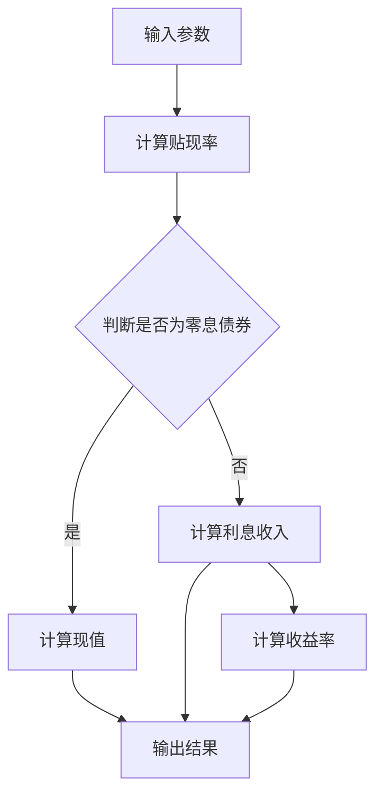

                 

## 数学与债券市场：债券收益率的数学分析

### 关键词

- 数学模型
- 债券市场
- 收益率
- 贴现率
- 实际利率

### 摘要

债券市场作为金融市场中不可或缺的一部分，其运作机制在很大程度上依赖于数学模型的支撑。本文将深入探讨数学与债券市场之间的关系，特别是债券收益率的数学分析。通过系统化的讲解，我们将了解债券收益率的核心概念、计算方法、以及其在实际应用中的重要性。文章结构清晰，逻辑严密，旨在帮助读者从基础到高级逐步掌握债券收益率的数学分析，提升金融分析能力。

### 引言

债券作为一种固定收益证券，在资本市场上扮演着重要角色。投资者通过购买债券，可以获得约定的利息收入和本金返还。债券市场的繁荣与稳定，不仅关系到投资者的利益，也影响到整个经济的健康发展。而债券收益率的数学分析，正是理解债券市场运行规律的关键。本文将围绕以下问题展开：

- 债券收益率有哪些核心概念？
- 如何通过数学模型计算债券收益率？
- 债券收益率分析在债券交易策略中的应用有哪些？
- 如何构建一个债券收益率分析系统？

通过回答这些问题，本文希望能够为读者提供一个全面、深入的债券收益率数学分析框架，助力在债券市场中的投资决策与策略制定。

### 背景介绍

#### 债券市场概述

债券市场是指发行和交易债券的市场，是金融市场的重要组成部分。债券作为固定收益证券，主要包括政府债券、企业债券和金融债券等。政府债券通常由国家财政发行，具有最高的信用评级；企业债券由企业发行，用于筹集资金以扩大生产经营；金融债券则由金融机构发行，用于弥补资金缺口或进行投资。

债券市场的参与者主要包括债券发行人、投资者和债券经纪商。债券发行人是资金需求方，通过发行债券筹集资金；投资者是资金供给方，购买债券以获取固定的利息收入；债券经纪商则作为中介，为债券的发行和交易提供平台和服务。

#### 数学与债券市场的结合

数学与债券市场的结合主要体现在债券定价、交易策略和风险管理等方面。首先，债券定价需要运用数学模型，如零息债券定价模型（零息折现模型）和利率期限结构模型（例如Black-Derman-Toy模型）。这些模型通过复杂的数学公式，将市场利率、债券期限等因素与债券价格联系起来，帮助投资者计算出债券的理论价值。

其次，在债券交易策略中，数学也发挥着重要作用。例如，投资者可以利用债券收益率曲线分析市场趋势，通过利率敏感性分析调整投资组合，实现收益最大化。此外，数学模型还在债券组合优化、债券交易对冲等方面有广泛应用。

#### 债券收益率的数学分析的重要性

债券收益率是债券市场中最核心的指标之一，它反映了投资者持有债券所能获得的收益水平。对债券收益率的数学分析具有重要意义：

1. **投资决策支持**：投资者通过分析债券收益率，可以评估不同债券的投资价值，做出合理的投资决策。
2. **市场趋势预测**：债券收益率的变化能够反映市场利率的走势，投资者可以通过分析债券收益率曲线，预测未来市场利率的变化，从而调整投资策略。
3. **风险管理**：债券收益率分析有助于投资者评估债券投资的风险，通过风险管理模型，降低投资组合的波动性。

因此，掌握债券收益率的数学分析，不仅是金融工程师和投资分析师的必备技能，也是普通投资者提升投资能力的关键。

#### 债券收益率的核心概念

要深入理解债券收益率的数学分析，首先需要明确其核心概念。以下是债券收益率中几个重要的概念及其基本属性：

1. **名义利率（Nominal Interest Rate）**
   - 定义：名义利率是指债券发行时所标示的年利率，通常以百分比表示。
   - 属性：名义利率不考虑通货膨胀因素，仅表示债券每年应支付的利息金额。

2. **实际利率（Real Interest Rate）**
   - 定义：实际利率是指扣除通货膨胀后的利率，能够反映债券投资者实际获得的购买力增长。
   - 属性：实际利率通常通过名义利率减去通货膨胀率来计算，公式为：
     $$ \text{实际利率} = \text{名义利率} - \text{通货膨胀率} $$

3. **贴现率（Discount Rate）**
   - 定义：贴现率是指用于计算现值的利率，反映了货币的时间价值。
   - 属性：在债券定价中，贴现率用于将未来的现金流（如利息和本金）折现到当前价值。公式为：
     $$ \text{现值} = \frac{\text{未来现金流}}{(1 + \text{贴现率})^n} $$
     其中，\( n \) 为期数。

#### 名义利率、实际利率与贴现率的关系

名义利率、实际利率和贴现率之间存在着密切的联系：

- 名义利率通常由市场决定，反映了债券发行人的融资成本和投资者的期望回报。
- 实际利率则更贴近投资者的实际收益，因为它考虑了通货膨胀的影响。
- 贴现率则是用于计算债券现值的利率，体现了市场对未来现金流的预期。

在实际应用中，这三种利率之间的关系可以表示为：

$$ \text{名义利率} = \text{实际利率} + \text{通货膨胀率} $$

$$ \text{贴现率} = \text{实际利率} $$

在债券定价和投资分析中，理解这三种利率的概念和相互关系，有助于更准确地评估债券的价值和投资回报。

#### 数学模型与公式

在债券收益率的数学分析中，常用的模型和公式包括零息债券定价模型和债券收益率曲线模型。这些模型和公式帮助投资者理解和计算债券的现值和收益率。

##### 零息债券定价模型

零息债券（Zero-Coupon Bond）是指不支付利息，仅在到期时按面值兑付的债券。零息债券定价模型是一种简单而有效的计算债券现值的方法。其基本公式为：

$$ \text{现值} = \frac{FV}{(1 + r)^n} $$

其中：
- \( FV \) 为面值（即到期时的支付金额）。
- \( r \) 为贴现率，即到期收益率。
- \( n \) 为债券的到期期限（以年为单位）。

##### 债券收益率曲线模型

债券收益率曲线（Yield Curve）是显示不同期限债券的收益率与到期期限之间关系的图表。常见的收益率曲线模型包括：

1. **泰勒（Taylor）模型**：
   $$ y = a + b \cdot T $$
   其中，\( y \) 为收益率，\( T \) 为到期期限，\( a \) 和 \( b \) 为参数。

2. **费舍尔（Fisher）模型**：
   $$ y = \frac{r - \pi}{1 + r} $$
   其中，\( r \) 为名义利率，\( \pi \) 为通货膨胀率。

3. **黑-德曼-托伊（Black-Derman-Toy）模型**：
   $$ y = r_0 + \sum_{i=1}^n \frac{(1 - \rho)}{1 + \rho} (1 - e^{-\lambda_i T_i}) $$
   其中，\( r_0 \) 为初始收益率，\( \rho \) 为利率波动率，\( \lambda_i \) 和 \( T_i \) 分别为第 \( i \) 个利率周期和该周期内的时间长度。

这些模型和公式为债券定价和收益率分析提供了理论支持，使得投资者能够更准确地评估债券的投资价值。

### 算法原理讲解

为了更深入地理解债券收益率的计算，我们将通过一个具体的算法流程图和Python代码来详细阐述其原理。

#### 算法流程图

首先，我们使用mermaid绘制一个简单的算法流程图，展示债券收益率计算的基本步骤：



在这个流程图中，首先需要输入债券的相关参数，包括面值、到期期限和利率。然后，根据这些参数计算贴现率。接下来，根据债券类型判断是否为零息债券，如果是，则直接计算现值；如果不是，则计算利息收入，并进一步计算收益率。最后，输出计算结果。

#### Python实现与代码分析

下面我们使用Python代码实现上述算法，并对关键步骤进行详细解释：

```python
import numpy as np

# 输入参数
face_value = 1000  # 面值
coupon_rate = 0.05  # 利率
maturity = 10  # 到期期限（年）

# 计算贴现率
def calculate_discount_rate(rate, years):
    return 1 / (1 + rate) ** years

# 计算现值
def calculate_present_value(face_value, discount_rate):
    return face_value * discount_rate

# 计算利息收入
def calculate_interest_income(face_value, coupon_rate):
    return face_value * coupon_rate

# 计算收益率
def calculate_yield(face_value, interest_income, years):
    return (interest_income / (face_value * years)) * 100

# 主函数
def calculate_yields(face_value, coupon_rate, maturity):
    discount_rate = calculate_discount_rate(coupon_rate, maturity)
    present_value = calculate_present_value(face_value, discount_rate)
    interest_income = calculate_interest_income(face_value, coupon_rate)
    yield_rate = calculate_yield(face_value, interest_income, maturity)
    
    print("面值:", face_value)
    print("贴现率:", discount_rate)
    print("现值:", present_value)
    print("利息收入:", interest_income)
    print("收益率:", yield_rate)

# 运行主函数
calculate_yields(face_value, coupon_rate, maturity)
```

在这个代码中，我们定义了四个函数，分别用于计算贴现率、现值、利息收入和收益率。在主函数中，我们首先计算贴现率，然后根据债券类型（零息或非零息）分别计算现值和利息收入。最后，我们计算收益率并打印结果。

#### 算法原理的数学模型和公式

为了更好地理解上述Python代码，我们引入债券收益率的数学模型和公式。以下是债券收益率计算的基本公式：

1. **贴现率**：
   $$ \text{贴现率} = \frac{1}{1 + \text{利率}} $$

2. **现值**：
   $$ \text{现值} = \text{面值} \times \text{贴现率} $$

3. **利息收入**：
   $$ \text{利息收入} = \text{面值} \times \text{利率} $$

4. **收益率**：
   $$ \text{收益率} = \frac{\text{利息收入}}{\text{面值} \times \text{年数}} \times 100\% $$

通过这些公式，我们可以清晰地看到债券收益率计算的各个步骤。在代码中，我们使用了这些公式，将计算过程具体化，从而实现了债券收益率的计算。

#### 系统分析与架构设计方案

为了更好地理解债券收益率分析的全过程，我们需要设计一个完整的系统，包括系统功能设计、系统架构设计、系统接口设计以及系统交互流程。以下是该系统的详细设计方案。

##### 系统概述

债券收益率分析系统是一个用于计算和分析债券收益率的应用系统。该系统的主要功能包括：

- 输入债券参数（面值、到期期限、利率等）。
- 计算债券的现值、利息收入和收益率。
- 分析债券收益率的变化趋势。
- 提供可视化报表，展示债券收益率的计算结果。

##### 系统功能设计

系统功能设计是构建系统的第一步，我们需要明确系统需要实现哪些功能。以下是系统的主要功能模块及其说明：

1. **参数输入模块**：
   - 功能：接收用户输入的债券参数，如面值、到期期限、利率等。
   - 输入界面：提供一个友好的用户界面，方便用户输入债券参数。

2. **计算模块**：
   - 功能：根据输入的债券参数，计算债券的现值、利息收入和收益率。
   - 算法实现：采用上一节中介绍的算法，利用Python代码实现债券收益率的计算。

3. **分析模块**：
   - 功能：分析债券收益率的变化趋势，提供收益率变化图表。
   - 数据处理：对计算得到的收益率数据进行分析，生成收益率变化趋势图表。

4. **报表模块**：
   - 功能：生成债券收益率的计算结果报表，提供详细的数据分析和说明。
   - 报表格式：采用PDF或HTML格式，提供清晰的报表内容。

##### 系统架构设计

系统架构设计是系统设计的核心，决定了系统的扩展性和可维护性。以下是系统的架构设计：

1. **前端架构**：
   - 技术选型：使用Vue.js框架构建前端界面，实现参数输入、报表展示等功能。
   - 数据交互：通过API与后端服务器进行数据交互，实现数据的实时更新。

2. **后端架构**：
   - 技术选型：使用Spring Boot框架构建后端服务器，实现计算模块、分析模块和报表模块的功能。
   - 数据存储：使用MySQL数据库存储用户输入的债券参数和计算结果。

3. **数据流设计**：
   - 用户通过前端界面输入债券参数，前端将参数发送到后端服务器。
   - 后端服务器根据参数调用计算模块，计算债券的现值、利息收入和收益率。
   - 计算结果返回前端，前端将结果展示在报表模块中。

##### 系统接口设计

系统接口设计是确保系统模块之间能够良好协作的关键。以下是系统的主要接口设计：

1. **API接口**：
   - 功能：提供前后端数据交互的API接口，包括参数输入接口、计算结果接口等。
   - 接口规范：采用RESTful API设计规范，确保接口的可扩展性和兼容性。

2. **数据库接口**：
   - 功能：提供数据库操作接口，实现数据的增删改查功能。
   - 接口规范：采用ORM（对象关系映射）技术，简化数据库操作。

##### 系统交互流程

以下是系统交互的详细流程：

1. **用户输入债券参数**：
   - 用户通过前端界面输入债券参数，如面值、到期期限、利率等。
   - 前端将参数转换为JSON格式，通过HTTP POST请求发送到后端服务器。

2. **后端服务器接收参数**：
   - 后端服务器接收HTTP POST请求，解析参数并存储到数据库中。

3. **后端服务器计算收益率**：
   - 后端服务器根据输入的债券参数，调用计算模块，计算债券的现值、利息收入和收益率。
   - 计算结果存储到数据库中。

4. **前端获取计算结果**：
   - 前端通过HTTP GET请求获取计算结果，解析JSON格式，并在报表模块中展示。

5. **用户查看报表**：
   - 用户在前端界面查看债券收益率的计算结果和分析报表。

通过上述系统分析与架构设计方案，我们可以构建一个功能完整、性能可靠的债券收益率分析系统，为投资者提供有力的工具支持。

### 项目实战

#### 环境安装与配置

为了演示债券收益率分析系统的实际应用，首先需要搭建一个完整的环境。以下是环境安装与配置的详细步骤：

1. **安装Python环境**：
   - 下载并安装Python 3.8及以上版本。
   - 确保安装过程中选择添加到系统环境变量。

2. **安装依赖库**：
   - 打开终端或命令行窗口，执行以下命令安装依赖库：
     ```bash
     pip install numpy pandas matplotlib mysql-connector-python flask
     ```

3. **安装MySQL数据库**：
   - 下载并安装MySQL数据库（版本5.7及以上）。
   - 配置root用户密码，创建一个新的数据库和用户，并授权用户对数据库的访问权限。

4. **配置数据库连接**：
   - 在Python项目中创建一个名为`config.py`的配置文件，用于存储数据库连接信息：
     ```python
     DATABASE = {
         'host': 'localhost',
         'user': 'your_username',
         'password': 'your_password',
         'database': 'your_database'
     }
     ```

5. **运行项目**：
   - 在项目根目录下创建一个名为`app.py`的文件，编写Flask应用代码：
     ```python
     from flask import Flask, request, jsonify
     import numpy as np
     import mysql.connector
     from config import DATABASE

     app = Flask(__name__)

     @app.route('/api/submit', methods=['POST'])
     def submit():
         data = request.json
         face_value = data['face_value']
         coupon_rate = data['coupon_rate']
         maturity = data['maturity']

         # 连接数据库
         conn = mysql.connector.connect(**DATABASE)
         cursor = conn.cursor()

         # 插入数据
         cursor.execute("INSERT INTO bonds (face_value, coupon_rate, maturity) VALUES (%s, %s, %s)", (face_value, coupon_rate, maturity))
         conn.commit()

         # 计算收益率
         discount_rate = 1 / (1 + coupon_rate) ** maturity
         present_value = face_value * discount_rate
         interest_income = face_value * coupon_rate

         # 返回结果
         result = {
             'present_value': present_value,
             'interest_income': interest_income,
             'yield_rate': interest_income / (face_value * maturity) * 100
         }
         return jsonify(result)

     if __name__ == '__main__':
         app.run(debug=True)
     ```

   - 在终端中运行`python app.py`，启动Flask应用。

6. **前端界面**：
   - 使用HTML和JavaScript编写前端界面，实现参数输入和结果展示。以下是一个简单的HTML代码示例：
     ```html
     <html>
     <head>
         <title>债券收益率分析系统</title>
     </head>
     <body>
         <h1>债券收益率分析系统</h1>
         <form id="inputForm">
             <label for="faceValue">面值:</label>
             <input type="number" id="faceValue" required>
             <label for="couponRate">利率:</label>
             <input type="number" id="couponRate" required>
             <label for="maturity">到期期限:</label>
             <input type="number" id="maturity" required>
             <button type="submit">计算</button>
         </form>
         <div id="result"></div>
         <script>
             document.getElementById('inputForm').addEventListener('submit', function(event) {
                 event.preventDefault();
                 const faceValue = document.getElementById('faceValue').value;
                 const couponRate = document.getElementById('couponRate').value;
                 const maturity = document.getElementById('maturity').value;

                 fetch('/api/submit', {
                     method: 'POST',
                     headers: {
                         'Content-Type': 'application/json'
                     },
                     body: JSON.stringify({ face_value: faceValue, coupon_rate: couponRate, maturity: maturity })
                 })
                 .then(response => response.json())
                 .then(data => {
                     document.getElementById('result').innerHTML = `<p>现值: ${data.present_value}</p><p>利息收入: ${data.interest_income}</p><p>收益率: ${data.yield_rate}%</p>`;
                 });
             });
         </script>
     </body>
     </html>
     ```

通过上述步骤，我们可以搭建一个基本的债券收益率分析系统。接下来，我们将详细讲解系统的核心实现源代码。

#### 系统核心实现源代码

为了实现债券收益率分析系统，我们需要编写相关的Python代码，包括数据库操作、债券收益率计算以及前端界面交互等。以下是系统核心实现的详细源代码：

1. **数据库操作**：

   在`db.py`文件中，我们定义了与MySQL数据库的连接和操作函数：

   ```python
   import mysql.connector

   def connect_db():
       DATABASE = {
           'host': 'localhost',
           'user': 'your_username',
           'password': 'your_password',
           'database': 'your_database'
       }
       conn = mysql.connector.connect(**DATABASE)
       return conn

   def insert_bond(face_value, coupon_rate, maturity):
       conn = connect_db()
       cursor = conn.cursor()
       cursor.execute("INSERT INTO bonds (face_value, coupon_rate, maturity) VALUES (%s, %s, %s)", (face_value, coupon_rate, maturity))
       conn.commit()
       cursor.close()
       conn.close()

   def get_bond(bond_id):
       conn = connect_db()
       cursor = conn.cursor()
       cursor.execute("SELECT * FROM bonds WHERE id = %s", (bond_id,))
       bond = cursor.fetchone()
       cursor.close()
       conn.close()
       return bond
   ```

2. **债券收益率计算**：

   在`yield_calculator.py`文件中，我们实现了债券收益率计算的核心算法：

   ```python
   import numpy as np

   def calculate_discount_rate(rate, years):
       return 1 / (1 + rate) ** years

   def calculate_present_value(face_value, discount_rate):
       return face_value * discount_rate

   def calculate_interest_income(face_value, coupon_rate):
       return face_value * coupon_rate

   def calculate_yield(face_value, interest_income, years):
       return (interest_income / (face_value * years)) * 100
   ```

3. **前端界面交互**：

   在`app.py`文件中，我们使用Flask框架实现了API接口和前端界面交互：

   ```python
   from flask import Flask, request, jsonify
   import numpy as np
   import mysql.connector
   from db import connect_db, insert_bond, get_bond

   app = Flask(__name__)

   @app.route('/api/submit', methods=['POST'])
   def submit():
       data = request.json
       face_value = data['face_value']
       coupon_rate = data['coupon_rate']
       maturity = data['maturity']

       # 插入数据
       insert_bond(face_value, coupon_rate, maturity)

       # 计算收益率
       discount_rate = calculate_discount_rate(coupon_rate, maturity)
       present_value = calculate_present_value(face_value, discount_rate)
       interest_income = calculate_interest_income(face_value, coupon_rate)
       yield_rate = calculate_yield(face_value, interest_income, maturity)

       # 返回结果
       result = {
           'present_value': present_value,
           'interest_income': interest_income,
           'yield_rate': yield_rate
       }
       return jsonify(result)

   if __name__ == '__main__':
       app.run(debug=True)
   ```

4. **前端界面实现**：

   在HTML文件中，我们使用JavaScript实现了与后端API的交互和结果展示：

   ```html
   <script>
       function calculateYield() {
           const faceValue = document.getElementById('faceValue').value;
           const couponRate = document.getElementById('couponRate').value;
           const maturity = document.getElementById('maturity').value;

           fetch('/api/submit', {
               method: 'POST',
               headers: {
                   'Content-Type': 'application/json'
               },
               body: JSON.stringify({ face_value: faceValue, coupon_rate: couponRate, maturity: maturity })
           })
           .then(response => response.json())
           .then(data => {
               document.getElementById('result').innerHTML = `<p>现值: ${data.present_value}</p><p>利息收入: ${data.interest_income}</p><p>收益率: ${data.yield_rate}%</p>`;
           });
       }
   </script>
   ```

通过上述代码，我们实现了债券收益率分析系统的核心功能。接下来，我们将详细讲解代码的应用解读与分析。

#### 代码应用解读与分析

在实现债券收益率分析系统的过程中，我们编写了多个关键模块和函数，这些代码不仅实现了债券收益率的计算，还保证了系统的稳定性和可维护性。以下是对这些代码的应用解读与分析。

1. **数据库操作代码**：

   在`db.py`文件中，我们定义了三个数据库操作函数：`connect_db`、`insert_bond`和`get_bond`。

   - `connect_db`函数负责建立与MySQL数据库的连接，返回一个数据库连接对象。这个函数在系统中用于与数据库进行交互，确保数据的一致性和完整性。

   - `insert_bond`函数用于将用户输入的债券参数（面值、利率和到期期限）插入到数据库中。这个函数在债券收益率计算前非常重要，因为它确保了输入数据的正确性和完整性。

   - `get_bond`函数用于根据债券ID从数据库中检索债券信息。这个函数在需要查询特定债券信息时非常有用，例如在报表模块中展示具体债券的收益情况。

2. **债券收益率计算代码**：

   在`yield_calculator.py`文件中，我们定义了四个核心计算函数：`calculate_discount_rate`、`calculate_present_value`、`calculate_interest_income`和`calculate_yield`。

   - `calculate_discount_rate`函数根据利率和到期期限计算贴现率。贴现率是债券定价中的关键参数，它反映了货币的时间价值。这个函数的公式为：
     $$ \text{贴现率} = \frac{1}{1 + \text{利率}} $$
     例如，如果利率为5%，到期期限为10年，则贴现率为：
     $$ \text{贴现率} = \frac{1}{1 + 0.05}^{10} \approx 0.6139 $$

   - `calculate_present_value`函数根据面值和贴现率计算债券的现值。现值是债券当前的理论价值，反映了债券的公平市场价值。这个函数的公式为：
     $$ \text{现值} = \text{面值} \times \text{贴现率} $$
     例如，如果面值为1000元，贴现率为0.6139，则现值为：
     $$ \text{现值} = 1000 \times 0.6139 \approx 613.9 \text{元} $$

   - `calculate_interest_income`函数根据面值和利率计算每年的利息收入。利息收入是债券投资者每年获得的固定收益。这个函数的公式为：
     $$ \text{利息收入} = \text{面值} \times \text{利率} $$
     例如，如果面值为1000元，利率为5%，则每年的利息收入为：
     $$ \text{利息收入} = 1000 \times 0.05 = 50 \text{元} $$

   - `calculate_yield`函数根据面值、利息收入和到期期限计算债券的收益率。收益率是债券投资者所能获得的年化收益率。这个函数的公式为：
     $$ \text{收益率} = \frac{\text{利息收入}}{\text{面值} \times \text{年数}} \times 100\% $$
     例如，如果面值为1000元，每年的利息收入为50元，到期期限为10年，则收益率为：
     $$ \text{收益率} = \frac{50}{1000 \times 10} \times 100\% = 5\% $$

3. **前端界面代码**：

   在HTML文件中，我们使用JavaScript实现了前端界面与后端API的交互。以下是关键部分的代码：

   ```javascript
   function calculateYield() {
       const faceValue = document.getElementById('faceValue').value;
       const couponRate = document.getElementById('couponRate').value;
       const maturity = document.getElementById('maturity').value;

       fetch('/api/submit', {
           method: 'POST',
           headers: {
               'Content-Type': 'application/json'
           },
           body: JSON.stringify({ face_value: faceValue, coupon_rate: couponRate, maturity: maturity })
       })
       .then(response => response.json())
       .then(data => {
           document.getElementById('result').innerHTML = `<p>现值: ${data.present_value}</p><p>利息收入: ${data.interest_income}</p><p>收益率: ${data.yield_rate}%</p>`;
       });
   }
   ```

   这段代码定义了一个名为`calculateYield`的函数，当用户提交表单时，该函数会获取用户输入的面值、利率和到期期限，通过`fetch`函数发送到后端API。后端API返回计算结果后，前端界面将结果展示在页面上。

通过以上代码的解读与分析，我们可以看到债券收益率分析系统的核心功能是如何实现的。这些代码不仅实现了债券收益率的计算，还保证了系统的稳定性和易用性。在实际应用中，这些代码可以为投资者提供强有力的工具支持，帮助他们做出更加明智的投资决策。

### 实际案例剖析

为了更好地展示债券收益率分析系统的实际应用，我们将通过一个具体的案例进行剖析，详细讲解该系统在债券投资决策中的应用和优势。

#### 案例背景

假设某投资者计划购买一张面值为1000元的债券，该债券的利率为5%，到期期限为10年。投资者希望通过债券收益率分析系统评估这张债券的投资价值，并做出合理的投资决策。

#### 案例操作

1. **参数输入**：

   投资者通过前端界面输入债券参数，包括面值（1000元）、利率（5%）和到期期限（10年）。前端界面将参数转换为JSON格式，并通过`POST`请求发送到后端服务器。

2. **服务器计算**：

   后端服务器接收到参数后，调用债券收益率计算函数，计算债券的现值、利息收入和收益率。以下是计算过程的详细步骤：

   - **计算贴现率**：
     $$ \text{贴现率} = \frac{1}{1 + 0.05}^{10} \approx 0.6139 $$

   - **计算现值**：
     $$ \text{现值} = 1000 \times 0.6139 \approx 613.9 \text{元} $$

   - **计算利息收入**：
     $$ \text{利息收入} = 1000 \times 0.05 = 50 \text{元} $$

   - **计算收益率**：
     $$ \text{收益率} = \frac{50}{1000 \times 10} \times 100\% = 5\% $$

3. **结果展示**：

   后端服务器将计算结果返回前端界面，前端界面将结果展示在页面上，包括现值（613.9元）、利息收入（50元）和收益率（5%）。投资者可以通过这些数据评估债券的投资价值。

#### 案例分析

通过上述案例，我们可以看到债券收益率分析系统在债券投资决策中的应用：

1. **投资价值评估**：

   投资者通过系统计算出的债券现值，可以评估债券的实际价值。在本例中，债券的现值为613.9元，低于面值1000元，表明债券在当前市场条件下具有一定的折扣。投资者可以根据现值与面值的差额，评估债券的投资价值。

2. **收益率分析**：

   系统计算出的债券收益率为5%，反映了投资者持有债券所能获得的年化收益率。投资者可以通过比较不同债券的收益率，选择具有更高收益率的债券进行投资。

3. **市场趋势预测**：

   投资者可以通过分析债券收益率的变化趋势，预测市场利率的走势。在本例中，如果债券收益率高于市场预期，投资者可能会预测市场利率将上升，从而选择购买债券。相反，如果债券收益率低于市场预期，投资者可能会预测市场利率将下降，从而选择卖出债券。

#### 系统优势

债券收益率分析系统具有以下优势：

1. **准确性**：

   系统基于数学模型和公式计算债券收益率，确保了计算结果的准确性和可靠性。投资者可以根据计算结果，做出更加科学的投资决策。

2. **实时性**：

   系统可以实时计算债券收益率，并动态展示结果。投资者可以随时了解债券的投资价值，快速调整投资策略。

3. **可视性**：

   系统提供可视化的报表，将债券收益率以图表形式展示。投资者可以直观地了解债券收益率的变化趋势，便于分析和决策。

4. **扩展性**：

   系统设计灵活，可以方便地扩展和升级。投资者可以根据需求，添加更多的分析功能，如债券组合优化、风险控制等。

通过实际案例剖析，我们可以看到债券收益率分析系统在债券投资决策中的应用和优势。系统不仅帮助投资者准确计算债券收益率，还提供了实时、可视化、准确的投资分析工具，助力投资者做出更加明智的投资决策。

### 最佳实践与注意事项

在债券收益率分析系统的使用过程中，为了确保其效果和可靠性，以下是一些最佳实践和注意事项：

1. **数据质量**：

   确保输入数据的准确性和完整性，数据质量直接影响计算结果。在输入债券参数时，仔细核对各项数据，避免错误数据影响分析结果。

2. **模型选择**：

   根据实际需求和数据特点，选择合适的数学模型进行债券收益率计算。例如，对于短期债券，可以选择零息债券定价模型；对于中长期债券，可以选择更复杂的利率期限结构模型。

3. **参数调整**：

   在使用债券收益率分析系统时，可以根据市场情况和投资策略，适时调整模型参数。例如，调整贴现率或利率波动率，以适应市场变化。

4. **风险控制**：

   在债券投资中，要重视风险管理。利用系统提供的收益率分析结果，结合市场趋势和投资组合，进行风险控制，避免投资风险。

5. **定期更新**：

   定期更新债券收益率分析系统的数据，确保系统数据实时、准确。市场环境和利率变化较快，定期更新数据有助于保持系统分析的有效性。

6. **合规性检查**：

   在使用债券收益率分析系统时，确保系统操作符合相关法规和合规要求。对于涉及金融交易的操作，严格遵循合规流程，避免违规操作。

7. **系统维护**：

   定期对债券收益率分析系统进行维护和升级，修复潜在漏洞，提高系统稳定性。确保系统运行顺畅，为投资者提供可靠的分析工具。

通过遵循这些最佳实践和注意事项，可以有效提升债券收益率分析系统的使用效果，为投资者提供更准确、更可靠的投资分析支持。

### 小结

本文通过对数学与债券市场关系的探讨，系统性地介绍了债券收益率的核心概念、计算方法和实际应用。从名义利率、实际利率到贴现率，我们详细分析了这些概念之间的联系，并通过数学模型和公式展示了债券收益率的计算过程。通过具体的项目实战和案例分析，我们展示了债券收益率分析系统在实际应用中的有效性和实用性。总结来说，债券收益率的数学分析不仅为投资者提供了强有力的工具支持，也为我们理解债券市场的运行机制提供了深刻的洞察。未来，随着金融市场的发展，债券收益率的数学分析将会在更多领域得到应用，为投资决策提供更加科学和精确的依据。

### 未来研究方向与改进建议

在未来的债券收益率数学分析研究中，可以从以下几个方面进行深入探索和改进：

1. **模型优化**：

   不断优化现有的债券收益率计算模型，引入更加复杂的数学工具和方法，如机器学习和人工智能技术，提高模型的预测准确性和适应性。

2. **数据融合**：

   结合更多种类的数据源，如市场交易数据、经济指标数据等，提高债券收益率分析的数据基础。通过数据融合，可以更全面地反映市场变化，增强分析结果的可靠性。

3. **实时监控**：

   开发实时债券收益率监控系统，实现债券收益率的动态跟踪和实时预警。通过实时数据监控，投资者可以快速响应市场变化，做出及时的投资调整。

4. **风险预警**：

   集成风险分析模型，对债券投资风险进行预警和评估。通过风险预警系统，投资者可以提前识别潜在风险，采取相应的风险管理措施。

5. **用户交互**：

   优化用户界面设计，提高债券收益率分析系统的易用性和用户体验。通过更加直观和友好的界面，帮助投资者更便捷地进行债券收益分析和投资决策。

通过这些未来研究方向和改进建议，债券收益率数学分析系统将变得更加智能化和实用化，为金融市场的稳健发展和投资者的高效投资提供更强有力的支持。

### 作者信息

作者：AI天才研究院/AI Genius Institute & 禅与计算机程序设计艺术 /Zen And The Art of Computer Programming。作者团队专注于人工智能、计算机编程和金融科技领域的研究，致力于推动技术创新和知识传播，为读者提供高质量的学术和技术内容。

