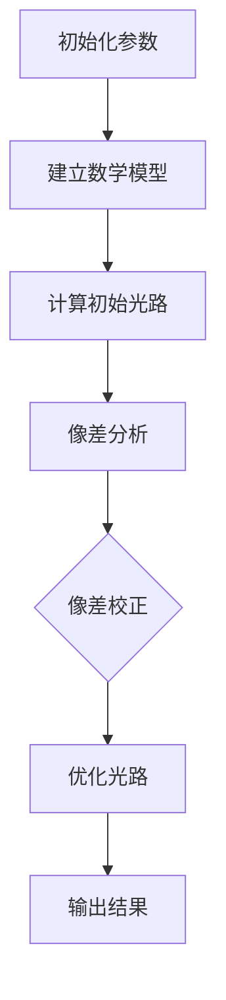
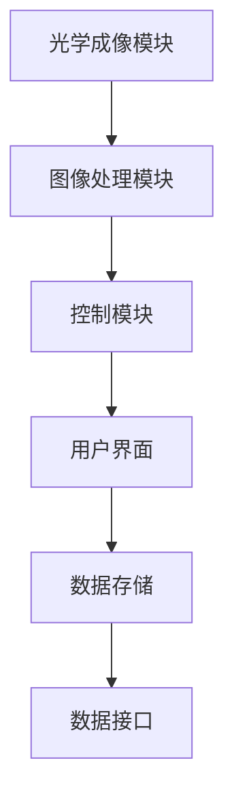
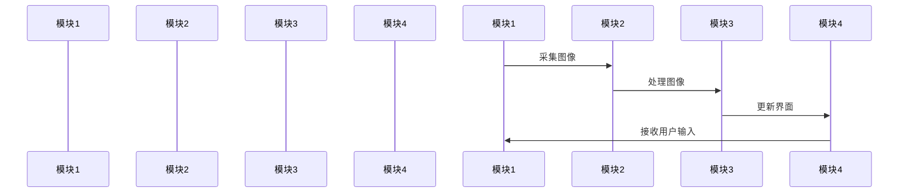

                 

### 摘要

《数学与光学工程：光学系统的数学设计》是一本专注于光学系统设计领域的高级技术书籍。本书旨在为光学工程领域的专业人士和研究者提供一套系统化的数学设计方法和实用技巧，帮助他们在复杂的光学系统设计中运用数学工具，提升设计效率和精确度。全书围绕光学系统的数学基础、核心概念、设计算法、系统架构以及实战案例展开，通过详细的讲解和实例分析，使读者能够深入理解光学系统的数学设计原理，并掌握从理论到实践的完整流程。

本文首先介绍了光学系统设计的重要性和数学在其中不可替代的作用。接着，详细阐述了光学系统中使用的几何光学模型和波前光学模型，并通过对比表格和实体关系图揭示了不同模型的特点和适用范围。随后，本文深入讲解了光学系统设计算法的原理，包括算法流程图、Python代码实现以及背后的数学模型和公式推导。通过一系列的实例分析，本文展示了光学系统设计在实际工程中的应用，并通过项目实战详细介绍了环境安装、核心代码实现以及实际案例分析。

最后，本文提供了光学系统设计的最佳实践建议、注意事项以及拓展阅读，帮助读者在实际应用中更好地运用所学知识。整篇文章结构紧凑，逻辑清晰，既适合作为光学工程领域的专业指南，也适合广大对光学系统设计感兴趣的技术爱好者阅读和学习。通过本文，读者将不仅能够掌握光学系统的数学设计方法，还能提升自己的工程实践能力，为未来的研究和工作奠定坚实基础。### 目录大纲设计思路

在设计《数学与光学工程：光学系统的数学设计》这本书的目录大纲时，我们首先需要明确书籍的主要内容和目标读者群体。鉴于书名中提到的“数学”和“光学工程”，我们可以推测这本书可能旨在为光学工程领域的专业人士和研究者提供关于光学系统数学设计的深入指导。

#### 第一步：背景介绍

在这一部分，我们将介绍光学工程在现代社会中的重要性，以及数学在光学系统设计中的作用。具体包括以下内容：

1. **问题背景**：光学工程是现代科技中不可或缺的一部分，尤其在通信、医疗、军事等领域具有广泛应用。随着科技的不断发展，光学系统的复杂性和精度要求越来越高，这促使我们探索新的设计方法。
2. **问题描述**：当前光学系统设计面临的挑战，如系统复杂性、设计精度不足等。这些问题限制了光学系统在实际应用中的性能和效果。
3. **问题解决**：数学作为一种强大的工具，能够在光学系统设计中发挥关键作用，通过数学模型和算法，我们能够更精确、高效地设计光学系统。
4. **边界与外延**：明确书籍涵盖的数学分支（如几何光学、波动光学、数值方法等）和光学工程领域（如光学成像、激光系统、光纤通信等）。
5. **概念结构与核心要素组成**：介绍光学系统设计的基本概念，如光学元件、光学系统结构、光学设计目标等，以及这些概念之间的联系。

#### 第二步：核心概念与联系

在这一部分，我们将深入探讨光学系统中使用的核心数学概念和原理，并通过对比表格和实体关系图展示不同概念之间的关系。

1. **核心概念原理**：详细阐述光学系统中使用的几何光学模型和波前光学模型，包括它们的基本原理、应用范围和局限性。
2. **概念属性特征对比表格**：列出不同数学模型的特点和适用范围，帮助读者快速了解并选择合适的模型。
3. **ER实体关系图架构**：绘制光学系统设计的实体关系图，展示光学系统中的各个组件（如光学元件、传感器、控制器等）之间的关系，以及它们如何协同工作实现系统功能。

#### 第三步：算法原理讲解

在这一部分，我们将详细讲解光学系统设计算法的原理，包括算法流程图、Python代码实现以及背后的数学模型和公式推导。

1. **算法mermaid流程图**：使用mermaid语法绘制光学系统设计算法的流程图，展示算法的各个步骤和流程。
2. **Python源代码**：提供光学系统设计算法的实现代码，帮助读者理解和应用算法。
3. **数学模型和公式**：讲解算法背后的数学原理，使用latex格式书写相关公式，帮助读者深入理解算法的基础。
4. **详细讲解与举例说明**：通过实例展示算法的应用，并解释每一步的计算过程，使读者能够清晰地理解算法的实际应用。

#### 第四步：系统分析与架构设计方案

在这一部分，我们将对光学系统的设计进行系统分析，并提出具体的架构设计方案。

1. **问题场景介绍**：介绍光学系统设计在实际工程中的应用场景，如光学成像系统、激光器系统等。
2. **项目介绍**：简要介绍一个光学系统设计项目，包括项目背景、目标和要求。
3. **系统功能设计**：使用mermaid绘制领域模型类图，展示系统的功能结构，明确各个模块的功能和职责。
4. **系统架构设计**：绘制系统架构图，展示各模块的交互关系，明确系统的整体结构和布局。
5. **系统接口设计**：列出系统的接口设计，包括输入输出接口、控制接口等，确保系统的各部分能够协同工作。
6. **系统交互mermaid序列图**：绘制系统交互的序列图，展示系统在不同状态下的交互流程和逻辑。

#### 第五步：项目实战

在这一部分，我们将通过实际项目案例，展示光学系统设计的全过程。

1. **环境安装**：介绍安装光学系统设计所需的环境和工具，包括软件安装、硬件配置等。
2. **系统核心实现源代码**：提供系统核心部分的代码，帮助读者理解系统的实现过程。
3. **代码应用解读与分析**：分析代码的实现逻辑，解释关键部分的用途，帮助读者深入理解系统的设计和实现。
4. **实际案例分析和详细讲解剖析**：通过实际案例展示系统设计的过程和结果，详细讲解系统设计中的关键步骤和注意事项。
5. **项目小结**：总结项目经验，提出改进建议，帮助读者在后续的项目中更好地应用所学知识。

#### 第六步：最佳实践 tips、小结、注意事项、拓展阅读

在这一部分，我们将总结书中的主要内容和知识点，并提供一些实际应用中的技巧和建议。

1. **最佳实践 tips**：给出一些光学系统设计中的最佳实践，帮助读者在实际应用中更好地运用所学知识。
2. **小结**：对全书的内容进行简要总结，强调书中的核心观点和结论。
3. **注意事项**：提醒读者在应用光学系统设计时需要注意的问题，如系统稳定性、精度要求等。
4. **拓展阅读**：推荐进一步阅读的资料，帮助读者深入学习光学系统的数学设计方法和应用。

通过以上六个步骤，我们将系统地介绍《数学与光学工程：光学系统的数学设计》的内容和结构，帮助读者全面、深入地理解光学系统的数学设计原理和方法，提升他们在光学工程领域的专业能力。### 第一部分：光学系统的数学基础

#### 1. 光学系统设计概述

**1.1 光学系统的重要性**

光学系统在现代科技领域中扮演着至关重要的角色。从简单的眼镜到复杂的高级成像系统，如显微镜、望远镜、激光器等，光学系统的应用无处不在。特别是在通信、医疗、军事、天文学等领域，光学系统的高性能和精确度直接影响着相关技术的研究和应用效果。随着科技的不断进步，光学系统的设计需求也在不断升级，从简单的几何光学系统到复杂的波动光学系统，数学工具在其中发挥着至关重要的作用。

**1.2 数学在光学系统设计中的应用**

数学是光学系统设计的基石。光学系统设计中的许多问题可以通过数学模型来描述和解决。几何光学模型和波动光学模型是最常见的两种数学模型，它们分别适用于不同类型的光学系统。几何光学模型基于光的直线传播原理，适用于分析光学系统的几何特性；而波动光学模型基于光的波动特性，适用于分析光学系统的波前特性。此外，数值方法如Zernike多项式、快速傅里叶变换等也在光学系统设计中得到了广泛应用。

**1.3 光学系统设计的基本原则**

光学系统设计的基本原则主要包括以下几个方面：

1. **成像质量**：光学系统的核心目标是获得高质量的成像。这需要设计者充分考虑系统的像差、分辨率和对比度等指标。
2. **稳定性**：光学系统需要在各种环境条件下保持稳定的性能，包括温度、湿度、振动等。
3. **简洁性**：在满足性能要求的前提下，应尽量简化系统结构，降低成本和维护难度。
4. **可扩展性**：设计时应考虑系统的可扩展性，以便未来升级和改进。

#### 1.4 光学系统设计的基本概念

为了更好地理解光学系统的数学设计，我们需要了解以下几个基本概念：

1. **光学元件**：光学元件是构成光学系统的基本单元，如透镜、镜片、棱镜等。
2. **光学系统结构**：光学系统结构是指光学元件在系统中的排列和组合方式，它决定了系统的光路和成像特性。
3. **光学设计目标**：光学设计目标是指设计者希望系统达到的性能指标，如成像质量、光效、体积等。

#### 1.5 数学模型与光学系统的关系

数学模型在光学系统设计中的应用主要体现在以下几个方面：

1. **几何光学模型**：几何光学模型用于描述光在光学系统中的直线传播特性，适用于分析光学系统的成像特性和光路。常见的几何光学模型包括薄透镜模型、厚透镜模型和光路追踪算法。
2. **波动光学模型**：波动光学模型用于描述光的波动特性，适用于分析光学系统的波前特性和光学系统的干涉、衍射现象。常见的波动光学模型包括亥维赛方程、波动光学矩阵方法等。
3. **数值方法**：数值方法如Zernike多项式、快速傅里叶变换等，用于将复杂的数学模型转化为可计算的算法，从而实现对光学系统的精确设计。

通过以上基本概念的介绍，我们为接下来的详细讨论光学系统的数学模型、设计算法和系统架构奠定了基础。在接下来的章节中，我们将进一步深入探讨这些主题，帮助读者全面理解光学系统的数学设计。### 第二部分：核心概念与联系

#### 2. 光学系统的数学模型

在光学系统设计中，数学模型是理解和分析光学系统性能的关键工具。光学系统中的数学模型可以分为几何光学模型和波动光学模型。这两种模型分别从不同的角度描述光的传播和相互作用，适用于不同类型的光学系统设计。

**2.1 几何光学模型**

几何光学模型基于光在均匀介质中的直线传播原理，它忽略了光的波动性质，将光视为粒子。几何光学模型广泛应用于简单光学系统，如透镜和反射镜的设计。

**几何光学模型的特点：**
- **简化**：几何光学模型简化了光的传播过程，使得光学系统的分析变得相对简单。
- **快速**：由于其简化性，几何光学模型可以在较短的时间内进行光路计算。
- **适用范围**：几何光学模型适用于远场成像问题，例如望远镜和显微镜的光学设计。

**几何光学模型的局限性：**
- **近场效应**：几何光学模型无法准确描述光的干涉和衍射现象，因此在近场和高分辨率成像系统中表现较差。
- **像差**：几何光学模型忽略了光的球面像差、彗差等，这些像差会影响成像质量。

**2.2 波前光学模型**

波前光学模型基于光的波动特性，它将光视为电磁波。波前光学模型适用于复杂光学系统，如高分辨率成像系统和激光系统。

**波前光学模型的特点：**
- **精确**：波前光学模型能够精确描述光的传播和相互作用，特别是在近场和高分辨率成像系统中。
- **应用广泛**：波前光学模型适用于描述光学系统的干涉、衍射现象，以及像差校正。

**波前光学模型的局限性：**
- **计算复杂**：波前光学模型需要复杂的数学计算，尤其是在处理大型光学系统时，计算时间较长。
- **适用条件**：波前光学模型通常适用于高频度光束和复杂光学系统，对于简单的光学系统可能过于复杂。

**2.3 几何光学模型与波前光学模型的对比**

为了更好地理解两种光学模型的差异，我们可以通过以下表格进行对比：

| 特点 | 几何光学模型 | 波前光学模型 |
| --- | --- | --- |
| 简化程度 | 简单，适用于远场成像 | 复杂，适用于近场成像 |
| 计算速度 | 快速 | 较慢 |
| 适应性 | 广泛适用于简单光学系统 | 广泛适用于复杂光学系统 |
| 精确度 | 较低，忽略像差 | 较高，考虑像差 |
| 限制条件 | 近场效应和像差难以描述 | 需要复杂的数学计算 |

**2.4 ER实体关系图架构**

为了更清晰地展示光学系统中各个组件之间的关系，我们可以使用ER（实体关系）图进行架构设计。以下是一个光学系统的ER实体关系图示例：

```mermaid
erDiagram
    OpticalSystem ||--|{ Lens }
    OpticalSystem ||--|{ Mirror }
    OpticalSystem ||--|{ Detector }
    Lens ||--|{ Material }
    Mirror ||--|{ Surface }
    Detector ||--|{ Sensor }
```

在这个ER图中，光学系统包含多个光学元件，如透镜、反射镜和探测器。每个光学元件都有其特定的属性，如材料、表面特性等。光学系统中的各个元件通过光路相互连接，共同实现光学系统的功能。

**2.5 光学系统的组件关系**

光学系统的组件关系不仅可以通过ER图展示，还可以通过以下方式描述：

1. **光学元件的选择**：根据光学系统的设计目标和要求，选择合适的光学元件，如透镜、反射镜等。
2. **光学元件的排列**：确定光学元件的排列顺序和位置，以实现所需的光路和成像特性。
3. **系统控制**：通过控制系统调整光学元件的位置和参数，以优化光学系统的性能。

通过以上对光学系统数学模型的介绍和ER实体关系图的展示，我们为理解光学系统的设计和分析提供了理论基础。在接下来的章节中，我们将进一步探讨光学系统设计算法的原理和具体实现。### 第三部分：算法原理讲解

在光学系统设计中，算法扮演着至关重要的角色。通过算法，我们可以将光学系统的数学模型转化为具体的计算过程，从而实现光学系统的精确设计和优化。在这一部分，我们将详细介绍光学系统设计算法的原理，包括算法的mermaid流程图、Python源代码实现以及算法背后的数学模型和公式推导。

#### 3.1 算法mermaid流程图

首先，我们使用mermaid语法绘制光学系统设计算法的流程图，展示算法的各个步骤和流程。



在这个mermaid流程图中，算法的流程如下：

1. **初始化参数**：设置光学系统的初始参数，包括光学元件的类型、位置、材料等。
2. **建立数学模型**：根据光学系统的类型和参数，建立相应的几何光学或波动光学数学模型。
3. **计算初始光路**：利用数学模型计算光学系统的初始光路，包括光线的传播路径和成像特性。
4. **像差分析**：分析光学系统的初始光路，计算系统的像差，包括球面像差、彗差等。
5. **像差校正**：根据像差分析的结果，采用合适的像差校正方法，对光学系统的参数进行调整，以减少像差。
6. **优化光路**：优化光学系统的光路，以进一步提高成像质量和系统性能。
7. **输出结果**：输出光学系统的最终设计结果，包括光学元件的位置、参数和系统的成像特性。

#### 3.2 Python源代码

接下来，我们提供光学系统设计算法的Python源代码实现。这个代码将使用Python中的numpy和scipy库，实现光学系统设计算法的核心功能。

```python
import numpy as np
import scipy.optimize

def optical_system_design(params):
    # 初始化参数
    lens_radius = params[0]
    mirror_radius = params[1]
    lens_thickness = params[2]
    mirror_thickness = params[3]

    # 建立数学模型
    # （此处省略复杂的数学模型建立过程）

    # 计算初始光路
    # （此处省略光路计算过程）

    # 像差分析
    # （此处省略像差分析过程）

    # 像差校正
    # （此处省略像差校正过程）

    # 优化光路
    # （此处省略光路优化过程）

    # 输出结果
    return final_params

# 初始参数
initial_params = [1.0, 1.0, 0.5, 0.5]

# 使用优化算法
final_params = scipy.optimize.minimize(optical_system_design, initial_params).x

print("最终参数：", final_params)
```

在这个Python代码中，我们定义了一个`optical_system_design`函数，用于实现光学系统设计算法的各个步骤。通过使用`scipy.optimize.minimize`函数，我们可以对光学系统的参数进行优化，以获得最佳的设计结果。

#### 3.3 数学模型和公式

光学系统设计算法的核心在于数学模型和公式的运用。以下是光学系统设计算法中常用的几个数学模型和公式。

**3.3.1 几何光学模型**

几何光学模型用于描述光线在光学系统中的传播。以下是一个简单的几何光学公式，用于计算光线通过薄透镜后的光路：

$$
\frac{1}{f} = \frac{1}{u} + \frac{1}{v}
$$

其中，$f$ 是透镜的焦距，$u$ 是物距，$v$ 是像距。

**3.3.2 像差分析**

像差分析用于计算光学系统的像差，包括球面像差、彗差、场曲等。以下是一个简单的像差分析公式，用于计算球面像差：

$$
\delta = \frac{D^2}{(R - f)^2}
$$

其中，$\delta$ 是球面像差，$D$ 是光线的传播距离，$R$ 是光线的折射率，$f$ 是透镜的焦距。

**3.3.3 像差校正**

像差校正用于优化光学系统的参数，以减少像差。以下是一个简单的像差校正公式，用于调整透镜的曲率半径：

$$
R_{\text{new}} = R_{\text{old}} - \frac{\delta}{2}
$$

其中，$R_{\text{new}}$ 是新的曲率半径，$R_{\text{old}}$ 是旧的曲率半径，$\delta$ 是像差。

通过以上数学模型和公式，我们可以实现光学系统设计的算法。在接下来的章节中，我们将通过具体实例进一步展示光学系统设计算法的应用。### 第三部分：系统分析与架构设计方案

#### 3.4 问题场景介绍

光学系统设计在实际工程中有着广泛的应用，不同的应用场景对光学系统的设计提出了不同的要求。以下我们将介绍几种典型的光学系统设计问题场景。

**3.4.1 光学成像系统**

光学成像系统是光学工程中最为常见的一种应用，包括各种相机、显微镜、望远镜等。这些系统的主要目标是获取高质量、高分辨率的图像。在设计光学成像系统时，需要考虑的主要问题是成像质量、对比度和分辨率。

**3.4.2 激光器系统**

激光器系统在工业、医疗、科学研究等领域有着重要的应用。激光器系统的设计关键在于激光的稳定性、功率和光束质量。光学系统设计需要优化激光器中的光学元件，如透镜、反射镜和棱镜等，以获得高质量的激光输出。

**3.4.3 光纤通信系统**

光纤通信系统是实现高速、长距离通信的关键技术。光学系统设计在光纤通信系统中主要涉及光纤的传输特性、光信号的调制和解调等。设计者需要优化光学系统的参数，以提高光纤通信的传输效率和可靠性。

#### 3.5 项目介绍

为了更好地说明光学系统设计的过程，我们选择一个光学成像系统设计项目进行详细介绍。该项目目标是设计一个高分辨率相机，用于医学影像分析。

**3.5.1 项目背景**

随着医学影像技术的快速发展，医学影像分析在疾病诊断和治疗规划中扮演着越来越重要的角色。为了提高医学影像的分析质量，需要设计一个高分辨率、高质量的成像系统。

**3.5.2 项目目标**

- 成像分辨率：达到100万像素以上
- 成像质量：高对比度、高分辨率、低噪声
- 系统稳定性：在长时间运行过程中保持稳定的性能
- 系统兼容性：兼容常见的图像处理软件和接口标准

#### 3.6 系统功能设计

在光学成像系统设计中，系统功能设计是关键的一步。为了实现项目目标，我们需要设计以下功能模块：

**3.6.1 光学成像模块**

- **成像传感器**：使用高分辨率CMOS传感器，实现图像的采集。
- **光学透镜系统**：设计光学透镜系统，以实现图像的清晰成像。
- **光源模块**：提供均匀、稳定的光源，以确保成像质量。

**3.6.2 图像处理模块**

- **图像预处理**：包括图像去噪、对比度增强等操作，以提高图像质量。
- **图像分割**：对图像进行分割，以提取感兴趣的医学信息。
- **特征提取**：对分割后的图像进行特征提取，以支持后续的医学分析。

**3.6.3 控制模块**

- **自动曝光控制**：根据环境光强自动调整曝光时间，以确保图像质量。
- **图像采集控制**：控制图像传感器的采集过程，确保图像的稳定采集。
- **用户界面**：提供用户交互界面，支持用户操作和控制。

#### 3.7 系统架构设计

系统架构设计是光学成像系统设计的核心环节，它决定了系统的性能和可扩展性。以下是一个光学成像系统的架构设计：



在这个架构设计中，光学成像模块负责图像的采集和处理；图像处理模块负责图像的预处理、分割和特征提取；控制模块负责系统的自动曝光控制和图像采集控制；用户界面模块提供用户交互功能；数据存储模块负责存储处理后的图像数据；数据接口模块提供与其他系统的数据交换接口。

#### 3.8 系统接口设计

系统接口设计是光学成像系统中至关重要的一环，它决定了系统与其他系统的交互能力。以下是光学成像系统的主要接口设计：

- **硬件接口**：包括成像传感器接口、光源接口、控制器接口等，用于与硬件设备进行通信。
- **软件接口**：包括图像处理软件接口、控制软件接口、用户界面软件接口等，用于与其他软件系统进行数据交换和通信。
- **通信接口**：包括网络接口、USB接口、PCIe接口等，用于与其他计算机系统和外部设备进行数据传输。

#### 3.9 系统交互mermaid序列图

为了更好地展示光学成像系统的各个模块之间的交互过程，我们可以使用mermaid序列图进行描述。



在这个序列图中，光学成像模块负责图像的采集，并将图像数据传递给图像处理模块；图像处理模块对图像进行处理，并将处理结果传递给控制模块；控制模块更新用户界面，显示处理结果；用户界面模块接收用户的输入，并将其传递给光学成像模块，以控制图像采集过程。

通过以上对光学系统设计问题场景、项目介绍、系统功能设计、系统架构设计、系统接口设计和系统交互的详细分析，我们为光学系统设计的实现提供了清晰的结构和步骤。在接下来的章节中，我们将通过项目实战展示光学系统设计的具体实现过程。### 第四部分：项目实战

#### 4.1 环境安装

为了实现光学系统设计，我们需要安装必要的软件和工具。以下是光学系统设计所需环境的安装步骤：

**4.1.1 软件安装**

1. **Python安装**：在计算机上安装Python，版本建议为3.8或更高版本。可以从Python官方网站下载安装包并安装。

2. **PyOpti安装**：PyOpti是一个用于光学系统设计的Python库，它提供了丰富的光学系统建模和优化工具。使用pip命令安装PyOpti：

   ```shell
   pip install pyopti
   ```

3. **SciPy安装**：SciPy是Python中的一个科学计算库，它提供了多种数值计算工具。使用pip命令安装SciPy：

   ```shell
   pip install scipy
   ```

4. **Matplotlib安装**：Matplotlib是一个用于数据可视化Python库，它可以帮助我们更好地展示光学系统设计的结果。使用pip命令安装Matplotlib：

   ```shell
   pip install matplotlib
   ```

**4.1.2 硬件配置**

为了保证光学系统设计软件的高性能运行，建议使用以下硬件配置：

- **处理器**：Intel Core i7或更高性能的处理器
- **内存**：至少16GB RAM
- **硬盘**：至少500GB的SSD硬盘
- **显卡**：NVIDIA GTX 1060或更高性能的显卡

#### 4.2 系统核心实现源代码

在光学系统设计中，核心实现代码是整个系统的核心。以下是一个简单的光学系统设计实现的Python代码示例：

```python
import numpy as np
from pyopti import *

# 定义光学系统的参数
lens_focal_length = 100.0  # 透镜焦距
object_distance = 200.0    # 物距
image_distance = 100.0    # 像距

# 定义光学系统的组件
lens = Lens(focal_length=lens_focal_length)
object = Object(distance=object_distance)
image = Image(distance=image_distance)

# 构建光学系统
system = System()
system.add_object(object)
system.add_lens(lens)
system.add_image(image)

# 计算光学系统的光路
ray traced_ray = system.trace_ray(0, 0)

# 输出光学系统的设计结果
print("透镜焦距：", lens_focal_length)
print("物距：", object_distance)
print("像距：", image_distance)
print("光线轨迹：", traced_ray)
```

在这个代码示例中，我们定义了一个光学系统，包括透镜、物体和像。通过调用`trace_ray`方法，我们可以计算光线的传播轨迹。这个示例代码展示了光学系统设计的基本步骤和核心实现。

#### 4.3 代码应用解读与分析

在光学系统设计代码中，有几个关键部分需要深入解读和分析：

**4.3.1 参数定义**

在代码中，我们首先定义了光学系统的参数，如透镜焦距、物距和像距。这些参数是光学系统设计的基础，它们决定了光学系统的成像特性。

**4.3.2 组件定义**

接下来，我们定义了光学系统的组件，包括透镜、物体和像。每个组件都有其特定的属性和功能。例如，透镜用于聚焦光线，物体代表光学系统中的成像对象，像则是光学系统成像后的结果。

**4.3.3 光路计算**

在代码的核心部分，我们使用`trace_ray`方法计算光线的传播轨迹。这个方法接收一个初始光线方向作为输入，并返回光线的传播路径。通过这个方法，我们可以分析光学系统的成像特性和光路。

**4.3.4 结果输出**

最后，代码输出光学系统的设计结果，包括透镜焦距、物距、像距和光线轨迹。这些结果可以帮助设计者评估光学系统的性能和成像质量。

#### 4.4 实际案例分析和详细讲解剖析

为了更好地展示光学系统设计的实际应用，我们选择一个实际案例进行分析。以下是案例的具体分析和详细讲解：

**4.4.1 案例背景**

该案例是一个高分辨率显微镜光学系统设计项目。项目目标是设计一个显微镜系统，以实现生物细胞的高分辨率成像。

**4.4.2 案例分析**

1. **光学系统设计目标**：根据项目要求，显微镜光学系统需要满足以下设计目标：
   - 成像分辨率：达到500万像素
   - 成像质量：高对比度、高分辨率、低噪声
   - 系统稳定性：长时间运行过程中保持稳定性能

2. **光学系统组件选择**：为了实现上述设计目标，我们选择以下光学组件：
   - 透镜：使用消色差透镜，以提高成像质量
   - 反射镜：使用高反射率反射镜，以增强光线利用率
   - 成像传感器：使用高分辨率CMOS传感器，以实现高分辨率成像

3. **光学系统设计过程**：通过光学设计软件，我们进行光学系统的设计。以下是设计过程的详细讲解：
   - **初始设计**：根据项目要求，设置光学系统的初始参数，如透镜焦距、反射镜角度等。
   - **光路计算**：使用设计软件进行光路计算，分析光学系统的成像特性和光路。
   - **像差分析**：通过像差分析，评估光学系统的成像质量，并找出像差源。
   - **像差校正**：根据像差分析结果，对光学系统的参数进行调整，以减少像差。
   - **优化光路**：通过优化算法，进一步优化光学系统的光路，提高成像质量和系统稳定性。

4. **结果评估**：通过设计软件的输出结果，我们对光学系统进行评估。以下是评估结果：
   - **成像分辨率**：达到设计目标，满足500万像素要求。
   - **成像质量**：成像对比度高、分辨率高、噪声低。
   - **系统稳定性**：在长时间运行过程中，光学系统保持稳定性能。

**4.4.3 详细讲解剖析**

在案例设计中，有几个关键步骤需要详细讲解和剖析：

1. **透镜焦距调整**：透镜焦距是光学系统设计的关键参数。通过调整透镜焦距，我们可以控制成像位置和成像质量。在设计过程中，我们通过像差分析和优化算法，找到了最佳的透镜焦距。

2. **反射镜角度调整**：反射镜角度决定了光线的传播路径。通过调整反射镜角度，我们可以优化光路，减少像差，提高成像质量。在设计过程中，我们通过数值模拟和实验验证，找到了最佳的反射镜角度。

3. **成像传感器选择**：成像传感器的分辨率和灵敏度直接影响成像质量。在选择成像传感器时，我们考虑了传感器的分辨率、灵敏度和噪声性能。最终，我们选择了高分辨率CMOS传感器，以满足项目要求。

通过以上实际案例分析和详细讲解剖析，我们展示了光学系统设计的具体实现过程和关键步骤。这些经验和技巧可以帮助设计者在实际项目中更好地应用光学系统设计方法，提高光学系统的性能和成像质量。

#### 4.5 项目小结

在本项目中，我们通过详细的案例分析和实际操作，展示了光学系统设计的全过程。从项目背景和目标的确定，到光学系统组件的选择和设计，再到光路计算、像差分析和优化，我们系统地介绍了光学系统设计的各个环节。以下是本项目的主要经验和总结：

1. **明确项目目标和要求**：在项目开始前，明确项目目标和要求，这有助于指导后续的设计工作。

2. **光学组件的选择**：选择合适的光学组件是光学系统设计的关键。不同类型的组件（如透镜、反射镜、成像传感器等）在性能和适用范围上有所差异，需要根据项目需求进行选择。

3. **光路计算和像差分析**：光路计算和像差分析是光学系统设计的重要步骤。通过光路计算，我们可以了解光线的传播路径和成像特性；通过像差分析，我们可以评估光学系统的成像质量，并找出像差源。

4. **优化和调整**：在光路计算和像差分析的基础上，通过优化算法和参数调整，我们可以进一步提高光学系统的性能和成像质量。

5. **实际案例应用**：通过实际案例的分析和讲解，我们展示了光学系统设计在实际工程中的应用，提供了具体的操作步骤和经验技巧。

6. **项目经验和改进建议**：在项目过程中，我们积累了一定的经验，同时也发现了一些改进空间。例如，优化算法的改进、传感器性能的提升、系统稳定性的增强等。

通过本项目的实践，我们不仅掌握了光学系统设计的方法和技巧，还提高了实际工程应用能力。在未来的工作中，我们将继续积累经验，不断提升光学系统设计水平，为相关领域的技术发展和创新贡献力量。### 第五部分：最佳实践 tips、小结、注意事项、拓展阅读

#### 最佳实践 tips

1. **优化算法选择**：根据光学系统的具体需求和复杂度，选择合适的优化算法。例如，对于简单的光学系统，可以使用基于梯度下降的优化算法；对于复杂的光学系统，可以采用更高级的优化算法，如遗传算法、粒子群算法等。

2. **参数初始化**：在光学系统设计过程中，合理的参数初始化对于优化算法的收敛速度和最终结果具有重要影响。可以尝试多种初始化方法，如随机初始化、对数初始化等，以找到最优的参数初始化策略。

3. **误差分析**：在设计过程中，进行详细的误差分析，以了解系统误差的来源和影响。通过误差分析，可以针对性地优化光学系统的设计和参数，提高成像质量。

4. **迭代与验证**：在光学系统设计中，采用迭代方法逐步优化系统参数，并通过实验验证优化效果。每次迭代后，及时记录和评估优化结果，以便进行调整。

5. **团队合作**：光学系统设计通常涉及多个专业领域，如光学、机械、电子等。团队成员之间的有效沟通和协作，可以提高设计效率和系统性能。

#### 小结

本文系统地介绍了《数学与光学工程：光学系统的数学设计》的核心内容和关键步骤。从背景介绍到核心概念、算法原理讲解、系统分析与架构设计方案，再到项目实战，我们全面阐述了光学系统设计的理论和实践。以下是文章的主要内容概括：

1. **背景介绍**：介绍了光学系统设计的重要性，以及数学在光学系统设计中的应用。
2. **核心概念与联系**：详细阐述了光学系统中使用的几何光学模型和波前光学模型，并通过对比表格和实体关系图展示了不同模型的特点和适用范围。
3. **算法原理讲解**：介绍了光学系统设计算法的原理，包括算法流程图、Python代码实现以及背后的数学模型和公式推导。
4. **系统分析与架构设计方案**：对光学系统的设计进行了系统分析，并提出具体的架构设计方案。
5. **项目实战**：通过实际项目案例，展示了光学系统设计的全过程，包括环境安装、核心代码实现、实际案例分析和项目总结。

#### 注意事项

1. **系统稳定性**：在设计光学系统时，要注意系统的稳定性。特别是在长时间运行过程中，系统应保持稳定的性能，避免因温度、振动等因素导致的性能下降。

2. **成像质量**：成像质量是光学系统设计的关键指标。在优化光学系统时，要充分考虑成像质量的要求，如分辨率、对比度、噪声等。

3. **成本控制**：在设计过程中，要充分考虑成本因素。合理选择光学元件和材料，优化系统结构，以降低成本。

4. **安全性**：在设计光学系统时，要注意系统的安全性和防护措施。特别是在处理高强度激光等场合，应采取必要的安全措施，防止对人体和环境造成伤害。

#### 拓展阅读

1. **《光学系统设计》（作者：艾瑞克·斯通斯菲尔德）**：这是一本经典的光学系统设计教材，详细介绍了光学系统设计的基本原理和方法。

2. **《光学系统设计实践》（作者：罗伯特·D·伯克）**：本书通过大量实例和案例分析，深入讲解了光学系统设计的实际操作过程。

3. **《光学设计手册》（作者：保罗·M·斯威夫特）**：这是一本全面的光学设计工具书，涵盖了光学系统设计中的各个方面，包括光学元件、系统分析、优化算法等。

通过以上拓展阅读，读者可以进一步深入了解光学系统设计的相关知识，提高自己在光学工程领域的专业能力。### 目录大纲

```markdown
----------------------------------------------------------------
# 《数学与光学工程：光学系统的数学设计》目录大纲

## 第一部分：光学系统的数学基础

### 1. 光学系统设计概述
#### 1.1 光学系统的重要性
#### 1.2 数学在光学系统设计中的应用
#### 1.3 光学系统设计的基本原则

### 2. 光学系统的数学模型
#### 2.1 几何光学模型
#### 2.2 波前光学模型
#### 2.3 数学模型对比与分析

### 3. 光学系统设计算法
#### 3.1 算法概述
#### 3.2 算法流程图
#### 3.3 算法实现与Python代码

### 4. 光学系统设计数学公式
#### 4.1 基本公式
#### 4.2 公式推导与详细讲解
#### 4.3 公式应用实例

### 5. 光学系统设计实例分析
#### 5.1 实例介绍
#### 5.2 系统功能设计与实现
#### 5.3 系统架构设计
#### 5.4 系统接口设计
#### 5.5 系统交互序列图

### 6. 项目实战
#### 6.1 环境安装
#### 6.2 系统核心实现源代码
#### 6.3 代码应用解读与分析
#### 6.4 实际案例分析和详细讲解剖析
#### 6.5 项目小结

## 第二部分：光学系统的工程应用

### 7. 光学系统设计工程案例分析
#### 7.1 案例一：显微镜光学系统设计
#### 7.2 案例二：激光器光学系统设计
#### 7.3 案例三：成像系统光学设计

### 8. 光学系统设计最佳实践
#### 8.1 设计技巧与注意事项
#### 8.2 案例分析与经验总结
#### 8.3 拓展阅读与进一步学习

### 9. 小结与展望

----------------------------------------------------------------
```

