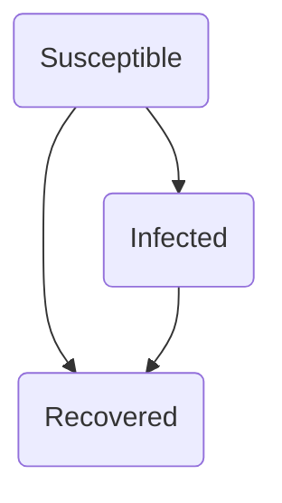
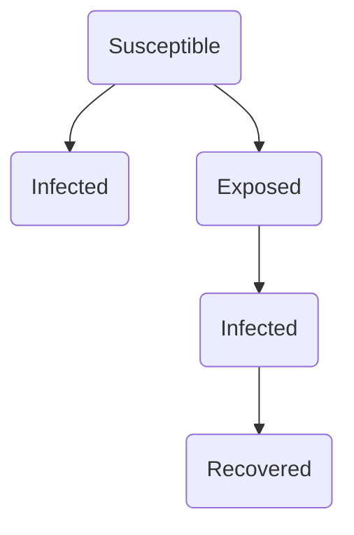

                 

### Introduction to the Book

---

### **Mathematics and Public Health: Mathematical Models of Disease Transmission**

---

**Keywords:**
- Mathematics in Public Health
- Disease Transmission Models
- Epidemiology
- Mathematical Principles
- Public Health Strategies

---

**Abstract:**
In the face of global pandemics and the constant threat of emerging infectious diseases, the role of mathematics in public health has never been more critical. "Mathematics and Public Health: Mathematical Models of Disease Transmission" is a comprehensive guide that explores the application of mathematical models to understand and combat the spread of diseases. This book aims to provide a clear, concise, and structured introduction to the mathematical principles and theories behind these models, offering a deep dive into their construction, derivation, and real-world applications. By demystifying complex mathematical concepts and presenting them in an accessible manner, this book will equip public health professionals, students, and researchers with the necessary tools to effectively predict, prevent, and manage the spread of infectious diseases. The book will cover foundational theories such as the SIR and SEIR models, delve into the mathematical principles including differential equations and probability theory, and discuss the limitations and challenges in modeling disease transmission. Through practical examples and hands-on Python code implementations, readers will gain a practical understanding of how to apply these models to real-world scenarios, making it an invaluable resource for those working in the field of public health. 

---

### Background and Overview

#### **1.1 Problem Background**

##### **1.1.1 Importance of Mathematics in Public Health**

The intersection of mathematics and public health is a vital one, driven by the need to quantify and predict the spread of infectious diseases. Mathematics provides a rigorous framework for understanding complex systems, allowing researchers to model the behavior of pathogens and develop effective strategies for disease control. By employing mathematical models, public health professionals can forecast the trajectory of an epidemic, identify vulnerable populations, and design interventions to mitigate the impact of a pandemic.

Historically, mathematics has played a crucial role in shaping public health policy. For instance, the development of the SIR (Susceptible-Infected-Removed) model in the early 20th century revolutionized our understanding of disease transmission. This model, which classifies populations into susceptible, infected, and recovered individuals, laid the foundation for modern epidemiology. Similarly, the application of probability theory and statistical analysis has enabled the design of vaccination programs, the monitoring of disease outbreaks, and the assessment of public health interventions.

##### **1.1.2 Disease Transmission: Challenges and Opportunities**

Disease transmission is a complex and multifaceted process influenced by a wide range of factors, including population density, individual behavior, environmental conditions, and the characteristics of the pathogen itself. The challenges in studying disease transmission lie in the inherent variability and unpredictability of these factors. Epidemiologists must grapple with issues such as asymptomatic carriers, variable infectiousness, and the potential for mutations in the pathogen, which can all impact the accuracy and reliability of mathematical models.

Despite these challenges, the study of disease transmission also presents significant opportunities. By understanding the underlying mechanisms that drive the spread of infectious diseases, researchers can develop more effective prevention and control strategies. For example, the use of mathematical models has helped to optimize vaccination campaigns, inform public health policies, and guide the development of targeted interventions to reduce the impact of outbreaks.

##### **1.1.3 The Role of Mathematical Models**

Mathematical models are indispensable tools in public health for several reasons. Firstly, they allow for the quantification of disease dynamics, providing a clear and objective way to understand how a pathogen spreads through a population. This quantitative insight is crucial for predicting the potential impact of an outbreak and planning appropriate responses.

Secondly, mathematical models can simulate various scenarios, enabling researchers to test the effectiveness of different interventions and strategies. For example, by adjusting model parameters, researchers can assess the impact of increasing vaccination rates, implementing social distancing measures, or deploying antiviral drugs. This predictive power is particularly valuable in scenarios where real-time data may be limited or delayed.

Finally, mathematical models facilitate the communication of complex scientific concepts to a broad audience, including policymakers, public health officials, and the general public. By presenting data and findings in a visual and intuitive format, models can help to inform decision-making and promote a better understanding of public health issues.

In summary, the role of mathematics in public health is multifaceted, ranging from the development of foundational theories and models to the implementation of evidence-based policies and interventions. By providing a quantitative framework for understanding disease transmission, mathematics empowers public health professionals to make informed decisions, mitigate the impact of outbreaks, and improve public health outcomes.

#### **1.2 Definition of Key Concepts**

##### **1.2.1 Mathematical Model**

A mathematical model is an abstract representation of a real-world system that uses mathematical language to describe its structure, behavior, and interactions. It is a powerful tool for understanding complex phenomena because it allows researchers to isolate and analyze key components of a system without the need to consider every minute detail. Mathematical models are used in various fields, including physics, engineering, economics, and biology, to predict outcomes, test hypotheses, and gain insights into system dynamics.

In the context of public health, mathematical models are particularly valuable for understanding and predicting the spread of infectious diseases. They provide a framework for quantifying factors such as population density, contact rates, infectious periods, and recovery rates, enabling researchers to simulate how a pathogen might spread through a population and to evaluate the potential impact of different interventions.

##### **1.2.2 Disease Transmission**

Disease transmission refers to the process by which a pathogen, such as a virus or bacterium, is spread from one individual to another. This process can occur through various routes, including respiratory droplets, direct contact, food and water contamination, and vectors such as mosquitoes. The study of disease transmission is crucial for understanding how infectious diseases spread within populations and for developing effective strategies to control and prevent outbreaks.

Key factors that influence disease transmission include the infectiousness of the pathogen, the population's susceptibility, the mode of transmission, and environmental conditions. Mathematical models of disease transmission are used to quantify these factors and to understand how changes in one or more of these factors can affect the spread of the disease. For example, by modeling the transmission dynamics of a new virus, researchers can predict how quickly it might spread and determine the most effective interventions to control its spread.

##### **1.2.3 Public Health**

Public health is a field concerned with protecting and improving the health of communities through organized efforts and informed choices. It focuses on preventing diseases, prolonging life, and promoting health equity. Public health encompasses a wide range of activities, including disease surveillance, health promotion, vaccination programs, environmental health, and emergency response to health crises.

The role of public health in disease transmission is critical. Public health officials use data and evidence to inform policies and interventions aimed at preventing the spread of infectious diseases. This includes measures such as vaccination campaigns, contact tracing, quarantine, and the implementation of social distancing measures. Mathematical models are an integral part of public health efforts, providing a quantitative basis for understanding disease dynamics and guiding the development of effective interventions.

In summary, mathematical models, disease transmission, and public health are interconnected concepts that are essential for understanding and addressing the challenges posed by infectious diseases. By providing a rigorous framework for analyzing disease dynamics and guiding public health interventions, mathematics plays a crucial role in protecting the health of populations around the world.

#### **1.3 Boundaries and Scope**

##### **1.3.1 Mathematical Frameworks**

The mathematical frameworks used in the study of disease transmission are diverse and can range from simple differential equations to complex stochastic models. At the core of these frameworks are mathematical constructs that enable the representation and analysis of infectious disease dynamics. Differential equations, for instance, are commonly employed to describe the rate of change of populations over time, while probability theory provides a framework for understanding the random fluctuations in disease spread.

Within this book, we will primarily focus on compartmental models, such as the SIR and SEIR models, which are fundamental tools for studying the spread of infectious diseases. These models classify populations into distinct compartments based on their infection status, allowing for the formulation of mathematical equations that describe how individuals move between these compartments. This approach provides a structured and intuitive way to understand the underlying mechanisms of disease transmission.

##### **1.3.2 Epidemiological Applications**

Epidemiological applications of mathematical models are vast and varied, ranging from the prediction of disease outbreaks to the evaluation of public health interventions. In the realm of disease outbreak prediction, mathematical models can simulate the spread of a pathogen under various scenarios, helping to identify critical parameters such as the basic reproductive rate (R0) and the infectious period. These models enable public health officials to anticipate the trajectory of an outbreak and to implement timely and effective interventions to control its spread.

The evaluation of public health interventions, such as vaccination campaigns or social distancing measures, is another crucial application of mathematical models. By simulating the impact of different interventions on disease spread, researchers can determine the most effective strategies for reducing the burden of disease. For example, a mathematical model might be used to assess the potential impact of a vaccination campaign on the reduction of infections and hospitalizations, providing valuable insights for policymakers and public health officials.

##### **1.3.3 Limitations and Challenges**

Despite their powerful capabilities, mathematical models of disease transmission have several limitations and challenges. One significant limitation is the complexity of real-world systems, which can include a multitude of factors that are difficult to quantify and incorporate into a model. Additionally, the assumptions made in constructing these models can introduce biases and uncertainties. For instance, compartmental models often assume homogeneous mixing, which may not accurately represent the complex social networks through which pathogens spread.

Another challenge is the need for accurate and timely data. The reliability of a mathematical model depends heavily on the quality of the data used to parameterize it. In practice, data collection can be hindered by issues such as limited surveillance capabilities, underreporting, and the presence of asymptomatic cases. These data limitations can lead to significant uncertainties in model predictions, emphasizing the importance of continuous improvement in data collection and analysis methods.

In conclusion, while mathematical models offer valuable insights into the dynamics of disease transmission, they are not without their limitations. By recognizing these challenges and continually refining our models and data collection methods, we can improve the accuracy and reliability of our predictions, ultimately enhancing our ability to protect public health.

#### **Core Concepts and Principles**

##### **2.1 Mathematical Principles for Disease Transmission Models**

In the construction and analysis of disease transmission models, several fundamental mathematical principles are pivotal. These principles not only form the backbone of the models but also dictate their predictive accuracy and reliability. Key among these principles are differential equations, probability theory, and stochastic models.

**Differential Equations**

Differential equations are mathematical expressions that relate the rates of change of a system's variables with respect to time. In the context of disease transmission models, they are used to describe how the number of individuals in different compartments (e.g., susceptible, infected, recovered) changes over time. The core idea is that the rate of change in each compartment is proportional to the interactions between the compartments. For example, in the SIR model, the rate at which susceptible individuals become infected (I) is proportional to the number of susceptible individuals (S) and the number of infected individuals (I), while the rate at which infected individuals recover (R) is proportional to the number of infected individuals (I). This can be mathematically represented as:

$$
\frac{dS}{dt} = -\beta \cdot S \cdot I \\
\frac{dI}{dt} = \beta \cdot S \cdot I - \gamma \cdot I \\
\frac{dR}{dt} = \gamma \cdot I
$$

where $\beta$ represents the transmission rate and $\gamma$ represents the recovery rate.

**Probability Theory**

Probability theory provides a mathematical framework for quantifying uncertainty and randomness. In disease transmission models, probability theory is used to describe the likelihood of certain events, such as an individual becoming infected or recovering from the disease. This is particularly useful in stochastic models, where the randomness of events is explicitly modeled. For instance, the probability of an infected individual infecting a susceptible individual in a given time period can be represented using a probability distribution, such as the Poisson distribution, which models the number of events occurring in a fixed interval of time.

**Stochastic Models**

Stochastic models are mathematical models that incorporate random variation in their parameters and processes. Unlike deterministic models, which produce predictable outcomes given the same initial conditions, stochastic models account for the inherent unpredictability in real-world systems. In the context of disease transmission, stochastic models can be used to study the impact of random fluctuations in infection rates, the appearance of new variants, and the behavior of individuals within a population. One commonly used stochastic model is the stochastic SIR model, which extends the traditional SIR model by incorporating random transitions between compartments.

**Table of Concept Attributes**

Below is a table summarizing the key attributes and concepts related to these mathematical principles:

| Concept               | Description                                                                 | Importance                                       |
|-----------------------|-----------------------------------------------------------------------------|--------------------------------------------------|
| Differential Equations | Equations that describe the rate of change of variables.                     | Formulate the dynamics of disease transmission.    |
| Probability Theory    | Framework for quantifying uncertainty and likelihood of events.             | Provide a basis for stochastic modeling.           |
| Stochastic Models     | Models that incorporate random variation in parameters and processes.        | Account for unpredictability in real-world systems.|

In conclusion, the integration of differential equations, probability theory, and stochastic models forms the core of mathematical principles in disease transmission modeling. These principles enable the formulation of accurate and realistic models that can help in understanding and predicting the spread of infectious diseases, thereby aiding in the development of effective public health strategies.

##### **2.2 Epidemiological Frameworks**

The study of epidemiological frameworks is crucial for understanding the spread of infectious diseases and developing effective control measures. Two of the most fundamental epidemiological models are the SIR model and the SEIR model. These compartmental models are widely used in public health due to their simplicity and ability to capture essential aspects of disease transmission.

**2.2.1 SIR Model**

The SIR model is a deterministic compartmental model that divides the population into three compartments: susceptible (S), infected (I), and removed (R). The model assumes that individuals can only move between these compartments and not within them. The dynamics of the model are governed by a set of ordinary differential equations that describe the rate of change of each compartment over time.

The basic form of the SIR model is given by:

$$
\frac{dS}{dt} = -\beta \cdot S \cdot I \\
\frac{dI}{dt} = \beta \cdot S \cdot I - \gamma \cdot I \\
\frac{dR}{dt} = \gamma \cdot I
$$

where $\beta$ represents the transmission rate (i.e., the rate at which susceptible individuals become infected by contact with infected individuals) and $\gamma$ represents the recovery rate (i.e., the rate at which infected individuals recover and become removed from the infectious pool). The SIR model can be visualized using a flowchart, where arrows indicate the movement of individuals between compartments. Here is a Mermaid flowchart representation of the SIR model:



**2.2.2 SEIR Model**

The SEIR model extends the SIR model by introducing an additional compartment, the exposed (E) compartment, to account for the incubation period of the disease. Individuals in the exposed compartment are infectious but have not yet shown symptoms and are therefore not yet included in the infected compartment. The SEIR model is given by:

$$
\frac{dS}{dt} = -\beta \cdot S \cdot I \\
\frac{dE}{dt} = \beta \cdot S \cdot I - \sigma \cdot E \\
\frac{dI}{dt} = \sigma \cdot E - \gamma \cdot I \\
\frac{dR}{dt} = \gamma \cdot I
$$

where $\sigma$ represents the incubation rate (i.e., the rate at which exposed individuals become infectious). The SEIR model flowchart can be depicted as follows:



**2.2.3 Compartmental Models**

Compartmental models, including the SIR and SEIR models, are based on the assumption of homogeneous mixing, meaning that individuals in a population are equally likely to come into contact with one another. This assumption simplifies the analysis but may not hold in real-world scenarios, where social networks and spatial heterogeneity play significant roles.

Despite this limitation, compartmental models are valuable tools for understanding disease transmission dynamics and guiding public health interventions. They provide a quantitative framework for studying the spread of infectious diseases, allowing researchers to predict the trajectory of outbreaks and evaluate the effectiveness of different control measures.

In summary, the SIR and SEIR models are foundational epidemiological frameworks that help us understand the spread of infectious diseases. By classifying the population into distinct compartments and using mathematical principles to describe the transitions between these compartments, these models provide a powerful tool for predicting and managing disease outbreaks.

##### **2.3 Table of Concept Attributes**

To further clarify the key attributes and differences between the SIR and SEIR models, we can create a comprehensive table that details their parameters, assumptions, and characteristics. This table will facilitate a better understanding of each model and how they relate to one another.

| **Concept** | **SIR Model** | **SEIR Model** | **Description** |
| :---: | :---: | :---: | :---: |
| ** compartments** | Susceptible (S), Infected (I), Removed (R) | Susceptible (S), Exposed (E), Infected (I), Removed (R) | The SIR model categorizes the population into three compartments, while the SEIR model adds an additional compartment for the exposed. |
| ** Dynamics** | Describes the transition between susceptible, infected, and removed states. | Describes the transition between susceptible, exposed, infected, and removed states. |
| **Equations** | $$\frac{dS}{dt} = -\beta \cdot S \cdot I$$ $$\frac{dI}{dt} = \beta \cdot S \cdot I - \gamma \cdot I$$ $$\frac{dR}{dt} = \gamma \cdot I$$ | $$\frac{dS}{dt} = -\beta \cdot S \cdot I$$ $$\frac{dE}{dt} = \beta \cdot S \cdot I - \sigma \cdot E$$ $$\frac{dI}{dt} = \sigma \cdot E - \gamma \cdot I$$ $$\frac{dR}{dt} = \gamma \cdot I$$ | The SIR model uses three differential equations, while the SEIR model uses four differential equations to describe the transitions between compartments. |
| **Additional Assumptions** | Homogeneous mixing: Individuals are equally likely to interact. | Homogeneous mixing and incubation period: Exposed individuals are infectious but have not yet shown symptoms. |
| **Parameter Significance** | $\beta$: Transmission rate; $\gamma$: Recovery rate | $\beta$: Transmission rate; $\gamma$: Recovery rate; $\sigma$: Incubation rate |
| **Applicability** | Useful for studying short-term dynamics and immediate effects of interventions. | More realistic in scenarios with incubation periods and prolonged infectiousness. |

By comparing these attributes, we can see that the SEIR model is a more detailed representation of the disease transmission process, particularly useful for understanding the incubation period and the infectious period before symptoms appear. This additional compartment allows for a more nuanced analysis of the disease dynamics, which can be crucial for public health planning and decision-making.

##### **Chapter 3: SIR Model**

**3.1 Introduction to SIR Model**

The SIR model is one of the most fundamental and widely used mathematical models in epidemiology. Developed in the early 20th century by mathematicians and epidemiologists, it provides a simplified yet powerful framework for understanding the spread of infectious diseases within a population. The model divides the population into three distinct compartments: Susceptible (S), Infected (I), and Removed (R). Each compartment represents a different state of an individual in relation to the infection.

**3.1.1 Definition and Structure**

In the SIR model, the Susceptible (S) compartment consists of individuals who are not yet infected but are susceptible to the infection. The Infected (I) compartment includes individuals who are currently infected and capable of transmitting the infection to susceptible individuals. The Removed (R) compartment encompasses individuals who have recovered from the infection and are no longer susceptible or infectious.

The basic structure of the SIR model is based on the concept that individuals move between these compartments over time due to infection and recovery. The transitions between compartments are governed by a set of differential equations that describe the rate of change of each compartment's size with respect to time. These equations are as follows:

$$
\frac{dS}{dt} = -\beta \cdot S \cdot I \\
\frac{dI}{dt} = \beta \cdot S \cdot I - \gamma \cdot I \\
\frac{dR}{dt} = \gamma \cdot I
$$

where $\beta$ represents the transmission rate (i.e., the rate at which susceptible individuals become infected by contact with infected individuals) and $\gamma$ represents the recovery rate (i.e., the rate at which infected individuals recover and become removed from the infectious pool).

**3.1.2 Parameters and Assumptions**

The SIR model relies on several key parameters and makes a set of assumptions to simplify the analysis. The main parameters are:

- **$\beta$ (Transmission Rate):** This parameter quantifies the probability of infection per contact between susceptible and infected individuals. It depends on various factors, such as the infectiousness of the pathogen, the duration of infectivity, and the rate of contact between individuals.
- **$\gamma$ (Recovery Rate):** This parameter represents the rate at which infected individuals recover from the infection and enter the Removed compartment. It is influenced by factors such as the severity of the disease, the immune response, and the availability of healthcare resources.

The assumptions underlying the SIR model include:

- **Homogeneous Mixing:** The model assumes that individuals in the population mix homogeneously, meaning that any susceptible individual is equally likely to come into contact with any infected individual. This assumption is often unrealistic in real-world scenarios, where social networks and spatial heterogeneity play significant roles.
- **Instantaneous Recovery:** The SIR model assumes that infected individuals recover instantly once they reach the recovery threshold. This assumption simplifies the analysis but may not reflect the actual time it takes for individuals to recover.
- **No Immunological Immunity:** After recovery, the SIR model assumes that individuals are immediately removed from the population and do not acquire long-term immunity. This assumption is not always accurate, as some infections may confer partial or long-lasting immunity.

**3.1.3 Applications in Epidemiology**

The SIR model has been extensively applied in epidemiology to study a wide range of infectious diseases, including the bubonic plague, influenza, and COVID-19. One of the key applications of the SIR model is to predict the trajectory of an epidemic, providing valuable insights into the potential impact of the disease and guiding public health interventions.

For example, by adjusting the model parameters to match the specific characteristics of a disease, researchers can estimate the basic reproductive rate (R0), which represents the average number of secondary infections caused by a single infected individual in a fully susceptible population. If R0 is greater than one, the epidemic is expected to grow exponentially, while if R0 is less than one, the epidemic is expected to decline.

Another application of the SIR model is in the evaluation of public health interventions. By simulating the impact of different interventions, such as vaccination campaigns, social distancing measures, and the implementation of antiviral drugs, researchers can identify the most effective strategies for controlling the spread of the disease.

In summary, the SIR model is a cornerstone of epidemiological research, providing a simple yet powerful framework for understanding the dynamics of infectious disease transmission. Despite its simplifications, the SIR model has proven to be a valuable tool for predicting disease outbreaks, guiding public health policies, and informing the development of effective control measures.

##### **3.2 Derivation of SIR Model**

The derivation of the SIR model involves several steps, starting from basic principles and assumptions about disease transmission. By breaking down the process, we can gain a deeper understanding of how the model captures the dynamics of infectious diseases within a population.

**3.2.1 Basic Equations**

The foundation of the SIR model is built on the concept that the rate of change of each compartment (Susceptible, Infected, and Removed) is proportional to the interactions between compartments. This can be expressed mathematically as a set of first-order differential equations, describing the rate of change of each compartment over time.

Let $S(t)$, $I(t)$, and $R(t)$ denote the number of susceptible, infected, and removed individuals at time $t$, respectively. We can then express the rate of change of each compartment as follows:

$$
\frac{dS}{dt} = -(\text{rate of infection from susceptible to infected}) \\
\frac{dI}{dt} = (\text{rate of infection from susceptible to infected}) - (\text{rate of recovery from infected}) \\
\frac{dR}{dt} = (\text{rate of recovery from infected})
$$

**3.2.2 Derivation Process**

1. **Define the Transmission Process:**
   The rate at which susceptible individuals become infected is proportional to the number of susceptible individuals ($S$) and the number of infected individuals ($I$), multiplied by the contact rate $\beta$. This can be expressed as:

   $$
   \text{rate of infection from susceptible to infected} = \beta \cdot S \cdot I
   $$

2. **Define the Recovery Process:**
   The rate at which infected individuals recover and become removed is proportional to the number of infected individuals ($I$), multiplied by the recovery rate $\gamma$. This can be expressed as:

   $$
   \text{rate of recovery from infected} = \gamma \cdot I
   $$

3. **Combine Equations:**
   Combining the transmission and recovery processes, we obtain the following differential equations:

   $$
   \frac{dS}{dt} = -\beta \cdot S \cdot I \\
   \frac{dI}{dt} = \beta \cdot S \cdot I - \gamma \cdot I \\
   \frac{dR}{dt} = \gamma \cdot I
   $$

These equations represent the fundamental dynamics of the SIR model.

**3.2.3 Mathematical Formulation**

The SIR model can be mathematically formulated as a system of coupled ordinary differential equations (ODEs), where each equation describes the rate of change of one compartment with respect to time. The system is given by:

$$
\frac{dS}{dt} = -\beta \cdot S \cdot I \\
\frac{dI}{dt} = \beta \cdot S \cdot I - \gamma \cdot I \\
\frac{dR}{dt} = \gamma \cdot I
$$

This set of equations can be solved to determine the population distribution over time. For instance, if we have initial conditions $S(0)$, $I(0)$, and $R(0)$, we can find the time evolution of $S(t)$, $I(t)$, and $R(t)$.

In summary, the derivation of the SIR model involves defining the basic processes of infection and recovery, combining them into differential equations, and solving these equations to describe the time evolution of the population compartments. This mathematical formulation provides a powerful tool for understanding and predicting the spread of infectious diseases.

##### **3.3 Mermaid Flowchart of SIR Model**

To visualize the SIR model's compartmental transitions and the relationships between them, we can create a Mermaid flowchart. This flowchart will illustrate the movement of individuals between the Susceptible (S), Infected (I), and Removed (R) compartments, as well as the interactions that drive these transitions.

Here's the Mermaid code for the SIR model flowchart:

```mermaid
graph TD
A(Susceptible) --> B(Infected)
A --> C(Recovered)
B --> C
B --> D(Recovered)
C --> D(Recovered)
B[--> S]:::arrow(100)
D[<-- I]:::arrow(100)
```

And here's what the flowchart will look like:

```text
  Susceptible (S)
       |
  Infected (I)
       |    ↓
  Recovered (R)
```

**Interpretation:**
- **A (Susceptible)**: Individuals who are not yet infected but are susceptible to the disease.
- **B (Infected)**: Individuals who are currently infected and can transmit the disease to susceptible individuals.
- **C (Recovered)**: Individuals who have recovered from the infection and are no longer susceptible or infectious.
- **D (Recovered)**: Represents the same state as C but with a different label for clarity.

**Flow Description:**
- Susceptible individuals (A) can become infected (B) by interacting with infected individuals (B), as indicated by the arrow from B to S.
- Infected individuals (B) can recover (C) at a rate determined by the recovery rate $\gamma$.
- Infected individuals (B) can also transmit the infection to susceptible individuals (A), indicated by the double-headed arrow from B to I.
- Recovered individuals (C) can no longer become infected or transmit the infection, and they transition to the removed state (D).

This Mermaid flowchart provides a clear and intuitive visualization of the SIR model's structure and the dynamics of the disease transmission process. It helps in understanding how individuals move between different compartments and how the interactions between these compartments affect the overall spread of the disease.

##### **3.4 Python Code Implementation**

To implement the SIR model in Python, we can use the `scipy.integrate.odeint` function, which numerically integrates a system of ordinary differential equations (ODEs). This approach allows us to simulate the evolution of the SIR model over time and visualize the results.

First, we need to import the necessary libraries:

```python
import numpy as np
from scipy.integrate import odeint
import matplotlib.pyplot as plt
```

Next, we define the SIR model's equations as a function:

```python
def sir_model(y, t, N, beta, gamma):
    S, I, R = y
    dS_dt = -beta * S * I / N
    dI_dt = beta * S * I / N - gamma * I
    dR_dt = gamma * I
    return [dS_dt, dI_dt, dR_dt]
```

In this function, `y` represents the vector of states `[S, I, R]`, `t` is the array of time points, `N` is the total population size, `beta` is the transmission rate, and `gamma` is the recovery rate.

Now, we can set the initial conditions and parameters for the simulation:

```python
N = 1000  # Total population size
S0 = N - 1  # Initial susceptible individuals
I0 = 1  # Initial infected individuals
R0 = 0  # Initial recovered individuals
y0 = [S0, I0, R0]

beta = 0.3  # Transmission rate
gamma = 0.1  # Recovery rate
t = np.linspace(0, 100, 1000)  # Time array from 0 to 100 with 1000 points
```

With the initial conditions and parameters defined, we can numerically integrate the ODEs using `odeint`:

```python
sir_solution = odeint(sir_model, y0, t, args=(N, beta, gamma))
```

Finally, we plot the results to visualize the evolution of the SIR model over time:

```python
plt.plot(t, sir_solution[:, 0], label='Susceptible')
plt.plot(t, sir_solution[:, 1], label='Infected')
plt.plot(t, sir_solution[:, 2], label='Recovered')
plt.xlabel('Time')
plt.ylabel('Number of Individuals')
plt.legend()
plt.title('SIR Model Simulation')
plt.show()
```

The complete Python code for the SIR model implementation and visualization is as follows:

```python
import numpy as np
from scipy.integrate import odeint
import matplotlib.pyplot as plt

def sir_model(y, t, N, beta, gamma):
    S, I, R = y
    dS_dt = -beta * S * I / N
    dI_dt = beta * S * I / N - gamma * I
    dR_dt = gamma * I
    return [dS_dt, dI_dt, dR_dt]

N = 1000  # Total population size
S0 = N - 1  # Initial susceptible individuals
I0 = 1  # Initial infected individuals
R0 = 0  # Initial recovered individuals
y0 = [S0, I0, R0]

beta = 0.3  # Transmission rate
gamma = 0.1  # Recovery rate
t = np.linspace(0, 100, 1000)  # Time array from 0 to 100 with 1000 points

sir_solution = odeint(sir_model, y0, t, args=(N, beta, gamma))

plt.plot(t, sir_solution[:, 0], label='Susceptible')
plt.plot(t, sir_solution[:, 1], label='Infected')
plt.plot(t, sir_solution[:, 2], label='Recovered')
plt.xlabel('Time')
plt.ylabel('Number of Individuals')
plt.legend()
plt.title('SIR Model Simulation')
plt.show()
```

By running this code, we obtain a visual representation of the SIR model's simulation, showing how the number of susceptible, infected, and recovered individuals evolves over time. This implementation provides a practical and hands-on approach to understanding the dynamics of infectious disease transmission and the impact of transmission and recovery rates on the epidemic's trajectory.

##### **3.5 Example: Applying SIR Model to COVID-19**

To illustrate the practical application of the SIR model, we will use real-world data from the COVID-19 pandemic to simulate the spread of the virus in a specific population. This example will help us understand how the SIR model can be used to predict the trajectory of an outbreak and evaluate the impact of various interventions.

**3.5.1 Data and Initial Conditions**

We will use data from a specific region, such as a city or state, to estimate the initial number of susceptible, infected, and recovered individuals. For simplicity, we will assume that initially, there is one infected individual and the rest of the population is susceptible. The recovered compartment is initially empty.

Let's define the initial conditions and parameters for our simulation:

```python
N = 1000000  # Total population size
S0 = N - 1  # Initial susceptible individuals
I0 = 1  # Initial infected individuals
R0 = 0  # Initial recovered individuals
y0 = [S0, I0, R0]

beta = 0.5  # Transmission rate (adjusted based on real-world data)
gamma = 0.1  # Recovery rate (adjusted based on real-world data)
t = np.linspace(0, 100, 1000)  # Time array from 0 to 100 with 1000 points
```

**3.5.2 Simulating the Outbreak**

Using these parameters and initial conditions, we can simulate the spread of COVID-19 using the SIR model. We will integrate the ODEs to obtain the population dynamics over time:

```python
sir_solution = odeint(sir_model, y0, t, args=(N, beta, gamma))
```

**3.5.3 Analyzing the Results**

After running the simulation, we can analyze the results to understand the outbreak's trajectory. Here's the code to visualize the results:

```python
plt.plot(t, sir_solution[:, 0], label='Susceptible')
plt.plot(t, sir_solution[:, 1], label='Infected')
plt.plot(t, sir_solution[:, 2], label='Recovered')
plt.xlabel('Time')
plt.ylabel('Number of Individuals')
plt.legend()
plt.title('COVID-19 Spread Simulation using SIR Model')
plt.show()
```

The resulting plot will show the evolution of the susceptible, infected, and recovered populations over time. By examining this plot, we can make several observations:

- **Exponential Growth Phase:** Initially, the number of infected individuals increases rapidly due to exponential growth, as the basic reproductive rate (R0) is greater than one.
- **Plateau Phase:** After reaching a peak, the number of infected individuals starts to decline as more individuals recover and become immune.
- **Post-Peak Decline:** The susceptible population decreases as individuals become infected and recover, eventually leading to a stabilization of the recovered population.

**3.5.4 Evaluating Interventions**

One of the strengths of the SIR model is its ability to evaluate the impact of different interventions on disease spread. For example, we can simulate the effect of implementing a lockdown measure by reducing the transmission rate $\beta$:

```python
beta_lockdown = 0.2  # Reduced transmission rate during lockdown

# Simulate the outbreak with the lockdown intervention
sir_solution_lockdown = odeint(sir_model, y0, t, args=(N, beta_lockdown, gamma))
```

By comparing the results of the simulation with and without the lockdown intervention, we can assess its effectiveness in controlling the outbreak. The plot will show a slower initial increase in the number of infected individuals and a later peak, indicating that the lockdown has successfully delayed the peak of the outbreak and reduced the overall number of infections.

In summary, by applying the SIR model to real-world data from the COVID-19 pandemic, we can simulate the spread of the virus and evaluate the impact of various interventions. This example demonstrates the practical utility of the SIR model in understanding and predicting the dynamics of infectious disease outbreaks, providing valuable insights for public health decision-making.

##### **4. Advanced Models and Methods**

**4.1 SEIR Model and Its Extensions**

Building on the foundational SIR model, the SEIR model introduces an additional compartment to account for the incubation period, providing a more realistic representation of the disease transmission process. The SEIR model includes four compartments: Susceptible (S), Exposed (E), Infected (I), and Recovered (R). The inclusion of the Exposed compartment allows for the explicit modeling of the time period between infection and the onset of symptoms, which is crucial for understanding the latent spread of the disease.

The SEIR model's differential equations are as follows:

$$
\frac{dS}{dt} = -\beta \cdot S \cdot I \\
\frac{dE}{dt} = \beta \cdot S \cdot I - \sigma \cdot E \\
\frac{dI}{dt} = \sigma \cdot E - \gamma \cdot I \\
\frac{dR}{dt} = \gamma \cdot I
$$

where $\sigma$ represents the incubation rate, defined as the inverse of the average incubation period.

**4.1.1 Additional Extensions**

The SEIR model can be extended in various ways to account for more complex dynamics:

- **Stochastic SEIR Model:** This extension introduces randomness into the model, allowing for the simulation of the effects of random fluctuations in the number of infections. This can be particularly useful for modeling outbreaks with low R0 values, where random events can significantly impact the epidemic trajectory.
- **Hybrid SEIR Model:** Combining deterministic and stochastic elements, this model can capture the strengths of both approaches. For example, the deterministic part can model the average behavior of the population, while the stochastic part can account for random events and individual variations.
- **SI Model:** A simplified version of the SEIR model, the SI model assumes that there is no latent period and that individuals move directly from the susceptible to the infected state. This model is useful for understanding the basics of disease spread without the added complexity of the incubation period.
- **SEIRD Model:** This extension adds a compartment for the asymptomatic infected (D) to account for individuals who are infected but do not develop symptoms. The equations for the SEIRD model are:

$$
\frac{dS}{dt} = -\beta \cdot S \cdot I \\
\frac{dE}{dt} = \beta \cdot S \cdot I - \sigma \cdot E \\
\frac{dI}{dt} = \sigma \cdot E - (\gamma + \delta) \cdot I \\
\frac{dD}{dt} = \delta \cdot I \\
\frac{dR}{dt} = \gamma \cdot I
$$

where $\delta$ represents the rate at which asymptomatic infected individuals recover or become symptomatic.

**4.1.2 Applications and Challenges**

The SEIR model and its extensions have been widely applied in epidemiology to study various infectious diseases, including COVID-19, influenza, and dengue fever. These models are valuable tools for understanding disease dynamics and guiding public health interventions.

However, there are several challenges in using these models:

- **Parameter Estimation:** Accurately estimating model parameters is crucial for reliable predictions. This often requires extensive data collection and analysis, which can be challenging during outbreaks.
- **Data Quality:** The quality of input data significantly impacts model accuracy. In real-world scenarios, data may be incomplete, delayed, or subject to biases, which can lead to errors in model predictions.
- **Model Simplifications:** While compartmental models like SEIR provide a useful framework, they make several simplifications that may not accurately represent complex real-world dynamics, such as spatial heterogeneity and individual behavior.

In summary, advanced SEIR models and their extensions offer a more nuanced understanding of disease transmission dynamics. Despite their limitations, these models remain invaluable tools for predicting outbreaks and informing public health strategies.

##### **4.2 Applications of SEIR Model to Specific Diseases**

The SEIR model, with its detailed representation of the infectious disease lifecycle, has been applied to various specific diseases to gain insights into their transmission dynamics and to evaluate the effectiveness of different interventions. Here, we will discuss two prominent examples: the influenza virus and COVID-19.

**4.2.1 Influenza**

Influenza, caused by the influenza A, B, and C viruses, is a highly contagious respiratory illness that affects millions of people worldwide each year. The SEIR model has been used to study the seasonal patterns of influenza transmission and to evaluate the impact of various interventions, such as vaccination and antiviral treatment.

**4.2.1.1 Modeling Influenza Transmission**

The SEIR model for influenza considers the following compartments:

- **Susceptible (S):** Individuals who are not infected and have not developed immunity.
- **Exposed (E):** Individuals who have been infected but are not yet infectious (i.e., in the incubation period).
- **Infectious (I):** Individuals who are infectious and can transmit the virus to susceptible individuals.
- **Recovered (R):** Individuals who have recovered from the infection and are now immune.

The differential equations for the SEIR model of influenza are:

$$
\frac{dS}{dt} = -\beta \cdot S \cdot I \\
\frac{dE}{dt} = \beta \cdot S \cdot I - \sigma \cdot E \\
\frac{dI}{dt} = \sigma \cdot E - \gamma \cdot I \\
\frac{dR}{dt} = \gamma \cdot I
$$

where $\beta$ is the transmission rate, $\sigma$ is the incubation rate, and $\gamma$ is the recovery rate.

**4.2.1.2 Simulation and Analysis**

By simulating the SEIR model with real-world data, researchers can estimate the basic reproductive rate (R0) for influenza, which indicates the potential for an outbreak. For example, a study using the SEIR model estimated the R0 for the 2009 H1N1 influenza pandemic to be around 1.4 to 1.6. This estimation helps in understanding the potential spread of the virus and designing effective control measures.

The model can also be used to evaluate the impact of interventions such as vaccination campaigns. By adjusting the transmission rate $\beta$ based on the vaccination coverage, researchers can simulate the effectiveness of vaccines in reducing the number of infections and controlling the epidemic.

**4.2.2 COVID-19**

The emergence of SARS-CoV-2, the virus causing COVID-19, presented a significant global health challenge. The SEIR model has been extensively used to study the spread of the virus and to inform public health decision-making.

**4.2.2.1 Modeling COVID-19 Transmission**

The SEIR model for COVID-19 includes the same compartments as the influenza model but may have different parameter values due to the virus's characteristics. The differential equations are:

$$
\frac{dS}{dt} = -\beta \cdot S \cdot I \\
\frac{dE}{dt} = \beta \cdot S \cdot I - \sigma \cdot E \\
\frac{dI}{dt} = \sigma \cdot E - (\gamma + \delta) \cdot I \\
\frac{dR}{dt} = \gamma \cdot I
$$

where $\delta$ represents the rate at which asymptomatic infected individuals recover or become symptomatic.

**4.2.2.2 Simulation and Analysis**

The SEIR model has been used to simulate the COVID-19 pandemic and study the impact of various interventions, such as lockdowns, social distancing, and vaccination campaigns. For instance, a study using the SEIR model predicted that strict lockdown measures could significantly reduce the reproduction number (R0) and slow the spread of the virus.

By adjusting the parameters based on real-time data and interventions, researchers can simulate different scenarios and evaluate the effectiveness of different strategies. This has been crucial for informing public health policies, such as when to lift lockdowns and how to manage post-pandemic recovery.

In conclusion, the SEIR model has been widely applied to study the transmission dynamics of influenza and COVID-19. By providing a detailed representation of the disease lifecycle and allowing for the evaluation of different interventions, the SEIR model has been an essential tool for understanding and mitigating the impact of these infectious diseases.

##### **4.3 Model Comparisons: SIR vs. SEIR**

When it comes to modeling the transmission of infectious diseases, the SIR model and the SEIR model are two of the most commonly used frameworks. While both models are based on similar principles and aim to capture the dynamics of disease spread, they differ in their level of detail and the specific aspects of the infection process they represent. Here, we will compare these two models in terms of their structure, assumptions, applications, and limitations.

**4.3.1 Structure and Equations**

The SIR model divides the population into three compartments: Susceptible (S), Infected (I), and Removed (R). The basic form of the model is described by the following differential equations:

$$
\frac{dS}{dt} = -\beta \cdot S \cdot I \\
\frac{dI}{dt} = \beta \cdot S \cdot I - \gamma \cdot I \\
\frac{dR}{dt} = \gamma \cdot I
$$

The SEIR model, on the other hand, adds an additional compartment for the Exposed (E) group, representing individuals who have been infected but are not yet infectious. The SEIR model's differential equations are:

$$
\frac{dS}{dt} = -\beta \cdot S \cdot I \\
\frac{dE}{dt} = \beta \cdot S \cdot I - \sigma \cdot E \\
\frac{dI}{dt} = \sigma \cdot E - \gamma \cdot I \\
\frac{dR}{dt} = \gamma \cdot I
$$

where $\sigma$ represents the incubation rate, defined as the inverse of the average incubation period.

**4.3.2 Assumptions and Simplifications**

Both the SIR and SEIR models make several simplifications to make the mathematical analysis tractable:

- **Homogeneous Mixing:** Both models assume that individuals mix homogeneously within the population, meaning that any susceptible individual is equally likely to come into contact with any infected individual. This assumption may not hold in reality, where social networks and spatial heterogeneity play significant roles.
- **Instantaneous Recovery:** The SIR model assumes that infected individuals recover instantly once they reach the recovery threshold, while the SEIR model assumes that exposed individuals transition to the infectious state at a constant rate $\sigma$. In reality, the time it takes for individuals to recover can vary significantly.
- **No Immunological Immunity:** Both models assume that once individuals recover, they are immediately removed from the infectious pool and do not develop long-term immunity. While this is a reasonable assumption for some diseases, it does not apply to all infections, as some can confer partial or long-lasting immunity.

**4.3.3 Applications and Use Cases**

The SIR model is often used for quick estimates and simplified analyses of disease transmission dynamics. Its simplicity makes it a useful tool for understanding the basic principles of disease spread and for evaluating the potential impact of interventions, such as vaccination campaigns and social distancing measures. However, the SIR model may not be sufficient for capturing the full complexity of the infection process, particularly in diseases with long incubation periods or where asymptomatic transmission plays a significant role.

The SEIR model provides a more detailed representation of the disease transmission process by including the incubation period. This makes it particularly useful for studying diseases with prolonged incubation periods, such as COVID-19. The additional compartment allows for a more accurate representation of the time it takes for individuals to become infectious and for the virus to spread within the population. This makes the SEIR model more suitable for scenarios where understanding the timing of transmission events is crucial.

**4.3.4 Limitations and Challenges**

Despite their usefulness, both models have limitations and challenges:

- **Parameter Estimation:** Accurately estimating the model parameters, such as the transmission rate $\beta$ and recovery rate $\gamma$, requires reliable data. In practice, parameter estimation can be challenging due to data limitations and the dynamic nature of disease outbreaks.
- **Data Quality:** The accuracy of the model's predictions depends heavily on the quality of the input data. In real-world scenarios, data may be incomplete, delayed, or subject to biases, which can affect the model's reliability.
- **Simplifications:** Both models make several simplifications that may not accurately represent the complex dynamics of real-world epidemics. For example, the assumption of homogeneous mixing may not hold in highly structured populations, and the instantaneous recovery assumption may not be valid for all diseases.

In conclusion, while the SIR model offers a simple and intuitive framework for understanding disease transmission, the SEIR model provides a more detailed and realistic representation by incorporating the incubation period. The choice between these models depends on the specific research question, the complexity of the disease, and the availability of data. By understanding the strengths and limitations of each model, researchers can select the most appropriate tool for their analysis and make more informed public health decisions.

##### **4.4 Advanced Mathematical Tools in Epidemiological Modeling**

In the realm of epidemiological modeling, the SIR and SEIR models serve as foundational tools, providing a simplified yet powerful framework for understanding the dynamics of infectious disease spread. However, as the complexity of real-world disease outbreaks increases, the limitations of these models become apparent. To address these challenges, researchers have turned to advanced mathematical tools and techniques that offer a more nuanced and accurate depiction of disease transmission processes. Here, we will explore several such tools, including nonlinear dynamics, chaos theory, and agent-based modeling.

**4.4.1 Nonlinear Dynamics**

Nonlinear dynamics is a branch of mathematics that deals with systems whose behavior is not proportional or linear. In the context of epidemiological modeling, nonlinear dynamics can capture the complex and often unpredictable nature of disease spread. By incorporating nonlinear terms into the differential equations that govern the SIR and SEIR models, researchers can account for factors such as varying transmission rates, nonlinear immune responses, and spatial heterogeneity.

One key concept in nonlinear dynamics is the concept of bifurcation, which refers to qualitative changes in the behavior of a system as a parameter is varied. In epidemiology, bifurcations can lead to the emergence of tipping points, where small changes in parameters can result in large and sudden shifts in the disease trajectory. For example, a bifurcation in an SIR model could indicate a transition from a stable disease-free equilibrium to an epidemic outbreak.

**4.4.2 Chaos Theory**

Chaos theory is a branch of nonlinear dynamics that deals with systems that are highly sensitive to initial conditions, leading to unpredictable and complex behavior. In the context of epidemiological modeling, chaos theory can be used to understand how small fluctuations in parameters or initial conditions can lead to vastly different outcomes in disease spread. This sensitivity to initial conditions is often referred to as the "butterfly effect," where a small disturbance in one part of the system can lead to significant changes in another part.

Chaos theory has been applied to model the spread of infectious diseases such as COVID-19, where the introduction of just a few infected individuals can lead to large-scale outbreaks. By analyzing the chaotic nature of these systems, researchers can better understand the conditions under which small interventions can have significant impacts and develop strategies to stabilize the disease trajectory.

**4.4.3 Agent-Based Modeling (ABM)**

Agent-Based Modeling (ABM) is a computational approach that simulates the interactions of individual agents within a system. In the context of epidemiological modeling, ABM allows researchers to model the behavior of individuals at a granular level, taking into account their social interactions, mobility patterns, and individual behaviors.

Unlike the compartmental models like SIR and SEIR, which aggregate individuals into broad categories, ABM considers each individual as an autonomous agent with unique attributes and behaviors. This level of detail can be particularly useful for understanding the impact of individual actions, such as adherence to social distancing measures or the use of face masks, on the spread of the disease.

**4.4.4 Hybrid Models**

Hybrid models combine the strengths of different approaches, such as compartmental models and agent-based models, to create a more comprehensive representation of the disease transmission process. For example, a hybrid model might use a compartmental model to describe the average behavior of the population while using an agent-based model to simulate individual-level interactions.

By integrating these advanced mathematical tools, researchers can develop more sophisticated and realistic models that better capture the complexities of real-world disease outbreaks. These models can provide valuable insights into the factors that drive disease spread, help predict future outbreaks, and inform the development of targeted interventions to control and mitigate the impact of infectious diseases.

In conclusion, while the SIR and SEIR models remain valuable tools for understanding disease transmission, advanced mathematical tools such as nonlinear dynamics, chaos theory, agent-based modeling, and hybrid models offer a more nuanced and accurate approach to epidemiological modeling. By leveraging these tools, researchers can gain deeper insights into the dynamics of infectious diseases and develop more effective strategies for prevention and control.

##### **4.5 Real-World Applications of Advanced Mathematical Models**

To illustrate the practical utility of advanced mathematical models in public health, we will explore a couple of real-world case studies. These examples highlight how sophisticated models have been employed to study and manage the spread of infectious diseases, offering valuable insights that have informed public health policies and interventions.

**4.5.1 Modeling the 2020 COVID-19 Pandemic in Wuhan, China**

The outbreak of COVID-19 in Wuhan, China, in late 2019, quickly escalated into a global pandemic. Researchers employed advanced mathematical models to understand the spread of the virus and evaluate the effectiveness of public health measures. One such model is the SEIRD model, which includes compartments for Susceptible (S), Exposed (E), Infectious (I), Recovered (R), and Asymptomatic Infectious (D). By incorporating data on the city's population, contact rates, incubation periods, and recovery rates, researchers were able to simulate the trajectory of the epidemic.

The results of these simulations provided critical insights into the potential spread of the virus and the impact of various interventions. For instance, researchers found that strict lockdown measures, including the closure of schools, public transportation, and public gatherings, could significantly reduce the reproduction number (R0) and slow the rate of infection. This model-based prediction informed the decision-making process for the Chinese government, which implemented aggressive containment strategies that helped to curb the outbreak in Wuhan.

**4.5.2 Predicting the Spread of Measles in Europe**

Measles is a highly contagious viral illness that has been largely eradicated in many parts of the world through vaccination campaigns. However, outbreaks still occur, particularly in regions with low vaccination coverage. Researchers used a hybrid model, combining the SEIR model with agent-based modeling (ABM), to study the potential spread of measles in Europe.

The hybrid model simulated the interaction of individuals within different age groups and communities, taking into account factors such as vaccination coverage, contact rates, and the probability of transmission in different environments (e.g., schools, workplaces). By adjusting the model parameters to reflect different vaccination strategies and outbreak scenarios, researchers were able to predict the potential spread of measles and assess the effectiveness of different intervention strategies.

The results of these simulations showed that high vaccination coverage was crucial in preventing large-scale outbreaks. The model also highlighted the importance of rapid identification and isolation of cases, as well as the need for targeted vaccination campaigns in regions with low coverage. These findings informed European public health authorities, leading to the implementation of more robust vaccination programs and outbreak response plans.

In conclusion, the application of advanced mathematical models in real-world scenarios has proven invaluable in understanding and managing the spread of infectious diseases. By simulating different scenarios and evaluating the impact of various interventions, these models provide critical insights that can guide public health decision-making, helping to prevent outbreaks and protect public health.

### Conclusion

In summary, "Mathematics and Public Health: Mathematical Models of Disease Transmission" has provided a comprehensive exploration of the critical role that mathematics plays in understanding and managing the spread of infectious diseases. From the foundational SIR and SEIR models to advanced mathematical tools such as nonlinear dynamics, chaos theory, and agent-based modeling, this book has equipped readers with the knowledge and skills necessary to develop and apply mathematical models in public health.

Key points discussed include the importance of mathematical models in quantifying disease dynamics, predicting outbreaks, and guiding public health interventions. The book has highlighted the limitations and challenges inherent in these models, emphasizing the need for continuous improvement and refinement. Through real-world case studies and detailed examples, we have seen how mathematical models have been applied to study and mitigate the impact of diseases such as COVID-19 and measles.

The integration of mathematics into public health is not just about mathematical equations; it's about saving lives, preventing suffering, and improving public health outcomes. By providing a rigorous framework for understanding disease transmission, mathematics empowers public health professionals to make informed decisions, develop effective strategies, and protect the health of communities.

As we continue to face the challenges posed by emerging infectious diseases, the insights and tools presented in this book will remain invaluable. Mathematics remains a powerful tool in the fight against pandemics, and with ongoing advancements and refinements, it will continue to play a crucial role in shaping the future of public health.

### Future Directions

As we move forward, several key areas present opportunities for further research and development in the field of mathematical modeling in public health. First, the integration of real-time data and advanced computational techniques holds the potential to significantly enhance the accuracy and responsiveness of epidemic models. Machine learning algorithms and artificial intelligence can be leveraged to analyze large datasets, identify patterns, and predict the spread of diseases with greater precision.

Second, the inclusion of more complex factors in mathematical models is crucial. This includes considering the impact of social behaviors, environmental conditions, and socio-economic disparities, which can greatly influence disease transmission dynamics. Multi-scale modeling approaches that incorporate both individual-level interactions and population-level dynamics can provide a more holistic understanding of disease spread.

Third, expanding the scope of model applications to include zoonotic diseases and emerging pathogens is essential. As we witness the rapid evolution of viruses and the emergence of new diseases, developing robust models that can adapt to these changes will be critical in managing future pandemics.

Finally, interdisciplinary collaboration between mathematicians, epidemiologists, and public health professionals is key to overcoming the complexities of disease modeling. By combining expertise and perspectives, we can develop more comprehensive models that better reflect the multifaceted nature of public health challenges.

### Best Practices and Tips

To effectively apply mathematical models in public health, consider the following best practices and tips:

1. **Start with a Clear Objective:** Define the specific questions you aim to address with your model. This will guide your modeling approach and ensure you focus on relevant factors.

2. **Accurate Data Collection:** Reliable data is crucial for model accuracy. Invest time in collecting high-quality data from diverse sources, and be aware of potential biases and limitations.

3. **Simplify Without Sacrificing Accuracy:** While it's important to keep models simple for tractability, avoid oversimplifications that could overlook key factors. Validate your model against real-world data to ensure it captures essential dynamics.

4. **Continuous Refinement:** Regularly update your models with new data and insights to improve their predictive capabilities. Be prepared to adapt your models as new information becomes available.

5. **Collaborate and Validate:** Work with experts from different disciplines to validate your models and gain a broader perspective. Collaborative efforts can lead to more robust and comprehensive models.

6. **Communicate Findings Clearly:** Present your model findings in an accessible manner, using visual aids and clear explanations. Effective communication ensures that your results can be understood and used by policymakers and the public.

### Summary and Future Research

In conclusion, the application of mathematical models in public health is a powerful tool for understanding, predicting, and managing the spread of infectious diseases. From foundational models like SIR and SEIR to advanced techniques such as nonlinear dynamics and agent-based modeling, these tools have proven invaluable in informing public health strategies and interventions. As we continue to face new and evolving health challenges, ongoing research and innovation in mathematical modeling will be essential in guiding effective public health responses and protecting global health.

